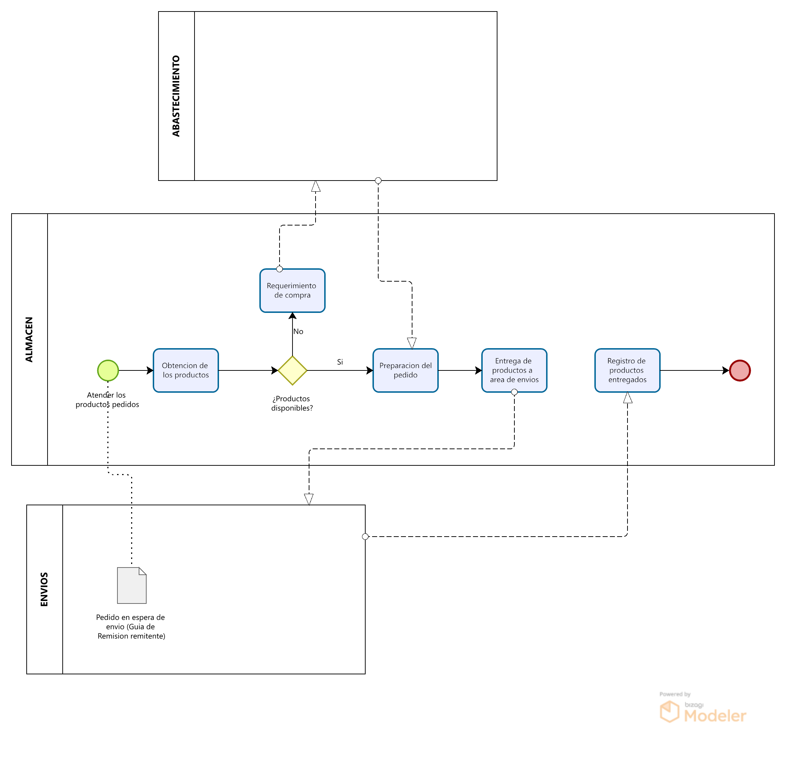
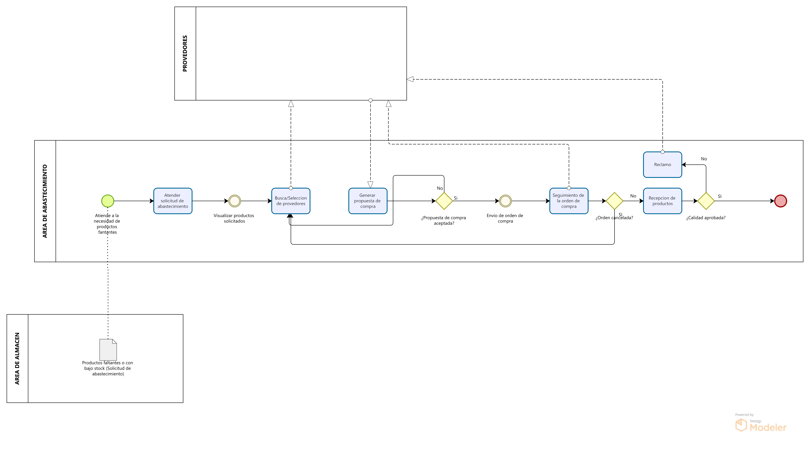
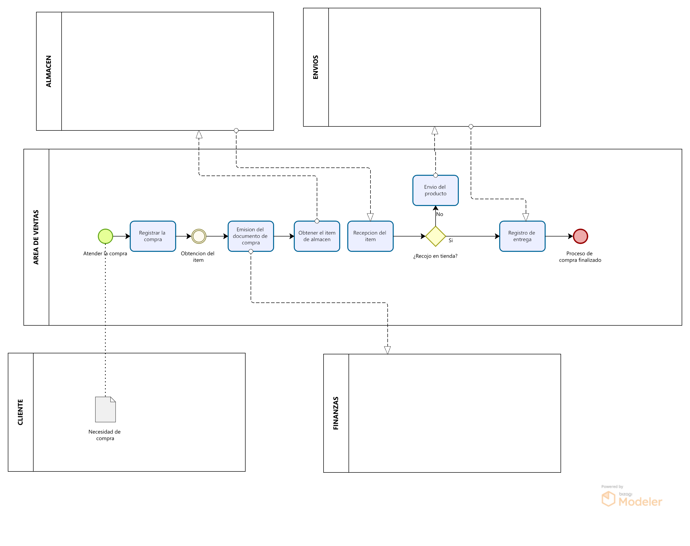

 
[**🔙 Atrás**](../1.2/1.2.md) | [**📜 Índice**](../../README.md)

# 1.3. Procesos de Negocio identificados

## MAPA DE PROCESOS

---

### Módulo 1: **Módulo de Clientes**

**Nombre del proceso:** Proceso de Gestión de Canje de Premios 
**Propósito:** Gestionar de manera integral el flujo de canje de premios por parte de un maestro de obra, desde la solicitud hasta la entrega final del premio. 
**Reglas de negocio clave:** 
* La solicitud de canje debe ser atendida por un responsable del proceso.
* El canje debe ser registrado en el sistema.
* La obtención del premio puede ser de dos tipos: recojo en tienda o envío.
* Si el canje es para envío, debe pasar por un proceso de verificación de entrega. 

**Actores o áreas involucradas:**
* Maestro: El cliente que solicita el canje de puntos.
* Área de Gestión de Clientes: El responsable del proceso interno que atiende, registra y gestiona la entrega del canje.
* Progresol: Posiblemente el proveedor o socio que gestiona la obtención de los premios.
* Envíos: El área o servicio externo encargado de la logística de entrega a domicilio.

| N° | Actividad | Descripción | Responsable | Entradas necesarias | Salidas generadas |
|----|-----------|-------------|-------------|---------------------|-------------------|
| 1 | Atender el canje | Recibir la solicitud de canje del maestro de obra. | Área de Gestión de Clientes | Solicitud de canje | Solicitud de canje procesada |
| 2 | Registrar el canje | Ingresar los detalles del canje en el sistema. | Área de Gestión de Clientes | Solicitud de canje procesada | Canje registrado |
| 3 | Obtención del item (premio) | Gestionar la disponibilidad y separación física del premio para el canje. | Área de Gestión de Clientes | Canje registrado | Item (premio) disponible |
| 4 | Enviar el canje a PROGRESOL | Transferir la solicitud de canje a la entidad PROGRESOL para su gestión. | Área de Gestión de Clientes | Canje registrado | Solicitud de canje en tránsito |
| 5 | Recepción del item (premio) | Recibir el premio por parte de PROGRESOL para continuar el proceso. | Área de Gestión de Clientes | Solicitud de canje en tránsito | Item (premio) recibido |
| 6 | ¿Recojo en tienda? | Decidir si el maestro recogerá el premio en la tienda o si se enviará a domicilio. | Área de Gestión de Clientes | Item (premio) recibido | Decisión de tipo de entrega |
| 7 | Envío del producto | Gestionar y preparar el envío del premio al domicilio del maestro. | Envíos | Decisión de tipo de entrega | Producto en tránsito |
| 8 | Verificación de entrega | Confirmar que el maestro ha recibido satisfactoriamente el premio. | Envíos | Producto en tránsito | Confirmación de entrega |
| 9 | Registro de entrega | Dejar constancia en el sistema de que el premio ha sido entregado. | Área de Gestión de Clientes | Confirmación de entrega | Entrega registrada |
| 10 | Proceso de canje finalizado | El proceso de canje se ha completado. | - | Entrega registrada | - |

---

### Módulo 2: **Módulo de Transporte**

**Nombre del proceso:** Proceso de Gestión de Pedidos y Transporte 
**Propósito:** Gestionar y optimizar el flujo logístico de los pedidos desde la venta inicial hasta la entrega final al cliente, coordinando la planificación, el transporte y la gestión de incidencias. 
**Reglas de negocio clave:** 
* El proceso inicia con un pedido confirmado por Ventas.
* Se debe clasificar cada producto como disponible en stock o en compra para determinar la ruta de despacho.
* Todos los pedidos deben ser monitoreados durante su ejecución y la entrega debe ser confirmada con un comprobante (PoD).
* Cualquier incidencia, como un faltante o rechazo, debe ser registrada y gestionada hasta su resolución. 

**Actores o áreas involucradas:**
* Área de Transporte: Responsable de la planificación, ejecución y monitoreo de las entregas.
* Abastecimiento: Coordina la entrega de productos en compra.
* Almacén: Prepara y entrega los pedidos listos para despacho.
* Cliente/Obra: Receptor final del pedido que confirma la entrega.
* Proveedor: Suministra los productos comprados.
* Ventas: Inicia el proceso de transporte al enviar el pedido del cliente.

| N° | Actividad | Descripción | Responsable | Entradas necesarias | Salidas generadas |
|----|-----------|-------------|-------------|---------------------|-------------------|
| 1 | V1. Enviar Pedido a Transporte | El área de Ventas notifica al módulo de Transporte sobre un pedido confirmado, incluyendo todos los detalles necesarios. | Jefe de Transporte | Pedido confirmado por Ventas | Pedido listo para importar |
| 2 | T1. Importar y clasificar ítems | El sistema de Transporte integra el pedido y clasifica cada producto como "En stock" (disponible) o "En compra". | Jefe de Transporte | Pedido importado | Pedido clasificado |
| 3 | T2. Marcar "Listo para planificar" | El sistema marca los productos que están en stock como listos para ser incluidos en una ruta de despacho. | Jefe de Transporte | Ítems "En stock" | Ítems listos para planificación |
| 4 | T3. Suscripción a ingreso a stock | El sistema crea una alerta para los productos "En compra", esperando su llegada al almacén para continuar con el proceso. | Jefe de Transporte | Ítems "En compra" | Alerta de stock |
| 5 | A1. Coordinar gestión de compra | Se coordina con el área de Abastecimiento el estado y la fecha de entrega de los productos que no están en stock. | Jefe de Transporte | Ítems "En compra" | Gestión de compra coordinada |
| 6 | T4. Planificar recogida proveedor→destino | Para los productos que deben ser recogidos del proveedor, se planifica la ruta y el vehículo para su transporte al almacén o a la obra. | Jefe de Transporte | Entrega a almacén/obra | Plan de inbound |
| 7 | T5. Registrar envío tercerizado | Cuando el proveedor entrega directamente a la obra, se registra este transporte externo y se actualiza el estado del pedido. | Jefe de Transporte | Proveedor entrega directo | Pedido con envío tercerizado |
| 8 | C1. Recepción de mercadería | El cliente o la obra recibe los productos directamente del proveedor y se genera un comprobante de entrega (PoD). | Cliente | Productos entregados | Comprobante de entrega (PoD) |
| 9 | T6. Confirmar ingreso/tercerizado y activar salida | Se actualiza el sistema al confirmar la entrada de productos a stock o la entrega tercerizada, activando la planificación de salida. | Jefe de Transporte | Ingreso/tercerización confirmada | Pedido activado para salida |
| 10 | T7. Planificar despachos y rutas | Se agrupan los pedidos por zona y fecha, y se crean rutas de despacho optimizadas, considerando capacidad y tiempo. | Jefe de Transporte | Pedidos listos para planificación | Rutas de despacho planificadas |
| 11 | T8. Asignar recursos y reservar bahía | Se asigna un vehículo y un conductor (o transportista externo) para la ruta, y se coordina un horario de carga con el almacén. | Jefe de Transporte | Rutas planificadas | Recursos asignados y bahía reservada |
| 12 | AL2. Confirmar ventana y emitir guía/picking | El almacén confirma el horario de carga y emite los documentos necesarios (guía de remisión y picking list) para la preparación del pedido. | Jefe de Transporte | Ventana/bahía coordinada | Guía y picking list emitidos |
| 13 | AL1. Preparar picking | El almacén se encarga de recolectar los productos del inventario según la lista de picking para su carga. | Almacén | Guía y picking list emitidos | Carga preparada |
| 14 | T9. Monitorear ejecución | Se hace seguimiento al estado de la entrega en tiempo real (en carga, en ruta, entregado) y se envían notificaciones al cliente. | Jefe de Transporte | Ruta en ejecución | Notificaciones de estado |
| 15 | T10. Registrar entrega y PoD | El conductor o transportista registra el recibo del pedido por parte del cliente y obtiene un comprobante (firma, foto). | Jefe de Transporte | Productos entregados al cliente | Comprobante de entrega (PoD) |
| 16 | T11. Registrar caso y PTR | Si la entrega es incompleta o hay algún problema, se abre un caso de incidencia y se genera un Pedido de Transporte de Reentrega (PTR). | Jefe de Transporte | Incidencia en la entrega | Caso de incidencia y PTR |
| 17 | T12. Replanificar y cerrar caso | Se planifica y ejecuta una nueva entrega para resolver la incidencia. Una vez resuelta, el caso se cierra. | Jefe de Transporte | PTR | Caso de incidencia cerrado |

---

### Módulo 3: **Módulo de Inventario**

**Nombre del proceso:** Proceso de Gestión de Pedidos y Almacén 
**Propósito:** Administrar el flujo de pedidos recibidos, asegurando la verificación de la disponibilidad de productos en el inventario, la preparación de los pedidos y su posterior entrega al área de envíos. 
**Reglas de negocio clave:** 
* Todo pedido debe ser atendido y verificado contra el stock disponible.
* Si no hay productos disponibles, se debe generar un requerimiento al área de Abastecimiento.
* Si hay productos disponibles, el pedido debe ser preparado y entregado al área de Envíos. 

**Actores o áreas involucradas:**
* Almacén: Área responsable de la gestión de inventario, verificación de stock y preparación de pedidos.
* Abastecimiento: Responsable de proporcionar los productos en caso de que el stock sea insuficiente.
* Envíos: Área que recibe los pedidos preparados por el Almacén para su posterior despacho.

| N° | Actividad | Descripción | Responsable | Entradas necesarias | Salidas generadas |
|----|-----------|-------------|-------------|---------------------|-------------------|
| 1 | Atender los pedidos | Recibir y procesar un pedido de productos, generalmente de otras áreas como Envíos. | Almacén | Pedido en espera de envío | Pedido procesado |
| 2 | Obtención de los productos | Recolectar físicamente los productos del almacén para el pedido. | Almacén | Pedido procesado | Productos identificados |
| 3 | ¿Productos disponibles? | Verificar si el stock de los productos del pedido es suficiente para completarlo. | Almacén | Productos identificados | Decisión de disponibilidad |
| 4 | Requerimiento de compra | Enviar una solicitud al área de Abastecimiento si no hay stock suficiente. | Almacén | Decisión de disponibilidad (No) | Solicitud de compra |
| 5 | Preparación del pedido | Empaquetar y etiquetar los productos para su entrega. | Almacén | Decisión de disponibilidad (Sí) | Pedido preparado |
| 6 | Entrega de productos a área de envíos | Transferir físicamente los productos preparados al área encargada del transporte. | Almacén | Pedido preparado | Productos listos para envío |
| 7 | Registro de productos entregados | Actualizar el sistema para reflejar que los productos han salido del inventario. | Almacén | Productos listos para envío | Stock actualizado |

---

### Módulo 4: **Módulo de Abastecimiento**

**Nombre del proceso:** Proceso de Gestión de Compras y Abastecimiento 
**Propósito:** Asegurar la disponibilidad de productos en el inventario, gestionando el ciclo de compra desde la detección de la necesidad hasta la recepción y aprobación de la calidad de los productos de los proveedores. 
**Reglas de negocio clave:** 
* El proceso se inicia con una necesidad de productos por parte del almacén.
* Debe haber una selección de proveedores y la generación de una orden de compra.
* Se debe verificar la calidad de los productos recibidos antes de ser aceptados en el inventario. 

**Actores o áreas involucradas:**
* Área de Abastecimiento: Responsable de la gestión completa del proceso de compra.
* Área de Almacén: Emite el requerimiento de productos faltantes o con bajo stock.
* Proveedores: Suministran los productos solicitados.

| N° | Actividad | Descripción | Responsable | Entradas necesarias | Salidas generadas |
|----|-----------|-------------|-------------|---------------------|-------------------|
| 1 | Atender la solicitud de abastecimiento | Recibir y procesar el requerimiento de productos del área de Almacén. | Área de Abastecimiento | Productos faltantes o con bajo stock | Solicitud de compra procesada |
| 2 | Visualizar productos solicitados | Revisar los detalles y especificaciones de los productos que se necesitan. | Área de Abastecimiento | Solicitud de compra procesada | Detalles del producto |
| 3 | Busca/Selección de proveedores | Identificar y elegir los proveedores que pueden suministrar los productos. | Área de Abastecimiento | Detalles del producto | Proveedor seleccionado |
| 4 | Generar orden de compra | Crear el documento formal para solicitar la compra de productos al proveedor. | Área de Abastecimiento | Proveedor seleccionado | Orden de compra |
| 5 | ¿Respuesta de compra aceptada? | Esperar la confirmación del proveedor para proceder con la orden. | Proveedores | Orden de compra | Confirmación de proveedor |
| 6 | Envío de orden de compra | Enviar la orden de compra aceptada al proveedor para que inicie el despacho. | Área de Abastecimiento | Confirmación de proveedor | Orden de compra enviada |
| 7 | Recepción de productos | Recibir los productos enviados por el proveedor en el almacén. | Área de Abastecimiento | Orden de compra enviada | Productos recibidos |
| 8 | ¿Calidad aprobada? | Inspeccionar los productos recibidos para verificar su calidad y estado. | Área de Abastecimiento | Productos recibidos | Decisión de calidad |
| 9 | Reclamo | Si la calidad no es aprobada, iniciar un proceso para notificar al proveedor y resolver la situación. | Área de Abastecimiento | Decisión de calidad (No) | Reclamo en curso |

---

### Módulo 5: **Módulo de Ventas**

**Nombre del proceso:** Proceso de Gestión de Ventas y Entrega al Cliente. 
**Propósito:** Administrar el ciclo de ventas completo, desde que un cliente expresa una necesidad hasta que el producto es entregado, ya sea en tienda o a domicilio. 
**Reglas de negocio clave:** 
* Una venta debe ser registrada antes de emitir la orden de compra.
* El proceso de obtención del producto debe completarse antes de la entrega al cliente.
* La entrega puede ser un recojo en tienda o un envío. 

**Actores o áreas involucradas:**
* Área de Ventas: Responsable de atender al cliente, registrar la venta y emitir la orden de compra.
* Cliente: El comprador que inicia el proceso con su necesidad.
* Almacén: Suministra los productos solicitados en la orden de compra.
* Envíos: Área encargada de la logística de entrega a domicilio.    
* Finanzas: Recibe la información del registro de la compra para su gestión financiera.

| N° | Actividad | Descripción | Responsable | Entradas necesarias | Salidas generadas |
|----|-----------|-------------|-------------|---------------------|-------------------|
| 1 | Atender la compra | Recibir la solicitud o necesidad de un producto por parte del cliente. | Área de Ventas | Necesidad de compra del cliente | Solicitud de compra procesada |
| 2 | Registrar la compra | Ingresar los detalles de la compra en el sistema, incluyendo productos y precios. | Área de Ventas | Solicitud de compra procesada | Venta registrada |
| 3 | Emisión de la orden de compra | Generar un documento formal para solicitar los productos al almacén. | Área de Ventas | Venta registrada | Orden de compra |
| 4 | Obtener el ítem del almacén | Recolectar físicamente los productos del inventario, basados en la orden de compra. | Almacén | Orden de compra | Productos preparados |
| 5 | Recepción del ítem | El área de ventas recibe los productos que fueron preparados en el almacén. | Área de Ventas | Productos preparados | Productos listos para entrega |
| 6 | ¿Recojo en tienda? | Preguntar al cliente si desea llevarse el producto en el momento o recibirlo a domicilio. | Área de Ventas | Productos listos para entrega | Decisión de entrega |
| 7 | Envío del producto | Gestionar el proceso de envío del producto al domicilio del cliente. | Envíos | Decisión de entrega (No) | Producto en tránsito |
| 8 | Registro de entrega | Dejar constancia en el sistema de que el producto ha sido entregado al cliente. | Área de Ventas | Decisión de entrega o confirmación de envío | Entrega registrada |
| 9 | Proceso de compra finalizado | El ciclo de ventas ha concluido. | - | Entrega registrada | - |

---