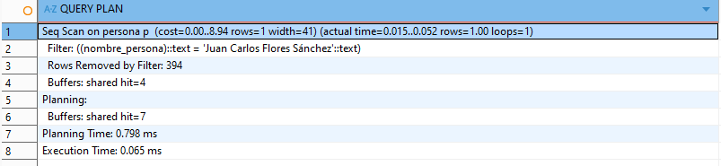
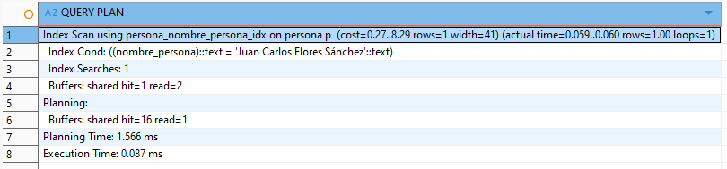
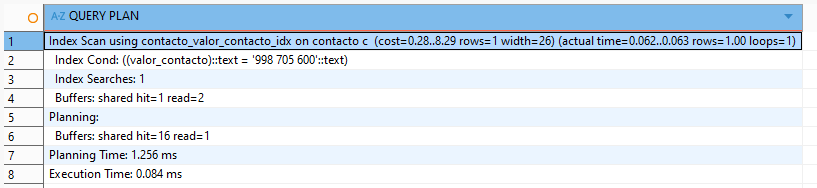
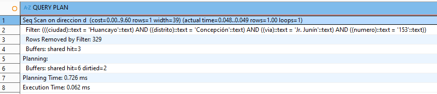
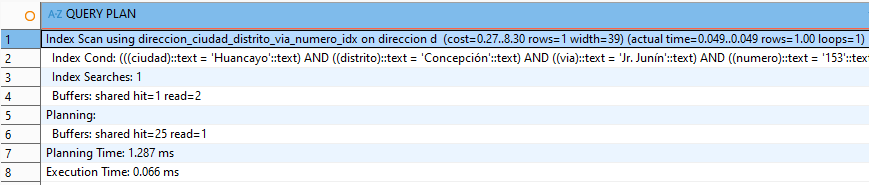

> [10. Objetos de Base de Datos](../../10.md) › [10.1. Índices](../10.1.md) › [10.1.1. Módulo 1 / Integrante 1](10.1.1.md)

# 10.1.1. Módulo 1 / Integrante 1

# Indices 🗃️
## Se da prioridad a tablas que presentaran gran cantidad de registros y que seran consultadas con regularidad

### Persona por NOMBRE_PERSONA

```sql
--SIN INDICE
EXPLAIN ANALYZE

SELECT * 
FROM MODULO_CLIENTES.PERSONA P 
WHERE P.NOMBRE_PERSONA = 'Juan Carlos Flores Sánchez';
```

```sql
--CREAMOS INDICE
CREATE INDEX ON MODULO_CLIENTES.PERSONA(NOMBRE_PERSONA);

--CON INDICE
EXPLAIN ANALYZE

SELECT * 
FROM MODULO_CLIENTES.PERSONA P 
WHERE P.NOMBRE_PERSONA = 'Juan Carlos Flores Sánchez';
  ```


### Contacto por VALOR_CONTACTO

```sql
--SIN INDICE
EXPLAIN ANALYZE

SELECT * 
FROM MODULO_CLIENTES.CONTACTO C 
WHERE C.VALOR_CONTACTO = '998 705 600';
```

```sql
--CREAMOS INDICE
CREATE INDEX ON MODULO_CLIENTES.CONTACTO (VALOR_CONTACTO);
--CON INDICE
EXPLAIN ANALYZE

SELECT * 
FROM MODULO_CLIENTES.CONTACTO C 
WHERE C.VALOR_CONTACTO = '998 705 600';
  ```


### Direccion por CIUDAD, DISTRITO, VIA, NUMERO

```sql
--SIN INDICE
EXPLAIN ANALYZE

SELECT * 
FROM MODULO_CLIENTES.DIRECCION D  
WHERE (D.CIUDAD, D.DISTRITO, D.VIA, D.NUMERO) = ('Huancayo', 'Concepción', 'Jr. Junín', '153');
```

```sql
--CREAMOS INDICE
CREATE INDEX ON MODULO_CLIENTES.DIRECCION(CIUDAD, DISTRITO, VIA, NUMERO);
--CON INDICE
EXPLAIN ANALYZE

SELECT * 
FROM MODULO_CLIENTES.DIRECCION D  
WHERE (D.CIUDAD, D.DISTRITO, D.VIA, D.NUMERO) = ('Huancayo', 'Concepción', 'Jr. Junín', '153');
  ```


[🏠 Home](../../../README.md) | [Siguiente ➡️](../10.1.2/10.1.2.md)
