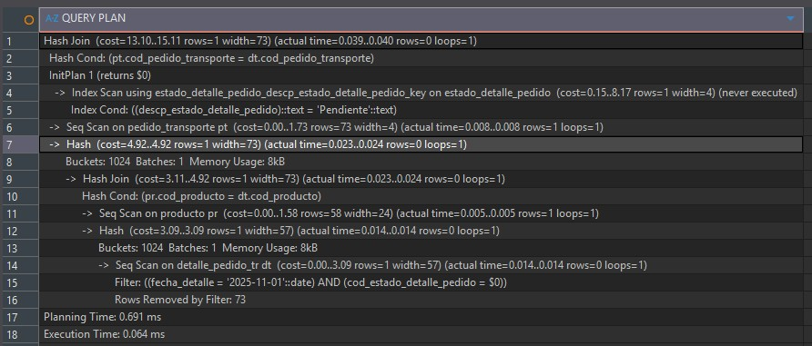
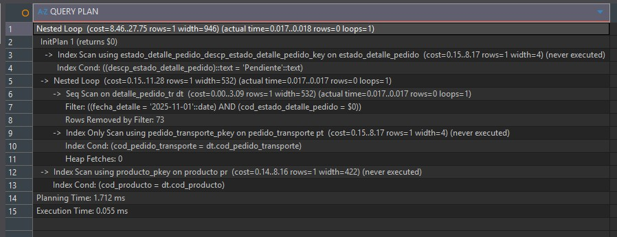
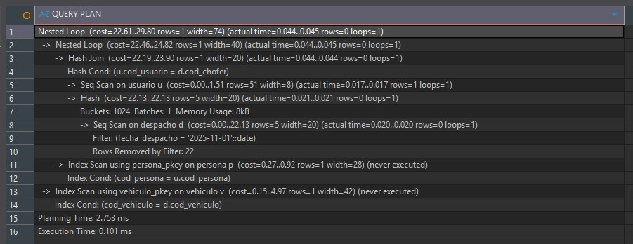
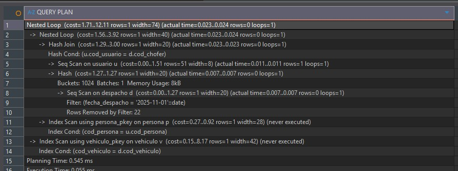
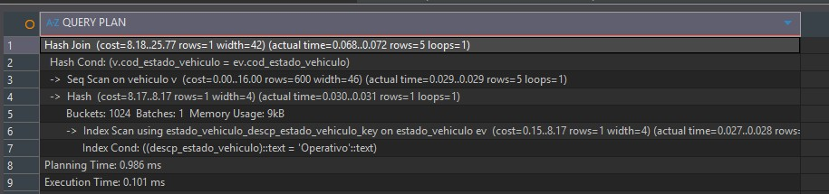
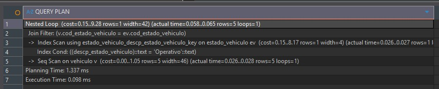

> [10. Objetos de Base de Datos](../../10.md) › [10.1. Índices](../10.1.md) › [10.1.2. Módulo 2 / Integrante 2](10.1.2.md)

# 10.1.2. Módulo 2 / Integrante 2

# Indices 🗃️

## Se da prioridad a tablas que presentarán gran cantidad de registros y que serán consultadas con regularidad en el flujo primario (Programación, Seguimiento y Reporte de Despachos).

### 1. DETALLE_PEDIDO_TR por fecha_detalle y cod_estado_detalle_pedido

Este índice es el más importante para el flujo primario. Se usa en **R-209 (Programar Despacho)** y **R-213 (Reporte Vista General)** para buscar todos los artículos que están 'Pendientes' en una `fecha_detalle` específica. Esta tabla crecerá mucho y será consultada constantemente.

```
--SIN INDICE
EXPLAIN ANALYZE
SELECT
    dt.cod_detalle_pedido_tr,
    pt.cod_pedido_transporte,
    pr.nombre_producto,
    dt.cantidad_detalle,
    dt.direccion_destino_pedido
FROM
    "FERRETERIA".DETALLE_PEDIDO_TR dt
JOIN
    "FERRETERIA".PEDIDO_TRANSPORTE pt ON dt.cod_pedido_transporte = pt.cod_pedido_transporte
JOIN
    "FERRETERIA".PRODUCTO pr ON dt.cod_producto = pr.cod_producto
WHERE
    dt.fecha_detalle = '2025-11-01' 
  AND
    dt.cod_estado_detalle_pedido = (SELECT cod_estado_detalle_pedido FROM "FERRETERIA".ESTADO_DETALLE_PEDIDO WHERE descp_estado_detalle_pedido = 'Pendiente');

```


```
--CREAMOS INDICE
CREATE INDEX idx_detalle_tr_fecha_estado
ON "FERRETERIA".DETALLE_PEDIDO_TR(fecha_detalle, cod_estado_detalle_pedido);

--CON INDICE
EXPLAIN ANALYZE
SELECT
    dt.cod_detalle_pedido_tr,
    pt.cod_pedido_transporte,
    pr.nombre_producto,
    dt.cantidad_detalle,
    dt.direccion_destino_pedido
FROM
    "FERRETERIA".DETALLE_PEDIDO_TR dt
JOIN
    "FERRETERIA".PEDIDO_TRANSPORTE pt ON dt.cod_pedido_transporte = pt.cod_pedido_transporte
JOIN
    "FERRETERIA".PRODUCTO pr ON dt.cod_producto = pr.cod_producto
WHERE
    dt.fecha_detalle = '2025-11-01'
  AND
    dt.cod_estado_detalle_pedido = (SELECT cod_estado_detalle_pedido FROM "FERRETERIA".ESTADO_DETALLE_PEDIDO WHERE descp_estado_detalle_pedido = 'Pendiente');

```


### 2. DESPACHO por fecha_despacho

Este índice es fundamental para el **R-213 (Reporte Vista General)**, ya que permite filtrar rápidamente todos los despachos programados para una fecha específica. También optimiza el **R-210 (Seguimiento)** al buscar los despachos del día.

```
--SIN INDICE
EXPLAIN ANALYZE
SELECT
    d.cod_despacho,
    p.nombre_persona AS "Operador",
    v.placa_vehiculo AS "Vehículo",
    d.hora_salida_estimada
FROM
    "FERRETERIA".DESPACHO d
JOIN
    "FERRETERIA".USUARIO u ON d.cod_chofer = u.cod_usuario
JOIN
    "FERRETERIA".PERSONA p ON u.cod_persona = p.cod_persona
JOIN
    "FERRETERIA".VEHICULO v ON d.cod_vehiculo = v.cod_vehiculo
WHERE
    d.fecha_despacho = '2025-11-01'; -- (Usar una fecha con datos de prueba)

```



```
--CREAMOS INDICE
CREATE INDEX idx_despacho_fecha ON "FERRETERIA".DESPACHO(fecha_despacho);

--CON INDICE
EXPLAIN ANALYZE
SELECT
    d.cod_despacho,
    p.nombre_persona AS "Operador",
    v.placa_vehiculo AS "Vehículo",
    d.hora_salida_estimada
FROM
    "FERRETERIA".DESPACHO d
JOIN
    "FERRETERIA".USUARIO u ON d.cod_chofer = u.cod_usuario
JOIN
    "FERRETERIA".PERSONA p ON u.cod_persona = p.cod_persona
JOIN
    "FERRETERIA".VEHICULO v ON d.cod_vehiculo = v.cod_vehiculo
WHERE
    d.fecha_despacho = '2025-11-01'; 

```


### 3. VEHICULO por cod_estado_vehiculo

Este índice se utiliza en el flujo de **R-209 (Programar Despacho)**, específicamente en el *wizard* para asignar recursos. La consulta busca todos los vehículos cuyo estado sea 'Operativo'.

```
--SIN INDICE
EXPLAIN ANALYZE
SELECT v.cod_vehiculo, v.placa_vehiculo
FROM "FERRETERIA".VEHICULO v
JOIN "FERRETERIA".ESTADO_VEHICULO ev ON v.cod_estado_vehiculo = ev.cod_estado_vehiculo
WHERE ev.descp_estado_vehiculo = 'Operativo';

```



```
--CREAMOS INDICE
CREATE INDEX idx_vehiculo_estado ON "FERRETERIA".VEHICULO(cod_estado_vehiculo);

--CON INDICE
EXPLAIN ANALYZE
SELECT v.cod_vehiculo, v.placa_vehiculo
FROM "FERRETERIA".VEHICULO v
JOIN "FERRETERIA".ESTADO_VEHICULO ev ON v.cod_estado_vehiculo = ev.cod_estado_vehiculo
WHERE ev.descp_estado_vehiculo = 'Operativo';

```


[⬅️ Anterior](../10.1.1/10.1.1.md) | [🏠 Home](../../../README.md) | [Siguiente ➡️](../10.1.3/10.1.3.md)
