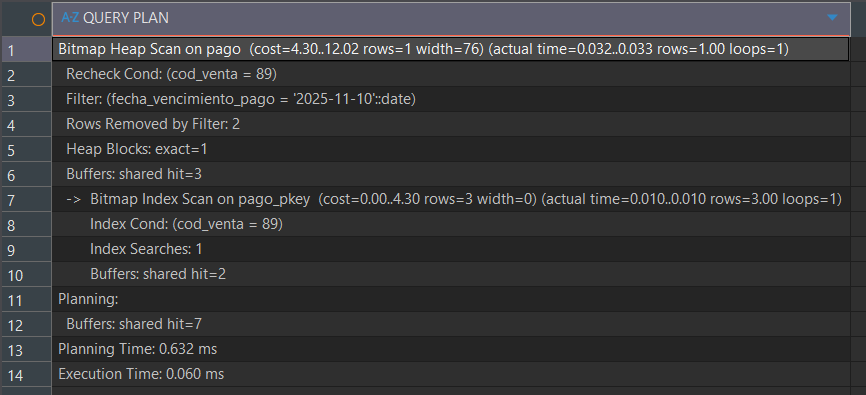
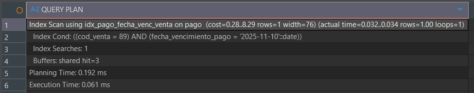
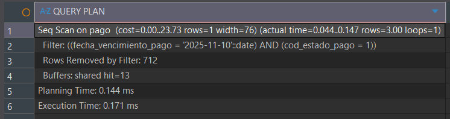
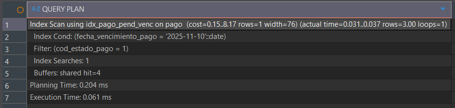
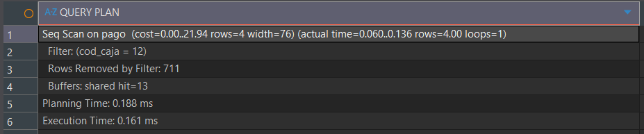
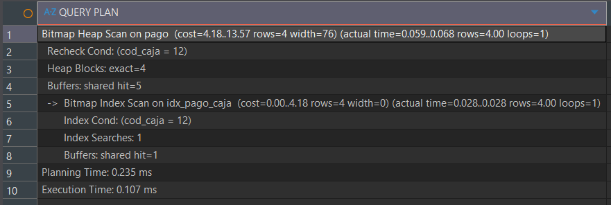
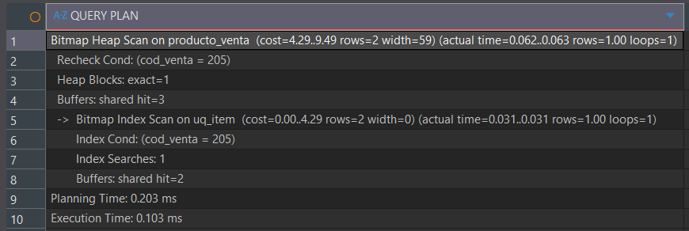
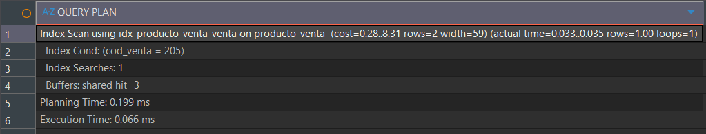
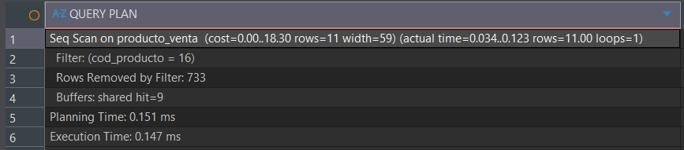
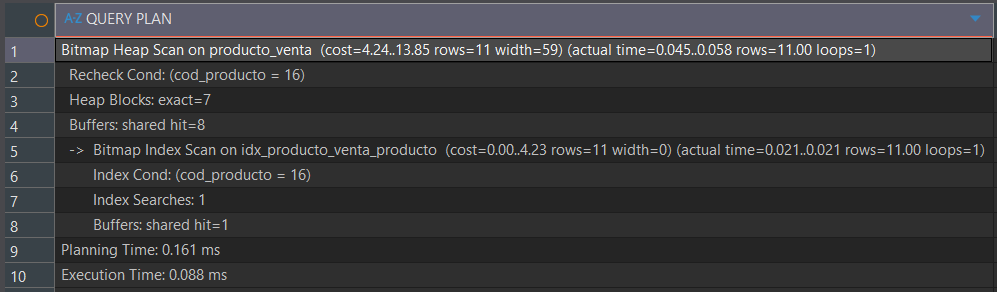

> [10. Objetos de Base de Datos](../../10.md) › [10.1. Índices](../10.1.md) › [10.1.5. Módulo 5 / Integrante 5](10.1.5.md)

# 10.1.5. Módulo 5: Ventas

## Índices

---

- Pagos por COD_VENTA y FECHA_VENCIMIENTO_PAGO
```sql
--ANTES
EXPLAIN ANALYZE 
SELECT * FROM pago WHERE fecha_vencimiento_pago = '2025-11-10' AND cod_venta = 89
```


```sql
CREATE INDEX idx_pago_fecha_venc_venta ON pago (cod_venta, fecha_vencimiento_pago);
--DESPUÉS
EXPLAIN ANALYZE 
SELECT * FROM pago WHERE fecha_vencimiento_pago = '2025-11-10' AND cod_venta = 89
```


---

- Pagos vencidos y pendientes por FECHA_VENCIMIENTO_PAGO y COD_ESTADO_PAGO
```sql
--ANTES
EXPLAIN ANALYZE 
SELECT * FROM pago WHERE fecha_vencimiento_pago = '2025-11-10' AND cod_estado_pago = 1
```


```sql
CREATE INDEX idx_pago_pend_venc ON pago (fecha_vencimiento_pago)
WHERE cod_estado_pago = 1 OR cod_estado_pago = 3;
--DESPUES
EXPLAIN ANALYZE 
SELECT * FROM pago WHERE fecha_vencimiento_pago = '2025-11-10' AND cod_estado_pago = 1
```


---

- Pagos de determinada caja por COD_CAJA

```sql
--ANTES
EXPLAIN ANALYZE 
SELECT * FROM pago WHERE cod_caja = 12
```


```sql
CREATE INDEX idx_pago_caja ON pago (cod_caja);
--DESPUÉS
EXPLAIN ANALYZE 
SELECT * FROM pago WHERE cod_caja = 12
```



---

- Detalles de venta (produco_venta) por venta realizada

```sql
--ANTES
EXPLAIN ANALYZE
SELECT * FROM producto_venta WHERE cod_venta = 205
```


```sql
CREATE INDEX idx_producto_venta_venta ON producto_venta (cod_venta);
--DESPUES
EXPLAIN ANALYZE
SELECT * FROM producto_venta WHERE cod_venta = 205
```


---

- Detalles de venta (produco_venta) por producto vendido

```sql
--ANTES
EXPLAIN ANALYZE
SELECT * FROM producto_venta WHERE cod_producto = 16
```


```sql
CREATE INDEX idx_producto_venta_producto ON producto_venta (cod_producto);
--DESPUES
EXPLAIN ANALYZE
SELECT * FROM producto_venta WHERE cod_producto = 16
```


[⬅️ Anterior](../10.1.4/10.1.4.md) | [🏠 Home](../../../README.md)