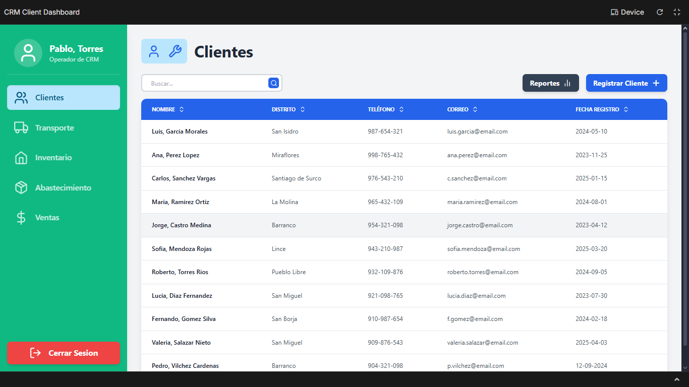
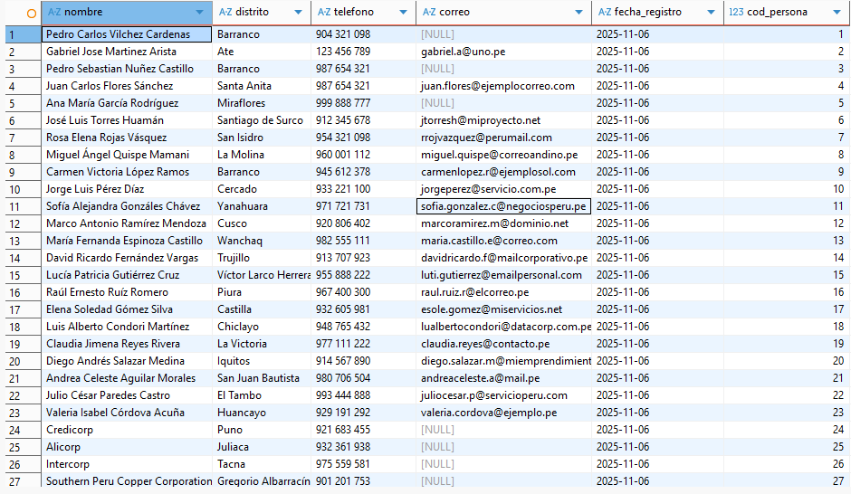
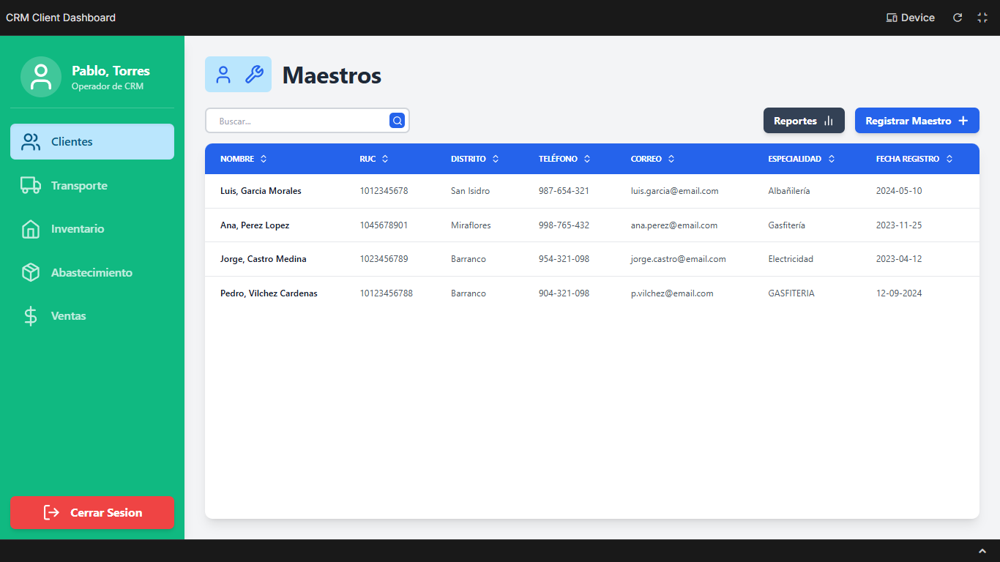
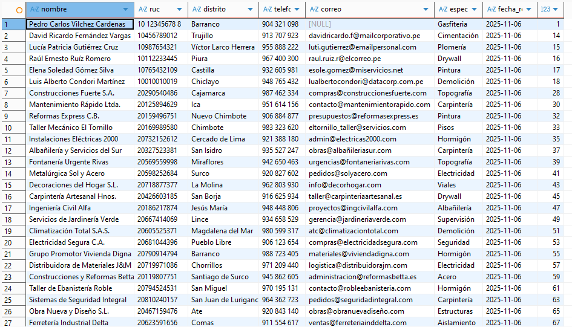
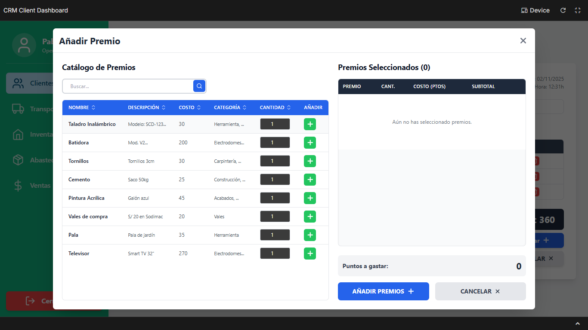
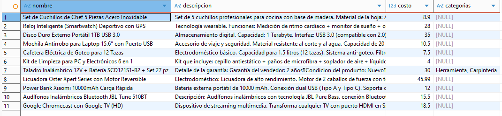

> [10. Objetos de Base de Datos](../../10.md) › [10.2. Vistas](../10.2.md) › [10.2.1. Módulo 1 / Integrante 1](10.2.1.md)

# 10.2.1. Módulo 1 / Integrante 1

# Vistas ​🖥️​
## Se da prioridad a consultas que se realizaran frecuentemente

### Vista pantalla de clientes: VISTA_CLIENTES_COMPLETA

```sql
CREATE OR REPLACE VIEW MODULO_CLIENTES.VISTA_CLIENTES_COMPLETA AS
SELECT
    P.nombre_persona AS Nombre,
    D_LAT.distrito AS Distrito,
    T_LAT.valor_contacto AS Telefono,
    E_LAT.valor_contacto AS Correo,
    TO_CHAR(C.fecha_registro_cliente, 'YYYY-MM-DD') AS Fecha_Registro,
    P.COD_PERSONA 
FROM
    MODULO_CLIENTES.CLIENTE C
JOIN
    MODULO_CLIENTES.PERSONA P ON C.cod_persona = P.cod_persona

LEFT JOIN LATERAL (
    SELECT D.distrito
    FROM MODULO_CLIENTES.DIRECCION_PERSONA DP
    JOIN MODULO_CLIENTES.DIRECCION D ON DP.cod_direccion = D.cod_direccion
    WHERE DP.cod_persona = P.cod_persona AND DP.PRINCIPAL_DIRECCION = TRUE
) AS D_LAT ON TRUE

LEFT JOIN LATERAL (
    SELECT CO.valor_contacto
    FROM MODULO_CLIENTES.CONTACTO_PERSONA COP
    JOIN MODULO_CLIENTES.CONTACTO CO ON COP.cod_contacto = CO.cod_contacto
    JOIN MODULO_CLIENTES.TIPO_CONTACTO TC ON CO.cod_tipo_contacto = TC.cod_tipo_contacto
    WHERE COP.cod_persona = P.cod_persona
      AND TC.valor_tipo_contacto = 'TELEFONO CELULAR'
      AND COP.PRINCIPAL_CONTACTO = (SELECT COD_TIPO_CONTACTO FROM MODULO_CLIENTES.TIPO_CONTACTO WHERE valor_tipo_contacto = 'TELEFONO CELULAR')
) AS T_LAT ON TRUE

LEFT JOIN LATERAL (
    SELECT CO.valor_contacto
    FROM MODULO_CLIENTES.CONTACTO_PERSONA COP
    JOIN MODULO_CLIENTES.CONTACTO CO ON COP.cod_contacto = CO.cod_contacto
    JOIN MODULO_CLIENTES.TIPO_CONTACTO TC ON CO.cod_tipo_contacto = TC.cod_tipo_contacto
    WHERE COP.cod_persona = P.cod_persona
      AND TC.valor_tipo_contacto = 'CORREO'
      AND COP.PRINCIPAL_CONTACTO = (SELECT COD_TIPO_CONTACTO FROM MODULO_CLIENTES.TIPO_CONTACTO WHERE valor_tipo_contacto = 'CORREO')
) AS E_LAT ON TRUE;

SELECT * FROM MODULO_CLIENTES.VISTA_CLIENTES_COMPLETA;
  ```



### Vista pantalla de maestros: VISTA_MAESTROS_COMPLETA

```sql
CREATE OR REPLACE VIEW MODULO_CLIENTES.VISTA_MAESTROS_COMPLETA AS
SELECT
    P.nombre_persona AS Nombre,
    M.ruc AS RUC,
    D_LAT.distrito AS Distrito,
    T_LAT.valor_contacto AS Telefono,
    E_LAT.valor_contacto AS Correo,
    ES_LAT.valor_especialidad AS Especialidad,
    TO_CHAR(M.FECHA_REGISTRO_MAESTRO , 'YYYY-MM-DD') AS Fecha_Registro,
    P.COD_PERSONA 
FROM
    MODULO_CLIENTES.MAESTRO M
JOIN
    MODULO_CLIENTES.PERSONA P ON M.cod_persona = P.cod_persona


LEFT JOIN LATERAL (
    SELECT D.distrito
    FROM MODULO_CLIENTES.DIRECCION_PERSONA DP
    JOIN MODULO_CLIENTES.DIRECCION D ON DP.cod_direccion = D.cod_direccion
    WHERE DP.cod_persona = P.cod_persona AND DP.PRINCIPAL_DIRECCION = TRUE
) AS D_LAT ON TRUE

LEFT JOIN LATERAL (
    SELECT CO.valor_contacto
    FROM MODULO_CLIENTES.CONTACTO_PERSONA COP
    JOIN MODULO_CLIENTES.CONTACTO CO ON COP.cod_contacto = CO.cod_contacto
    JOIN MODULO_CLIENTES.TIPO_CONTACTO TC ON CO.cod_tipo_contacto = TC.cod_tipo_contacto
    WHERE COP.cod_persona = P.cod_persona
      AND TC.valor_tipo_contacto = 'TELEFONO CELULAR'
      AND COP.PRINCIPAL_CONTACTO = (SELECT COD_TIPO_CONTACTO FROM MODULO_CLIENTES.TIPO_CONTACTO WHERE valor_tipo_contacto = 'TELEFONO CELULAR')
) AS T_LAT ON TRUE

LEFT JOIN LATERAL (
    SELECT CO.valor_contacto
    FROM MODULO_CLIENTES.CONTACTO_PERSONA COP
    JOIN MODULO_CLIENTES.CONTACTO CO ON COP.cod_contacto = CO.cod_contacto
    JOIN MODULO_CLIENTES.TIPO_CONTACTO TC ON CO.cod_tipo_contacto = TC.cod_tipo_contacto
    WHERE COP.cod_persona = P.cod_persona
      AND TC.valor_tipo_contacto = 'CORREO'
      AND COP.PRINCIPAL_CONTACTO = (SELECT COD_TIPO_CONTACTO FROM MODULO_CLIENTES.TIPO_CONTACTO WHERE valor_tipo_contacto = 'CORREO')
) AS E_LAT ON TRUE

LEFT JOIN LATERAL (
    SELECT ES.valor_especialidad
    FROM MODULO_CLIENTES.ESPECIALIDADES ES
    WHERE M.cod_especialidad = ES.cod_especialidad
) AS ES_LAT ON TRUE;

SELECT * FROM MODULO_CLIENTES.VISTA_MAESTROS_COMPLETA;
  ```



### Vista de premios: VISTA_CATALOGO_PREMIOS

```sql
SELECT 
P.NOMBRE_PREMIO AS NOMBRE,
P.DESCP_PREMIO AS DESCRIPCION,
P.PUNTOS_PREMIO AS COSTO,
STRING_AGG(C.VALOR_CATEGORIA, ', ') AS CATEGORIAS
FROM MODULO_CLIENTES.PREMIOS P 
LEFT JOIN MODULO_CLIENTES.CATEGORIAS_PREMIO CAP ON CAP.COD_PREMIO = P.COD_PREMIO 
LEFT JOIN MODULO_CLIENTES.CATEGORIA C ON CAP.COD_CATEGORIA = C.COD_CATEGORIA 
GROUP BY P.COD_PREMIO;

SELECT * FROM MODULO_CLIENTES.VISTA_CATALOGO_PREMIOS;
  ```




[🏠 Home](../../../README.md) | [Siguiente ➡️](../10.2.2/10.2.2.md)
