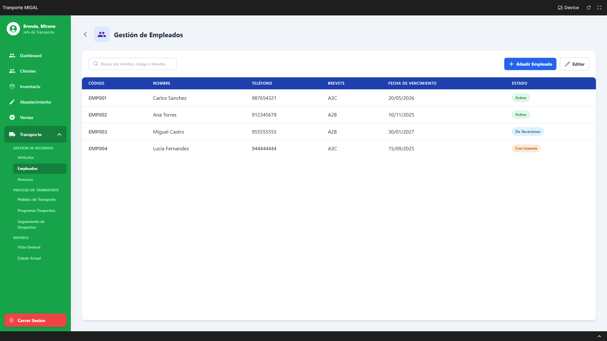
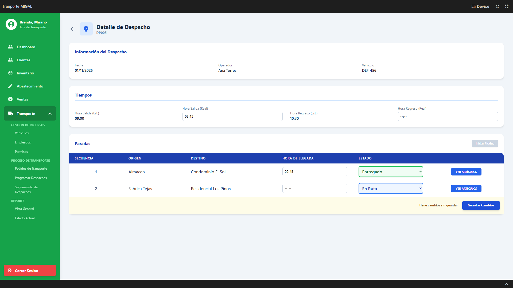

> [10. Objetos de Base de Datos](../../10.md) › [10.2. Vistas](../10.2.md) › [10.2.2. Módulo 2 / Integrante 2](10.2.2.md)

# 10.2.2. Módulo 2 / Integrante 2

# Vistas 🖥️

## Se da prioridad a consultas que se realizarán frecuentemente en el flujo primario del módulo.

### Vista pantalla de Gestión de Empleados (Choferes): VISTA_CHOFERES_COMPLETA

Esta vista simplifica la consulta de la pantalla "Gestión de Empleados" (R-204), uniendo `USUARIO`, `PERSONA`, `CHOFER`, `ESTADO_USUARIO` y `CONTACTO` para obtener la lista de operadores de transporte.

```
CREATE OR REPLACE VIEW "FERRETERIA".VISTA_CHOFERES_COMPLETA AS
SELECT
    u.cod_usuario,
    p.nombre_persona AS "Nombre",
    T_LAT.valor_contacto AS "Telefono",
    ch.categoria_brevete AS "Brevete",
    TO_CHAR(ch.vencimiento_brevete, 'YYYY-MM-DD') AS "Fecha_Vencimiento",
    esu.descp_estado_usuario AS "Estado"
FROM
    "FERRETERIA".USUARIO u
JOIN
    "FERRETERIA".PERSONA p ON u.cod_persona = p.cod_persona
JOIN
    "FERRETERIA".CHOFER ch ON u.cod_usuario = ch.cod_usuario
JOIN
    "FERRETERIA".ESTADO_USUARIO esu ON u.cod_estado_usuario = esu.cod_estado_usuario
JOIN
    "FERRETERIA".AREA a ON u.cod_area = a.cod_area
-- Se usa LATERAL JOIN para obtener el teléfono principal, imitando el estilo del Módulo 1
LEFT JOIN LATERAL (
    SELECT co.valor_contacto
    FROM "FERRETERIA".CONTACTO_PERSONA cop
    JOIN "FERRETERIA".CONTACTO co ON cop.cod_contacto = co.cod_contacto
    WHERE cop.cod_persona = p.cod_persona
      AND cop.principal_contacto = (SELECT cod_tipo_contacto FROM "FERRETERIA".TIPO_CONTACTO WHERE valor_tipo_contacto = 'Telefono')
) AS T_LAT ON TRUE
WHERE
    a.valor_area = 'Transporte'; -- Asegura que solo se listen usuarios del área de Transporte

SELECT * FROM "FERRETERIA".VISTA_CHOFERES_COMPLETA;

```



### Vista pantalla de Seguimiento de Despachos: VISTA_SEGUIMIENTO_DESPACHOS

Esta vista es esencial para el flujo primario (R-210). Simplifica la consulta de la pantalla de monitoreo principal, uniendo `DESPACHO` con el `OPERADOR` (Chofer), `VEHICULO` y `ESTADO` para mostrar todas las rutas.

```
CREATE OR REPLACE VIEW "FERRETERIA".VISTA_SEGUIMIENTO_DESPACHOS AS
SELECT
    d.cod_despacho,
    TO_CHAR(d.fecha_despacho, 'YYYY-MM-DD') AS "Fecha",
    p.nombre_persona AS "Operador",
    v.placa_vehiculo AS "Vehiculo",
    TO_CHAR(d.hora_salida_estimada, 'HH24:MI') AS "Salida_Est",
    TO_CHAR(d.hora_regreso_estimada, 'HH24:MI') AS "Regreso_Est",
    ed.descp_estado_despacho AS "Estado",
    -- IDs internos para los botones de la UI
    d.cod_estado_despacho,
    d.cod_chofer,
    d.cod_vehiculo
FROM
    "FERRETERIA".DESPACHO d
JOIN
    "FERRETERIA".USUARIO u ON d.cod_chofer = u.cod_usuario
JOIN
    "FERRETERIA".PERSONA p ON u.cod_persona = p.cod_persona
JOIN
    "FERRETERIA".VEHICULO v ON d.cod_vehiculo = v.cod_vehiculo
JOIN
    "FERRETERIA".ESTADO_DESPACHO ed ON d.cod_estado_despacho = ed.cod_estado_despacho;

SELECT * FROM "FERRETERIA".VISTA_SEGUIMIENTO_DESPACHOS ORDER BY "Fecha" DESC;

```



### Vista pantalla de Artículos Pendientes: VISTA_ARTICULOS_PENDIENTES

Esta vista es el motor del R-209 (Programar Despacho). Encapsula la lógica para encontrar todos los artículos (`DETALLE_PEDIDO_TR`) que están en estado 'Pendiente' (o listos para programar), uniendo la información del producto y el turno.

```
CREATE OR REPLACE VIEW "FERRETERIA".VISTA_ARTICULOS_PENDIENTES AS
SELECT
    dt.cod_detalle_pedido_tr,
    dt.fecha_detalle,
    pt.cod_pedido_transporte AS "Pedido",
    pr.nombre_producto AS "Producto",
    dt.cantidad_detalle AS "Cantidad",
    dt.direccion_origen_pedido AS "Origen",
    dt.direccion_destino_pedido AS "Destino",
    tt.descp_turno AS "Turno",
    pr.cod_producto -- ID interno
FROM
    "FERRETERIA".DETALLE_PEDIDO_TR dt
JOIN
    "FERRETERIA".ESTADO_DETALLE_PEDIDO edt ON dt.cod_estado_detalle_pedido = edt.cod_estado_detalle_pedido
JOIN
    "FERRETERIA".PEDIDO_TRANSPORTE pt ON dt.cod_pedido_transporte = pt.cod_pedido_transporte
JOIN
    "FERRETERIA".PRODUCTO pr ON dt.cod_producto = pr.cod_producto
LEFT JOIN
    "FERRETERIA".TURNO_TRANSPORTE tt ON dt.cod_turno = tt.cod_turno
WHERE
    edt.descp_estado_detalle_pedido = 'Pendiente'; -- Filtro clave de la vista

-- La consulta en la app se haría así:
SELECT * FROM "FERRETERIA".VISTA_ARTICULOS_PENDIENTES
WHERE fecha_detalle = '2025-11-01'; -- (Usar una fecha con datos de prueba)

```


[⬅️ Anterior](../10.2.1/10.2.1.md) | [🏠 Home](../../../README.md) | [Siguiente ➡️](../10.2.3/10.2.3.md)
