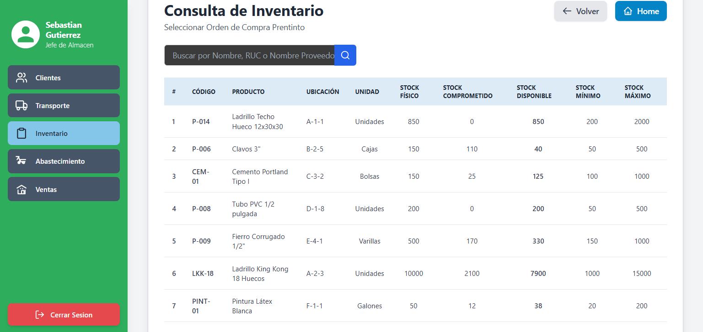

> [10. Objetos de Base de Datos](../../10.md) › [10.2. Vistas](../10.2.md) › [10.2.3. Módulo 3 / Integrante 3](10.2.3.md)

# 10.2.3. Módulo 3 / Integrante 3

# Vistas

## Se da prioridad a consultas que se realizaran frecuentemente en los flujos primarios del módulo.

### 1. Vista pantalla de Consulta de Inventario: VISTA_CONSULTA_INVENTARIO

Esta vista es fundamental para los flujos **R-305 (Consulta de Inventario)** y **R-304 (Control de Stock)**. Simplifica la consulta principal del almacén, uniendo `INVENTARIO`, `PRODUCTO` y `UBICACION` para mostrar el stock detallado y calculado en tiempo real.

```sql
CREATE OR REPLACE VIEW "FERRETERIA".VISTA_CONSULTA_INVENTARIO AS
SELECT
    p.cod_producto_fmt AS "Codigo",
    p.nombre_producto AS "Producto",
    u.cod_ubicacion_calculado AS "Ubicacion",
    p.unidad_medida AS "Unidad",
    i.stock_fisico AS "Stock_Fisico",
    i.stock_comprometido AS "Stock_Comprometido",
    -- El stock disponible se calcula en la vista
    (i.stock_fisico - i.stock_comprometido) AS "Stock_Disponible",
    i.stock_minimo AS "Stock_Minimo",
    i.stock_maximo AS "Stock_Maximo",
    -- Se añade la lógica de alerta para R-304
    CASE
        WHEN (i.stock_fisico - i.stock_comprometido) < i.stock_minimo THEN 'Reponer'
        ELSE 'Normal'
    END AS "Alerta",
    -- IDs internos para la aplicación
    i.cod_inventario,
    p.cod_producto,
    u.cod_ubicacion
FROM "FERRETERIA".inventario i
JOIN "FERRETERIA".producto p ON i.cod_producto = p.cod_producto
JOIN "FERRETERIA".ubicacion u ON i.cod_ubicacion = u.cod_ubicacion;

-- La consulta en la app se haría así:
SELECT * FROM "FERRETERIA".VISTA_CONSULTA_INVENTARIO
WHERE "Producto" ILIKE '%cemento%';

```


### 2. Vista pantalla de Tareas de Recepción: VISTA_TAREAS_RECEPCION

Esta vista alimenta la bandeja de tareas del operador para el flujo **R-302 (Recepción y Auditoría)**. Une la `RESERVA_ALMACEN` con sus operadores, cupos y la `RECEPCION` asociada, mostrando al operador solo las tareas que le competen.

```sql
CREATE OR REPLACE VIEW "FERRETERIA".VISTA_TAREAS_RECEPCION AS
SELECT
    r.cod_reserva AS "ID_Reserva",
    r.tipo_reserva AS "Tipo_Reserva",
    c.fecha_cupo AS "Fecha",
    t.hora_inicio AS "Hora",
    i.nombre_instalacion AS "Instalacion",
    r.estado AS "Estado",
    rec.placa_vehiculo_entrega AS "Placa",
    rec.nombre_conductor_entrega AS "Conductor",
    -- IDs internos para la aplicación
    op.cod_usuario,
    r.cod_recepcion
FROM "FERRETERIA".reserva_almacen r
JOIN "FERRETERIA".operador_reserva_almacen op ON r.cod_reserva = op.cod_reserva
JOIN "FERRETERIA".cupo_disponible c ON r.cod_cupo = c.cod_cupo
JOIN "FERRETERIA".turno_almacen t ON c.cod_turno = t.cod_turno
JOIN "FERRETERIA".instalacion i ON c.cod_instalacion = i.cod_instalacion
JOIN "FERRETERIA".recepcion rec ON r.cod_recepcion = rec.cod_recepcion
WHERE
    r.tipo_reserva = 'Recepcion';

-- La consulta en la app se haría así:
SELECT * FROM "FERRETERIA".VISTA_TAREAS_RECEPCION
WHERE "Estado" IN ('Confirmado', 'En Proceso') AND cod_usuario = 10; -- (ID del operador logueado)

```


### 3. Vista pantalla de Reporte de Movimientos (Kardex): VISTA_KARDEX_MOVIMIENTOS

Esta es la vista más compleja y es crucial para el **R-308 (Reporte Kardex)**. Encapsula toda la lógica para trazar el origen de cada `MOVIMIENTO` (ya sea una Recepción, un Conteo, una Venta, etc.), presentando un historial limpio del producto.

```sql
CREATE OR REPLACE VIEW "FERRETERIA".VISTA_KARDEX_MOVIMIENTOS AS
SELECT
    p.cod_producto,
    p.nombre_producto,
    i.cod_inventario,
    u.cod_ubicacion_calculado,
    m.fecha_movimiento,
    m.hora_movimiento,
    m.tipo_movimiento,
    m.cantidad,
    -- Lógica para determinar el origen del movimiento
    CASE
        WHEN m.cod_detalle_recepcion IS NOT NULL THEN 'Recepción: ' || rec.cod_recepcion::text
        WHEN m.cod_detalle_conteo IS NOT NULL THEN 'Conteo: ' || con.cod_conteo::text
        WHEN m.cod_venta IS NOT NULL THEN 'Venta: ' || v.cod_venta_fmt
        ELSE 'Ajuste Manual'
    END AS "Origen_Movimiento"
FROM "FERRETERIA".movimiento m
JOIN "FERRETERIA".inventARIO i ON m.cod_inventario = i.cod_inventario
JOIN "FERRETERIA".producto p ON i.cod_producto = p.cod_producto
JOIN "FERRETERIA".ubicacion u ON i.cod_ubicacion = u.cod_ubicacion
-- Joins para encontrar el origen
LEFT JOIN "FERRETERIA".detalle_recepcion dr ON m.cod_detalle_recepcion = dr.cod_detalle_recepcion
LEFT JOIN "FERRETERIA".recepcion rec ON dr.cod_recepcion = rec.cod_recepcion
LEFT JOIN "FERRETERIA".detalle_conteo dc ON m.cod_detalle_conteo = dc.cod_detalle_conteo
LEFT JOIN "FERRETERIA".conteo con ON dc.cod_conteo = con.cod_conteo
LEFT JOIN "FERRETERIA".venta v ON m.cod_venta = v.cod_venta;

-- La consulta en la app se haría así:
SELECT * FROM "FERRETERIA".VISTA_KARDEX_MOVIMIENTOS
WHERE nombre_producto ILIKE '%cemento%'
ORDER BY fecha_movimiento DESC, hora_movimiento DESC;

```
---


[⬅️ Anterior](../10.2.2/10.2.2.md) | [🏠 Home](../../../README.md) | [Siguiente ➡️](../10.2.4/10.2.4.md)
