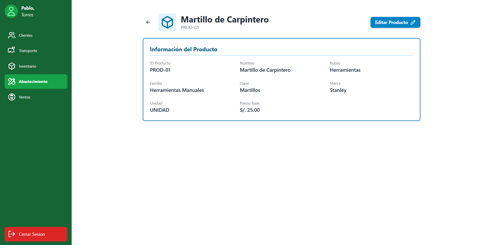
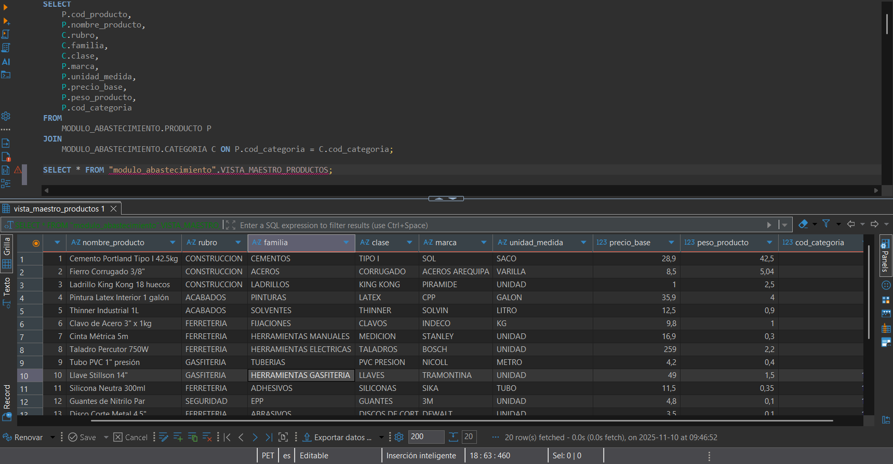
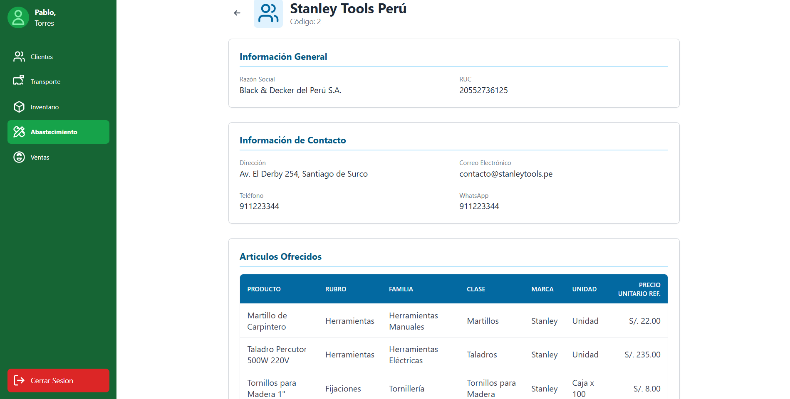
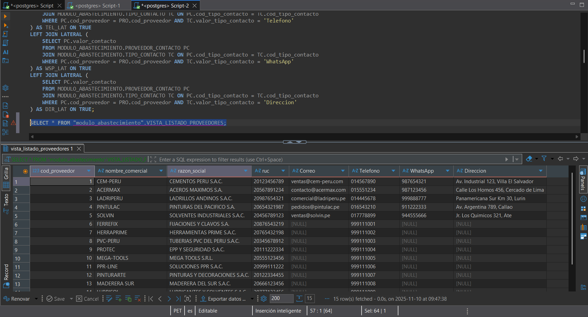
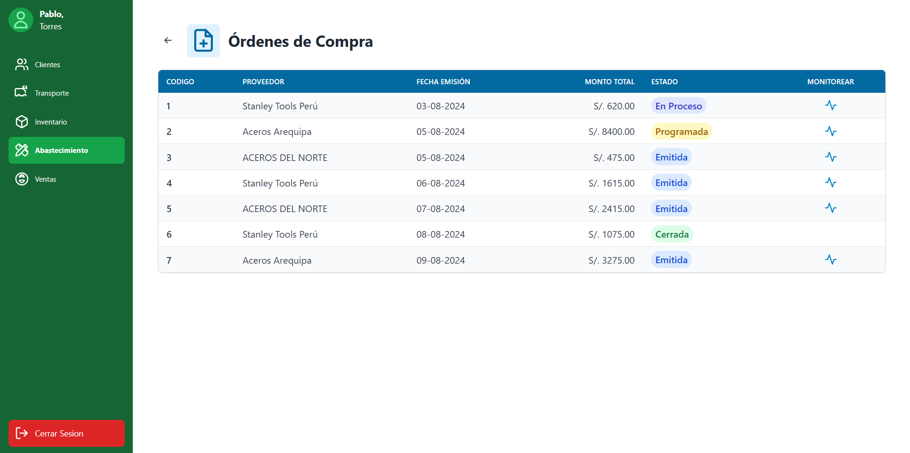
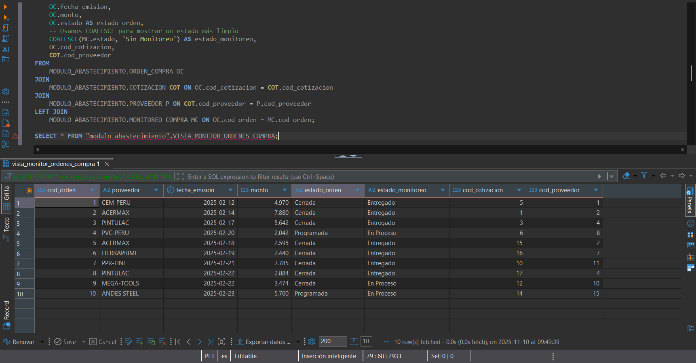
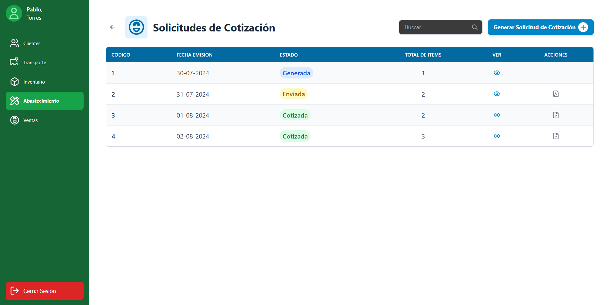
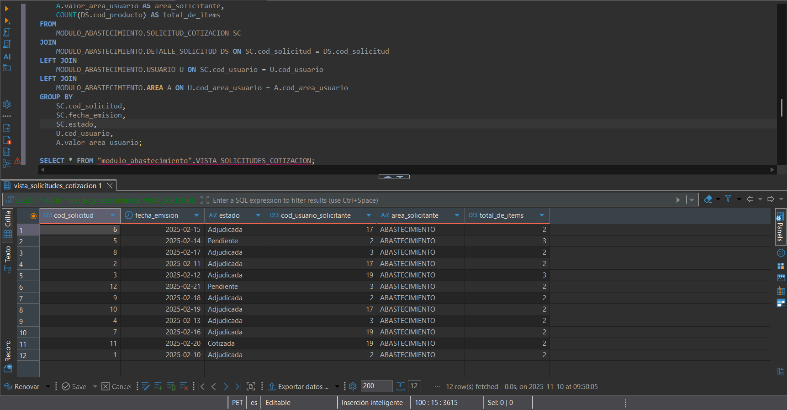
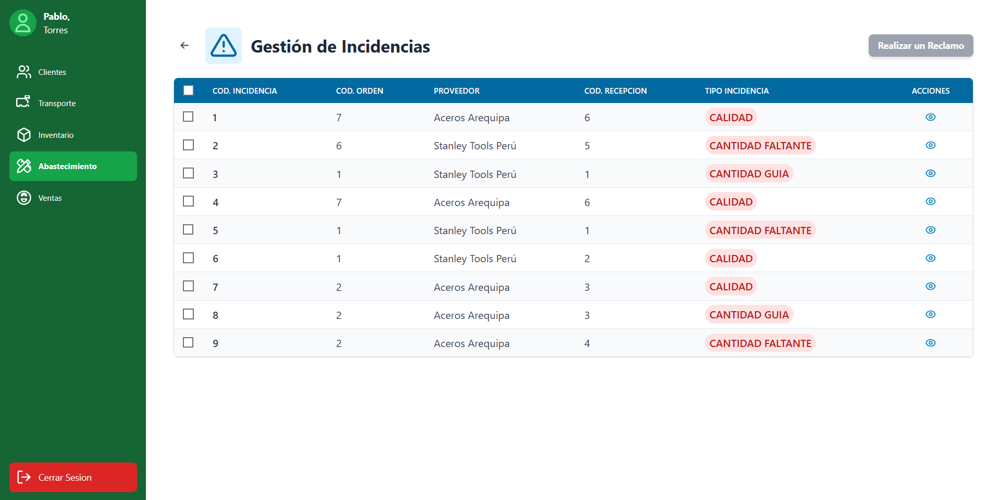
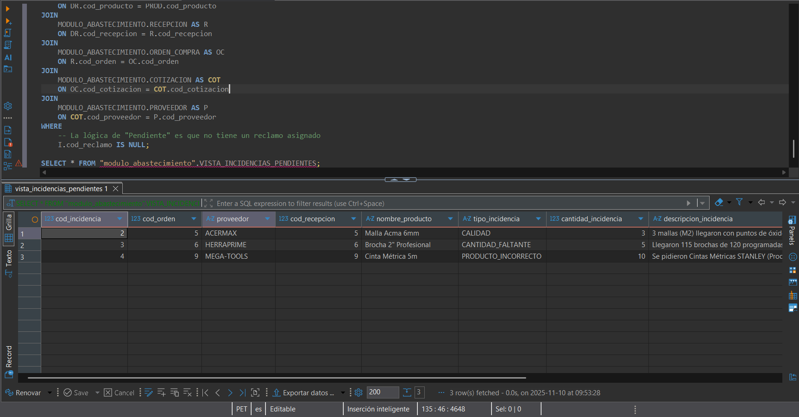

> [10. Objetos de Base de Datos](../../10.md) › [10.2. Vistas](../10.2.md) › [10.2.4. Módulo 4 / Integrante 4](10.2.4.md)

# 10.2.4. Módulo 4 / Integrante 4

# Vistas del Módulo de Abastecimiento ​🚚​

## Se da prioridad a consultas complejas que se realizarán frecuentemente en las pantallas principales.

---

### Vista 1: Maestro de Productos (I-007)
**Propósito:** Provee un listado completo de todos los productos con su información de categoría, listo para ser usado en la pantalla de "Maestro de Productos" (I-007) y en todos los buscadores de productos.

```sql
CREATE OR REPLACE VIEW MODULO_ABASTECIMIENTO.VISTA_MAESTRO_PRODUCTOS AS
SELECT
    P.cod_producto,
    P.nombre_producto,
    C.rubro,
    C.familia,
    C.clase,
    P.marca,
    P.unidad_medida,
    P.precio_base,
    P.peso_producto,
    P.cod_categoria
FROM
    MODULO_ABASTECIMIENTO.PRODUCTO P
JOIN
    MODULO_ABASTECIMIENTO.CATEGORIA C ON P.cod_categoria = C.cod_categoria;
```



### Vista 2: Listado de Proveedores (I-001, I-005)
Propósito: Esta vista muestra los datos principales del proveedor y pivota su información de contacto (correo, teléfono, dirección) en columnas para un fácil acceso, como se ve en la pantalla de edición (I-005).

```sql
CREATE OR REPLACE VIEW MODULO_ABASTECIMIENTO.VISTA_LISTADO_PROVEEDORES AS
SELECT
    PRO.cod_proveedor,
    PRO.nombre_comercial,
    PRO.razon_social,
    PRO.ruc,
    EMAIL_LAT.valor_contacto AS "Correo",
    TEL_LAT.valor_contacto AS "Telefono",
    WSP_LAT.valor_contacto AS "WhatsApp",
    DIR_LAT.valor_contacto AS "Direccion"
FROM
    MODULO_ABASTECIMIENTO.PROVEEDOR PRO
LEFT JOIN LATERAL (
    SELECT PC.valor_contacto
    FROM MODULO_ABASTECIMIENTO.PROVEEDOR_CONTACTO PC
    JOIN MODULO_ABASTECIMIENTO.TIPO_CONTACTO TC ON PC.cod_tipo_contacto = TC.cod_tipo_contacto
    WHERE PC.cod_proveedor = PRO.cod_proveedor AND TC.valor_tipo_contacto = 'Correo'
) AS EMAIL_LAT ON TRUE
LEFT JOIN LATERAL (
    SELECT PC.valor_contacto
    FROM MODULO_ABASTECIMIENTO.PROVEEDOR_CONTACTO PC
    JOIN MODULO_ABASTECIMIENTO.TIPO_CONTACTO TC ON PC.cod_tipo_contacto = TC.cod_tipo_contacto
    WHERE PC.cod_proveedor = PRO.cod_proveedor AND TC.valor_tipo_contacto = 'Telefono'
) AS TEL_LAT ON TRUE
LEFT JOIN LATERAL (
    SELECT PC.valor_contacto
    FROM MODULO_ABASTECIMIENTO.PROVEEDOR_CONTACTO PC
    JOIN MODULO_ABASTECIMIENTO.TIPO_CONTACTO TC ON PC.cod_tipo_contacto = TC.cod_tipo_contacto
    WHERE PC.cod_proveedor = PRO.cod_proveedor AND TC.valor_tipo_contacto = 'WhatsApp'
) AS WSP_LAT ON TRUE
LEFT JOIN LATERAL (
    SELECT PC.valor_contacto
    FROM MODULO_ABASTECIMIENTO.PROVEEDOR_CONTACTO PC
    JOIN MODULO_ABASTECIMIENTO.TIPO_CONTACTO TC ON PC.cod_tipo_contacto = TC.cod_tipo_contacto
    WHERE PC.cod_proveedor = PRO.cod_proveedor AND TC.valor_tipo_contacto = 'Direccion'
) AS DIR_LAT ON TRUE;
```


### Vista 3: Monitor de Órdenes de Compra (I-018)
Propósito: Es la vista principal para la pantalla de "Seguimiento de Compras" (I-018). Consolida la orden de compra, el proveedor y el estado del monitoreo en una sola consulta.
```sql
CREATE OR REPLACE VIEW MODULO_ABASTECIMIENTO.VISTA_MONITOR_ORDENES_COMPRA AS
SELECT
    OC.cod_orden,
    P.nombre_comercial AS proveedor,
    OC.fecha_emision,
    OC.monto,
    OC.estado AS estado_orden,
    -- Usamos COALESCE para mostrar un estado más limpio
    COALESCE(MC.estado, 'Sin Monitoreo') AS estado_monitoreo,
    OC.cod_cotizacion,
    COT.cod_proveedor
FROM
    MODULO_ABASTECIMIENTO.ORDEN_COMPRA OC
JOIN
    MODULO_ABASTECIMIENTO.COTIZACION COT ON OC.cod_cotizacion = COT.cod_cotizacion
JOIN
    MODULO_ABASTECIMIENTO.PROVEEDOR P ON COT.cod_proveedor = P.cod_proveedor
LEFT JOIN
    MODULO_ABASTECIMIENTO.MONITOREO_COMPRA MC ON OC.cod_orden = MC.cod_orden;

```


### Vista 4: Listado de Solicitudes de Cotización (I-011, I-013, I-015)
Propósito: Se usa en múltiples pantallas (I-011, I-013, I-015) para mostrar el listado de solicitudes, quién la generó, su área y cuántos items tiene.

```sql
CREATE OR REPLACE VIEW MODULO_ABASTECIMIENTO.VISTA_SOLICITUDES_COTIZACION AS
SELECT
    SC.cod_solicitud,
    SC.fecha_emision,
    SC.estado,
    U.cod_usuario AS cod_usuario_solicitante,
    A.valor_area_usuario AS area_solicitante,
    COUNT(DS.cod_producto) AS total_de_items
FROM
    MODULO_ABASTECIMIENTO.SOLICITUD_COTIZACION SC
JOIN
    MODULO_ABASTECIMIENTO.DETALLE_SOLICITUD DS ON SC.cod_solicitud = DS.cod_solicitud
LEFT JOIN
    MODULO_ABASTECIMIENTO.USUARIO U ON SC.cod_usuario = U.cod_usuario
LEFT JOIN
    MODULO_ABASTECIMIENTO.AREA A ON U.cod_area_usuario = A.cod_area_usuario
GROUP BY
    SC.cod_solicitud,
    SC.fecha_emision,
    SC.estado,
    U.cod_usuario,
    A.valor_area_usuario;

```


### Vista 5: Panel de Incidencias Pendientes (I-021)
Propósito: Esta es una vista crucial para la pantalla "Gestionar Reclamos" (I-021). Muestra todas las incidencias que aún no han sido agrupadas en un reclamo formal, uniendo toda la información necesaria (Producto, Proveedor, Orden, Recepción).

```sql
CREATE OR REPLACE VIEW MODULO_ABASTECIMIENTO.VISTA_INCIDENCIAS_PENDIENTES AS
SELECT
    I.cod_incidencia,
    R.cod_orden,
    P.nombre_comercial AS proveedor,
    R.cod_recepcion,
    PROD.nombre_producto,
    I.tipo_incidencia,
    I.cantidad_incidencia,
    I.descripcion_incidencia,
    I.cod_detalle_recepcion,
    COT.cod_proveedor,
    PROD.cod_producto
FROM
    MODULO_ABASTECIMIENTO.INCIDENCIA AS I
JOIN
    MODULO_ABASTECIMIENTO.DETALLE_RECEPCION AS DR 
    ON I.cod_detalle_recepcion = DR.cod_detalle_recepcion
JOIN
    MODULO_ABASTECIMIENTO.PRODUCTO AS PROD
    ON DR.cod_producto = PROD.cod_producto
JOIN
    MODULO_ABASTECIMIENTO.RECEPCION AS R 
    ON DR.cod_recepcion = R.cod_recepcion
JOIN
    MODULO_ABASTECIMIENTO.ORDEN_COMPRA AS OC 
    ON R.cod_orden = OC.cod_orden
JOIN
    MODULO_ABASTECIMIENTO.COTIZACION AS COT 
    ON OC.cod_cotizacion = COT.cod_cotizacion
JOIN
    MODULO_ABASTECIMIENTO.PROVEEDOR AS P 
    ON COT.cod_proveedor = P.cod_proveedor
WHERE
    -- La lógica de "Pendiente" es que no tiene un reclamo asignado
    I.cod_reclamo IS NULL;
```


---

[⬅️ Anterior](../10.2.3/10.2.3.md) | [🏠 Home](../../../README.md) | [Siguiente ➡️](../10.2.5/10.2.5.md)
