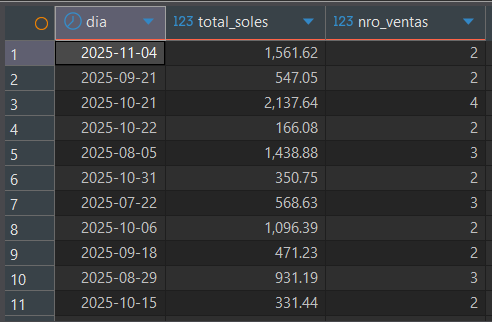
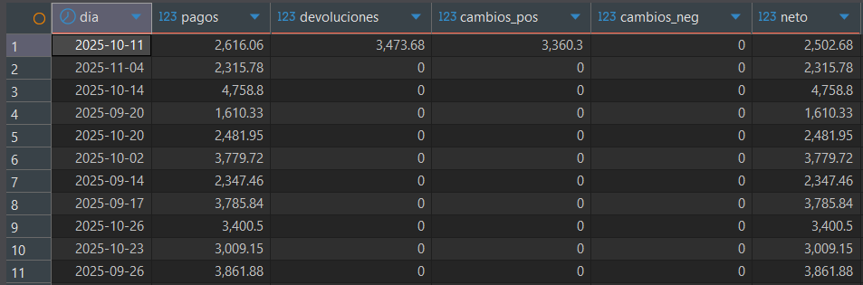
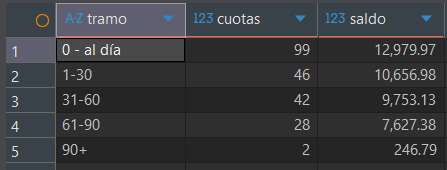

> [10. Objetos de Base de Datos](../../10.md) › [10.2. Vistas](../10.2.md) › [10.2.5. Módulo 5 / Integrante 5](10.2.5.md)

# 10.2.5. Módulo 5: Ventas

## Vistas

---

- Ventas del día

```sql
CREATE OR REPLACE VIEW vw_ventas_diarias AS
SELECT
  v.fecha_hora_venta::date AS dia,
  ROUND(SUM(v.monto_venta + v.igv), 2) AS total_soles,
  COUNT(*) AS nro_ventas
FROM "Ventas".venta v
JOIN "Ventas".estado_venta ev ON ev.cod_estado_venta = v.cod_estado_venta
WHERE lower(ev.descp_estado_venta) <> 'anulada'
GROUP BY 1;
```



---

- Ingresos netos del día

```sql
CREATE OR REPLACE VIEW vw_ingresos_netos_diarios AS
WITH pagos AS (
  SELECT c.fecha_hora_apertura::date dia, SUM(p.monto_pago) ingresos
  FROM "Ventas".pago p
  JOIN "Ventas".estado_pago ep ON ep.cod_estado_pago = p.cod_estado_pago
  JOIN "Ventas".caja c ON c.cod_caja = p.cod_caja
  WHERE lower(ep.nombre_estado_pago)='pagado'
  GROUP BY 1
),
devs AS (
  SELECT c.fecha_hora_apertura::date dia, SUM(d.monto_devolucion) egresos
  FROM "Ventas".devolucion d
  JOIN "Ventas".caja c ON c.cod_caja = d.cod_caja
  GROUP BY 1
),
cambios AS (
  SELECT c.fecha_hora_apertura::date dia,
         SUM(CASE WHEN cp.diferencia_cambio>0 THEN cp.diferencia_cambio ELSE 0 END) ingresos,
         SUM(CASE WHEN cp.diferencia_cambio<0 THEN -cp.diferencia_cambio ELSE 0 END) egresos
  FROM "Ventas".cambio_producto cp
  JOIN "Ventas".caja c ON c.cod_caja = cp.cod_caja
  GROUP BY 1
)
SELECT
  d.dia,
  COALESCE(p.ingresos,0) pagos,
  COALESCE(dev.egresos,0) devoluciones,
  COALESCE(ca.ingresos,0) cambios_pos,
  COALESCE(ca.egresos,0)  cambios_neg,
  COALESCE(p.ingresos,0)-COALESCE(dev.egresos,0)+COALESCE(ca.ingresos,0)-COALESCE(ca.egresos,0) AS neto
FROM (SELECT DISTINCT dia FROM (
        SELECT dia FROM pagos UNION SELECT dia FROM devs UNION SELECT dia FROM cambios
      ) x) d
LEFT JOIN pagos   p  USING(dia)
LEFT JOIN devs    dev USING(dia)
LEFT JOIN cambios ca  USING(dia);
```



---

- Rangos de cuotas pendientes

```sql
CREATE OR REPLACE VIEW vw_rango_cuotas AS
WITH pend AS (
  SELECT p.*
  FROM "Ventas".pago p
  JOIN "Ventas".estado_pago ep ON ep.cod_estado_pago = p.cod_estado_pago
  WHERE lower(ep.nombre_estado_pago) IN ('pendiente','vencido')
),
buckets AS (
  SELECT
    CASE
      WHEN p.fecha_vencimiento_pago IS NULL                         THEN 'Sin vencimiento'
      WHEN p.fecha_vencimiento_pago >= current_date                 THEN '0 - al día'
      WHEN current_date - p.fecha_vencimiento_pago BETWEEN 1 AND 30 THEN '1-30'
      WHEN current_date - p.fecha_vencimiento_pago BETWEEN 31 AND 60 THEN '31-60'
      WHEN current_date - p.fecha_vencimiento_pago BETWEEN 61 AND 90 THEN '61-90'
      ELSE '90+'
    END AS tramo,
    p.monto_pago
  FROM pend p
),
agg AS (
  SELECT
    tramo,
    COUNT(*)                       AS cuotas,
    ROUND(SUM(monto_pago), 2)      AS saldo,
    CASE tramo
      WHEN '0 - al día' THEN 1
      WHEN '1-30'       THEN 2
      WHEN '31-60'      THEN 3
      WHEN '61-90'      THEN 4
      WHEN '90+'        THEN 5
      ELSE 6
    END AS orden
  FROM buckets
  GROUP BY tramo
)
SELECT tramo, cuotas, saldo, orden
FROM agg;
```


[⬅️ Anterior](../10.2.4/10.2.4.md) | [🏠 Home](../../../README.md)