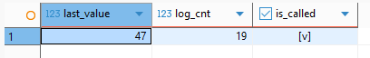
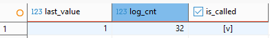

> [10. Objetos de Base de Datos](../../10.md) › [10.3. Secuencias](../10.3.md) › [10.3.1. Módulo 1 / Integrante 1](10.3.1.md)

# 10.3.1. Módulo 1 / Integrante 1

# Secuencias ​Σ

### Contar numero de canjes

```sql
CREATE SEQUENCE MODULO_CLIENTES.SEC_CONTADOR_CANJES
START WITH 1
INCREMENT BY 1
NO MAXVALUE;

SELECT NEXTVAL('MODULO_CLIENTES.SEC_CONTADOR_CANJES');

SELECT * FROM MODULO_CLIENTES.SEC_CONTADOR_CANJES;
  ```


### Contar numero de reportes generados

```sql

CREATE SEQUENCE MODULO_CLIENTES.SEC_CONTADOR_REPORTES_GENERADOS
START WITH 1
INCREMENT BY 1
NO MAXVALUE;

SELECT NEXTVAL('MODULO_CLIENTES.SEC_CONTADOR_REPORTES_GENERADOS');

SELECT * FROM MODULO_CLIENTES.SEC_CONTADOR_REPORTES_GENERADOS;
```


[🏠 Home](../../../README.md) | [Siguiente ➡️](../10.3.2/10.3.2.md)
