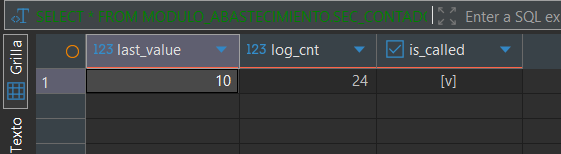
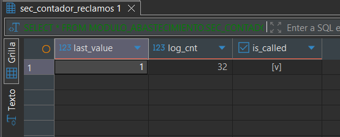

> [10. Objetos de Base de Datos](../../10.md) › [10.3. Secuencias](../10.3.md) › [10.3.4. Módulo 4 / Integrante 4](10.3.4.md)

# 10.3.4. Módulo 4 / Integrante 4

# Secuencias ​Σ

### Contar número de Órdenes de Compra (para reportes)

```sql
CREATE SEQUENCE MODULO_ABASTECIMIENTO.SEC_CONTADOR_ORDENES_COMPRA
START WITH 1
INCREMENT BY 1
NO MAXVALUE;

-- Para obtener el siguiente valor:
SELECT NEXTVAL('MODULO_ABASTECIMIENTO.SEC_CONTADOR_ORDENES_COMPRA');

-- Para ver el estado actual:
SELECT * FROM MODULO_ABASTECIMIENTO.SEC_CONTADOR_ORDENES_COMPRA;
```



### Contar número de Reclamos Generados (para reportes)

```sql
CREATE SEQUENCE MODULO_ABASTECIMIENTO.SEC_CONTADOR_RECLAMOS
START WITH 1
INCREMENT BY 1
NO MAXVALUE;

-- Para obtener el siguiente valor:
SELECT NEXTVAL('MODULO_ABASTECIMIENTO.SEC_CONTADOR_RECLAMOS');

-- Para ver el estado actual:
SELECT * FROM MODULO_ABASTECIMIENTO.SEC_CONTADOR_RECLAMOS;
```


---

[⬅️ Anterior](../10.3.3/10.3.3.md) | [🏠 Home](../../../README.md) | [Siguiente ➡️](../10.3.5/10.3.5.md)
