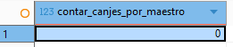
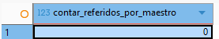
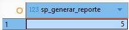

> [10. Objetos de Base de Datos](../../10.md) › [10.4. Otros objetos de BD](../10.4.md) › [10.4.1. Módulo 1 / Integrante 1](10.4.1.md)

# 10.4.1. Módulo 1 / Integrante 1

# Funciones ⨍

### Hallar el numero de canjes realizados

```sql
CREATE OR REPLACE FUNCTION "FERRETERIA".contar_canjes_por_maestro(p_cod_maestro INTEGER)
RETURNS BIGINT AS
$$
DECLARE
    v_total_canjes BIGINT;
BEGIN
    SELECT
        COUNT(cod_canje) INTO v_total_canjes
    FROM
        "FERRETERIA".CANJE
    WHERE
        cod_maestro = p_cod_maestro;

    RETURN v_total_canjes;
END;
$$ LANGUAGE plpgsql;

SELECT * FROM "FERRETERIA".contar_canjes_por_maestro(1);
  ```


### Hallar el numero de ventas referidas

```sql
CREATE OR REPLACE FUNCTION "FERRETERIA".contar_referidos_por_maestro(p_cod_maestro INTEGER)
RETURNS BIGINT AS
$$
DECLARE
    v_total_referidos BIGINT;
BEGIN
    SELECT
        COUNT(COD_MAESTRO) INTO v_total_referidos
    FROM
        "FERRETERIA".VENTA
    WHERE
        cod_maestro = p_cod_maestro;

    RETURN v_total_referidos;
END;
$$ LANGUAGE plpgsql;

SELECT * FROM "FERRETERIA".contar_referidos_por_maestro(1);
  ```


### Generar reportes

```sql
CREATE OR REPLACE FUNCTION "FERRETERIA".sp_generar_reporte(p_periodo INTERVAL)
RETURNS INTEGER AS $$
DECLARE
    v_cod_reporte INTEGER;
    v_fecha_fin TIMESTAMP;
    v_fecha_inicio TIMESTAMP;
BEGIN
    -- Establecer el esquema y las fechas
    SET search_path TO "FERRETERIA";
    v_fecha_fin := NOW();
    v_fecha_inicio := v_fecha_fin - p_periodo;

    -- 1. Crear el registro maestro del reporte
    -- Se usa la misma fecha/hora para creación y fin de periodo
    INSERT INTO REPORTE (periodo_reporte, fecha_fin_periodo, fecha_creacion_reporte)
    VALUES (p_periodo, v_fecha_fin, v_fecha_fin)
    RETURNING cod_reporte INTO v_cod_reporte;

    -- 2. Llenar CANJE_CONSULTADO
    -- (Usamos INSERT...SELECT, que es mucho más eficiente que un bucle)
    INSERT INTO CANJE_CONSULTADO (cod_reporte, cod_canje)
    SELECT v_cod_reporte, C.cod_canje
    FROM CANJE AS C
    WHERE C.fecha_hora_canje BETWEEN v_fecha_inicio AND v_fecha_fin;

    -- 3. Llenar CLIENTE_CONSULTADO
    INSERT INTO CLIENTE_CONSULTADO (cod_reporte, cod_cliente)
    SELECT v_cod_reporte, C.cod_cliente
    FROM CLIENTE AS C
    WHERE C.ultima_actividad_cliente BETWEEN v_fecha_inicio AND v_fecha_fin;

    -- 4. Llenar MAESTRO_CONSULTADO
    INSERT INTO MAESTRO_CONSULTADO (cod_reporte, cod_maestro)
    SELECT v_cod_reporte, M.cod_maestro
    FROM MAESTRO AS M
    WHERE M.ultima_actividad_maestro BETWEEN v_fecha_inicio AND v_fecha_fin;

    -- 5. Devolver el ID del reporte generado
    RAISE NOTICE 'Reporte % generado para el periodo %', v_cod_reporte, p_periodo;
    RETURN v_cod_reporte;
END;
$$ LANGUAGE plpgsql;

SELECT "FERRETERIA".sp_generar_reporte('1 YEAR');
  ```


### Registrar Canje

```sql
  CREATE OR REPLACE FUNCTION "FERRETERIA".sp_registrar_canje(
    p_cod_maestro INT,
    p_cod_usuario INT,
    p_cod_premios INT[],  -- Array de IDs de premios, ej: ARRAY[1, 3]
    p_cantidades INT[]   -- Array de cantidades, ej: ARRAY[1, 2]
)
RETURNS INTEGER AS $$ -- Devuelve el nuevo ID del canje
DECLARE
    v_total_puntos_canje NUMERIC(10,2) := 0;
    v_puntos_maestro_actuales NUMERIC(10,2);
    v_cod_estado_aprobado INT;
    v_cod_canje_nuevo INT;
    
    -- Variables para el bucle
    v_cod_premio INT;
    v_cantidad INT;
    v_puntos_premio NUMERIC(10,2);
    v_stock_premio INT;
BEGIN
    -- 0. Establecer el esquema
    SET search_path TO "FERRETERIA";

    -- =================================================================
    --  1. VALIDACIONES PREVIAS
    -- =================================================================
    
    -- Validar que los arrays tengan el mismo tamaño
    IF array_length(p_cod_premios, 1) <> array_length(p_cantidades, 1) THEN
        RAISE EXCEPTION 'La lista de premios y cantidades no coinciden.';
    END IF;

    -- Validar que el usuario exista
    IF NOT EXISTS (SELECT 1 FROM USUARIO WHERE cod_usuario = p_cod_usuario) THEN
        RAISE EXCEPTION 'El usuario con ID % no existe.', p_cod_usuario;
    END IF;

    -- Obtener los puntos del maestro
    SELECT puntos_maestro INTO v_puntos_maestro_actuales
    FROM MAESTRO
    WHERE cod_maestro = p_cod_maestro;
    
    IF v_puntos_maestro_actuales IS NULL THEN
        RAISE EXCEPTION 'El maestro con ID % no existe.', p_cod_maestro;
    END IF;
    
    -- Obtener el ID del estado 'Aprobado' (o 'Entregado' si el canje es inmediato)
    SELECT cod_estado_canje INTO v_cod_estado_aprobado
    FROM ESTADO_CANJE 
    WHERE valor_estado_canje = 'Aprobado' -- O 'Pendiente' si requiere aprobación
    LIMIT 1;

    -- =================================================================
    --  2. BUCLE DE VALIDACIÓN DE PREMIOS Y CÁLCULO DE PUNTOS
    -- =================================================================
    
    FOR i IN 1..array_length(p_cod_premios, 1) LOOP
        v_cod_premio := p_cod_premios[i];
        v_cantidad := p_cantidades[i];

        -- Validar si el premio existe y obtener sus datos
        SELECT puntos_premio, disponibilidad_premio INTO v_puntos_premio, v_stock_premio
        FROM PREMIOS
        WHERE cod_premio = v_cod_premio;
        
        IF v_puntos_premio IS NULL THEN
            RAISE EXCEPTION 'El premio con ID % no existe.', v_cod_premio;
        END IF;
        
        -- Validar stock
        IF v_stock_premio < v_cantidad THEN
            RAISE EXCEPTION 'Stock insuficiente para el premio ID %. Solicitado: %, Disponible: %', 
                            v_cod_premio, v_cantidad, v_stock_premio;
        END IF;
        
        -- Acumular el total de puntos
        v_total_puntos_canje := v_total_puntos_canje + (v_puntos_premio * v_cantidad);
    END LOOP;
    
    -- Validar si el maestro tiene puntos suficientes
    IF v_puntos_maestro_actuales < v_total_puntos_canje THEN
        RAISE EXCEPTION 'Puntos insuficientes. Requeridos: %, Disponibles: %', 
                        v_total_puntos_canje, v_puntos_maestro_actuales;
    END IF;


    -- registro del canje
    INSERT INTO CANJE (
        fecha_hora_canje, 
        monto_canje, 
        cod_usuario, 
        cod_estado_canje, 
        cod_maestro
    ) VALUES (
        NOW(),
        v_total_puntos_canje,
        p_cod_usuario,
        v_cod_estado_aprobado,
        p_cod_maestro
    ) RETURNING cod_canje INTO v_cod_canje_nuevo; -- Capturar el nuevo ID

    -- b. Insertar detalles y descontar stock (segundo bucle)
    FOR i IN 1..array_length(p_cod_premios, 1) LOOP
        v_cod_premio := p_cod_premios[i];
        v_cantidad := p_cantidades[i];
        
        -- Insertar el detalle del canje
        INSERT INTO DETALLE_CANJE (cantidad_premio, cod_canje, cod_premio)
        VALUES (v_cantidad, v_cod_canje_nuevo, v_cod_premio);
        
        -- Descontar el stock del premio
        UPDATE PREMIOS
        SET disponibilidad_premio = disponibilidad_premio - v_cantidad
        WHERE cod_premio = v_cod_premio;
    END LOOP;
    
    -- c. Descontar los puntos del maestro
    UPDATE MAESTRO
    SET puntos_maestro = puntos_maestro - v_total_puntos_canje,
        ultima_actividad_maestro = NOW()
    WHERE cod_maestro = p_cod_maestro;
    
    RAISE NOTICE 'Canje % registrado exitosamente por % puntos.', v_cod_canje_nuevo, v_total_puntos_canje;
    
    -- d. Devolver el ID del canje creado
    RETURN v_cod_canje_nuevo;

END;
$$ LANGUAGE plpgsql;
  
  
  
SELECT "FERRETERIA".sp_registrar_canje(6, 9, ARRAY[1], ARRAY[1]);
  ```


[🏠 Home](../../../README.md) | [Siguiente ➡️](../10.4.2/10.4.2.md)
