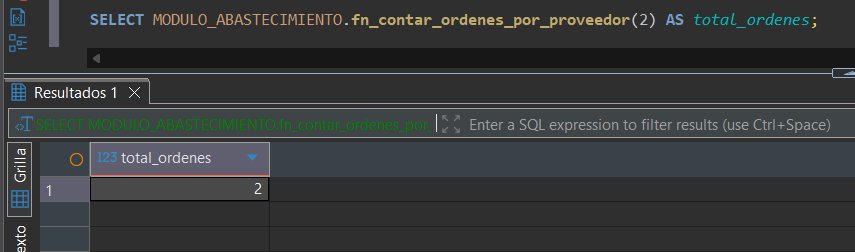
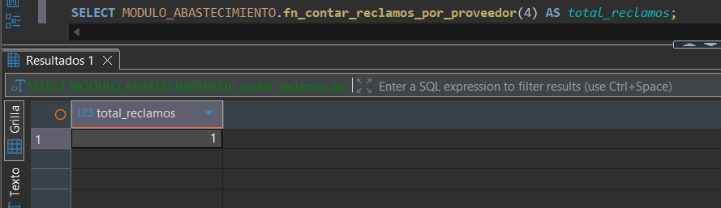
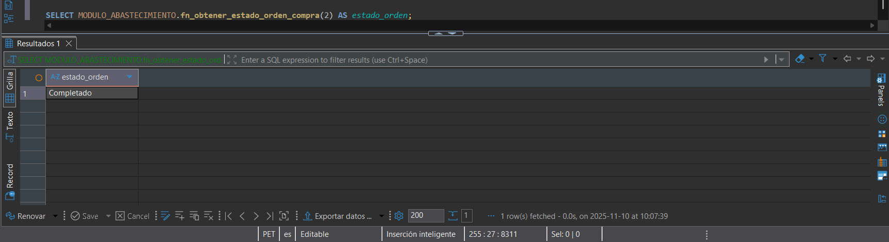

> [10. Objetos de Base de Datos](../../10.md) › [10.4. Otros objetos de BD](../10.4.md) › [10.4.4. Módulo 4 / Integrante 4](10.4.4.md)

# 10.4.4. Módulo 4 / Integrante 4

# Funciones ⨍

### Hallar el número de Órdenes de Compra por Proveedor

**Propósito:** Cuenta cuántas órdenes de compra se le han generado a un proveedor específico. Útil para KPIs de proveedor.

```sql
CREATE OR REPLACE FUNCTION MODULO_ABASTECIMIENTO.fn_contar_ordenes_por_proveedor(p_cod_proveedor INTEGER)
RETURNS BIGINT AS
$$
DECLARE
    v_total_ordenes BIGINT;
BEGIN
    SELECT
        COUNT(OC.cod_orden) INTO v_total_ordenes
    FROM
        MODULO_ABASTECIMIENTO.ORDEN_COMPRA OC
    JOIN
        MODULO_ABASTECIMIENTO.COTIZACION C ON OC.cod_cotizacion = C.cod_cotizacion
    WHERE
        C.cod_proveedor = p_cod_proveedor;

    RETURN v_total_ordenes;
END;
$$ LANGUAGE plpgsql;
```



### Hallar el número de Reclamos por Proveedor
**Propósito:** Cuenta cuántos reclamos distintos se han generado a causa de incidencias en entregas de un proveedor específico.

```sql
CREATE OR REPLACE FUNCTION MODULO_ABASTECIMIENTO.fn_contar_reclamos_por_proveedor(p_cod_proveedor INTEGER)
RETURNS BIGINT AS
$$
DECLARE
    v_total_reclamos BIGINT;
BEGIN
    SELECT
        COUNT(DISTINCT R.cod_reclamo) INTO v_total_reclamos
    FROM
        MODULO_ABASTECIMIENTO.RECLAMO R
    JOIN
        MODULO_ABASTECIMIENTO.INCIDENCIA I ON R.cod_reclamo = I.cod_reclamo
    JOIN
        MODULO_ABASTECIMIENTO.DETALLE_RECEPCION DR ON I.cod_detalle_recepcion = DR.cod_detalle_recepcion
    JOIN
        MODULO_ABASTECIMIENTO.RECEPCION REC ON DR.cod_recepcion = REC.cod_recepcion
    JOIN
        MODULO_ABASTECIMIENTO.ORDEN_COMPRA OC ON REC.cod_orden = OC.cod_orden
    JOIN
        MODULO_ABASTECIMIENTO.COTIZACION C ON OC.cod_cotizacion = C.cod_cotizacion
    WHERE
        C.cod_proveedor = p_cod_proveedor;

    RETURN v_total_reclamos;
END;
$$ LANGUAGE plpgsql;
```



### Obtener el Estado de Cumplimiento de una Orden de Compra
**Propósito:** Calcula el estado de cumplimiento general de una OC, comparando el total comprado vs. el total recibido (conforme) en todas sus recepciones finalizadas.
```sql
CREATE OR REPLACE FUNCTION MODULO_ABASTECIMIENTO.fn_obtener_estado_orden_compra(p_cod_orden INTEGER)
RETURNS TEXT AS
$$
DECLARE
    v_estado_final TEXT;
    v_total_comprado NUMERIC;
    v_total_recibido NUMERIC;
BEGIN
    -- 1. Obtener el total comprado (cantidad) de esta OC
    SELECT
        SUM(DOC.cantidad_comprada) INTO v_total_comprado
    FROM
        MODULO_ABASTECIMIENTO.DETALLE_OC DOC
    WHERE
        DOC.cod_orden = p_cod_orden;

    -- 2. Obtener el total recibido (conforme) de todas las recepciones 'Finalizadas'
    SELECT
        COALESCE(SUM(DR.cantidad_conforme), 0) INTO v_total_recibido
    FROM
        MODULO_ABASTECIMIENTO.DETALLE_RECEPCION DR
    JOIN
        MODULO_ABASTECIMIENTO.RECEPCION R ON DR.cod_recepcion = R.cod_recepcion
    WHERE
        R.cod_orden = p_cod_orden
        AND R.estado_recepcion = 'Finalizada';

    -- 3. Comparar y devolver el estado
    IF v_total_recibido = 0 THEN
        v_estado_final := 'Pendiente';
    ELSIF v_total_recibido < v_total_comprado THEN
        v_estado_final := 'Recepción Parcial';
    ELSE
        v_estado_final := 'Completado';
    END IF;

    RETURN v_estado_final;
END;
$$ LANGUAGE plpgsql;

```



---

[⬅️ Anterior](../10.4.3/10.4.3.md) | [🏠 Home](../../../README.md) | [Siguiente ➡️](../10.4.5/10.4.5.md)
