# **3.1. Módulo de Clientes**

| Requerimiento | Nombre                                   |
|---------------|------------------------------------------|
| R-101         | Registrar Clientes                       |
| R-102         | Registrar Maestros                       |
| R-103         | Consultar Clientes/Maestros              |
| R-104         | Gestion de Datos de Cliente/Maestro      |
| R-105         | Gestion de Puntos                        |
| R-106         | Analisis/Reporte de Clientes/Maestros    |

---

## **Caso de uso #1: Registrar a un Cliente**

| **ID**                         | R-101                                                                 |
|-------------------------------|------------------------------------------------------------------------|
| **Actor(es)**                  | Operario de Gestion de Clientes (quizas en ventas se puede considerar)   Cliente                        |
| **Objetivo**                | Permite el registro de un nuevo cliente en la base de datos. |
| **Disparador o evento inicial**             | El usuario consulta al cliente si desea registrarse. |
| **Precondiciones**             | El usuario debe haber iniciado sesión y se obtiene el consentimiento del cliente para su registro. |
| **Flujo Principal**            | 1. El usuario accede a la vista de clientes. 2. Selecciona "Agregar Cliente". 3. Ingresa la informacion del cliente. 4. Confirma los datos para que sean ingresados. |
| **Postcondiciones** | Existencia de una nueva entidad de Cliente. |
| **Excepciones**          | 1. "Cliente ya Existe" Cuando el cliente ya se encontraba registrado. 2. "Datos no Validos" Cuando se introducen datos con un valor no aceptado.                  |

| Listado de atributos de calidad | Nombre del Atributo | Razon de Necesidad | Expectativa | 
| ------------------------ | ---------------- | ---------------- | ---------------- |
| **1**   | **Escalabilidad**     | Debe existir la capacidad de realizar multiples registros simultaneos sin problemas. | El módulo debe poder atender hasta 150 usuarios concurrentes sin superar un tiempo de respuesta de 3 segundos. |
| **2**   | **Seguridad**       | Los datos de cliente se deben de manejar de manera cuidadosa y segura. | Los usuarios deben iniciar sesión mediante doble factor de autenticación (2FA). |
| **3**   | **Usabilidad**       | Un operario debe de ser capaz de registrar al cliente de manera agil y comoda. | La interfaz de registro de cliente debe de ser intuitiva, facil de usar y los campos deben de revisar la factibilidad de los datos ingresados. |

### **Flujo Principal:**
1. El usuario accede a la vista de clientes. 
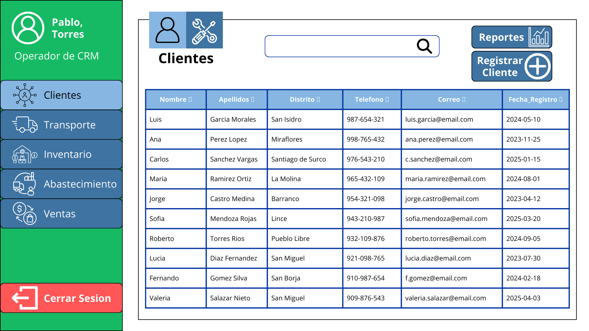
2. Selecciona "Agregar Cliente".

3. Ingresa la informacion del cliente.
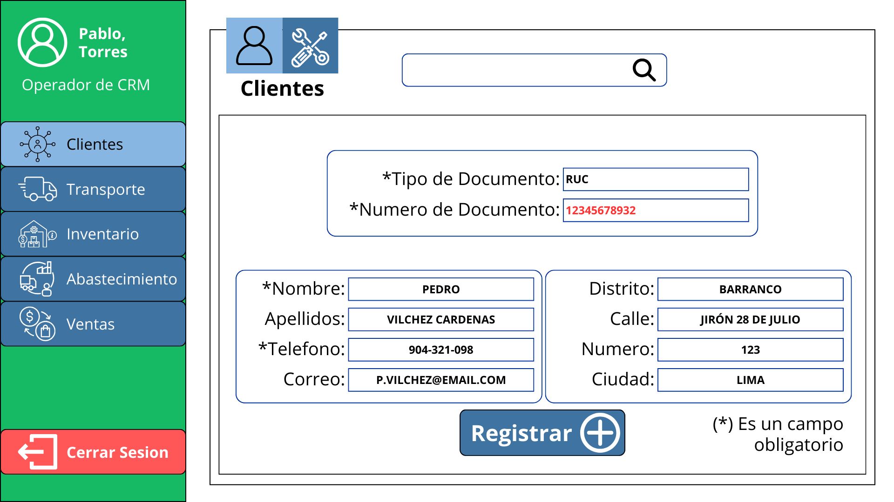
4. Confirma los datos para que sean ingresados.
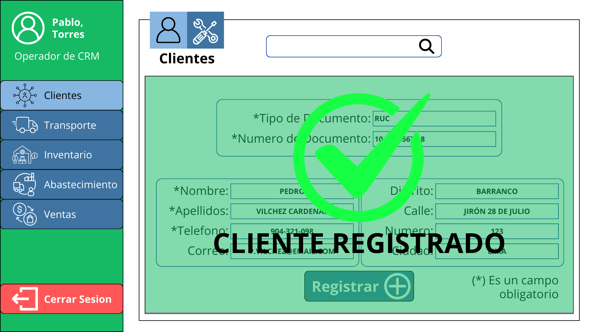

## **Caso de uso #2: Registrar a un Maestro**

| **ID**                         | R-102                                                                 |
|-------------------------------|------------------------------------------------------------------------|
| **Actor(es)**                  | Operario de Gestion de Clientes   Maestro                        |
| **Objetivo**                | Permite el registro de un nuevo maestro a partir de un cliente existente en la base de datos. |
| **Disparador o evento inicial**             | El usuario consulta al maestro si desea registrarse. |
| **Precondiciones**             | El usuario debe haber iniciado sesión, y el maestro ya ha sido previamente registrado como cliente. |
| **Flujo Principal**            | 1. El usuario accede a la vista de clientes. 2. Selecciona "Agregar Maestro". 3. Ingresa la informacion del maestro. 4. Confirma los datos para que sean ingresados. |
| **Postcondiciones** | Existencia de una nueva entidad de Maestro. |
| **Excepciones**          | 1. "Maestro ya Existe" Cuando el maestro ya se encontraba registrado. 2. "Datos no Validos" Cuando se introducen datos con un valor no aceptado. 3. "Cliente no Existe" Cuando no se habia registrado preciamente al maestro como cliente.                  |

| Listado de atributos de calidad | Nombre del Atributo | Razon de Necesidad | Expectativa | 
| ------------------------ | ---------------- | ---------------- | ---------------- |
| **1**   | **Escalabilidad**     | Debe existir la capacidad de realizar multiples registros simultaneos sin problemas. | El módulo debe poder atender hasta 150 usuarios concurrentes sin superar un tiempo de respuesta de 3 segundos. |
| **2**   | **Seguridad**       | Los datos de cliente se deben de manejar de manera cuidadosa y segura. | Los usuarios deben iniciar sesión mediante doble factor de autenticación (2FA). |
| **3**   | **Usabilidad**       | Un operario debe de ser capaz de registrar al cliente de manera agil y comoda. | La interfaz de registro de cliente debe de ser intuitiva, facil de usar y los campos deben de revisar la factibilidad de los datos ingresados. |

### **Flujo Principal:**
1. El usuario accede a la vista de maestros. 
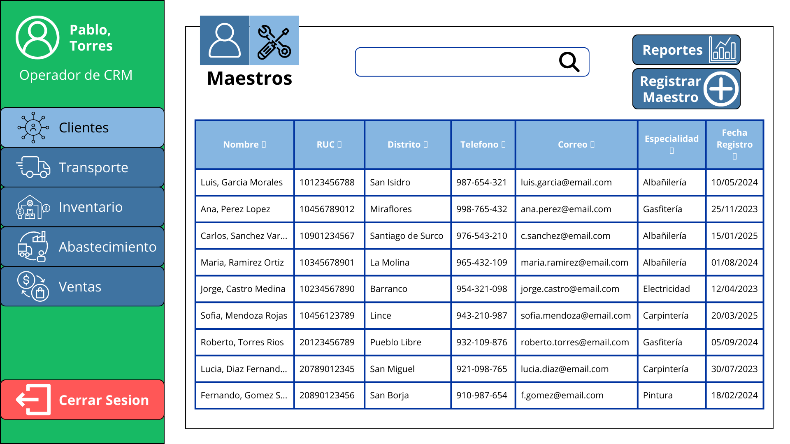
2. Selecciona "Agregar Maestro".
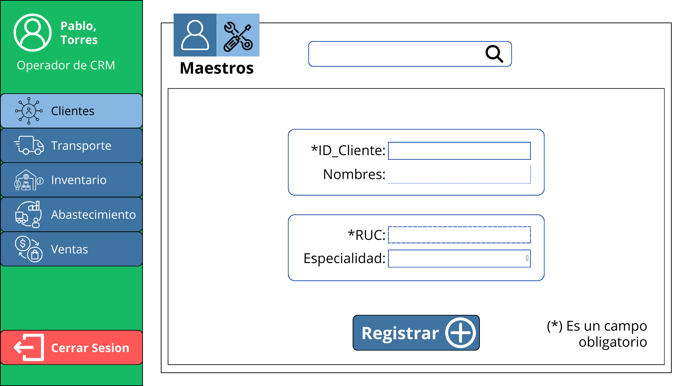
3. Ingresa la informacion del maestro.
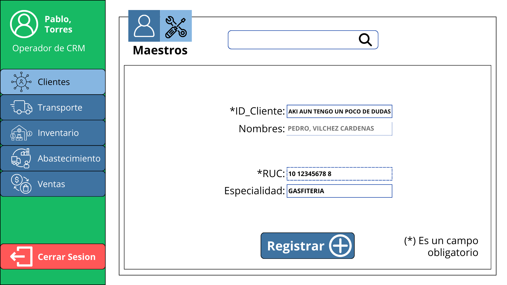
4. Confirma los datos para que sean ingresados.
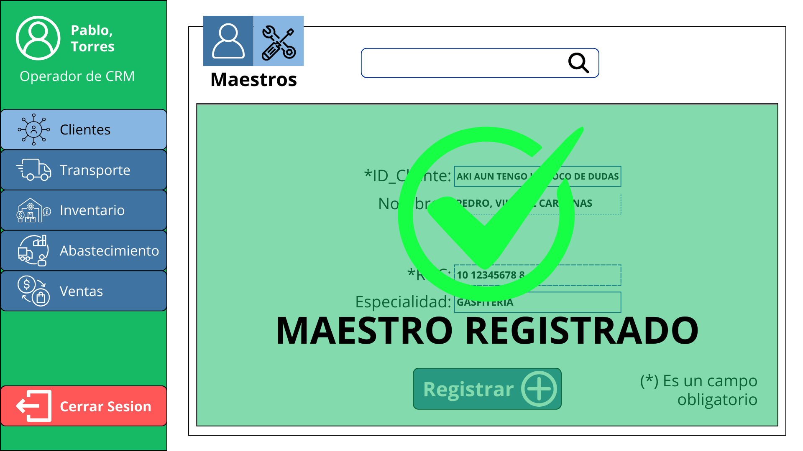

## **Caso de uso #3: Consultar Clientes/Maestros**

| **ID**                         | R-103                                                                 |
|-------------------------------|------------------------------------------------------------------------|
| **Actor(es)**                  | Operario de Gestion de Clientes             |
| **Objetivo**                | Permite al usuario consultar los clientes/maestros. |
| **Disparador o evento inicial**             | Se ingresa al modulo de clientes. |
| **Precondiciones**             | El usuario debe haber iniciado sesión. |
| **Flujo Principal**            | 1. El usuario accede a la vista de clientes/maestros. 2. Selecciona a un cliente/maestro de la lista.|
| **Flujo Alternativo I**            | 2. Hacer click en la barra de busqueda. 3. Escribir una cadena de caracteres. 4. Selecciona a un cliente de la lista desplegada. |
| **Flujo Alternativo II**            | 2. Hacer click en un filtro de cliente. 3. Seleccionar un atributo que se desea buscar. 4. Selecciona a un cliente de la lista. |
| **Postcondiciones** | Se ingresa al perfil del Cliente/Maestro. |
| **Excepciones**          | 1. "Cliente/Maestro no Existe" Cuando el resultado de la busqueda o filtro es nulo.                 |

| Listado de atributos de calidad | Nombre del Atributo | Razon de Necesidad | Expectativa | 
| ------------------------ | ---------------- | ---------------- | ---------------- |
| **1**  | **Rendimiento**    | La busqueda debe de ser rapida y efectiva. | La página de consulta de clientes/maestros debe mostrar los resultados en menos de 2 segundos para un máximo de 5,000 registros. |
| **2**   | **Seguridad**       | Los datos de cliente se deben de manejar de manera cuidadosa y segura. | Los usuarios deben iniciar sesión mediante doble factor de autenticación (2FA). |
| **3**   | **Usabilidad**       | Un operario debe de ser capaz de encontrar facilmente al cliente/maestro buscado. | La interfaz de consulta de clientes/maestros debe de ser intuitiva, facil de usar y la seleccion de atributos debe de ser desplegable. |

### **Flujo Principal:**
#### **Cliente:**
1. El usuario accede a la vista de clientes.

2. Selecciona a un cliente de la lista.

#### **Maestro:**
1. El usuario accede a la vista de maestros.

2. Selecciona a un maestro de la lista.
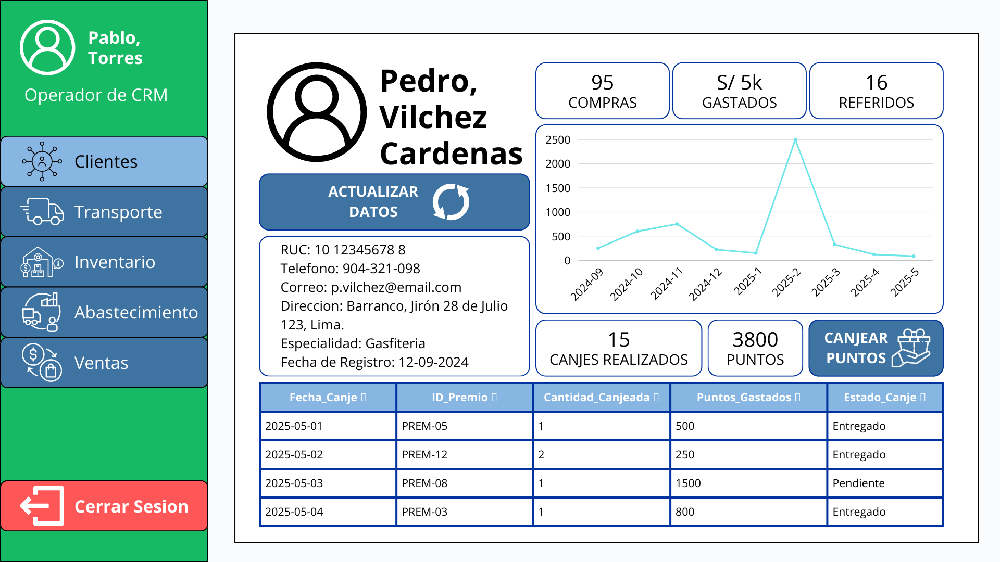

## **Caso de uso #4: Gestionar Datos de un Cliente/Maestro**

| **ID**                         | R-104                                                                 |
|-------------------------------|------------------------------------------------------------------------|
| **Actor(es)**                  | Operario de Gestion de Clientes                         |
| **Objetivo**                | Permite la actualizacion de datos de cliente y/o maestro. |
| **Disparador o evento inicial**             | Cambio en el valor de un atributo de cliente/maestro en la realidad. |
| **Precondiciones**             | El usuario debe haber iniciado sesión, y el cliente/maestro ya ha sido previamente registrado. |
| **Flujo Principal**            | 1. El usuario accede al perfil de CLiente/Maestro. 2. Selecciona "Actualizar Datos". 3. Ingresa la informacion nueva o actualizada del cliente/maestro. 4. Confirma los datos para que sean actualizados. |
| **Postcondiciones** | Cambio de datos del perfil del Cliente/Maestro. |
| **Excepciones**          | 1. "Datos no Validos" Cuando se introducen datos con un valor no aceptado.                |

| Listado de atributos de calidad | Nombre del Atributo | Razon de Necesidad | Expectativa | 
| ------------------------ | ---------------- | ---------------- | ---------------- |
| **1**   | **Escalabilidad**     | Debe existir la capacidad de realizar multiples actualizaciones de manera simultanea sin problemas. | El módulo debe poder atender hasta 150 usuarios concurrentes sin superar un tiempo de respuesta de 3 segundos. |
| **2**   | **Seguridad**       | Los datos de cliente se deben de manejar de manera cuidadosa y segura. | Los usuarios deben iniciar sesión mediante doble factor de autenticación (2FA). |
| **3**   | **Usabilidad**       | Un operario debe de ser capaz de actualizar datos del cliente/maestro de manera agil y comoda. | La interfaz de gestion de datos de cliente debe de ser intuitiva, facil de usar y los campos deben de revisar la factibilidad de los datos ingresados. |

### **Flujo Principal:**
#### **Cliente:**
1. El usuario accede al perfil de CLiente.

2. Selecciona "Actualizar Datos".
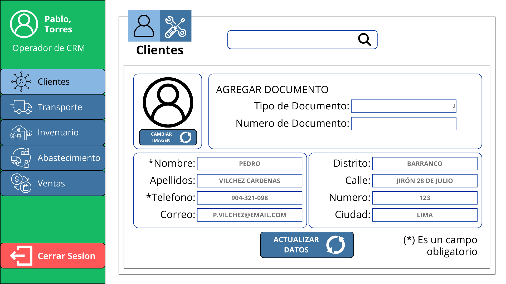
3. Ingresa la informacion nueva o actualizada del cliente.

4. Confirma los datos para que sean actualizados.
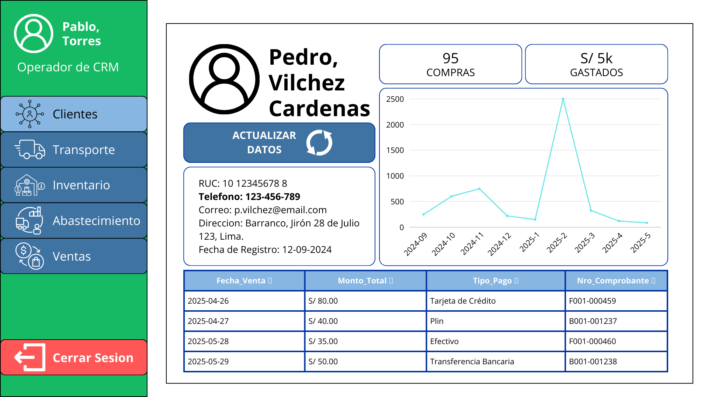
#### **Maestro:**
1. El usuario accede al perfil de Maestro.

2. Selecciona "Actualizar Datos".
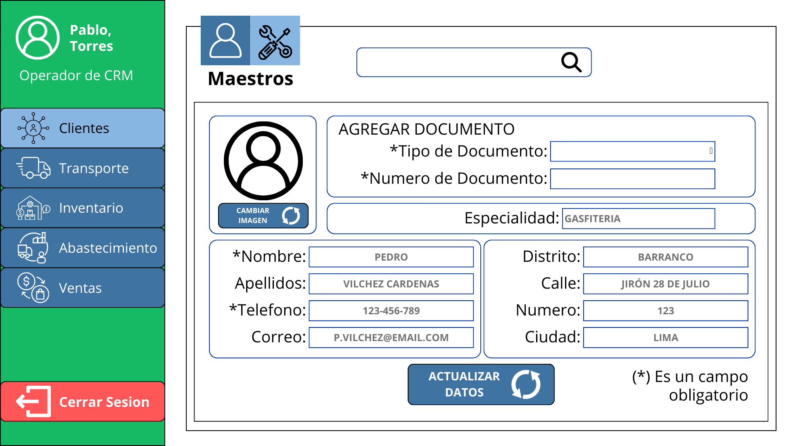
3. Ingresa la informacion nueva o actualizada del maestro.

4. Confirma los datos para que sean actualizados.
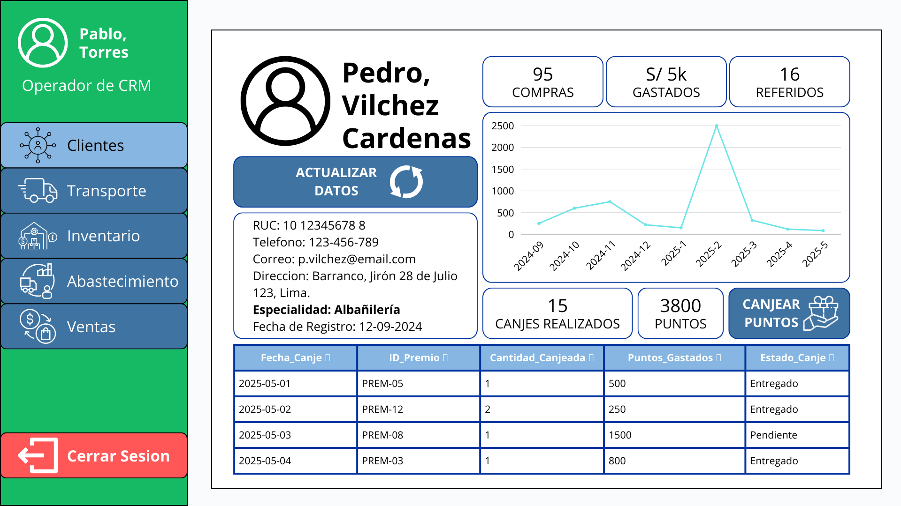

## **Caso de uso #5: Gestion de Puntos**

| **ID**                         | R-105                                                                 |
|-------------------------------|------------------------------------------------------------------------|
| **Actor(es)**                  | Operario de Gestion de Clientes                         |
| **Objetivo**                | Permite el canjeo de puntos del maestro. |
| **Disparador o evento inicial**             | El maestro pide canjear sus puntos. |
| **Precondiciones**             | El usuario debe haber iniciado sesión, y el maestro ya ha sido previamente registrado. |
| **Flujo Principal**            | 1. El usuario accede al perfil de Maestro. 2. Selecciona "Canjear Puntos". 3. Se añade el premio a canjear. 4. Selecciona las unidades del premio. 5. Confirma el canjeo. |
| **Postcondiciones** | Entrega del producto canjeado y substraccion de los puntos usados. |
| **Excepciones**          | 1. "Puntos Insuficientes" Cuando los puntos no son suficientes para realizar el canjeo.                |

| Listado de atributos de calidad | Nombre del Atributo | Razon de Necesidad | Expectativa | 
| ------------------------ | ---------------- | ---------------- | ---------------- |
| **1**  | **Rendimiento**    | La busqueda debe de ser rapida y efectiva. | La busqueda debe mostrar los resultados en menos de 2 segundos para un máximo de 5,000 registros. |
| **2**   | **Escalabilidad**     | Debe existir la capacidad de realizar multiples canjeos de manera simultanea sin problemas. | El módulo debe poder atender hasta 150 usuarios concurrentes sin superar un tiempo de respuesta de 3 segundos. |
| **3**   | **Seguridad**       | Los puntos deben de gestionarse con estandares monetarios y no hay lugar a errores. | Los usuarios deben iniciar sesión mediante doble factor de autenticación (2FA). |
| **4**   | **Usabilidad**       | Un operario debe de ser capaz de realizar el canjeo de manera agil y comoda. | La interfaz de gestion de puntos debe de ser intuitiva y facil de usar.|

### **Flujo Principal:**
1. El usuario accede al perfil de Maestro.
2. Selecciona "Canjear Puntos".

3. Se añade el premio a canjear.
4. Selecciona las unidades del premio.
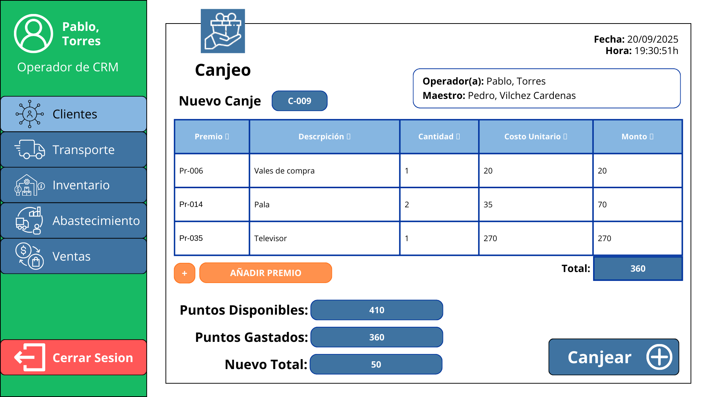
5. Confirma el canjeo.
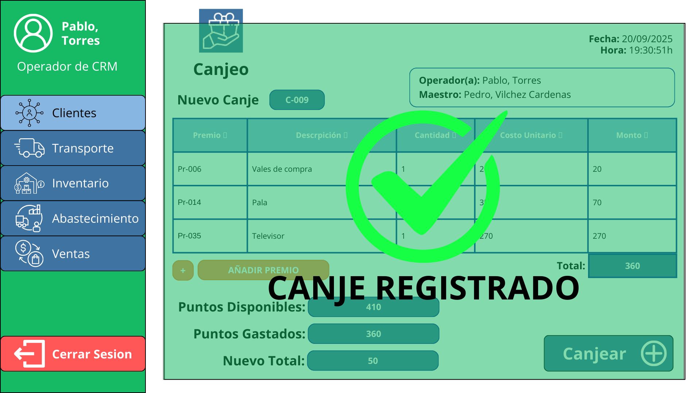

## **Caso de uso #6: Analisis/Reporte de Clientes/Maestros**

| **ID**                         | R-106                                                                 |
|-------------------------------|------------------------------------------------------------------------|
| **Actor(es)**                  | Operario de Gestion de Clientes                         |
| **Objetivo**                | Permite la visualizacion de resumenes de atributos importantes de cliente y/o maestro. |
| **Disparador o evento inicial**             | Cada intervalo de tiempo (dias, semanas, meses) se ejecuta automaticamente. |
| **Precondiciones**             | El servidor se encuentra en funcionamiento |
| **Flujo Principal**            | 1. El usuario accede al modulo de clientes. 2. Selecciona "Reportes". 3. Selecciona un reporte de la lista (ordenados por fecha y tiempo analizado). 4. Se abre la visualizacion del reporte. |
| **Flujo Alternativo**            | 3. Introduce el rango de tiempo del reporte buscado.  4. Selecciona un reporte de la lista (ordenados por fecha y tiempo analizado). 5. Se abre la visualizacion del reporte. |
| **Postcondiciones** | El usuario visualiza el reporte seleccionado. |
| **Excepciones**          | 1. "No hay reportes de {fecha_i}, {fecha_f}" Cuando no existe un reporte del rango de tiempo deseado.                |

| Listado de atributos de calidad | Nombre del Atributo | Razon de Necesidad | Expectativa | 
| ------------------------ | ---------------- | ---------------- | ---------------- |
| **1**   | **Seguridad**       | Los reportes son informacion delicada de la empresa y debe ser manejada con cuidado y enfasis en la seguridad. | Los usuarios deben iniciar sesión mediante doble factor de autenticación (2FA). |
| **2**   | **Usabilidad**       | Un operario debe de ser capaz de leer los reportes de manera rapida y eficiente. | La interfaz de reporte de clientes debe de ser intuitiva, facil de usar y los reportes faciles de entender.|

### **Flujo Principal:**
1. El usuario accede al modulo de clientes.
2. Selecciona "Reportes".

3. Selecciona un reporte de la lista (ordenados por fecha y tiempo analizado).
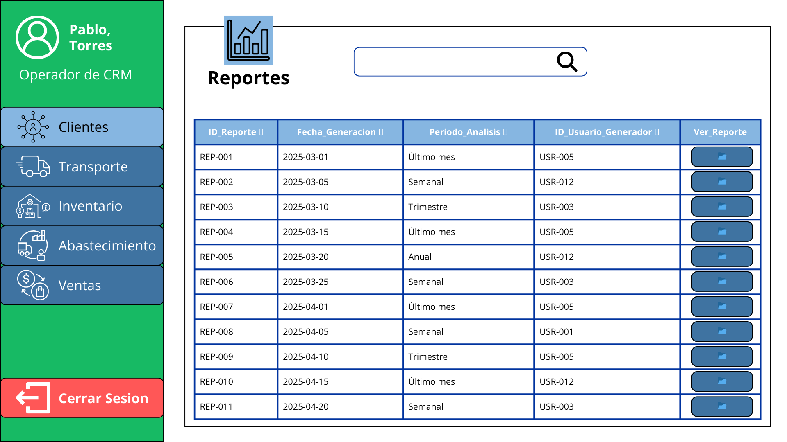
4. Confirma los datos para que sean ingresados.
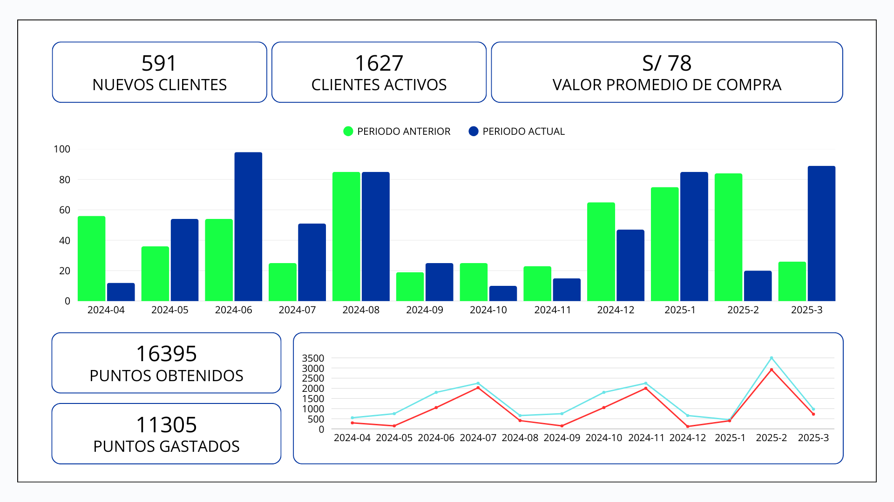
