# 3.2. Módulo 2: Transporte

| Requerimiento | Nombre |
| --- | --- |
| **R-201** | Registrar Vehículo |
| **R-202** | Actualizar Datos del Vehículo |
| **R-203** | Eliminar Vehículo |
| **R-204** | Registrar Empleado |
| **R-205** | Actualizar Datos del Empleado |
| **R-206** | Actualizar Estado de Permiso de Conducción |
| **R-207** | Cancelar Artículos de Pedido de Transporte |
| **R-208** | Reprogramar Artículos de Pedido de Transporte |
| **R-209** | Programar Nuevo Despacho |
| **R-210** | Gestionar Seguimiento de Despacho |
| **R-211** | Actualizar Despacho Programado |
| **R-212** | Eliminar Despacho Programado |
| **R-213** | Consultar Reporte de Vista General |

---

## Caso de uso #1: Registrar Vehículo

| **Campo** | **Detalle** |
| --- | --- |
| **ID** | **R-201** |
| **Actor(es)** | Jefe de Transporte. |
| **Objetivo** | Registrar un nuevo vehículo en la flota del sistema para su posterior gestión y asignación. |
| **Precondiciones** | El **Jefe de Transporte** debe estar logueado en el sistema. |
| **Disparador** | El Jefe de Transporte hace clic en el botón "+ Añadir Vehículo" en la pantalla "Gestión de Vehículos". |
| **Flujo Principal** | 1. El **Jefe de Transporte** accede a la vista de "Transporte".    2. Selecciona el menú "Vehículos".    3. Selecciona la opción **"+ Añadir Vehículo"**.    4. Ingresa los datos principales del vehículo (Placa, Tipo, Marca, Capacidad, etc.).    5. Confirma los datos para que sean ingresados (hace clic en "Guardar"). |
| **Postcondiciones** | 1. Se crea una nueva instancia de la entidad `VEHICULO`. |
| **Excepciones** | 1. **"Vehículo ya existe"**: Cuando la **Placa** ya se encuentra registrada (duplicada).    2. **"Datos no válidos"**: Cuando se introducen datos con un valor no aceptado (ej. texto en un campo numérico como "Capacidad").    3. **"Campo obligatorio vacío"**: Cuando se deja sin completar algún campo requerido para el registro (ej. "Placa"). |
| **Frecuencia de uso** | Poco frecuente, cuando la empresa adquiere una nueva unidad para la flota. |

---

### Flujo Principal del Requerimiento:

1. El **Jefe de Transporte** accede al sistema y entra al **"Panel de Control Principal"**. En la sección "Gestión de Recursos", selecciona la opción **"Vehículos"**.
    
    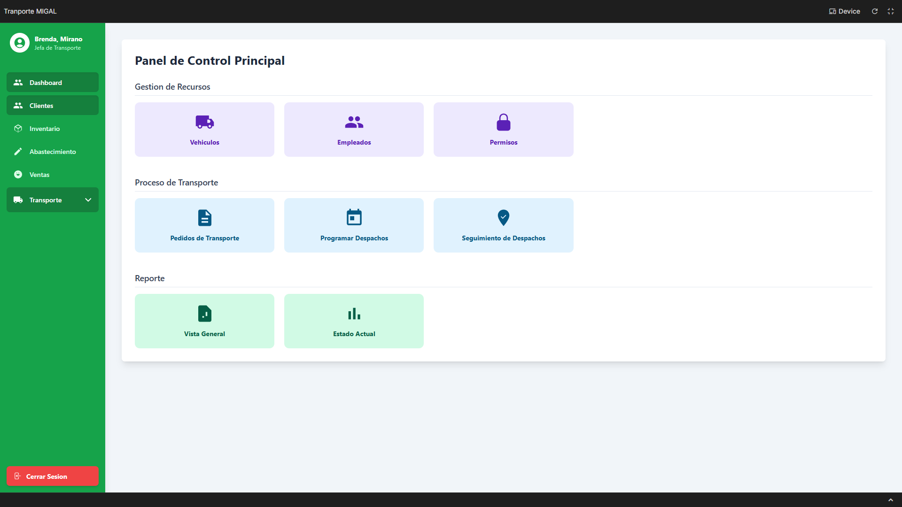
    

1. Visualiza la pantalla **"Gestión de Vehículos"** con la lista de la flota existente. Para registrar una nueva unidad, elige la opción **"+ Añadir Vehículo"**.
    
    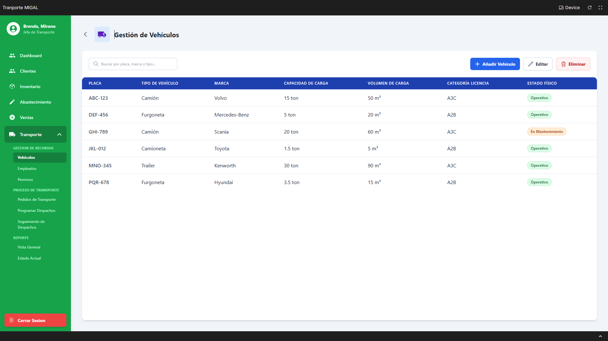
    

1. El sistema muestra la ventana modal **"Añadir Nuevo Vehículo"**. El Jefe de Transporte llena todos los campos requeridos (Placa, Tipo de Vehículo, Marca, Capacidad de Carga, etc.). Una vez conforme, hace clic en **"Guardar"**.
    
    
    

---

## Caso de uso #2: Actualizar Datos del Vehículo

| **Campo** | **Detalle** |
| --- | --- |
| **ID** | **R-202** |
| **Actor(es)** | Jefe de Transporte |
| **Objetivo** | Modificar la información de un vehículo previamente registrado en la flota, como su tipo, marca, capacidades o estado físico. |
| **Precondiciones** | 1. El **Jefe de Transporte** debe estar logueado en el sistema.     2. Debe existir al menos un vehículo registrado para poder editarlo. |
| **Disparador** | El **Jefe de Transporte** necesita actualizar los datos de un vehículo existente. |
| **Flujo Principal** | 1. El **Jefe de Transporte** accede a la vista de "Transporte" y selecciona "Vehículos".    2. Selecciona la opción **"Editar"** en la pantalla "Gestión de Vehículos".     3. El sistema muestra una modal solicitando la **"Placa Del Vehículo"**     4. El actor ingresa la Placa del vehículo que desea editar y hace clic en "Confirmar".     5. El sistema busca el vehículo y, si lo encuentra, muestra una segunda modal con **todos los campos del vehículo cargados.**    6. El actor modifica los campos deseados (ej. cambia "Estado Físico" a "En Mantenimiento").     7. Confirma los cambios haciendo clic en "Guardar" |
| **Postcondiciones** | 1. Los datos de la entidad `VEHICULO` correspondiente a la placa ingresada son actualizados en la base de datos.     2. La tabla en "Gestión de Vehículos" refleja la nueva información. |
| **Excepciones** | 1. **"Vehículo no encontrado"**: Cuando la **Placa** ingresada en el paso 4 no existe en la base de datos.     2. **"Datos no válidos"**: Cuando se modifica un campo con un valor no aceptado (ej. "Capacidad de Carga" con texto).     3. **"Campo obligatorio vacío"**: Cuando el actor borra la información de un campo requerido (ej. deja "Marca" en blanco). |
| **Frecuencia de uso** | Frecuente, especialmente para actualizar el "Estado Físico" (Operativo, En Mantenimiento) de las unidades. |

---

### Flujo Principal del Requerimiento:

1. El **Jefe de Transporte** accede al sistema y entra al **"Panel de Control Principal"**. En la sección "Gestión de Recursos", selecciona la opción **"Vehículos"**.
    
    
    
2. Visualiza la pantalla **"Gestión de Vehículos"** con la lista de la flota. Para modificar una unidad, elige la opción **"Editar"**, ubicada en la cabecera de la tabla.
    
    
    
3. El sistema muestra una primera ventana modal **"Editar Vehículo"**, solicitando la **"Placa Del Vehículo"** que desea modificar. Se ingresa la placa (ej. "ABC-123") y hace clic en **"Confirmar"**.
    
    
    
4. El sistema busca el vehículo y muestra una segunda ventana modal con todos los campos de ese vehículo **ya cargados** (Placa, Tipo, Marca, etc.), se modifica la información necesaria (por ejemplo, cambia el "Estado Físico" de "Operativo" a "En Mantenimiento"). Una vez conforme, hace clic en **"Guardar"** para aplicar los cambios.
    
    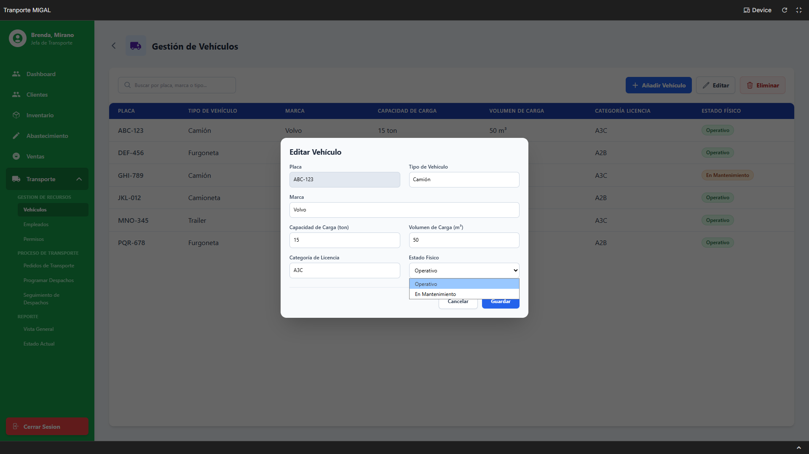
    

---

## Caso de uso #3: Eliminar Vehículo

| **Campo** | **Detalle** |
| --- | --- |
| **ID** | R-203 |
| **Actor(es)** | Jefe de Transporte |
| **Objetivo** | Eliminar permanentemente un vehículo de la flota del sistema, dándolo de baja para que no pueda ser asignado a futuros despachos. |
| **Precondiciones** | 1. El **Jefe de Transporte** debe estar logueado en el sistema.     2. El vehículo que se desea eliminar debe existir en la base de datos. |
| **Disparador** | El **Jefe de Transporte** necesita dar de baja un vehículo que ya no pertenece a la flota (ej. fue vendido, dado de baja por antigüedad, etc.). |
| **Flujo Principal** | 1. El **Jefe de Transporte** accede a la vista de "Transporte" y selecciona "Vehículos".     2. Selecciona la opción **"Eliminar"** en la pantalla "Gestión de Vehículos".    3. El sistema muestra una modal solicitando la **"Placa Del Vehículo".**    4. El actor ingresa la Placa del vehículo que desea eliminar y hace clic en "Confirmar".     5. El sistema busca el vehículo y muestra una segunda modal de **confirmación final** con una advertencia de acción permanente.     6. El actor ratifica la decisión haciendo clic en **"Sí, Eliminar"**. |
| **Postcondiciones** | 1. La instancia de la entidad `VEHICULO` correspondiente a la placa ingresada es eliminada permanentemente de la base de datos.     2. El vehículo desaparece de la lista en "Gestión de Vehículos". |
| **Excepciones** | 1. **"Vehículo no encontrado"**: Cuando la **Placa** ingresada en el paso 4 no existe en la base de datos.     2. **"Vehículo con dependencias"**: Cuando el vehículo no puede ser eliminado por reglas de negocio (ej. tiene un despacho activo o programado). El sistema debe mostrar un error (ej. "No se puede eliminar el vehículo [Placa] porque tiene despachos pendientes"). |
| **Frecuencia de uso** | Muy poco frecuente, se usa solo cuando un vehículo es retirado permanentemente de la flota. |

---

### Flujo Principal del Requerimiento:

1. El **Jefe de Transporte** accede al sistema y entra al **"Panel de Control Principal"**. En la sección "Gestión de Recursos", selecciona la opción **"Vehículos"**.
    
    
    
2. Visualiza la pantalla **"Gestión de Vehículos"** con la lista de la flota. Para dar de baja una unidad, elige la opción **"Eliminar"** (el botón rojo en la cabecera de la tabla).
    
    
    
3. El sistema muestra una primera ventana modal **"Eliminar Vehículo"** , solicitando la **"Placa Del Vehículo"** que desea borrar. Se ingresa la placa (ej. "ABC-123") y hace clic en **"Confirmar"**.
    
    
    
4. El sistema busca el vehículo y presenta una **advertencia final**, indicando que la acción es permanente y no se puede deshacer. Se confirma la baja definitiva haciendo clic en el botón rojo **"Sí, Eliminar"**.
    
    
    

---

## Caso de uso #4: Registrar Empleado

| **Campo** | **Detalle** |
| --- | --- |
| **ID** | R-204 |
| **Actor(es)** | Jefe de Transporte |
| **Objetivo** | Registrar un nuevo empleado (conductor o personal de transporte) en el sistema, incluyendo sus datos personales, de contacto, información de brevete y estado laboral. |
| **Precondiciones** | El **Jefe de Transporte** debe estar logueado en el sistema. |
| **Disparador** | El **Jefe de Transporte** necesita registrar a un nuevo trabajador que se incorpora al área. |
| **Flujo Principal** | 1. El **Jefe de Transporte** accede al "Panel de Control Principal" y selecciona "Empleados".     2. Visualiza la pantalla "Gestión de Empleados".     3. Selecciona la opción **"+ Añadir Empleado"**.     4. El sistema muestra la modal "Añadir Nuevo Empleado".     5. El actor ingresa los datos del empleado: Código, Nombre Completo, Teléfono, Brevete y Fecha de Vencimiento.     6. Confirma los datos para que sean ingresados (hace clic en "Guardar"). |
| **Postcondiciones** | 1. Se crea una nueva instancia de la entidad `EMPLEADO` en la base de datos.     2. El nuevo empleado aparece en la lista de la "Gestión de Empleados". |
| **Excepciones** | 1. **"Empleado ya existe"**: Cuando el **Código** de empleado ya se encuentra registrado (duplicado).     2. **"Datos no válidos"**: Cuando se introduce un dato con formato incorrecto (ej. en "Teléfono" o "Fecha de Vencimiento").     3. **"Campo obligatorio vacío"**: Cuando se deja sin completar un campo requerido (ej. "Código" o "Nombre Completo"). |
| **Frecuencia de uso** | Poco frecuente, se utiliza solo cuando se contrata a un nuevo miembro para el personal de transporte. |

---

### Flujo Principal del Requerimiento:

1. El **Jefe de Transporte** accede al sistema y entra al **"Panel de Control Principal"**. En la sección "Gestión de Recursos", selecciona la opción **"Empleados"**.
    
    
    
2. Visualiza la pantalla **"Gestión de Empleados"** con la lista del personal actual. Para registrar un nuevo miembro, elige la opción **"+ Añadir Empleado"**, ubicada en la esquina superior derecha.
    
    
    
3. El sistema muestra la ventana modal **"Añadir Nuevo Empleado"**. El Jefe de Transporte llena todos los campos requeridos (Código, Nombre Completo, Teléfono, Brevete y Fecha de Vencimiento). Una vez conforme, hace clic en **"Guardar"**.
    
    
    

---

## Caso de uso #5: Actualizar Datos del Empleado

| **Campo** | **Detalle** |
| --- | --- |
| **ID** | R-205 |
| **Actor(es)** | Jefe de Transporte |
| **Objetivo** | Modificar la información de un empleado existente, como su número de teléfono, estado laboral (ej. Activo, De Vacaciones) o fecha de vencimiento del brevete. |
| **Precondiciones** | 1. El **Jefe de Transporte** debe estar logueado en el sistema.     2. Debe existir al menos un empleado registrado para poder editarlo. |
| **Disparador** | El **Jefe de Transporte** necesita actualizar los datos de un empleado (ej. cambió su estado a "De Vacaciones" o "Con Licencia"). |
| **Flujo Principal** | 1. El **Jefe de Transporte** accede al "Panel de Control Principal" y selecciona "Empleados".     2. Visualiza la pantalla "Gestión de Empleados" y selecciona la opción **"Editar"**.     3. El sistema muestra una modal solicitando el **"Código Del Empleado"**.     4. El actor ingresa el Código (ej. "EMP003") y hace clic en "Confirmar".     5. El sistema busca al empleado y muestra una segunda modal "Editar Empleado" con **todos los campos del empleado cargados** (ej. "Miguel Castro").     6. El actor modifica los campos deseados (ej. cambia "Estado" de "De Vacaciones" a "Activo").     7. Confirma los cambios haciendo clic en "Guardar". |
| **Postcondiciones** | 1. Los datos de la entidad `EMPLEADO` correspondiente al código ingresado son actualizados en la base de datos.     2. La tabla en "Gestión de Empleados" refleja la nueva información. |
| **Excepciones** | 1. **"Empleado no encontrado"**: Cuando el **Código** ingresado en el paso 4 no existe en la base de datos.     2. **"Datos no válidos"**: Cuando se modifica un campo con un valor no aceptado (ej. texto en "Teléfono").     3. **"Campo obligatorio vacío"**: Cuando el actor borra la información de un campo requerido (ej. "Nombre Completo"). |
| **Frecuencia de uso** | Frecuente, especialmente para actualizar el "Estado" (Activo, De Vacaciones, Con Licencia) de los empleados. |

---

### Flujo Principal del Requerimiento:

1. El **Jefe de Transporte** accede al sistema y entra al **"Panel de Control Principal"**. En la sección "Gestión de Recursos", selecciona la opción **"Empleados"**.
    
    
    
2. Visualiza la pantalla **"Gestión de Empleados"** con la lista del personal. Para modificar un registro, elige la opción **"Editar"**, ubicada en la cabecera de la tabla.
    
    
    
3. El sistema muestra una primera ventana modal **"Editar Empleado"**, solicitando el **"Código Del Empleado"** que desea modificar. Se ingresa el código (ej. "EMP003") y hace clic en **"Confirmar"**.
    
    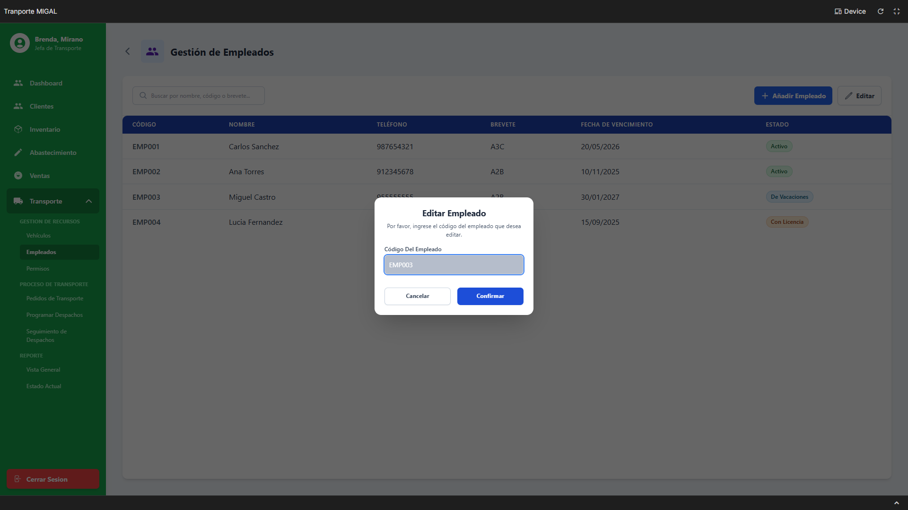
    
4. El sistema busca al empleado y muestra una segunda ventana modal con todos los campos de ese trabajador **ya cargados** (ej. Código "EMP003", Nombre "Miguel Castro"). Se modifica la información necesaria (por ejemplo, cambia el "Estado" de "De Vacaciones" a "Activo"). Una vez conforme, hace clic en **"Guardar"** para aplicar los cambios.
    
    
    

---

## Caso de uso #6: Actualizar Estado de Permiso de Conducción

| **Campo** | **Detalle** |
| --- | --- |
| **ID** | R-206 |
| **Actor(es)** | Jefe de Transporte |
| **Objetivo** | Habilitar, suspender o modificar el estado del permiso de un empleado para operar un vehículo específico, registrando un motivo obligatorio para dicho cambio. |
| **Precondiciones** | 1. El **Jefe de Transporte** debe estar logueado en el sistema. 2. La "Gestión de Permisos" ya debe estar poblada con las relaciones entre empleados y vehículos. |
| **Disparador** | El **Jefe de Transporte** necesita actualizar el estado de habilitación de un conductor (ej. aprobó un examen, se le suspende la licencia, etc.). |
| **Flujo Principal** | 1. El **Jefe de Transporte** accede al "Panel de Control Principal" y selecciona "Permisos".     2. Visualiza la pantalla "Gestión de Permisos" con la lista de empleados, vehículos y sus estados.     3. El actor localiza la fila del permiso que desea modificar (ej. Carlos Sanchez - PQR-578).     4. Hace clic en el menú desplegable de la columna **"ESTADO"** para esa fila.     5. Selecciona el nuevo estado deseado (ej. "Habilitado").     6. El sistema automáticamente muestra la modal **"Confirmar Cambio de Estado"**.     7. El actor ingresa el **"Motivo del cambio (obligatorio)"** (ej. "Aprobación del examen de manejo").     8. El actor hace clic en **"Confirmar"**. |
| **Postcondiciones** | 1. El estado del permiso es actualizado en la base de datos.      2. El motivo del cambio queda registrado para futuras consultas (vía el botón "Ver Motivo").      3. La tabla en "Gestión de Permisos" refleja el nuevo estado seleccionado. |
| **Excepciones**     | 1. **"Motivo obligatorio vacío"**: En el paso 8, el actor hace clic en "Confirmar" pero el campo "Motivo" está vacío. El sistema muestra un error y no cierra la modal.    2. **"Cambio cancelado"**: En el paso 7, el actor hace clic en "Cancelar". El sistema cierra la modal y el "ESTADO" vuelve a su valor original (no se guarda el cambio). |
| **Frecuencia de uso** | Frecuente, se usa para mantener actualizada la habilitación de los conductores para cada vehículo de la flota. |

---

### Flujo Principal del Requerimiento:

1. El **Jefe de Transporte** accede al sistema y entra al **"Panel de Control Principal"**. En la sección "Gestión de Recursos", selecciona la opción **"Permisos"**.
    
    
    
2. Visualiza la pantalla **"Gestión de Permisos"**, que muestra la lista de empleados, los vehículos que pueden operar, y el estado actual de dicho permiso (ej. Habilitado, Suspendido, No Habilitado). Para actualizar un permiso, localiza la fila deseada (ej. Carlos Sanchez - PQR-578) y hace clic en el menú desplegable de la columna **"ESTADO"**. 
    
    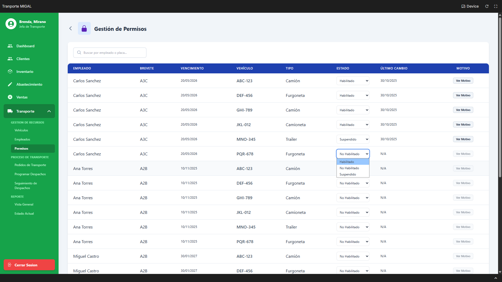
    
3. Al seleccionar un nuevo estado (ej. cambiar de "No Habilitado" a "Habilitado"), el sistema inmediatamente despliega una ventana modal solicitando una justificación: **"Confirmar Cambio de Estado"**. El Jefe de Transporte redacta el **"Motivo del cambio (obligatorio)"** y hace clic en **"Confirmar"** para finalizar la actualización.
    
    
    

---

## Caso de uso #7: Cancelar Artículos de Pedido de Transporte

| **Campo** | **Detalle** |
| --- | --- |
| **ID** | **R-207** |
| **Actor(es)** | Jefe de Transporte |
| **Objetivo** | Cancelar (eliminar) uno o más artículos de un pedido de transporte, o el pedido completo, registrando un motivo obligatorio para la anulación. |
| **Precondiciones** | 1. El **Jefe de Transporte** debe estar logueado en el sistema.    2. Debe existir un pedido en estado "En Proceso" para ser gestionado. |
| **Disparador** | El **Jefe de Transporte** necesita anular artículos (o un pedido completo) por solicitud del cliente o un error interno, y hace clic en el botón "Eliminar". |
| **Flujo Principal** | 1. El **Jefe de Transporte** accede al "Panel de Control Principal" y selecciona "Pedidos de Transporte".    2. En la lista, localiza un pedido (ej. PD001) y hace clic en "VER".    3. Visualiza el detalle del pedido y hace clic en el botón **"Eliminar"**.    4. El sistema muestra la modal **"Cancelar Artículos del Pedido"**.    5. El sistema evalúa el estado de cada artículo: Los que están "En Camino" o "Entregados" ("Recibido") **no se pueden cancelar** y aparecen con el check deshabilitado.    6. El actor selecciona los artículos que desea cancelar (de entre los que están habilitados para ello).    7. El actor ingresa un **"Motivo de la cancelación (obligatorio)"**.    8. El actor hace clic en **"Cancelar Items (X)"** (o "Cancelar Pedido Completo" si todos los artículos son elegibles). |
| **Postcondiciones** | 1. Los artículos seleccionados cambian su estado a "Cancelado" en la base de datos.    2. El motivo de la cancelación queda registrado. |
| **Excepciones** | 1. **"Motivo obligatorio vacío"**: Al hacer clic en "Cancelar Items", el campo "Motivo" está vacío. El sistema muestra un error y no cierra la modal.    2. **"Todos los ítems bloqueados"**: Como en el ejemplo, todos los artículos ya están "En Camino" o "Recibido". El sistema no permite seleccionar ninguno y el usuario solo puede hacer clic en "Volver".    3. **"Cancelación de la acción"**: El usuario hace clic en "Volver". El sistema cierra la modal sin realizar cambios. |
| **Frecuencia de Uso** | Ocasional. Cuando un cliente modifica o anula un pedido antes de que este entre a la fase de "picking" o despacho. |

---

### Flujo Principal del Requerimiento:

1. El **Jefe de Transporte** accede al **"Panel de Control Principal"** y, en la sección "Proceso de Transporte", selecciona **"Pedidos de Transporte"**.
    
    
    
2. Visualiza la lista de **"Pedidos de Transporte"** y busca el pedido que necesita gestionar (ej. PD001, "Constructora G&M S.A.C."). Hace clic en el botón **"VER"** de esa fila.
    
    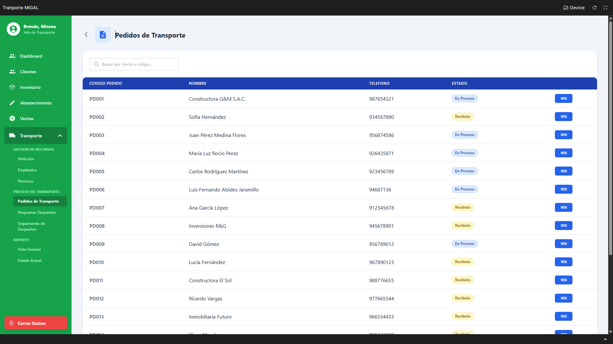
    
3. Accede a la pantalla de detalle del pedido. Para anular artículos, hace clic en el botón **"Eliminar"**, ubicado en la esquina superior derecha.
    
    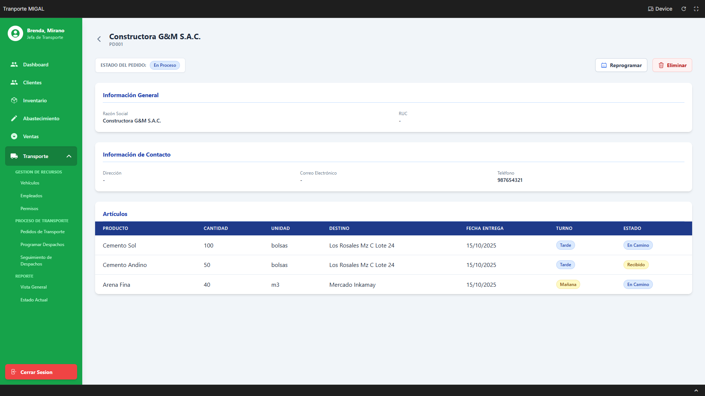
    
4. El sistema muestra la ventana modal **"Cancelar Artículos del Pedido"**. Esta modal advierte que los artículos que ya están "En Camino" o "Entregados" ("Recibido") no se pueden cancelar, mostrando sus casillas de selección deshabilitadas. El Jefe de Transporte selecciona los artículos que *sí* son elegibles para cancelación (si los hay) o elige "Cancelar Pedido Completo". Obligatoriamente, debe redactar el **"Motivo de la cancelación"** en el campo de texto. Finalmente, hace clic en **"Cancelar Items (X)"** (o "Volver" si se arrepiente) para confirmar la operación.
    
    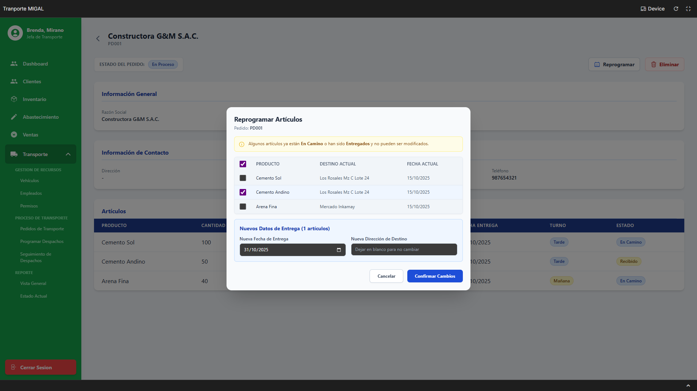
    

---

## Caso de uso #8: Reprogramar Artículos de Pedido de Transporte

| **Campo** | Detalle |
| --- | --- |
| **ID** | **R-208** |
| **Actor(es)** | Jefe de Transporte |
| **Objetivo** | Modificar la fecha de entrega y/o la dirección de destino de uno o varios artículos de un pedido que aún no han sido despachados. |
| **Precondiciones** | 1. El **Jefe de Transporte** debe estar logueado en el sistema.    2. Debe existir un pedido en estado "En Proceso". |
| **Disparador o evento inicial** | El **Jefe de Transporte** necesita cambiar la fecha o lugar de entrega de uno o más artículos y hace clic en el botón "Reprogramar". |
| **Flujo Principal** | 1. El **Jefe de Transporte** accede al "Panel de Control Principal" y selecciona "Pedidos de Transporte".    2. En la lista, localiza un pedido (ej. PD001) y hace clic en "VER".    3. Visualiza el detalle del pedido y hace clic en el botón **"Reprogramar"**.    4. El sistema muestra la modal **"Reprogramar Artículos"**.    5. La modal advierte que artículos "En Camino" o "Entregados" no pueden ser modificados.    6. El actor selecciona (haciendo check) los artículos que desea reprogramar (ej. "Cemento Sol").    7. El actor ingresa los **"Nuevos Datos de Entrega"**: la **"Nueva Fecha de Entrega"** y/o la **"Nueva Dirección de Destino"**.    8. El actor hace clic en **"Confirmar Cambios"**. |
| **Postcondiciones** | 1. La fecha de entrega y/o el destino de los artículos seleccionados se actualizan en la base de datos.    2. La tabla de "Artículos" en el detalle del pedido refleja los nuevos datos programados. |
| **Excepciones** | 1. **"Datos inválidos/vacíos"**: Al hacer clic en "Confirmar Cambios", el actor no ha seleccionado ningún artículo, o la nueva fecha/dirección están vacías o tienen un formato incorrecto.    2. **"Ítems no modificables"**: La advertencia indica que algunos artículos no se pueden modificar (presumiblemente porque ya están "En Camino" o "Recibido"). Si el usuario intenta seleccionarlos (y estuvieran deshabilitados), no podría.    3. **"Cancelación de la acción"**: El usuario hace clic en "Cancelar". El sistema cierra la modal sin realizar cambios. |
| **Frecuencia de Uso** | Ocasional. Se utiliza cuando hay cambios logísticos o a petición explícita del cliente antes del despacho. |

---

### Flujo Principal del Requerimiento:

1. El **Jefe de Transporte** accede al **"Panel de Control Principal"** y, en la sección "Proceso de Transporte", selecciona **"Pedidos de Transporte"**.
    
    
    
2. Visualiza la lista de **"Pedidos de Transporte"** y busca el pedido que necesita modificar (ej. PD001). Hace clic en el botón **"VER"** de esa fila.
    
    
    
3. Accede a la pantalla de detalle del pedido. Para cambiar fechas o destinos, hace clic en el botón **"Reprogramar"**. El sistema muestra la ventana modal **"Reprogramar Artículos"**. Esta modal advierte que los artículos "En Camino" o "Entregados" no pueden ser modificados. El Jefe de Transporte **selecciona los artículos** (ej. "Cemento Sol" y "Cemento Andino") que desea alterar. Ingresa los nuevos datos en los campos **"Nueva Fecha de Entrega"** y/o **"Nueva Dirección de Destino"**. Finalmente, hace clic en **"Confirmar Cambios"** para guardar la reprogramación.
    
    
    

---

## Caso de uso **#9: Programar Nuevo Despacho**

| **Campo** | **Detalle** |
| --- | --- |
| **ID** | R-209 |
| **Actor(es)** | Jefe de Transporte |
| **Objetivo** | Crear un nuevo despacho agrupando artículos de pedidos pendientes, asignando una fecha específica, un vehículo, un operador (conductor), una secuencia de ruta y horarios estimados. |
| **Precondiciones** | 1. El **Jefe de Transporte** debe estar logueado en el sistema.     2. Deben existir "Artículos Pendientes" (aún no asignados a un despacho).     3. Deben existir Vehículos y Operadores disponibles en el sistema. |
| **Disparador** | El **Jefe de Transporte** selecciona la opción "Programar Despachos" desde el panel principal para organizar la logística de entrega. |
| **Flujo Principal** | 1. El **Jefe de Transporte** accede al "Panel de Control Principal" y selecciona "Programar Despachos".     2. El sistema muestra la pantalla "Programar Despachos". El actor elige una **"Fecha de Despacho"** (ej. 01/11/2025) y hace clic en "Confirmar y Seleccionar Pedidos".     3. El sistema muestra la lista de "Artículos Pendientes". El actor selecciona (con un check) los artículos que incluirá en este despacho (ej. PD009, PD021).     4. El actor hace clic en "Crear Despachos (X seleccionados)".     5. **Modal 1:** El sistema muestra "PROGRAMACIÓN DE DESPACHO" (con el nuevo "Código Despacho", ej. DP005) resumiendo los artículos. El actor hace clic en "Siguiente".     6. **Modal 2:** El sistema muestra "ASIGNACION DE RECURSOS". El actor selecciona un **"Vehículo"** (ej. DEF-456) y un **"Operador"** (ej. Ana Torres). Hace clic en "Siguiente".     7. **Modal 3:** El sistema muestra "SECUENCIA DE DESPACHO". El actor asigna un orden numérico de entrega en la columna **"Secuencia"** (ej. 1 y 2). Hace clic en "Siguiente".     8. **Modal 4:** El sistema muestra "HORARIOS ESTIMADOS". El actor ingresa la **"Hora Estimada de Salida"** (ej. 09:00) y la **"Hora Estimada de Regreso"** (ej. 10:30). 9. El actor hace clic en **"Confirmar Despacho"**. |
| **Postcondiciones** | 1. Se crea un nuevo registro de `DESPACHO` (ej. DP005) en la base de datos.     2. Los artículos seleccionados se marcan como "Programados" y se asocian al nuevo despacho.     3. El despacho queda asignado a un vehículo, un operador, con una ruta y horarios definidos. |
| **Excepciones** | 1. **"Sin artículos seleccionados"**: En el paso 4, el actor hace clic en "Crear Despachos" sin marcar ningún artículo.     2. **"Recursos no válidos"**: En el paso 6, los campos "Vehículo" u "Operador" se dejan vacíos.     3. **"Secuencia incompleta"**: En el paso 7, la secuencia está incompleta o duplicada.     4. **"Horarios inválidos"**: En el paso 8, los campos de hora están vacíos, en formato incorrecto, o la hora de regreso es anterior a la de salida.     5. **"Navegación 'Atras'"**: El actor usa el botón "Atras" para corregir un paso anterior. |
| **Frecuencia de uso** | Muy frecuente (Diaria). Es una tarea central de la logística de transporte. |

---

### Flujo Principal del Requerimiento:

1. El **Jefe de Transporte** accede al **"Panel de Control Principal"** y, en la sección "Proceso de Transporte", selecciona **"Programar Despachos"**.
    
    
    
2. El sistema lo dirige a la pantalla **"Programar Despachos"**, que presenta un calendario. Selecciona la **"Fecha de Despacho"** deseada (ej. 01/11/2025) y presiona **"Confirmar y Seleccionar Pedidos"**.
    
    
    
3. Accede a la pantalla **"Seleccionar Pedidos para Despacho"**, que lista todos los "Artículos Pendientes". Aquí, **marca las casillas** de los artículos que agrupará en esta ruta (ej. PD009 "Ganchos para Teja" y PD021 "Tubos PVC 6""). Una vez seleccionados, hace clic en el botón **"Crear Despachos (2 seleccionados)"**.
    
    
    
4. Se inicia un asistente en ventanas modales. La primera, **"PROGRAMACIÓN DE DESPACHO"**, le asigna un código (ej. DP005) y resume los artículos. Hace clic en **"Siguiente"**.
    
    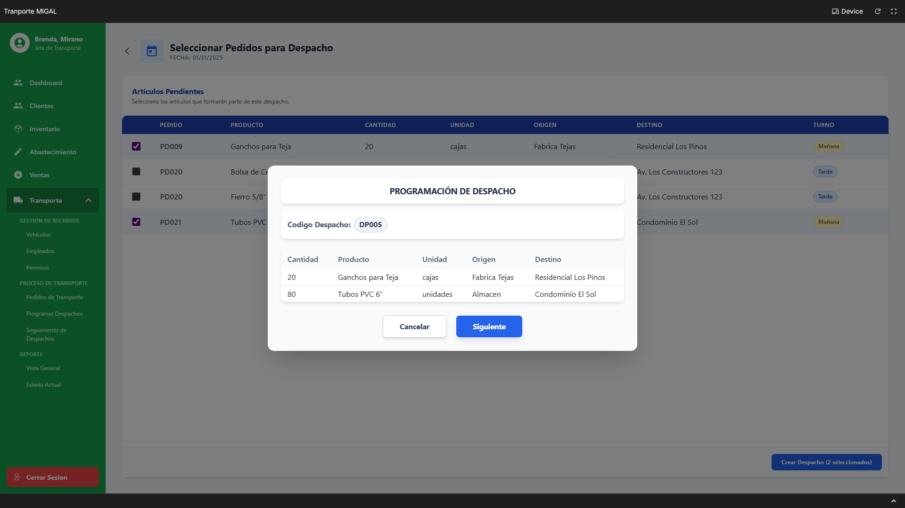
    
5. La segunda modal, **"ASIGNACION DE RECURSOS"**, le permite seleccionar un **"Vehículo"** (ej. DEF-456) y un **"Operador"** (ej. Ana Torres) de las listas desplegables. Presiona **"Siguiente"**.
    
    
    
6. La tercera modal, **"SECUENCIA DE DESPACHO"**, le pide organizar la ruta. Ingresa el orden de parada en el campo **"Secuencia"** (ej. "1" para Condominio El Sol, "2" para Residencial Los Pinos). Presiona **"Siguiente"**.
    
    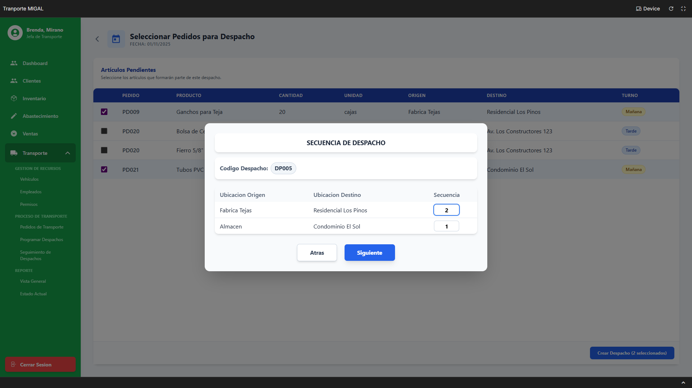
    
7. La última modal, **"HORARIOS ESTIMADOS"**, solicita la **"Hora Estimada de Salida"** (09:00) y **"Hora Estimada de Regreso"** (10:30). Para finalizar y crear la ruta, hace clic en **"Confirmar Despacho"**.
    
    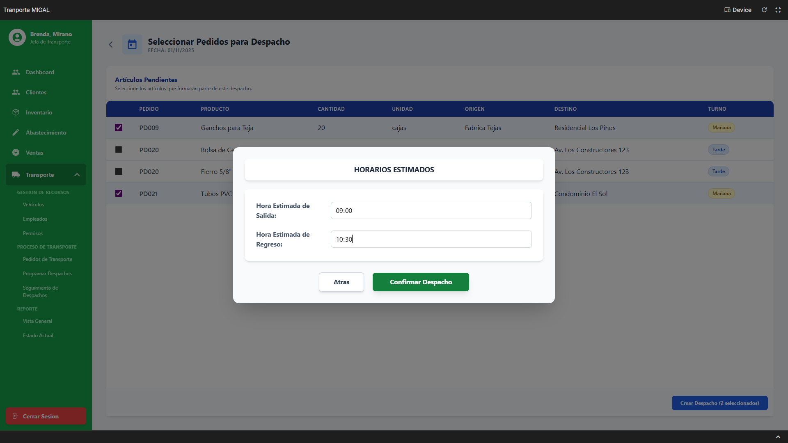
    

---

## Caso de uso #10: Gestionar Seguimiento de Despacho

| **Campo** | **Detalle** |
| --- | --- |
| **ID** | R-210 |
| **Actor(es)** | Jefe de Transporte |
| **Objetivo** | Monitorear y actualizar el estado de un despacho programado en tiempo real, registrando el inicio del "picking", la hora real de salida, las horas de llegada a cada parada, y la hora real de regreso. |
| **Precondiciones** | 1. El **Jefe de Transporte** debe estar logueado en el sistema.     2. Debe existir al menos un despacho en estado "Programado" o "En Ruta". |
| **Disparador** | El **Jefe de Transporte** accede al "Seguimiento de Despachos" y selecciona "VER DETALLE" en un despacho para actualizar su progreso. |
| **Flujo Principal** | 1. El **Jefe de Transporte** accede al "Panel de Control Principal" y selecciona "Seguimiento de Despachos".     2. Visualiza la lista de despachos y hace clic en "VER DETALLE" (ej. del despacho DP005).     3. **Estado Inicial:** Ve el detalle del despacho con las paradas en estado "Pendiente".     4. **Iniciar Picking:** Hace clic en **"Iniciar Picking"**. El estado de las paradas cambia a "Picking".     5. **Registrar Salida:** Ingresa la "Hora Salida (Real)" (ej. 09:15) y hace clic en "Guardar Tiempos".     6. **En Ruta:** Cambia manualmente el "ESTADO" de las paradas de "Picking" a "En Camino" o "En Ruta" y guarda los cambios.     7. **Registrar Paradas:** Ingresa la "HORA DE LLEGADA" (ej. 09:45) y cambia el "ESTADO" a "Entregado". Hace clic en "Guardar Cambios". Repite el proceso para todas las paradas.    9. **Registrar Regreso:** Ingresa la "Hora Regreso (Real)" (ej. 11:00) y hace clic en "Guardar Tiempos". |
| **Postcondiciones** | 1. Todos los tiempos reales (Salida, Llegadas, Regreso) del despacho quedan registrados en el sistema.      2. Todas las paradas del despacho figuran como "Entregado".     3. El estado general del despacho (en la lista) se actualiza a "Completado”. |
| **Excepciones** | 1. **"Cambios sin guardar"**: El actor modifica un estado o una hora pero no hace clic en "Guardar Cambios". El sistema muestra una advertencia "Tiene cambios sin guardar".     2. **"Tiempos inválidos"**: La hora de llegada es anterior a la de salida, o la hora de regreso es anterior a la última llegada. |
| **Frecuencia de uso** | Muy frecuente (Diaria). Se actualiza a medida que los despachos progresan durante el día. |

---

### Flujo Principal del Requerimiento:

1. El **Jefe de Transporte** accede al **"Panel de Control Principal"** y, en "Proceso de Transporte", selecciona **"Seguimiento de Despachos"**.
    
    
    
2. Visualiza la lista de **"Seguimiento de Despachos"** con el estado general de cada uno (Programado, En Ruta, Completado). Hace clic en **"VER DETALLE"** en el despacho que desea gestionar (ej. DP005).
    
    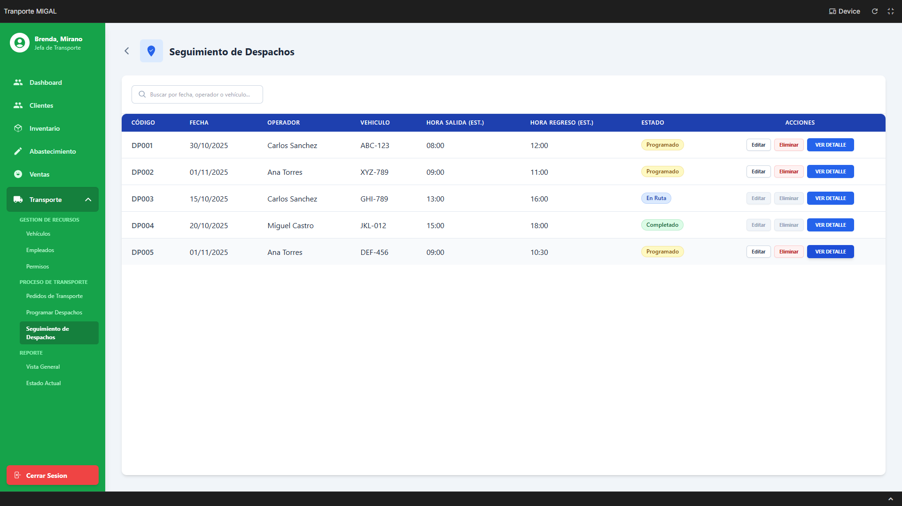
    
3. Accede al **"Detalle de Despacho"** (DP005). Inicialmente, las paradas están en estado **"Pendiente"**.
    
    
    
4. Para comenzar la preparación, hace clic en el botón **"Iniciar Picking"**. El estado de las paradas cambia a **"Picking"**.
    
    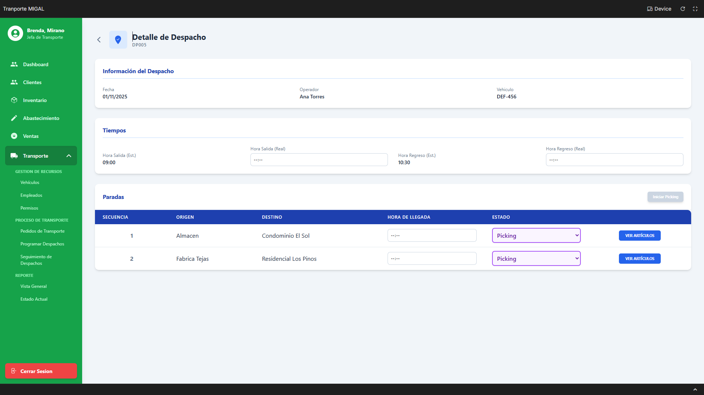
    
5. Cuando el vehículo sale, registra la **"Hora Salida (Real)"** (ej. 09:15) y hace clic en **"Guardar Tiempos"**. Luego, actualiza el estado de las paradas a **"En Ruta"** o "En Camino".
    
    
    
6. A medida que el operador reporta las entregas, el Jefe de Transporte actualiza cada parada: ingresa la **"HORA DE LLEGADA"** (ej. 09:45) y cambia el "ESTADO" a **"Entregado"**. Presiona **"Guardar Cambios"**. Repite esto para todas las paradas (ej. la segunda a las 10:30).
    
    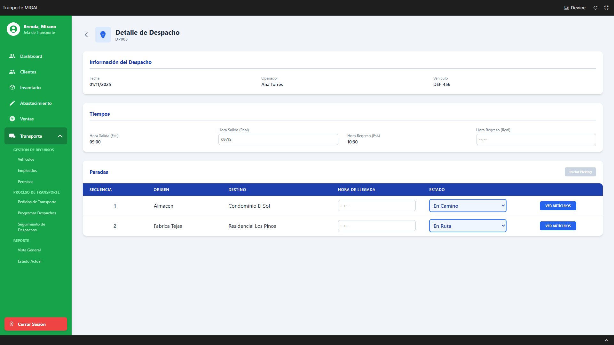
    
    
    
    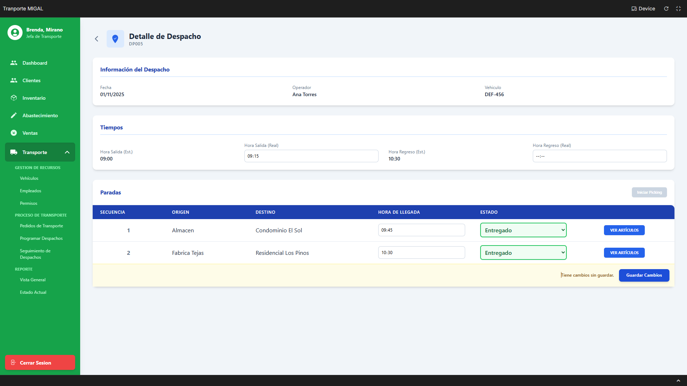
    
7. Cuando el vehículo retorna a la base, registra la **"Hora Regreso (Real)"** (ej. 11:00) y hace clic en **"Guardar Tiempos"** para finalizar el seguimiento del despacho.
    
    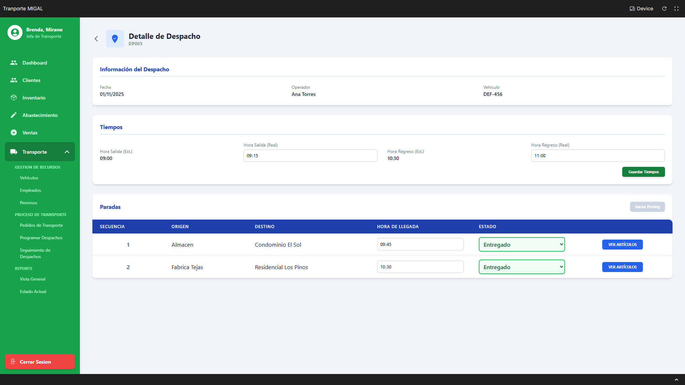
    

---

## Caso de uso **#11: Actualizar Despacho Programado**

| **Campo** | **Detalle** |
| --- | --- |
| **ID** | R-211 |
| **Actor(es)** | Jefe de Transporte |
| **Objetivo** | Modificar los recursos (Vehículo y/o Operador) asignados a un despacho que ya fue programado, pero que aún no ha iniciado su ruta (estado "Programado"). |
| **Precondiciones** | 1. El **Jefe de Transporte** debe estar logueado en el sistema.     2. Debe existir un despacho en estado **"Programado"**. (Los despachos "En Ruta" o "Completados" no son editables). |
| **Disparador** | El **Jefe de Transporte** necesita reasignar un vehículo o un operador a una ruta programada (ej. por un imprevisto) y hace clic en "Editar". |
| **Flujo Principal** | 1. El **Jefe de Transporte** accede al "Seguimiento de Despachos".     2. Localiza un despacho en estado "Programado" (ej. DP005) y hace clic en la opción **"Editar"**.     3. El sistema muestra la modal **"Editar Despacho"** (con el Código DP005).     4. El actor selecciona un nuevo **"Vehículo"** y/o un nuevo **"Operador"** de las listas desplegables (ej. "Lucia Fernandez").     5. El actor hace clic en un botón (ej. "Guardar" o "Confirmar" - no visible en la captura) para aplicar los cambios. |
| **Postcondiciones** | 1. Los recursos (Vehículo y/o Operador) del despacho son actualizados en la base de datos.     2. La lista de "Seguimiento de Despachos" refleja los nuevos datos asignados. |
| **Excepciones** | 1. **"Campos vacíos"**: El actor intenta guardar sin seleccionar un vehículo o un operador.     2. **"Cancelación de la acción"**: El actor cierra la modal sin guardar. Los datos del despacho no se alteran. |
| **Frecuencia de uso** | Ocasional. Se usa para reasignaciones de última hora antes de que un vehículo inicie su ruta. |

---

### Flujo Principal del Requerimiento:

1. El **Jefe de Transporte** accede al **"Panel de Control Principal"** y, en la sección "Proceso de Transporte", selecciona **"Seguimiento de Despachos"**.
    
    
    
2. Visualiza la lista de **"Seguimiento de Despachos"**. Busca una ruta que esté en estado **"Programado"** (ej. DP005) y hace clic en la opción **"Editar"** de esa fila.
    
    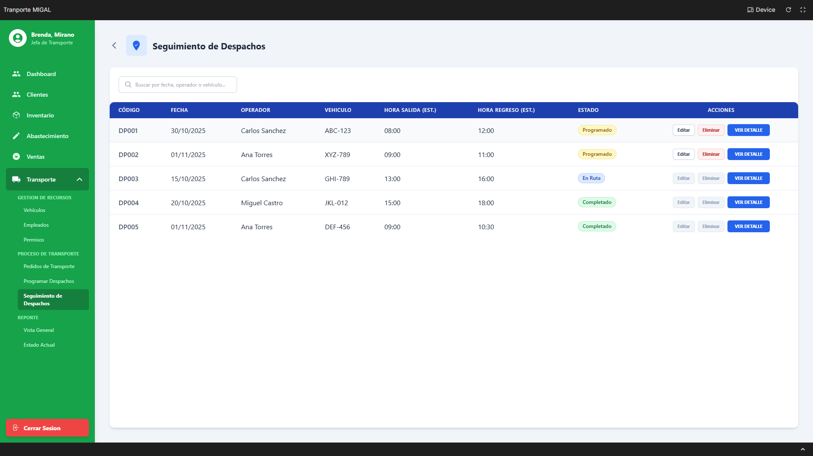
    
3. El sistema muestra la ventana modal **"Editar Despacho"**, cargando los datos actuales de ese despacho. Se selecciona un nuevo **"Vehículo"** y/o un nuevo **"Operador"** (ej. "Lucia Fernandez") de las listas desplegables. Una vez realizados los cambios, hace clic en el botón de guardar para confirmar la reasignación.
    
    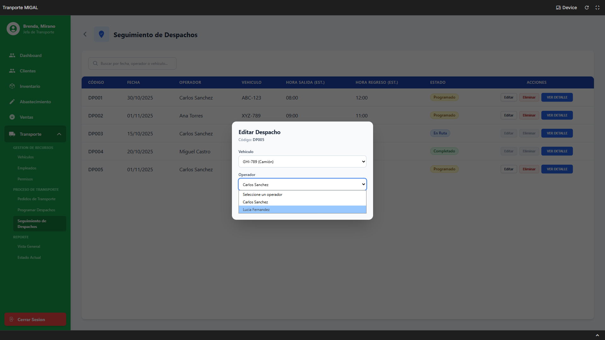
    

---

## Caso de uso #12: Eliminar Despacho Programado

| **Campo** | **Detalle** |
| --- | --- |
| **ID** | R-212 |
| **Actor(es)** | Jefe de Transporte |
| **Objetivo** | Cancelar/eliminar un despacho completo que está "Programado", devolviendo los artículos asociados a su estado anterior para que puedan ser reprogramados. |
| **Precondiciones** | 1. El **Jefe de Transporte** debe estar logueado en el sistema.     2. Debe existir un despacho en estado **"Programado"**. (Los despachos "En Ruta" o "Completados" no se pueden eliminar). |
| **Disparador** | El **Jefe de Transporte** necesita anular una ruta programada y hace clic en "Eliminar". |
| **Flujo Principal** | 1. El **Jefe de Transporte** accede al "Seguimiento de Despachos".     2. Localiza un despacho en estado "Programado" (ej. DP001) y hace clic en la opción **"Eliminar"**.     3. El sistema muestra la modal de advertencia **"Eliminar Despacho"**.     4. La modal informa que los artículos asociados volverán al estado "Recibido" (o similar) para ser reprogramados.     5. El actor confirma la anulación haciendo clic en el botón rojo **"Sí, Eliminar"**. |
| **Postcondiciones** | 1. El registro del `DESPACHO` (ej. DP001) es eliminado de la base de datos.     2. Todos los artículos que pertenecían a ese despacho vuelven a estar disponibles en la pantalla "Programar Despachos". |
| **Excepciones** | 1. **"Cancelación de la acción"**: El actor hace clic en "Cancelar". El sistema cierra la modal y el despacho no sufre cambios. |
| **Frecuencia de uso** | Ocasional. Se usa cuando una ruta completa debe ser anulada antes de su inicio. |

---

### Flujo Principal del Requerimiento:

1. El **Jefe de Transporte** accede al **"Panel de Control Principal"** y selecciona **"Seguimiento de Despachos"**.
    
    
    
2. Visualiza la lista de **"Seguimiento de Despachos"**. Busca una ruta que esté en estado **"Programado"** (ej. DP001) y hace clic en la opción **"Eliminar"** de esa fila.
    
    
    
3. El sistema muestra una ventana modal de advertencia **"Eliminar Despacho"**, informando que la acción es irreversible y que los artículos volverán a estar disponibles para programar. Se confirma la anulación del despacho haciendo clic en el botón rojo **"Sí, Eliminar"**.
    
    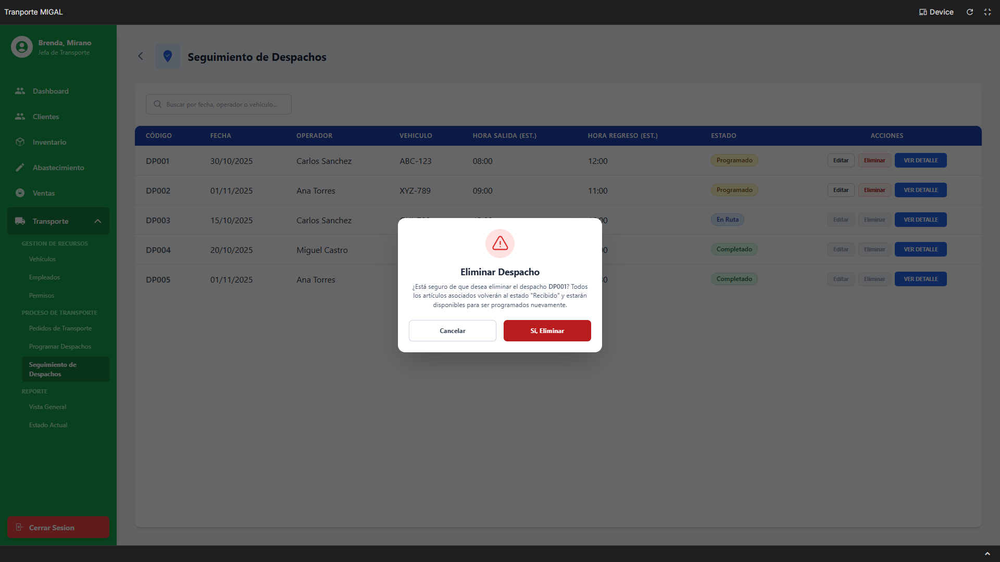
    

---

## Caso de uso **#13: Consultar Reporte de Vista General**

| **Campo** | **Detalle** |
| --- | --- |
| **ID** | R-213 |
| **Actor(es)** | Jefe de Transporte |
| **Objetivo** | Consultar un resumen operativo (dashboard) de los pedidos y despachos para una fecha específica, permitiendo ver el estado general (recibidos, programados, completados), la carga por turnos, la lista de pedidos del día y la programación horaria de los despachos. |
| **Precondiciones** | 1. El **Jefe de Transporte** debe estar logueado en el sistema. |
| **Disparador** | El **Jefe de Transporte** accede a la "Vista General" y selecciona una fecha para analizar la carga de trabajo de ese día. |
| **Flujo Principal** | 1. El **Jefe de Transporte** accede al "Panel de Control Principal" y selecciona "Vista General" en la sección "Reporte".     2. El sistema muestra la pantalla "Vista General" con un calendario.     3. El actor selecciona una fecha (ej. 30/10/2025). 4. La pantalla se actualiza con la información de esa fecha:       a. Se cargan las tarjetas de estado (ej. "Pedidos Programados: 2").       b. Se carga el "Resumen de Pedidos por Turno" (ej. "Mañana: 1").       c. Se popúla la tabla "Pedidos del Dia" (ej. PD005, PD006).       d. Se actualiza la barra lateral "Horario del Dia" (ej. "1 Despacho" en 08:00-09:00). |
| **Flujo Alternativo** | **A1: Consultar Items del Pedido**        1. En el flujo principal, en la tabla "Pedidos del Dia", el actor hace clic en **"Ver Items"** (ej. para PD005).        2. El sistema muestra la modal **"Detalle del Pedido" (PD005)** con la lista de productos (ej. Cemento Sol).     **A2: Consultar Despachos y Paradas del Pedido**        1. En el flujo principal, en la tabla "Pedidos del Dia", el actor hace clic en **"Ver Despachos"** (ej. para PD005).        2. El sistema muestra la modal **"Despachos Asociados al Pedido"** (ej. DP001).        3. (Sub-flujo) El actor hace clic en **"Ver Paradas"**.        4. El sistema muestra la modal **"Detalle de Paradas del Despacho" (DP001)** con la secuencia de la ruta.      **A3: Consultar Despachos por Franja Horaria**        1. En el flujo principal, en la barra lateral "Horario del Dia", el actor hace clic en un enlace de despacho (ej. "1 Despacho" en la franja 08:00 - 09:00).        2. El sistema muestra la modal **"Despachos Activos"** con la lista de despachos en esa franja horaria (ej. DP001). |
| **Postcondiciones** | 1. El actor ha consultado la información operativa detallada del día seleccionado. |
| **Excepciones** | 1. **"Fecha sin pedidos"**: En el paso 3, el actor selecciona una fecha sin actividad. El sistema muestra el mensaje "No hay pedidos para la fecha seleccionada". |
| **Frecuencia de uso** | Muy frecuente (Diaria). Es la pantalla principal de monitoreo diario. |

---

### Flujo Principal del Requerimiento:

1. El **Jefe de Transporte** accede al **"Panel de Control Principal"** y, en la sección "Reporte", selecciona **"Vista General"**.
    
    
    
2. El sistema muestra la pantalla "Vista General", donde primero debe seleccionar una fecha en el calendario (ej. 30/10/2025).
    
    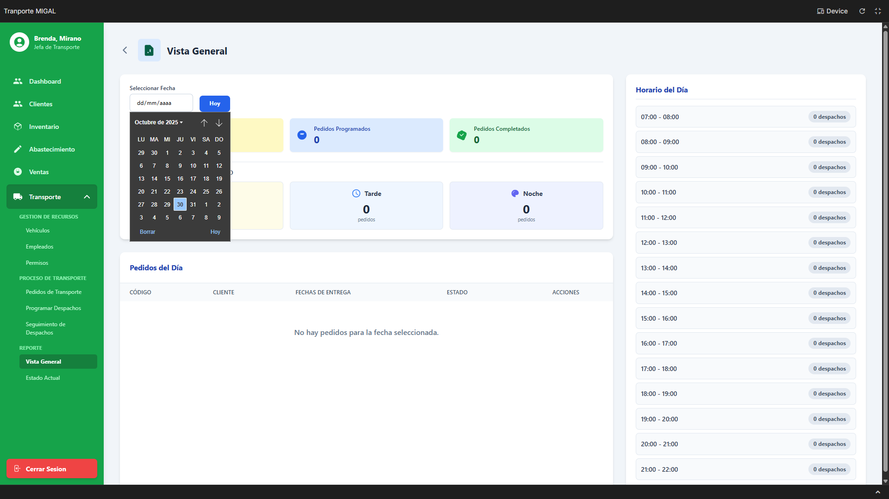
    
3. Una vez seleccionada la fecha, la pantalla se actualiza mostrando un dashboard completo de ese día. El Jefe de Transporte puede ver los contadores de pedidos (Programados, Completados), el resumen de pedidos por turno (Mañana, Tarde) y la lista de "Pedidos del Dia".
    
    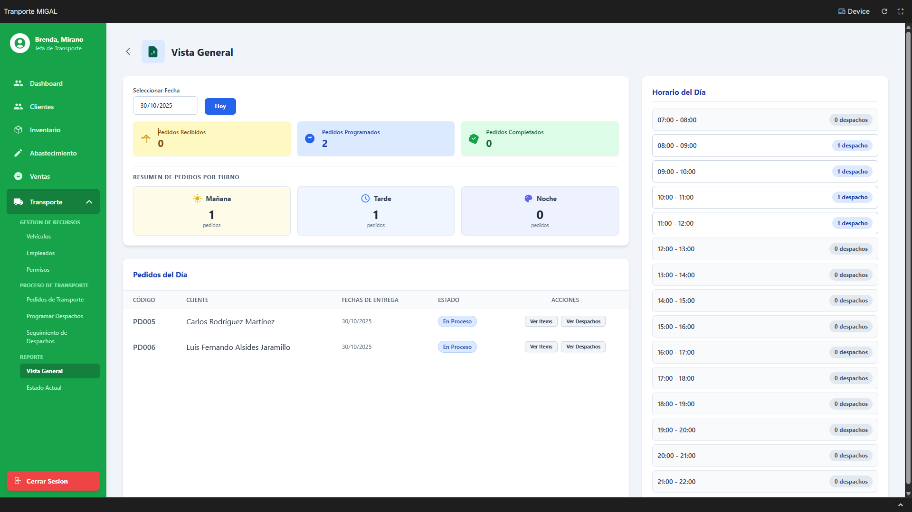
    
4. **Para ver detalles específicos**, puede realizar varias acciones desde este dashboard:
    - **Ver Ítems de un Pedido:** En la tabla "Pedidos del Dia", al lado del pedido PD005, hace clic en **"Ver Items"**. Esto abre la modal **"Detalle del Pedido"**, donde ve los productos específicos de ese pedido.
        
        
        
    - **Ver Despachos de un Pedido:** En la misma tabla, al lado del pedido PD005, hace clic en **"Ver Despachos"**. Esto abre la modal **"Despachos Asociados al Pedido"**, mostrando el despacho DP001. Si desea ver la ruta de ese despacho, puede hacer clic en **"Ver Paradas"** para abrir una tercera modal con el detalle de las paradas.
        
        
        
        
        
    - **Ver Despachos por Hora:** En la barra lateral "Horario del Dia", hace clic en el enlace **"1 Despacho"** (en la franja 08:00 - 09:00). Esto abre la modal **"Despachos Activos"**, mostrando que el despacho DP001 es el que está programado en esa hora.
        
        
