# 3.2. Módulo 2: Transporte
| Requerimiento | Nombre                                    |
| ------------- | ----------------------------------------- |
| **R-201**     | Gestionar Recursos (vehículos y personal) |
| **R-202**     | Integrar Pedidos                          |
| **R-203**     | Planificar Despachos y Rutas              |
| **R-204**     | Asignar y Coordinar Carga                 |
| **R-205**     | Monitorear Ejecución en Ruta              |
| **R-206**     | Registrar Entrega                         |

## Caso de uso #1: Gestionar Recursos (vehículos y personal)

| **Campo** | **Detalle** |
|---|---|
| **ID** | **R-201** |
| **Actor(es)** | Jefe de Transporte |
| **Objetivo** | Mantener el registro y la disponibilidad de **vehículos** y **operadores** (conductores/personal de carga). |
| **Precondiciones** | El usuario de transporte debe estar logueado en el sistema. |
| **Disparador** | El usuario ingresa al módulo de Transporte y desea registrar o actualizar unidades u operadores, o consultar su disponibilidad. |
| **Flujo Principal** | 1. El usuario accede a la vista de Transporte. 2. Selecciona el menú Recursos. 3. Elige “Gestionar Vehículos” o “Gestionar Operadores”. 4. Para Vehículos, registra o actualiza datos (placa, capacidad, estado, vigencias). 5. Para Operadores, registra o actualiza datos (licencias, contacto, habilitaciones). 6. Registra la disponibilidad/turnos y mantenimientos. 7. Confirma los cambios para que sean guardados. |
| **Postcondiciones** | Catálogos actualizados y **agenda** de disponibilidad registrada. |
| **Excepciones** | 1. Datos inválidos o duplicados (placa/DNI).     2.Falta de permisos. |
| **Requerimientos especiales** | Validar vigencias (SOAT/licencia). Historial de cambios. |
| **Frecuencia de uso** | Ocasional (altas/bajas) y diaria (consultar disponibilidad). |

### Flujo Principal del Requerimiento:

1. El Jefe de Transporte abre Transporte → Recursos y elige Vehículos u Operadores.
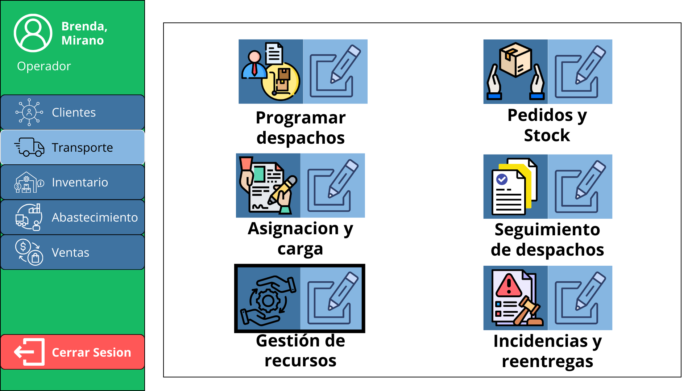

2.  Seleccionar el tipo de recurso a gestionar
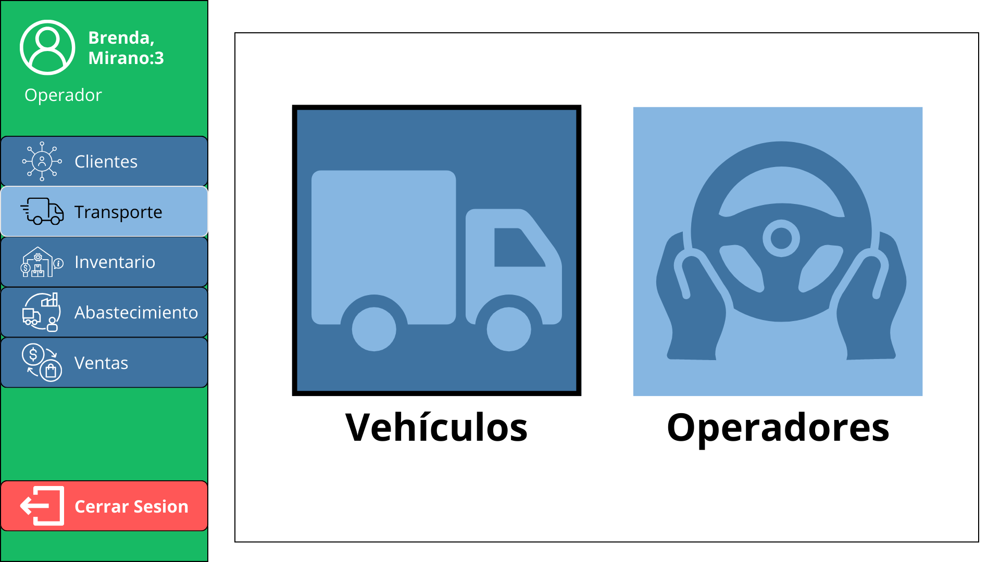
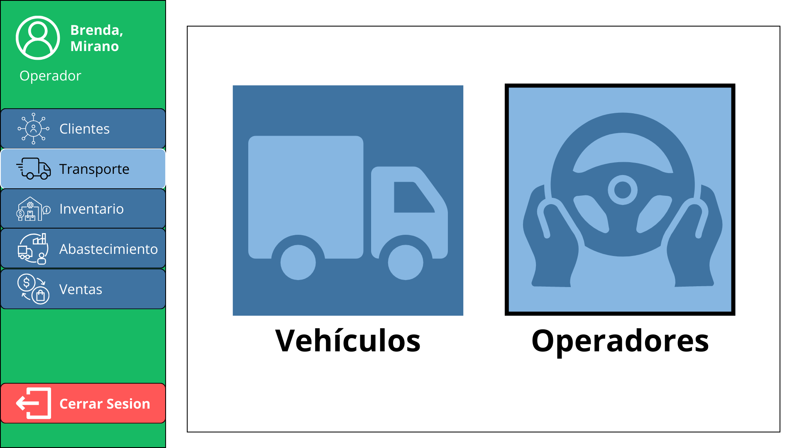

4.  Consulta el listado de recursos (operadores, vehiculos)

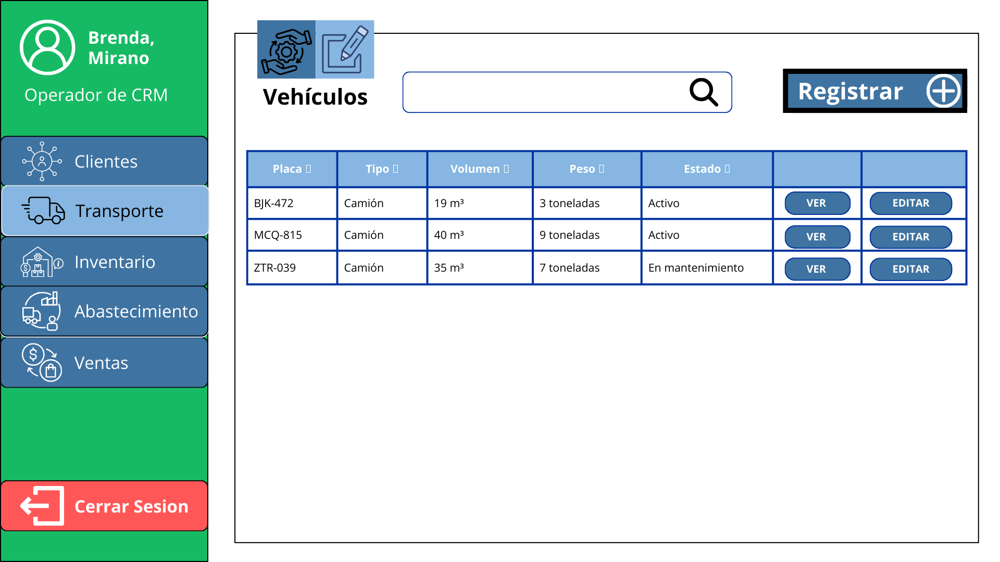

4. Registra/actualiza datos: para vehículos y para operadores.
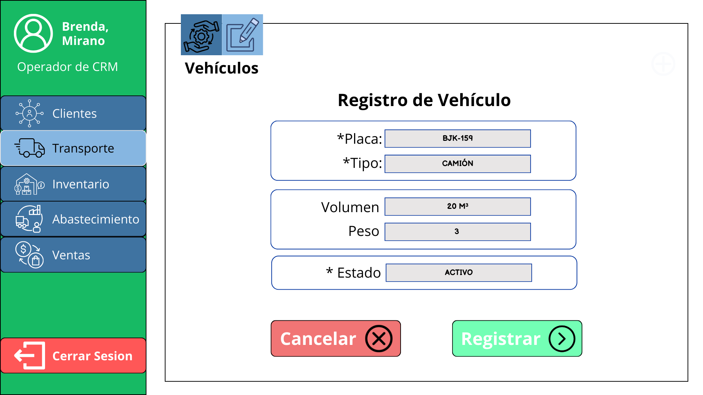
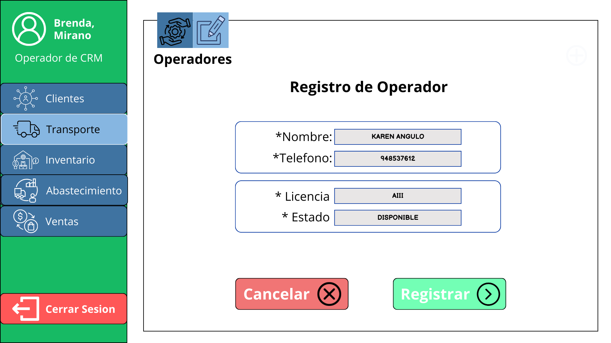
5.  Guarda cambios.
 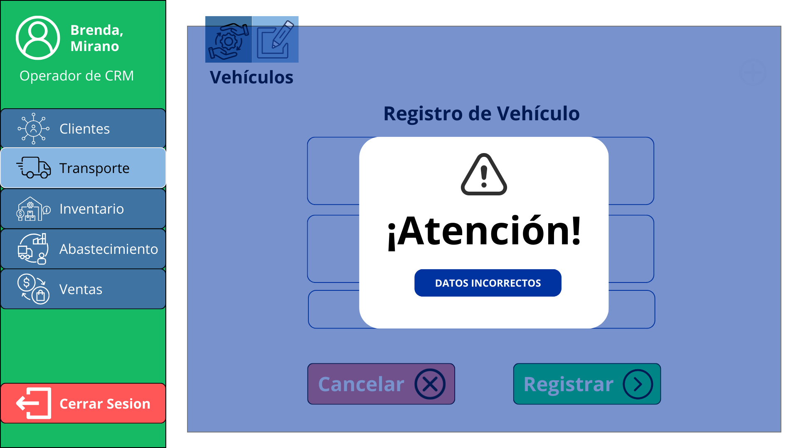
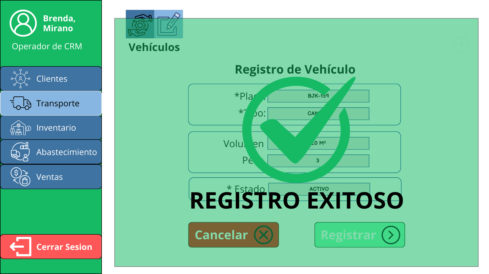
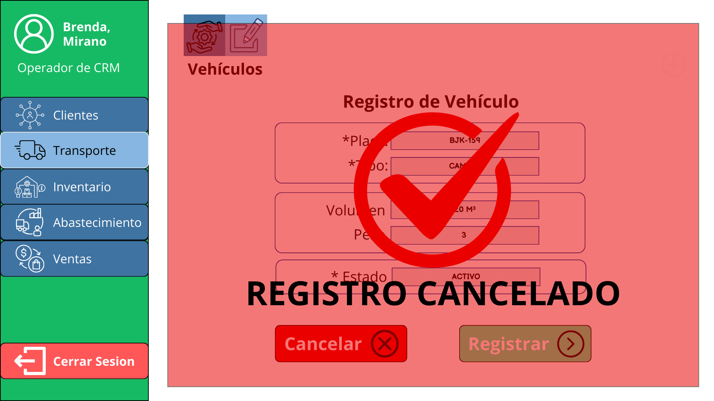

## Caso de uso #2: Integrar Pedidos y Stock

| **Campo**             | **Detalle**                                                                                                                                                                                                                                                                                                                                                                 |
| --------------------- | --------------------------------------------------------------------------------------------------------------------------------------------------------------------------------------------------------------------------------------------------------------------------------------------------------------------------------------------------------------------------- |
| **ID**                | **R-202**                                                                                                                                                                                                                                                                                                                                                                   |
| **Actor(es)**         | Jefe de Transporte, Jefe de Ventas, Jefe de Abastecimiento                                                                                                                                                                                                                                                                                                                  |
| **Objetivo**          | Visualizar los pedidos recibidos, diferenciando entre los que provienen de ventas o de abastecimiento, para su integración y planificación.                                                                                                                                                                                                                                 |
| **Precondiciones**    | Los pedidos ya están registrados en el sistema y se encuentran disponibles para su planificación.                                                                                                                                                                                                                                                                           |
| **Disparador**        | Pedido recibido o actualización de disponibilidad.                                                                                                                                                                                                                                                                                                                          |
| **Flujo Principal**   | 1. El usuario accede a la vista de pedidos. 2. Visualiza la lista de pedidos recibidos y clasificados. 3. Revisa los detalles (origen, dirección, ubicación de destino). 4. Marca los pedidos para integrar en el sistema, diferenciando entre los pedidos provenientes de ventas o de abastecimiento. 5. Registra los pedidos para su posterior planificación. |
| **Postcondiciones**   | Pedidos integrados y listos para ser procesados en la planificación de despachos.                                                                                                                                                                                                                                                                                           |
| **Excepciones**       | 1. Datos incompletos o inconsistentes en la dirección. 2. Falla en la actualización de disponibilidad.                                                                                                                                                                                                                                                                   |
| **Frecuencia de uso** | Diaria, según el flujo de pedidos recibidos.                                                                                                                                                                                                                                                                                                                                |
                                                                                                                                                                                                                                                                                                                                      |

### Flujo Principal del Requerimiento:

1. El usuario accede a la vista de Transporte.

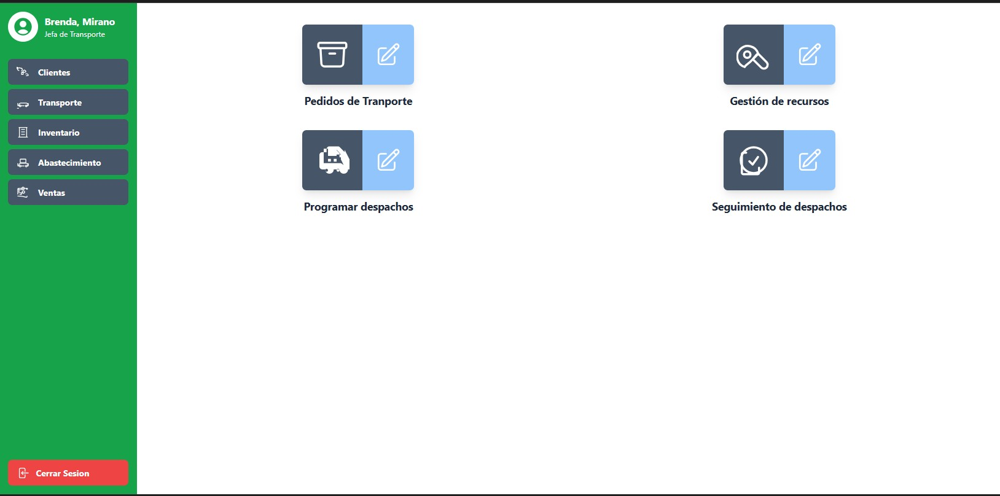

2.  Selecciona pedidos de transporte

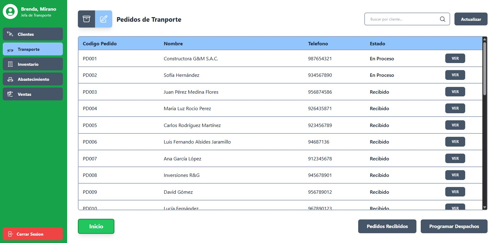

3. Presionamos el boton de ver para visualizar los detalles.
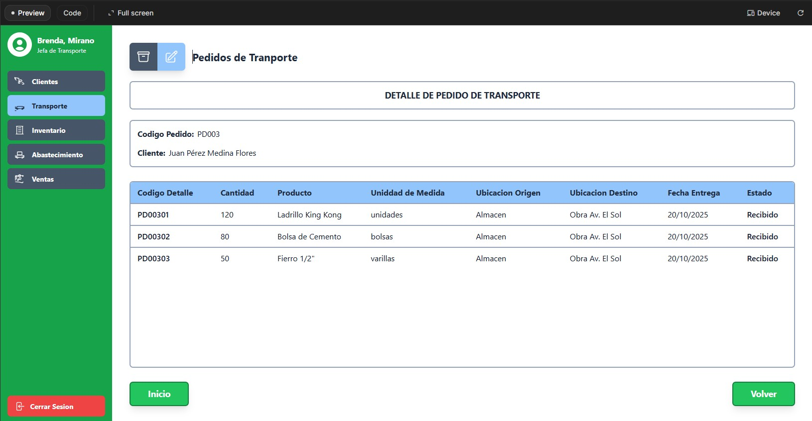
4. Marca el estado como recibido
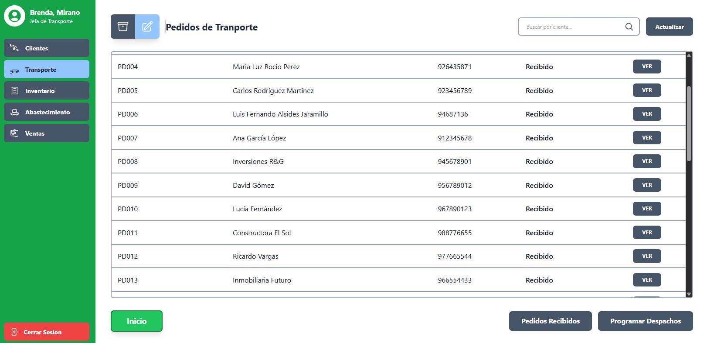
## Caso de uso #3: Planificar Despachos y Rutas

| **Campo**               | **Detalle**                                                                                                                                                                                                                                                                                                                       |
| ----------------------- | --------------------------------------------------------------------------------------------------------------------------------------------------------------------------------------------------------------------------------------------------------------------------------------------------------------------------------- |
| **ID**                  | **R-203**                                                                                                                                                                                                                                                                                                                         |
| **Actor(es)**           | Jefe de Transporte                                                                                                                                                                                                                                                                                                                |
| **Objetivo**            | Consolidar pedidos para su despacho, validando la capacidad y asignando las paradas en una ruta.                                                                                                                                                                                                                                  |
| **Precondiciones**      | Pedidos en stock listos para despacho (R-202); recursos con disponibilidad (R-201).                                                                                                                                                                                                                                               |
| **Disparador**          | Planificación diaria del despacho o nueva demanda prioritaria.                                                                                                                                                                                                                                                                    |
| **Flujo Principal**     | 1. El usuario accede a la vista de planificación. 2. Filtra pedidos por fecha/zona. 3. Selecciona los pedidos para realizar el despacho. 4. Asigna las paradas de acuerdo con la proximidad y ventana horaria. 5. Valida la capacidad (peso, volumen). 6. Guarda el borrador de la hoja de ruta para su ejecución. |
| **Flujos alternativos** | 1. Exceso de capacidad → dividir en despachos adicionales.                                                                                                                                                                                                                                                                        |
| **Postcondiciones**     | Despacho(s) planificado(s) con paradas y tiempos estimados.                                                                                                                                                                                                                                                                       |
| **Excepciones**         | 1. Falta de datos de peso/volumen. 2. Inconsistencia de tiempos/ventanas.                                                                                                                                                                                                                                                      |
| **Frecuencia de uso**   | Diaria.                                                                                                                                                                                                                                                                                                                           |

### Flujo Principal del Requerimiento:

1. El usuario accede a la vista de Transporte y generar despachos

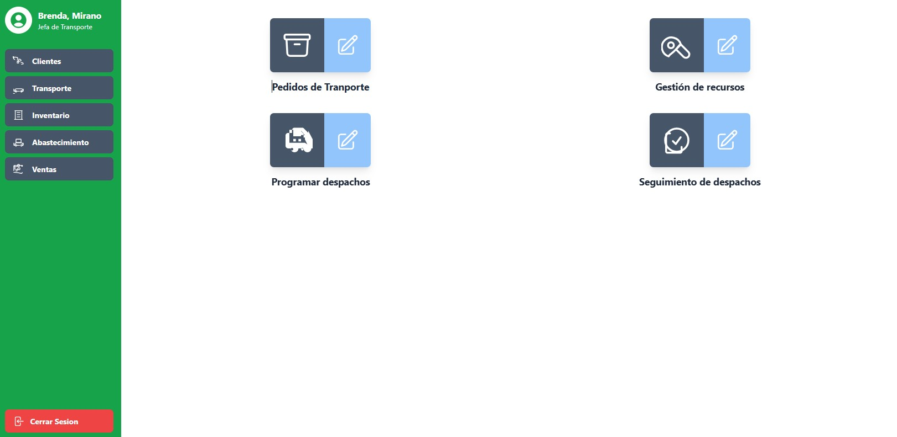

2. Seleccionar la fecha a programar
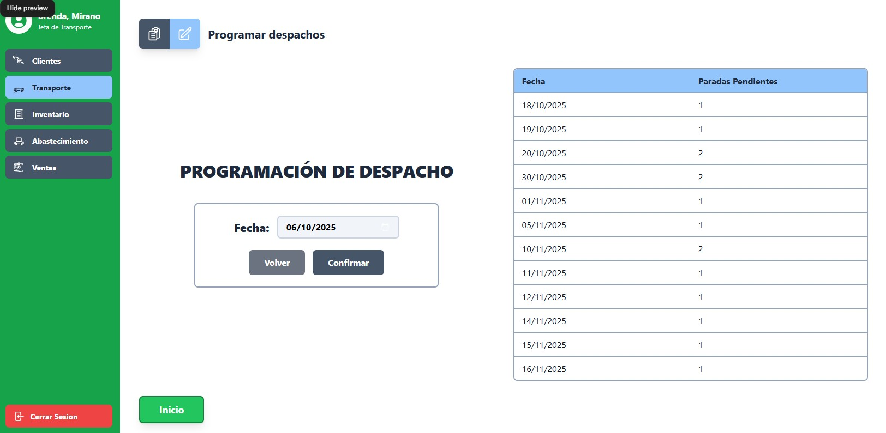
3. Se visualiza los detalles de los pedidos recibidos
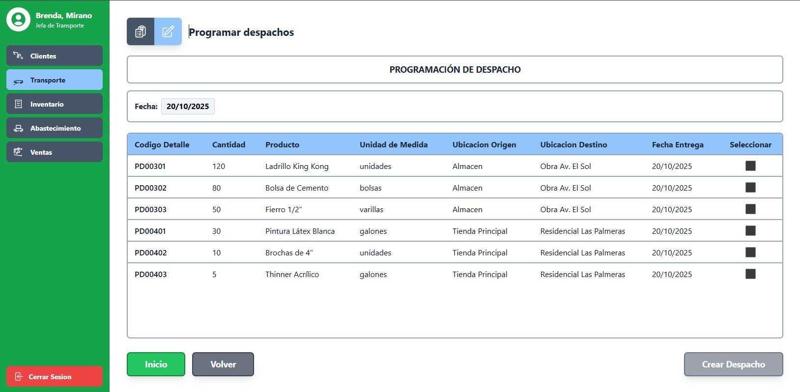
4. Se elige los detalles a entregar y se crea un despacho
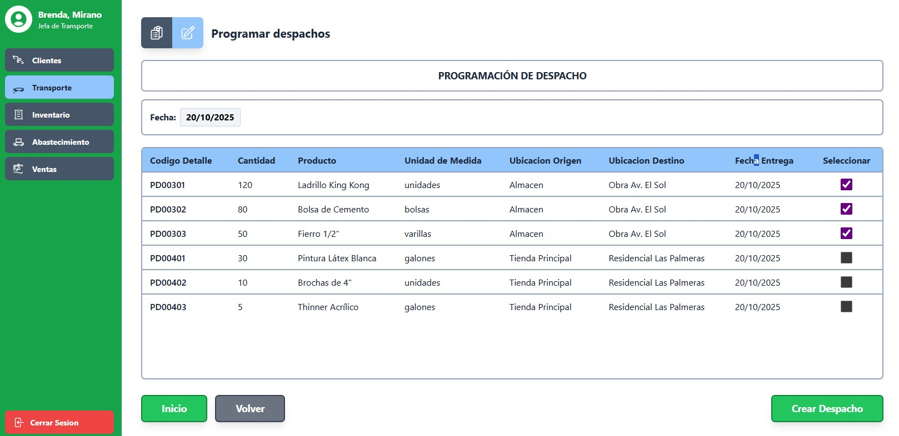
5. Se elige la secuencia de entrega
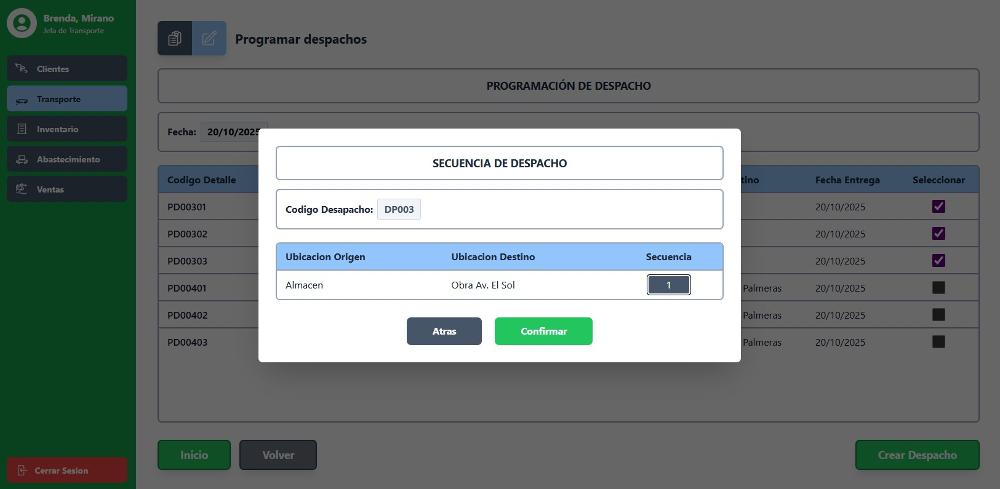

## Caso de uso #4: Asignar y Coordinar Carga

| **Campo**               | **Detalle**                                                                                                                                                                                                                                                                                            |
| ----------------------- | ------------------------------------------------------------------------------------------------------------------------------------------------------------------------------------------------------------------------------------------------------------------------------------------------------ |
| **ID**                  | **R-204**                                                                                                                                                                                                                                                                                              |
| **Actor(es)**           | Jefe de Transporte, Jefe de Abastecimiento                                                                                                                                                                                                                                                             |
| **Objetivo**            | Asignar vehículo y operador a un despacho, y coordinar la carga con el almacén.                                                                                                                                                                                                                        |
| **Precondiciones**      | Despacho planificado (R-203); recursos disponibles (R-201).                                                                                                                                                                                                                                            |
| **Disparador**          | Confirmación de despacho a ejecutar.                                                                                                                                                                                                                                                                   |
| **Flujo Principal**     | 1. El usuario selecciona programar despacho. 2. Asigna un vehículo y un operador. 4. Reserva la bahía/ventana de carga con el almacén. 5. Emite la lista de picking. 6. Confirma la asignación y coordinación para que quede registrada. |
| **Flujos alternativos** | 1. Reemplazar vehículo si está ocupado. 2. Conflicto de bahía → elegir nueva ventana.                                                                                                                                                                                                               |
| **Postcondiciones**     | Despacho asignado con bahía/ventana de carga y picking enviado al almacén.                                                                                                                                                                                                                             |
| **Excepciones**         | 1. Falta de recursos disponibles. 2. Conflictos de coordinación.                                                                                                                                                                                                                                    |
| **Frecuencia de uso**   | Diaria.                                                                                                                                                                                                                                                                                                |

### Flujo Principal del Requerimiento:

1. Se asigna los recurso a el despacho selccionado
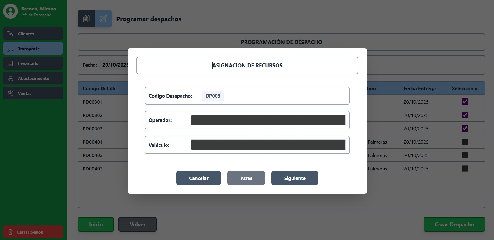
## Caso de uso #5: Monitorear Ejecución en Ruta

|| **Campo**               | **Detalle**                                                                                                                                                                                                                                                                                 |
| ----------------------- | ------------------------------------------------------------------------------------------------------------------------------------------------------------------------------------------------------------------------------------------------------------------------------------------- |
| **ID**                  | **R-205**                                                                                                                                                                                                                                                                                   |
| **Actor(es)**           | Jefe de Transporte, Cliente                                                                                                                                                                                                                                                                 |
| **Objetivo**            | Hacer seguimiento en tiempo real de los despachos en ejecución, actualizando el estado de cada parada.                                                                                                                                                                                      |
| **Precondiciones**      | Despacho asignado y coordinado (R-204).                                                                                                                                                                                                                                                     |
| **Disparador**          | Inicio de la carga o salida a ruta.                                                                                                                                                                                                                                                         |
| **Flujo Principal**     | 1. El usuario accede al tablero del día. 2. Visualiza los despachos y paradas en curso. 3. Actualiza el estado de las paradas (en carga → en ruta → entregado). 4. Revisa el progreso de cada parada. 5. Se envían notificaciones a los clientes sobre el estado de su entrega. |
| **Flujos alternativos** | 1. Replanificar paradas si se presentan demoras o problemas en ruta.                                                                                                                                                                                                                        |
| **Postcondiciones**     | Estado actualizado de los despachos y paradas; notificaciones enviadas.                                                                                                                                                                                                                     |
| **Excepciones**         | 1. Fallo de comunicación con el operador. 2. Demoras o desvíos en la ruta.                                                                                                                                                                                                               |
| **Frecuencia de uso**   | Continua durante la jornada.                                                                                                                                                                                                                                                                |
1. Se visualiza los despachos programados

### Flujo Principal del Requerimiento:

1. Se visualiza los despachos programados
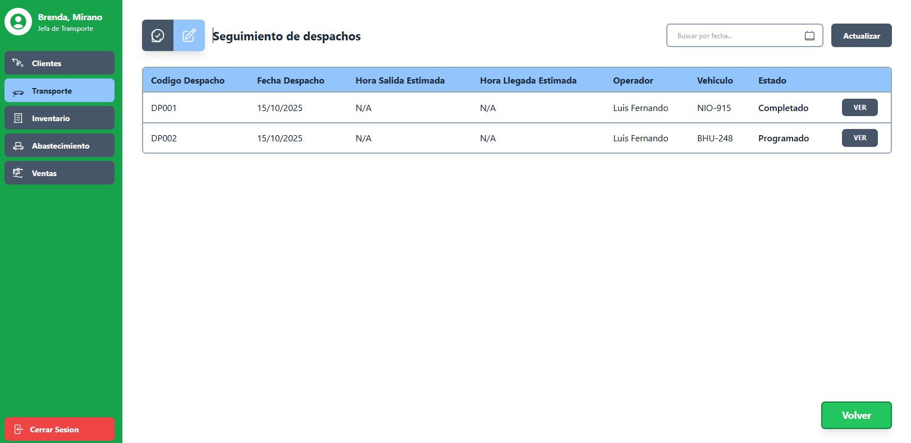

## Caso de uso #6: Registrar Entrega

| **Campo**               | **Detalle**                                                                                                                                                                                                                                                             |
| ----------------------- | ----------------------------------------------------------------------------------------------------------------------------------------------------------------------------------------------------------------------------------------------------------------------- |
| **ID**                  | **R-206**                                                                                                                                                                                                                                                               |
| **Actor(es)**           | Operador, Cliente, Sistema                                                                                                                                                                                                                                              |
| **Objetivo**            | Registrar la entrega completa o parcial, y capturar la prueba de entrega (PoD) asociada.                                                                                                                                                                                |
| **Precondiciones**      | Despacho en ruta (R-205); checklist de carga completado.                                                                                                                                                                                                                |
| **Disparador**          | Llegada a la parada de entrega.                                                                                                                                                                                                                                         |
| **Flujo Principal**     | 1. El operador accede al menú de entrega. 2. Visualiza los productos y cantidades a entregar. 3. Registra la entrega (completa o parcial). 4. Captura la prueba de entrega (PoD) mediante firma o foto. 5. Actualiza el estado de la parada a "completado". |
| **Flujos alternativos** | 1. Error en la guía → regularizar la documentación. 2. Entrega parcial → registrar detalles y motivos.                                                                                                                                                               |
| **Postcondiciones**     | PoD almacenado, estado actualizado de la parada y del despacho.                                                                                                                                                                                                         |
| **Excepciones**         | 1. Cliente rechaza la entrega. 2. Falta de documentación.                                                                                                                                                                                                            |
| **Frecuencia de uso**   | Varias veces al día, por parada.                                                                                                                                                                                                                                        |

### Flujo Principal del Requerimiento:

1. Se visualiza las paradas y se actualiza estado
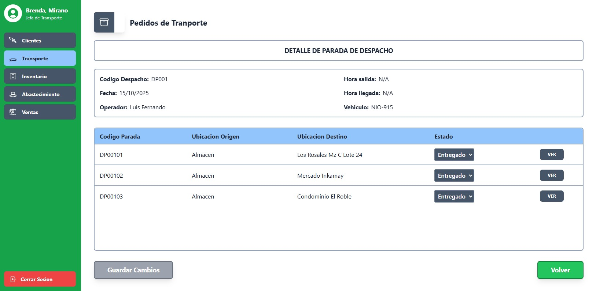

