# 3.3. Módulo 3: Almacén
# Requerimientos del Sistema

| Requerimiento | Nombre |
|---------------|--------------------------------------------|
| R-301         | Gestionar Equipo de Almacén                |
| R-302         | Recepción y Ubicación de Mercancía         |
| R-303         | Gestión y Precisión de Inventario (Conteo Cíclico) |
| R-304         | Control de Stock y Reposición Automática   |
| R-305         | Consulta de Inventario Multi-Ubicación     |
| R-306         | Preparación de Pedidos para Ruta (Picking) |
| R-307         | Despacho y Documentación de Salida         |

---

## Caso de Uso #1: Gestionar Equipo de Almacén

| Campo                  | Descripción |
|-------------------------|-------------|
| **ID**                 | R-301 |
| **Actor(es)**           | Jefe de Almacén |
| **Objetivo**            | Gestionar el personal del almacén, permitiendo registrar nuevos operadores, consultar su información, modificar sus datos y asignarles responsabilidades en las tareas. |
| **Precondiciones**      | El usuario "Jefe de Almacén" debe haber iniciado sesión en el sistema. |
| **Disparador**          | El Jefe de Almacén necesita administrar los datos de su equipo, asignar tareas de conteo o ver las solicitudes de preparación de ruta enviadas por Transporte. |
| **Flujo Principal**     | 1. El usuario accede a la sección "Gestión de Equipo". 2. El sistema muestra la lista de operadores y las solicitudes de preparación pendientes. 3. Para añadir un operador: El usuario selecciona [Añadir Operador], completa el formulario y guarda. 4. Para consultar/modificar: El usuario hace clic en un trabajador para ver o editar sus detalles. 5. Para asignar una tarea: El usuario selecciona una solicitud (de picking o conteo), elige a uno o más operadores de la lista y confirma la asignación. |
| **Postcondiciones**     | La lista de personal está actualizada y las tareas tienen operadores responsables registrados en el sistema. |
| **Excepciones**         | A. DNI duplicado: El sistema no permitirá registrar un operador con un DNI ya existente. |
| **Requerimientos especiales** | La información de los trabajadores solo debe ser accesible por el rol de "Jefe de Almacén". |
| **Frecuencia de uso**   | Consulta/Asignación: Constante. Añadir/Modificar: Ocasional. |

### Flujo Principal del Requerimiento:
1.  El usuario accede a la sección "Gestión de Equipo"
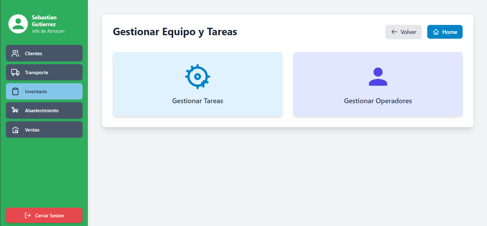
   
2.  El sistema muestra la lista de operadores y las solicitudes de preparación pendientes. Para añadir un operador: El usuario selecciona [Añadir Operador], completa el formulario y guarda. Para consultar/modificar, el usuario hace clic en un trabajador para ver o editar sus detalles.
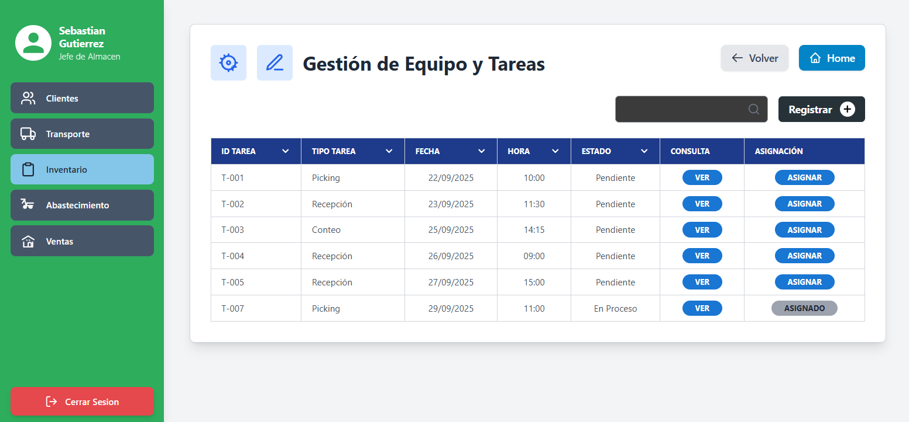

3. Para asignar una tarea: El usuario selecciona una solicitud (de picking o conteo), elige a uno o más operadores de la lista y confirma la asignación. 
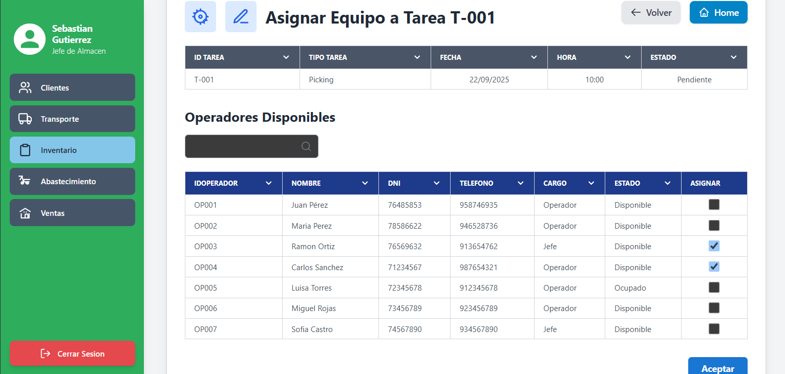
---

## Caso de Uso #2: Recepción y Ubicación de Mercancía

| Campo                  | Descripción |
|-------------------------|-------------|
| **ID**                 | R-302 |
| **Actor(es)**           | Operador de Almacén |
| **Objetivo**            | Registrar el ingreso de productos de un proveedor, validando las cantidades y asignando la mercancía a su ubicación física correcta (Tienda, Almacén A o Almacén B). |
| **Precondiciones**      | Existe una "Orden de Compra" aprobada en el sistema. El Operador ha iniciado sesión. |
| **Disparador**          | 1. Un camión del proveedor llega a las instalaciones de la ferretería para entregar mercancía. 2. Los usuarios han iniciado sesión. 3. El Jefe de Almacén ha asignado a un Operador a esta tarea (vía R-301). |
| **Flujo Principal**     | 1. El usuario accede al módulo "Recepción de Mercancía". 2. Busca y selecciona la Orden de Compra correspondiente. 3. El sistema muestra la lista de productos y cantidades esperadas. 4. El usuario ingresa la cantidad física recibida y selecciona la ubicación de destino para cada producto. 5. El usuario confirma la recepción en el sistema. |
| **Postcondiciones**     | El stock de los productos se actualiza en las ubicaciones especificadas. La Orden de Compra cambia su estado a "Recibida". |
| **Excepciones**         | A. Cantidad incorrecta: Si la cantidad recibida no coincide, el sistema lo registra y notifica a Abastecimiento. B. Producto dañado: El usuario marca el producto como "Dañado", el sistema lo ingresa a un stock no vendible y notifica a Abastecimiento. |
| **Requerimientos especiales** | El sistema debe poder procesar recepciones parciales. |
| **Frecuencia de uso**   | Alta. Diariamente. |

### Flujo Principal del Requerimiento:
1.  El usuario accede al módulo "Recepción de Mercancía", busca y selecciona la Orden de Compra correspondiente.

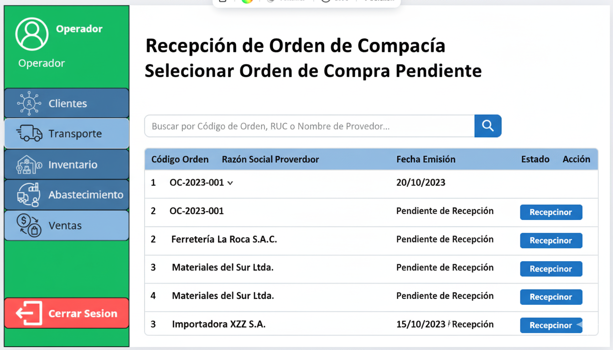
   
2.  El sistema muestra la lista de productos y cantidades esperadas.
   
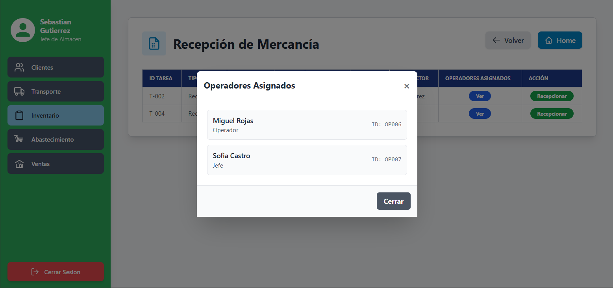
  
3.  Resumen y Confirmación Final

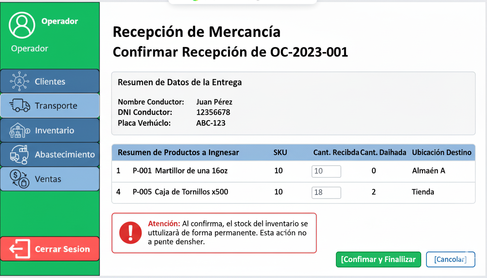

---

## Caso de Uso #3: Gestión y Precisión de Inventario (Conteo Cíclico)

| Campo                  | Descripción |
|-------------------------|-------------|
| **ID**                 | R-303 |
| **Actor(es)**           | Jefe de Almacén, Operador de Almacén |
| **Objetivo**            | Auditar el inventario físico de forma periódica para compararlo con el stock del sistema y realizar los ajustes necesarios para garantizar la precisión de los datos. |
| **Precondiciones**      | 1. Los usuarios han iniciado sesión. 2. El Jefe de Almacén ha asignado a un Operador a esta tarea (vía R-301). |
| **Disparador**          | El Jefe de Almacén inicia una jornada de control de inventario planificada. |
| **Flujo Principal**     | 1. El Jefe de Almacén crea una "Tarea de Conteo", seleccionando los productos específicos a verificar. 2. El Operador accede a la tarea asignada. 3. El Operador va a la ubicación física, cuenta las unidades e ingresa la cantidad en el sistema. 4. El sistema compara los datos y resalta las diferencias. 5. El Jefe de Almacén revisa el reporte de diferencias y aprueba los ajustes de stock. |
| **Postcondiciones**     | El stock de los productos contados se actualiza para reflejar la cantidad física real. |
| **Excepciones**         | Si una diferencia de stock supera un umbral predefinido, el sistema puede requerir una segunda validación. |
| **Requerimientos especiales** | No aplica. |
| **Frecuencia de uso**   | Media. Planificada (semanal, mensual). |

### Flujo Principal del Requerimiento:

1. Seleccionar tareas de conteo

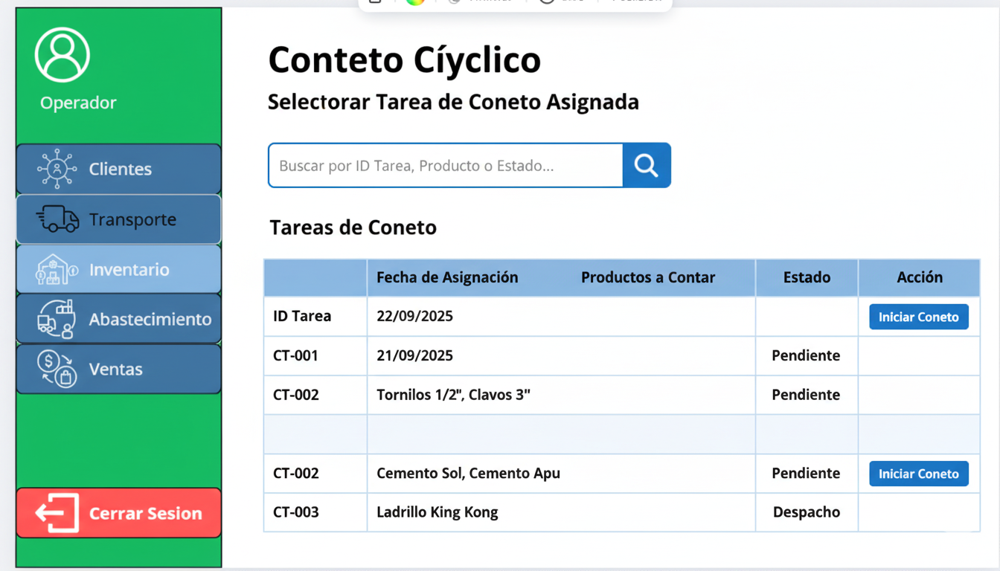

2. Registro de conteo

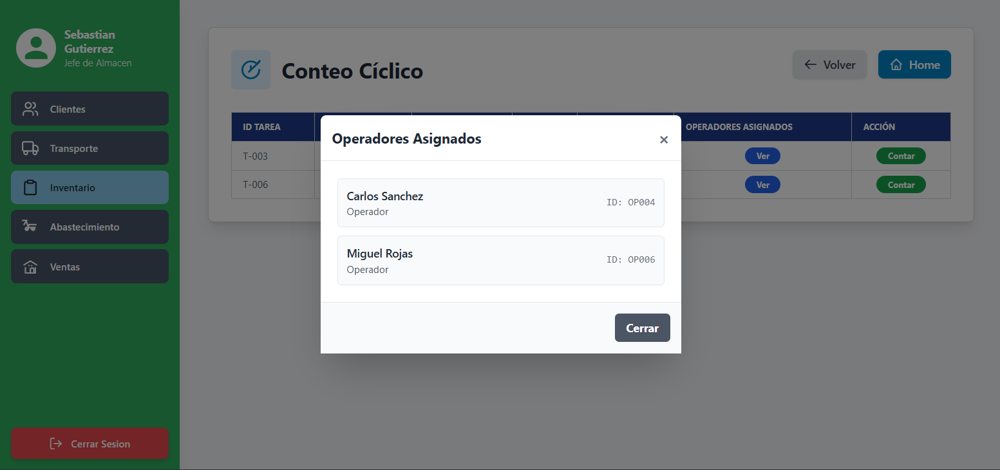

3. Resumen y Confirmación de Ajuste

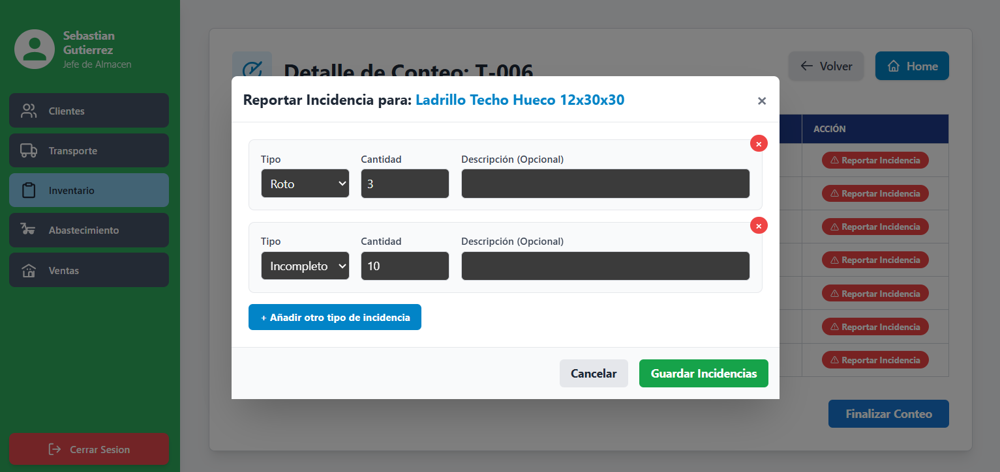

---

## Caso de Uso #4: Control de Stock y Reposición Automática

| Campo                  | Descripción |
|-------------------------|-------------|
| **ID**                 | R-304 |
| **Actor(es)**           | Sistema, Personal de Abastecimiento |
| **Objetivo**            | Prevenir quiebres de stock mediante la monitorización automática de los niveles de inventario y la generación de solicitudes de compra cuando sea necesario. |
| **Precondiciones**      | Los productos tienen un nivel de stock mínimo configurado. |
| **Disparador**          | Una transacción (venta, ajuste) hace que el stock de un producto caiga por debajo de su nivel mínimo. |
| **Flujo Principal**     | 1. El Sistema detecta que el stock de un producto está por debajo del mínimo. 2. El Sistema genera una "Alerta de Stock Mínimo". 3. El Sistema crea una "Petición de Compra" automática y notifica al área de Abastecimiento. |
| **Postcondiciones**     | El área de Abastecimiento tiene una solicitud formal para iniciar el proceso de compra del producto agotado. |
| **Excepciones**         | No aplica. |
| **Requerimientos especiales** | La cantidad a solicitar podría basarse en el historial de ventas. |
| **Frecuencia de uso**   | Constante (automático). |

### Flujo Principal del Requerimiento:

1. Configuración de  Alertas de Stock por Producto

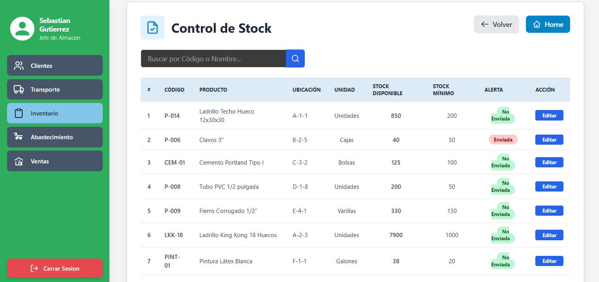

2. Historial de peticiones de compra

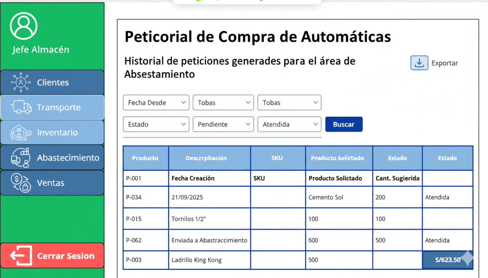

---

## Caso de Uso #5: Consulta de Inventario

| Campo                  | Descripción |
|-------------------------|-------------|
| **ID**                 | R-305 |
| **Actor(es)**           | Roles Autorizados: Vendedor, Almacén (Jefe y Operador), Abastecimiento |
| **Objetivo**            | Proveer información clara y en tiempo real sobre la cantidad y localización del stock de cualquier producto de la ferretería. |
| **Precondiciones**      | El usuario ha iniciado sesión. |
| **Disparador**          | Un usuario necesita saber la disponibilidad de un producto para una venta, una compra o una operación logística. |
| **Flujo Principal**     | 1. El usuario accede a la pantalla "Consulta de Inventario". 2. Busca un producto por nombre o código. 3. El sistema muestra el producto con su Stock Total. 4. El usuario hace clic para ver detalles y el sistema muestra el desglose: Stock en Tienda, Stock en Almacén A, Stock en Almacén B. |
| **Postcondiciones**     | El usuario está informado de la disponibilidad y ubicación del producto. |
| **Excepciones**         | Si un producto no tiene stock en ninguna ubicación, el sistema lo mostrará claramente con "Stock: 0". |
| **Requerimientos especiales** | 1. La consulta debe tener un tiempo de respuesta menor a 2 segundos. 2. El acceso a la consulta estará restringido por el rol del usuario. |
| **Frecuencia de uso**   | Muy Alta. |

### Flujo Principal del Requerimiento:

1. Consulta de inventario

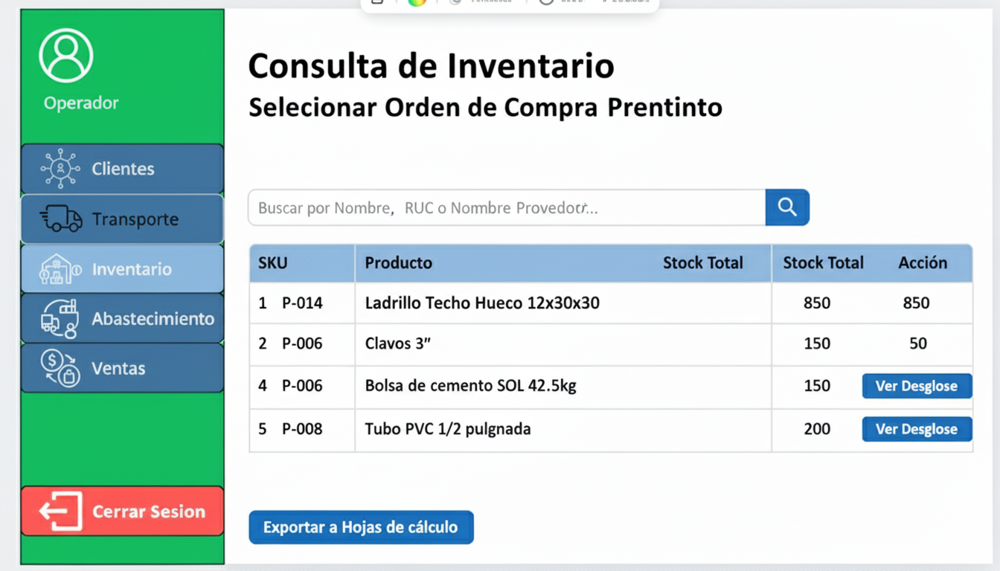

2. Desglose de stock por Ubicación

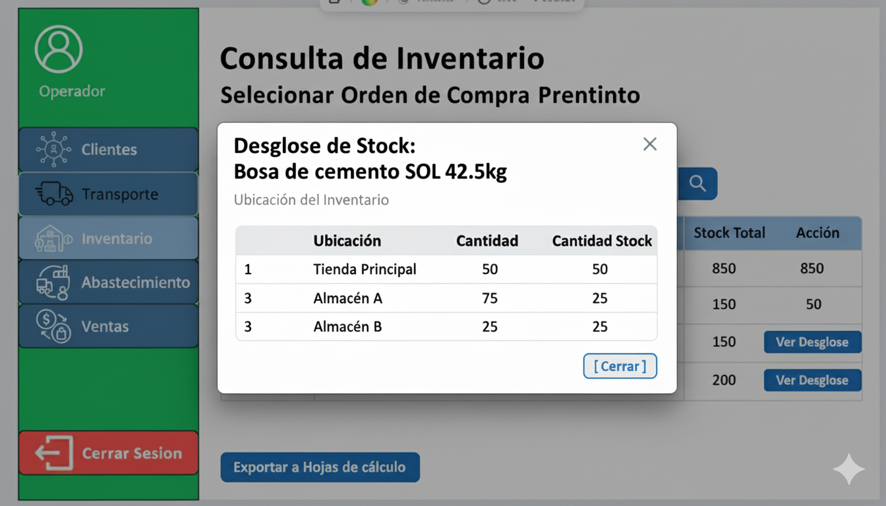

---

## Caso de Uso #6: Preparación de Pedidos para Ruta (Picking)

| Campo                  | Descripción |
|-------------------------|-------------|
| **ID**                 | R-306 |
| **Actor(es)**           | Operador de Almacén |
| **Objetivo**            | Recolectar de forma eficiente todos los productos necesarios para un conjunto de pedidos que serán despachados en una misma ruta. |
| **Precondiciones**      | 1. El área de Transporte ha enviado una "Solicitud de Preparación para Ruta". 2. El Jefe de Almacén ha asignado a uno o más Operadores a esta tarea (vía R-301). |
| **Disparador**          | El sistema notifica al almacén que una nueva ruta de despacho ha sido creada y necesita ser preparada. |
| **Flujo Principal**     | 1. El sistema genera una "Lista de Picking" consolidada para la ruta. 2. El Operador (o equipo) asignado inicia la tarea. 3. El Operador sigue la lista para recoger los productos de sus ubicaciones. 4. El Operador marca manualmente en el sistema cada producto como "Recogido". 5. Al finalizar, el Operador marca la tarea como "Completada". |
| **Postcondiciones**     | Los productos están físicamente listos para ser despachados. El estado de los pedidos cambia a "Listo para Despacho". |
| **Excepciones**         | Si durante el picking el operador descubre que no hay stock físico de un producto, debe poder marcar esa incidencia en el sistema. |
| **Requerimientos especiales** | La lista de picking debe estar ordenada de la forma más eficiente para minimizar el recorrido del operador. |
| **Frecuencia de uso**   | Alta. |

### Flujo Principal del Requerimiento:

1. Tareas de Preparación Asignadas

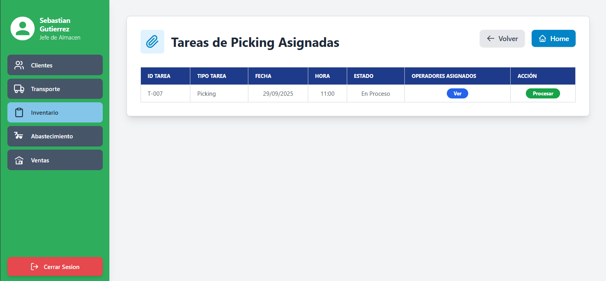

2. Lista de Picking

3. Confirmar finalización

---

## Caso de Uso #7: Despacho y Documentación de Salida

| Campo                  | Descripción |
|-------------------------|-------------|
| **ID**                 | R-307 |
| **Actor(es)**           | Operador de Almacén, Transportista |
| **Objetivo**            | Formalizar la salida física y lógica de la mercancía, actualizando el inventario y generando la documentación legal requerida para el transporte. |
| **Precondiciones**      | 1. Los productos del pedido están en estado "Listo para Despacho". 2. El transportista está presente para recibir la carga. |
| **Disparador**          | El camión de reparto llega al almacén para cargar la mercancía de su ruta asignada. |
| **Flujo Principal**     | 1. El Operador de Almacén selecciona en el sistema los pedidos de la ruta a despachar. 2. Confirma la ubicación de origen de la mercancía (Almacén A o B). 3. Carga la mercancía en el camión. 4. Confirma la "Salida" en el sistema, lo que descuenta el stock. 5. El sistema genera automáticamente la Guía de Remisión. 6. El Operador imprime la guía y se la entrega al Transportista para la firma. |
| **Postcondiciones**     | El inventario se actualiza. El estado del pedido cambia a "En Tránsito". Se genera la Guía de Remisión. |
| **Excepciones**         | No aplica. |
| **Requerimientos especiales** | La Guía de Remisión debe cumplir con el formato y los campos obligatorios exigidos por la SUNAT. |
| **Frecuencia de uso**   | Alta. |

### Flujo Principal del Requerimiento:

1.  Rutas para Despacho

2. Confirmar Salida de Ruta

3. Generar guía de Remisión

---

[⬅️ Anterior](../3.2/3.2.md) | [🏠 Home](../../README.md) | [Siguiente ➡️](../3.4/3.4.md)
