# 3.3. Módulo 3: Almacén

# Requerimientos del Sistema

| **Requerimiento** | **Nombre** |
| --- | --- |
| R-301 | Gestionar Equipo de Almacén (Usuarios) |
| R-302 | Recepción y Auditoría de Mercancía |
| R-303 | Gestión y Precisión de Inventario (Conteo Cíclico) |
| R-304 | Control de Stock y Reposición Automática |
| R-305 | Consulta de Inventario Multi-Ubicación |
| R-306 | Preparación de Pedidos (Picking de Despacho) |
| R-307 | Gestión de Capacidad |
| R-308 | Movimientos |
| R-309 | Gestion de Incidencias |

## Caso de Uso #1: Gestionar Equipo de Almacén (Usuarios)

| **Campo** | **Detalle** |
| --- | --- |
| **ID** | R-301 |
| **Actor(es)** | Jefe de Almacén |
| **Objetivo** | Gestionar el personal del almacén (que son `Usuarios` en el sistema), permitiendo registrar nuevos, consultar su información y modificar sus datos (como el rol o el área). |
| **Precondiciones** | El usuario "Jefe de Almacén" (un `USUARIO` con `ROL` de 'Jefe de Almacén') debe haber iniciado sesión. |
| **Disparador** | El Jefe de Almacén necesita añadir un nuevo operario o modificar los datos de uno existente. |
| **Flujo Principal** | 1. El usuario accede a la sección "Gestión de Equipo".

2. El sistema consulta `FERRETERIA.USUARIO` (filtrando por `AREA` = 'Almacén') y los une con `FERRETERIA.PERSONA` y `FERRETERIA.ROL` para mostrar una lista.

3. **Para Añadir:** El usuario selecciona [Añadir Usuario], completa el formulario. El sistema crea primero una `PERSONA` y luego un `USUARIO` (con `cod_area` = 'Almacén').

4. **Para Modificar:** El usuario selecciona un `USUARIO` y actualiza sus datos (ej. `cod_rol`). |
| **Postcondiciones** | La tabla `FERRETERIA.USUARIO` está actualizada. |
| **Excepciones** | A. DNI duplicado: El sistema no permitirá registrar una `PERSONA` con un DNI ya existente en `DOCUMENTO_PERSONA`. |

I-0000

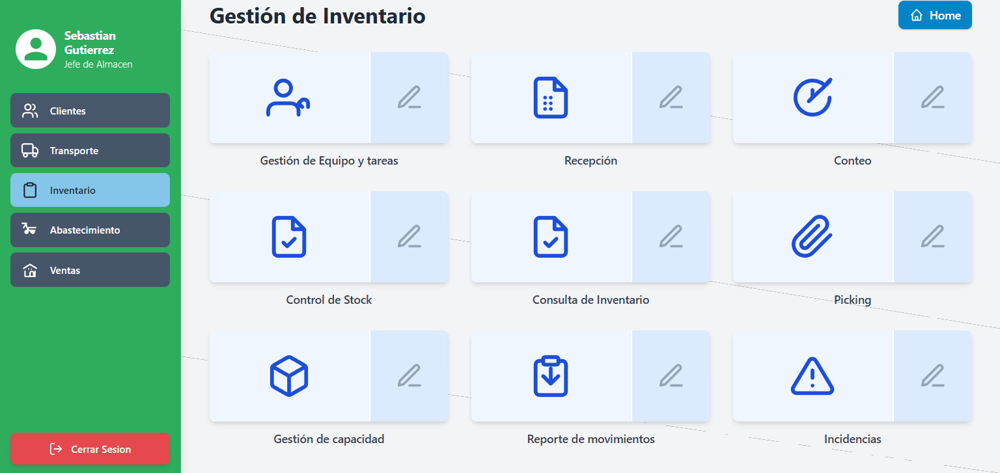

I-0101

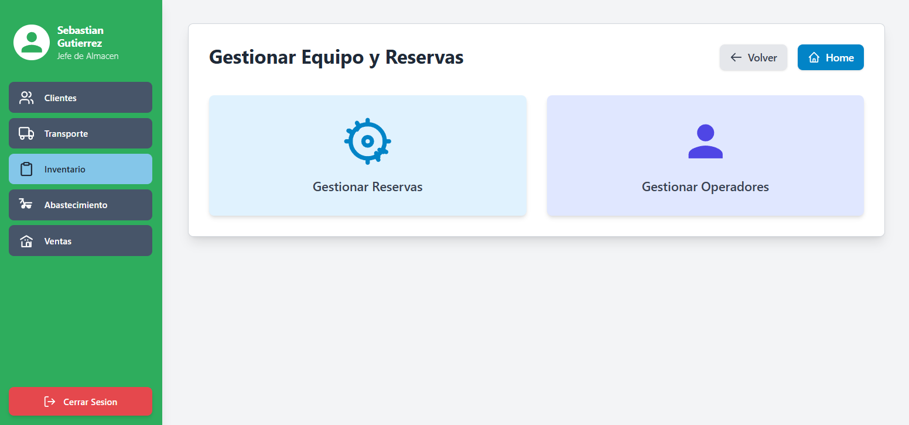

I-0102

I-0103

I-0104

I-0105

## Caso de Uso #2: Recepción y Auditoría de Mercancía

| **Campo** | **Detalle** |
| --- | --- |
| **ID** | R-302 |
| **Actor(es)** | Operador de Almacén (rol `USUARIO`) |
| **Objetivo** | Auditar y registrar el ingreso físico de mercancía contra una orden, separando el inventario "conforme" (vendible) del "defectuoso" (merma) y reportando incidencias. |
| **Precondiciones** | 1. Existe una `FERRETERIA.reserva_almacen` de `tipo_reserva = 'Recepcion'`.

2. Esta reserva está asignada a un `USUARIO` (operador) a través de `FERRETERIA.operador_reserva_almacen`. |
| **Disparador** | El operador selecciona una tarea de recepción asignada en su terminal. |
| **Flujo Principal** | 1. El operador abre la `reserva_almacen` (`RES-123`).

2. El sistema sigue la FK `cod_recepcion` para encontrar la `FERRETERIA.recepcion` (`REC-100`).

3. El sistema busca en `FERRETERIA.detalle_recepcion` todas las líneas de esa recepción (donde `cod_recepcion = 'REC-100'`).

4. La pantalla muestra los productos con la `cantidad_programada`.

5. El operador cuenta y registra en el sistema **`cantidad_conforme`** (lo bueno) y **`cantidad_defectuosa`** (lo malo).

6. (Opcional) Si hay `cantidad_defectuosa`, el operador hace clic en "Reportar Incidencia", lo que crea un registro en `FERRETERIA.incidencia` (la tabla de Almacén) y define la **`accion_tomada`** ('Aceptar' o 'Rechazar').

7. El operador presiona "Finalizar Recepción". |
| **Postcondiciones** | 1. **(Auditoría)** El sistema calcula automáticamente las incidencias de 'Faltante' o 'Sobrante' y las registra en `FERRETERIA.incidencia`.

2. **(Inventario Bueno)** Se crea un `FERRETERIA.movimiento` (`tipo='ENTRADA'`) por la `cantidad_conforme` y se actualiza el `stock_fisico` en el `FERRETERIA.inventario` de la ubicación de **VENTA**.

3. **(Inventario Malo)** Si `accion_tomada = 'Aceptar'`, se crea un `FERRETERIA.movimiento` (`tipo='MERMA_ENTRADA'`) y se actualiza el `stock_fisico` en el `FERRETERIA.inventario` de la ubicación de **MERMA**. |
| **Excepciones** | A. La suma de `conforme` + `defectuosa` no coincide con la `cantidad_recibida` total. El sistema debe validar esto. |

I-0000

I-0201

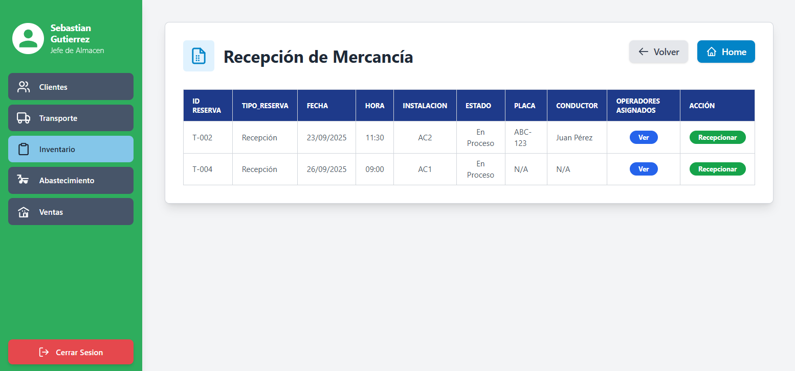

I-0202

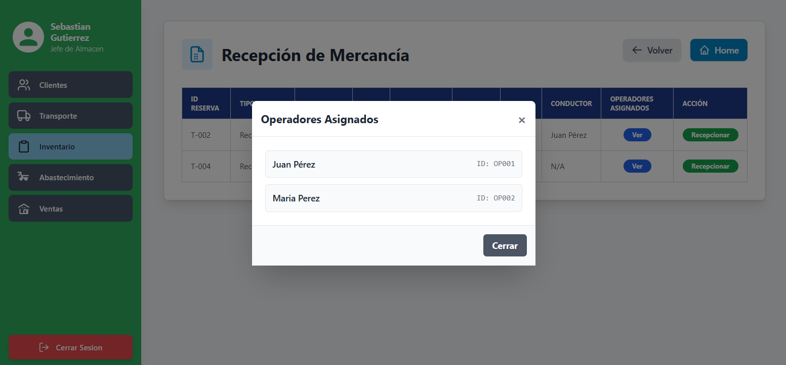

I-0203

I-0204

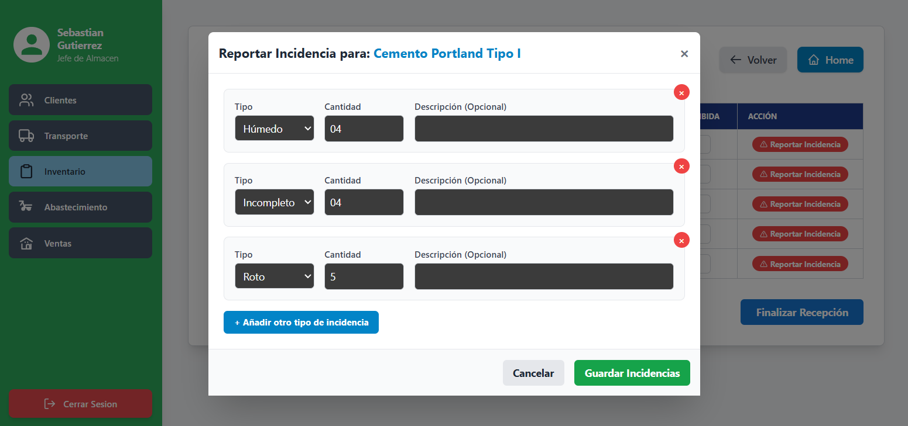

## Caso de Uso #3: Gestión y Precisión de Inventario (Conteo Cíclico)

| **Campo** | **Detalle** |
| --- | --- |
| **ID** | R-303 |
| **Actor(es)** | Jefe de Almacén, Operador de Almacén (rol `USUARIO`) |
| **Objetivo** | Auditar el inventario físico, compararlo con el "pantallazo" (`cantidad_sistema`) y aplicar la lógica de reconciliación para realizar los ajustes de stock necesarios. |
| **Precondiciones** | El Jefe de Almacén ha iniciado sesión. |
| **Flujo Principal** | 1. El Jefe de Almacén crea una `FERRETERIA.conteo` (`T-003`).

2. El Jefe añade productos a la tarea, creando registros en `FERRETERIA.detalle_conteo`.

3. **(PANTALLAZO)** Al crear cada `detalle_conteo`, un trigger "congela" el `stock_fisico` actual del `inventario` en el campo `detalle_conteo.cantidad_sistema`.

4. El Jefe asigna la tarea a un `USUARIO` (insertando en `FERRETERIA.operador_conteo`).

5. El Operador abre la tarea y ve `cantidad_sistema` (el pantallazo).

6. El Operador cuenta e ingresa la **`cantidad_contada`** (solo lo BUENO).

7. (Opcional) Si encuentra producto dañado, crea una `FERRETERIA.incidencia` (ej. 'Roto', Cant=1).

8. El Operador presiona "Finalizar Conteo". |
| **Postcondiciones** | 1. **(Reconciliación)** El sistema ejecuta la lógica de auditoría: compara la `cantidad_contada` vs. `cantidad_sistema` y justifica la diferencia checando `FERRETERIA.movimiento` (hechos) y `FERRETERIA.inventario.stock_comprometido` (promesas).

2. **(Ajuste "Entropía")** La discrepancia no justificada (la "entropía") genera un `FERRETERIA.movimiento` (`AJUSTE_POSITIVO` o `AJUSTE_NEGATIVO`) que actualiza el `stock_fisico` del `inventario` de VENTA.

3. **(Ajuste Merma)** La `incidencia` genera un `movimiento` (`MERMA_SALIDA` o `MERMA_ENTRADA`) que ajusta el stock de VENTA y el de MERMA. |
| **Excepciones** | La lógica de reconciliación debe ejecutarse en una transacción para evitar inconsistencias. |

I-0000

I-0301

I-0302

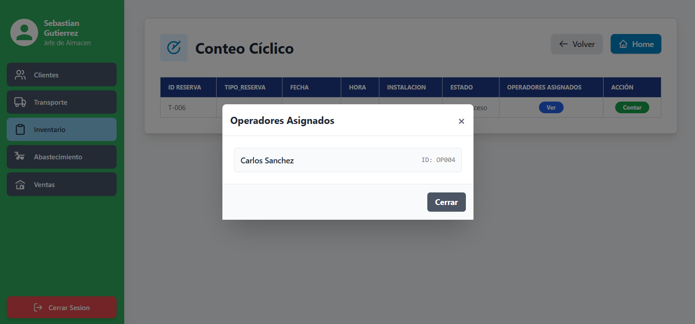

I-0303

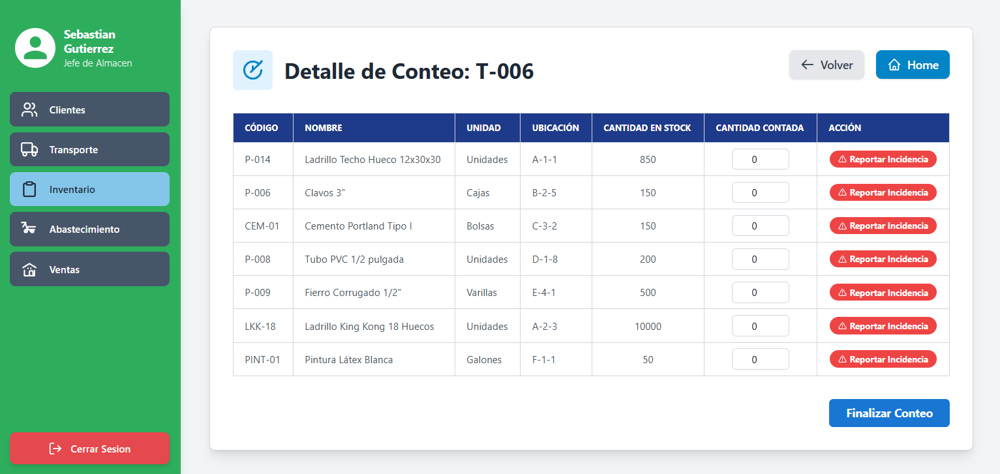

I-0304

## Caso de Uso #4: Control de Stock y Reposición Automática

| **Campo** | **Detalle** |
| --- | --- |
| **ID** | R-304 |
| **Actor(es)** | Sistema (Proceso Automático) |
| **Objetivo** | Prevenir quiebres de stock generando solicitudes de compra automáticas a Abastecimiento. |
| **Precondiciones** | Los productos en `FERRETERIA.inventario` tienen un `stock_minimo` configurado. |
| **Disparador** | Un `FERRETERIA.movimiento` de salida (`SALIDA` o `AJUSTE_NEGATIVO`) actualiza un registro de `FERRETERIA.inventario`. |
| **Flujo Principal** | 1. Un `TRIGGER` se dispara después de la actualización en `FERRETERIA.inventario`.

2. El trigger calcula el stock disponible: `(stock_fisico - stock_comprometido)`.

3. Si `stock_disponible < stock_minimo`, el trigger inserta una nueva fila en `FERRETERIA.pedido_abastecimiento`.

4. El módulo de Abastecimiento es notificado. |
| **Postcondiciones** | Se crea un `FERRETERIA.pedido_abastecimiento` en estado 'Pendiente'. |

I-0401

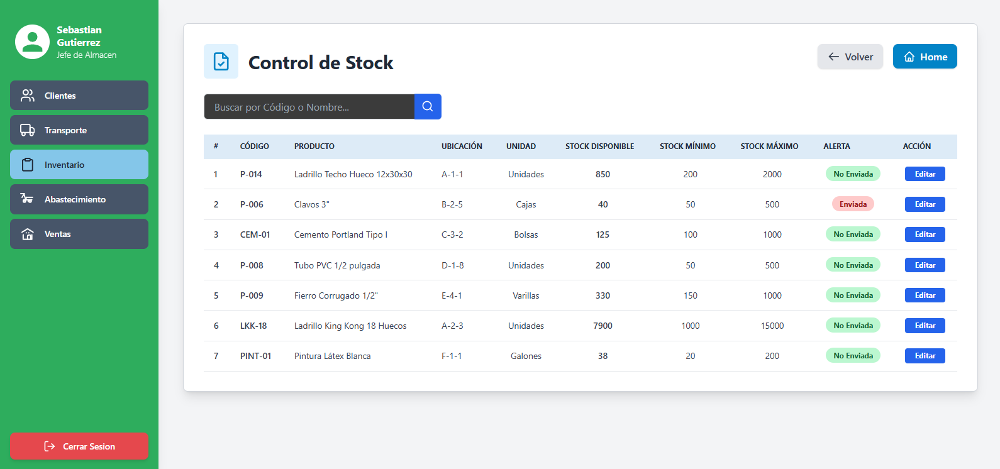

I-0402

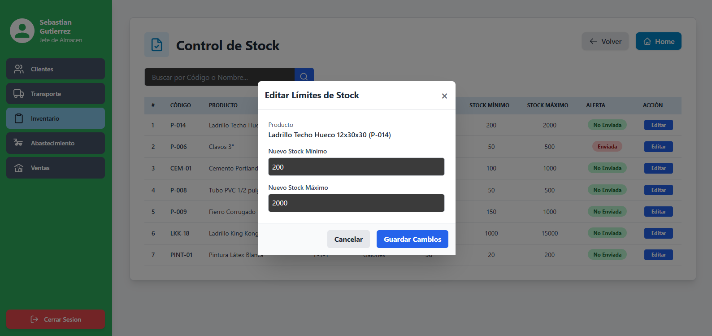

## Caso de Uso #5: Consulta de Inventario Multi-Ubicación

| **Campo** | **Detalle** |
| --- | --- |
| **ID** | R-305 |
| **Actor(es)** | Jefe de Almacén, Vendedor, Abastecimiento (roles `USUARIO`) |
| **Objetivo** | Proveer información en tiempo real sobre la cantidad y localización del stock, diferenciando entre stock de Venta y stock de Merma. |
| **Precondiciones** | El usuario ha iniciado sesión. |
| **Disparador** | Un usuario necesita saber la disponibilidad real de un producto. |
| **Flujo Principal** | 1. El usuario busca un `FERRETERIA.producto`.

2. El sistema ejecuta una consulta que une `FERRETERIA.producto` -> `FERRETERIA.inventario` -> `FERRETERIA.ubicacion` -> `FERRETERIA.instalacion`.

3. El sistema agrupa los resultados por `instalacion.nombre_instalacion` y `ubicacion.tipo_ubicacion`.

4. La pantalla muestra el desglose completo del stock: (Ej. Cemento Portland)

     - **Almacén 1 (VENTA):** 100 bolsas

     - **Almacén 1 (MERMA):** 5 bolsas

     - **Tienda 1 (VENTA):** 20 bolsas

     - **Tienda 1 (MERMA):** 1 bolsa |
| **Postcondiciones** | El usuario conoce el stock total vendible (120) y el stock total dañado (6) en toda la empresa. |

I-0501

## Caso de Uso #6: Preparación de Pedidos (Picking de Despacho)

| **Campo** | **Detalle** |
| --- | --- |
| **ID** | R-306 |
| **Actor(es)** | Operador de Almacén (rol `USUARIO`) |
| **Objetivo** | Recolectar (hacer "picking") los productos correctos de sus ubicaciones de venta para preparar un `DESPACHO` de Transporte. |
| **Precondiciones** | 1. Existe una `FERRETERIA.reserva_almacen` de `tipo_reserva = 'Despacho'`.

2. Esta reserva está asignada a un `USUARIO` (vía `operador_reserva_almacen`). |
| **Disparador** | El operador selecciona una tarea de despacho asignada en su terminal. |
| **Flujo Principal** | 1. El operador abre la `reserva_almacen` (`RES-124`).

2. El sistema sigue la FK `cod_despacho` para encontrar el `FERRETERIA.DESPACHO` (`DP-001`).

3. **(Generar Lista de Picking)** El sistema ejecuta una consulta compleja: `DESPACHO` -> `ASIGNACION_PEDIDO_DESPACHO` -> `PEDIDO_TRANSPORTE` -> `DETALLE_PEDIDO_TR` para obtener la lista de productos y cantidades.

4. **(Obtener Ubicación)** El sistema une esa lista con `FERRETERIA.inventario` y `FERRETERIA.ubicacion` (donde `tipo_ubicacion = 'VENTA'`) para mostrar al operador el `cod_ubicacion_calculado` (ej. 'TND01-P01-E03-C04') de donde debe sacar el producto.

5. El operador recoge los productos y presiona "Finalizar Picking". |
| **Postcondiciones** | 1. El estado del `DESPACHO` (en el módulo de Transporte) se actualiza (ej. a 'Listo para Cargar').

2. Un `TRIGGER` se dispara para generar los `FERRETERIA.movimiento` (`tipo='SALIDA'`) por cada producto recogido.

3. El `FERRETERIA.inventario` se actualiza: `stock_fisico` se reduce y `stock_comprometido` se reduce (ambos bajan). |
| **Excepciones** | A. No hay stock: Si el `stock_fisico` (0) no coincide con el `stock_comprometido` (10), el sistema debe generar una alerta de quiebre de stock. |

I-0601

I-0602

I-0603

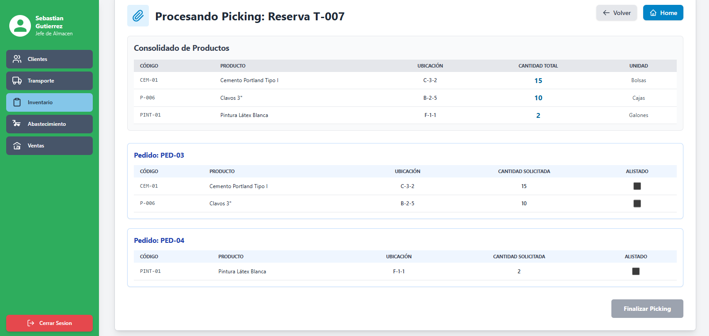

## Caso de Uso #7: Gestión de Capacidad 

| **Campo** | **Detalle** |
| --- | --- |
| **ID** | R-307 (Nuevo) |
| **Actor(es)** | Jefe de Almacén, Sistema (Proceso BATCH) |
| **Objetivo** | Permitir al Jefe de Almacén definir las reglas de capacidad de cupos por día de la semana y ejecutar un BATCH para generar el inventario de cupos del mes siguiente. |
| **Precondiciones** | El usuario "Jefe de Almacén" ha iniciado sesión. |
| **Disparador** | El Jefe de Almacén necesita ajustar la capacidad de recepción/despacho para la próxima temporada, o es fin de mes. |
| **Flujo Principal** | 1. El Jefe de Almacén accede a la pantalla "Gestión de Capacidad".

2. Selecciona una `FERRETERIA.instalacion` (ej. 'ALM-01').

3. El sistema muestra una grilla con los 7 días de la semana y todos los `FERRETERIA.turno_almacen`.

4. El Jefe edita los valores de `capacidad_total` (ej. Lunes 8am = 5 cupos, Sábado 8am = 2 cupos) y guarda los cambios en `FERRETERIA.capacidad_turno`.

5. (Opcional) El Jefe presiona "Generar Cupos Próximo Mes".

6. El Proceso BATCH lee `FERRETERIA.capacidad_turno` y genera (inserta) miles de filas en `FERRETERIA.cupo_disponible` para todo el mes siguiente. |
| **Postcondiciones** | La tabla `FERRETERIA.cupo_disponible` está poblada con los "tickets" listos para ser reservados. |
| **Frecuencia de uso** | Modificación: Ocasional. Ejecución BATCH: Mensual (automático). |

I-0000

I-0701

## Caso de Uso #8: Movimientos

| **Campo** | **Detalle** |
| --- | --- |
| **ID** | R-308 (Nuevo) |
| **Actor(es)** | Jefe de Almacén, Auditoría, Vendedor (roles `USUARIO`) |
| **Objetivo** | Proveer un historial de vida completo (Kardex) para un producto específico, mostrando todas sus entradas, salidas y ajustes. |
| **Precondiciones** | El usuario ha iniciado sesión. |
| **Disparador** | Un Jefe de Almacén necesita investigar por qué el stock de un producto no cuadra, o un Vendedor necesita saber cuándo llegará más stock. |
| **Flujo Principal** | 1. El usuario accede a la pantalla "Reporte Kardex".

2. Busca y selecciona un `FERRETERIA.producto` (ej. 'Cemento Portland').

3. El sistema busca el/los `cod_inventario` asociados a ese `cod_producto`.

4. El sistema consulta `FERRETERIA.movimiento` (filtrando por `cod_inventario`) y lo ordena por fecha.

5. La pantalla muestra la bitácora: `(01-Nov: +50, ENTRADA, Origen: REC-100)`, `(02-Nov: -5, SALIDA, Origen: Venta V-205)`, `(03-Nov: -2, AJUSTE_NEGATIVO, Origen: Conteo T-003)`. |
| **Postcondiciones** | El usuario puede auditar el ciclo de vida completo del producto. |
| **Frecuencia de uso** | Frecuente. |

I-0000

I-0801

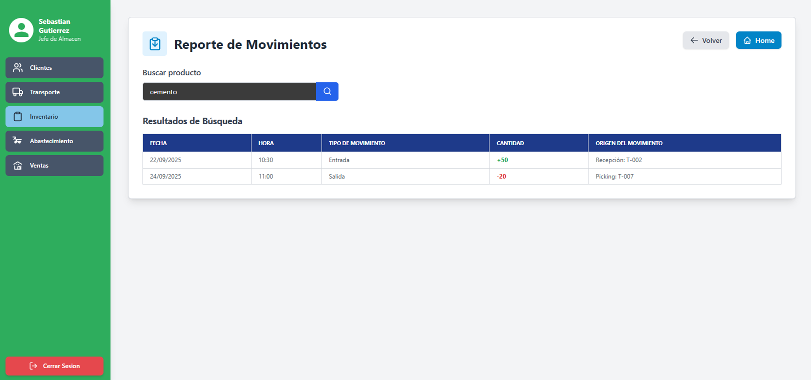

## Caso de Uso #9: Gestión de Incidencias

| **Campo** | **Detalle** |
| --- | --- |
| **ID** | R-309 (Nuevo) |
| **Actor(es)** | Jefe de Almacén |
| **Objetivo** | Gestionar y "Resolver" las incidencias generadas **únicamente por los Conteos Cíclicos** para asegurar que los ajustes de inventario sean validados. |
| **Precondiciones** | El usuario "Jefe de Almacén" ha iniciado sesión. |
| **Disparador** | El Jefe de Almacén accede a su panel de control para revisar las discrepancias reportadas por sus operadores. |
| **Flujo Principal** | 1. El Jefe de Almacén accede a la "Bandeja de Incidencias de Conteo".

2. El sistema muestra una lista de `FERRETERIA.incidencia` donde `cod_detalle_conteo IS NOT NULL` y `estado_incidencia` (un nuevo atributo en `incidencia`) es 'Pendiente'.

3. El Jefe filtra por `tipo_incidencia` (ej. 'Roto') usando la `FERRETERIA.tipo_incidencia_lookup`.

4. El Jefe selecciona una incidencia, revisa el detalle (ej. "Pantallazo: 500", "Contado: 497", "Incidencia: 1 Roto", "Pérdida neta: 2").

5. El Jefe verifica que los movimientos de ajuste (`MERMA` y `AJUSTE_NEGATIVO`) se hayan creado.

6. Presiona el botón "Marcar como Resuelta". |
| **Postcondiciones** | El `estado_incidencia` de la `FERRETERIA.incidencia` cambia a 'Resuelta'. |
| **Excepciones** | Las incidencias de recepción (`cod_detalle_recepcion IS NOT NULL`) no aparecen en esta bandeja; se gestionan por Abastecimiento. |
| **Frecuencia de uso | casual |

I-0000

I-0901

[⬅️ Anterior](../3.2/3.2.md) | [🏠 Home](../../README.md) | [Siguiente ➡️](../3.4/3.4.md)
