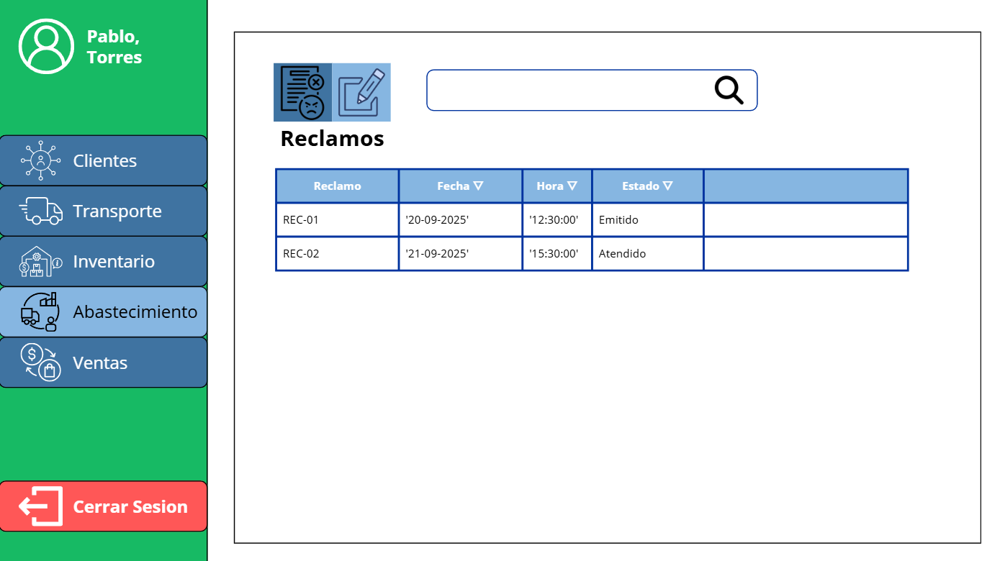

# 3.4. Módulo 4: Abastecimiento 

| Requerimiento | Nombre |
|:---:|:---|
| R-401 | Registrar Proveedor |
| R-402 | Actualizar datos del Proveedor |
| R-403 | Registrar Producto Nuevo |
| R-404 | Revisar Pedido de Abastecimiento |
| R-405 | Priorizar Pedidos y Generar Solicitud de Cotización |
| R-406 | Registrar Cotizaciones Recibidas |
| R-407 | Evaluar Cotizaciones y Generar Orden de Compra |
| R-408 | Monitorear Orden de Compra |
| R-409 | Programar Recepción y Pedido de Transporte |
| R-410 | Validar Guía de Remisión |
| R-411 | Registrar Resultado de Recepción |
| R-412 | Gestionar Reclamos por Recepción |

---
## **Caso de uso #1: Registrar Proveedor**

| **ID** | R-401 |
|:---:|:---|
| **Actor(es)** | Jefe de Abastecimiento |
| **Objetivo** | Permite registrar un nuevo proveedor y los productos que ofrece, incluyendo datos como razón social, RUC, contacto, condiciones de pago, tiempo de entrega y precio unitario por artículo. |
| **Precondiciones** | El **EMPLEADO** de abastecimiento debe estar logueado en el sistema. |
| **Disparador o evento inicial** | El **EMPLEADO** desea registrar un proveedor nuevo. |
| **Flujo Principal**         |  1. El **EMPLEADO** accede a la vista de Abastecimiento. 2. Selecciona el menú **Proveedores**. 3. Selecciona **"Registrar Proveedor"**. 4. Ingresa los datos principales del proveedor. 5. Registra los productos que ofrece y sus precios unitarios. 6. Confirma los datos para que sean ingresados.|
| **Postcondiciones** | Existe una nueva instancia de la entidad **PROVEEDOR** |
| **Excepciones**             | 1. "Proveedor ya Existe" Cuando el proveedor ya se encontraba registrado.  2. "Datos no Validos" Cuando se introducen datos con un valor no aceptado. 3. "Campo obligatorio vacío" Cuando se deja sin completar algún campo requerido para el registro.|
| **Frecuencia de Uso**       | Poco frecuente, cuando hay un nuevo proveedor o producto que ofrece |

### **Flujo Principal:**
1. El **EMPLEADO** accede al sistema y entra a la vista de Abastecimiento.
2. En el menú principal, selecciona la opción "Proveedores".

4. Visualiza la lista de proveedores existentes y, para registrar uno nuevo, elige la opción "Registrar Proveedor".

5. Llena los campos requeridos con los datos del nuevo proveedor y hace clic en "Continuar".

6. En la siguiente pantalla, completa la información de los productos que el proveedor ofrece, pudiendo añadir tantos como sean necesarios. Una vez conforme, hace clic en "Guardar".

---

## **Caso de uso #2: Actualizar datos del Proveedor**

| **ID**                     | R-402 |
|-----------------------------|-------|
| **Actor(es)**               | Jefe de Abastecimiento |
| **Objetivo**                | Permite modificar los datos registrados de un proveedor, incluyendo información de contacto, condiciones de pago o actualizar su catálogo de productos. |
| **Precondiciones**          | El **EMPLEADO** de abastecimiento debe estar logueado en el sistema, y el proveedor debe estar previamente registrado. |
| **Disparador  o evento inicial**              | Cambio en el valor de un atributo del Proveedor en la realidad.|
| **Flujo Principal**         | 1. El **EMPLEADO** accede a la vista de Abastecimiento.  2. Selecciona el menú **Proveedores**. 3. Selecciona el proveedor a actualizar. 4. Modifica los campos necesarios del Proveedor. 5. Confirma los datos para que sean actualizados. |
| **Postcondiciones**         | Cambio de datos del proveedor.|
| **Excepciones**             | 1. "RUC duplicado" Cuando el RUC ingresado ya se encuentra registrado en el sistema. 2. "Datos no válidos" Cuando se introducen datos con un valor no aceptado|
| **Frecuencia de Uso**       | Frecuente, cada vez que un proveedor cambia condiciones , contacto o precios de artículos. |

### **Flujo Principal:**
1. El **EMPLEADO** accede a la vista de Proveedores desde el menú de Abastecimiento.

2. Selecciona un proveedor de la lista y hace clic en "Editar".

3. Modifica los campos necesarios y confirma la actualización para guardar los cambios.

---

## **Caso de uso #3: Registrar Producto Nuevo**

| **ID**                     | R-403 |
|-----------------------------|-------|
| **Actor(es)**               | Jefe de Abastecimiento |
| **Objetivo**                | Permite Registrar un nuevo producto, con sus atributos como nombre, categoría, unidad de medida, proveedor asociado, precio de referencia. |
| **Precondiciones**          | El **EMPLEADO** debe estar logueado en el sistema. |
| **Disparador o evento inicial**              | El **EMPLEADO** ingresa al módulo de Abastecimiento y desea registrar un producto nuevo. |
| **Flujo Principal**         | 1. El **EMPLEADO** accede a la vista de Abastecimiento.  2. Selecciona el menú **Productos**. 3. Selecciona **"Registrar Producto"**. 4. Ingresa los datos básicos del producto. 5. Confirma los datos para que sean ingresados. |
| **Postcondiciones**         | Existencia de una nueva entidad de Producto.|
| **Excepciones**             |1. "Datos no válidos" Cuando se introducen datos con un valor no aceptado.  2. "Campo obligatorio vacío" Cuando se deja sin completar algún campo requerido para el registro.|
| **Frecuencia de Uso**       | Poco frecuente, cada vez que se agrega un nuevo artículo en la ferretería. |

### **Flujo Principal:**
1. El **EMPLEADO** accede a la vista de Productos desde el menú de Abastecimiento.

2. Visualiza la lista de productos de la ferretería y selecciona la opción "Registrar Producto".

3. Completa los campos obligatorios con los datos del nuevo producto y hace clic en "Guardar".

---

## **Caso de uso #4: Revisar Pedido de Abastecimiento**

| **ID** | R-404 |
|:---:|:---|
| **Actor(es)** | Jefe de Abastecimiento |
| **Objetivo** | Permite al **EMPLEADO** revisar un **PEDIDO DE ABASTECIMIENTO** , verificar el detalle de los ítems requeridos y actualizar el atributo **`estado_pedido`** a **'Revisado'**. |
| **Precondiciones** | 1. El **EMPLEADO** debe estar logueado en el sistema. 2. Existe al menos un **PEDIDO DE ABASTECIMIENTO** con `estado_pedido` **'Pendiente'**. |
| **Disparador o evento inicial** | El **EMPLEADO** ingresa al módulo de Abastecimiento para revisar los pedidos internos vigentes. |
| **Flujo Principal** | 1. El **EMPLEADO** accede a la vista de Abastecimiento. 2. Selecciona el menú **Pedidos de Abastecimiento**. 3. Visualiza el listado de pedidos pendientes y selecciona uno. 4. Revisa los detalles (productos, cantidades, fechas requeridas). 5. Selecciona la opción **"Marcar como Revisado"**. 6. El sistema actualiza el atributo **`estado_pedido`** del pedido a **'Revisado'**.|
| **Postcondiciones** | El **PEDIDO DE ABASTECIMIENTO** tiene el atributo **`estado_pedido`** igual a **'Revisado'**.|
| **Excepciones** | 1. "Pedido no existe" Cuando el `id_pedido` seleccionado no se encuentra registrado.  2. "Falta de permisos" Cuando el rol del **EMPLEADO** no está autorizado para realizar la revisión.|
| **Frecuencia de Uso** | Frecuente, cada vez que llega un pedido de abastecimiento (requerimeinto ) por parte de un área.|

### **Flujo Principal:**
1. El **EMPLEADO** accede al sistema y entra a la vista de Abastecimiento.

2. En el menú principal, selecciona la opción "Pedidos de Abastecimiento".

3. Visualiza la lista de pedidos con `estado_pedido` 'Pendiente' y selecciona uno para ver el detalle de los productos y cantidades.

4. Una vez revisado el contenido, selecciona la opción **"Marcar como Revisado"**.

5. El sistema confirma el cambio del **`estado_pedido`** a **'Revisado'** y lo mueve a la bandeja de pedidos listos para cotizar.

---

## **Caso de uso #5: Priorizar Pedidos de Abastecimiento y Generar Solicitud de Cotización**

| **ID** | R-405 |
|:---:|:---|
| **Actor(es)** | Jefe de Abastecimiento |
| **Objetivo** | Permite al **EMPLEADO** organizar, revisar y **priorizar** los **PEDIDOS DE ABASTECIMIENTO** que ya han sido revisados (R-404) para definir la urgencia de los **PRODUCTOS** requeridos y, a partir de la selección, generar una **SOLICITUD DE COTIZACIÓN**. |
| **Precondiciones** | 1. El **EMPLEADO** debe estar logueado en el sistema. 2. Existen **PEDIDOS DE ABASTECIMIENTO** previamente revisados (R-404). |
| **Disparador o evento inicial** | El EMPLEADO necesita priorizar y diferenciar los ítems urgentes de los no urgentes asociado a los PEDIDOS DE ABASTECIMIENTO. |
| **Flujo Principal** | 1. El **EMPLEADO** accede a la vista de Abastecimiento. 2. Selecciona el menú **Solicitudes de Cotización**. 3. Selecciona la opción **"Generar Solicitud"**. 4. El **EMPLEADO** visualiza los ítems pendientes de cotizar y aplica criterios de **priorización**. 5. Selecciona y agrupa los **PRODUCTOS** que formarán parte de esta **SOLICITUD DE COTIZACIÓN**. 6. Confirma la selección, y el sistema crea una **SOLICITUD DE COTIZACIÓN**.|
| **Postcondiciones** | 1. Se crea una nueva entidad **SOLICITUD DE COTIZACIÓN** y el detalle de los productos seleccionados.  2. Los ítems consolidados son marcados como *'En Cotización'*, permaneciendo el resto de ítems en estado *'Revisado'* para una futura solicitud. |
| **Excepciones** | 1. "Sin ítems seleccionados" Si se intenta generar la solicitud sin haber marcado productos. 2. "Falta de permisos" Cuando el rol del **EMPLEADO** no está autorizado para la acción.|
| **Frecuencia de Uso** | Frecuente, en función de los criterios de prioridad de la demanda.|

### **Flujo Principal:**
1. El **EMPLEADO** accede al sistema y entra a la vista de Abastecimiento.

2. En el menú principal, selecciona la opción "Solicitudes de Cotización".

3. Selecciona la opción **"Generar Solicitud"**. El sistema muestra los ítems pendientes de los pedidos con `estado_pedido` 'Revisado'.

4. El **EMPLEADO** utiliza las herramientas de **priorización** y marca los ítems de **PRODUCTO** (de uno o varios pedidos) que desea incluir en la solicitud actual.

5. El sistema confirma la creación de la **SOLICITUD DE COTIZACIÓN**, asignándole un `id_solicitud` y el `estado` **'Pendiente'**. Los ítems seleccionados pasan a "En Cotización".

---

## **Caso de uso #6: Registrar Cotizaciones Recibidas**

| **ID** | R-406 |
|:---:|:---|
| **Actor(es)** | Jefe de Abastecimiento |
| **Objetivo** | Permite al **EMPLEADO** registrar una **COTIZACION** recibida de un **PROVEEDOR** y asociarla a una **SOLICITUD DE COTIZACIÓN** activa.|
| **Precondiciones** | 1. El **EMPLEADO** debe estar logueado en el sistema. 2. Debe existir al menos una **SOLICITUD DE COTIZACIÓN** con `estado` 'Pendiente'. 3. El **PROVEEDOR** debe estar previamente registrado (R-401). |
| **Disparador o evento inicial** | El **EMPLEADO** recibe físicamente o por algún medio de comunicación la oferta formal de un **PROVEEDOR**. |
| **Flujo Principal** | 1. El **EMPLEADO** accede a la vista de Abastecimiento. 2. Selecciona el menú **Cotizaciones**. 3. Selecciona la **SOLICITUD DE COTIZACIÓN** a la cual aplicará esta oferta. 4. Selecciona **"Registrar Cotización"**. 5. Ingresa el **PROVEEDOR** y los atributos de la **COTIZACION** (`fecha_emision_cotizacion`, `fecha_garantia`, `monto_total`, `plazo_entrega`). 6. Registra el precio ofertado para cada **PRODUCTO**. 7. Confirma el registro, y la **SOLICITUD DE COTIZACIÓN** se marca internamente como 'Cotizada'.|
| **Postcondiciones** | 1. Existe una nueva entidad **COTIZACION** asociada a la **SOLICITUD DE COTIZACIÓN** y al **PROVEEDOR**. 2. Se registran los precios de los productos en el detalle de la cotización. |
| **Excepciones** | 1. "Cotización duplicada" Cuando el ID o referencia ya se encuentra registrado para esa solicitud. 2. "Datos no Válidos" Cuando se introducen valores erróneos en los atributos de fecha o monto.|
| **Frecuencia de Uso** | Frecuente, por cada proveedor que envía una oferta.|

### **Flujo Principal:**
1. El **EMPLEADO** accede al sistema y entra a la vista de Abastecimiento.

2. En el menú principal, selecciona la opción "Cotizaciones". El sistema muestra las **SOLICITUDES DE COTIZACIÓN** con `estado` 'Pendiente'.

3. Selecciona la solicitud a la que pertenece la oferta y luego hace clic en **"Registrar Cotización"**.

4. Llena el formulario seleccionando el **PROVEEDOR** e ingresando los atributos de la **COTIZACION** (`fecha_emision_cotizacion`, `plazo_entrega`, etc.).

5. Completa la tabla de ítems con el precio cotizado (`monto_total` por producto) para cada **PRODUCTO**.

6. Confirma la operación, y el sistema guarda la **COTIZACION**.

---

## **Caso de uso #7: Evaluar Cotizaciones y Generar Órdenes de Compra**

| **ID** | R-407 |
|:---:|:---|
| **Actor(es)** | Jefe de Abastecimiento |
| **Objetivo** | Permite al **EMPLEADO** comparar las **COTIZACIONES** por **PRODUCTO** dentro de una **SOLICITUD DE COTIZACIÓN** y adjudicar los ítems de manera granular a diferentes **PROVEEDORES**. A partir de esta selección, el sistema genera una o varias entidades **ORDEN DE COMPRA** (`id_orden`), una por cada **PROVEEDOR** seleccionado. |
| **Precondiciones** | 1. El **EMPLEADO** debe estar logueado en el sistema. 2. Existen **COTIZACIONES** registradas para una **SOLICITUD DE COTIZACIÓN** (R-406). |
| **Disparador o evento inicial** | El **EMPLEADO** ha recibido las ofertas de los **PROVEEDORES** y debe analizar la rentabilidad de cada **PRODUCTO COTIZADO** para decidir a quién comprar. |
| **Flujo Principal** | 1. El **EMPLEADO** accede a la vista de Abastecimiento. 2. Selecciona el menú **Cotizaciones**. 3. Selecciona la **SOLICITUD DE COTIZACIÓN** para iniciar la evaluación. 4. El sistema muestra la comparación de las ofertas de las **COTIZACIONES**, agrupadas por **PRODUCTO**, listando los precios de los **PROVEEDORES**. 5. El **EMPLEADO** adjudica cada **PRODUCTO** (o parte de la cantidad) al **PROVEEDOR** que más le conviene. 6. El **EMPLEADO** define la **`modalidad_pago`** para los ítems adjudicados. 7. El **EMPLEADO** selecciona **"Generar Órdenes de Compra"**. 8. El sistema agrupa los ítems adjudicados por **PROVEEDOR** y crea una **ORDEN DE COMPRA** independiente por cada uno de los proveedores que elija.|
| **Postcondiciones** | 1. Se crea(n) una o varias entidades **ORDEN DE COMPRA**. 2. La **SOLICITUD DE COTIZACIÓN** cambia su estado a **'Adjudicada'** y los ítems adjudicados ya no están disponibles para otra compra. |
| **Excepciones** | 1. "Cotización expirada" si la `fecha_garantia` de la oferta del **PROVEEDOR** ha vencido. 2. "Sin ítems adjudicados" Si se intenta generar la OC sin haber seleccionado **PRODUCTOS**. 3. "Falta de permisos".|
| **Frecuencia de Uso** | Frecuente, inmediatamente después de recibir y evaluar las cotizaciones.|

### **Flujo Principal:**
1. El **EMPLEADO** accede al sistema y entra a la vista de Abastecimiento.

2. En el menú principal, selecciona la opción "Cotizaciones" y elige la **SOLICITUD DE COTIZACIÓN** para evaluar las ofertas recibidas.

3. El sistema muestra una vista comparativa de las **COTIZACIONES** enfocada en el detalle del **PRODUCTO** (precio, plazo de entrega de cada **PROVEEDOR**).

4. El **EMPLEADO** adjudica cada ítem de **PRODUCTO** al **PROVEEDOR** seleccionado, pudiendo elegir diferentes **PROVEEDORES** para distintos ítems.

5. El **EMPLEADO** define la **`modalidad_pago`** y hace clic en **"Generar Órdenes de Compra"**. El sistema agrupa automáticamente por **PROVEEDOR**.
6. El sistema crea una **ORDEN DE COMPRA** separada por cada **PROVEEDOR** adjudicado, registrando el **`monto`** total y asignando el `estado` **'Emitida'**.

---

## **Caso de uso #8: Monitorear Orden de Compra**

| **ID** | R-408 |
|:---:|:---|
| **Actor(es)** | Jefe de Abastecimiento |
| **Objetivo** | Permite al **EMPLEADO** consultar el estado de una **ORDEN DE COMPRA** a través de la entidad **MONITOREO DE COMPRA**, para verificar el avance del proceso logístico y los atributos de programación (`fecha_entrega`, `hora_entrega`). |
| **Precondiciones** | 1. El **EMPLEADO** debe estar logueado en el sistema. 2. Existe una **ORDEN DE COMPRA** previamente generada (R-407). |
| **Disparador o evento inicial** | El **EMPLEADO** necesita verificar la fecha de llegada o el progreso de una compra ya emitida. |
| **Flujo Principal** | 1. El **EMPLEADO** accede a la vista de Abastecimiento. 2. Selecciona el menú **Monitoreo de Compra**. 3. El sistema muestra un listado de **ÓRDENES DE COMPRA** pendientes o en curso. 4. El **EMPLEADO** selecciona la **ORDEN DE COMPRA** a monitorear. 5. El sistema muestra los detalles de la **ORDEN DE COMPRA** (`monto`, `fecha_emision`, `estado`). 6. El sistema muestra la entidad **MONITOREO DE COMPRA** con sus atributos clave: `estado` del monitoreo, `fecha_entrega` programada y `hora_entrega` prevista. |
| **Postcondiciones** | El estado logístico de la **ORDEN DE COMPRA** es consultado y el detalle del **MONITOREO DE COMPRA** está disponible. |
| **Excepciones** | 1. "Orden no encontrada" Si el `id_orden` es inválido o no existe. 2. "Falta de permisos" Cuando el rol del **EMPLEADO** no está autorizado para la acción.|
| **Frecuencia de Uso** | Periódico, para seguimiento de la promesa de entrega.|

### **Flujo Principal:**
1. El **EMPLEADO** accede al sistema y entra a la vista de Abastecimiento.

2. En el menú principal, selecciona la opción "Monitoreo de Compra".

3. Visualiza la lista de **ÓRDENES DE COMPRA** emitidas y selecciona la que desea seguir.

4. El sistema muestra una ficha de monitoreo que incluye los atributos de la **ORDEN DE COMPRA** y el registro de **MONITOREO DE COMPRA** (`fecha_entrega`, `estado`).

---

## **Caso de uso #9: Programar Recepción (Almacén O Transporte) y Verificar Disponibilidad**

| **ID** | R-409 |
|:---:|:---|
| **Actor(es)** | Jefe de Abastecimiento |
| **Objetivo** | Permite al **EMPLEADO** establecer la logística de recepción de una **ORDEN DE COMPRA** (OC). El sistema debe **verificar la disponibilidad** de recursos internos (personal de **ALMACÉN** y/o **TRANSPORTE**) basándose en la fecha tentativa del **PROVEEDOR**. Si es viable, crea la entidad **RECEPCIÓN** registrando los atributos de programación. |
| **Precondiciones** | 1. El **EMPLEADO** debe estar logueado en el sistema. 2. Existe una **ORDEN DE COMPRA** en estado **'Emitida'** o **'En Proceso'**. 3. El **EMPLEADO** ha coordinado preliminarmente con el **PROVEEDOR** una fecha tentativa de entrega. |
| **Disparador o evento inicial** | El **EMPLEADO** necesita **validar internamente la fecha tentativa** de entrega del **PROVEEDOR** contra la disponibilidad de recursos propios. |
| **Flujo Principal** | 1. El **EMPLEADO** accede a la vista de Abastecimiento y selecciona **Recepciones Programadas**. 2. Selecciona una **ORDEN DE COMPRA** pendiente de recepción. 3. El sistema muestra el resumen de **PRODUCTOS** pendientes y el **EMPLEADO** elige la **Modalidad Logística** (Entrega o Recojo). 4. El **EMPLEADO ingresa la fecha y hora tentativa de entrega/recojo coordinada con el PROVEEDOR**. 5. El sistema usa esta fecha y hora para **verificar la disponibilidad de recursos** (personal de **ALMACÉN** y/o **TRANSPORTE**). 6. El sistema **muestra la disponibilidad de recursos internos** y sugiere la mejor franja. 7. El **EMPLEADO** **confirma** la programación final seleccionando la franja disponible, ingresando la **`fecha_programada`**, **`hora_programada`** y el **`empleado_encargado`**. 8. El **EMPLEADO** detalla qué ítems se programan: **`productos_programados`** y su **`cantidad_programacion`**. 9. El sistema crea la entidad **RECEPCION** (`id_recepcion`) con estado **“Programada”**. 10. **Solo si** la modalidad fue **Recojo**, el sistema genera el **PEDIDO DE TRANSPORTE** asociado a la recepción. |
| **Postcondiciones** | 1. Existe una entidad **RECEPCIÓN** con `estado` **'Programada'** y todos sus atributos de programación definidos. 2. El detalle de la recepción incluye los **`productos_programados`** y su **`cantidad_programacion`**. 3. **O** se genera un **PEDIDO DE TRANSPORTE** (si fue recojo), **O** no se genera (si fue entrega en almacén). 4. La **ORDEN DE COMPRA** se marca como **'Programada para Recepción'**. |
| **Excepciones** | 1. "Sin Disponibilidad Interna" Si no hay recursos disponibles en la franja sugerida por el proveedor, obligando al **EMPLEADO** a renegociar con él. 2. "Fecha/Hora Inválida" Si se ingresa una fecha u hora incoherente. 3. "Falta de permisos".|
| **Frecuencia de Uso** | Frecuente, por cada compra que requiere ser recibida en almacén.|

### **Flujo Principal:**
1. El **EMPLEADO** accede al sistema y entra a la vista de Abastecimiento, seleccionando la opción **"Recepciones Programadas"**.

2. Visualiza la lista de **ÓRDENES DE COMPRA** pendientes y selecciona la que va a programar.

3. El **EMPLEADO** elige la modalidad logística y luego **ingresa la fecha y hora tentativa de entrega coordinada con el PROVEEDOR**.

4. El sistema notifica la **disponibilidad** de recursos **basado en el input del EMPLEADO** (paso 3). El **EMPLEADO** selecciona la franja disponible y define la **`fecha_programada`**, **`hora_programada`** y el **`empleado_encargado`** final.

5. El **EMPLEADO** especifica los **`productos_programados`** y su **`cantidad_programacion`** a recibir y confirma.

6. El sistema crea la **RECEPCIÓN** en estado 'Programada' y genera el **PEDIDO DE TRANSPORTE** si la modalidad fue Recojo.

---

## **Caso de uso #10: Validar Guía de Remisión**

| **ID** | R-410 |
|:---:|:---|
| **Actor(es)** | Empleado Encargado (Asignado en R-409) |
| **Objetivo** | Permite al **EMPLEADO** encargado registrar y validar los datos de la **GUÍA DE REMISIÓN** del **PROVEEDOR** contra la **ORDEN DE COMPRA** y la **RECEPCIÓN** programada, iniciando el proceso de recepción física. |
| **Precondiciones** | 1. El **EMPLEADO** debe estar logueado en el sistema. 2. Existe una entidad **RECEPCIÓN** con `estado` **'Programada'**. 3. La mercancía ha llegado al punto de recepción (ALMACÉN o punto de recojo). |
| **Disparador o evento inicial** | El **PROVEEDOR** o la unidad de **TRANSPORTE** presenta la documentación (Guía de Remisión) al **EMPLEADO** encargado. |
| **Flujo Principal** | 1. El **EMPLEADO** encargado accede a la vista de **RECEPCIÓN**. 2. Selecciona la **RECEPCIÓN** programada correspondiente a la entrega actual. 3. Selecciona la opción **"Registrar Guía de Remisión"**. 4. El **EMPLEADO** ingresa los atributos de la guía: **`serie_correlativo`**, **`fecha_emision_guia`** y **`fecha_traslado_guia`**. 5. El sistema valida que los productos y cantidades de la Guía coincidan con lo programado en la **RECEPCIÓN** (o lo ordenado en la **ORDEN DE COMPRA**). 6. El **EMPLEADO** confirma la validación. 7. El sistema registra la **GUÍA DE REMISIÓN** y actualiza el estado de la **RECEPCIÓN** de **'Programada'** a **'En Curso'** o **'Iniciada'**. |
| **Postcondiciones** | 1. Se registra la **GUÍA DE REMISIÓN** con sus atributos vinculados a la **RECEPCIÓN**. 2. La entidad **RECEPCIÓN** cambia su estado a **'En Curso'** y se registra la **`hora_inicio_recepcion`** (toma del sistema). |
| **Excepciones** | 1. "Guía no coincide" Cuando el `serie_correlativo`, los productos o cantidades difieren significativamente de la **ORDEN DE COMPRA** o **RECEPCIÓN**. 2. "Guía duplicada" Cuando el número de serie ya fue registrado. 3. "Falta de permisos".|
| **Frecuencia de Uso** | Frecuente, por cada ingreso de mercancía.|

### **Flujo Principal:**
1. El **EMPLEADO** encargado accede al sistema y entra a la vista de Recepciones Asignadas.

2. Selecciona la **RECEPCIÓN** con estado 'Programada' asignada a su nombre.

3. Selecciona la opción **"Registrar/Validar Guía de Remisión"**.

4. Ingresa el **`serie_correlativo`** y las fechas de la **GUÍA DE REMISIÓN**.

5. El sistema muestra la comparación automática (OC vs. Guía). El **EMPLEADO** revisa y confirma la validación.

6. La **RECEPCIÓN** cambia su estado a 'En Curso' y comienza el conteo de tiempo de recepción.

---

## **Caso de uso #11: Registrar Resultado de Recepción (Conteo de Cantidades)**

| **ID** | R-411 |
|:---:|:---|
| **Actor(es)** | Empleado Encargado (Asignado en R-409) |
| **Objetivo** | Permite al **EMPLEADO** registrar el resultado del conteo físico, especificando la **`cantidad_recibida`** para cada **PRODUCTO**. Esto finaliza la etapa de validación de la **RECEPCIÓN** y la prepara para el control de calidad. |
| **Precondiciones** | 1. El **EMPLEADO** debe estar logueado en el sistema. 2. Existe una entidad **RECEPCIÓN** con `estado` **'En Curso'** (R-410). 3. La validación de la **GUÍA DE REMISIÓN** ha sido completada. |
| **Disparador o evento inicial** | El **EMPLEADO** ha finalizado la revisión física y el conteo de las cantidades de los **PRODUCTOS** entregados. |
| **Flujo Principal** | 1. El **EMPLEADO** encargado accede a la vista de **RECEPCIÓN** 'En Curso'. 2. Selecciona la **RECEPCIÓN** para registrar el resultado. 3. El sistema muestra los ítems de **PRODUCTO** esperados (basados en la programación). 4. El **EMPLEADO** ingresa la **`cantidad_recibida`** real para cada **PRODUCTO** (el resultado del conteo). 5. Opcionalmente, registra cualquier **`observacion`** sobre el conteo. 6. Confirma el registro de resultados. 7. El sistema registra automáticamente la **`hora_fin_recepcion`** (el tiempo en que culminó el conteo). 8. El sistema actualiza el estado de la **RECEPCIÓN** a **'Cantidades Validadas'** o **'Pendiente de Calidad'**. |
| **Postcondiciones** | 1. El detalle de la **RECEPCIÓN** tiene registrado el **`cantidad_recibida`** para cada producto. 2. La **RECEPCIÓN** tiene la **`hora_fin_recepcion`** y cambia su estado a **'Pendiente de Calidad'**. 3. Se registra cualquier diferencia entre lo esperado (OC) y lo recibido (Guía/Conteo) para auditoría. |
| **Excepciones** | 1. "Cantidad no registrada" Si se intenta confirmar sin ingresar la cantidad de algún producto. 2. "Falta de permisos".|
| **Frecuencia de Uso** | Frecuente, inmediatamente después del conteo físico.|

### **Flujo Principal:**
1. El **EMPLEADO** encargado accede al sistema y entra a la vista de Recepciones 'En Curso'.

2. Selecciona la **RECEPCIÓN** a la que ha finalizado el conteo.

3. Ingresa la **`cantidad_recibida`** real para cada ítem de **PRODUCTO** en el formulario de resultados.

4. Ingresa cualquier **`observacion`** relevante y confirma.

5. El sistema registra la **`hora_fin_recepcion`** y cambia el estado de la **RECEPCIÓN** a **'Pendiente de Calidad'**.

---

## **Caso de uso #12: Gestionar Reclamos por Recepción**

| **ID** | R-412 |
|:---:|:---|
| **Actor(es)** | Jefe de Abastecimiento |
| **Objetivo** | Permite al **EMPLEADO** registrar formalmente un **RECLAMO** por diferencias encontradas en la **RECEPCIÓN** (cantidad, calidad, o producto erróneo) y registrar la acción correctiva acordada con el **PROVEEDOR**. |
| **Precondiciones** | 1. El **EMPLEADO** debe estar logueado en el sistema. 2. Existe una diferencia detectada en la **RECEPCIÓN** (ej. `cantidad_recibida` es menor a la ordenada, o el control de calidad falla). |
| **Disparador o evento inicial** | El **EMPLEADO** (o el personal de Almacén) detecta una discrepancia en los **PRODUCTOS** recibidos que requiere acción del **PROVEEDOR**. |
| **Flujo Principal** | 1. El **EMPLEADO** accede a la vista de **RECEPCIÓN** que presenta la discrepancia. 2. Selecciona la opción **"Generar Reclamo"**. 3. El sistema muestra los ítems con diferencia y sugiere el tipo de **RECLAMO** (ej. Faltante de Cantidad, Daño, Producto Erróneo). 4. El **EMPLEADO** selecciona el tipo de **RECLAMO** e ingresa la **`observacion_reclamo`** detallada. 5. El **EMPLEADO** negocia y registra la **`accion_correctiva`** acordada con el **PROVEEDOR** (ej. Reemplazo, Nota de Crédito, Devolución de producto). 6. El sistema crea la entidad **RECLAMO** (`id_reclamo`) con `fecha_emision_reclamo` y `estado_reclamo`='Abierto', vinculándola a la **RECEPCIÓN** y a la **ORDEN DE COMPRA**. 7. El **EMPLEADO** puede iniciar un proceso de **DEVOLUCIÓN** o **NOTA DE CRÉDITO** según la acción correctiva. |
| **Postcondiciones** | 1. Se crea la entidad **RECLAMO** con su `id_reclamo`, el tipo de reclamo y la acción correctiva registrada. 2. El estado de la **RECEPCIÓN** puede pasar a **'Con Reclamo'** o **'Pendiente de Solución'**. |
| **Excepciones** | 1. "Reclamo duplicado" Si ya existe un reclamo activo para el mismo ítem. 2. "Acción no válida" Si se intenta registrar una acción correctiva incompleta o no autorizada. 3. "Falta de permisos".|
| **Frecuencia de Uso** | Poco Frecuente, solo cuando existen discrepancias en la recepción.|

### **Flujo Principal:**
1. El **EMPLEADO** accede al sistema y entra a la vista de Recepciones con diferencias.

2. Selecciona la **RECEPCIÓN** con la discrepancia.

3. Selecciona **"Generar Reclamo"**. El sistema muestra los productos afectados.

4. El **EMPLEADO** ingresa el tipo de **RECLAMO**, la **`observacion_reclamo`** y la **`accion_correctiva`** acordada con el proveedor.

5. Confirma. El sistema crea la entidad **RECLAMO** y actualiza el estado de la **RECEPCIÓN**.

---

## **Requisitos de Atributos de Calidad**

| Requerimiento | Atributo de Calidad | Razón de Necesidad | Expectativa |
|---------------|---------------------|--------------------|-------------|
| **R-401 – Registrar Proveedor** | Usabilidad | El jefe de abastecimiento debe poder registrar proveedores de forma rápida y sencilla. | La interfaz debe permitir registrar un proveedor en máximo **3 pasos** y validar datos obligatorios como RUC y contacto. |
| **R-402 – Actualizar Proveedor** | Usabilidad | El sistema debe permitir actualizar datos sin complejidad para evitar errores. | La edición debe completarse en menos de **2 minutos** y con validaciones automáticas de RUC duplicado. |
| **R-403 – Registrar Producto Nuevo** | Usabilidad | Agregar productos debe ser ágil para mantener actualizado el catálogo. | El registro de un producto no debe requerir más de **6 campos obligatorios** y debe ser intuitivo. |
| **R-404 – Revisar Pedido de Abastecimiento** | Rendimiento | La revisión de pedidos debe ser rápida para iniciar el proceso de compra sin demoras. | El sistema debe mostrar el listado de pedidos pendientes en menos de **2 segundos** con hasta 500 registros. |
| **R-405 – Priorizar Pedidos y Generar Solicitud de Cotización** | Rendimiento | Es necesario priorizar y consolidar ítems con rapidez para no retrasar la emisión de solicitudes. | La vista de selección/agrupación de ítems debe cargar en menos de **3 segundos** con hasta 500 ítems. |
| **R-406 – Registrar Cotizaciones Recibidas** | Seguridad | Las cotizaciones son documentos formales con datos sensibles (precios) que deben protegerse. | Solo usuarios autenticados podrán registrar cotizaciones, y el acceso al historial de precios debe estar restringido por roles. |
| **R-407 – Evaluar Cotizaciones y Generar Órdenes de Compra** | Seguridad | La generación de Órdenes de Compra (OCs) implica compromisos económicos y debe ser auditable. | Solo el jefe de abastecimiento podrá generar OCs, y cada OC debe registrar el usuario, fecha y hora de emisión de forma inmutable. |
| **R-408 – Monitorear Orden de Compra** | Rendimiento | El acceso al estado de las compras y la información de monitoreo debe ser inmediato. | El monitoreo del estado de una OC debe cargar en menos de **1.5 segundos**. |
| **R-409 – Programar Recepción y Verificar Disponibilidad** | Usabilidad | La programación es compleja (disponibilidad O/O) y debe ser guiada para evitar errores logísticos. | La interfaz de verificación de disponibilidad y programación debe ser completada en menos de **4 pasos** claros. |
| **R-410 – Validar Guía de Remisión** | Fiabilidad | La validación asegura la integridad de los datos, conciliando el documento legal (Guía) y la compra (OC). | El sistema debe reportar un error de conciliación entre la Guía y la OC en menos de **1 segundo**. |
| **R-411 – Registrar Resultado de Recepción (Conteo)** | Usabilidad | El registro de las cantidades recibidas debe ser ágil y simple para el Empleado Encargado. | La interfaz debe permitir registrar las cantidades y una observación en menos de **3 clics** (después de la selección de la recepción). |
| **R-412 – Gestionar Reclamos por Recepción** | Seguridad | Los reclamos deben estar respaldados con evidencia y sin riesgo de pérdida. | Los archivos adjuntos (fotos o PDF) deben guardarse correctamente y ser recuperables en cualquier momento. |

---

[⬅️ Anterior](../3.3/3.3.md) | [🏠 Home](../../README.md) | [Siguiente ➡️](../3.5/3.5.md)
