# 3.4. Módulo 4: Abastecimiento 

| Requerimiento | Nombre |
|:---:|:---|
| R-401 | Registrar Proveedor |
| R-402 | Actualizar datos del Proveedor |
| R-403 | Registrar Producto Nuevo |
| R-404 | Revisar Pedido de Abastecimiento |
| R-405 | Priorizar Pedidos y Generar Solicitud de Cotización |
| R-406 | Registrar Cotizaciones Recibidas |
| R-407 | Evaluar Cotizaciones y Generar Orden de Compra |
| R-408 | Monitorear Orden de Compra |
| R-409 | Programar Recepción y Pedido de Transporte |
| R-410 | Validar Guía de Remisión |
| R-411 | Gestionar Reclamos por Recepción |

---
## **Caso de uso #1: Registrar Proveedor**

| **ID** | R-401 |
|:---:|:---|
| **Actor(es)** | Jefe de Abastecimiento |
| **Objetivo** | Permite registrar un nuevo proveedor y los productos que ofrece, incluyendo datos como razón social, RUC, contacto, nombre comercial, y precio unitario de referencia por producto. |
| **Precondiciones** | El **EMPLEADO** de abastecimiento debe estar logueado en el sistema. |
| **Disparador o evento inicial** | El **EMPLEADO** desea registrar un proveedor nuevo. |
| **Flujo Principal**         |  1. El **EMPLEADO** accede a la vista de Abastecimiento. 2. Selecciona el menú **Proveedores**. 3. Selecciona **"Registrar Proveedor"**. 4. Ingresa los datos principales del proveedor. 5. Registra los productos que ofrece y sus precios unitarios. 6. Confirma los datos para que sean ingresados.|
| **Postcondiciones** | 1. Se crea una nueva instancia de la entidad `PROVEEDOR` |
| **Excepciones**             | 1. "Proveedor ya existe" : Cuando el proveedor ya se encuentra registrado (RUC duplicado ).  2. "Datos no válidos" : Cuando se introducen datos con un valor no aceptado. 3. "Campo obligatorio vacío" Cuando se deja sin completar algún campo requerido para el registro.|
| **Frecuencia de Uso**       | Poco frecuente, cuando hay un nuevo proveedor o producto que ofrece.|

### **Flujo Principal:**
1. El **EMPLEADO** accede al sistema y entra a la vista de Abastecimiento y en el menú principal, selecciona la opción "Proveedores".
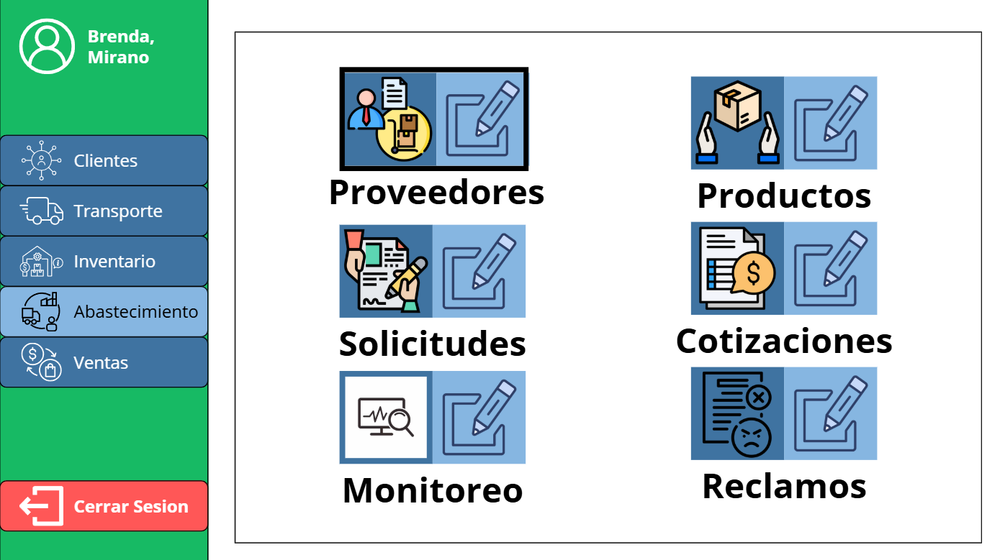
2. Visualiza la lista de proveedores existentes y, para registrar uno nuevo, elige la opción "Registrar Proveedor".
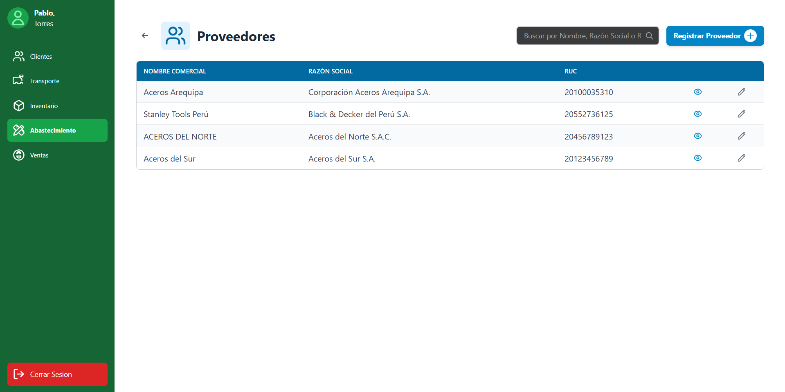
3. Llena los campos requeridos con los datos del nuevo proveedor y hace clic en "Continuar".
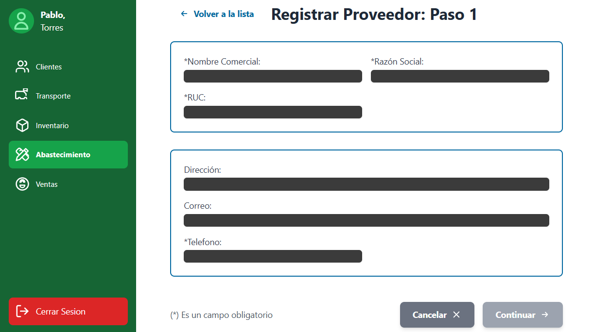

4. En la siguiente pantalla, completa la información de los productos que el proveedor ofrece, pudiendo añadir tantos como sean necesarios. Una vez conforme, hace clic en "Guardar".

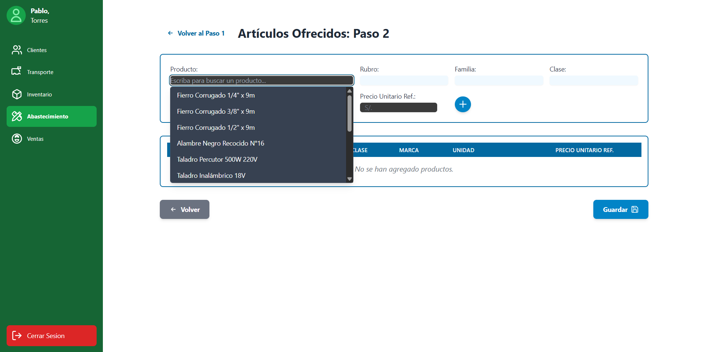
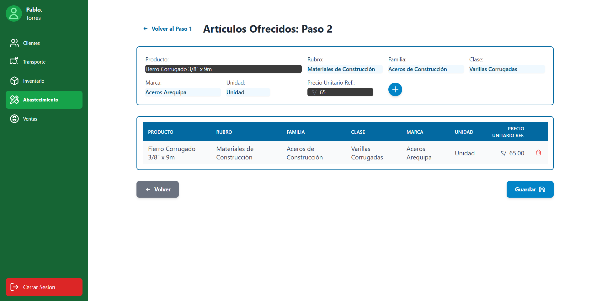

---

## **Caso de uso #2: Actualizar datos del Proveedor**

| **ID**                     | R-402 |
|-----------------------------|-------|
| **Actor(es)**               | Jefe de Abastecimiento |
| **Objetivo**                | Permite modificar la información general de un proveedor (como RUC, nombre comercial, contacto) o actualizar su catálogo de productos (precios de referencia, añadir o quitar items). |
| **Precondiciones**          | El **EMPLEADO** de abastecimiento debe estar logueado en el sistema, y el proveedor debe estar previamente registrado. |
| **Disparador  o evento inicial**              | Cambio en el valor de un atributo del Proveedor en la realidad.|
| **Flujo Principal**         | 1. El **EMPLEADO** accede a la vista de Abastecimiento.  2. Selecciona el menú **Proveedores**. 3. Selecciona el proveedor a actualizar. 4. Modifica los campos necesarios del Proveedor. 5. Confirma los datos para que sean actualizados. |
| **Postcondiciones**         | Los datos del proveedor son actualizados en el sistema.|
| **Excepciones**             | 1. "RUC duplicado" : Cuando el RUC ingresado ya se encuentra registrado en el sistema. 2. "Datos no válidos" : Cuando se introducen datos con un valor no aceptado. 3. "Campo obligatorio vacío" Cuando se deja sin completar algún campo requerido para el registro.|
| **Frecuencia de Uso**       | Frecuencia media, cada vez que un proveedor cambia de información , contacto o precios de productos. |

### **Flujo Principal:**
1. El **EMPLEADO** accede a la vista de Proveedores desde el menú de Abastecimiento.

3. Selecciona un proveedor de la lista y hace clic en "Editar".

4. Modifica los campos necesarios y confirma la actualización para guardar los cambios.
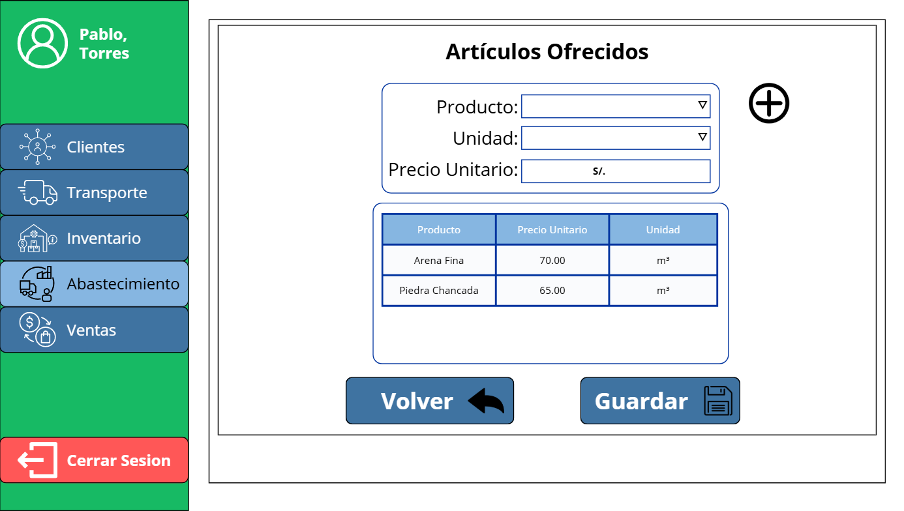
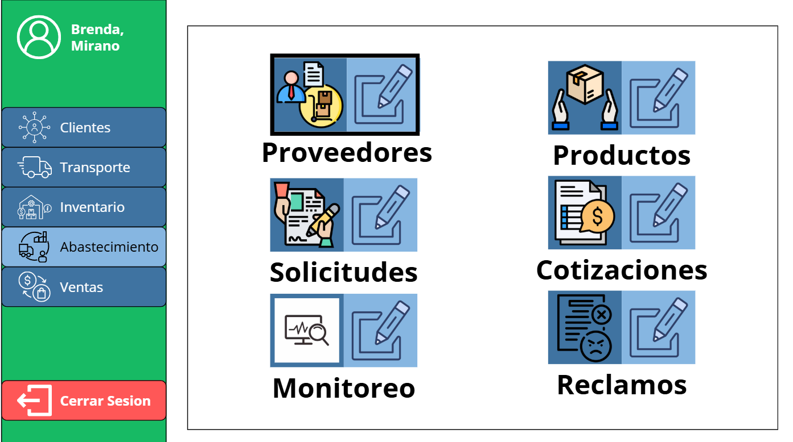

---

## **Caso de uso #3: Registrar Producto Nuevo**

| **ID**                     | R-403 |
|-----------------------------|-------|
| **Actor(es)**               | Jefe de Abastecimiento |
| **Objetivo**                | Permite Registrar un nuevo producto, con sus atributos como nombre, tipo, unidad de medida y precio base. |
| **Precondiciones**          | El **EMPLEADO** de abastecimiento debe estar logueado en el sistema. |
| **Disparador o evento inicial** | El **EMPLEADO** ingresa al módulo de Abastecimiento y desea registrar un producto nuevo. |
| **Flujo Principal**         | 1. El **EMPLEADO** accede a la vista de Abastecimiento.  2. Selecciona el menú **Productos**. 3. Selecciona **"Registrar Producto"**. 4. Ingresa los datos básicos del producto. 5. Confirma los datos para que sean ingresados. |
| **Postcondiciones**         | 1. Se crea una nueva instancia de la entidad `PRODUCTO`|
| **Excepciones**             |1. "Datos no válidos" Cuando se introducen datos con un valor no aceptado.  2. "Campo obligatorio vacío" Cuando se deja sin completar algún campo requerido para el registro.|
| **Frecuencia de Uso**       | Poco frecuente, cada vez que se agrega un nuevo producto en la ferretería. |

### **Flujo Principal:**
1. El **EMPLEADO** accede a la vista de Productos desde el menú de Abastecimiento.

2. Visualiza la lista de productos de la ferretería y selecciona la opción "Registrar Producto".
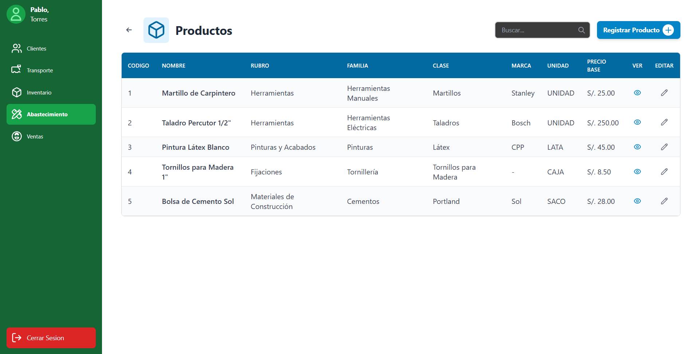

3. Completa los campos obligatorios con los datos del nuevo producto y hace clic en "Guardar".
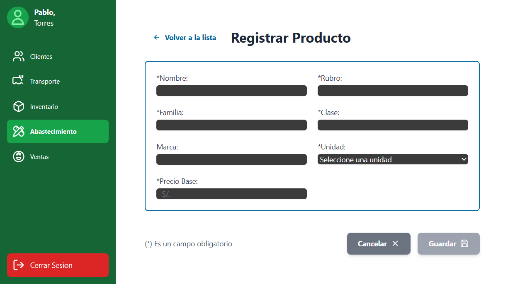
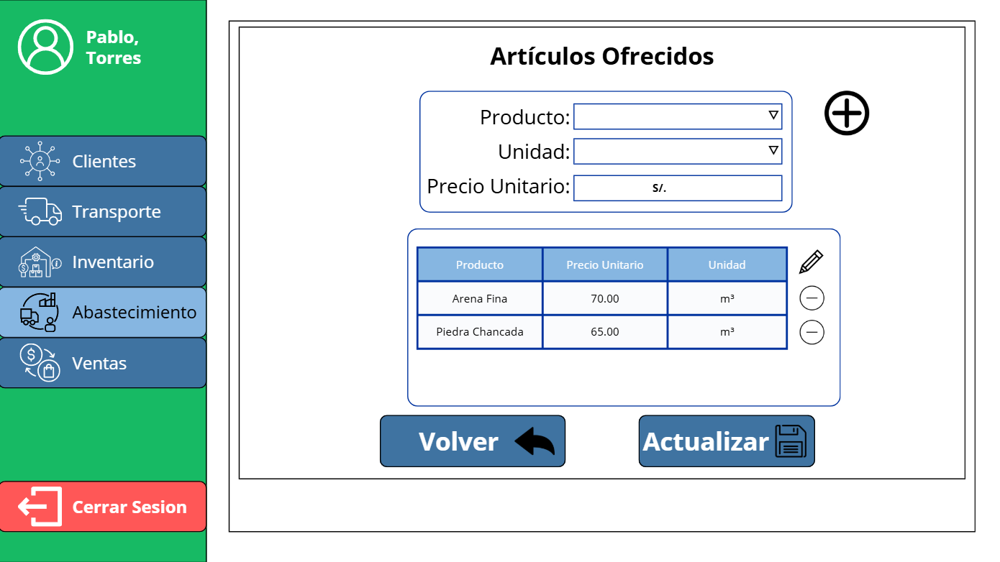

---

## **Caso de uso #4: Revisar Pedido de Abastecimiento**

| **ID** | R-404 |
|:---:|:---|
| **Actor(es)** | Jefe de Abastecimiento |
| **Objetivo** | Permite al **EMPLEADO** revisar un **PEDIDO DE ABASTECIMIENTO** , verificar el detalle de los ítems requeridos y actualizar el atributo **`estado_pedido`** a **'Revisado'**. |
| **Precondiciones** | 1. El **EMPLEADO** de abastecimiento debe estar logueado en el sistema. 2. Existe al menos un **PEDIDO DE ABASTECIMIENTO** con `estado_pedido` **'Pendiente'**. |
| **Disparador o evento inicial** | El **EMPLEADO** ingresa al módulo de Abastecimiento para revisar los pedidos internos pendientes. |
| **Flujo Principal** | 1. El **EMPLEADO** accede a la vista de Abastecimiento. 2. Selecciona el menú **Pedidos de Abastecimiento**. 3. Visualiza el listado de pedidos pendientes y selecciona uno. 4. Revisa los detalles (productos, cantidades, unidad de medida, fechas requeridas y ubicación de envío). 5. Selecciona la opción **"Marcar como Revisado"**. 6. El sistema actualiza el atributo **`estado_pedido`** del pedido a **'Revisado'**.|
| **Postcondiciones** | El **PEDIDO DE ABASTECIMIENTO** tiene el atributo **`estado_pedido`** igual a **'Revisado'**.|
| **Excepciones** | 1. "Estado incorrecto": Si el pedido seleccionado ya no se encuentra en estado 'Pendiente' (ej. otro EMPLEADO lo revisó segundos antes).|
| **Frecuencia de Uso** | Frecuente, cada vez que llega un pedido de abastecimiento (requerimeinto) por parte de un área.|

### **Flujo Principal:**
1. El **EMPLEADO** accede al sistema y entra a la vista de Abastecimiento y en el menú principal, selecciona la opción "Pedidos de Abastecimiento".

2. Visualiza la lista de pedidos con `estado_pedido` 'Pendiente' y selecciona uno para ver el detalle de los productos y cantidades.
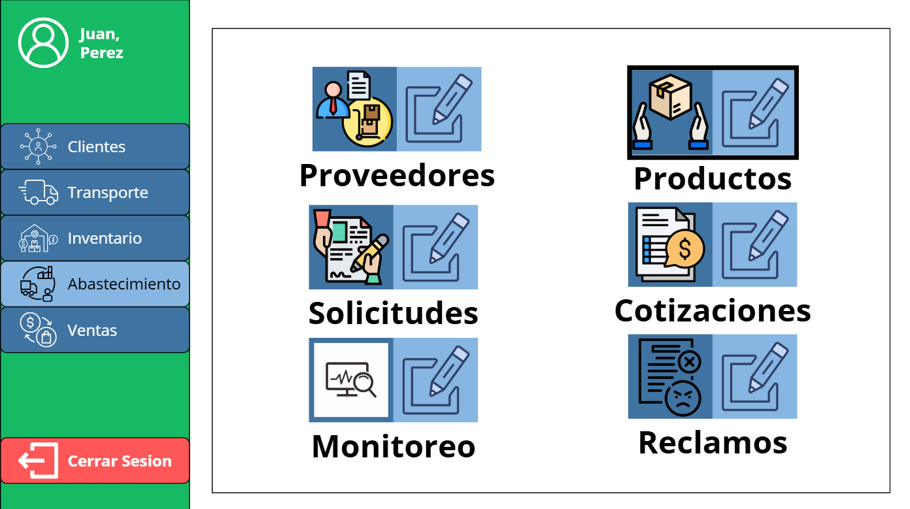
3. Una vez revisado el contenido, selecciona la opción **"Marcar como Revisado"**.
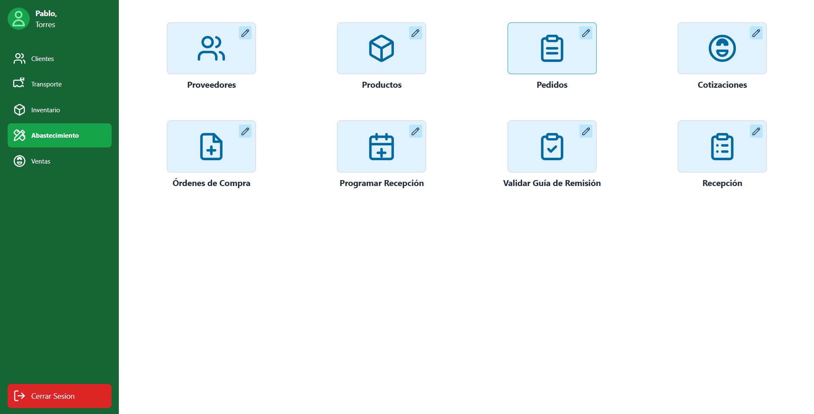
4. El sistema confirma el cambio del **`estado_pedido`** a **'Revisado'** y lo mueve a la bandeja de pedidos listos para cotizar.
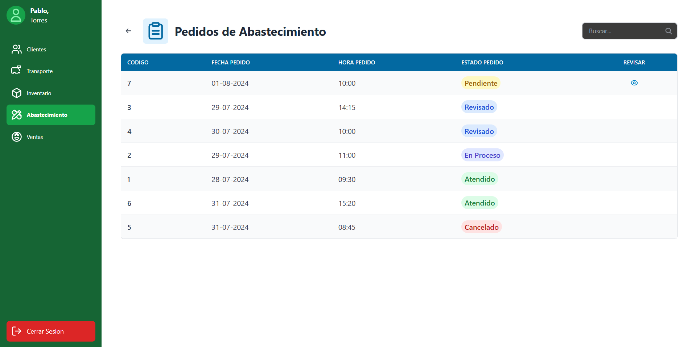

---

## **Caso de uso #5: Priorizar Pedidos de Abastecimiento y Generar Solicitud de Cotización**

| **ID** | R-405 |
|:---:|:---|
| **Actor(es)** | Jefe de Abastecimiento |
| **Objetivo** | Permite al **EMPLEADO** organizar, revisar y **priorizar** los **PEDIDOS DE ABASTECIMIENTO** que ya han sido revisados (R-404) para definir la urgencia de los **PRODUCTOS** requeridos y, a partir de la selección, generar una **SOLICITUD DE COTIZACIÓN**. |
| **Precondiciones** | 1. El **EMPLEADO** de abastecimiento debe estar logueado en el sistema. 2. Existen **PEDIDOS DE ABASTECIMIENTO** previamente revisados (R-404). |
| **Disparador o evento inicial** | El EMPLEADO necesita priorizar y diferenciar los productos urgentes de los no urgentes asociado a los PEDIDOS DE ABASTECIMIENTO. |
| **Flujo Principal** | 1. El **EMPLEADO** accede a la vista de Abastecimiento. 2. Selecciona el menú **Solicitudes de Cotización**. 3. Selecciona la opción **"Generar Solicitud"**. 4. El **EMPLEADO** visualiza los productos pendientes de cotizar y aplica criterios de **priorización**. 5. Selecciona y agrupa los **PRODUCTOS** que formarán parte de esta **SOLICITUD DE COTIZACIÓN**. 6. Confirma la selección, y el sistema crea una **SOLICITUD DE COTIZACIÓN**.|
| **Postcondiciones** | 1. Se crea una nueva instancia de la entidad `SOLICITUD DE COTIZACION` con `estado` **'Pendiente'** y el detalle de los productos seleccionados.  2. Los ítems consolidados son marcados como `En Cotización`, permaneciendo el resto de ítems en estado `Revisado` para una futura solicitud. |
| **Excepciones** | Ninguna identificada (las validaciones se manejan por diseño de la interfaz).|
| **Frecuencia de Uso** | Frecuente, en función de la urgencia de la demanda.|

### **Flujo Principal:**
1. El **EMPLEADO** accede al sistema y entra a la vista de Abastecimiento y en el menú principal, selecciona la opción "Solicitudes de Cotización".

2. Selecciona la opción **"Generar Solicitud"**. El sistema muestra los productos pendientes de los pedidos con `estado_pedido` 'Revisado'.
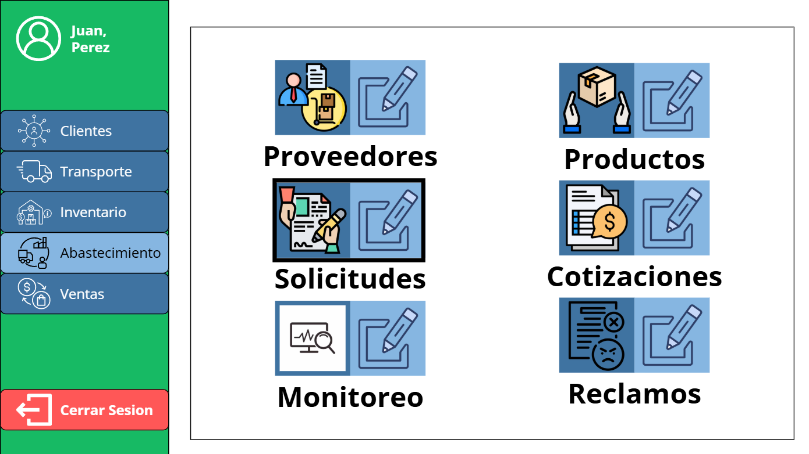
3. El **EMPLEADO** utiliza las herramientas de **priorización por fechas** y marca los ítems de **PRODUCTO** (de uno o varios pedidos) que desea incluir en la solicitud actual.
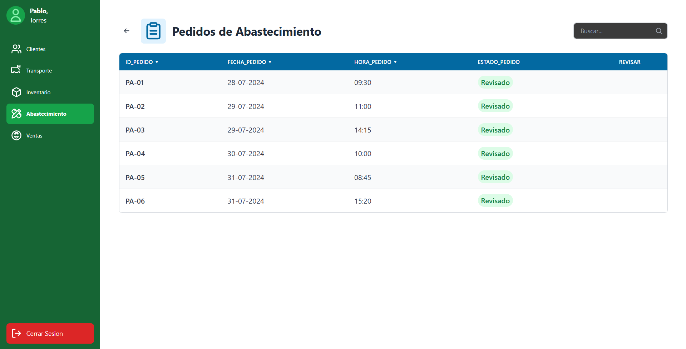
4. El sistema confirma la creación de la **SOLICITUD DE COTIZACIÓN**, asignándole un `id_solicitud` y el `estado` **'Pendiente'**. Los ítems seleccionados pasan a `En Cotización`.

---

## **Caso de uso #6: Registrar Cotizaciones Recibidas**

| **ID** | R-406 |
|:---:|:---|
| **Actor(es)** | Jefe de Abastecimiento |
| **Objetivo** | Permite al **EMPLEADO** registrar una **COTIZACION** recibida de un **PROVEEDOR** y asociarla a una **SOLICITUD DE COTIZACIÓN** activa.|
| **Precondiciones** |1. El **EMPLEADO** de abastecimiento debe estar logueado en el sistema. 2. Debe existir al menos una **SOLICITUD DE COTIZACIÓN** con `estado` 'Pendiente'. 3. El **PROVEEDOR** debe estar previamente registrado (R-401). |
| **Disparador o evento inicial** | El **EMPLEADO** recibe físicamente o por algún medio de comunicación la oferta formal de un **PROVEEDOR**. |
| **Flujo Principal** | 1. El **EMPLEADO** accede a la vista de Abastecimiento. 2. Selecciona el menú **Cotizaciones**. 3. Selecciona la **SOLICITUD DE COTIZACIÓN** a la cual aplicará esta oferta. 4. Selecciona **"Registrar Cotización"**. 5. Ingresa el **PROVEEDOR** y los atributos de la **COTIZACION** (`fecha_emision_cotizacion`, `fecha_garantia`, `monto_total`, `plazo_entrega`). 6. Registra el precio ofertado para cada **PRODUCTO**. 7. Confirma el registro|
| **Flujo Alternativo** | 1. El `EMPLEADO` está en la lista de "Solicitudes de Cotización".  2. Selecciona una solicitud (con estado 'Pendiente') que ya tiene cotizaciones registradas.  3. El `EMPLEADO` decide que no recibirá más ofertas y presiona **"Cerrar Cotización"**.  4. El sistema actualiza el `estado` de la `SOLICITUD DE COTIZACIÓN` de 'Pendiente' a **'Cotizada'**. |
| **Postcondiciones** | 1. Se crea una nueva instancia de la entidad **COTIZACION** asociada a la **SOLICITUD DE COTIZACIÓN** y al **PROVEEDOR**. 2. Se registran los precios de los productos en el detalle de la cotización. |
| **Excepciones** | 1. "Estado incorrecto": Si la SOLICITUD DE COTIZACIÓN seleccionada ya no se encuentra en estado 'Pendiente' (ej. otro EMPLEADO la adjudicó segundos antes). 2. "Datos no Válidos" : Cuando se introducen valores erróneos en los atributos de fecha o monto. 3. "Campo obligatorio vacío" : Cuando se deja sin completar algún campo requerido (ej. Proveedor, Monto Total).|
| **Frecuencia de Uso** | Frecuente, por cada proveedor que envía una oferta.|

### **Flujo Principal:**
1. El **EMPLEADO** accede al sistema y entra a la vista de Abastecimiento y en el menú principal, selecciona la opción "Cotizaciones".

2. El sistema muestra las **SOLICITUDES DE COTIZACIÓN**. Selecciona la solicitud a la que pertenece la oferta y luego hace clic en **"Registrar Cotización"**.
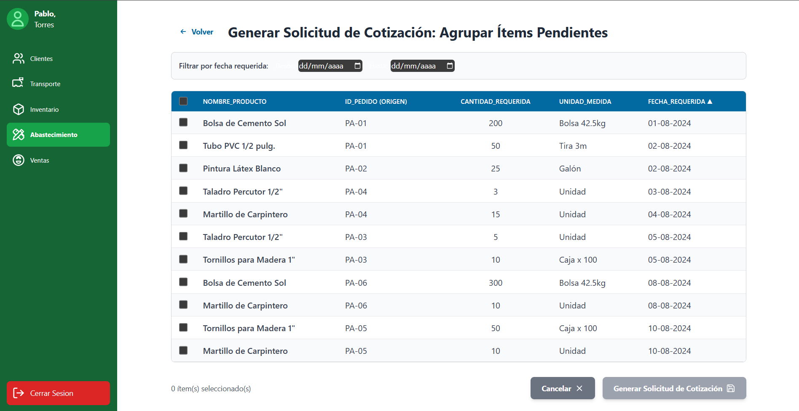
3. Llena el formulario seleccionando el **PROVEEDOR** e ingresando los atributos de la **COTIZACION** (`fecha_emision_cotizacion`, `plazo_entrega`, etc.). Completa la tabla de ítems con el precio cotizado (`monto_total` por producto) para cada **PRODUCTO**.
y Confirma la operación, y el sistema guarda la **COTIZACION**.
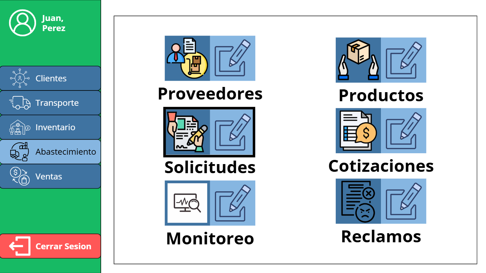
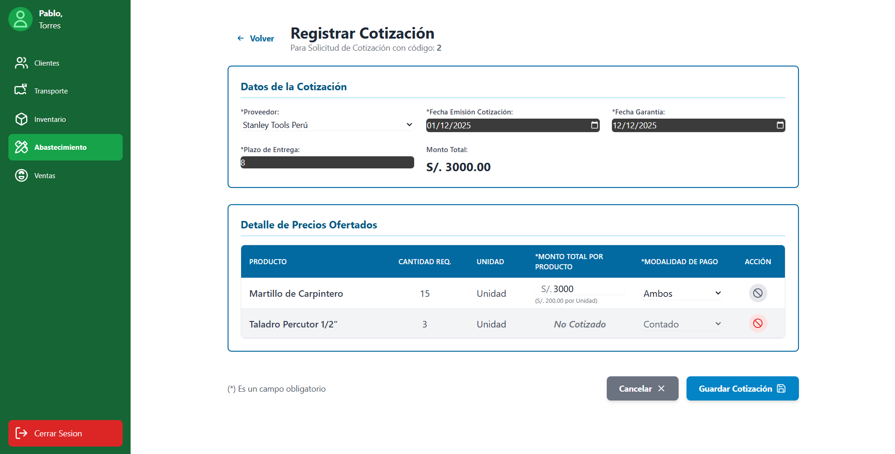

---

## **Caso de uso #7: Evaluar Cotizaciones y Generar Órdenes de Compra**

| **ID** | R-407 |
|:---:|:---|
| **Actor(es)** | Jefe de Abastecimiento |
| **Objetivo** | Permite al **EMPLEADO** comparar las **COTIZACIONES** por **PRODUCTO** dentro de una **SOLICITUD DE COTIZACIÓN** y adjudicar los ítems de manera granular a diferentes **PROVEEDORES**. A partir de esta selección, el sistema genera una o varias instancias de la entidad **ORDEN DE COMPRA** (`id_orden`), una por cada **PROVEEDOR** y **`modalidad de pago`** seleccionada. |
| **Precondiciones** | 1. El **EMPLEADO** de abastecimiento debe estar logueado en el sistema. 2. Existe al menos una **SOLICITUD DE COTIZACIÓN** con estado 'Cotizada'. 3. Existen **COTIZACIONES** registradas en dicha solicitud. |
| **Disparador o evento inicial** | El **EMPLEADO** debe analizar la rentabilidad de cada **PRODUCTO COTIZADO** para decidir a quién comprar. |
| **Flujo Principal** | 1. El **EMPLEADO** accede al menú **Solicitudes de Cotización**. 2. Selecciona la **SOLICITUD DE COTIZACIÓN** (con estado 'Cotizada') para iniciar la evaluación. 3. El sistema muestra la comparación de las ofertas, agrupadas por **PRODUCTO**, listando los precios de los **PROVEEDORES**. 4. El **EMPLEADO** adjudica cada **PRODUCTO** al **PROVEEDOR** que más le conviene y **asigna la `modalidad_pago`** ('Contado' o 'Crédito') a esa adjudicación específica. 5. El **EMPLEADO** repite el paso 4 hasta adjudicar todos los ítems deseados. 6. El **EMPLEADO** selecciona **"Generar Órdenes de Compra"**. 7. El sistema agrupa los ítems adjudicados por **`PROVEEDOR`** y **`MODALIDAD_PAGO`**, y crea una **ORDEN DE COMPRA** distinta para cada agrupación.|
| **Postcondiciones** | 1. Se crea(n) una o varias instancias de la entidad **ORDEN DE COMPRA**. 2. La **SOLICITUD DE COTIZACIÓN** cambia su estado a **'Adjudicada'** y los ítems adjudicados ya no están disponibles para otra compra. |
| **Excepciones** | 1. "Estado incorrecto": Si la **SOLICITUD DE COTIZACIÓN** seleccionada ya no se encuentra en estado 'Cotizada' (ej. otro EMPLEADO la adjudicó segundos antes). 2. "Cotización expirada" : Si la `fecha_garantia` de la oferta del **PROVEEDOR** ha vencido.|
| **Frecuencia de Uso** | Frecuente, al tener todas las cotizaciones listas para evaluar.|

### **Flujo Principal:**
1. El **EMPLEADO** accede al sistema y entra a la vista de Abastecimiento y en el menú principal, selecciona la opción "Cotizaciones" .

2.Elige la **SOLICITUD DE COTIZACIÓN** para evaluar las ofertas recibidas.
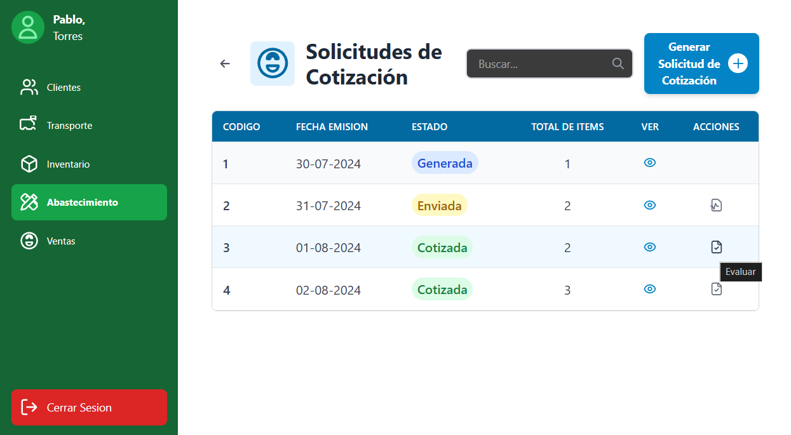
3. El sistema muestra una vista comparativa de las **COTIZACIONES** enfocada en el detalle del **PRODUCTO** (precio, plazo de entrega de cada **PROVEEDOR**).
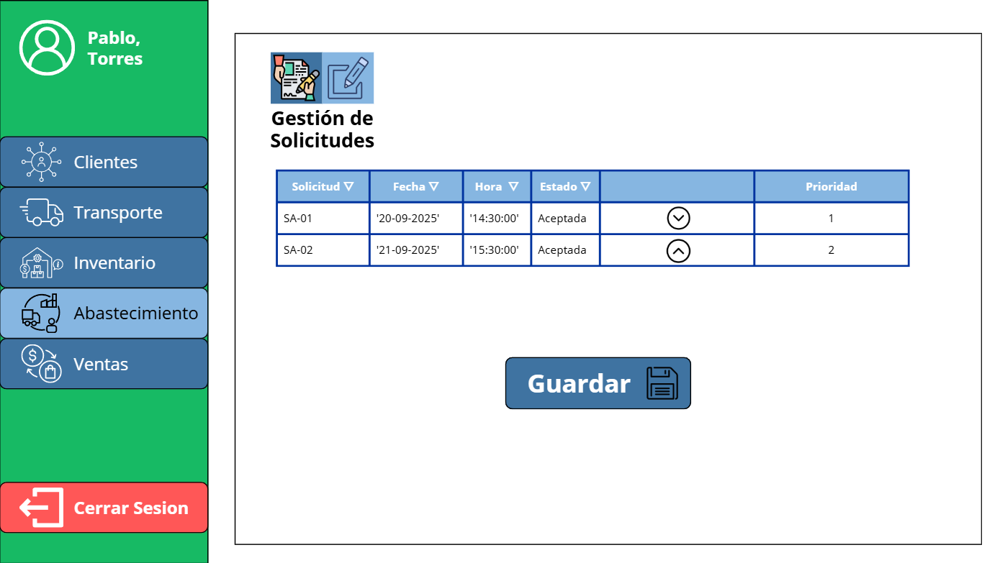
4. El **EMPLEADO** adjudica cada ítem de **PRODUCTO** al **PROVEEDOR** seleccionado, pudiendo elegir diferentes **PROVEEDORES** para distintos ítems.
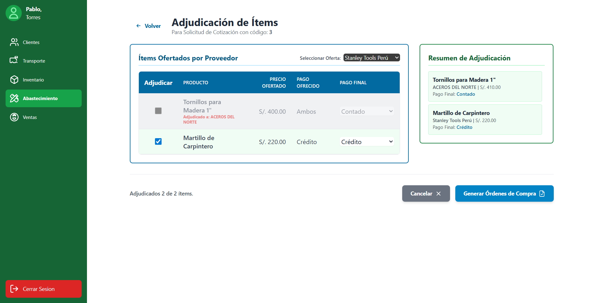
5. El sistema crea una **ORDEN DE COMPRA** separada por cada **PROVEEDOR** adjudicado, registrando el **`monto`** total y asignando el `estado` **'Emitida'**.
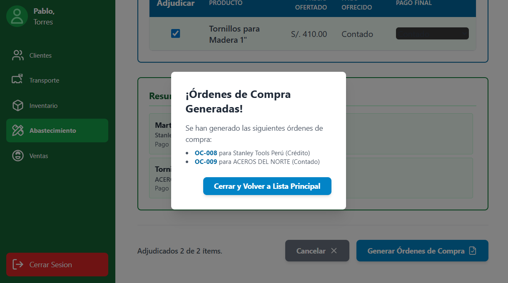

---

## **Caso de uso #8: Monitorear Orden de Compra**

| **ID** | R-408 |
|:---:|:---|
| **Actor(es)** | Jefe de Abastecimiento |
| **Objetivo** | Permite al **EMPLEADO** consultar el estado de una **ORDEN DE COMPRA** a través de la entidad **MONITOREO DE COMPRA**, para verificar el avance del proceso logístico y los atributos de programación (`fecha_entrega`, `hora_entrega`). |
| **Precondiciones** | 1. El **EMPLEADO** de abastecimiento debe estar logueado en el sistema. 2. Existe al menos una **ORDEN DE COMPRA** previamente generada (R-407). |
| **Disparador o evento inicial** | El **EMPLEADO** necesita verificar la fecha de llegada o el progreso de una compra ya emitida. |
| **Flujo Principal** | 1. El **EMPLEADO** accede a la vista de Abastecimiento. 2. Selecciona el menú **Monitoreo de Compra**. 3. El sistema muestra un listado de **ÓRDENES DE COMPRA** en curso (ej. 'Generada', 'Enviada', 'En transporte'). 4. El **EMPLEADO** selecciona la **ORDEN DE COMPRA** a monitorear. 5. El sistema muestra los detalles de la **ORDEN DE COMPRA** (`monto`, `fecha_emision`, `estado`). 6. El sistema muestra la entidad **MONITOREO DE COMPRA** con sus atributos clave: `estado`, `fecha_entrega` programada y `hora_entrega` prevista. |
| **Postcondiciones** | El **EMPLEADO** ha visualizado el estado logístico de la **ORDEN DE COMPRA**. |
| **Excepciones** | Ninguna identificada (es un caso de uso de consulta). |
| **Frecuencia de Uso** | Periódico, para seguimiento de la promesa de entrega. |

### **Flujo Principal:**
1. El **EMPLEADO** accede al sistema y entra a la vista de Abastecimiento y en el menú principal, selecciona la opción "Monitoreo de Compra".

2. Visualiza la lista de **ÓRDENES DE COMPRA** emitidas y selecciona la que desea seguir.
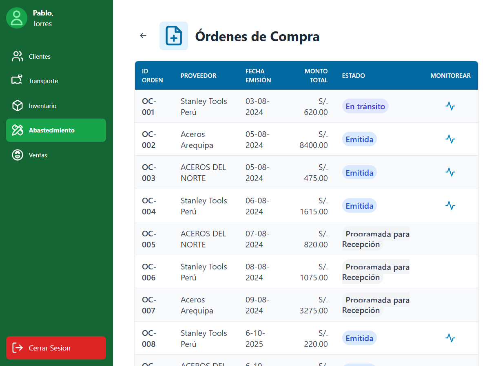
3. El sistema muestra una ficha de monitoreo que incluye los atributos de la **ORDEN DE COMPRA** y el registro de **MONITOREO DE COMPRA** (`fecha_entrega`, `estado`).
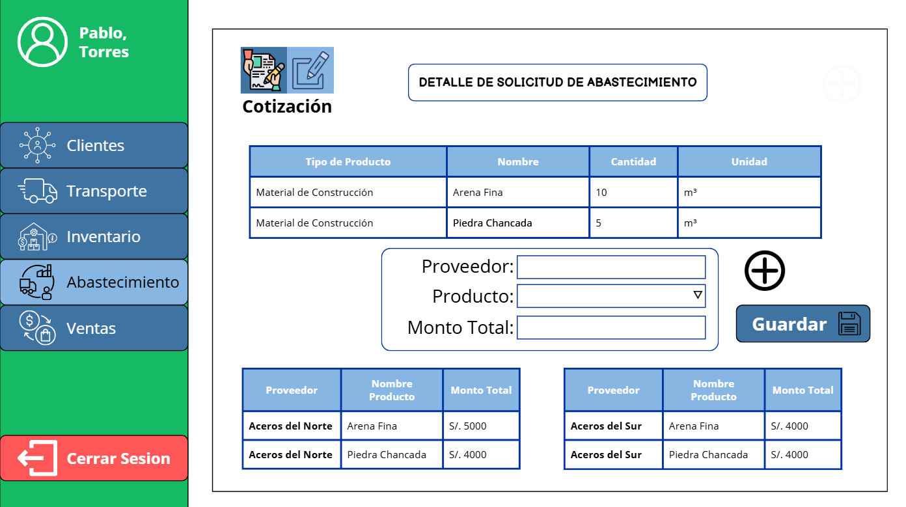
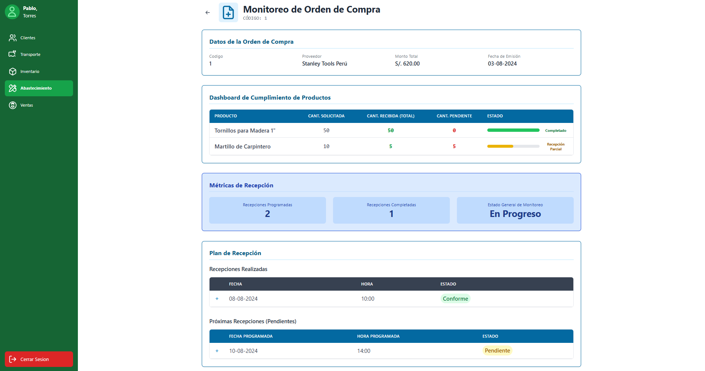

---

## **Caso de uso #9: Programar Recepción y Verificar Disponibilidad**

| **ID** | R-409 |
|:---:|:---|
| **Actor(es)** | Jefe de Abastecimiento |
| **Objetivo** | Permite al **EMPLEADO** establecer la logística de recepción de una **ORDEN DE COMPRA** (OC). El sistema debe **verificar la disponibilidad** de recursos internos (disponibilidad de **ALMACÉN** y/o **TRANSPORTE**) basándose en la fecha tentativa del **PROVEEDOR**. Si es viable, crea la entidad **RECEPCIÓN** registrando los atributos de programación. |
| **Precondiciones** | 1. El **EMPLEADO** de abastecimiento debe estar logueado en el sistema. 2. Existe una **ORDEN DE COMPRA** en estado **'Emitida'** o **'En Proceso'**. 3. El **EMPLEADO** ha coordinado preliminarmente con el **PROVEEDOR** una fecha tentativa de entrega. |
| **Disparador o evento inicial** | El **EMPLEADO** necesita **validar internamente la fecha tentativa** de entrega del **PROVEEDOR** contra la disponibilidad de **ALMACÉN** y/o **TRANSPORTE** para realizar la programación de una recepción. |
| **Flujo Principal** | 1. El **EMPLEADO** accede a la vista de Abastecimiento y selecciona **Recepciones Programadas**. 2. Selecciona una **ORDEN DE COMPRA** con productos aún pendientes de recepción. 3. El sistema muestra el resumen de **PRODUCTOS** pendientes y el **EMPLEADO** elige la **Modalidad Logística** (Entrega o Recojo). 4. El **EMPLEADO ingresa la fecha y hora tentativa de entrega/recojo coordinada con el PROVEEDOR**. 5. El sistema usa esta fecha y hora para **verificar la disponibilidad de recursos** (consultando los Módulos de **ALMACÉN** y/o **TRANSPORTE**). 6. El sistema **muestra la disponibilidad de recursos internos**. 7. El **EMPLEADO** **confirma** la programación final seleccionando una franja disponible, e ingresa la **`fecha_programada`**, **`hora_programada`** y el **`empleado_encargado`**. 8. El **EMPLEADO** detalla qué ítems se programan: **`productos_programados`** y su **`cantidad_programacion`**. 9. El sistema crea la entidad **RECEPCION** (`id_recepcion`) con estado **“Programada”**. 10. **Solo si** la modalidad fue **Recojo**, el sistema genera el **PEDIDO DE TRANSPORTE** asociado a la recepción. |
| **Flujo Alternativo** | **A1: Sin Disponibilidad Interna**  1. El `EMPLEADO` completa hasta el Paso 6 del Flujo Principal.  2. El sistema informa **"Sin disponibilidad"** para la franja solicitada por el proveedor.  3. El `EMPLEADO` no puede confirmar (Paso 7) y debe **Cancelar** para renegociar la fecha con el `PROVEEDOR` (fuera del sistema).   **A2: Cancelar programación**  1. En cualquier paso (ej. 4, 7, 8), el `EMPLEADO` presiona **"Cancelar"**.  2. El sistema descarta los cambios y regresa a la lista de OCs. |
| **Postcondiciones** | 1. Se crea una nueva instancia de la entidad **RECEPCIÓN** con `estado` **'Programada'** y todos sus atributos de programación definidos. 2. El detalle de la recepción incluye los **`productos_programados`** y su **`cantidad_programacion`**. 3. **O** se genera un **PEDIDO DE TRANSPORTE** (si fue recojo), **O** no se genera (si fue entrega en almacén). 4. La **ORDEN DE COMPRA** se marca como **'Programada para Recepción'**. |
| **Excepciones** | 1. "Estado incorrecto": Si la `ORDEN DE COMPRA` seleccionada ya no se encuentra en 'Emitida' o 'En Proceso' (ej. otro EMPLEADO la completó). 2. "Datos no Válidos" : Si se ingresa una fecha u hora incoherente (ej. una fecha pasada). 3. "Campo obligatorio vacío" : Cuando se deja sin completar un campo requerido (ej. fecha, items, encargado). |
| **Frecuencia de Uso** | Frecuente, cada vez que una OC debe ser programada para entrega o recojo. |

### **Flujo Principal:**
1. El **EMPLEADO** accede al sistema y entra a la vista de Abastecimiento, seleccionando la opción **"Recepciones Programadas"**.

2. Visualiza la lista de **ÓRDENES DE COMPRA** pendientes y selecciona la que va a programar.
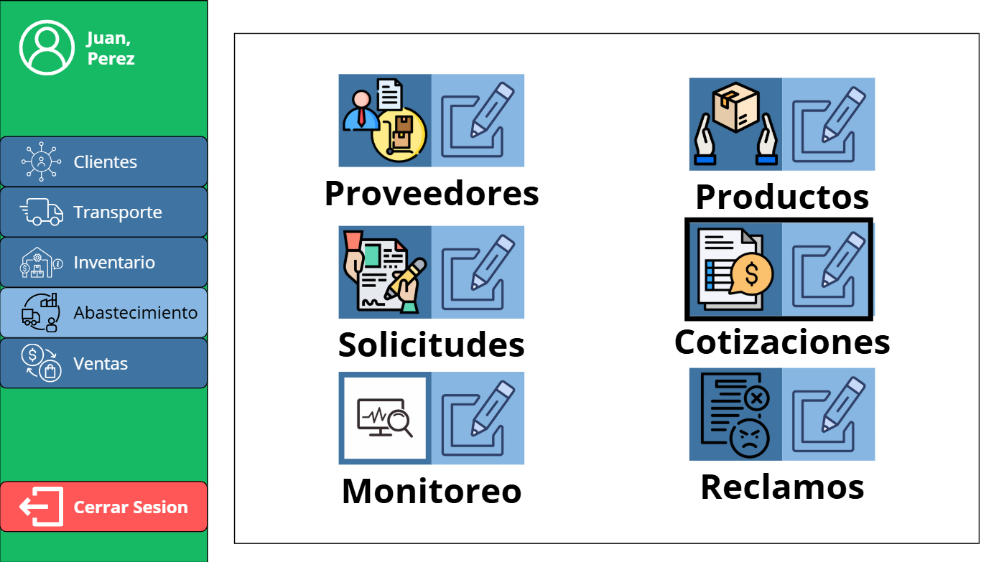
3. El **EMPLEADO** elige la modalidad logística y luego **revisa que la disponibilidad se ajuste fecha y hora tentativa de entrega coordinada con el PROVEEDOR**.
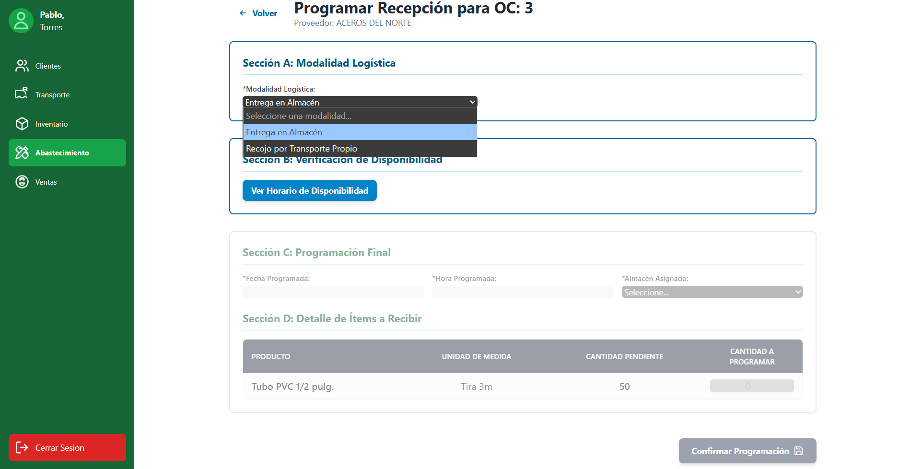
4. Se muestra la **disponibilidad** de recursos y se selecciona la franja disponible y define la **`fecha_programada`**, **`hora_programada`** final.
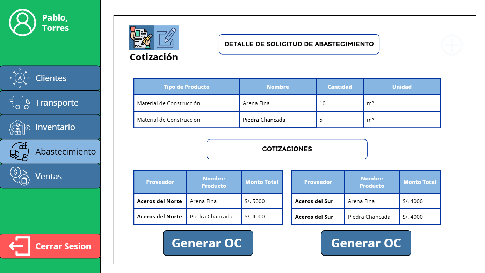
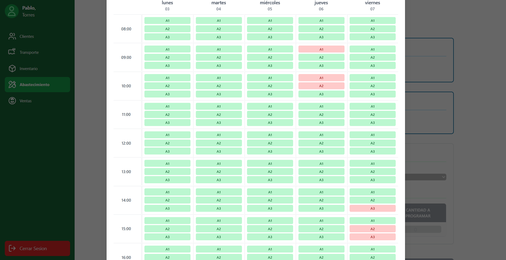
6. El **EMPLEADO** especifica los **`productos_programados`** y su **`cantidad_programacion`** a recibir y confirma.
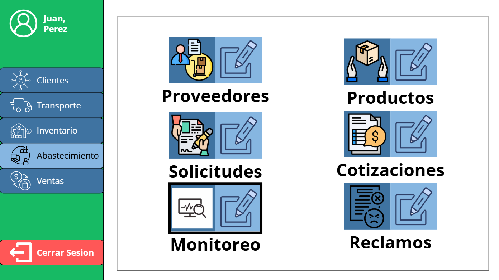

---

## **Caso de uso #10: Validar Guía de Remisión**

| **ID** | R-410 |
|:---:|:---|
| **Actor(es)** | **Inspector de Recepción** |
| **Objetivo** | Permite al **Inspector de Recepción** registrar las múltiples **GUÍAS DE REMISIÓN** (GR) y luego **asociar** los productos de la **RECEPCIÓN** programada a cada guía. El sistema contrasta las cantidades y facilita la **generación de incidencias** por discrepancias documentales, iniciando el proceso de recepción. |
| **Precondiciones** | 1. El **Inspector de Recepción** debe estar logueado en el sistema. 2. Existe una entidad **RECEPCIÓN** con `estado` **'Programada'**. 3. La mercancía ha llegado al punto de recepción con su documentación. |
| **Disparador o evento inicial** | El **PROVEEDOR** con su unidad de **TRANSPORTE** presentan la documentación (Guía de Remisión) al **Inspector de Recepción**. |
| **Flujo Principal** | 1. El **Inspector de Recepción** accede a la vista de **RECEPCIÓN**. 2. Selecciona la **RECEPCIÓN** programada (`estado` 'Programada') correspondiente a la entrega actual. 3. Selecciona la opción **"Registrar Guía de Remisión"**. 4. El **Inspector de Recepción** ingresa los atributos de la guía: **`serie_correlativo`**, **`fecha_emision_guia`** y **`fecha_traslado_guia`**. 5. El `Inspector` repite el paso 4 para *todas* las guías que han llegado 6.El `Inspector` selecciona una guía del dropdown y marca los productos de la `RECEPCIÓN` que están incluidos en esa guía 7. El **Inspector de Recepción** repite el paso 6 hasta asociar todos los productos a todas las guías existentes. 8. El sistema autocompleta las cantidades de todos los productos y en caso que se identifique alguna inconsistencia el **Inspector de Recepción** ingresa las **cantidades que figuran en el respectivo documento (Guía)** para los productos inconformes generando una incidencia. 9. El **Inspector de Recepción** confirma la validación documental. 9. El sistema registra la **GUÍA DE REMISIÓN** y actualiza el estado de la **RECEPCIÓN** de **'Programada'** a **'En Curso'**. |
| **Postcondiciones** | 1. Se registra la **GUÍA DE REMISIÓN** con sus atributos vinculados a la **RECEPCIÓN**. 2. La entidad **RECEPCIÓN** cambia su `estado` a **'En Curso'**. 3. Se registra la **`hora_inicio_recepcion`** (toma del sistema). |
| **Excepciones** | 1. "Estado incorrecto": Si la `RECEPCIÓN` seleccionada ya no se encuentra en estado 'Programada' (ej. otro inspector la inició segundos antes). 2. "**Discrepancia documental (Guía vs. Recepción)**": Cuando las cantidades ingresadas (leídas de la guía) no coinciden con las cantidades de la `RECEPCIÓN` programada. 3. "Guía duplicada": Cuando el `serie_correlativo` de la guía ya fue registrado en otra recepción. 4. "Datos no Válidos" : Si se ingresa una fecha incoherente (ej. fecha de traslado futura). 5. "Campo obligatorio vacío" : Cuando se deja sin completar un campo requerido (ej. `serie_correlativo`).|
| **Frecuencia de Uso** | Frecuente, por cada ingreso de mercancía.|

### **Flujo Principal:**
1. El **Inspector de Recepción** encargado accede al sistema y entra a la vista de Abastecimiento y Selecciona la opción de **RECEPCIÓN**.

2. Selecciona la opción **"Registrar/Validar Guía de Remisión dependiendo cual quiere revisar"**.

3. Ingresa el **`serie_correlativo`** y las fechas de las **GUÍAS DE REMISIÓN** asociadas a esa **RECEPCIÓN**.
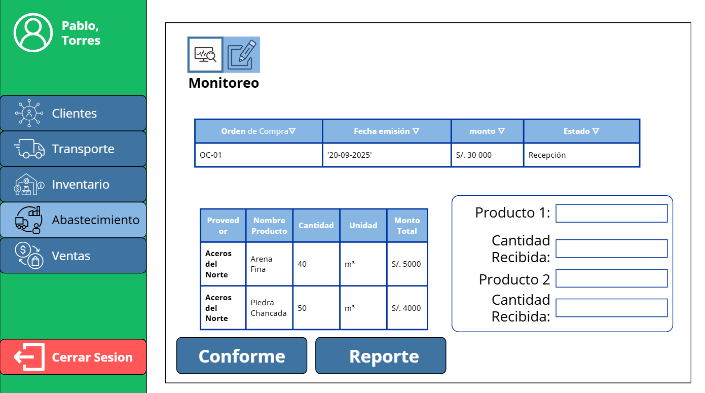 
4. Se dirige a la "Sección C: Asociación de Productos por Guía" , donde asocia los productos de la recepción a cada una de las guías registradas.
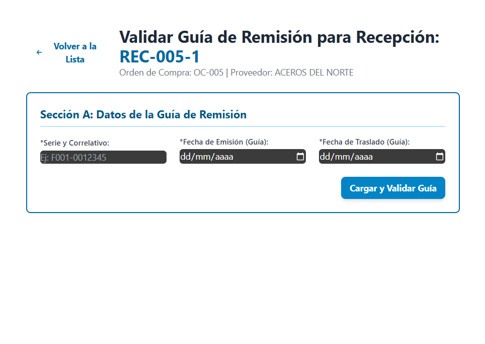
5. Una vez asociados, el sistema genera la "Sección D: Detalle y Verificación" , mostrando los productos agrupados por guía y autocompletando las cantidades.
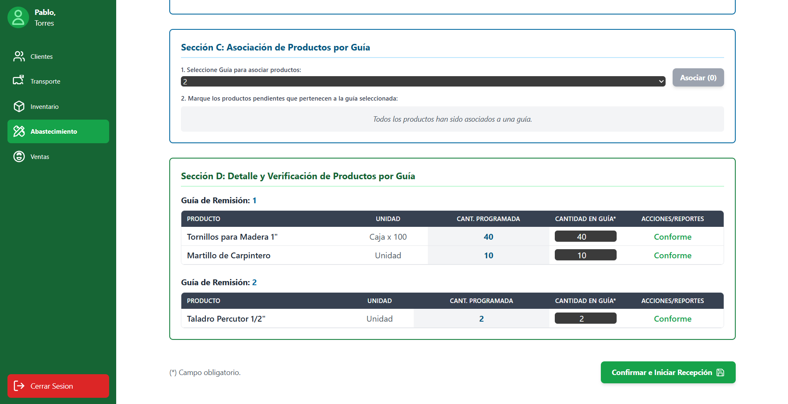
6. El **Inspector de Recepción** revisa los documentos físicos y corrige manualmente en el sistema solo las cantidades que presentan discrepancias.
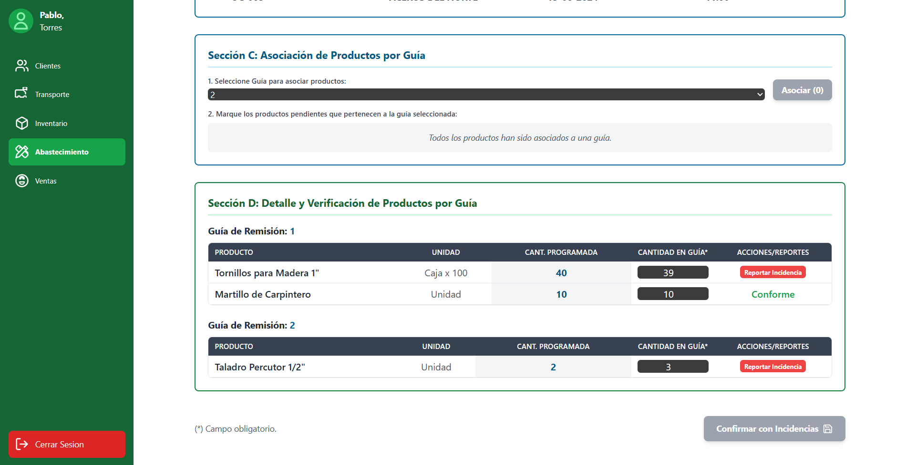
7. Para cada discrepancia, el **Inspector de Recepción** genera la incidencia correspondiente.
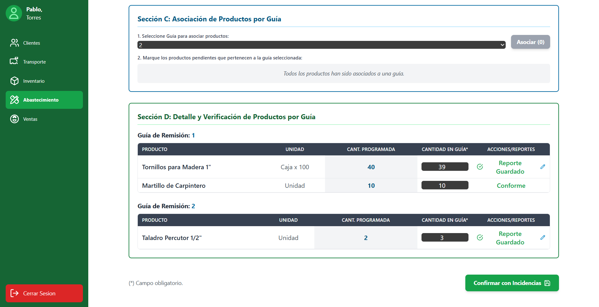
8. Finalmente, el **Inspector de Recepción** presiona "Confirmar e iniciar Recepción", y el sistema actualiza el estado de la RECEPCIÓN a 'En Curso'.
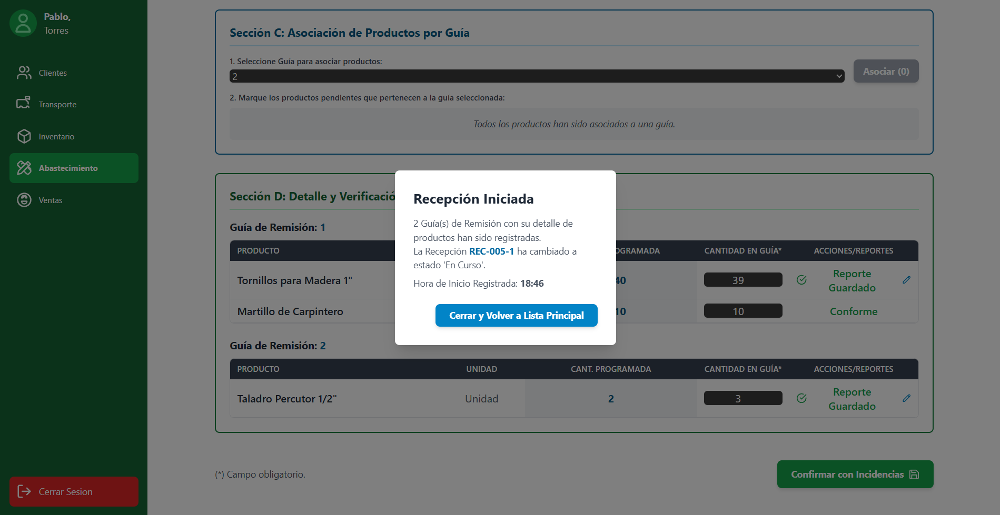

---

## **Caso de uso #11: Gestionar Reclamos por Recepción**

| **ID** | R-411 |
|:---:|:---|
| **Actor(es)** | Jefe de Abastecimiento |
| **Objetivo** | Permite al **EMPLEADO** registrar formalmente un **RECLAMO** por diferencias encontradas en la **RECEPCIÓN** (cantidad, calidad, o producto erróneo) y registrar la acción correctiva acordada con el **PROVEEDOR**. |
| **Precondiciones** | 1. El **EMPLEADO** debe estar logueado en el sistema. 2. Existe una diferencia detectada en la **RECEPCIÓN** (ej. `cantidad_recibida` es menor a la ordenada, o el control de calidad falla) por lo que se ha encontrado una incidencia. |
| **Disparador o evento inicial** | El **EMPLEADO** (o el personal de Almacén) detecta una discrepancia (incidencia) en los **PRODUCTOS** recibidos que requiere acción del **PROVEEDOR**. |
| **Flujo Principal** | 1. El **EMPLEADO** accede a la vista de **RECEPCIÓN** que presenta la discrepancia. 2. Selecciona la opción **"Generar Reclamo"**. 3. El sistema muestra los ítems con diferencia y sugiere el tipo de **RECLAMO** (ej. Faltante de Cantidad, Daño, Producto Erróneo). 4. El **EMPLEADO** selecciona el tipo de **RECLAMO** e ingresa la **`observacion_reclamo`** detallada. 5. El **EMPLEADO** negocia y registra la **`accion_correctiva`** acordada con el **PROVEEDOR** (ej. Reemplazo, Nota de Crédito, Devolución de producto). 6. El sistema crea la entidad **RECLAMO** (`id_reclamo`) con `fecha_emision_reclamo` y `estado_reclamo`='Abierto', vinculándola a la **RECEPCIÓN** y a la **ORDEN DE COMPRA**. 7. El **EMPLEADO** puede iniciar un proceso de **DEVOLUCIÓN** o **NOTA DE CRÉDITO** según la acción correctiva. |
| **Postcondiciones** | 1. Se crea la entidad **RECLAMO** con su `id_reclamo`, el tipo de reclamo y la acción correctiva registrada. 2. El estado de la **RECEPCIÓN** puede pasar a **'Con Reclamo'** o **'Pendiente de Solución'**. |
| **Excepciones** | 1. "Reclamo duplicado" Si ya existe un reclamo activo para el mismo ítem. 2. "Acción no válida" Si se intenta registrar una acción correctiva incompleta o no autorizada. 3. "Falta de permisos".|
| **Frecuencia de Uso** | Poco Frecuente, solo cuando existen discrepancias en la recepción.|

### **Flujo Principal:**
1. El **EMPLEADO** accede al sistema y entra a la vista de Incidencias.
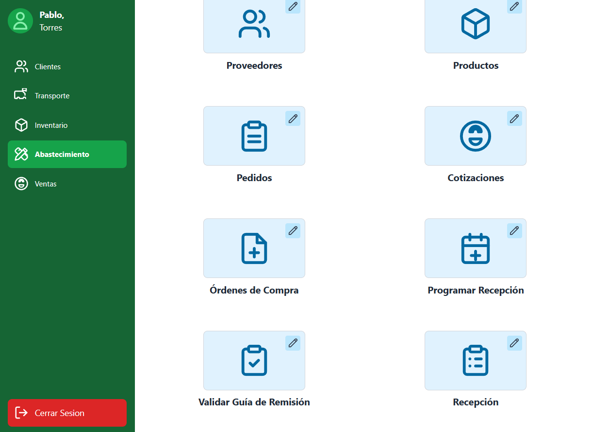
2. El **EMPLEADO** puede visualizar el detalle de cada Incidencia.
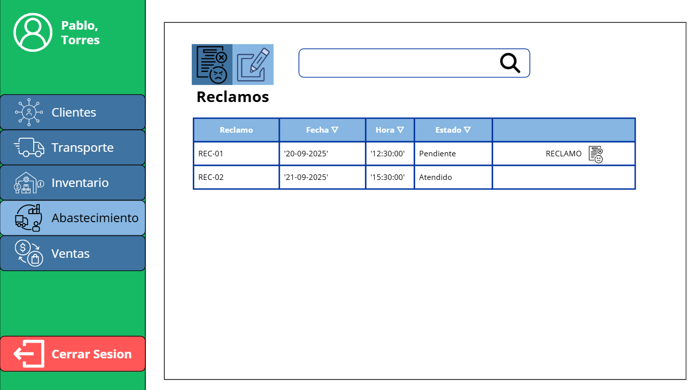
3. Selecciona la **INCIDENCIA** o el grupo de **INCIDENCIA** asociadas a una recepción que quiere reclamar.
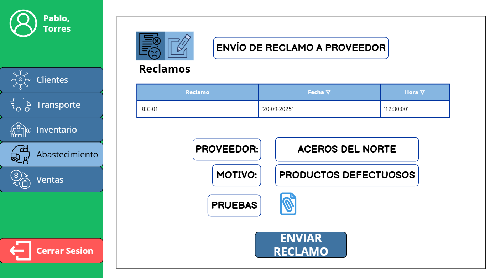
4. Selecciona **"Generar Reclamo"**. El sistema muestra los productos afectados. El **EMPLEADO** ingresa el tipo de **RECLAMO**, la **`observacion_reclamo`** y la **`accion_correctiva`** adjuntando las pruebas necesarias.

6. Confirma. El sistema envía el reclamo formal al proveedor.

---

## **Requisitos de Atributos de Calidad**

| Requerimiento | Atributo de Calidad | Razón de Necesidad | Expectativa |
|---------------|---------------------|--------------------|-------------|
| **R-401 – Registrar Proveedor** | Usabilidad | El jefe de abastecimiento debe poder registrar proveedores de forma rápida y sencilla. | La interfaz debe permitir registrar un proveedor en máximo **3 pasos** y validar datos obligatorios como RUC y contacto. |
| **R-402 – Actualizar Proveedor** | Usabilidad | El sistema debe permitir actualizar datos sin complejidad para evitar errores. | La edición debe completarse en menos de **2 minutos** y con validaciones automáticas de RUC duplicado. |
| **R-403 – Registrar Producto Nuevo** | Usabilidad | Agregar productos debe ser ágil para mantener actualizado el catálogo. | El registro de un producto no debe requerir más de **6 campos obligatorios** y debe ser intuitivo. |
| **R-404 – Revisar Pedido de Abastecimiento** | Rendimiento | La revisión de pedidos debe ser rápida para iniciar el proceso de compra sin demoras. | El sistema debe mostrar el listado de pedidos pendientes en menos de **2 segundos** con hasta 500 registros. |
| **R-405 – Priorizar Pedidos y Generar Solicitud de Cotización** | Rendimiento | Es necesario priorizar y consolidar ítems con rapidez para no retrasar la emisión de solicitudes. | La vista de selección/agrupación de ítems debe cargar en menos de **3 segundos** con hasta 500 ítems. |
| **R-406 – Registrar Cotizaciones Recibidas** | Seguridad | Las cotizaciones son documentos formales con datos sensibles (precios) que deben protegerse. | Solo usuarios autenticados podrán registrar cotizaciones, y el acceso al historial de precios debe estar restringido por roles. |
| **R-407 – Evaluar Cotizaciones y Generar Órdenes de Compra** | Seguridad | La generación de Órdenes de Compra (OCs) implica compromisos económicos y debe ser auditable. | Solo el jefe de abastecimiento podrá generar OCs, y cada OC debe registrar el usuario, fecha y hora de emisión de forma inmutable. |
| **R-408 – Monitorear Orden de Compra** | Rendimiento | El acceso al estado de las compras y la información de monitoreo debe ser inmediato. | El monitoreo del estado de una OC debe cargar en menos de **1.5 segundos**. |
| **R-409 – Programar Recepción y Verificar Disponibilidad** | Usabilidad | La programación es compleja (disponibilidad O/O) y debe ser guiada para evitar errores logísticos. | La interfaz de verificación de disponibilidad y programación debe ser completada en menos de **4 pasos** claros. |
| **R-410 – Validar Guía de Remisión** | Fiabilidad | La validación asegura la integridad de los datos, conciliando el documento legal (Guía) y la compra (OC). | El sistema debe reportar un error de conciliación entre la Guía y la OC en menos de **1 segundo**. |
| **R-411 – Gestionar Reclamos por Recepción** | Seguridad | Los reclamos deben estar respaldados con evidencia y sin riesgo de pérdida. | Los archivos adjuntos (fotos o PDF) deben guardarse correctamente y ser recuperables en cualquier momento. |

---

[⬅️ Anterior](../3.3/3.3.md) | [🏠 Home](../../README.md) | [Siguiente ➡️](../3.5/3.5.md)
