# 3.5. Módulo 5: Ventas

Descripcion: 

El módulo de Ventas se encarga de gestionar el proceso de cierre del acuerdo de adquisición de un producto dentro de la ferretería, registrando transacciones, acuerdos y generando comprobantes de pago y reportes de venta. Su propósito principal es automatizar, controlar y registrar las ventas y pagos.

---

| Requerimiento | Nombre |
|---------------|--------|
| R-501 | Registrar Venta al Contado |
| R-502 | Registrar Venta a Crédito |
| R-503 | Registrar Pago |
| R-504 | Devolución de Producto |
| R-505 | Anular Venta |
| R-506 | Cierre de Caja Diario |
| R-507 | Consultar Reporte de Ventas |

---
## **Panel Principal**

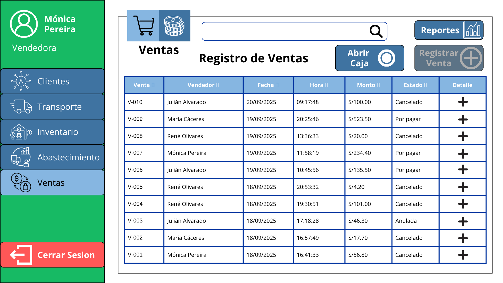

---

## **Caso de Uso R-501: Registrar Venta al Contado**

| ID | R-501 |
|----|-------|
| **Actor(es)** | Vendedor |
| **Objetivo** | Registrar una venta pagada en el momento. |
| **Disparador o evento inicial** | El cliente solicita comprar productos y pagar al contado. |
| **Precondiciones** | 1. Cliente identificado (o venta rápida).   2. Productos existentes y disponibles. |
| **Flujo Principal** | 1. El vendedor abre una nueva venta.   2. Selecciona productos y descuentos disponibles.   3. Registra tipo de pago al contado.   4. Programa despacho de ser necesario.   5. Emite comprobante y cierra la venta. |
| **Postcondiciones** | Venta registrada, comprobante emitido y stock actualizado. |
| **Excepciones** | 1. Cliente cancela la compra.   2. Producto no disponible. |

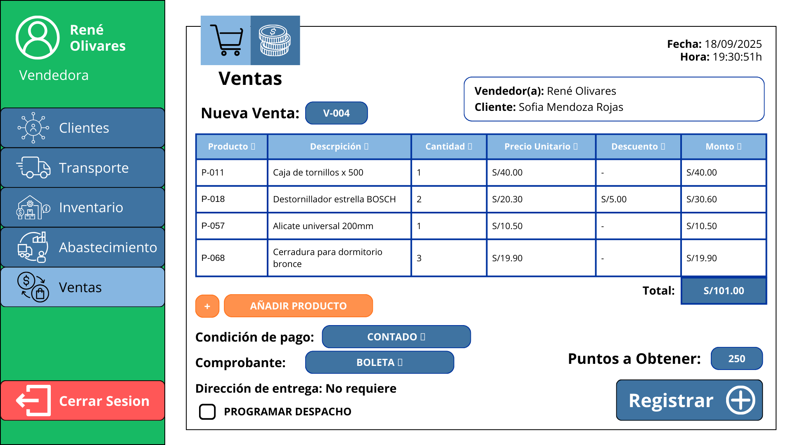

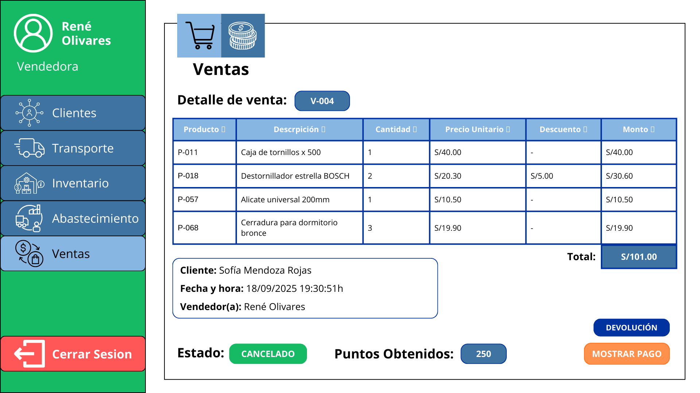

---

## **Caso de Uso R-502: Registrar Venta a Crédito**

| ID | R-502 |
|----|-------|
| **Actor(es)** | Vendedor |
| **Objetivo** | Registrar una venta con pago en cuotas. |
| **Disparador o evento inicial** | El cliente solicita pagar a crédito. |
| **Precondiciones** | 1. Cliente identificado sin deudas pendientes.   2. Productos existentes y disponibles. |
| **Flujo Principal** | 1. El vendedor abre una nueva venta.   2. Selecciona productos y descuentos disponibles.   3. Registra tipo de pago a crédito.   4. Programa despacho de ser necesario.   5. Genera cronograma de pagos y emite primer comprobante. |
| **Postcondiciones** | Venta registrada con cronograma de pagos y comprobante emitido. |
| **Excepciones** | 1. Cliente con deudas pendientes.   2. Producto no disponible. |

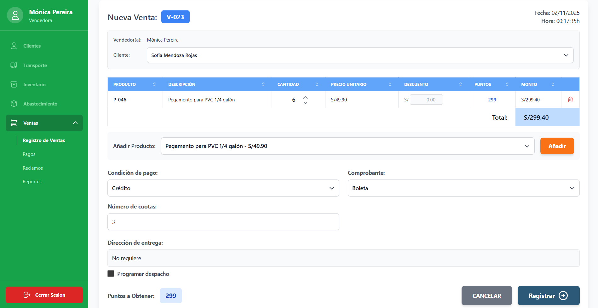

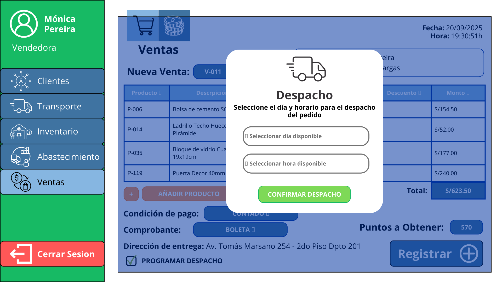

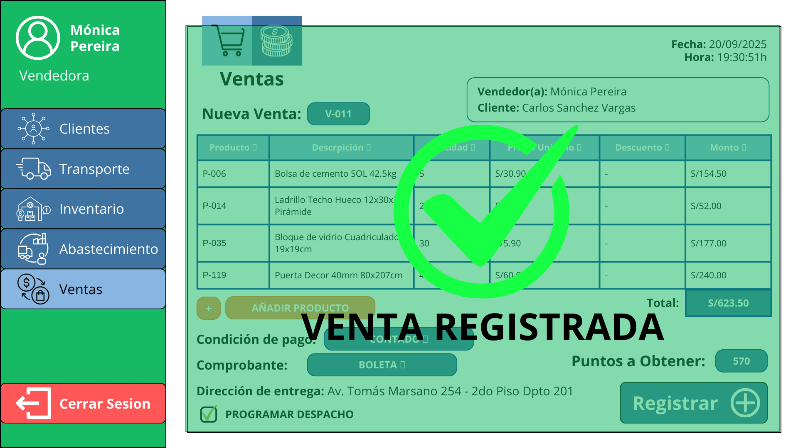

---

## **Caso de Uso R-503: Registrar Pago**

| ID | R-503 |
|----|-------|
| **Actor(es)** | Vendedor |
| **Objetivo** | Permitir registrar pagos de ventas al contado o abonos de ventas a crédito. |
| **Disparador o evento inicial** | El cliente realiza un pago (total o parcial). |
| **Precondiciones** | 1. Venta existente.   2. Caja abierta. |
| **Flujo Principal** | 1. El vendedor busca la venta.   2. Selecciona “Mostrar Cronograma de Pagos”.   3. Indica método y monto.   4. Guarda y actualiza el saldo. |
| **Postcondiciones** | Pago registrado y saldo actualizado en el sistema. |
| **Excepciones** | 1. Pago excede el saldo pendiente.   2. Caja cerrada. |

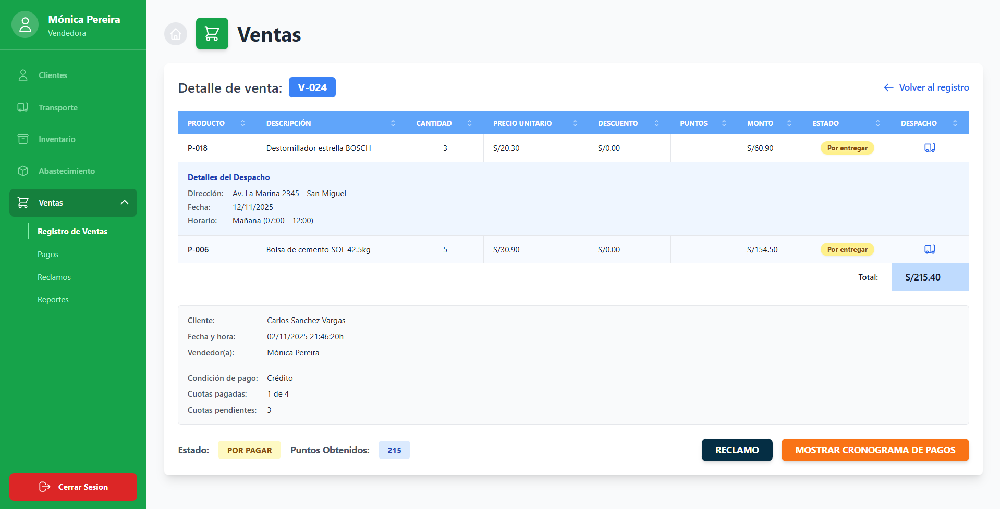

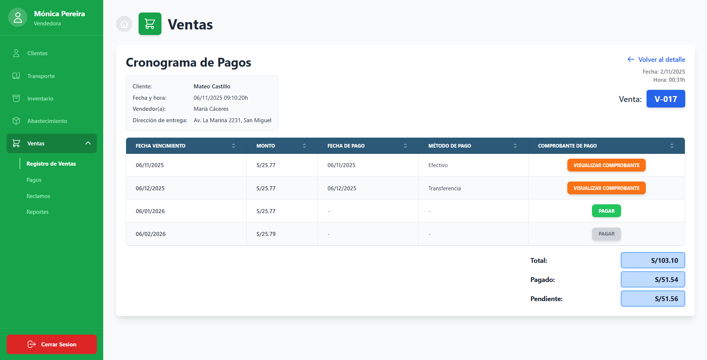

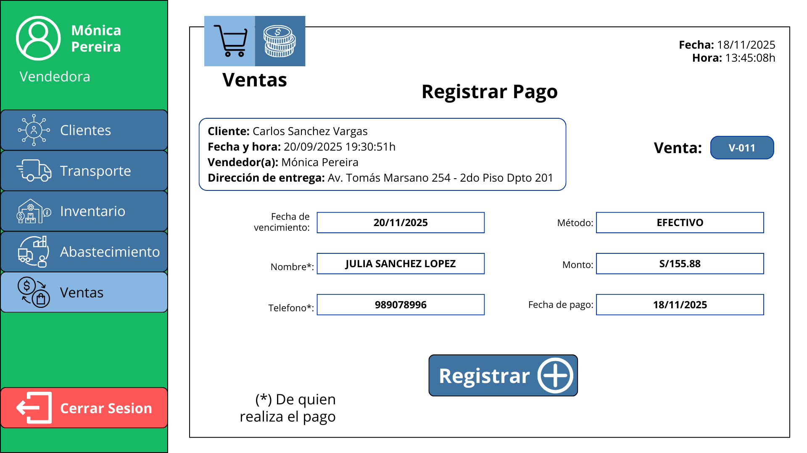

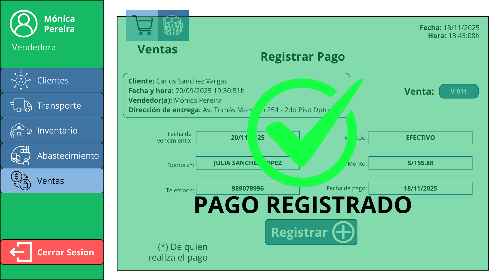

---

## **Caso de Uso R-504: Devolución de producto**

| ID | R-504 |
|----|-------|
| **Actor(es)** | Vendedor |
| **Objetivo** | Registrar la devolución de productos y emitir la nota de crédito correspondiente. |
| **Disparador o evento inicial** | El cliente solicita devolución de productos. |
| **Precondiciones** | 1. Existe una venta previa.   2. El producto está en condiciones aceptadas por la tienda. |
| **Flujo Principal** | 1. El vendedor abre “Devolución”.   2. Selecciona productos a devolver.   3. El sistema calcula el monto y genera nota de crédito.   4. Reingresa stock si aplica.   5. Cierra la devolución. |
| **Postcondiciones** | Nota de crédito emitida y stock actualizado. |
| **Excepciones** | 1. Producto no cumple condiciones de devolución.   2. Venta original no encontrada. |

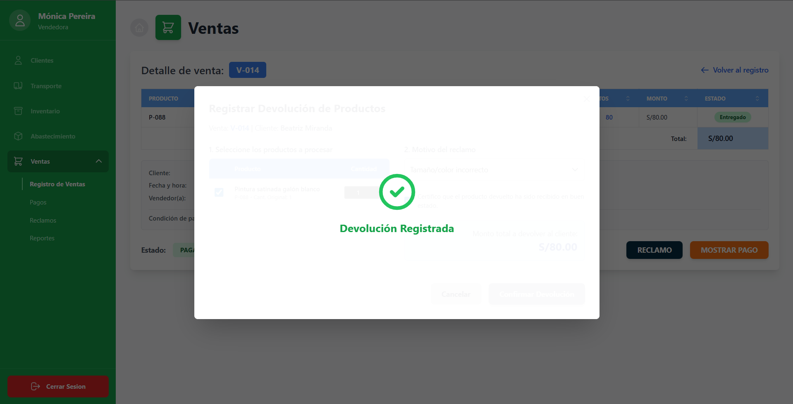

### **En caso ya se haya devuelto el producto seleccionado:**

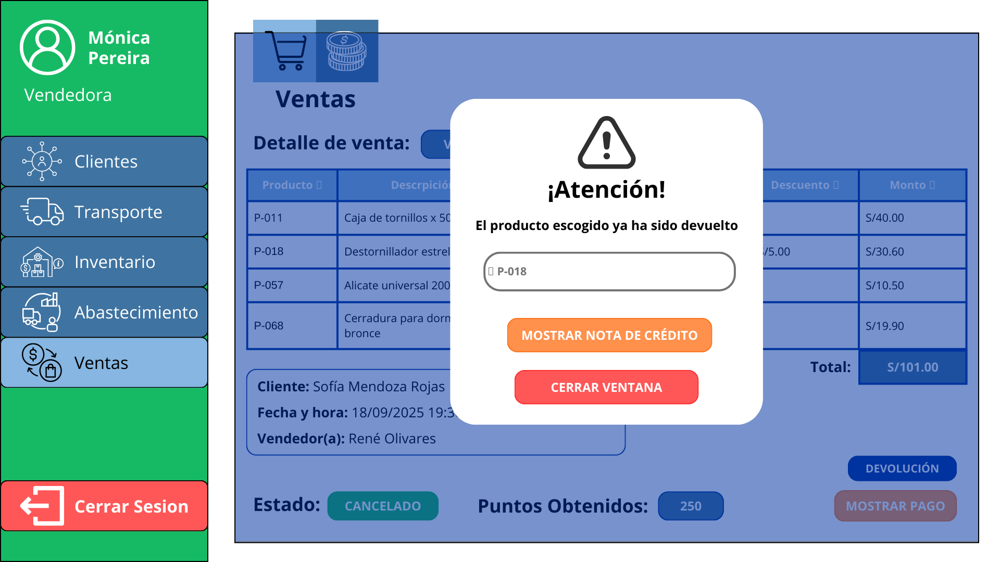

---

## **Caso de Uso R-505: Anular Venta**

| ID | R-505 |
|----|-------|
| **Actor(es)** | Administrador |
| **Objetivo** | Permitir anular una venta bajo condiciones definidas y revertir sus efectos. |
| **Disparador o evento inicial** | Solicitud de anulación por error o política. |
| **Precondiciones** | 1. Venta en el mismo día o según política.   2. Comprobante no enviado a SUNAT o con proceso de baja permitido. |
| **Flujo Principal** | 1. El administrador busca la venta.   2. Revisa motivo y confirma anulación.   3. Revierte stock y marca comprobante como anulado o dado de baja. |
| **Postcondiciones** | Venta anulada, comprobante marcado como inválido y stock revertido. |
| **Excepciones** | 1. Venta fuera del plazo de anulación.   2. Comprobante ya validado por SUNAT. |

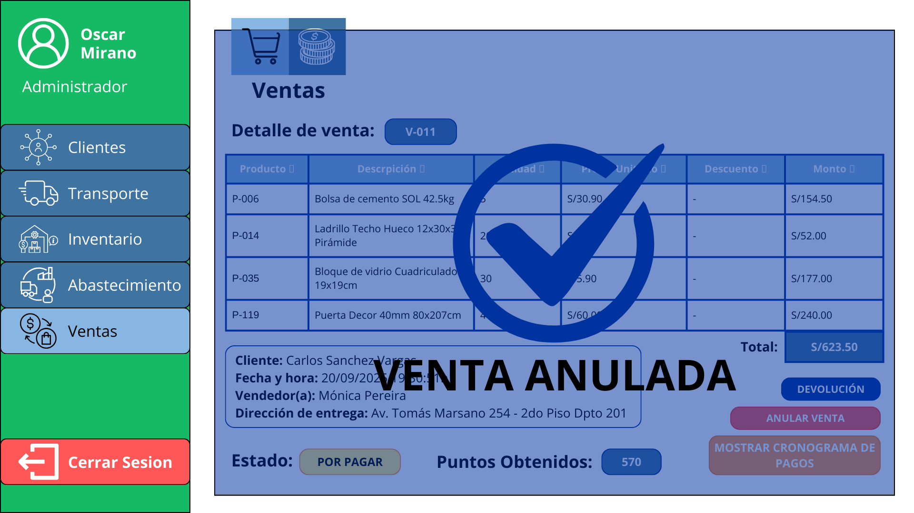

---

## **Caso de Uso R-506: Apertura/Cierre de Caja Diario**

| ID | R-506 |
|----|-------|
| **Actor(es)** | Vendedor |
| **Objetivo** | Resumir ventas y pagos del día para cuadrar el dinero de caja. |
| **Disparador o evento inicial** | Fin de jornada o turno del cajero. |
| **Precondiciones** | 1. Caja abierta con movimientos. |
| **Flujo Principal** | 1. El cajero selecciona “Cerrar Caja” o “Abrir Caja”.   En caso de cierre:   2. El sistema suma ventas por medio de pago.   3. Se ingresan montos físicos contados.   4. Se muestra diferencia y se confirma el cierre. |
| **Postcondiciones** | Caja cerrada con registro de diferencias y totales de ventas. |
| **Excepciones** | 1. Montos físicos no coinciden con lo esperado.   2. Caja ya cerrada. |

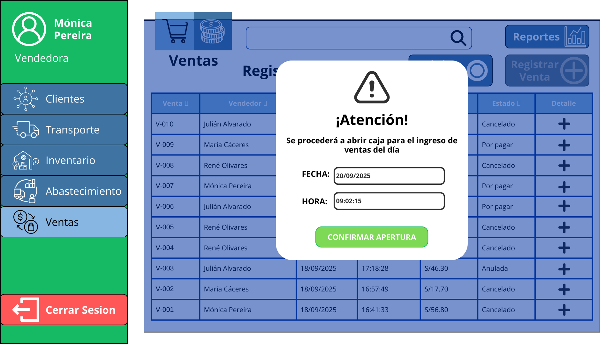

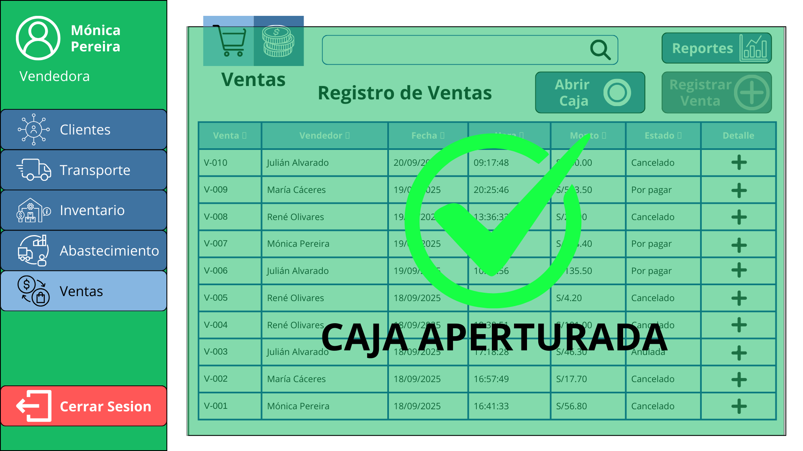

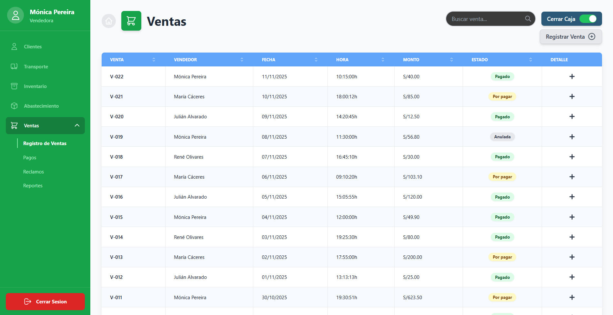

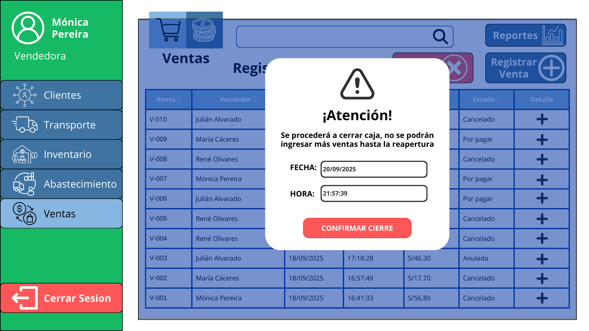

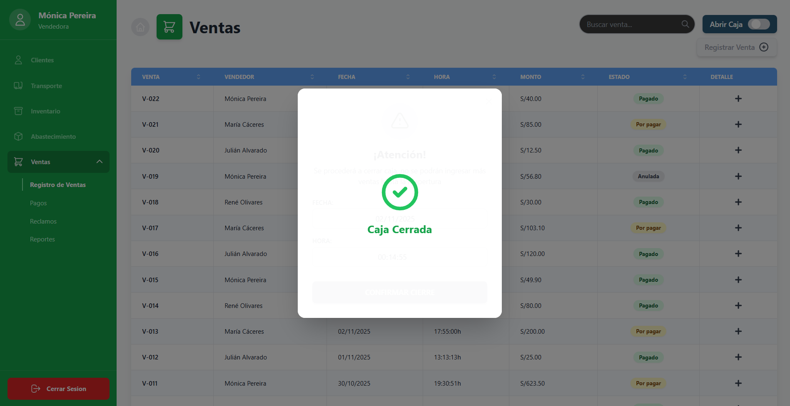

---

## **Caso de Uso R-507: Consultar Reporte de Ventas**

| ID | R-507 |
|----|-------|
| **Actor(es)** | Vendedor |
| **Objetivo** | Resumir los datos más importantes de ventas en un periodo determinado. |
| **Disparador o evento inicial** | El administrador solicita reporte de ventas. |
| **Precondiciones** | 1. Ventas registradas en el periodo escogido. |
| **Flujo Principal** | 1. El vendedor selecciona “Reportes” en el panel principal.   2. Elige el periodo entre dos meses.   3. Observa los datos. |
| **Postcondiciones** | Reporte generado y mostrado al usuario. |
| **Excepciones** | 1. No existen ventas en el periodo. |

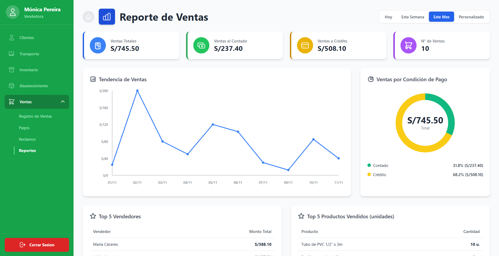

---

[⬅️ Anterior](../3.4/3.4.md) | [🏠 Home](../../README.md) | [Siguiente ➡️](../../4/4.md)
