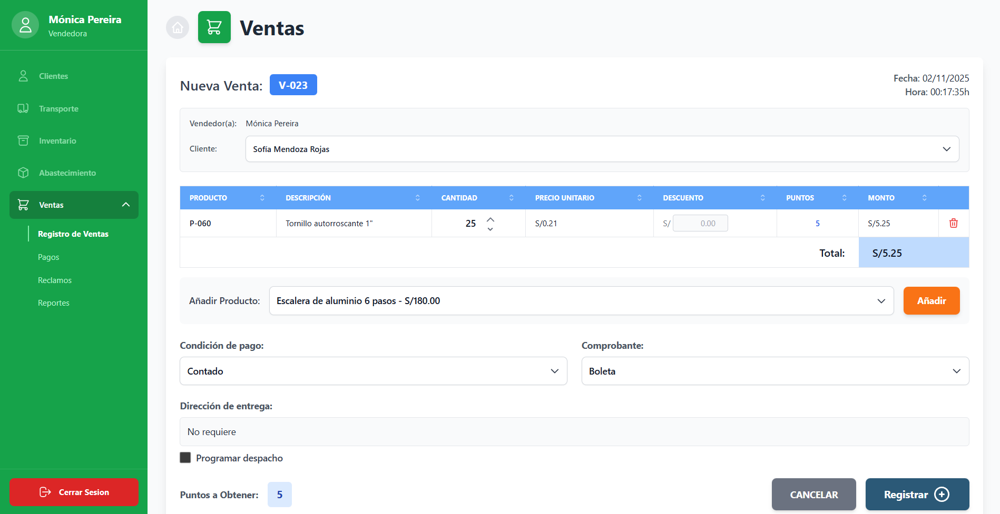
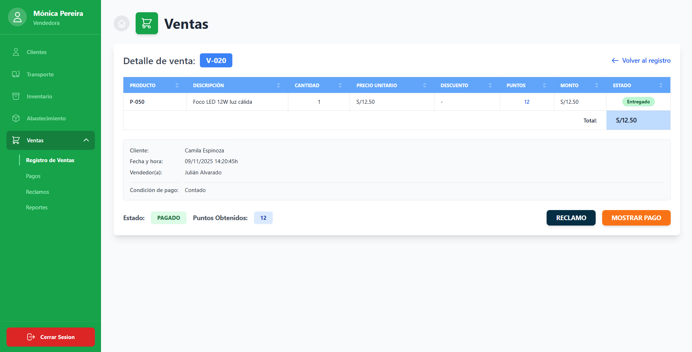
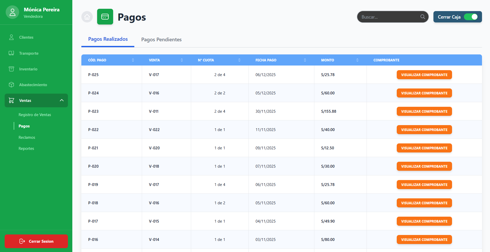
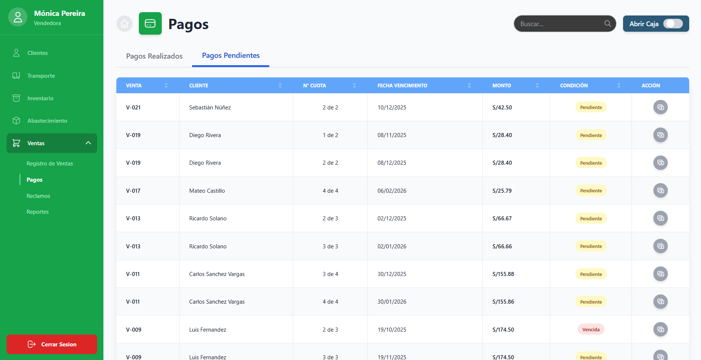
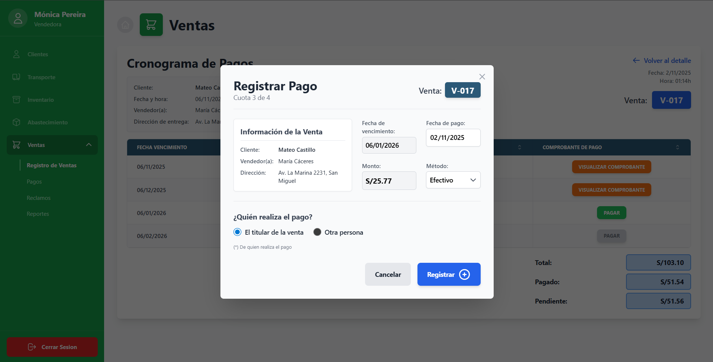
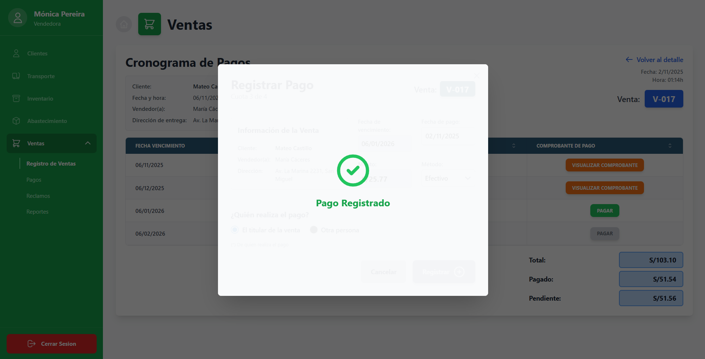
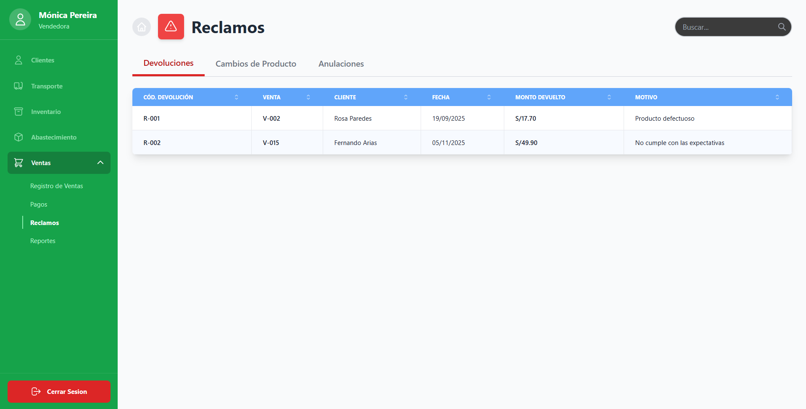
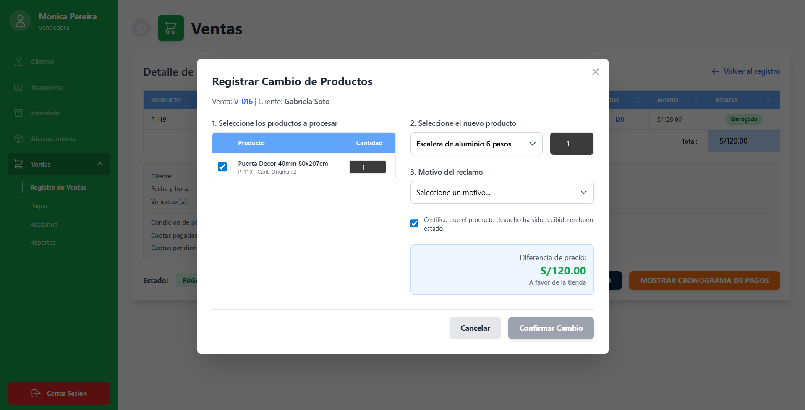
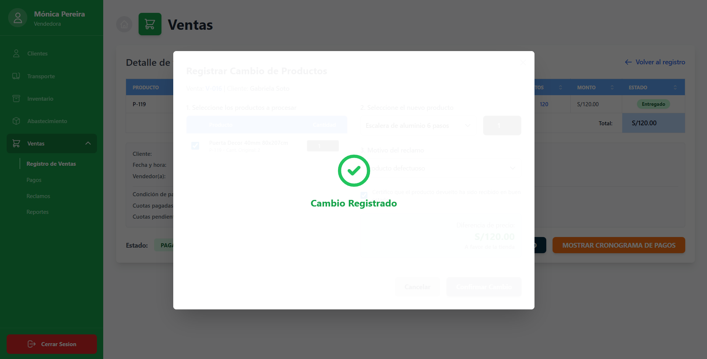
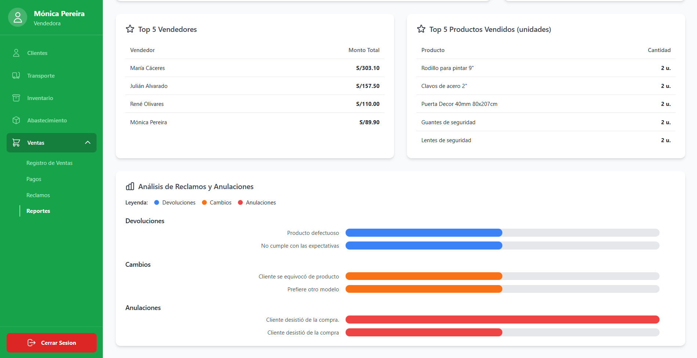

# 3.5. Módulo 5: Ventas

### **Descripcion:** 

El módulo de Ventas se encarga de gestionar el proceso de cierre del acuerdo de adquisición de un producto dentro de la ferretería, registrando transacciones, acuerdos y generando comprobantes de pago y reportes de venta. Su propósito principal es automatizar, controlar y registrar las ventas y pagos.

---

| Requerimiento | Nombre |
|---------------|--------|
| R-501 | Visualizar Ventas |
| R-502 | Registrar Venta al Contado |
| R-503 | Registrar Venta a Crédito |
| R-504 | Visualizar Pagos |
| R-505 | Registrar Pago |
| R-506 | Visualizar Reclamos |
| R-507 | Registrar Devolución de Producto |
| R-508 | Registrar Cambio de Producto |
| R-509 | Registrar Anulación de Venta |
| R-510 | Apertura/Cierre de Caja Diario |
| R-511 | Visualización de Reportes |

---

## **Caso de Uso R-501: Visualizar Ventas**

| ID | R-501 |
|----|-------|
| **Actor(es)** | Vendedor  |
| **Objetivo**  | Consultar las ventas registradas en el sistema. |
| **Disparador o evento inicial** | El vendedor desea revisar las ventas realizadas. |
| **Precondiciones** | 1. Existencia de ventas registradas. 2. Usuario autenticado en el sistema. |
| **Flujo Principal** | 1. El vendedor accede al módulo de ventas. 2. El sistema muestra la lista de ventas. 3. El vendedor puede visualizar detalles individuales de cada venta. |
| **Postcondiciones** | Información de ventas mostrada correctamente en pantalla. |
| **Excepciones** | 1. No existen ventas registradas. 2. Error en la conexión a la base de datos.  |

### Panel Principal - Registro de Ventas

---

## **Caso de Uso R-502: Registrar Venta al Contado**

| ID | R-502 |
|----|-------|
| **Actor(es)** | Vendedor |
| **Objetivo** | Registrar una venta pagada en el momento. |
| **Disparador o evento inicial** | El cliente solicita comprar productos y pagar al contado. |
| **Precondiciones** | 1. Cliente identificado (o venta rápida).   2. Productos existentes y disponibles. |
| **Flujo Principal** | 1. El vendedor abre una nueva venta.   2. Selecciona productos y descuentos disponibles.   3. Registra tipo de pago al contado.   4. Programa despacho de ser necesario.   5. Emite comprobante y cierra la venta. |
| **Postcondiciones** | Venta registrada, comprobante emitido y stock actualizado. |
| **Excepciones** | 1. Cliente paga lo acordado por la compra.   2. Producto no disponible. |

---

## **Caso de Uso R-503: Registrar Venta a Crédito**

| ID | R-503 |
|----|-------|
| **Actor(es)** | Vendedor |
| **Objetivo** | Registrar una venta con pago en cuotas. |
| **Disparador o evento inicial** | El cliente solicita pagar a crédito. |
| **Precondiciones** | 1. Cliente identificado sin deudas pendientes.   2. Productos existentes y disponibles o para solicitar a proveedor. |
| **Flujo Principal** | 1. El vendedor abre una nueva venta.   2. Selecciona productos y descuentos disponibles.   3. Registra tipo de pago a crédito.   4. Programa despacho de ser necesario.   5. Genera cronograma de pagos y emite primer comprobante. |
| **Postcondiciones** | Venta registrada con cronograma de pagos y comprobante emitido. |
| **Excepciones** | 1. Cliente con deudas pendientes.   2. Producto no disponible. |

---

## **Caso de Uso R-504: Visualizar Pagos**

| ID | R-504 |
|----|-------|
| **Actor(es)** | Vendedor / Administrador  |
| **Objetivo** | Consultar los pagos registrados asociados a las ventas realizadas.  |
| **Disparador o evento inicial** | El usuario solicita revisar los pagos efectuados por los clientes. |
| **Precondiciones** | 1. Existencia de ventas y pagos registrados en el sistema. 2. Usuario autenticado con permisos para visualizar pagos. |
| **Flujo Principal** | 1. El usuario accede al módulo de pagos. 2. El sistema muestra la lista de pagos registrados. 3. El usuario puede visualizar el detalle de cada pago, su estado y método utilizado. |
| **Postcondiciones** | Pagos visualizados correctamente, con información actualizada.  |
| **Excepciones** | 1. No existen pagos registrados. 2. Error de conexión o permisos insuficientes. |

**Nota:** Cuando la caja está abierta, permite ingresar pagos, indicando el color verde en algunos de los botones de la columna "Acción"

**Nota:** Cuando la caja está cerrada, no permite ingresar pagos, indicando el color gris en todos los botones de la columna "Acción"

---

## **Caso de Uso R-505: Registrar Pago**

| ID | R-505 |
|----|-------|
| **Actor(es)** | Vendedor |
| **Objetivo** | Permitir registrar pagos de ventas al contado o abonos de ventas a crédito. |
| **Disparador o evento inicial** | El cliente realiza un pago (total o parcial). |
| **Precondiciones** | 1. Venta existente.   2. Caja abierta. |
| **Flujo Principal** | 1. El vendedor busca la venta.   2. Selecciona “Mostrar Cronograma de Pagos”.   3. Indica método y monto.   4. Guarda y actualiza el saldo. |
| **Postcondiciones** | Pago registrado y saldo actualizado en el sistema. |
| **Excepciones** | 1. Pago excede el saldo pendiente.   2. Caja cerrada. |

**Nota:** Aparece la misma pantalla cuando se intenta registrar un pago desde la ventana de "Pagos"

---

## **Caso de Uso R-506: Visualización de Reclamos**

| ID | R-506 |
|----|-------|
| **Actor(es)** | Vendedor / Administrador |
| **Objetivo** | Consultar los reclamos registrados por los clientes. |
| **Disparador o evento inicial** | El usuario solicita revisar reclamos existentes. |
| **Precondiciones** | 1. Existencia de reclamos en el sistema. 2. Usuario autenticado con permisos adecuados. |
| **Flujo Principal** | 1. El usuario accede al módulo de reclamos. 2. El sistema muestra los reclamos existentes. 3. El usuario visualiza los detalles del reclamo. |
| **Postcondiciones** | Reclamos visualizados exitosamente. |
| **Excepciones** | 1. No existen reclamos registrados. 2. Error en la conexión o permisos insuficientes. |

---

## **Caso de Uso R-507: Registrar Devolución de Producto**

| ID | R-507 |
|----|-------|
| **Actor(es)** | Vendedor |
| **Objetivo** | Registrar la devolución de un producto asociado a una venta. |
| **Disparador o evento inicial** | El cliente solicita devolver un producto adquirido. |
| **Precondiciones** | 1. Venta registrada previamente. 2. Producto elegible para devolución. 3. Reclamo asociado (si aplica). |
| **Flujo Principal** | 1. El vendedor localiza la venta correspondiente. 2. Selecciona el producto a devolver. 3. Registra el motivo de devolución. 4. El sistema actualiza el stock y genera comprobante de devolución. |
| **Postcondiciones** | Devolución registrada, stock actualizado y comprobante emitido. |
| **Excepciones** | 1. Producto fuera del plazo de devolución. 2. Venta no encontrada. 3. Error al actualizar el stock. |

### **En caso ya se haya devuelto el producto seleccionado:**

---

## **Caso de Uso R-508: Registrar Cambio de Producto**

| ID | R-508 |
|----|-------|
| **Actor(es)** | Vendedor |
| **Objetivo** | Registrar el cambio de un producto por otro dentro de una venta previa. |
| **Disparador o evento inicial** | El cliente solicita cambiar un producto adquirido. |
| **Precondiciones** | 1. Venta y producto registrados. 2. Producto nuevo disponible en stock. 3. Motivo de cambio identificado. |
| **Flujo Principal** | 1. El vendedor busca la venta y producto original. 2. Registra el motivo del cambio. 3. Selecciona el nuevo producto a entregar. 4. El sistema actualiza la información y emite comprobante. |
| **Postcondiciones** | Cambio registrado, stock ajustado y comprobante actualizado. |
| **Excepciones** | 1. Producto nuevo sin disponibilidad. 2. Venta no válida o fuera del plazo permitido. |

---

## **Caso de Uso R-509: Registrar Anulación de Venta**

| ID | R-505 |
|----|-------|
| **Actor(es)** | Vendedor |
| **Objetivo** | Permitir anular una venta bajo condiciones definidas y revertir sus efectos. |
| **Disparador o evento inicial** | Solicitud de anulación por error o política. |
| **Precondiciones** | 1. Venta en el mismo día o según política.   2. Comprobante no enviado a SUNAT o con proceso de baja permitido. |
| **Flujo Principal** | 1. El vendedor busca la venta.   2. Revisa motivo y confirma anulación.   3. Revierte stock y marca comprobante como anulado o dado de baja. |
| **Postcondiciones** | Venta anulada, comprobante marcado como inválido y stock revertido. |
| **Excepciones** | 1. Venta fuera del plazo de anulación.   2. Comprobante ya validado por SUNAT. |

---

## **Caso de Uso R-510: Apertura/Cierre de Caja Diario**

| ID | R-506 |
|----|-------|
| **Actor(es)** | Vendedor |
| **Objetivo** | Resumir ventas y pagos del día para cuadrar el dinero de caja. |
| **Disparador o evento inicial** | Fin de jornada o turno del cajero. |
| **Precondiciones** | 1. Caja abierta con movimientos. |
| **Flujo Principal** | 1. El cajero selecciona “Cerrar Caja” o “Abrir Caja”.   En caso de cierre:   2. El sistema suma ventas por medio de pago.   3. Se ingresan montos físicos contados.   4. Se muestra diferencia y se confirma el cierre. |
| **Postcondiciones** | Caja cerrada con registro de diferencias y totales de ventas. |
| **Excepciones** | 1. Montos físicos no coinciden con lo esperado.   2. Caja ya cerrada. |

---

## **Caso de Uso R-511: Visualización de Reportes**

| ID | R-511 |
|----|-------|
| **Actor(es)** | Administrador / Vendedor |
| **Objetivo** | Generar y visualizar reportes de ventas, pagos y reclamos. |
| **Disparador o evento inicial** | El usuario solicita generar un reporte. |
| **Precondiciones** | 1. Existencia de datos registrados (ventas, pagos, reclamos). 2. Usuario autenticado con permisos de acceso a reportes. |
| **Flujo Principal** | 1. El usuario accede al módulo de reportes. 2. Selecciona periodo de los datos. 3. El sistema genera y muestra el reporte. |
| **Postcondiciones** | Reporte generado correctamente. |
| **Excepciones** | 1. No hay datos para generar el reporte. 2. Error en la generación o formato del reporte. |

---

[⬅️ Anterior](../3.4/3.4.md) | [🏠 Home](../../README.md) | [Siguiente ➡️](../../4/4.md)
