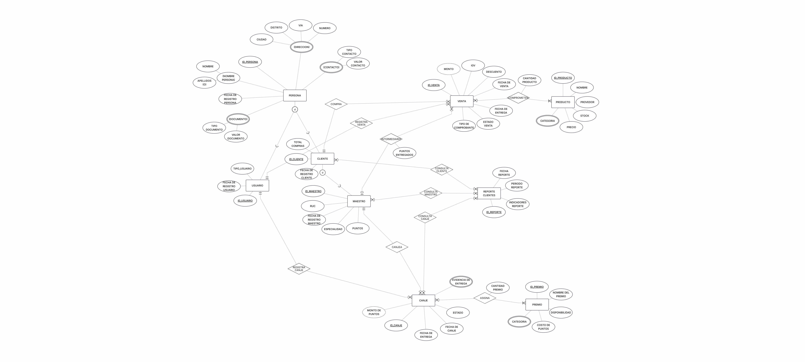

 
[**🔙 Atrás**](../4/4.md) | [**📜 Índice**](../../README.md)

# 4.1.Diseño Conceptual: Modulo de Clientes
## 💡 Modelo Conceptual: Modulo de Clientes   

## 📘 Diccionario de Datos: Modulo de Clientes   
### 🧾 Entidad:  `PERSONA `

**Descripción:** Representa a una persona en el modelo de datos, la cual es la entidad central de la base de datos de la ferretería. 
**Propósito:** Almacenar la información general y personal de cada individuo para su posterior especialización en otros roles como Cliente o Vendedor. 
**Reglas de negocio relevantes:**
* Toda persona debe tener un identificador único.
* Toda persona debe tener al menos un nombre.
* El valor del documento debe ser único para un tipo de documento dado (por ejemplo, solo un DNI 123456).

| Atributo| Descripción| Propósito| Dominio de valores| Obligatoriedad| Unicidad| Multivaluado| Ejemplos|
|---------|------------|----------|-------------------|---------------|---------|-------------|---------|
|ID_PERSONA|Identificador único de la persona.|Sirve como clave primaria para esta entidad.|Texto (UUID)|✅|✅|❌| 123e4567-e89b-12d3-a456-426614174000 |
|(CONTACTO)|Agrupación de atributos relacionados con el contacto.|Relaciona los datos de contacto con la persona.|-|-|-|-| Correo ,  Teléfono ,  WhatsApp |
|TIPO CONTACTO|El tipo de medio de contacto.|Permite clasificar los métodos de contacto.|'Correo', 'Teléfono', 'WhatsApp'|✅|❌|✅| Teléfono |
|VALOR CONTACTO|El dato del medio de contacto.|Almacena el valor del contacto.|Texto|✅|❌|✅| 987654321 |
|(DIRECCION)|Agrupación de atributos relacionados con la dirección.|Relaciona los datos de dirección con la persona.|-|-|-|-| Lima ,  San Isidro |
|CIUDAD|Nombre de la ciudad de la dirección.|Ubicación geográfica general.|Texto|✅|❌|✅| Lima |
|DISTRITO|Nombre del distrito de la dirección.|Ubicación geográfica específica.|Texto|✅|❌|✅| San Isidro |
|VIA|Nombre de la calle o avenida.|Permite localizar la propiedad.|Texto|✅|❌|✅| Av. Los Olivos |
|NUMERO|Número de la propiedad o lote.|Permite localizar el inmueble.|Texto|✅|❌|✅| 123 |
|(NOMBRE PERSONA)|Agrupación de atributos de nombres.|Almacena el nombre de la persona.|-|-|-|-| Juan ,  Pérez |
|NOMBRE|Primer nombre de la persona.|Identificador personal principal.|Texto|✅|❌|✅| Juan |
|APELLIDOS (O)|Apellidos de la persona.|Identificador personal secundario.|Texto|❌|❌|✅| Pérez García |
|FECHA DE REGISTRO PERSONA|Fecha en que la persona fue registrada en el sistema.|Permite saber la antigüedad de la persona.|Fecha y Hora|✅|❌|❌| 2025-09-22 10:00:00 |
|(DOCUMENTO)|Agrupación de atributos de documentos.|Almacena los documentos de identidad de la persona.|-|-|-|-| DNI ,  Carné de Extranjería |
|TIPO DOCUMENTO|El tipo de documento de identificación.|Clasifica el documento para su validación.|'DNI', 'RUC', 'Carné de Extranjería'|✅|✅|✅| DNI |
|VALOR DOCUMENTO|El número o código del documento.|Almacena el identificador único del documento.|Texto|✅|✅|✅| 12345678 |

### 🧾 Entidad: ` CLIENTE `

**Descripción:** Representa a una persona en su rol de comprador o consumidor de los productos y servicios de la ferretería. 
**Propósito:** Almacenar datos específicos de las personas que realizan transacciones, permitiendo el seguimiento de su comportamiento de compra y la implementación de programas de fidelización. 
**Reglas de negocio relevantes:**
* Un cliente debe ser una persona registrada en el sistema.
* El registro de un cliente debe incluir la fecha en que se registró por primera vez como comprador.
* El total de compras es un valor que debe ser mayor o igual a cero.

| Atributo| Descripción| Propósito| Dominio de valores| Obligatoriedad| Unicidad| Multivaluado| Ejemplos|
|---------|------------|----------|-------------------|---------------|---------|-------------|---------|
|ID_CLIENTE|Identificador único del cliente.|Sirve como clave primaria para esta entidad.|Texto (UUID)|✅|✅|❌| 123e4567-e89b-12d3-a456-426614174000 |
|FECHA DE REGISTRO CLIENTE|Fecha en que la persona fue registrada por primera vez como cliente.|Permite medir la antigüedad y lealtad del cliente.|Fecha y Hora|✅|❌|❌| 2025-09-22 10:30:00 |
|TOTAL COMPRAS|El monto total acumulado de las compras del cliente.|Proporciona un resumen de la actividad de compra para fines de análisis.|Número Decimal|✅|❌|❌| 1500.50 |

### 🧾 Entidad: ` MAESTRO `

**Descripción:** Representa a un cliente en su rol de maestro de obra. 
**Propósito:** Almacenar los datos específicos de los maestros para el programa de fidelidad y la acumulación de puntos por sus compras o por actuar como intermediarios. 
**Reglas de negocio relevantes:**
* Un maestro debe ser un cliente registrado, por lo que es un subtipo de la entidad  CLIENTE .
* El ID de maestro es el mismo que el ID de cliente, lo que modela la relación de herencia.
* El RUC, aunque opcional, debe ser único si se proporciona.
* Los puntos acumulados deben ser un valor numérico.

| Atributo| Descripción| Propósito| Dominio de valores| Obligatoriedad| Unicidad| Multivaluado| Ejemplos|
|---------|------------|----------|-------------------|---------------|---------|-------------|---------|
|ID_MAESTRO|Identificador único del maestro.|Sirve como clave primaria para esta entidad.|Texto (UUID)|✅|✅|❌| 123e4567-e89b-12d3-a456-426614174000 |
|RUC|El número de Registro Único de Contribuyentes.|Identificación fiscal para la facturación.|Texto|❌|✅|❌| 10123456789 |
|FECHA DE REGISTRO MAESTRO|La fecha en que se registró por primera vez como maestro.|Permite medir la antigüedad y antigüedad del maestro.|Fecha y Hora|✅|❌|❌| 2025-09-22 11:00:00 |
|ESPECIALIDAD|La especialidad u oficio del maestro.|Permite categorizar al maestro para campañas de marketing especializadas.|Texto|✅|❌|✅| Albañilería ,  Gasfitería |
|PUNTOS|El saldo actual de puntos del maestro.|Permite gestionar el programa de recompensas.|Número Entero|✅|❌|❌| 500 |

### 🧾 Entidad: ` USUARIO `

**Descripción:** Representa a una persona que tiene acceso al sistema con credenciales de autenticación. 
**Propósito:** Gestionar el acceso y los permisos de los empleados y clientes al sistema para realizar tareas específicas como registrar ventas, canjear premios o ver reportes. 
**Reglas de negocio relevantes:**
* Un usuario debe ser una persona registrada en el sistema.
* La fecha de registro es obligatoria y se debe registrar automáticamente.
* Un usuario debe tener un rol o tipo que defina sus permisos de acceso.

| Atributo| Descripción| Propósito| Dominio de valores| Obligatoriedad| Unicidad| Multivaluado| Ejemplos|
|---------|------------|----------|-------------------|---------------|---------|-------------|---------|
|ID_USUARIO|Identificador único del usuario.|Sirve como clave primaria para esta entidad.|Texto (UUID)|✅|✅|❌| 123e4567-e89b-12d3-a456-426614174000 |
|TIPO_USUARIO|El rol o tipo de usuario en el sistema.|Define los permisos de acceso y las funcionalidades que puede utilizar.|Texto|✅|❌|❌| Administrador ,  Vendedor ,  Maestro |
|FECHA DE REGISTRO USUARIO|La fecha en que el usuario fue registrado en el sistema.|Permite hacer un seguimiento de la creación de la cuenta.|Fecha y Hora|✅|❌|❌| 2025-09-22 14:00:00 |

### 🧾 Entidad: ` PRODUCTO `

**Descripción:** Representación digital de cada uno de los bienes tangibles que la ferretería tiene para la venta.
**Propósito:** Gestionar el inventario, registrar las ventas y facilitar la búsqueda de productos por parte de los clientes y el personal.
**Reglas de negocio relevantes:**
- Todo producto debe tener un código de identificación único.
- La cantidad en stock de un producto no puede ser negativa.
- Un producto debe estar asociado a una categoría y un proveedor.

| Atributo| Descripción| Propósito| Dominio de valores| Obligatoriedad| Unicidad| Multivaluado| Ejemplos|
|---------|------------|----------|-------------------|---------------|---------|-------------|---------|
|ID_PRODUCTO|Permite la identificacion unica e inequivoca de un producto.|Permite el modelado de relaciones e interacciones de manera robusta.|Texto (UUID)|✅|✅|❌|f81d4fae-7dec-11d0-a765-00a0c91e6bf6|
|NOMBRE|Nombre del producto.|Permite identificar el producto para el inventario, ventas y la búsqueda del cliente.|Texto|✅|❌|❌|"Martillo de uña", "Caja de tornillos"|
|CATEGORIA|Clasificación del producto.|Organiza el inventario para una mejor gestión y búsqueda.|Texto|✅|❌|✅|"Herramientas manuales", "Pinturas", "Eléctricos"|
|PROVEDOR|El proveedor o fabricante del producto.|Identifica el origen del producto para fines de compra y gestión.|Texto|✅|❌|❌|"Stanley", "Bosch", "Truper"|
|STOCK|Número de unidades en stock.|Monitorear la disponibilidad de productos para la venta.|Número entero|✅|❌|❌|150, 25|
|PRECIO|El precio de venta al público.|Determina el costo para el cliente en las transacciones de venta.|Número decimal|✅|❌|❌|25.50, 120.00|

### 🧾 Entidad:`  PREMIO `

**Descripción:** Representación de un artículo o servicio que los maestros pueden obtener a través de un programa de PROGRESOL, utilizando puntos acumulados en lugar de dinero. 
**Propósito:** Gestionar los premios disponibles para el programa de canje, facilitando el registro y la entrega. 
**Reglas de negocio relevantes:**
- Un premio debe tener un identificador único.
- La disponibilidad de un premio es gestionada por un proveedor externo (Progresol).
- El canje de un premio requiere que el cliente tenga la cantidad de puntos exacta o superior a la requerida.

| Atributo| Descripción| Propósito| Dominio de valores| Obligatoriedad| Unicidad| Multivaluado| Ejemplos|
|---------|------------|----------|-------------------|---------------|---------|-------------|---------|
|ID_PREMIO| Permite la identificacion unica e inequivoca de un premio. | Permite el modelado de relaciones e interacciones de manera robusta. |Texto | ✅ |✅| ❌ | f81d4fae-7dec-11d0-a765-00a0c91e6bf7 |
|NOMBRE DEL PREMIO|El nombre con el que se identifica el premio.|Permite a los clientes y al personal reconocer fácilmente el artículo.|Texto|✅|❌|❌|"Set de herramientas", "Kit de seguridad"|
|CATEGORIA|La clasificación del premio según su tipo.|Organiza los premios para una mejor visualización y búsqueda.|Texto (Enum)|✅|❌|✅|"Herramientas", "Electrónicos", "Servicios"|
|DISPONIBILIDAD|El estado de la existencia del premio.|Indica si el premio está disponible para canje en tiempo real.|Texto (Enum)|✅|❌|❌|"Disponible", "No disponible"|
|COSTO DE PUNTOS|La cantidad de puntos necesaria para canjear el premio.|Define el valor del premio dentro del programa de fidelidad.|Número entero|✅|❌|❌|150, 250|

### 🧾 Entidad: ` CANJE `

**Descripción:** Representa una transacción en la que un cliente (maestro) utiliza sus puntos de fidelidad para obtener uno o varios premios. 
**Propósito:** Registrar y auditar el proceso de canje, desde la solicitud hasta la entrega del premio. 
**Reglas de negocio relevantes:**
- Un canje debe estar asociado a un único maestro.
- La cantidad de puntos gastados en un canje debe coincidir con el valor de los premios canjeados.
- Un canje tiene un ciclo de vida que va desde la solicitud hasta la entrega.

| Atributo| Descripción| Propósito| Dominio de valores| Obligatoriedad| Unicidad| Multivaluado| Ejemplos|
|---------|------------|----------|-------------------|---------------|---------|-------------|---------|
|ID_CANJE| Permite la identificacion unica e inequivoca de un canjeo. | Permite el modelado de relaciones e interacciones de manera robusta. |Texto | ✅ |✅| ❌ | f81d4fae-7dec-11d0-a765-00a0c91e6bf9 |
|MONTO DE PUNTOS|El total de puntos que el cliente gastó en el canje.|Actualizar el saldo de puntos del cliente.|Número entero|✅|❌|❌|500, 1500|
|FECHA DE CANJE|La fecha y hora en que se solicitó el canje.|Registrar el momento exacto de la transacción.|Fecha y hora|✅|❌|❌|2025-09-20 14:30|
|FECHA DE ENTREGA|La fecha en que el premio fue entregado al cliente.|Monitorear el tiempo de entrega y validar el cumplimiento.|Fecha |❌|❌|❌|2025-09-23|
|ESTADO|La etapa actual del proceso de canje.|Monitorear y gestionar el ciclo de vida del canje.|Texto (Enum)|✅|❌|❌|Pendiente, Entregado, Cancelado|
|EVIDENCIA DE ENTREGA|Un registro que prueba la entrega del premio al cliente.|Auditar el proceso de entrega y resolver disputas.|Texto (URL, firma digital) (Posibilidad: Imagenes)|❌|✅|❌|URL del recibo, ruta a la imagen de la firma|

### 🧾 Entidad:  `VENTA `

**Descripción:** Representación de una transacción comercial en la que un cliente adquiere uno o más productos de la ferretería. 
**Propósito:** Registrar y auditar las transacciones de compra, sirviendo como base para el análisis de ventas, el control de inventario y la emisión de comprobantes de pago. 
**Reglas de negocio relevantes:**
- Toda venta debe estar asociada a un cliente y, al menos, un producto.
- El monto de la venta se calcula a partir del precio y la cantidad de los productos comprados.
- El inventario de productos se reduce al momento de registrar una venta.

| Atributo| Descripción| Propósito| Dominio de valores| Obligatoriedad| Unicidad| Multivaluado| Ejemplos|
|---------|------------|----------|-------------------|---------------|---------|-------------|---------|
|ID_VENTA| Permite la identificacion unica e inequivoca de una venta. | Permite el modelado de relaciones e interacciones de manera robusta. |Texto | ✅ |✅| ❌ | f81d4fae-7dec-11d0-a765-00a0c91e6bf1 |
|MONTO|El valor total de la venta, incluyendo impuestos y descuentos.|Almacenar el valor económico de la transacción.|Número decimal|✅|❌|❌|150.50, 89.90|
|IGV|El Impuesto General a las Ventas aplicado.|Registrar el monto del impuesto para fines de contabilidad y fiscalización.|Número decimal|✅|❌|❌|0.18 (18%)|
|DESCUENTO|El valor total del descuento aplicado a la venta.|Permite un análisis preciso de los precios y márgenes de ganancia.|Número decimal|✅|❌|❌|15.00, 50.00|
|FECHA DE VENTA|La fecha y hora exacta en que se concretó la venta.|Registrar el momento preciso de la transacción.|Fecha y hora|✅|❌|❌|2025-09-20 10:45|
|FECHA DE ENTREGA|La fecha programada o real de la entrega de los productos.|Monitorear el estado de la entrega y cumplir con los plazos prometidos.|Fecha|❌|❌|❌|2025-09-22|
|TIPO DE COMPROBANTE|El tipo de documento fiscal emitido para la venta.|Cumplir con los requisitos legales y de auditoría.|Texto (Enum)|✅|❌|❌|Boleta, Factura|
|ESTADO VENTA|El estado actual del proceso de venta.|Proporcionar una visión general del ciclo de vida de la venta.|Texto (Enum)|✅|❌|❌|Pagado, Pendiente de pago, Cancelado|

### 🔁 Relacion:`  INTERMEDIARIO `

**Descripción:** Representa la relación en la que un maestro de construcción actúa como intermediario para una venta realizada en la ferretería. 
**Propósito:** Modelar y registrar las ventas que son influenciadas por un maestro para otorgarle beneficios y recompensas.  
**Reglas de negocio relevantes:** 
- Un maestro solo gana puntos si es el intermediario de una venta.
- La cantidad de puntos obtenidos por el maestro se calcula en función del monto total de la venta o de las reglas de negocio establecidas.
- Una venta solo puede tener un único intermediario.

| Entidad participante| Cardinalidad mínima| Cardinalidad máxima | Justificacion |
|---------------------|--------------------|---------------------|---------------|
|MAESTRO|0|Muchos|Un maestro puede ser intermediario en 0 o muchas ventas|
|VENTA|0|1|Una venta puede tener 0 o 1 intermediario|

| Atributo| Descripción| Propósito| Dominio de valores| Obligatoriedad| Unicidad| Multivaluado| Ejemplos|
|---------|------------|----------|-------------------|---------------|---------|-------------|---------|
|PUNTOS ENTREGADOS| Representa el numero de puntos que obtuvo el maestro como intermediario de la venta. | Permite la adicion de puntos a la entidad maestro por ser intermediario de la venta. |Número | ✅ | ❌ | ❌ | 25 |

### 🔁 Relacion:  `COMPRA `

**Descripción:** Representa la transacción comercial en la que un cliente adquiere productos de la ferretería. 
**Propósito:** Modelar la actividad de compra, vinculando a un cliente con una venta específica para el seguimiento de sus transacciones. 
**Reglas de negocio relevantes:**
- Toda venta debe estar asociada a un único cliente, lo que garantiza la trazabilidad.
- Un cliente puede no haber realizado compras (0), o haber realizado muchas compras (muchos).
- Una venta es un evento único y no puede estar asociada a más de un cliente.

| Entidad participante| Cardinalidad mínima| Cardinalidad máxima | Justificacion |
|---------------------|--------------------|---------------------|---------------|
|CLIENTE|0|Muchos|Un cliente puede realizar 0 o muchas compras|
|VENTA|1|1|Una compra es realizado por 1 cliente|

### 🔁 Relacion:` COMPROMETEN`

**Descripción:** Representa el vínculo entre los productos que se venden y la transacción de venta en sí. 
**Propósito:** Modelar el detalle de una venta, permitiendo saber qué productos específicos (y en qué cantidad) se incluyeron en una transacción dada. 
**Reglas de negocio relevantes:**
- Un producto debe existir para ser parte de una venta.
- El stock de un producto se reduce cada vez que es comprometido en una venta.
- Una venta no puede existir sin al menos un producto asociado.

| Entidad participante| Cardinalidad mínima| Cardinalidad máxima | Justificacion |
|---------------------|--------------------|---------------------|---------------|
|PRODUCTO|0|Muchos|Un producto puede no haber sido vendido (0) o haber sido vendido en muchas transacciones (Muchos).|
|VENTA|1|Muchos|Una venta debe tener al menos un producto (1) y puede tener muchos productos diferentes (Muchos).|

| Atributo| Descripción| Propósito| Dominio de valores| Obligatoriedad| Unicidad| Multivaluado| Ejemplos|
|---------|------------|----------|-------------------|---------------|---------|-------------|---------|
|CANTIDAD PRODUCTO|Número de unidades de un producto vendidas en una transacción particular.|Permite el cálculo del subtotal de la venta y la actualización del inventario.|Número entero|✅|❌|❌|3, 10|

### 🔁 Relacion:` CANJEA`

**Descripción:** Representa la relación entre un Maestro de obra y un Canje de puntos. 
**Propósito:** Modelar la acción de canjear puntos por premios, conectando la entidad que acumula puntos (Maestro) con la transacción de uso de esos puntos (Canje). 
**Reglas de negocio relevantes:**
- Un canje es una transacción única y debe estar asociada a un solo maestro.
- Para realizar un canje, el maestro debe tener una cantidad de puntos igual o superior a los puntos requeridos por el premio.
- Un maestro puede realizar múltiples canjes a lo largo del tiempo.

| Entidad participante| Cardinalidad mínima| Cardinalidad máxima | Jus  tificacion |
|---------------------|--------------------|---------------------|---------------|
|MAESTRO|0|Muchos|Un maestro puede no haber realizado ningún canje (0) o haber realizado muchos canjes a lo largo del tiempo (Muchos).|
|CANJE|1|1|Un canje debe ser realizado por un maestro (1) y solo por uno (1).|

### 🔁 Relacion: ` ASIGNA `

**Descripción:** Representa la relación en la que uno o más premios son asignados a una transacción de canje. 
**Propósito:** Modelar el detalle de una transacción de canje, permitiendo registrar qué premios específicos y en qué cantidad fueron entregados en un canje dado. 
**Reglas de negocio relevantes:**
- Un premio debe existir para ser parte de un canje.
- El stock de un premio se reduce al ser asignado a un canje.
- Una transacción de canje no puede existir sin al menos un premio asociado.

| Entidad participante| Cardinalidad mínima| Cardinalidad máxima | Justificacion |
|---------------------|--------------------|---------------------|---------------|
|PREMIO|0|Muchos|Un premio puede ser asignado a 0 o muchos canjes|
|CANJE|1|Muchos|Un canje compromete 1 o muchos premios|

| Atributo| Descripción| Propósito| Dominio de valores| Obligatoriedad| Unicidad| Multivaluado| Ejemplos|
|---------|------------|----------|-------------------|---------------|---------|-------------|---------|
|CANTIDAD PREMIO|La cantidad de unidades de un premio canjeadas en una transacción particular.|Permite el cálculo del costo total del canje y la actualización del inventario de premios.|Número entero|✅|❌|❌|1, 5|

### 🔁 Relacion: `SUBTIPO/ESPECIALIZACION (CLIENTE)`

**Descripción:** Representa la relación jerárquica donde la entidad "Cliente" es un tipo específico de la entidad "Persona". 
**Propósito:** Modelar la herencia de atributos y comportamientos, permitiendo que la entidad "Cliente" tenga todas las propiedades de un "Persona" más sus propias características especializadas. 
**Reglas de negocio relevantes:**
* Un cliente debe ser una persona registrada en el sistema.
* La relación es de uno a uno (1:1) o de uno a cero-o-uno (1:0-1), ya que una persona puede ser un cliente o no serlo.

| Entidad participante| Cardinalidad mínima| Cardinalidad máxima | Justificacion |
|---------------------|--------------------|---------------------|---------------|
|PERSONA|0|1|Una persona puede ser un cliente o no serlo. Si lo es, solo puede serlo una vez.|
|CLIENTE|1|1|Un cliente debe ser una persona, y no puede serlo más de una vez.|

### 🔁 Relacion:` SUBTIPO/ESPECIALIZACION (USUARIO)`

**Descripción:** Representa la relación jerárquica donde la entidad "Usuario" es un tipo específico de la entidad "Persona". 
**Propósito:** Modelar la herencia de atributos y comportamientos, permitiendo que la entidad "Usuario" tenga todas las propiedades de un "Persona" más sus propias características especializadas. 
**Reglas de negocio relevantes:**
* Un usuario debe ser una persona registrada en el sistema.
* La relación es de uno a uno (1:1) o de uno a cero-o-uno (1:0-1), ya que una persona puede ser un usuario del sistema o no.

| Entidad participante| Cardinalidad mínima| Cardinalidad máxima | Justificacion |
|---------------------|--------------------|---------------------|---------------|
|PERSONA|0|1|Una persona puede ser un usuario del sistema o no. Si lo es, solo puede serlo una vez.|
|USUARIO|1|1|Un usuario debe ser una persona, y no puede serlo más de una vez.|

### 🔁 Relacion: `SUBTIPO/ESPECIALIZACION (MAESTRO)`

**Descripción:** Representa la relación jerárquica donde la entidad "Maestro" es un tipo específico de la entidad "Cliente". 
**Propósito:** Modelar la herencia de atributos y comportamientos, permitiendo que la entidad "Maestro" tenga todas las propiedades de un "Cliente" más sus propias características especializadas. 
**Reglas de negocio relevantes:** 
- Un maestro es siempre un cliente.
- Un cliente puede no ser un maestro.
- Las reglas de negocio que aplican al "Cliente" también se aplican al "Maestro".

| Entidad participante| Cardinalidad mínima| Cardinalidad máxima | Justificacion |
|---------------------|--------------------|---------------------|---------------|
|CLIENTE|0|1|Un cliente puede ser o no ser un maestro|
|MAESTRO|1|1|Un maestro corresponde a 1 cliente|

### 🔁 Relacion: `REGISTRA CANJE`

**Descripción:** Representa el vínculo entre un USUARIO que realiza la acción de registrar un canje y la transacción de CANJE misma.
**Propósito:** Auditar qué usuario del sistema procesó una transacción de canje, lo que permite la trazabilidad y la responsabilidad de las operaciones.
**Reglas de negocio relevantes:**
* Un canje debe ser registrado por un usuario del sistema.
* Un usuario puede registrar múltiples canjes.

| Entidad participante| Cardinalidad mínima| Cardinalidad máxima | Justificacion |
|---------------------|--------------------|---------------------|---------------|
|USUARIO|0|Muchos|Un usuario puede no haber registrado ningún canje (0) o puede haber registrado muchos (Muchos) a lo largo del tiempo.|
|CANJE|1|1|Un canje debe ser registrado por un usuario (1) y solo por uno (1).|

### 🔁 Relacion: ` REGISTRA VENTA `

**Descripción:** Representa el vínculo entre un USUARIO del sistema y la transacción de VENTA que este registra.
**Propósito:** Auditar qué usuario procesó una venta, permitiendo la trazabilidad y la responsabilidad de las operaciones dentro del sistema.
**Reglas de negocio relevantes:**
* Toda venta debe ser registrada por un usuario.
* Un usuario puede registrar una o muchas ventas.

| Entidad participante| Cardinalidad mínima| Cardinalidad máxima | Justificacion |
|---------------------|--------------------|---------------------|---------------|
|USUARIO|0|Muchos|Un usuario puede no haber registrado ninguna venta aún (0) o haber registrado múltiples ventas a lo largo de su tiempo en el sistema (Muchos).|
|VENTA|1|1|Una venta debe ser registrada por un usuario (1) y no puede ser registrada por más de uno (1).|

### 🔁 Relacion: ` CONSULTA CANJE `

**Descripción:** Representa el vínculo entre un reporte y los canjes que este abarca.
**Propósito:** Modelar la relación de muchos a muchos (N:M) entre reportes y canjes, lo que permite auditar y analizar qué canjes fueron considerados en cada informe.
**Reglas de negocio relevantes:**
* Un canje puede ser incluido en múltiples reportes o en ninguno.
* Un reporte puede incluir uno o muchos canjes.

| Entidad participante| Cardinalidad mínima| Cardinalidad máxima | Justificacion |
|---------------------|--------------------|---------------------|---------------|
|REPORTE|0|Muchos|Un reporte puede no contener ningún canje (0) o contener muchos canjes (Muchos).|
|CANJE|0|Muchos|Un canje puede no haber sido incluido en ningún reporte aún (0) o ser parte de varios reportes a lo largo del tiempo (Muchos).|

### 🔁 Relacion: ` CONSULTA MAESTRO  `

**Descripción:** Representa el vínculo entre un reporte y los maestros que este abarca.
**Propósito:** Modelar la relación de muchos a muchos (N:M) entre reportes y maestros, lo que permite auditar y analizar qué maestros fueron considerados en cada informe.
**Reglas de negocio relevantes:**
* Un maestro puede ser incluido en múltiples reportes o en ninguno.
* Un reporte puede incluir uno o muchos maestros.

| Entidad participante| Cardinalidad mínima| Cardinalidad máxima | Justificacion |
|---------------------|--------------------|---------------------|---------------|
|REPORTE|0|Muchos|Un reporte puede no contener ningún maestro (0) o contener muchos maestros (Muchos).|
|MAESTRO|0|Muchos|Un maestro puede no haber sido incluido en ningún reporte aún (0) o ser parte de varios reportes a lo largo del tiempo (Muchos).|

### 🔁 Relacion: ` CONSULTA CLIENTE  `

**Descripción:** Representa el vínculo entre un reporte y los clientes que este abarca.
**Propósito:** Modelar la relación de muchos a muchos (N:M) entre reportes y clientes, lo que permite auditar y analizar qué clientes fueron considerados en cada informe.
**Reglas de negocio relevantes:**
* Un cliente puede ser incluido en múltiples reportes o en ninguno.
* Un reporte puede incluir uno o muchos clientes.

| Entidad participante| Cardinalidad mínima| Cardinalidad máxima | Justificacion |
|---------------------|--------------------|---------------------|---------------|
|REPORTE|0|Muchos|Un reporte puede no contener ningún cliente (0) o contener muchos clientes (Muchos).|
|CLIENTE|0|Muchos|Un cliente puede no haber sido incluido en ningún reporte aún (0) o ser parte de varios reportes a lo largo del tiempo (Muchos).|
