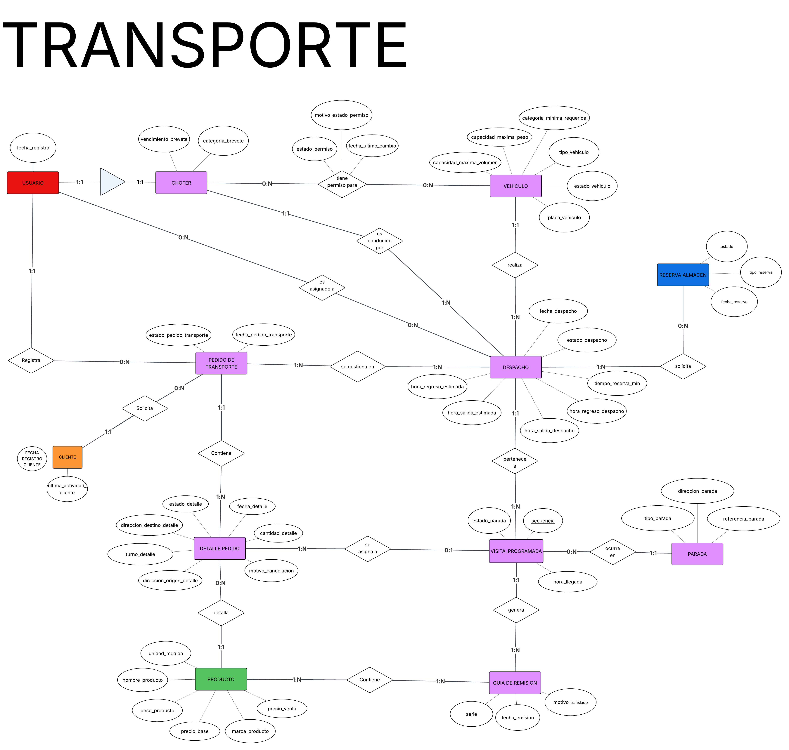

> [4. Diseño Conceptual](../4.md) › [4.2. Módulo 2](4.2.md)

# 4.2. Módulo 2

# **Modelo Conceptual**

---

# Diccionario de Datos: Módulo de Transporte

## Entidades del Módulo

## 1. Entidad: VEHICULO

**Nombre:** `VEHICULO`

**Descripción:** Representa una unidad física de la flota de transporte de la ferretería (ej. camión, furgoneta, camioneta).

**Propósito:** Gestionar el activo (vehículo), conocer su disponibilidad (estado), sus capacidades (peso, volumen) y los requisitos legales (licencia) para poder asignarlo a un despacho (R-209).

**Reglas de negocio relevantes:**

- (R-201) Cada vehículo se registra con una placa, tipo, capacidad y la licencia mínima requerida.
- (R-202) El estado de un vehículo (Operativo, Mantenimiento, De Baja) debe poder actualizarse para reflejar su disponibilidad real.
- (R-203) Un vehículo no puede ser eliminado si tiene despachos asignados (asegurado por la FK en `DESPACHO`).
- (R-206) Un vehículo puede requerir una categoría de licencia específica, y múltiples choferes pueden tener permiso para usarlo (ver Relación `PERMISO`).
- (R-209) La capacidad de peso y volumen es crucial para la planificación del despacho.
- (Del Script) Cada vehículo debe tener una `placa_vehiculo` única.

### Tabla de Atributos

| Nombre del atributo | Descripción (Negocio) | Propósito (Modelo) | Dominio | Obligatorio | Único | Multivaluado | Ejemplos |
| --- | --- | --- | --- | --- | --- | --- | --- |
| `cod_vehiculo` | Identificador numérico interno. | Clave Primaria (PK) autoincremental. | Número (SERIAL) | Sí | Sí | No | 1, 2, 3... |
| `placa_vehiculo` | Matrícula o patente legal del vehículo. | Clave alterna (natural) para identificar el vehículo en el mundo real (R-201). | Texto (VARCHAR(10)) | Sí | Sí | No | "ABC-123" |
| `cod_tipo_vehiculo` | Clasificación del vehículo (ej. Camión). | Clave Foránea (FK) a `TIPO_VEHICULO`. | Número (INT) | Sí | No | No | 1 (Camión) |
| `cod_estado_vehiculo` | Estado actual del vehículo (R-202). | FK a `ESTADO_VEHICULO`. Controla la disponibilidad. | Número (INT) | Sí | No | No | 1 (Operativo) |
| `capacidad_maxima_peso` | Peso máximo (en Kg o Ton) que soporta. | Define el límite de carga para R-209. | Número (DECIMAL) | Sí | No | No | 5000.00 |
| `capacidad_maxima_volumen` | Volumen máximo (en m³) que soporta. | Define el límite de volumen para R-209. | Número (DECIMAL) | Sí | No | No | 30.00 |
| `categoria_minima_requerida` | Tipo de licencia de conducir necesaria. | Define el requisito legal para la asignación de un chofer (R-206). | Texto (VARCHAR(5)) | Sí | No | No | "A3C", "A2B" |

## 2. Entidad: CHOFER

**Nombre:** `CHOFER`

**Descripción:** Representa a un empleado (que es un `USUARIO`) que tiene el rol específico de conducir vehículos de la flota.

**Propósito:** Identificar al personal calificado para operar los vehículos, gestionar la validez de sus licencias y asignarlos como "Operador" a un `DESPACHO` (R-209).

**Reglas de negocio relevantes:**

- (Consolidado) Un `CHOFER` es una especialización de `USUARIO`. Todo chofer es un usuario, pero no todo usuario es un chofer.
- (R-204) Se deben registrar los datos de su licencia (brevete).
- (R-206) Los permisos de un chofer para conducir vehículos específicos son gestionados (ver Relación `PERMISO`).
- (R-209) Solo un chofer puede ser el operador principal de un `DESPACHO`.

### Tabla de Atributos

| Nombre del atributo | Descripción (Negocio) | Propósito (Modelo) | Dominio | Obligatorio | Único | Multivaluado | Ejemplos |
| --- | --- | --- | --- | --- | --- | --- | --- |
| `cod_usuario` | Identificador numérico interno del usuario. | Clave Primaria (PK) y Clave Foránea (FK) a `USUARIO`. Identifica al chofer. | Número (INT) | Sí | Sí | No | 10 |
| `vencimiento_brevete` | Fecha de expiración de la licencia de conducir. | Controla la validez legal del chofer para operar. | Fecha (DATE) | Sí | No | No | "2025-12-31" |
| `categoria_brevete` | Tipo de licencia que posee el chofer. | Se compara con la `categoria_minima_requerida` del `VEHICULO` (R-206). | Texto (VARCHAR(5)) | Sí | No | No | "A3C" |

## 3. Entidad: PARADA

**Nombre:** `PARADA`

**Descripción:** Representa una ubicación geográfica o dirección física (ej. un cliente, un almacén, un proveedor) a la que un despacho puede ir.

**Propósito:** Almacenar direcciones de forma maestra. Evita la redundancia de escribir la misma dirección en múltiples pedidos o despachos.

**Reglas de negocio relevantes:**

- Una parada es una dirección "guardada".
- Las paradas pueden ser de tipo 'Cliente', 'Almacen' o 'Proveedor'.
- (R-209) Un despacho se compone de visitas a una o más de estas paradas.

### Tabla de Atributos

| Nombre del atributo | Descripción (Negocio) | Propósito (Modelo) | Dominio | Obligatorio | Único | Multivaluado | Ejemplos |
| --- | --- | --- | --- | --- | --- | --- | --- |
| `cod_parada` | Identificador numérico interno. | Clave Primaria (PK) autoincremental. | Número (SERIAL) | Sí | Sí | No | 1, 2, 3... |
| `direccion_parada` | La dirección formal de la ubicación. | Almacena la dirección principal de la parada. | Texto (VARCHAR(200)) | Sí | No | No | "Av. Los Rosales 123" |
| `referencia_parada` | Datos adicionales (ej. "Portón azul"). | Ayuda al conductor a ubicar el lugar. | Texto (VARCHAR(100)) | No | No | No | "Frente al parque" |
| `cod_tipo_parada` | Clasificación de la parada. | FK a `TIPO_PARADA`. Define si es Cliente, Almacén u otro. | Número (INT) | Sí | No | No | 1 (Cliente) |

## 4. Entidad: PEDIDO_TRANSPORTE

**Nombre:** `PEDIDO_TRANSPORTE`

**Descripción:** Representa una solicitud formal para el transporte de productos, generada por otro módulo (ej. Abastecimiento) para un cliente final.

**Propósito:** Es la entidad "padre" que inicia el flujo de transporte. Agrupa los artículos (`DETALLE_PEDIDO_TR`) que deben ser despachados.

**Reglas de negocio relevantes:**

- (Consolidado) Cada pedido de transporte es generado por una `RECEPCION` de mercadería del módulo de Abastecimiento.
- (Consolidado) Cada pedido es para un `CLIENTE` y es registrado por un `USUARIO` (empleado).
- (R-207) El pedido puede ser cancelado (a nivel de cabecera o detalle).
- (R-213) Un pedido puede ser atendido por múltiples despachos (ver `ASIGNACION_PEDIDO_DESPACHO`).

### Tabla de Atributos

| Nombre del atributo | Descripción (Negocio) | Propósito (Modelo) | Dominio | Obligatorio | Único | Multivaluado | Ejemplos |
| --- | --- | --- | --- | --- | --- | --- | --- |
| `cod_pedido_transporte` | Identificador numérico interno. | Clave Primaria (PK) autoincremental. | Número (SERIAL) | Sí | Sí | No | 1, 2, 3... |
| `fecha_pedido_transporte` | Fecha en que se creó la solicitud. | Define la antigüedad del pedido. | Fecha (DATE) | Sí | No | No | "2025-11-10" |
| `cod_recepcion` | ID de la recepción que origina el pedido. | FK a `RECEPCION`. Conecta Transporte con Abastecimiento. | Número (INT) | Sí | No | No | 105 |
| `cod_estado_pedido_tr` | Estado general del pedido. | FK a `ESTADO_PEDIDO_TR`. | Número (INT) | Sí | No | No | 2 (En Proceso) |
| `cod_cliente` | Cliente final que recibirá los productos. | FK a `CLIENTE`. Necesario para R-207 y R-213. | Número (INT) | Sí | No | No | 45 |
| `cod_empleado_registro` | Empleado que registró la solicitud. | FK a `USUARIO`. Define la autoría del pedido. | Número (INT) | Sí | No | No | 12 (Usuario B. N.) |

## 5. Entidad: DESPACHO

**Nombre:** `DESPACHO`

**Descripción:** Representa un viaje o ruta planificado, que agrupa una o más entregas (`VISITA_PROGRAMADA`), asignado a un chofer y un vehículo específico.

**Propósito:** Es la entidad central de la logística (R-209). Agrupa los recursos (chofer, vehículo, ayudantes) y el plan (visitas, horarios) para ejecutar las entregas.

**Reglas de negocio relevantes:**

- (R-209) Un despacho se crea para una `fecha_despacho` específica.
- (R-209) Debe tener 1 y solo 1 `CHOFER` y 1 y solo 1 `VEHICULO`.
- (R-209) Puede tener 0 o N Ayudantes (ver `ASIGNACION_AYUDANTE`).
- (R-210) Se registran las horas estimadas (R-209) vs. las reales (R-210).
- (R-211) Un despacho en estado 'Programado' puede ser actualizado (cambiar chofer/vehículo).
- (R-212) Un despacho en estado 'Programado' puede ser eliminado.

### Tabla de Atributos

| Nombre del atributo | Descripción (Negocio) | Propósito (Modelo) | Dominio | Obligatorio | Único | Multivaluado | Ejemplos |
| --- | --- | --- | --- | --- | --- | --- | --- |
| `cod_despacho` | Identificador numérico interno. | Clave Primaria (PK) autoincremental. | Número (SERIAL) | Sí | Sí | No | 1, 2, 3... |
| `fecha_despacho` | Fecha planificada para el viaje. | Define el día de la ruta. | Fecha (DATE) | Sí | No | No | "2025-11-11" |
| `cod_estado_despacho` | Estado actual del viaje. | FK a `ESTADO_DESPACHO`. | Número (INT) | Sí | No | No | 1 (Programado) |
| `hora_salida_estimada` | Hora planificada de salida (R-209). | Planificación de la ruta. | Hora (TIME) | Sí | No | No | "09:00:00" |
| `hora_salida_despacho` | Hora real en que salió el vehículo (R-210). | Seguimiento y control. | Hora (TIME) | No | No | No | "09:15:00" |
| `hora_regreso_estimada` | Hora planificada de regreso (R-209). | Planificación de la ruta. | Hora (TIME) | Sí | No | No | "14:00:00" |
| `hora_regreso_despacho` | Hora real en que regresó el vehículo (R-210). | Seguimiento y control. | Hora (TIME) | No | No | No | "14:30:00" |
| `cod_chofer` | Conductor asignado al despacho. | FK a `CHOFER(cod_usuario)`. | Número (INT) | Sí | No | No | 10 |
| `cod_vehiculo` | Vehículo asignado al despacho. | FK a `VEHICULO`. | Número (INT) | Sí | No | No | 5 |
| `tiempo_reserva_min` | Tiempo de reserva en almacén. | (Lógica de negocio de Almacén). | Número (INT) | Sí | No | No | 30 |

## 6. Entidad: VISITA_PROGRAMADA

**Nombre:** `VISITA_PROGRAMADA`

**Descripción:** Representa una parada o entrega específica dentro de una ruta de despacho. Es el evento de ir a una `PARADA` en un `DESPACHO` específico.

**Propósito:** Modela la relación M:N entre `DESPACHO` y `PARADA`. Define la secuencia de la ruta (R-209), registra la hora de entrega (R-210) y genera la `GUIA_REMISION`.

**Reglas de negocio relevantes:**

- (R-209) Un `DESPACHO` se compone de 1 o N visitas.
- (R-209) Cada visita tiene una `secuencia` (1, 2, 3...) única *dentro* de su despacho.
- (R-210) Se debe registrar la `hora_llegada` real.
- (R-209) Agrupa los `DETALLE_PEDIDO_TR` que van a esa misma dirección.
- (R-209) Cada visita genera 1 y solo 1 `GUIA_REMISION`.

### Tabla de Atributos

| Nombre del atributo | Descripción (Negocio) | Propósito (Modelo) | Dominio | Obligatorio | Único | Multivaluado | Ejemplos |
| --- | --- | --- | --- | --- | --- | --- | --- |
| `cod_visita` | Identificador numérico interno. | Clave Primaria (PK) autoincremental. | Número (SERIAL) | Sí | Sí | No | 1, 2, 3... |
| `cod_despacho` | Despacho al que pertenece la visita. | FK a `DESPACHO`. | Número (INT) | Sí | No | No | 5 |
| `cod_parada` | Ubicación a la que se debe ir. | FK a `PARADA`. | Número (INT) | Sí | No | No | 12 |
| `secuencia` | Orden de la parada en la ruta (R-209). | Define el orden de entrega. | Número (INT) | Sí | No | No | 1, 2, 3... |
| `cod_estado_visita` | Estado de la entrega (R-210). | FK a `ESTADO_VISITA`. | Número (INT) | Sí | No | No | 1 (Pendiente) |
| `hora_llegada` | Hora real de llegada a la parada (R-210). | Seguimiento y control. | Hora (TIME) | No | No | No | "10:30:00" |

## 7. Entidad: GUIA_REMISION

**Nombre:** `GUIA_REMISION`

**Descripción:** Documento legal (guía de remisión transportista) que ampara el traslado de los productos de una `VISITA_PROGRAMADA` específica.

**Propósito:** Almacenar el número de serie legal (correlativo) de la guía asociada a cada entrega.

**Reglas de negocio relevantes:**

- Cada `VISITA_PROGRAMADA` (entrega) debe tener 1 y solo 1 `GUIA_REMISION`.
- El número de serie (`serie`) debe ser único en todo el sistema.

### Tabla de Atributos

| Nombre del atributo | Descripción (Negocio) | Propósito (Modelo) | Dominio | Obligatorio | Único | Multivaluado | Ejemplos |
| --- | --- | --- | --- | --- | --- | --- | --- |
| `cod_guia` | Identificador numérico interno. | Clave Primaria (PK) autoincremental. | Número (SERIAL) | Sí | Sí | No | 1, 2, 3... |
| `serie` | Número de serie legal (ej. "T001-000123"). | Almacena el correlativo legal del documento. | Texto (VARCHAR(15)) | Sí | Sí | No | "T001-000123" |
| `cod_visita` | Visita que ampara esta guía. | FK a `VISITA_PROGRAMADA`. Asegura la relación 1:1. | Número (INT) | Sí | Sí | No | 101 |
| `fecha_emision` | Fecha de emisión de la guía. | Auditoría y registro legal. | Fecha (DATE) | Sí | No | No | "2025-11-11" |
| `cod_motivo_traslado` | Motivo legal del traslado. | FK a `MOTIVO_TRASLADO`. | Número (INT) | Sí | No | No | 1 (Venta) |

## 8. Entidad: DETALLE_PEDIDO_TR

**Nombre:** `DETALLE_PEDIDO_TR`

**Descripción:** Representa un artículo o línea de producto (producto y cantidad) específico dentro de un `PEDIDO_TRANSPORTE`.

**Propósito:** Es la unidad mínima de transporte. Es el objeto que se cancela (R-207), se reprograma (R-208) y se asigna a una `VISITA_PROGRAMADA` (R-209).

**Reglas de negocio relevantes:**

- Un `PEDIDO_TRANSPORTE` debe tener 1 o N detalles.
- (R-207) Un detalle puede ser cancelado (`cod_estado_detalle_pedido` = 'Cancelado') y debe registrar un `cod_motivo_cancelacion_tr`.
- (R-208) Un detalle "En Proceso" puede ser reprogramado (cambiar `fecha_detalle` o `direccion_destino_pedido`).
- (R-209) Un detalle se asigna a una `VISITA_PROGRAMADA` para ser despachado. Cuando se asigna, su `cod_visita` deja de ser NULO.

### Tabla de Atributos

| Nombre del atributo | Descripción (Negocio) | Propósito (Modelo) | Dominio | Obligatorio | Único | Multivaluado | Ejemplos |
| --- | --- | --- | --- | --- | --- | --- | --- |
| `cod_detalle_pedido_tr` | Identificador numérico interno. | Clave Primaria (PK) autoincremental. | Número (SERIAL) | Sí | Sí | No | 1, 2, 3... |
| `cod_pedido_transporte` | Pedido al que pertenece el artículo. | FK a `PEDIDO_TRANSPORTE`. | Número (INT) | Sí | No | No | 20 |
| `cod_producto` | Producto que se debe transportar. | FK a `PRODUCTO`. | Número (INT) | Sí | No | No | 300 |
| `cod_visita` | Visita a la que fue asignado (R-209). | FK a `VISITA_PROGRAMADA`. Es NULO si aún no está programado. | Número (INT) | No | No | No | 101 |
| `cantidad_detalle` | Cantidad de producto a transportar. | Define la cantidad de producto. | Número (INT) | Sí | No | No | 50 |
| `cod_estado_detalle_pedido` | Estado del artículo (R-207, R-208). | FK a `ESTADO_DETALLE_PEDIDO`. | Número (INT) | Sí | No | No | 1 (Pendiente) |
| `direccion_origen_pedido` | Dirección de origen del producto. | Define de dónde sale el producto. | Texto (VARCHAR(255)) | No | No | No | "Almacén Central" |
| `direccion_destino_pedido` | Dirección de entrega (R-208). | Define a dónde debe ir el producto. | Texto (VARCHAR(255)) | Sí | No | No | "Av. Los Rosales 123" |
| `fecha_detalle` | Fecha de entrega solicitada (R-208). | Define cuándo debe entregarse. | Fecha (DATE) | Sí | No | No | "2025-11-12" |
| `cod_turno` | Turno de entrega solicitado. | FK a `TURNO`. | Número (INT) | No | No | No | 1 (Mañana) |
| `cod_motivo_cancelacion_tr` | Motivo si el artículo se cancela (R-207). | FK a `MOTIVO_CANCELACION_TR`. Es NULO si no está cancelado. | Número (INT) | No | No | No | 1 (Solicitud Cliente) |

## Relaciones del Módulo

## 1. Relación: PERMISO

**Nombre:** `PERMISO` (Relación M:N modelada como tabla asociativa)

**Descripción:** Define si un `CHOFER` está habilitado, suspendido o no habilitado para conducir un `VEHICULO` específico.

**Propósito:** Cumplir con el requerimiento R-206 ("Actualizar Estado de Permiso de Conducción"), asegurando que solo se asignen choferes calificados a vehículos específicos.

**Reglas de negocio relevantes:**

- (R-206) La relación debe almacenar un estado (Habilitado, Suspendido, etc.).
- (R-206) El sistema debe registrar un motivo (texto libre) cuando el estado cambia.
- (R-209) La lógica de negocio debe consultar esta tabla antes de permitir asignar un `CHOFER` a un `VEHICULO` en un `DESPACHO`.

**Tipos de entidad participantes:**

1. `CHOFER`
2. `VEHICULO`

**Cardinalidades:**

- `CHOFER` (participa en `PERMISO`): **0..N** (Cero a Muchos)
- `VEHICULO` (participa en `PERMISO`): **0..N** (Cero a Muchos)

**Justificación de las cardinalidades:**

- **CHOFER (0..N):** Un chofer puede tener permiso para `N` vehículos (ej. puede conducir el camión A y el camión B). Es `0` (opcional) porque un chofer recién contratado puede no tener permisos asignados aún.
- **VEHICULO (0..N):** Un vehículo puede ser conducido por `N` choferes (ej. el chofer del turno mañana y el del turno tarde). Es `0` (opcional) porque un vehículo nuevo puede no tener choferes asignados aún.

### Tabla de Atributos (de la relación)

| Nombre del atributo | Descripción (Negocio) | Propósito (Modelo) | Dominio | Obligatorio | Único | Multivaluado | Ejemplos |
| --- | --- | --- | --- | --- | --- | --- | --- |
| `cod_usuario` | Identificador del chofer. | Clave Primaria Compuesta (PK) y FK a `CHOFER`. | Número (INT) | Sí | Sí (en PK) | No | 10 |
| `cod_vehiculo` | Identificador del vehículo. | Clave Primaria Compuesta (PK) y FK a `VEHICULO`. | Número (INT) | Sí | Sí (en PK) | No | 5 |
| `cod_estado_permiso` | Estado de la habilitación (R-206). | FK a `ESTADO_PERMISO`. | Número (INT) | Sí | No | No | 2 (Habilitado) |
| `fecha_ultimo_cambio` | Fecha del último cambio de estado. | Auditoría. | Fecha (DATE) | Sí | No | No | "2025-11-10" |
| `motivo_estado_permiso` | Justificación del cambio (R-206). | Almacena el texto libre del Jefe de Transporte. | Texto (TEXT) | No | No | No | "Aprobó examen práctico" |

## 2. Relación: ASIGNACION_AYUDANTE

**Nombre:** `ASIGNACION_AYUDANTE` (Relación M:N modelada como tabla asociativa)

**Descripción:** Asigna uno o más empleados (que tienen un `USUARIO`) como ayudantes a un `DESPACHO` específico.

**Propósito:** Cumplir con el requerimiento R-209 ("Asignación de Ayudantes"), que permite añadir personal de apoyo a una ruta.

**Reglas de negocio relevantes:**

- (R-209) Un despacho puede tener 0 o N ayudantes.
- Un empleado (`USUARIO`) puede ser ayudante en 0 o N despachos (ej. en días diferentes).
- El `CHOFER` del despacho no puede ser su propio ayudante (esto se maneja por lógica de aplicación).

**Tipos de entidad participantes:**

1. `USUARIO` (actuando como Empleado)
2. `DESPACHO`

**Cardinalidades:**

- `USUARIO` (participa en `ASIGNACION_AYUDANTE`): **0..N** (Cero a Muchos)
- `DESPACHO` (participa en `ASIGNACION_AYUDANTE`): **0..N** (Cero a Muchos)

**Justificación de las cardinalidades:**

- **USUARIO (0..N):** Un empleado puede nunca ser ayudante (`0`) o serlo muchas veces (`N`).
- **DESPACHO (0..N):** Un despacho puede no requerir ayudantes (`0`) o requerir varios (`N`).

### Tabla de Atributos (de la relación)

| Nombre del atributo | Descripción (Negocio) | Propósito (Modelo) | Dominio | Obligatorio | Único | Multivaluado | Ejemplos |
| --- | --- | --- | --- | --- | --- | --- | --- |
| `cod_usuario` | Identificador del empleado ayudante. | Clave Primaria Compuesta (PK) y FK a `USUARIO`. | Número (INT) | Sí | Sí (en PK) | No | 15 |
| `cod_despacho` | Identificador del despacho. | Clave Primaria Compuesta (PK) y FK a `DESPACHO`. | Número (INT) | Sí | Sí (en PK) | No | 5 |

## 3. Relación: ASIGNACION_PEDIDO_DESPACHO

**Nombre:** `ASIGNACION_PEDIDO_DESPACHO` (Relación M:N modelada como tabla asociativa)

**Descripción:** Relación M:N denormalizada que vincula directamente un `PEDIDO_TRANSPORTE` con un `DESPACHO`.

**Propósito:** Optimizar y agilizar las consultas de la "Vista General" (R-213). Permite al sistema responder rápidamente a la pregunta "¿Qué despachos están atendiendo este pedido?" sin tener que consultar todas las tablas de detalle (`DETALLE_PEDIDO_TR` y `VISITA_PROGRAMADA`).

**Reglas de negocio relevantes:**

- (R-213) Un pedido puede ser atendido por 0 o N despachos (si está pendiente o se divide).
- (R-213) Un despacho puede estar atendiendo artículos de 1 o N pedidos.
- (Lógica) La aplicación debe insertar un registro aquí la primera vez que un artículo de un pedido se asigna a un despacho.

**Tipos de entidad participantes:**

1. `PEDIDO_TRANSPORTE`
2. `DESPACHO`

**Cardinalidades:**

- `PEDIDO_TRANSPORTE` (participa en `ASIGNACION_PEDIDO_DESPACHO`): **0..N** (Cero a Muchos)
- `DESPACHO` (participa en `ASIGNACION_PEDIDO_DESPACHO`): **1..N** (Uno a Muchos)

**Justificación de las cardinalidades:**

- **PEDIDO_TRANSPORTE (0..N):** Un pedido puede estar 'Pendiente' y no tener ningún despacho asignado (`0`), o puede dividirse en varios despachos (`N`).
- **DESPACHO (1..N):** Un despacho se crea con el propósito de atender al menos un pedido (`1`). No puede existir un despacho vacío. Puede llevar artículos de `N` pedidos diferentes.

### Tabla de Atributos (de la relación)

| Nombre del atributo | Descripción (Negocio) | Propósito (Modelo) | Dominio | Obligatorio | Único | Multivaluado | Ejemplos |
| --- | --- | --- | --- | --- | --- | --- | --- |
| `cod_pedido_transporte` | Identificador del pedido. | Clave Primaria Compuesta (PK) y FK a `PEDIDO_TRANSPORTE`. | Número (INT) | Sí | Sí (en PK) | No | 20 |
| `cod_despacho` | Identificador del despacho. | Clave Primaria Compuesta (PK) y FK a `DESPACHO`. | Número (INT) | Sí | Sí (en PK) | No | 5 |

## 4. Relación: (Otras Relaciones 1:N)

**Nombre:** Ficha de Relaciones 1:N (Claves Foráneas)

**Descripción:** Esta ficha resume las relaciones 1:N (Uno a Muchos) clave del módulo, que se implementan como Claves Foráneas (FK) directas en las tablas "muchos".

### 4.1. Relación: `DESPACHO` asigna `CHOFER`

- **Nombre:** Asignación de Chofer.
- **Descripción:** Asigna un único conductor a un despacho.
- **Propósito:** Cumplir R-209 ("Asignacion de Recursos").
- **Entidades Participantes:** `CHOFER` (lado 1), `DESPACHO` (lado N).
- **Cardinalidades:**
    - `CHOFER`: **0..N** (Un chofer puede tener 0 o N despachos asignados a lo largo del tiempo).
    - `DESPACHO`: **1..1** (Un despacho debe tener 1 y solo 1 chofer).
- **Justificación:** Un despacho no puede existir sin un operador (R-209), pero un chofer puede no tener despachos asignados (ej. está de vacaciones).
- **Implementación:** FK `cod_chofer` en la tabla `DESPACHO`.

### 4.2. Relación: `DESPACHO` asigna `VEHICULO`

- **Nombre:** Asignación de Vehículo.
- **Descripción:** Asigna una única unidad de la flota a un despacho.
- **Propósito:** Cumplir R-209 ("Asignacion de Recursos").
- **Entidades Participantes:** `VEHICULO` (lado 1), `DESPACHO` (lado N).
- **Cardinalidades:**
    - `VEHICULO`: **0..N** (Un vehículo puede tener 0 o N despachos asignados a lo largo del tiempo).
    - `DESPACHO`: **1..1** (Un despacho debe tener 1 y solo 1 vehículo).
- **Justificación:** Un despacho no puede existir sin un vehículo (R-209), pero un vehículo puede estar en mantenimiento (0 despachos).
- **Implementación:** FK `cod_vehiculo` en la tabla `DESPACHO`.

### 4.3. Relación: `PEDIDO_TRANSPORTE` agrupa `DETALLE_PEDIDO_TR`

- **Nombre:** Composición de Pedido.
- **Descripción:** Un pedido se compone de uno o más artículos/líneas de detalle.
- **Propósito:** Definir qué productos y cantidades se deben transportar.
- **Entidades Participantes:** `PEDIDO_TRANSPORTE` (lado 1), `DETALLE_PEDIDO_TR` (lado N).
- **Cardinalidades:**
    - `PEDIDO_TRANSPORTE`: **1..N** (Un pedido debe tener al menos 1 artículo).
    - `DETALLE_PEDIDO_TR`: **1..1** (Un artículo de detalle solo puede pertenecer a 1 pedido).
- **Justificación:** No puede existir un "pedido vacío".
- **Implementación:** FK `cod_pedido_transporte` en la tabla `DETALLE_PEDIDO_TR`.

### 4.4. Relación: `VISITA_PROGRAMADA` asigna `DETALLE_PEDIDO_TR`

- **Nombre:** Asignación de Artículos a Visita.
- **Descripción:** Asigna artículos de pedidos a una visita/parada específica.
- **Propósito:** Cumplir R-209 (agrupar artículos por destino en una visita).
- **Entidades Participantes:** `VISITA_PROGRAMADA` (lado 1), `DETALLE_PEDIDO_TR` (lado N).
- **Cardinalidades:**
    - `VISITA_PROGRAMADA`: **1..N** (Una visita se crea para entregar al menos 1 artículo).
    - `DETALLE_PEDIDO_TR`: **0..1** (Un artículo puede no estar asignado (`0`) o estar asignado a 1 sola visita (`1`)).
- **Justificación:** Un artículo está "Pendiente" (`0`) hasta que se asigna a una visita (`1`). Una visita no puede estar vacía.
- **Implementación:** FK `cod_visita` en la tabla `DETALLE_PEDIDO_TR`.

### 4.5. Relación: `VISITA_PROGRAMADA` genera `GUIA_REMISION`

- **Nombre:** Emisión de Guía.
- **Descripción:** Cada visita/entrega genera un documento legal.
- **Propósito:** Registrar el correlativo de la guía de remisión.
- **Entidades Participantes:** `VISITA_PROGRAMADA` (lado 1), `GUIA_REMISION` (lado 1).
- **Cardinalidades:**
    - `VISITA_PROGRAMADA`: **1..1**
    - `GUIA_REMISION`: **1..1**
- **Justificación:** Es una relación 1 a 1 obligatoria. Cada visita DEBE tener una guía, y cada guía pertenece a una única visita.
- **Implementación:** FK `cod_visita` (con restricción `UNIQUE`) en la tabla `GUIA_REMISION`.

[⬅️ Anterior](../4.1/4.1.md) | [🏠 Home](../../README.md) | [Siguiente ➡️](../4.3/4.3.md)
