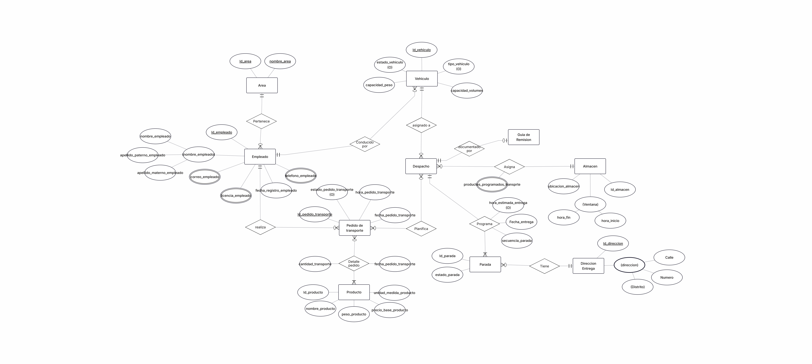

> [4. Diseño Conceptual](../4.md) › [4.2. Módulo 2](4.2.md)

# 4.2. Módulo 2
---

# Modelo Conceptual

# Diccionario de Datos: Transporte
# ENTIDADES
## 1) Área

**Descripción.** Unidad interna que origina pedidos (Ventas, Abastecimiento, etc.).
**Propósito.** Trazar el área responsable del pedido.
**Reglas.** Un empleado pertenece a una única área vigente.

| Atributo    | Descripción            | Propósito         | Dominio     | NN | Único | Multivaluado | Ejemplos         |
| ----------- | ---------------------- | ----------------- | ----------- | -- | ----- | ------------ | ---------------- |
| id_area     | Identificador del área | PK                | Número/Text | Sí | Sí    | No           | 10     |
| nombre_area | Nombre del área        | Consulta          | Texto       | Sí | No    | No           | “Abastecimiento” |

---

## 2) Empleado

**Descripción.** Personal de transporte (jefe/operador) y soporte.
**Propósito.** Asignación de tareas y trazabilidad.
**Reglas.** Un empleado tiene 0..N teléfonos/correos (si se modelan), y puede tener 0..N licencias (categorías).

| Atributo                  | Descripción                    | Propósito      | Dominio     | NN | Único | Multivaluado | Ejemplos                                    |
| ------------------------- | ------------------------------ | -------------- | ----------- | -- | ----- | ------------ | ------------------------------------------- |
| id_empleado               | Identificador del empleado     | PK             | Número/Text | Sí | Sí    | No           | 501                                         |
| nombre_empleado           | Nombres (solo nombres de pila) | Identificación | Texto       | Sí | No    | No           | “Lucía Fernanda”                            |
| apellido_paterno_empleado | Apellido paterno               | Identificación | Texto       | Sí | No    | No           | “Salazar”                                   |
| licencia_empleado         | Categoría(s) de licencia       | Habilitación   | Texto       | No | No    | **Sí**       | “A-IIIB”, “A-IV”                            |
| telefono_empleado         | Teléfono(s)                    | Contacto       | Texto       | No | No    | **Sí**       | “999-123-456”                               |
| correo_empleado           | Correo(s)                      | Contacto       | Texto       | No | No    | **Sí**       | “[lfs@empresa.com](mailto:lfs@empresa.com)” |
| fecha_registro_empleado   | Fecha de alta                  | Auditoría      | Fecha       | No | No    | No           | 2025-03-01                                  |

---

## 3) Vehículo

**Descripción.** Unidades propias usadas para despachos.
**Propósito.** Validar disponibilidad y capacidad.
**Reglas.** La placa identifica de forma única.

| Atributo          | Descripción            | Propósito  | Dominio | NN | Único  | Multivaluado | Ejemplos                  |
| ----------------- | ---------------------- | ---------- | ------- | -- | ------ | ------------ | ------------------------- |
| id_vehiculo/placa | Identificador/placa    | PK         | Texto   | Sí | **Sí** | No           | “ABC-123”                 |
| estado_vehiculo   | Estado operativo       | Asignación | Texto   | No | No     | No           | “activo”, “mantenimiento” |
| capacidad_peso    | Capacidad peso (kg)    | Capacidad  | Número  | Sí | No     | No           | 5000                      |
| capacidad_volumen | Capacidad volumen (m³) | Capacidad  | Número  | Sí | No     | No           | 18                        |
| tipo_vehiculo     | Tipo                   | Reglas     | Texto   | No | No     | No           | “camión 6T”               |

---

## 4) Pedido de Transporte

**Descripción.** Solicitud de movimiento de mercadería (salida a obra).
**Propósito.** Origen de planificación logística.
**Reglas.** Puede cubrirse con uno o varios despachos.

| Atributo                 | Descripción                   | Propósito   | Dominio     | NN | Único | Multivaluado | Ejemplos          |
| ------------------------ | ----------------------------- | ----------- | ----------- | -- | ----- | ------------ | ----------------- |
| id_pedido_transporte     | Identificador                 | PK          | Número/Text | Sí | Sí    | No           | 2025-000145       |
| estado_pedido_transporte | Estado (pendiente/listo/etc.) | Seguimiento | Texto       | No | No    | No           | “pendiente_stock” |
| fecha_pedido_transporte  | Fecha de creación             | Control     | Fecha       | Sí | No    | No           | 2025-04-18        |
| hora_pedido_transporte   | Hora de registro              | Control     | Hora        | No | No    | No           | 10:35             |

---

## 5) Producto

**Descripción.** Item comercial a transportar.
**Propósito.** Definir peso, UM y precio base referencial.
**Reglas.** Puede figurar en muchos pedidos.

| Atributo               | Descripción          | Propósito      | Dominio | NN | Único | Multivaluado | Ejemplos                 |
| ---------------------- | -------------------- | -------------- | ------- | -- | ----- | ------------ | ------------------------ |
| id_producto            | Identificador        | PK             | Número  | Sí | Sí    | No           | 1203                     |
| nombre_producto        | Descripción          | Identificación | Texto   | Sí | No    | No           | “Cemento tipo I 42.5 kg” |
| unidad_medida_producto | UM                   | Reglas         | Texto   | No | No    | No           | “bolsa”, “m³”, “kg”      |
| peso_producto          | Peso unitario        | Capacidad      | Número  | No | No    | No           | 42.5                     |
| precio_base_producto   | Precio de referencia | Costeo         | Dinero  | No | No    | No           | 29.90                    |

---

## 6) Despacho

**Descripción.** Ejecución/hoja de ruta para una fecha.
**Propósito.** Planificar, asignar y dar seguimiento.
**Reglas.** Debe tener 1 vehículo propio **o** un tercero (XOR), 0..1 guía, 1..N paradas.

| Atributo                         | Descripción          | Propósito   | Dominio     | NN | Único | Multivaluado | Ejemplos               |
| -------------------------------- | -------------------- | ----------- | ----------- | -- | ----- | ------------ | ---------------------- |
| id_despacho                      | Identificador        | PK          | Número/Text | Sí | Sí    | No           | 2025-D-00077           |
| productos_programados_transporte | Resumen de items     | Referencia  | Texto       | No | No    | **Sí**       | “Cem(100), Fierro(20)” |
| hora_estimada_entrega            | Hora estimada global | Seguimiento | Hora        | No | No    | No           | 15:30                  |

---

## 7) Guía de Remisión

**Descripción.** Documento legal del traslado.
**Propósito.** Cumplimiento y PoD.
**Reglas.** 0..1 por despacho.

| Atributo | Descripción   | Propósito | Dominio     | NN | Único | Multivaluado | Ejemplos  |
| -------- | ------------- | --------- | ----------- | -- | ----- | ------------ | --------- |
| id_guia  | Identificador | PK        | Número/Text | Sí | Sí    | No           | GR-000452 |

---

## 8) Almacén

**Descripción.** Punto de carga (muelle/ubicación).
**Propósito.** Preparar picking y coordinar ventana.
**Reglas.** Un despacho reserva una ventana de un almacén.

| Atributo          | Descripción           | Propósito    | Dominio | NN | Único | Multivaluado | Ejemplos             |
| ----------------- | --------------------- | ------------ | ------- | -- | ----- | ------------ | -------------------- |
| id_almacen        | Identificador         | PK           | Número  | Sí | Sí    | No           | 3                    |
| ubicacion_almacen | Dirección/descripción | Enrutamiento | Texto   | No | No    | No           | “Av. Lima 123 – Ate” |
| hora_inicio       | Inicio ventana diaria | Programación | Hora    | No | No    | No           | 08:00                |
| hora_fin          | Fin ventana diaria    | Programación | Hora    | No | No    | No           | 18:00                |

---

## 9) Parada

**Descripción.** Entrega puntual dentro de un despacho.
**Propósito.** Detallar avance por destino.
**Reglas.** Cada parada pertenece a un único despacho.

| Atributo      | Descripción   | Propósito   | Dominio | NN | Único | Multivaluado | Ejemplos               |
| ------------- | ------------- | ----------- | ------- | -- | ----- | ------------ | ---------------------- |
| id_parada     | Identificador | PK          | Número  | Sí | Sí    | No           | 5                      |
| estado_parada | Estado        | Seguimiento | Texto   | No | No    | No           | “en_ruta”, “entregada” |

---

## 10) Dirección Entrega

**Descripción.** Destino/obra del cliente.
**Propósito.** Georreferenciar paradas.
**Reglas.** Una dirección puede usarse en muchas paradas.

| Atributo     | Descripción        | Propósito    | Dominio | NN | Único | Multivaluado | Ejemplos             |
| ------------ | ------------------ | ------------ | ------- | -- | ----- | ------------ | -------------------- |
| id_direccion | Identificador      | PK           | Número  | Sí | Sí    | No           | 877                  |
| zona         | Sector/área        | Enrutamiento | Texto   | No | No    | No           | “SJL – Z4”           |
| direccion    | Dirección completa | Enrutamiento | Texto   | Sí | No    | No           | “Jr. Los Cedros 345” |

---

# RELACIONES

---

## R1) Pertenece (Área — Empleado)

* **Participantes:** Área (A), Empleado (E)
* **Cardinalidades:** A: **0..N** — E: **1..1**
* **Justificación:** un área puede tener ningún/varios empleados; cada empleado pertenece exactamente a una sola área vigente.
* **Atributos:** *(sin atributos propios)*.

---

## R2) Conducido por (Empleado — Vehículo)

* **Participantes:** Empleado (E), Vehículo (V)
* **Cardinalidades:** E: **0..N** — V: **1..1**
* **Justificación:** un empleado puede conducir varias unidades a lo largo del tiempo; un vehículo en un despacho activo tiene un único conductor asignado.
* **Atributos:** *(sin atributos propios)*.

---

## R3) Realiza (Empleado — Pedido de Transporte)

* **Participantes:** Empleado (E), Pedido de Transporte (P)
* **Cardinalidades:** E: **0..N** — P: **1..1**
* **Justificación:** un jefe/operador puede registrar muchos pedidos; cada pedido tiene un responsable único de alta.
* **Atributos:** *(sin atributos propios)*.

---

## R4) Detalle pedido (Pedido de Transporte — Producto)

* **Participantes:** Pedido (P), Producto (Pr)
* **Cardinalidades:** P: **1..N** — Pr: **0..N** (N:M)
* **Justificación:** un pedido incluye uno o varios productos; un producto puede figurar en muchos pedidos.
* **Atributos de la relación:**

  * **cantidad_transporte** (Número, NN Sí, Multivaluado No) – cantidad solicitada por producto.
  * **fecha_pedido_transporte** (Fecha, NN No) – si decides registrar por línea.

---

## R5) Planifica (Pedido de Transporte — Despacho)

* **Participantes:** Pedido (P), Despacho (D)
* **Cardinalidades:** P: **1..N** — D: **1..N** (N:M)
* **Justificación:** un pedido puede dividirse en varios despachos (por capacidad/ventana) y un despacho puede consolidar varios pedidos.

---

## R6) Asignado a (Despacho — Vehículo)

* **Participantes:** Despacho (D), Vehículo (V)
* **Cardinalidades:** D: **1..1** — V: **0..N**
* **Justificación:** cada despacho usa una sola unidad; una unidad puede atender muchos despachos (en el tiempo).
* **Atributos:** *(sin atributos propios)*.

---

## R7) Documentado por (Despacho — Guía de Remisión)

* **Participantes:** Despacho (D), Guía (G)
* **Cardinalidades:** D: **0..1** — G: **1..1**
* **Justificación:** algunos despachos pueden no requerir guía (p.ej., movimiento interno); una guía documenta un único despacho.

---

## R8) Asigna (Despacho — Almacén)

* **Participantes:** Despacho (D), Almacén (A)
* **Cardinalidades:** D: **1..1** — A: **0..N**
* **Justificación:** un despacho debe cargar en un almacén/ventana específica; un almacén atiende muchos despachos.
* **Atributos de la relación (si los manejas en la reserva):**

  * **hora_inicio** / **hora_fin** (Hora, NN No) — ventana asignada efectiva.

---

## R9) Programa (Despacho — Parada)

* **Participantes:** Despacho (D), Parada (Pa)
* **Cardinalidades:** D: **1..N** — Pa: **1..1**
* **Justificación:** cada despacho tiene varias paradas; cada parada pertenece a un único despacho.
* **Atributos de la relación:**

  * **secuencia_parada** (Número, NN Sí) — orden en hoja de ruta.
  * **fecha_entrega** (Fecha, NN No) — estimada/comprometida.
  * **hora_estimada_entrega** (Hora, NN No) — ETA a la parada.

---

## R10) Tiene (Parada — Dirección Entrega)

* **Participantes:** Parada (Pa), Dirección (Di)
* **Cardinalidades:** Pa: **1..1** — Di: **0..N**
* **Justificación:** cada parada se realiza en una sola dirección; una dirección puede repetirse en distintas paradas/fechas.
* **Atributos:** *(sin atributos propios)*.

---
[⬅️ Anterior](../4.1/4.1.md) | [🏠 Home](../../README.md) | [Siguiente ➡️](../4.3/4.3.md)
