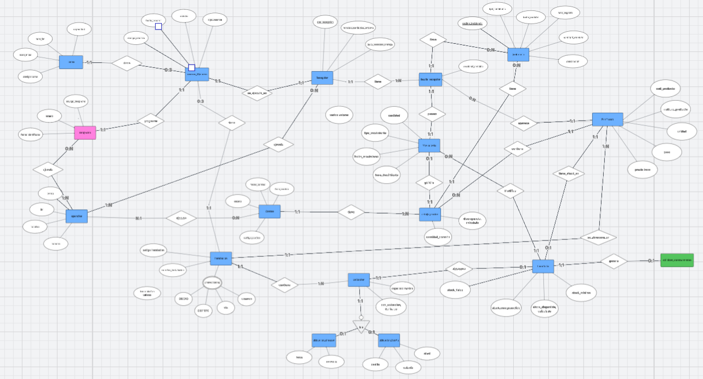

> [4. Diseño Conceptual](../4.md) › [4.3. Módulo 3](4.3.md)

# 4.3. Módulo 3
---
# Modelo Conceptual

# Modelo de Datos - Entidades

---

## 1. Entidad: `Instalacion`

**Descripción:** Representa un edificio o facilidad física principal de la empresa donde se realizan operaciones (ej. un almacén o la tienda).  
**Propósito:** Servir como el nivel más alto de la jerarquía de ubicaciones, permitiendo agrupar zonas y gestionar la capacidad de reservas.

### Reglas de negocio relevantes
- El `cod_instalacion` debe ser único.  
- Cada instalación tiene un tipo definido ("Almacén" o "Tienda") que determina la estructura de sus ubicaciones internas.

### Atributos

| Nombre del atributo | Descripción | Propósito | Dominio | Obl. | Único | Multivaluado | Ejemplo |
|----------------------|-------------|------------|----------|-------|--------|---------------|----------|
| cod_instalacion | Código único de la instalación | Identificador (PK) | Texto | Sí | Sí | No | "AC1" |
| nombre_instalacion | Nombre descriptivo de la facilidad | Descriptivo | Texto | Sí | Sí | No | "Almacén Construcción 1" |
| direccion | Dirección física de la instalación | Informativo/Compuesto | Compuesto | Sí | No | No | — |
| ➤ via | Nombre de la calle/avenida | Descriptivo | Texto | Sí | No | No | "Av. Industrial" |
| ➤ numero | Número en la vía | Descriptivo | Texto | Sí | No | No | "123" |
| ➤ distrito | Distrito de la ubicación | Descriptivo | Texto | Sí | No | No | "Ate" |
| ➤ ciudad | Ciudad de la ubicación | Descriptivo | Texto | Sí | No | No | "Lima" |

---

## 2. Entidad: `Ubicacion` (Padre de la Jerarquía)

**Descripción:** Representa el concepto abstracto de “un lugar donde se puede guardar un producto”.  
**Propósito:** Servir como la entidad general que se conecta con el resto del modelo (ej. Inventario) y como superclase para los tipos de ubicación.

### Reglas de negocio relevantes
- Toda ubicación debe pertenecer a una `Instalacion`.  
- El `cod_ubicacion_calculado` es único en todo el sistema.

### Atributos

| Nombre del atributo | Descripción | Propósito | Dominio | Obl. | Único | Multivaluado | Ejemplo |
|----------------------|-------------|------------|----------|-------|--------|---------------|----------|
| cod_ubicacion | Identificador único de la ubicación | Identificador (PK) | Texto | Sí | Sí | No | "UB001" |
| cod_ubicacion_calculado | Código descriptivo autogenerado | Identificador de negocio | Derivado | Sí | Sí | No | "AC1-CEM-A" |
| capacidad_maxima | Cantidad máxima de unidades del producto asignado que caben | Control de stock | Número | Sí | No | No | 200 |

---

## 3. Entidad: `ubicacion_almacen` (Hija)

**Descripción:** Representa una ubicación específica dentro de un almacén de construcción, definida por una zona y un espacio.  
**Propósito:** Especializar una `Ubicacion` para el almacenamiento de productos de construcción.

### Reglas de negocio relevantes
- Es un tipo de `Ubicacion`.

### Atributos

| Nombre del atributo | Descripción | Propósito | Dominio | Obl. | Único | Multivaluado | Ejemplo |
|----------------------|-------------|------------|----------|-------|--------|---------------|----------|
| zona | Área designada para un tipo de material | Agrupación | Texto | Sí | No | No | "CEM" |
| espacio | Identificador del espacio dentro de la zona | Localización | Texto | Sí | No | No | "A" |

---

## 4. Entidad: `ubicacion_tienda` (Hija)

**Descripción:** Representa una ubicación específica dentro de la tienda, definida por una jerarquía de pasillo, estante y nivel.  
**Propósito:** Especializar una `Ubicacion` para el almacenamiento de productos de ferretería general.

### Reglas de negocio relevantes
- Es un tipo de `Ubicacion`.

### Atributos

| Nombre del atributo | Descripción | Propósito | Dominio | Obl. | Único | Multivaluado | Ejemplo |
|----------------------|-------------|------------|----------|-------|--------|---------------|----------|
| pasillo | Pasillo donde se encuentra | Localización | Texto | Sí | No | No | "P03" |
| estante | Estante dentro del pasillo | Localización | Texto | Sí | No | No | "E02" |
| nivel | Nivel o repisa en el estante | Localización | Texto | Sí | No | No | "N04" |

---

## 5. Entidad: `Producto`

**Descripción:** Catálogo de cada artículo único que la ferretería compra, almacena y vende.  
**Propósito:** Permitir la identificación unívoca de los artículos para la gestión de todo el sistema.

### Reglas de negocio relevantes
- El `cod_producto` es único.  
- Cada producto tiene asignada una `Instalacion` preferida donde debe ser almacenado.

### Atributos

| Nombre del atributo | Descripción | Propósito | Dominio | Obl. | Único | Multivaluado | Ejemplo |
|----------------------|-------------|------------|----------|-------|--------|---------------|----------|
| cod_producto | Código único del producto (SKU) | Identificador (PK) | Texto | Sí | Sí | No | "CEM-SOL" |
| nombre_producto | Nombre comercial del producto | Descriptivo | Texto | Sí | No | No | "Cemento Sol 42.5kg" |
| unidad | Unidad de medida para venta/stock | Control de inventario | Texto | Sí | No | No | "Bolsa" |
| peso | Peso del producto en Kg | Logística | Número | No | No | No | 42.5 |
| precio_base | Costo base del producto | Comercial | Dinero | No | No | No | 25.50 |

---

## 6. Entidad: `Inventario`

**Descripción:** Registro que representa el saldo actual del stock de un producto en su ubicación dedicada.  
**Propósito:** Ofrecer una vista rápida y eficiente del estado del stock para las operaciones diarias.

### Reglas de negocio relevantes
- Un producto solo puede tener inventario en una única ubicación.  
- Una ubicación solo puede albergar un único tipo de producto.  
- El `stock_disponible` es un valor calculado.

### Atributos

| Nombre del atributo | Descripción | Propósito | Dominio | Obl. | Único | Multivaluado | Ejemplo |
|----------------------|-------------|------------|----------|-------|--------|---------------|----------|
| stock_fisico | Cantidad real de producto en el almacén | Control | Número | Sí | No | No | 150 |
| stock_comprometido | Cantidad reservada para despachos | Control | Número | Sí | No | No | 20 |
| stock_disponible | Cantidad real para la venta | Derivado | Número | Sí | No | No | 130 |
| stock_minimo | Umbral para generar alerta de reposición | Control | Número | Sí | No | No | 50 |

---

## 7. Entidad: `Operador`

**Descripción:** Representa a un trabajador del área de almacén.  
**Propósito:** Gestionar el personal, asignar tareas y llevar un registro de responsabilidades.

### Reglas de negocio relevantes
- El DNI de cada operador debe ser único.

### Atributos

| Nombre del atributo | Descripción | Propósito | Dominio | Obl. | Único | Multivaluado | Ejemplo |
|----------------------|-------------|------------|----------|-------|--------|---------------|----------|
| dni | Documento Nacional de Identidad | Identificador de negocio (PK) | Texto | Sí | Sí | No | "76543210" |
| nombre | Nombre completo del trabajador | Identificador | Texto | Sí | No | No | "Juan Carlos Pérez" |
| cargo | Rol dentro del almacén | Asignación | Enumeración | Sí | No | No | "Operador de Montacarga" |
| numero | Número de contacto del operador | Comunicación | Texto | No | No | No | "987654321" |

---

## 8. Entidad: `Turno`

**Descripción:** Representa un bloque de tiempo predefinido durante el cual se pueden programar operaciones en el almacén.  
**Propósito:** Organizar la disponibilidad del almacén en franjas horarias para gestionar las reservas.

### Reglas de negocio relevantes
- El código de cada turno es único.  
- Cada turno tiene una capacidad que define cuántas reservas simultáneas se pueden atender.

### Atributos

| Nombre del atributo | Descripción | Propósito | Dominio | Obl. | Único | Multivaluado | Ejemplo |
|----------------------|-------------|------------|----------|-------|--------|---------------|----------|
| codigo_turno | Código único del bloque horario | Identificador (PK) | Texto | Sí | Sí | No | "TURNO-M1" |
| hora_inicio | Hora de inicio del turno | Planificación | Hora | Sí | No | No | "08:00" |
| hora_fin | Hora de fin del turno | Planificación | Hora | Sí | No | No | "09:00" |
| capacidad | Nº de operaciones simultáneas | Control de reservas | Número | Sí | No | No | 3 |

---

## 9. Entidad: `Reserva_Almacen`

**Descripción:** Representa una cita o reserva confirmada para una operación de carga o descarga en una Instalación.  
**Propósito:** Servir como el punto central de planificación y el gestor del flujo de camiones.

### Reglas de negocio relevantes
- Cada reserva tiene un código único.  
- Una reserva se asocia a un turno y a una instalación específica.

### Atributos

| Nombre del atributo | Descripción | Propósito | Dominio | Obl. | Único | Multivaluado | Ejemplo |
|----------------------|-------------|------------|----------|-------|--------|---------------|----------|
| codigo_reserva | Código único de la reserva | Identificador (PK) | Texto | Sí | Sí | No | "RES-0755" |
| fecha_reserva | Fecha para la cual se programa | Planificación | Fecha | Sí | No | No | "2025-10-06" |
| tipo_reserva | Indica si es para entrada o salida | Clasificación | Enumeración | Sí | No | No | "Despacho" |
| estado | Estado actual de la reserva | Monitoreo | Enumeración | Sí | No | No | "Confirmada" |

---

## 10. Entidad: `Recepcion`

**Descripción:** Entidad de evento que registra la llegada física de mercancía asociada a una Orden de Compra.  
**Propósito:** Mantener un historial auditable de cada entrega, permitiendo gestionar recepciones parciales y registrar incidencias.

### Reglas de negocio relevantes
- Cada evento de recepción genera un código único.

### Atributos

| Nombre del atributo | Descripción | Propósito | Dominio | Obl. | Único | Multivaluado | Ejemplo |
|----------------------|-------------|------------|----------|-------|--------|---------------|----------|
| cod_recepcion | Código único del evento de recepción | Identificador (PK) | Texto | Sí | Sí | No | "REC-00123" |
| nombre_conductor_entrega | Nombre del conductor que entrega | Registro | Texto | Sí | No | No | "Luis Gonzales" |
| placa_vehiculo_entrega | Placa del vehículo que entrega | Registro | Texto | Sí | No | No | "F5G-812" |

---

## 11. Entidad: `Despacho`

**Descripción:** Entidad (externa, del Módulo de Transporte) que representa un plan de viaje o entrega, agrupando uno o más pedidos.  
**Propósito:** Actuar como el disparador (trigger) para el proceso de Picking en el Módulo de Almacén.

### Reglas de negocio relevantes
- Cada despacho planificado tiene un código único.

### Atributos

| Nombre del atributo | Descripción | Propósito | Dominio | Obl. | Único | Multivaluado | Ejemplo |
|----------------------|-------------|------------|----------|-------|--------|---------------|----------|
| cod_despacho | Código único del despacho | Identificador (PK) | Texto | Sí | Sí | No | "DESP-0321" |
| fecha_planificada | Fecha programada para la entrega | Planificación | Fecha | Sí | No | No | "2025-10-06" |
| estado | Estado del proceso de despacho | Monitoreo | Enumeración | Sí | No | No | "En Preparación" |

---

## 12. Entidad: `Conteo`

**Descripción:** Entidad que representa una orden de trabajo para realizar un inventario físico de productos específicos.  
**Propósito:** Organizar, asignar y monitorear el proceso de auditoría de stock (conteo cíclico).

### Reglas de negocio relevantes
- Cada tarea de conteo tiene un código único.

### Atributos

| Nombre del atributo | Descripción | Propósito | Dominio | Obl. | Único | Multivaluado | Ejemplo |
|----------------------|-------------|------------|----------|-------|--------|---------------|----------|
| codigo_conteo | Código único de la tarea de conteo | Identificador (PK) | Texto | Sí | Sí | No | "CONT-0050" |
| fecha_conteo | Fecha en que se debe realizar | Planificación | Fecha | Sí | No | No | "2025-10-06" |
| hora_conteo | Hora de inicio programada | Planificación | Hora | No | No | No | "10:00" |
| estado | Estado actual de la tarea | Monitoreo | Enumeración | Sí | No | No | "En Proceso" |

---

## 13. Entidad: `detalle_conteo`

**Descripción:** Entidad asociativa que detalla cada producto a contar dentro de una tarea de Conteo.  
**Propósito:** Servir como la “lista de conteo” para el operador, registrando las cantidades del sistema y las contadas.

### Reglas de negocio relevantes
- Registra la cantidad real contada por el operador.  
- La discrepancia es un valor calculado.

### Atributos

| Nombre del atributo | Descripción | Propósito | Dominio | Obl. | Único | Multivaluado | Ejemplo |
|----------------------|-------------|------------|----------|-------|--------|---------------|----------|
| cantidad_sistema | Stock teórico del producto | Verificación | Número | Sí | No | No | 500 |
| cantidad_contada | Stock físico contado por el operador | Registro | Número | Sí | No | No | 498 |
| discrepancia | Diferencia entre sistema y conteo | Derivado | Número | Sí | No | No | -2 |

---

## 14. Entidad: `detalle_recepcion`

**Descripción:** Entidad asociativa que detalla cada producto y cantidad recibida dentro de un evento de `Recepcion`.  
**Propósito:** Resolver la relación N:M entre `Recepcion` y `Producto`, y servir como punto de anclaje para las incidencias.

### Reglas de negocio relevantes
- Registra la cantidad real que ingresó al almacén.

### Atributos

| Nombre del atributo | Descripción | Propósito | Dominio | Obl. | Único | Multivaluado | Ejemplo |
|----------------------|-------------|------------|----------|-------|--------|---------------|----------|
| cantidad_recibida | Unidades físicas recibidas del producto | Registro | Número | Sí | No | No | 100 |

---

## 15. Entidad: `Incidencia`

**Descripción:** Registro de un problema detectado durante una recepción o un conteo.  
**Propósito:** Documentar formalmente las no conformidades (calidad o cantidad) para su posterior gestión y reclamo.

### Reglas de negocio relevantes
- Una incidencia se genera para un producto específico.

### Atributos

| Nombre del atributo | Descripción | Propósito | Dominio | Obl. | Único | Multivaluado | Ejemplo |
|----------------------|-------------|------------|----------|-------|--------|---------------|----------|
| cod_incidencia | Código único de la incidencia | Identificador (PK) | Texto | Sí | Sí | No | "INC-0058" |
| tipo_incidencia | Clasificación del problema | Categorización | Enumeración | Sí | No | No | "Calidad" |
| fecha_registro | Fecha del reporte | Auditoría | Fecha | Sí | No | No | "2025-10-06" |
| hora_registro | Hora del reporte | Auditoría | Hora | Sí | No | No | "08:25" |
| cantidad_afectada | Unidades del producto con problemas | Cuantificar | Número | Sí | No | No | 5 |
| descripcion | Detalle adicional del problema | Informativo | Texto | No | No | No | "Sacos húmedos" |

---

## 16. Entidad: `Movimiento`

**Descripción:** Registro transaccional de cada entrada, salida o ajuste que altera el stock de un producto.  
**Propósito:** Proveer un historial completo y auditable de cada cambio en el inventario, asegurando la trazabilidad.

### Reglas de negocio relevantes
- Cada movimiento es inalterable.  
- Un movimiento siempre está justificado por un evento (`Recepcion`, `Despacho` o `Conteo`).

### Atributos

| Nombre del atributo | Descripción | Propósito | Dominio | Obl. | Único | Multivaluado | Ejemplo |
|----------------------|-------------|------------|----------|-------|--------|---------------|----------|
| tipo_movimiento | Causa del cambio de stock | Clasificación | Enumeración | Sí | No | No | "Entrada por Recepción" |
| cantidad | Unidades que se suman o restan | Cuantificar | Número | Sí | No | No | +100 |
| fecha_movimiento | Fecha del movimiento | Auditoría | Fecha | Sí | No | No | "2025-10-06" |
| hora_movimiento | Hora del movimiento | Auditoría | Hora | Sí | No | No | "08:30" |

---

# Relaciones del Modelo

---

## R1) DETALLA (OrdenDeCompra — Producto)
**Participantes:** OrdenDeCompra, Producto.  

**Cardinalidades:** OrdenDeCompra (1..N) — Producto (0..N).  

**Justificación:** Una orden de compra debe tener al menos un producto (1..N) para ser válida. Un producto puede no haber sido comprado nunca o estar en muchas órdenes diferentes (0..N).  

**Atributos de la Relación:** Sí existen (Relación N:M).  

| Atributo       | Descripción                      | Propósito          | Dominio | Obl. | Único | Multivaluado | Ejemplo  |
|----------------|----------------------------------|--------------------|---------|------|-------|--------------|----------|
| cantidad       | Unidades pedidas del producto    | Cuantificar compra | Número  | Sí   | No    | No           | 100      |
| precio_unitario| Precio de compra en esa orden    | Registrar costo    | Dinero  | Sí   | No    | No           | 25.00    |
| subtotal       | Cálculo de cantidad * precio     | Informativo        | Derivado| Sí   | No    | No           | 2500.00  |

---

## R2) CONTIENE (Pedido — Producto)
**Participantes:** Pedido, Producto.  

**Cardinalidades:** Pedido (1..N) — Producto (0..N).  

**Justificación:** Un pedido de un cliente debe contener al menos un producto (1..N). Un producto puede no haberse vendido nunca o estar en muchos pedidos distintos (0..N).  

**Atributos de la Relación:** Sí existen (Relación N:M).  

| Atributo             | Descripción                     | Propósito         | Dominio | Obl. | Único | Multivaluado | Ejemplo |
|----------------------|---------------------------------|-------------------|---------|------|-------|--------------|---------|
| cantidad             | Unidades vendidas del producto  | Cuantificar venta | Número  | Sí   | No    | No           | 3       |
| precio_unitario_venta| Precio de venta en ese pedido   | Registrar ingreso | Dinero  | Sí   | No    | No           | 45.00   |
| subtotal             | Cálculo de cantidad * precio    | Informativo       | Derivado| Sí   | No    | No           | 135.00  |

---

## R3) ES_ASIGNADA_A (TareaAlmacen — Operador)
**Participantes:** TareaAlmacen, Operador.  

**Cardinalidades:** TareaAlmacen (1..N) — Operador (0..N).  

**Justificación:** Una tarea debe ser asignada al menos a un operador (1), y puede ser a varios (N). Un operador puede no tener tareas asignadas en un momento dado (0), o tener muchas (N).  

**Atributos de la Relación:** Sí existen (Relación N:M).  

| Atributo         | Descripción               | Propósito   | Dominio       | Obl. | Único | Multivaluado | Ejemplo             |
|------------------|---------------------------|-------------|---------------|------|-------|--------------|---------------------|
| fecha_asignacion | Fecha y hora de asignación| Auditoría   | Fecha y Hora  | Sí   | No    | No           | 22/09/2025 11:00    |

---

## R4) SOLICITA (PeticionDeCompra — Producto)
**Participantes:** PeticionDeCompra, Producto.  

**Cardinalidades:** PeticionDeCompra (1..1) — Producto (0..N).  

**Justificación:** Una petición se genera para un solo producto (1..1). Un producto puede generar cero o muchas peticiones a lo largo del tiempo (0..N).  

**Atributos de la Relación:** No existen.  

---

## R5) TIENE_UN_STOCK (Producto — Inventario)
**Participantes:** Producto, Inventario.  

**Cardinalidades:** Producto (1..1) — Inventario (0..N).  

**Justificación:** Un registro de inventario corresponde a un único producto (1..1). Un producto puede tener cero registros (si es nuevo y sin stock) o muchos (uno por cada ubicación) (0..N).  

**Atributos de la Relación:** No existen.  

---

## R6) ALBERGA_UN (Ubicacion — Inventario)
**Participantes:** Ubicacion, Inventario.  

**Cardinalidades:** Ubicacion (1..1) — Inventario (0..N).  

**Justificación:** Un registro de inventario pertenece a una única ubicación (1..1). Una ubicación puede tener cero o muchos registros de inventario (0..N).  

**Atributos de la Relación:** No existen.  

---

## R7) AGRUPA (Ruta — Pedido)
**Participantes:** Ruta, Pedido.  

**Cardinalidades:** Ruta (1..1) — Pedido (1..N).  

**Justificación:** Un pedido a despachar debe pertenecer a una y solo una ruta (1..1). Una ruta debe contener al menos un pedido para existir, y puede agrupar muchos (1..N).  

**Atributos de la Relación:** No existen.  

---

## R8) ES_CONDUCIDA_POR (Ruta — Transportista)
**Participantes:** Ruta, Transportista.  

**Cardinalidades:** Ruta (1..1) — Transportista (0..N).  

**Justificación:** Una ruta debe tener asignado un y solo un transportista (1..1). Un transportista puede no tener rutas asignadas o tener muchas (0..N).  

**Atributos de la Relación:** No existen.  

---

## R9) UTILIZA (Ruta — Vehiculo)
**Participantes:** Ruta, Vehiculo.  

**Cardinalidades:** Ruta (1..1) — Vehiculo (0..N).  

**Justificación:** Una ruta debe tener asignado un y solo un vehículo (1..1). Un vehículo puede no estar en ninguna ruta o en muchas a lo largo del tiempo (0..N).  

**Atributos de la Relación:** No existen.  

---

## R10) DOCUMENTA (GuiaDeRemision — Pedido)
**Participantes:** GuiaDeRemision, Pedido.  

**Cardinalidades:** GuiaDeRemision (1..1) — Pedido (0..1).  

**Justificación:** Una guía de remisión documenta un y solo un punto de entrega/pedido (1..1). Un pedido puede no tener guía (si no se ha despachado) o tener como máximo una (0..1).  

**Atributos de la Relación:** No existen.  

---

## R11) REGISTRA (GuiaDeRemision — Transportista)
**Participantes:** GuiaDeRemision, Transportista.  

**Cardinalidades:** GuiaDeRemision (1..1) — Transportista (0..N).  

**Justificación:** Una guía debe registrar a un y solo un transportista (1..1). Un transportista puede estar en cero o muchas guías (0..N).  

**Atributos de la Relación:** No existen.  

---

## R12) REGISTRA (GuiaDeRemision — Vehiculo)
**Participantes:** GuiaDeRemision, Vehiculo.  

**Cardinalidades:** GuiaDeRemision (1..1) — Vehiculo (0..N).  

**Justificación:** Una guía debe registrar a un y solo un vehículo (1..1). Un vehículo puede estar en cero o muchas guías (0..N).  

**Atributos de la Relación:** No existen.  

---

## R13) GENERA (Pedido — TareaAlmacen)
**Participantes:** Pedido, TareaAlmacen.  

**Cardinalidades:** Pedido (1..N) — TareaAlmacen (1..1).  

**Justificación:** Una tarea de Picking debe ser generada por al menos un pedido (1), y puede agrupar a muchos (N) si están en la misma ruta. Desde la perspectiva de los pedidos, ese grupo genera una y solo una tarea de Picking (1..1).  

**Atributos de la Relación:** No existen.  

---

## R14) ES_CONTABILIZADO_EN (Producto — TareaAlmacen)
**Participantes:** Producto, TareaAlmacen.  

**Cardinalidades:** Producto (1..N) — TareaAlmacen (0..N).  

**Justificación:** Una tarea de Conteo Cíclico debe incluir al menos un producto (1), y puede ser para muchos (N). Un producto puede no haber sido contado nunca o estar en muchas tareas de conteo a lo largo del tiempo (0..N).  

**Atributos de la Relación:** No existen.  

[⬅️ Anterior](../4.2/4.2.md) | [🏠 Home](../../README.md) | [Siguiente ➡️](../4.4/4.4.md)
