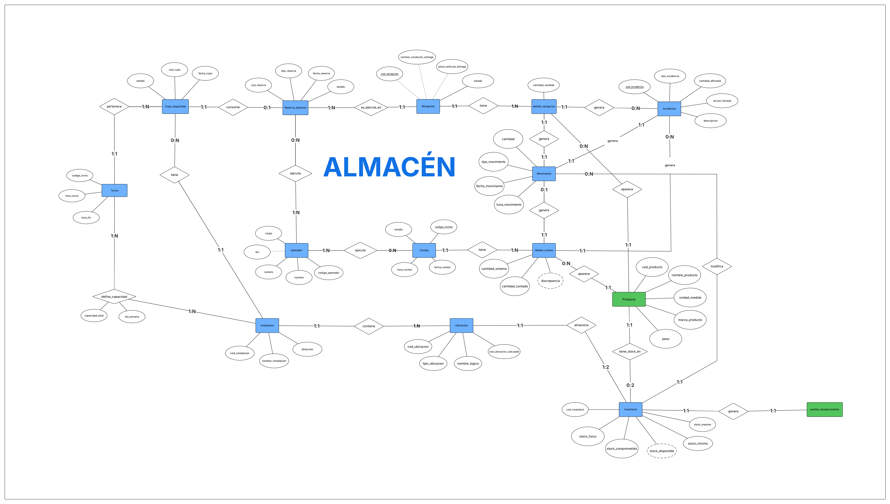

> [4. Diseño Conceptual](../4.md) › [4.3. Módulo 3](4.3.md)

# 4.3. Módulo 3
---
# Modelo Conceptual

# Modelo de Datos - Entidades

---

## 1. Entidad: `Instalacion`

**Descripción:** Representa un edificio o facilidad física principal de la empresa donde se realizan operaciones (ej. un almacén o la tienda).  
**Propósito:** Servir como el nivel más alto de la jerarquía de ubicaciones, permitiendo agrupar zonas y gestionar la capacidad de reservas.

### Reglas de negocio relevantes
- El `cod_instalacion` debe ser único.  
- Cada instalación tiene un tipo definido ("Almacén" o "Tienda") que determina la estructura de sus ubicaciones internas.

### Atributos

| Nombre del atributo | Descripción | Propósito | Dominio | Obl. | Único | Multivaluado | Ejemplo |
|----------------------|-------------|------------|----------|-------|--------|---------------|----------|
| cod_instalacion | Código único de la instalación | Identificador (PK) | Texto | Sí | Sí | No | "AC1" |
| nombre_instalacion | Nombre descriptivo de la facilidad | Descriptivo | Texto | Sí | Sí | No | "Almacén Construcción 1" |
| direccion | Dirección física de la instalación | Informativo/Compuesto | Compuesto | Sí | No | No | — |
| ➤ via | Nombre de la calle/avenida | Descriptivo | Texto | Sí | No | No | "Av. Industrial" |
| ➤ numero | Número en la vía | Descriptivo | Texto | Sí | No | No | "123" |
| ➤ distrito | Distrito de la ubicación | Descriptivo | Texto | Sí | No | No | "Ate" |
| ➤ ciudad | Ciudad de la ubicación | Descriptivo | Texto | Sí | No | No | "Lima" |

---

## 2. Entidad: `Ubicacion` (Padre de la Jerarquía)

**Descripción:** Representa el concepto abstracto de “un lugar donde se puede guardar un producto”.  
**Propósito:** Servir como la entidad general que se conecta con el resto del modelo (ej. Inventario) y como superclase para los tipos de ubicación.

### Reglas de negocio relevantes
- Toda ubicación debe pertenecer a una `Instalacion`.  
- El `cod_ubicacion_calculado` es único en todo el sistema.

### Atributos

| Nombre del atributo | Descripción | Propósito | Dominio | Obl. | Único | Multivaluado | Ejemplo |
|----------------------|-------------|------------|----------|-------|--------|---------------|----------|
| cod_ubicacion | Identificador único de la ubicación | Identificador (PK) | Texto | Sí | Sí | No | "UB001" |
| cod_ubicacion_calculado | Código descriptivo autogenerado | Identificador de negocio | Derivado | Sí | Sí | No | "AC1-CEM-A" |
| capacidad_maxima | Cantidad máxima de unidades del producto asignado que caben | Control de stock | Número | Sí | No | No | 200 |

---

## 3. Entidad: `ubicacion_almacen` (Hija)

**Descripción:** Representa una ubicación específica dentro de un almacén de construcción, definida por una zona y un espacio.  
**Propósito:** Especializar una `Ubicacion` para el almacenamiento de productos de construcción.

### Reglas de negocio relevantes
- Es un tipo de `Ubicacion`.

### Atributos

| Nombre del atributo | Descripción | Propósito | Dominio | Obl. | Único | Multivaluado | Ejemplo |
|----------------------|-------------|------------|----------|-------|--------|---------------|----------|
| zona | Área designada para un tipo de material | Agrupación | Texto | Sí | No | No | "CEM" |
| espacio | Identificador del espacio dentro de la zona | Localización | Texto | Sí | No | No | "A" |

---

## 4. Entidad: `ubicacion_tienda` (Hija)

**Descripción:** Representa una ubicación específica dentro de la tienda, definida por una jerarquía de pasillo, estante y nivel.  
**Propósito:** Especializar una `Ubicacion` para el almacenamiento de productos de ferretería general.

### Reglas de negocio relevantes
- Es un tipo de `Ubicacion`.

### Atributos

| Nombre del atributo | Descripción | Propósito | Dominio | Obl. | Único | Multivaluado | Ejemplo |
|----------------------|-------------|------------|----------|-------|--------|---------------|----------|
| pasillo | Pasillo donde se encuentra | Localización | Texto | Sí | No | No | "P03" |
| estante | Estante dentro del pasillo | Localización | Texto | Sí | No | No | "E02" |
| nivel | Nivel o repisa en el estante | Localización | Texto | Sí | No | No | "N04" |

---

## 5. Entidad: `Producto`

**Descripción:** Catálogo de cada artículo único que la ferretería compra, almacena y vende.  
**Propósito:** Permitir la identificación unívoca de los artículos para la gestión de todo el sistema.

### Reglas de negocio relevantes
- El `cod_producto` es único.  
- Cada producto tiene asignada una `Instalacion` preferida donde debe ser almacenado.

### Atributos

| Nombre del atributo | Descripción | Propósito | Dominio | Obl. | Único | Multivaluado | Ejemplo |
|----------------------|-------------|------------|----------|-------|--------|---------------|----------|
| cod_producto | Código único del producto (SKU) | Identificador (PK) | Texto | Sí | Sí | No | "CEM-SOL" |
| nombre_producto | Nombre comercial del producto | Descriptivo | Texto | Sí | No | No | "Cemento Sol 42.5kg" |
| unidad | Unidad de medida para venta/stock | Control de inventario | Texto | Sí | No | No | "Bolsa" |
| peso | Peso del producto en Kg | Logística | Número | No | No | No | 42.5 |
| precio_base | Costo base del producto | Comercial | Dinero | No | No | No | 25.50 |

---

## 6. Entidad: `Inventario`

**Descripción:** Registro que representa el saldo actual del stock de un producto en su ubicación dedicada.  
**Propósito:** Ofrecer una vista rápida y eficiente del estado del stock para las operaciones diarias.

### Reglas de negocio relevantes
- Un producto solo puede tener inventario en una única ubicación.  
- Una ubicación solo puede albergar un único tipo de producto.  
- El `stock_disponible` es un valor calculado.

### Atributos

| Nombre del atributo | Descripción | Propósito | Dominio | Obl. | Único | Multivaluado | Ejemplo |
|----------------------|-------------|------------|----------|-------|--------|---------------|----------|
| stock_fisico | Cantidad real de producto en el almacén | Control | Número | Sí | No | No | 150 |
| stock_comprometido | Cantidad reservada para despachos | Control | Número | Sí | No | No | 20 |
| stock_disponible | Cantidad real para la venta | Derivado | Número | Sí | No | No | 130 |
| stock_minimo | Umbral para generar alerta de reposición | Control | Número | Sí | No | No | 50 |

---

## 7. Entidad: `Operador`

**Descripción:** Representa a un trabajador del área de almacén.  
**Propósito:** Gestionar el personal, asignar tareas y llevar un registro de responsabilidades.

### Reglas de negocio relevantes
- El DNI de cada operador debe ser único.

### Atributos

| Nombre del atributo | Descripción | Propósito | Dominio | Obl. | Único | Multivaluado | Ejemplo |
|----------------------|-------------|------------|----------|-------|--------|---------------|----------|
| dni | Documento Nacional de Identidad | Identificador de negocio (PK) | Texto | Sí | Sí | No | "76543210" |
| nombre | Nombre completo del trabajador | Identificador | Texto | Sí | No | No | "Juan Carlos Pérez" |
| cargo | Rol dentro del almacén | Asignación | Enumeración | Sí | No | No | "Operador de Montacarga" |
| numero | Número de contacto del operador | Comunicación | Texto | No | No | No | "987654321" |

---

## 8. Entidad: `Turno`

**Descripción:** Representa un bloque de tiempo predefinido durante el cual se pueden programar operaciones en el almacén.  
**Propósito:** Organizar la disponibilidad del almacén en franjas horarias para gestionar las reservas.

### Reglas de negocio relevantes
- El código de cada turno es único.  
- Cada turno tiene una capacidad que define cuántas reservas simultáneas se pueden atender.

### Atributos

| Nombre del atributo | Descripción | Propósito | Dominio | Obl. | Único | Multivaluado | Ejemplo |
|----------------------|-------------|------------|----------|-------|--------|---------------|----------|
| codigo_turno | Código único del bloque horario | Identificador (PK) | Texto | Sí | Sí | No | "TURNO-M1" |
| hora_inicio | Hora de inicio del turno | Planificación | Hora | Sí | No | No | "08:00" |
| hora_fin | Hora de fin del turno | Planificación | Hora | Sí | No | No | "09:00" |
| capacidad | Nº de operaciones simultáneas | Control de reservas | Número | Sí | No | No | 3 |

---

## 9. Entidad: `Reserva_Almacen`

**Descripción:** Representa una cita o reserva confirmada para una operación de carga o descarga en una Instalación.  
**Propósito:** Servir como el punto central de planificación y el gestor del flujo de camiones.

### Reglas de negocio relevantes
- Cada reserva tiene un código único.  
- Una reserva se asocia a un turno y a una instalación específica.

### Atributos

| Nombre del atributo | Descripción | Propósito | Dominio | Obl. | Único | Multivaluado | Ejemplo |
|----------------------|-------------|------------|----------|-------|--------|---------------|----------|
| codigo_reserva | Código único de la reserva | Identificador (PK) | Texto | Sí | Sí | No | "RES-0755" |
| fecha_reserva | Fecha para la cual se programa | Planificación | Fecha | Sí | No | No | "2025-10-06" |
| tipo_reserva | Indica si es para entrada o salida | Clasificación | Enumeración | Sí | No | No | "Despacho" |
| estado | Estado actual de la reserva | Monitoreo | Enumeración | Sí | No | No | "Confirmada" |

---

## 10. Entidad: `Recepcion`

**Descripción:** Entidad de evento que registra la llegada física de mercancía asociada a una Orden de Compra.  
**Propósito:** Mantener un historial auditable de cada entrega, permitiendo gestionar recepciones parciales y registrar incidencias.

### Reglas de negocio relevantes
- Cada evento de recepción genera un código único.

### Atributos

| Nombre del atributo | Descripción | Propósito | Dominio | Obl. | Único | Multivaluado | Ejemplo |
|----------------------|-------------|------------|----------|-------|--------|---------------|----------|
| cod_recepcion | Código único del evento de recepción | Identificador (PK) | Texto | Sí | Sí | No | "REC-00123" |
| nombre_conductor_entrega | Nombre del conductor que entrega | Registro | Texto | Sí | No | No | "Luis Gonzales" |
| placa_vehiculo_entrega | Placa del vehículo que entrega | Registro | Texto | Sí | No | No | "F5G-812" |

---

## 11. Entidad: `Despacho`

**Descripción:** Entidad (externa, del Módulo de Transporte) que representa un plan de viaje o entrega, agrupando uno o más pedidos.  
**Propósito:** Actuar como el disparador (trigger) para el proceso de Picking en el Módulo de Almacén.

### Reglas de negocio relevantes
- Cada despacho planificado tiene un código único.

### Atributos

| Nombre del atributo | Descripción | Propósito | Dominio | Obl. | Único | Multivaluado | Ejemplo |
|----------------------|-------------|------------|----------|-------|--------|---------------|----------|
| cod_despacho | Código único del despacho | Identificador (PK) | Texto | Sí | Sí | No | "DESP-0321" |
| fecha_planificada | Fecha programada para la entrega | Planificación | Fecha | Sí | No | No | "2025-10-06" |
| estado | Estado del proceso de despacho | Monitoreo | Enumeración | Sí | No | No | "En Preparación" |

---

## 12. Entidad: `Conteo`

**Descripción:** Entidad que representa una orden de trabajo para realizar un inventario físico de productos específicos.  
**Propósito:** Organizar, asignar y monitorear el proceso de auditoría de stock (conteo cíclico).

### Reglas de negocio relevantes
- Cada tarea de conteo tiene un código único.

### Atributos

| Nombre del atributo | Descripción | Propósito | Dominio | Obl. | Único | Multivaluado | Ejemplo |
|----------------------|-------------|------------|----------|-------|--------|---------------|----------|
| codigo_conteo | Código único de la tarea de conteo | Identificador (PK) | Texto | Sí | Sí | No | "CONT-0050" |
| fecha_conteo | Fecha en que se debe realizar | Planificación | Fecha | Sí | No | No | "2025-10-06" |
| hora_conteo | Hora de inicio programada | Planificación | Hora | No | No | No | "10:00" |
| estado | Estado actual de la tarea | Monitoreo | Enumeración | Sí | No | No | "En Proceso" |

---

## 13. Entidad: `detalle_conteo`

**Descripción:** Entidad asociativa que detalla cada producto a contar dentro de una tarea de Conteo.  
**Propósito:** Servir como la “lista de conteo” para el operador, registrando las cantidades del sistema y las contadas.

### Reglas de negocio relevantes
- Registra la cantidad real contada por el operador.  
- La discrepancia es un valor calculado.

### Atributos

| Nombre del atributo | Descripción | Propósito | Dominio | Obl. | Único | Multivaluado | Ejemplo |
|----------------------|-------------|------------|----------|-------|--------|---------------|----------|
| cantidad_sistema | Stock teórico del producto | Verificación | Número | Sí | No | No | 500 |
| cantidad_contada | Stock físico contado por el operador | Registro | Número | Sí | No | No | 498 |
| discrepancia | Diferencia entre sistema y conteo | Derivado | Número | Sí | No | No | -2 |

---

## 14. Entidad: `detalle_recepcion`

**Descripción:** Entidad asociativa que detalla cada producto y cantidad recibida dentro de un evento de `Recepcion`.  
**Propósito:** Resolver la relación N:M entre `Recepcion` y `Producto`, y servir como punto de anclaje para las incidencias.

### Reglas de negocio relevantes
- Registra la cantidad real que ingresó al almacén.

### Atributos

| Nombre del atributo | Descripción | Propósito | Dominio | Obl. | Único | Multivaluado | Ejemplo |
|----------------------|-------------|------------|----------|-------|--------|---------------|----------|
| cantidad_recibida | Unidades físicas recibidas del producto | Registro | Número | Sí | No | No | 100 |

---

## 15. Entidad: `Incidencia`

**Descripción:** Registro de un problema detectado durante una recepción o un conteo.  
**Propósito:** Documentar formalmente las no conformidades (calidad o cantidad) para su posterior gestión y reclamo.

### Reglas de negocio relevantes
- Una incidencia se genera para un producto específico.

### Atributos

| Nombre del atributo | Descripción | Propósito | Dominio | Obl. | Único | Multivaluado | Ejemplo |
|----------------------|-------------|------------|----------|-------|--------|---------------|----------|
| cod_incidencia | Código único de la incidencia | Identificador (PK) | Texto | Sí | Sí | No | "INC-0058" |
| tipo_incidencia | Clasificación del problema | Categorización | Enumeración | Sí | No | No | "Calidad" |
| fecha_registro | Fecha del reporte | Auditoría | Fecha | Sí | No | No | "2025-10-06" |
| hora_registro | Hora del reporte | Auditoría | Hora | Sí | No | No | "08:25" |
| cantidad_afectada | Unidades del producto con problemas | Cuantificar | Número | Sí | No | No | 5 |
| descripcion | Detalle adicional del problema | Informativo | Texto | No | No | No | "Sacos húmedos" |

---

## 16. Entidad: `Movimiento`

**Descripción:** Registro transaccional de cada entrada, salida o ajuste que altera el stock de un producto.  
**Propósito:** Proveer un historial completo y auditable de cada cambio en el inventario, asegurando la trazabilidad.

### Reglas de negocio relevantes
- Cada movimiento es inalterable.  
- Un movimiento siempre está justificado por un evento (`Recepcion`, `Despacho` o `Conteo`).

### Atributos

| Nombre del atributo | Descripción | Propósito | Dominio | Obl. | Único | Multivaluado | Ejemplo |
|----------------------|-------------|------------|----------|-------|--------|---------------|----------|
| tipo_movimiento | Causa del cambio de stock | Clasificación | Enumeración | Sí | No | No | "Entrada por Recepción" |
| cantidad | Unidades que se suman o restan | Cuantificar | Número | Sí | No | No | +100 |
| fecha_movimiento | Fecha del movimiento | Auditoría | Fecha | Sí | No | No | "2025-10-06" |
| hora_movimiento | Hora del movimiento | Auditoría | Hora | Sí | No | No | "08:30" |

---

# Relaciones del Modelo

---

##  R1) REQUIERE (Despacho — Tarea_Picking)

* **Descripción:** Vincula un plan de despacho (del Módulo de Transporte) con la orden de trabajo de preparación (picking) en el almacén.  
* **Propósito:** Actuar como el disparador (trigger) que inicia el proceso de picking.  
* **Participantes:** Despacho, Tarea_Picking.  
* **Cardinalidades:** Despacho (1..1) — Tarea_Picking (1..1).  
* **Justificación:** Un Despacho requiere una y solo una Tarea_Picking. Una Tarea_Picking es generada por un y solo un Despacho.

---

##  R2) GENERA (OrdenDeCompra — Tarea_Recepcion)

* **Descripción:** Asocia una orden de compra (del Módulo de Abastecimiento) con la tarea de recepción en el almacén.  

* **Propósito:** Iniciar el proceso de recepción, proveyendo la información de los productos esperados.  
* **Participantes:** OrdenDeCompra, Tarea_Recepcion.  
* **Cardinalidades:** OrdenDeCompra (1..1) — Tarea_Recepcion (1..N).  
* **Justificación:** Una Tarea_Recepcion debe ser generada por una y solo una OrdenDeCompra. Una OrdenDeCompra puede requerir varias Tareas de Recepción si la entrega se realiza en partes.

---

##  R3) INICIA (Operador — Tarea_Conteo)

**Descripción:** Relaciona a un Operador (con rol de Jefe de Almacén) con la creación de una tarea de conteo.  
**Propósito:** Registrar quién es el responsable de iniciar y planificar una auditoría de inventario.  
**Participantes:** Operador, Tarea_Conteo.  
**Cardinalidades:** Operador (1..1) — Tarea_Conteo (0..N).  
**Justificación:** Una Tarea_Conteo debe ser creada por un y solo un Operador. Un Operador puede crear cero o muchas Tareas de Conteo.

---

##  R4) ES_ASIGNADA_A (Tarea_Picking — Operador)

**Descripción:** Asigna la responsabilidad de ejecutar una tarea de picking a uno o más operadores.  
**Propósito:** Llevar un control y auditoría sobre quién realizó cada tarea.  
**Participantes:** Tarea_Picking, Operador.  
**Cardinalidades:** Tarea_Picking (1..N) — Operador (0..N).  
**Justificación:** Una tarea debe ser asignada al menos a un operador (1), y puede ser a varios (N). Un operador puede no tener tareas asignadas (0) o tener muchas (N).

**Atributos de la Relación (N:M):**

| Atributo          | Descripción                 | Propósito  | Dominio        | Obl. | Único | Multivaluado | Ejemplo              |
|--------------------|-----------------------------|-------------|----------------|------|--------|---------------|----------------------|
| fecha_asignacion   | Fecha y hora de asignación  | Auditoría   | Fecha y Hora   | Sí   | No     | No            | "2025-10-06 14:00"  |

> 💡 Nota: Las relaciones de asignación para **Tarea_Recepcion** y **Tarea_Conteo** son idénticas en estructura y justificación.

---

##  R5) DETALLA (Tarea_Picking — Producto)

**Descripción:** Especifica la lista de productos y cantidades a recoger para una tarea de picking.  
**Propósito:** Servir como el "checklist" que el operador debe seguir.  
**Participantes:** Tarea_Picking, Producto.  
**Cardinalidades:** Tarea_Picking (1..N) — Producto (0..N).  
**Justificación:** Una tarea de picking debe detallar al menos un producto (1..N). Un producto puede estar en cero o muchas tareas de picking (0..N).

**Atributos de la Relación (N:M):**

| Atributo             | Descripción                       | Propósito     | Dominio | Obl. | Único | Multivaluado | Ejemplo |
|-----------------------|-----------------------------------|----------------|---------|------|--------|---------------|----------|
| cantidad_a_recoger    | Unidades que se deben recoger     | Instrucción    | Número  | Sí   | No     | No            | 50       |
| cantidad_recogida     | Unidades que el operador marcó    | Verificación   | Número  | Sí   | No     | No            | 50       |

---

##  R6) CREA (Tarea_Recepcion — Movimiento)

**Descripción:** Representa el proceso por el cual una tarea de recepción finalizada genera un registro de entrada en el historial de inventario.  
**Propósito:** Asegurar que cada entrada de stock esté justificada por una transacción de recepción.  
**Participantes:** Tarea_Recepcion, Movimiento.  
**Cardinalidades:** Tarea_Recepcion (1..N) — Movimiento (1..1).  
**Justificación:** Cada Movimiento de entrada debe ser creado por una y solo una Tarea_Recepcion. Una Tarea_Recepcion exitosa debe generar al menos un Movimiento (uno por cada producto recibido).

>  Las relaciones CREA para **Tarea_Picking** y **Tarea_Conteo** son idénticas, solo cambia el tipo de movimiento generado.

---

##  R7) AFECTA (Movimiento — Inventario)

**Descripción:** Vincula un movimiento transaccional con el registro de saldo de inventario que fue alterado.  
**Propósito:** Permitir la trazabilidad y auditoría completa de por qué cambió un saldo de stock.  
**Participantes:** Movimiento, Inventario.  
**Cardinalidades:** Movimiento (1..1) — Inventario (1..N).  
**Justificación:** Un Movimiento afecta a un y solo un registro de Inventario. Un registro de Inventario puede ser afectado por uno o muchos Movimientos.

---

##  R9) CONTIENE (Instalacion — Ubicacion)

**Descripción:** Establece la jerarquía física, indicando qué Ubicaciones pertenecen a qué Instalacion.  
**Propósito:** Organizar el espacio físico del almacén y la tienda.  
**Participantes:** Instalacion, Ubicacion.  
**Cardinalidades:** Instalacion (1..1) — Ubicacion (1..N).  
**Justificación:** Una Ubicacion debe pertenecer a una y solo una Instalacion. Una Instalacion puede contener una o muchas Ubicaciones.

---

##  R10) TIENE_STOCK_EN (Producto — Inventario)

**Descripción:** Vincula un producto del catálogo con su registro de stock.  
**Propósito:** Indicar qué producto se está cuantificando en un registro de inventario.  
**Participantes:** Producto, Inventario.  
**Cardinalidades:** Producto (1..1) — Inventario (0..1).  
**Justificación:** Un registro de Inventario debe corresponder a un y solo un Producto. Un Producto puede tener cero o un registro de Inventario.

---

##  R11) ALMACENA (Ubicacion — Inventario)

**Descripción:** Vincula una ubicación física con el registro de stock que contiene.  
**Propósito:** Indicar dónde se encuentra físicamente un registro de inventario.  
**Participantes:** Ubicacion, Inventario.  
**Cardinalidades:** Ubicacion (1..1) — Inventario (0..1).  
**Justificación:** Un registro de Inventario debe estar en una y solo una Ubicacion. Una Ubicacion puede albergar cero o un tipo de Inventario.

---

##  R12) DETALLA (Recepcion — Producto)

**Descripción:** Especifica los productos y cantidades que se recibieron en un evento de Recepcion.  
**Propósito:** Servir como la lista de ítems de una recepción y como punto de anclaje para Incidencias.  
**Participantes:** Recepcion, Producto.  
**Cardinalidades:** Recepcion (1..N) — Producto (0..N).  
**Justificación:** Una Recepcion debe detallar al menos un producto (1..N). Un Producto puede llegar en cero o muchas Recepciones (0..N).

**Atributos de la Relación (N:M → entidad `detalle_recepcion`):**

| Atributo            | Descripción                          | Propósito | Dominio | Obl. | Único | Multivaluado | Ejemplo |
|----------------------|--------------------------------------|------------|---------|------|--------|---------------|----------|
| cantidad_recibida    | Unidades físicas recibidas del producto | Registro | Número  | Sí   | No     | No            | 100      |

---

##  R13) GENERA (Incidencia — detalle_recepcion / detalle_conteo)

**Descripción:** Vincula un problema específico (una Incidencia) con la línea de la tarea donde se detectó.  
**Propósito:** Asegurar la trazabilidad, sabiendo exactamente qué producto de qué tarea tuvo un problema.  
**Participantes:** Incidencia, detalle_recepcion, detalle_conteo.  
**Cardinalidades:** Incidencia (1..1) — detalle_... (0..N).  
**Justificación:** Una Incidencia debe ser generada por un y solo un detalle de una tarea. Un detalle puede generar cero o muchas Incidencias.

---

##  R14) PROGRAMA (Reserva_Almacen — Despacho / Recepcion)

**Descripción:** Asocia una reserva de muelle con el evento de negocio que la requiere.  
**Propósito:** Justificar la reserva y conectar la planificación logística con la operación.  
**Participantes:** Reserva_Almacen, Despacho, Recepcion.  
**Cardinalidades:** Reserva_Almacen (1..1) — Despacho/Recepcion (1..1).  
**Justificación:** Una Reserva se crea para un y solo un Despacho o Recepcion. Un Despacho o Recepcion debe tener una y solo una Reserva asociada.

---

##  R15) ASIGNACION (Relaciones de Tareas con Operador)

**Descripción:** Asigna la responsabilidad de ejecutar una tarea (Recepcion, Despacho, Conteo) a uno o más operadores.  
**Propósito:** Llevar un control y auditoría sobre quién realizó cada tarea del almacén.  
**Participantes:** (Recepcion/Despacho/Conteo), Operador.  
**Cardinalidades:** Tarea (1..N) — Operador (0..N).  
**Justificación:** Una tarea debe ser asignada al menos a un operador (1), y puede ser a varios (N). Un operador puede no tener tareas asignadas (0) o tener muchas (N).

**Atributos de la Relación (N:M):**

| Atributo          | Descripción                 | Propósito  | Dominio        | Obl. | Único | Multivaluado | Ejemplo              |
|--------------------|-----------------------------|-------------|----------------|------|--------|---------------|----------------------|
| fecha_asignacion   | Fecha y hora de asignación  | Auditoría   | Fecha y Hora   | Sí   | No     | No            | "2025-10-06 14:00"  |  

[⬅️ Anterior](../4.2/4.2.md) | [🏠 Home](../../README.md) | [Siguiente ➡️](../4.4/4.4.md)
