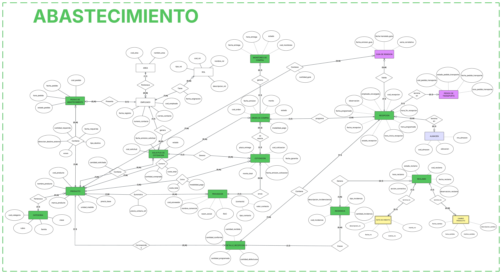

> [4. Diseño Conceptual](../4.md) › [4.4. Módulo 4](4.4.md)

# 4.4.Diseño Conceptual: Modulo de Abastecimiento
## 💡 Modelo Conceptual: Modulo de Abastecimiento   

### 🧾 Entidad: ÁREA

**Descripción:** Representa un departamento de la ferretería (ej. almacén, ventas, etc.). 
**Propósito:** Organizar y clasificar los productos, empleados o solicitudes según la ubicación a la que pertenecen, facilitando la gestión interna. 
**Reglas de negocio relevantes:**
- Cada área debe tener un identificador único y un nombre único.

| Atributo | Descripción | Propósito | Dominio de valores | Obligatoriedad | Unicidad | Multivaluado | Ejemplos |
| :--- | :--- | :--- | :--- | :--- | :--- | :--- | :--- |
| **cod_area** | Permite la identificación única e inequívoca de un área. | Permite el modelado de relaciones e interacciones de manera robusta. | Texto | ✅ | ✅ | ❌ | 'ALM'|
| **nombre_area** |Nombre descriptivo del área. | Proporciona un identificador legible para los usuarios en la interfaz y reportes. |Texto | ✅|✅ |❌ | Almacen |

---

### 🧾 Entidad: EMPLEADO

**Descripción:** Representa a una persona que tiene un cargo y una función asignada dentro de la ferretería. 
**Propósito:** Gestionar y controlar el acceso, los datos de contacto y la ubicación de los colaboradores, vinculándolos a su rol y área para la correcta ejecución de los procesos. 
**Reglas de negocio relevantes:**
- Cada empleado debe tener un **correo_contacto** único, usado como credencial de acceso.

| Atributo | Descripción | Propósito | Dominio de valores | Obligatoriedad | Unicidad | Multivaluado | Ejemplos |
| :--- | :--- | :--- | :--- | :--- | :--- | :--- | :--- |
| **cod_empleado** | Identificador único e inequívoco de un empleado. | Permite el modelado de relaciones e interacciones de manera robusta. | Texto | ✅ | ✅ | ❌ | 'EMP-001' |
| **fecha_registro** | Fecha en que el empleado fue ingresado al sistema. | Trazabilidad y auditoría. | Fecha | ✅ | ❌ | ❌ | '2025-06-01' |
| **numero_contacto** | Número de teléfono del empleado. | Comunicación interna y contacto de emergencia. | Texto | ✅ | ❌ | ❌ | '987654321' |
| **correo_contacto** | Dirección de correo electrónico. | Se utiliza para el inicio de sesión y comunicación. | Texto | ✅ | ✅| ❌|'juan.perez@ferreteria.com' |

---

### 🧾 Entidad: ROL

**Descripción:** Representa el cargo o función específica que un empleado desempeña en la ferretería. 
**Propósito:** Definir los permisos y responsabilidades operativas de los empleados dentro del sistema para controlar el acceso y la ejecución de procesos críticos. 
**Reglas de negocio relevantes:**
- Cada rol debe tener un identificador y un nombre únicos.
- El tipo de rol clasifica su función.
- Todo rol debe estar cubierto por al menos un empleado.

| Atributo | Descripción | Propósito | Dominio de valores | Obligatoriedad | Unicidad | Multivaluado | Ejemplos |
| :--- | :--- | :--- | :--- | :--- | :--- | :--- | :--- |
| **cod_rol** | Identificación única e inequívoca del rol. | Permite el modelado de relaciones e interacciones de manera robusta. | Texto | ✅ | ✅ | ❌ | 'JCMP' |
| **nombre_rol** | Nombre descriptivo del cargo. | Identificación legible en el sistema. | Texto | ✅ | ✅ | ❌ | 'Jefe de Compras' |
| **tipo_rol** | Clasificación del rol (ej. 'Administrativo', 'Operativo'). | Organización a nivel de procesos. | Enumeración | ✅ | ❌ | ❌ | 'Operativo' |
| **descripcion_rol** | Detalle de las responsabilidades asociadas al rol. | Documentación interna. | Texto | ✅ | ❌ | ❌ | 'Aprueba Órdenes de Compra y gestiona proveedores.' |

---

### 🧾 Entidad: PEDIDO DE ABASTECIMIENTO

**Descripción:** Representa un documento interno que registra la necesidad de adquirir o reponer el inventario de la ferretería. 
**Propósito:** Formalizar el requerimiento de productos, servir como historial de la demanda interna y activar el proceso de compra dentro del módulo de abastecimiento. 
**Reglas de negocio relevantes:**
- Un pedido de abastecimiento debe estar vinculada a un usuario responsable y a una lista de productos. 
- Su estado inicial es **Pendiente** hasta que se revisa.

| Atributo | Descripción | Propósito | Dominio de valores | Obligatoriedad | Unicidad | Multivaluado | Ejemplos |
| :--- | :--- | :--- | :--- | :--- | :--- | :--- | :--- |
| **cod_pedido** | Permite la identificación única e inequívoca de una pedido de abastecimiento. | Permite el modelado de relaciones e interacciones de manera robusta. | Texto | ✅ | ✅ | ❌ | 'PA-001' |
| **fecha_pedido** | La fecha en la que se creó la solicitud.|Registra el momento en que se generó la necesidad de abastecimiento. |Fecha | ✅|❌ | ❌ |'20-09-2025'|
| **hora_pedido** |La hora exacta en la que se creó la solicitud. |Complementa la fecha para un registro temporal preciso. |Hora | ✅| ❌|❌ | '14:30:00' |
| **estado_pedido** | 	La situación actual de la solicitud en el flujo de abastecimiento.|Indica la etapa en la que se encuentra el proceso del pedido. | Enumeracion|✅ |❌ | ❌| 'Pendiente' |

---

### 🧾 Entidad: PRODUCTO

**Descripción:** Representa un producto que la ferretería vende, compra y almacena como parte de su inventario. 
**Propósito:** Servir como el objeto central del inventario y las transacciones, permitiendo el control del stock, los precios de referencia y las características. 
**Reglas de negocio relevantes:**
- Cada producto debe tener un identificador único.
- Cada producto debe pertenecer a una única categoría

| Atributo | Descripción | Propósito | Dominio de valores | Obligatoriedad | Unicidad | Multivaluado | Ejemplos |
| :--- | :--- | :--- | :--- | :--- | :--- | :--- | :--- |
| **cod_producto** | Permite la identificación única e inequívoca de un producto. | Permite el modelado de relaciones e interacciones de manera robusta. | Texto | ✅ | ✅ | ❌ | 'P-001' |
| **nombre_producto** | El nombre comercial del producto. | Permite identificar el producto de forma legible en el sistema. | Texto | ✅ | ❌ | ❌ | 'Martillo de Uña'|
| **marca_producto** | Nombre del fabricante o la marca comercial del producto. | Permite a los usuarios identificar y filtrar productos por fabricante. Es un criterio de decisión de compra. | Texto | ❌ | ❌ | ❌ | 'Sol', 'Andino', 'Apu' |
| **unidad_medida** | La unidad en la que se mide y vende el producto. | Estandariza el conteo del inventario y las transacciones. | Enumeración | ✅| ❌| ❌| 'kg', 'Unidad'|
| **precio_base** | El precio de venta unitario de referencia del producto. | Se utiliza para las transacciones de venta y para establecer rangos de precio. | Dinero | ✅| ❌ | ❌ | 15.50|

---

### 🧾 Entidad: CATEGORIA

**Descripción:** Representa la clasificación jerárquica de 3 niveles (Rubro, Familia, Clase) a la que pertenece un producto. 
**Propósito:** Clasificar de forma inequívoca qué *es* un producto (ej. 'Varilla Corrugada'), diferenciándolo de sus atributos (ej. '1/4"'). 
**Reglas de negocio relevantes:**
- Cada cod_categoria representa una "Clase" única.
- La combinación de Rubro, Familia y Clase debe ser única.

| Atributo | Descripción | Propósito | Dominio de valores | Obligatoriedad | Unicidad | Multivaluado | Ejemplos |
| :--- | :--- | :--- | :--- | :--- | :--- | :--- | :--- |
| **cod_categoria** | Identificador único e inequívoco de la categoría. | Permite el modelado de relaciones e interacciones de manera robusta. | Texto | ✅ | ✅ | ❌ | 'CAT-VCORR'|
| **rubro** | Nivel 1, agrupación más amplia. | Organizar el inventario a alto nivel. |Texto | ✅| ❌ | ❌ | 'Materiales de Construcción' |
| **familia** | Nivel 2, subdivisión del Rubro. | Agrupar productos de funciones similares. |Texto | ✅| ❌ | ❌ | 'Aceros de Construcción' |
| **clase** | Nivel 3, clasificación específica del producto. | Define qué es el producto. |Texto | ✅| ❌ | ❌ | 'Varillas Corrugadas' |

---

### 🧾 Entidad: PROVEEDOR

**Descripción:** Empresa o persona natural que suministra materiales de construcción, herramientas o insumos a la ferretería. 
**Propósito:** Almacenar y gestionar los datos oficiales e información necesaria para las compras, cotizaciones, entrega y reclamos. 
**Reglas de negocio relevantes:**
- Cada proveedor debe registrarse con RUC (persona jurídica) o número de identificación válido.
- No puede existir más de un proveedor con el mismo RUC.
- Un proveedor puede ofrecer múltiples productos; además, las condiciones (precio, unidad, tiempo de entrega) pueden variar por producto.

| Atributo| Descripción| Propósito| Dominio de valores| Obligatoriedad| Unicidad| Multivaluado| Ejemplos|
|---------|------------|----------|-------------------|---------------|---------|-------------|---------|
|**cod_proveedor**| Permite la identificacion unica e inequivoca de un proveedor. | Permite el modelado de relaciones e interacciones de manera robusta.|Texto| ✅ |✅| ❌ | prov-0001 |
|**nombre_comercial**|Nombre comercial o marca.| Referencia rápida.|Texto|✅|❌|❌|Aceros del Norte|
|**razon_social**|Nombre legal de la empresa.|Emisión de comprobantes y contratos.|Texto|✅|❌|❌|Aceros del Norte S.A.C.|
|**RUC**|Registro Único de Contribuyentes.|Identificación fiscal.|Texto (11 dígitos)|✅|✅|❌|20548796541|
|**(contacto)**| Agrupación de datos para la comunicación.|Gestionar los medios de contacto principales del proveedor.|N/A|✅|N/A|✅|-|
|**tipo_contacto**| Tipo de medio de contacto usado por el proveedor.| Clasificar y diferenciar el canal de comunicación.| Enumeracion | ✅ | ❌ | ❌ | WhatsApp |
|**valor_contacto**  | El dato del contacto en sí. | Almacenar el contenido utilizado para el contacto. | Texto | ✅ | ✅ | ❌ | 987654321 |

---

### 🧾 Entidad: SOLICITUD DE COTIZACIÓN

**Descripción:** Representa el registro formal de la petición de cotizaciones de productos a uno o varios proveedores. 
**Propósito:** Centralizar y documentar el proceso de búsqueda de precios, sirviendo como un punto de partida para la creación de cotizaciones y órdenes de compra. 
**Reglas de negocio relevantes:** 
- Toda solicitud debe tener un estado inicial de 'Pendiente'. 

| Atributo | Descripción | Propósito | Dominio de valores | Obligatoriedad | Unicidad | Multivaluado | Ejemplos |
| :--- | :--- | :--- | :--- | :--- | :--- | :--- | :--- |
| **cod_solicitud** | Permite la identificación única e inequívoca de una solicitud de cotización. | Permite el modelado de relaciones e interacciones de manera robusta.| Texto | ✅ | ✅ | ❌ | 'SC-001'|
| **fecha_emision_solicitud** | La fecha en que se generó la solicitud. | Registra el momento en que se creó el requerimiento para fines de seguimiento. | Fecha | ✅ | ❌ | ❌ | '22-10-2025' |
| **estado** | La situación actual de la solicitud en el flujo de trabajo. | Indica si la solicitud está pendiente, en proceso, completada, o rechazada. | Enumeración | ✅ | ❌ | ❌ |'Pendiente'|

---

### 🧾 Entidad: COTIZACIÓN

**Descripción:** Representa el documento formal, emitido por un proveedor, que especifica el precio de los productos, la modalidad de pago y el período de validez de la oferta. 
**Propósito:** Formalizar una oferta de venta de productos, permitiendo la comparación de precios entre diferentes proveedores para seleccionar la opción más favorable y, posteriormente, generar la Orden de Compra. 
**Reglas de negocio relevantes:** 
- Una cotización debe estar asociada a un único proveedor. 
- El monto total de la cotización debe reflejar la suma de los precios de todos los productos incluidos.

| Atributo | Descripción | Propósito | Dominio de valores | Obligatoriedad | Unicidad | Multivaluado | Ejemplos |
| :--- | :--- | :--- | :--- | :--- | :--- | :--- | :--- |
| **cod_cotizacion** | Permite la identificación única e inequívoca de una cotización. | Permite el modelado de relaciones e interacciones de manera robusta. | Texto | ✅ | ✅ | ❌ | 'COT-001' |
| **fecha_emision_cotizacion** |La fecha en la que el proveedor emitió la cotización. | Registra el momento en que se creó el documento para fines de seguimiento y evaluación.|Fecha |✅ | ❌| ❌| '20-09-2025'|
| **fecha_garantia** |La fecha límite hasta la cual los precios y condiciones de la cotización son válidos. |Permite a la empresa saber hasta cuándo puede aceptar la oferta. |Fecha |✅ |❌ |❌ | '20-10-2025'|
| **monto_total** | El valor total de la cotización, incluyendo todos los productos y posibles costos adicionales.| Permite evaluar el costo de la oferta y sirve de base para la Orden de Compra.|Dinero | ✅| ❌| ❌| 500.00|
| **plazo_entrega** | Tiempo estimado en días propuesto por el proveedor en su oferta para la entrega de los productos. | Factor logístico clave para evaluar la rapidez de la oferta y planificar el cronograma de recepción.** | Entero | ✅ | ❌ | ❌ | 15 (días)|

---

### 🧾 Entidad: ORDEN DE COMPRA

**Descripción:** Documento formal que autoriza la adquisición de productos a un proveedor, detallando las cantidades, precios y condiciones de la compra. 
**Propósito:** Formalizar el compromiso de compra, servir como base para el monitoreo de la entrega. 
**Reglas de negocio relevantes:** 
- Una orden de compra se genera a partir de una cotización aprobada. 
- Su estado inicial es 'Emitida' hasta que el proveedor la recibe y la procesa.

| Atributo | Descripción | Propósito | Dominio de valores | Obligatoriedad | Unicidad | Multivaluado | Ejemplos |
| :--- | :--- | :--- | :--- | :--- | :--- | :--- | :--- |
| **cod_orden** | Permite la identificación única e inequívoca de una orden de compra. | Permite el modelado de relaciones e interacciones de manera robusta. | Texto | ✅ | ✅ | ❌ | 'OC-001'|
| **fecha_emision** | La fecha en la que se generó y envió la orden de compra. | Registra el momento oficial de la transacción. | Fecha | ✅ | ❌ | ❌ | '20-05-2025' |
| **estado** | La situación actual de la orden en el flujo de trabajo. | Indica el progreso de la orden, desde su emisión hasta su finalización. | Enumeración | ✅ | ❌ | ❌ | 'Emitida' |
| **monto** | El costo total de la orden de compra. | Permite registrar el valor de la compra para fines de presupuesto y contabilidad. | Dinero | ✅ | ❌ | ❌ | 1500.75 |
| **modalidad_pago** | Condición de pago acordada para toda la OC. | Es el criterio de agrupación para la creación de la OC. | Enumeración | ✅ | ❌ | ❌ | 'Contado' |

---

### 🧾 Entidad: MONITOREO DE COMPRA

**Descripción:** Representa el seguimiento del estado de la entrega de una Orden de Compra. 
**Propósito:** Proveer visibilidad del progreso de un pedido, desde su emisión hasta su recepción. 
**Reglas de negocio relevantes:** 
- Cada registro de monitoreo debe estar asociado a una única Orden de Compra.

| Atributo | Descripción | Propósito | Dominio de valores | Obligatoriedad | Unicidad | Multivaluado | Ejemplos |
| :--- | :--- | :--- | :--- | :--- | :--- | :--- | :--- |
| **cod_monitoreo** | Permite la identificación única e inequívoca del monitoreo de una compra. | Permite el modelado de relaciones e interacciones de manera robusta. | Texto | ✅ | ✅ | ❌ | 'MON-OC-001' |
| **fecha_entrega** | La fecha de entrega estimada o acordada con el proveedor. | Sirve como referencia para el seguimiento del cumplimiento del plazo. | Fecha | ✅ | ❌ | ❌ | '25-05-2025' |
| **hora_entrega** | La hora estimada de entrega. | Complementa la fecha para un registro más preciso, útil para coordinar la recepción. | Hora | ❌ | ❌ | ❌ | '10:30:00' |
| **estado** | La situación actual del proceso de entrega. | Indica en qué etapa se encuentra el pedido. | Enumeración | ✅ | ❌ | ❌ | 'Entregado' |

---

### 🧾 Entidad: RECEPCIÓN

**Descripción:** Representa el registro formal de la verificación física de la mercancía, cerrando el ciclo de la Orden de Compra. Este proceso ocurre ya sea cuando la mercancía es entregada por el proveedor o cuando es recogida por el equipo de la ferretería. 
**Propósito:** Confirmar la conformidad de los productos recibidos con respecto a la Orden de Compra asociada, registrar el ingreso de stock al Almacén de destino y finalizar el proceso de abastecimiento. 
**Reglas de negocio relevantes:**
- Toda recepción debe estar asociada a una única Orden de Compra.
- El registro incluye los tiempos reales y la programación previa.

| Atributo | Descripción | Propósito | Dominio de valores | Obligatoriedad | Unicidad | Multivaluado | Ejemplos |
| :--- | :--- | :--- | :--- | :--- | :--- | :--- | :--- |
| **cod_recepcion** | Permite la identificación única e inequívoca de un evento de recepción de mercancía. | Permite el modelado de relaciones e interacciones de manera robusta. | Texto | ✅ | ✅ | ❌ | 'REC-OC-001' |
| **fecha_recepcion** | La fecha en que se recibieron/verificaron los productos. | Registra el momento en que se registró la entrega oficial de la mercancía. | Fecha | ✅ | ❌ | ❌ | '25-05-2025' |
| **hora_inicio_recepcion** | La hora exacta en que el empleado comenzó la verificación física. | Trazabilidad del tiempo de proceso logístico. | Hora | ✅ | ❌ | ❌ | '11:00:00' |
| **hora_fin_recepcion** | La hora exacta en que finalizó la verificación de la mercancía. | Trazabilidad del tiempo de proceso logístico. | Hora | ✅ | ❌ | ❌ | '11:45:00' |
| **fecha_programada** | La fecha de entrega esperada para esta recepción. | Permite medir el cumplimiento del plazo. | Fecha | ✅ | ❌ | ❌ | '25-05-2025' |
 | **hora_programada** | La hora de entrega esperada para esta recepción. | Permite medir el cumplimiento de la ventana horaria. | Hora | ✅ | ❌ | ❌ | '10:30:00' |
| **estado_recepcion** | La situación actual de la recepción en el flujo logístico. | Indica el progreso de la recepción | Enumeración | ✅ | ❌ | ❌ | 'Programada', 'En Curso' |
| **empleado_encargado** | ID del empleado que **programó** la recepción (referencia a la entidad EMPLEADO). | Trazabilidad de la planificación logística. | Texto | ✅ | ❌ | ❌ | 'EMP-003' |
| **observacion** | Notas o comentarios sobre el estado de la entrega. | Documenta cualquier discrepancia durante la verificación. | Texto | ❌ | ❌ | ❌ | 'Entrega puntual, sin daños.' |

---

### Entidad de Relación: DETALLE_RECEPCION

**Descripción:** Detalle de productos y cantidades verificadas físicamente en una Recepción.
**Propósito:** Registrar el conteo físico exacto (el hecho) de unidades conformes y defectuosas.
**Reglas de negocio relevantes:**
- Es una relación Muchos a Muchos (N:M).
- Registra el conteo físico que puede causar una `INCIDENCIA`.

| Entidad participante | Cardinalidad mínima | Cardinalidad máxima | Justificación |
| :--- | :--- | :--- | :--- |
| **RECEPCION** | 1 | Muchos | Una `RECEPCION` **debe contener** al menos una (1) línea de `DETALLE_RECEPCION` y puede contener muchas (N). |
| **PRODUCTO** | 0 | Muchos | Un `PRODUCTO` puede **corresponder a** cero (0) o muchas (N) líneas de `DETALLE_RECEPCION`. |
---
| Atributo | Descripción | Propósito | Dominio de valores | Obligatoriedad | Unicidad | Multivaluado | Ejemplos |
| :--- | :--- | :--- | :--- | :--- | :--- | :--- | :--- |
| **cantidad_programada** | Unidades del producto que se esperaban en esta recepción. | Define la cantidad del "subgrupo". | Número entero | ✅ | ❌ | ❌ | 50 |
| **cantidad_recibida** | Total de unidades físicas que llegaron. | Total registrado en la entrega. | Número entero | ✅ | ❌ | ❌ | 49 |
| **cantidad_conforme** | Unidades recibidas que cumplen con la calidad. | Se utiliza para aumentar el inventario. | Número entero | ✅ | ❌ | ❌ | 47 |
| **cantidad_defectuosa** | Unidades recibidas con fallas (Incidencia de Calidad). | Es la **evidencia** para un reclamo. | Número entero | ✅ | ❌ | ❌ | 2 |

---

### 🧾 Entidad: GUIA DE REMISION

**Descripción:** Documento obligatorio que sustenta el traslado de bienes, emitido por el proveedor para el recojo. 
**Propósito:** Sustentar legalmente el movimiento de la mercancía y vincular la documentación contable con la recepción física. 
**Reglas de negocio relevantes:**
- La combinación de la serie y el correlativo debe ser única.

| Atributo | Descripción | Propósito | Dominio de valores | Obligatoriedad | Unicidad | Multivaluado | Ejemplos |
| :--- | :--- | :--- | :--- | :--- | :--- | :--- | :--- |
| **serie_correlativo** | Identificador único de la guía de remisión (Serie + Correlativo). | Permite el modelado de relaciones e interacciones de manera robusta. | Texto | ✅ | ✅ | ❌ | 'T01000054021' |
| **fecha_emision_guia** | Fecha en que fue emitida la guía de remisión. | Trazabilidad contable. | Fecha | ✅ | ❌ | ❌ | '24-05-2025' |
| **fecha_traslado_guia** | Fecha en la que se inició el movimiento de la mercancía. | Define el inicio del tránsito logístico. | Fecha | ✅ | ❌ | ❌ | '25-05-2025' |

---

### 🧾 Entidad: ALMACÉN

**Descripción:** Representa las distintas ubicaciones físicas o lógicas dentro de la ferretería utilizadas para almacenar el inventario. 
**Propósito:** Gestionar y organizar el inventario por ubicación, lo cual es fundamental para el control de stock, las entradas por recepción y las salidas por venta. 
**Reglas de negocio relevantes:**
- Cada almacén debe tener un identificador y un nombre únicos.

| Atributo | Descripción | Propósito | Dominio de valores | Obligatoriedad | Unicidad | Multivaluado | Ejemplos |
| :--- | :--- | :--- | :--- | :--- | :--- | :--- | :--- |
| **cod_almacen** | Permite la identificación única e inequívoca de una ubicación de almacén. | Permite el modelado de relaciones e interacciones de manera robusta. | Texto | ✅ | ✅ | ❌ | 'A1' |
| **nro_almacen** | Número o nombre descriptivo de la ubicación (ej. Almacén 1). | Proporciona un identificador legible. | Texto | ✅ | ✅ | ❌ | 'Almacén Principal' |
| **ubicacion** | Ubicación física o área donde se encuentra el almacén. | Permite identificar la ubicación para fines logísticos. | Texto | ✅ | ❌ | ❌ | 'Av. Las Flores 123' |

---

### 🧾 Entidad: PEDIDO DE TRANSPORTE

**Descripción:** Representa la solicitud interna para asignar recursos de transporte (vehículo y conductor) para recoger un pedido de un proveedor. 
**Propósito:** Formalizar y programar la operación logística de recojo de mercadería en donde el proveedor.
**Reglas de negocio relevantes:**
- Solo se genera si la Orden de Compra tiene la modalidad de entrega definida como 'Recojo'.

| Atributo | Descripción | Propósito | Dominio de valores | Obligatoriedad | Unicidad | Multivaluado | Ejemplos |
| :--- | :--- | :--- | :--- | :--- | :--- | :--- | :--- |
| **cod_pedido_transporte** | Permite la identificación única e inequívoca de un pedido de transporte. | Clave primaria para el seguimiento logístico. | Texto | ✅ | ✅ | ❌ | 'PT-OC-001' |
| **fecha_pedido_transporte** | Fecha planificada para la recogida de la mercancía en el proveedor. | Define el día en que se ejecutará la operación de recojo. | Fecha | ✅ | ❌ | ❌ | '28-05-2025' |
| **hora_pedido_transporte** | Hora planificada para la recogida de la mercancía en el proveedor. | Ayuda a la coordinación logística. | Hora | ✅ | ❌ | ❌ | '09:00:00' |
| **estado_pedido_transporte** | Situación actual del pedido (Pendiente, En Ruta, Completado, Cancelado). | Indica el progreso de la operación logística de recojo. | Enumeración | ✅ | ❌ | ❌ | 'En Ruta' |

---

### 🧾 Entidad: INCIDENCIA

**Descripción:** Representa un problema específico detectado durante la validación de la recepción.
**Propósito:** Registrar la "evidencia" del problema (calidad o cantidad) antes de que se convierta en un reclamo formal.
**Reglas de negocio relevantes:**
* Una incidencia es causada por una única línea de detalle de recepción.
* Puede generar cero o un reclamo (si se decide gestionar).

| Atributo | Descripción | Propósito | Dominio de valores | Obligatoriedad | Unicidad | Multivaluado | Ejemplos |
| :--- | :--- | :--- | :--- | :--- | :--- | :--- | :--- |
| **cod_incidencia** | Identificador único de la incidencia. | Clave primaria | Texto | ✅ | ✅ | ❌ | 'INC-001' |
| **tipo_incidencia** | Clasifica el tipo de problema detectado. | Diferenciar Calidad de Cantidad. | Enumeración | ✅ | ❌ | ❌ | 'CALIDAD', 'CANTIDAD GUIA', 'CANTIDAD FALTANTE', 'PRODUCTO INCORRECTO' |
| **cantidad_incidencia** | Unidades afectadas por esta incidencia. | Cuantifica el problema. | Número entero | ✅ | ❌ | ❌ | 2 |
| **descripcion_incidencia** | Detalle del problema (ej. "Bolsas rotas"). | Describe la evidencia. | Texto | ✅ | ❌ | ❌ | 'Bolsas rotas' |

---

### 🧾 Entidad: RECLAMO

**Descripción:** Representa el documento que registra una queja o inconformidad, ya sea hacia un proveedor o de un cliente, relacionada con un producto o servicio. 
**Propósito:** Formalizar el proceso de gestión de quejas, permitiendo un seguimiento claro de la resolución y un registro histórico de los problemas. 
**Reglas de negocio relevantes:** 
- Un reclamo debe tener un estado inicial de 'Pendiente'.
- La resolución del reclamo puede generar una `NOTA DE CREDITO` (compensación económica) o un `CAMBIO DE PRODUCTO` (compensación física).

| Atributo | Descripción | Propósito | Dominio de valores | Obligatoriedad | Unicidad | Multivaluado | Ejemplos |
| :--- | :--- | :--- | :--- | :--- | :--- | :--- | :--- |
| **cod_reclamo** | Permite la identificación única e inequívoca de un reclamo. | Permite el modelado de relaciones e interacciones de manera robusta. | Texto | ✅ | ✅ | ❌ | 'REC-001' |
| **fecha_reclamo** | La fecha en que se emitió el reclamo. | Registra el momento en que se documentó la queja. | Fecha | ✅ | ❌ | ❌ | '01-06-2025' |
| **hora_reclamo** | La hora en que se emitió el reclamo. | Complementa la fecha para un registro temporal exacto. | Hora | ✅ | ❌ | ❌ | '15:20:00' |
| **estado_reclamo** | La situación actual del reclamo en el proceso de resolución. | Indica el progreso de la queja. | Enumeración | ✅ | ❌ | ❌ | 'Pendiente', 'En Gestión' |
| **observacion_reclamo** | Descripción detallada del problema o inconformidad. | Justifica el reclamo y adjunta evidencia. | Texto | ✅ | ❌ | ❌ | 'Llegaron 5 bolsas de cemento rotas.' |
| **accion_correctiva** | Solución acordada con el proveedor. | Trazar la resolución del reclamo. | Enumeración | ✅ | ❌ | ❌ | 'Nota de Crédito', 'Reemplazo de Producto' |

---

### 🧾 Entidad Débil: NOTA DE CREDITO

**Dependencia:** RECLAMO 
**Descripción:** Documento emitido por el proveedor que compensa o modifica una transacción de compra anterior (factura), generalmente como resultado de un reclamo. 
**Propósito:** Registrar la compensación económica por el proveedor. 
**Reglas de negocio relevantes:**
- Esta entidad existe solo si hay una transacción fuerte a la que modificar y depende de un Reclamo.

| Atributo | Descripción | Propósito | Dominio de valores | Obligatoriedad | Unicidad | Multivaluado | Ejemplos |
| :--- | :--- | :--- | :--- | :--- | :--- | :--- | :--- |
| **fecha_nc** | Fecha de emisión de la nota de crédito. | Trazabilidad contable del ajuste. | Fecha | ✅ | ❌ | ❌ | '05-06-2025' |
| **motivo_nc** | Causa principal por la que se emitió la nota de crédito. | Justifica la acción contable. | Enumeración | ✅ | ❌ | ❌ | 'Descuento', 'Devolución' |
| **monto_nc** | El valor monetario del ajuste (devolución o descuento). | Registra la compensación económica. | Dinero | ✅ | ❌ | ❌ | 525.75 |
| **descripcion_nc** | Detalle de los productos o conceptos específicos cubiertos por la nota. | Clarifica el alcance del ajuste. | Texto | ✅ | ❌ | ❌ | 'Devolución por producto dañado' |

---

### 🧾 Entidad Débil: CAMBIO DE PRODUCTO

**Dependencia:** RECLAMO 
**Descripción:** Registro de la acción física de un proveedor al reemplazar productos defectuosos o incorrectos, generalmente como resultado de un reclamo. 
**Propósito:** Documentar la reposición física de mercancía sin implicar necesariamente un movimiento monetario. 
**Reglas de negocio relevantes:**
- Esta entidad existe solo si hay un Reclamo que autorice el cambio de producto.

| Atributo | Descripción | Propósito | Dominio de valores | Obligatoriedad | Unicidad | Multivaluado | Ejemplos |
| :--- | :--- | :--- | :--- | :--- | :--- | :--- | :--- |
| **fecha_cambio** | Fecha en que se recibió el nuevo producto. | Trazabilidad del evento de reposición. | Fecha | ✅ | ❌ | ❌ | '10-06-2025' |
| **hora_cambio** | Hora en que se recibió el nuevo producto. | Trazabilidad del evento de reposición. | Hora | ✅ | ❌ | ❌ | '10:00:00' |
| **motivo_cambio** | La razón que generó la reposición del producto. | Justifica la entrada de inventario. | Enumeración | ✅ | ❌ | ❌ | 'Daño en tránsito' |
| **descripcion_cambio** | Detalle de los productos que fueron repuestos. | Clarifica el alcance del cambio. | Texto | ✅ | ❌ | ❌ | 'Reemplazo de 5 bolsas de cemento por humedad.' |

---

### 🔁 Relación : Pertenece (ÁREA y EMPLEADO)

**Descripción:** Un empleado de la ferretería pertenece a una única área de trabajo. 
**Propósito:** Organizar a los colaboradores por departamentos, esencial para la asignación de responsabilidades. 
**Reglas de negocio relevantes:**
- Todo empleado debe estar asignado a una área.

| Entidad participante | Cardinalidad mínima | Cardinalidad máxima | Justificación |
| :--- | :--- | :--- | :--- |
| **ÁREA** | 0 | Muchos | Un área puede existir sin empleados (0) o tener muchos empleados (M). |
| **EMPLEADO** | 1 | 1 | Un empleado siempre debe pertenecer a una y solo un área (1). |

---

### 🔁 Relación : Tiene (EMPLEADO y ROL) - Entidad de Relación: ROL_EMPLEADO

**Descripción:** Un empleado puede desempeñar uno o más roles funcionales dentro del sistema. 
**Propósito:** Definir el acceso y las responsabilidades operativas de cada empleado. 
**Reglas de negocio relevantes:**
- Es una relación Muchos a Muchos (N:M).
- **No todos los empleados tienen que tener un rol**, pero **todo rol debe estar cubierto por al menos un empleado**.

| Entidad participante | Cardinalidad mínima | Cardinalidad máxima | Justificación |
| :--- | :--- | :--- | :--- |
| **ROL** | 1 | Muchos | Si un rol existe en el sistema, debe estar ocupado por **al menos un empleado (1)** y puede ser desempeñado por muchos (M). |
| **EMPLEADO** | 0 | Muchos | Un empleado puede no tener un rol asignado (0) o puede desempeñar muchos roles diferentes (M). |
---
| Atributo | Descripción | Propósito | Dominio de valores | Obligatoriedad | Unicidad | Multivaluado | Ejemplos |
| :--- | :--- | :--- | :--- | :--- | :--- | :--- | :--- |
| fecha_asignacion | La fecha en que el rol fue formalmente asignado a ese empleado. | Trazar el historial de asignación. | Fecha | ✅ | ❌ | ❌ | '2025-01-01' |

---

### 🔁 Relación : Presenta (EMPLEADO y PEDIDO DE ABASTECIMIENTO)

**Descripción:** Un empleado es el responsable de presentar un pedido de abastecimiento de productos. 
**Propósito:** Trazar la autoría y responsabilidad de cada pedido de abastecimiento. 
**Reglas de negocio relevantes:**
- Todo pedido de abastecimiento debe ser presentado por un único empleado.

| Entidad participante | Cardinalidad mínima | Cardinalidad máxima | Justificación |
| :--- | :--- | :--- | :--- |
| **EMPLEADO** | 0 | Muchos | Un empleado puede no presentar pedidos (0) o presentar muchos (M). |
| **PEDIDO DE ABASTECIMIENTO** | 1 | 1 | Cada pedido lo presenta exactamente un empleado (1). |

---

### 🔁 Relación : Contiene (PEDIDO DE ABASTECIMIENTO y PRODUCTO) - Entidad de Relación: DETALLE_PEDIDO

**Descripción:** Un pedido de abastecimiento puede contener uno o más productos. 
**Propósito:** Especificar qué productos, en qué cantidades y la fecha en la que se requieren internamente. 
**Reglas de negocio relevantes:**
- Es una relación Muchos a Muchos (N:M) que registra la cantidad solicitada.

| Entidad participante | Cardinalidad mínima | Cardinalidad máxima | Justificación |
| :--- | :--- | :--- | :--- |
| **PEDIDO DE ABASTECIMIENTO** | 1 | Muchos | Un pedido debe contener al menos un producto (1) o muchos (M). |
| **PRODUCTO** | 0 | Muchos | Un producto puede estar en cero solicitudes (0) o en muchas (M). |
---
| Atributo | Descripción | Propósito | Dominio de valores | Obligatoriedad | Unicidad | Multivaluado | Ejemplos |
| :--- | :--- | :--- | :--- | :--- | :--- | :--- | :--- |
| **cantidad_requerida** | La cantidad de un producto específico requerida. | Detalla las cantidades. | Número entero | ✅ | ❌ | ❌ | 20 |
| **fecha_requerida** | La fecha límite o deseada en que el área solicitante necesita el producto. | Factor clave para determinar la urgencia. | Fecha | ✅ | ❌ | ❌ | '2025-11-15' |
| **tipo_destino** | Indica si el producto es para stock interno o un cliente. | Permite al sistema diferenciar la lógica de envío (R-409). | Enumeración | ✅ | ❌ | ❌ | 'Interno', 'Externo' |
| **direccion_destino_externo** | Dirección de un cliente (si `tipo_destino` = 'Externo'). | Almacena la dirección (si `tipo_destino` = 'Externo'). | Texto | ❌ | ❌ | ❌ | 'Av. Larco 123' |
| **estado** | Estado del ítem individual dentro del flujo de abastecimiento. | Permite trazar si el ítem ya fue 'Revisado', 'En Cotización' o 'Adjudicado'. | Enumeración | ✅ | ❌ | ❌ | 'Revisado' |

---

### 🔁 Relación : Pertenece (CATEGORÍA y PRODUCTO)

**Descripción:** Un producto (SKU) pertenece a una única categoría (Clase). 
**Propósito:** Clasificar los productos del inventario según la jerarquía definida (Rubro/Familia/Clase). 
**Reglas de negocio relevantes:**
- Es una relación Uno a Muchos (1:N).

| Entidad participante | Cardinalidad mínima | Cardinalidad máxima | Justificación |
| :--- | :--- | :--- | :--- |
| **CATEGORÍA** | 0 | Muchos | Una categoría puede no tener productos (0, si es nueva) o tener muchos productos (M). |
| **PRODUCTO** | 1 | 1 | Un producto siempre debe pertenecer a una categoría (1) y solo a una (1). |

---

### 🔁 Relación : Suministra (PROVEEDOR y PRODUCTO) - Entidad de Relación: INFO_PROVEEDOR_PRODUCTO

**Descripción:** Un proveedor puede suministrar múltiples productos, y un producto puede ser suministrado por varios proveedores. 
**Propósito:** Almacenar las condiciones comerciales base (precio de referencia) para cada producto por proveedor. 
**Reglas de negocio relevantes:**
- Es una relación Muchos a Muchos (N:M).
- **Todo proveedor debe suministrar al menos un producto** para ser considerado activo.

| Entidad participante | Cardinalidad mínima | Cardinalidad máxima | Justificación |
| :--- | :--- | :--- | :--- |
| **PROVEEDOR** | 1 | Muchos | Un proveedor siempre suministra al menos un producto (1) y puede suministrar muchos (M). |
| **PRODUCTO** | 0 | Muchos | Un producto puede no tener proveedores asociados (0) o tener varios (M). |
---
| Atributo | Descripción | Propósito | Dominio de valores | Obligatoriedad | Unicidad | Multivaluado | Ejemplos |
| :--- | :--- | :--- | :--- | :--- | :--- | :--- | :--- |
| **precio_unitario_ref** | El precio de referencia (costo) por unidad del producto ofrecido por este proveedor. | Permite a Compras conocer el costo base. | Dinero | ✅ | ❌ | ❌ | 9.99 |

---

### 🔁 Relación : Envía (PROVEEDOR y COTIZACIÓN)

**Descripción:** Un proveedor envía una cotización en respuesta a una solicitud. 
**Propósito:** Vincular cada cotización con el proveedor que la emitió. 
**Reglas de negocio relevantes:**
- Una cotización siempre es emitida por un único proveedor.

| Entidad participante | Cardinalidad mínima | Cardinalidad máxima | Justificación |
| :--- | :--- | :--- | :--- |
| **PROVEEDOR** | 0 | Muchos | Un proveedor puede no enviar cotizaciones (0) o enviar muchas (M). |
| **COTIZACIÓN** | 1 | 1 | Cada cotización la envía un único proveedor (1). |

---

### 🔁 Relación : Genera (EMPLEADO y SOLICITUD DE COTIZACIÓN)

**Descripción:** Un empleado del área de Compras genera formalmente la solicitud para cotizar productos. 
**Propósito:** Trazar la autoría y responsabilidad del documento que inicia la consulta de precios al mercado. 
**Reglas de negocio relevantes:**
- Toda Solicitud de Cotización debe ser emitida por un único empleado responsable.

| Entidad participante | Cardinalidad mínima | Cardinalidad máxima | Justificación |
| :--- | :--- | :--- | :--- |
| **EMPLEADO** | 0 | Muchos | Un empleado puede no generar solicitudes de cotización (0) o generar muchas (M). |
| **SOLICITUD DE COTIZACIÓN** | 1 | 1 | Cada solicitud la genera un único empleado (1). |

---

### 🔁 Relación : Contiene (SOLICITUD DE COTIZACIÓN y PRODUCTO) - Entidad de Relación: DETALLE_SOLICITUD

**Descripción:** Una solicitud de cotización está compuesta por uno o más productos. 
**Propósito:** Detallar qué productos y en qué cantidades se están pidiendo cotizar. 
**Reglas de negocio relevantes:**
- Es una relación Muchos a Muchos (N:M).

| Entidad participante | Cardinalidad mínima | Cardinalidad máxima | Justificación |
| :--- | :--- | :--- | :--- |
| **SOLICITUD DE COTIZACIÓN** | 1 | Muchos | Una solicitud puede pedir uno (1) o varios productos (M). |
| **PRODUCTO** | 0 | Muchos | Un producto puede no estar en solicitudes (0) o estar en varias (M). |
---
| Atributo | Descripción | Propósito | Dominio de valores | Obligatoriedad | Unicidad | Multivaluado | Ejemplos |
| :--- | :--- | :--- | :--- | :--- | :--- | :--- | :--- |
| **cantidad_solicitada** | La cantidad de un producto específico que se está pidiendo cotizar. | Detalla los volúmenes de cada producto en la solicitud. | Número entero | ✅ | ❌ | ❌ | 50 |

---

### 🔁 Relación : Genera (SOLICITUD DE COTIZACIÓN y COTIZACIÓN)

**Descripción:** Una Solicitud de Cotización puede recibir múltiples Cotizaciones de diferentes proveedores. 
**Propósito:** Agrupar y vincular todas las ofertas recibidas con la solicitud que las originó. 
**Reglas de negocio relevantes:**
- Una cotización siempre responde a una y solo una solicitud.
- Una solicitud puede no recibir respuesta o recibir muchas.

| Entidad participante | Cardinalidad mínima | Cardinalidad máxima | Justificación |
| :--- | :--- | :--- | :--- |
| **SOLICITUD DE COTIZACIÓN** | 0 | Muchos | Una solicitud puede no generar cotizaciones (0) o generar varias (M). |
| **COTIZACIÓN** | 1 | 1 | Cada cotización proviene de una sola solicitud (1). |

---

### 🔁 Relación : Se Asocia (COTIZACIÓN y ORDEN DE COMPRA)

**Descripción:** Una orden de compra se genera a partir de una cotización aprobada. 
**Propósito:** Rastrear el documento de origen de una orden de compra. 
**Reglas de negocio relevantes:**
- Toda Orden de Compra debe basarse en una y solo una cotización seleccionada.

| Entidad participante | Cardinalidad mínima | Cardinalidad máxima | Justificación |
| :--- | :--- | :--- | :--- |
| **COTIZACIÓN** | 0 | 2 | Una cotización puede no asociarse a una OC (0, si fue rechazada) o asociarse hasta 2.|
| **ORDEN DE COMPRA** | 1 | 1 | Cada OC se asocia a exactamente una cotización (1). |

---

### 🔁 Relación : Contiene (ORDEN DE COMPRA y PRODUCTO) - Entidad de Relación: DETALLE_OC

**Descripción:** Una orden de compra detalla los productos y cantidades que se van a adquirir. 
**Propósito:** Especificar los ítems de la compra y sus condiciones específicas. 
**Reglas de negocio relevantes:**
- Es una relación Muchos a Muchos (N:M).

| Entidad participante | Cardinalidad mínima | Cardinalidad máxima | Justificación |
| :--- | :--- | :--- | :--- |
| **ORDEN DE COMPRA** | 1 | Muchos | Una OC contiene uno (1) o varios productos (M). |
| **PRODUCTO** | 0 | Muchos | Un producto puede no estar en OCs (0) o aparecer en varias (M). |
---
| Atributo | Descripción | Propósito | Dominio de valores | Obligatoriedad | Unicidad | Multivaluado | Ejemplos |
| :--- | :--- | :--- | :--- | :--- | :--- | :--- | :--- |
| **cantidad_comprada** | La cantidad del producto que se está comprando en esta OC. | Dato esencial para que Recepción sepa cuánto programar. | Número entero | ✅ | ❌ | ❌ | 100 |
| **costo_total** | El costo total por la cantidad comprada de cada ítem. | Define el valor de la línea de detalle. | Dinero | ✅ | ❌ | ❌ | 1000.00 |

---

### 🔁 Relación : Cotiza (COTIZACIÓN y PRODUCTO) - Entidad de Relación: DETALLE_COTIZACIÓN

**Descripción:** Una cotización especifica los productos y el precio ofrecido para cada uno. 
**Propósito:** Detallar los precios específicos de cada ítem en la oferta del proveedor. 
**Reglas de negocio relevantes:**
- Es una relación Muchos a Muchos (N:M).

| Entidad participante | Cardinalidad mínima | Cardinalidad máxima | Justificación |
| :--- | :--- | :--- | :--- |
| **COTIZACIÓN** | 1 | Muchos | Una cotización incluye uno (1) o varios productos (M). |
| **PRODUCTO** | 0 | Muchos | Un producto puede no estar en cotizaciones (0) o aparecer en varias (M). |
---
| Atributo | Descripción | Propósito | Dominio de valores | Obligatoriedad | Unicidad | Multivaluado | Ejemplos |
| :--- | :--- | :--- | :--- | :--- | :--- | :--- | :--- |
| **costo_total** | El costo total por la cantidad solicitada de este ítem. | Permite evaluar el costo de cada ítem de la oferta. | Dinero | ✅ | ❌ | ❌ | 800.00 |
| **modalidad_pago** | Condición de pago ofrecida por el proveedor para cada ítem. | Factor clave de evaluación y para la agrupación de la OC. | Enumeración | ✅ | ❌ | ❌ | 'Contado', 'Crédito' |

---

### 🔁 Relación : Genera (ORDEN DE COMPRA y MONITOREO DE COMPRA)

**Descripción:** Una orden de compra genera una única ficha de monitoreo para su entrega. 
**Propósito:** Vincular el documento de orden con su ficha de seguimiento logístico. 
**Reglas de negocio relevantes:**
- Es una relación Uno a Uno (1:1).

| Entidad participante | Cardinalidad mínima | Cardinalidad máxima | Justificación |
| :--- | :--- | :--- | :--- |
| **ORDEN DE COMPRA** | 0 | 1 | Una OC puede no tener ficha de monitoreo (si recién se emite) o tener exactamente una (1). |
| **MONITOREO DE COMPRA** | 1 | 1 | Cada ficha de monitoreo corresponde a una y solo una OC (1). |

---

### 🔁 Relación : Programa (ORDEN DE COMPRA y RECEPCIÓN)

**Descripción:** Una Orden de Compra programa una o varias recepciones (entregas parciales). 
**Propósito:** Registrar y monitorear la planificación logística de la entrega de la mercancía. 
**Reglas de negocio relevantes:**
- Es una relación Uno a Muchos (1:N).
- Toda OC programa al menos una recepción.

| Entidad participante | Cardinalidad mínima | Cardinalidad máxima | Justificación |
| :--- | :--- | :--- | :--- |
| **ORDEN DE COMPRA** | 1 | Muchos | Toda OC programa al menos una recepción (1) y puede programar varias (N) por entregas parciales. |
| **RECEPCIÓN** | 1 | 1 | Cada recepción se programa desde una sola OC (1). 

---

### 🔁 Relación : Valida (RECEPCIÓN y GUIA DE REMISION)

**Descripción:** Un evento de recepción de mercancía valida una Guía de Remisión. 
**Propósito:** Vincular la verificación física de la mercancía con el documento de sustento legal y contable. 
**Reglas de negocio relevantes:**
- Cada Guía de Remisión es validada en una única Recepción.

| Entidad participante | Cardinalidad mínima | Cardinalidad máxima | Justificación |
| :--- | :--- | :--- | :--- |
| **RECEPCIÓN** | 0 | N | Una recepción puede no validar guía (0) o validar varias (N).  |
| **GUIA DE REMISION** | 1 | 1 | Cada guía es validada en una única recepción (1). |

---

### 🔁 Relación : Contiene (GUIA DE REMISION y PRODUCTO) - Entidad de Relación: Contiene

**Descripción:** Detalla los productos y cantidades que una Guía de Remisión específica contiene. 
**Propósito:** Registrar el contenido de la guía para validarlo contra la rece. 
**Reglas de negocio relevantes:**
- Es una relación Muchos a Muchos (N:M).

| Entidad participante | Cardinalidad mínima | Cardinalidad máxima | Justificación |
| :--- | :--- | :--- | :--- |
| **GUIA DE REMISION** | 1 | Muchos | Una guía debe contener al menos un producto (1) y puede contener muchos (N). |
| **PRODUCTO** | 0 | Muchos | Un producto puede no estar contenido en guías (0) o estar contenido en muchas (M). |
---
| Atributo | Descripción | Propósito | Dominio de valores | Obligatoriedad | Unicidad | Multivaluado | Ejemplos |
| :--- | :--- | :--- | :--- | :--- | :--- | :--- | :--- |
| **cantidad_guia** | La cantidad del producto que figura documentada en la guía de remisión. | Registrar la cantidad que el proveedor declara estar enviando. | Número entero | ✅ | ❌ | ❌ | 50 |

---

### 🔁 Relación : Contiene (RECEPCION y DETALLE_RECEPCION)

**Descripción:** Una Recepción debe contener al menos una línea de detalle de producto.
**Propósito:** Vincular el evento general de recepción con los productos específicos que se están recepcionando.
**Reglas de negocio relevantes:**
* Es una relación Uno a Muchos (1:N).
* Una recepción no puede estar vacía; debe detallar al menos un producto.

| Entidad participante | Cardinalidad mínima | Cardinalidad máxima | Justificación |
| :--- | :--- | :--- | :--- |
| **RECEPCION** | 1 | Muchos | Una `RECEPCION` **debe contener** al menos una (1) línea de `DETALLE_RECEPCION` y puede contener muchas (N). |
| **DETALLE_RECEPCION** | 1 | 1 | Un `DETALLE_RECEPCION` (una línea de detalle) **es contenido por** una y solo una (1) `RECEPCION`. |

---

### 🔁 Relación : Corresponde_a (PRODUCTO y DETALLE_RECEPCION)

**Descripción:** Una línea de detalle de recepción debe corresponder a un producto único del catálogo.
**Propósito:** Vincular el conteo físico con el producto específico que se está recibiendo.
**Reglas de negocio relevantes:**
* Es una relación Uno a Muchos (1:N).

| Entidad participante | Cardinalidad mínima | Cardinalidad máxima | Justificación |
| :--- | :--- | :--- | :--- |
| **PRODUCTO** | 0 | Muchos | Un `PRODUCTO` puede **corresponder a** cero (0) o muchas (N) líneas de `DETALLE_RECEPCION` (ej. recibir el mismo producto en diferentes días). |
| **DETALLE_RECEPCION** | 1 | 1 | Un `DETALLE_RECEPCION` (una línea de conteo) **debe corresponder a** uno y solo un (1) `PRODUCTO` (la línea es específica para un producto). |

---

### 🔁 Relación : Termina En (RECEPCIÓN y PEDIDO DE TRANSPORTE)

**Descripción:** Una recepción de mercancía utiliza y finaliza un pedido de transporte previamente programado **solo si la modalidad fue recojo**. 
**Propósito:** Vincular la verificación física con la operación de recolección interna que la transportó. 
**Reglas de negocio relevantes:**
- Un Pedido de Transporte debe tener una Recepción para cerrar su ciclo.

| Entidad participante | Cardinalidad mínima | Cardinalidad máxima | Justificación |
| :--- | :--- | :--- | :--- |
| **RECEPCIÓN** | 0 | 1 | Una recepción puede no terminar en transporte (0, si fue entrega del proveedor) o terminar en uno (1, si se programó como recojo). |
| **PEDIDO DE TRANSPORTE** | 1 | 1 | Cada pedido de transporte proviene de una única recepción (1) que lo cierra. |

---

### 🔁 Relación : Termina en (RECEPCIÓN y ALMACÉN)

**Descripción:** La recepción de la mercancía recibida termina en una ubicación específica de almacenamiento. 
**Propósito:** Definir el destino del inventario y permitir la correcta actualización del stock disponible por ubicación. 
**Reglas de negocio relevantes:**
- La mercancía verificada se registra en un único almacén.

| Entidad participante | Cardinalidad mínima | Cardinalidad máxima | Justificación |
| :--- | :--- | :--- | :--- |
| **RECEPCIÓN** | 0 | 1 |  La mercancía de un evento de recepción puede no terminar en un almacen o terminar en solo uno (1). |
| **ALMACÉN** | 0 | Muchos | Un almacén puede no registrar recepciones (0) o registrar muchas (M). |

---

### 🔁 Relación : Causa (DETALLE_RECEPCION e INCIDENCIA)

**Descripción:** Una línea de detalle de recepción puede ser la causa de cero o múltiples incidencias (ej. un faltante y un defecto a la vez).
**Propósito:** Vincular el problema detectado (Incidencia) con el conteo físico exacto (Detalle) que lo originó.
**Reglas de negocio relevantes:**
* Es una relación Uno a Muchos (1:N).

| Entidad participante | Cardinalidad mínima | Cardinalidad máxima | Justificación |
| :--- | :--- | :--- | :--- |
| **DETALLE_RECEPCION** | 0 | Muchos | Un `DETALLE_RECEPCION` (la línea de producto) **puede causar** **cero (0)** incidencias (si todo está bien) o **muchas (N)** incidencias (ej. una por calidad y otra por cantidad). |
| **INCIDENCIA** | 1 | 1 | Una `INCIDENCIA` (el problema específico) **es causada por** **uno y solo un (1)** `DETALLE_RECEPCION`. |

---

### 🔁 Relación : Genera (RECLAMO e INCIDENCIA)

**Descripción:** Un Reclamo agrupa una o más Incidencias detectadas para gestionarlas.
**Propósito:** Vincular la acción administrativa (Reclamo) con los problemas detectados (Incidencias).
**Reglas de negocio relevantes:**
* Un reclamo debe agrupar al menos una incidencia.
* Una incidencia solo puede pertenecer a un reclamo.

| Entidad participante | Cardinalidad mínima | Cardinalidad máxima | Justificación |
| :--- | :--- | :--- | :--- |
| **RECLAMO** | 1 | Muchos | Un `RECLAMO` **es generado por** **una o muchas (N)** `INCIDENCIAS` (para poder "reclamar por todo el bloque"). |
| **INCIDENCIA** | 0 | 1 | Una `INCIDENCIA` **genera** **cero o un (1)** `RECLAMO` (cero si está pendiente, uno si ya se incluyó en un reclamo). |

---

### 🔁 Relación : Termina En (RECLAMO y NOTA DE CRÉDITO)

**Descripción:** Un reclamo puede resolverse con la emisión de una Nota de Crédito por parte del proveedor. 
**Propósito:** Vincular la solución contable a la queja que la originó. 
**Reglas de negocio relevantes:**
- Una Nota de Crédito siempre depende de un Reclamo.

| Entidad participante | Cardinalidad mínima | Cardinalidad máxima | Justificación |
| :--- | :--- | :--- | :--- |
| **RECLAMO** | 0 | 1 | Un reclamo puede no terminar en nota de crédito (0) o terminar en una (1). |
| **NOTA DE CREDITO** | 1 | 1 | Cada nota de crédito depende de un reclamo (1). |

---

### 🔁 Relación : Termina En (RECLAMO y CAMBIO DE PRODUCTO)

**Descripción:** Un reclamo puede resolverse con un cambio o reposición de producto. 
**Propósito:** Vincular la solución logística/física a la queja que la originó. 
**Reglas de negocio relevantes:**
- Un cambio de producto siempre depende de un Reclamo. Un reclamo puede generar múltiples cambios (ej. un reclamo por 3 productos defectuosos genera 3 registros de cambio).

| Entidad participante | Cardinalidad mínima | Cardinalidad máxima | Justificación |
| :--- | :--- | :--- | :--- |
| **RECLAMO** | 0 | Muchos | Un reclamo puede no terminar en cambios (0) o en varios cambios (M). |
| **CAMBIO DE PRODUCTO** | 1 | 1 | Cada registro de cambio de producto depende de un reclamo (1). |

---

[⬅️ Anterior](../4.3/4.3.md) | [🏠 Home](../../README.md) | [Siguiente ➡️](../4.5/4.5.md)
