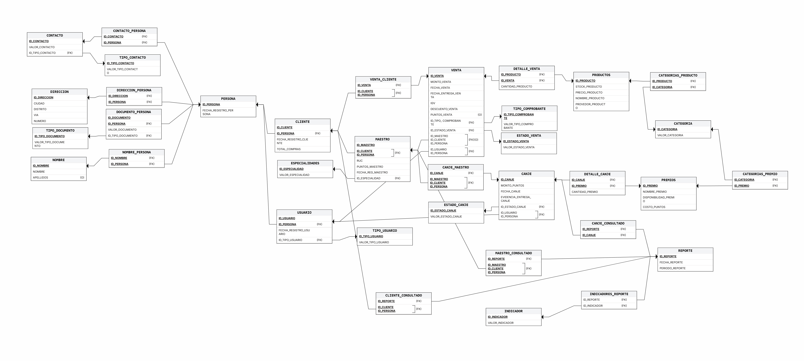

 
[**🔙 Atrás**](../5/5.md) | [**📜 Índice**](../../README.md)

# 5.1.Diseño Lógico: Modulo de Clientes
## 💡 Esquema Relacional: Modulo de Clientes   

## 📘 Diccionario de Datos: Modulo de Clientes   

### 𝄜 Tabla: `PERSONA`

**Descripción:** Representa la información central y general de un individuo en el sistema, sirviendo como la entidad base para clientes, empleados, o cualquier otro tipo de persona. 
**Propósito:** Almacenar datos comunes y fundamentales que se pueden reutilizar en modelos de datos más específicos. 
**Reglas de negocio relevantes:** 
- La información de una persona no puede existir sin su ID_NOMBRE asociado.
- Cada persona debe tener una fecha de registro que indica su antigüedad en el sistema.

| Columna | Clave y/o Restriccion |
|---------|-----------------------|
|ID_PERSONA|PK|
|ID_NOMBRE|FK, UK|

| Columna | Descripción| Propósito| Tipo de dato en el SGBD | Obligatoriedad | Unicidad | Restricciones|
|---------|------------|----------|-------------------------|----------------|----------|--------------|
|ID_PERSONA|Identificador único de cada persona.|Sirve como clave primaria para el modelado de relaciones con otras tablas.|Texto (UUID)|✅|✅|UUID|
|FECHA_REGISTRO_PERSONA|La fecha en la que se creó el registro de la persona.|Permite medir la antigüedad de la persona en el sistema.|Fecha y Hora|✅|❌|DEFAULT NOW()|
|ID_NOMBRE|Clave foránea que enlaza a la tabla de nombres.|Vincula a la persona con su información de nombre y apellidos.|Texto (UUID)|✅|✅|FK a NOMBRE_PERSONA|

### 𝄜 Tabla: `USUARIO`

**Descripción:**  Representa a una persona con acceso a un rol específico dentro del sistema (por ejemplo, empleado, administrador, operador de CRM). 
**Propósito:** Gestionar las credenciales de acceso, permisos y roles de las personas que interactúan con el sistema. 
**Reglas de negocio relevantes:** 
- Un usuario debe estar asociado a una persona existente en el sistema.
- Un usuario debe tener un tipo de usuario definido (empleado, operario, etc.).
- Es una tabla derivada de la tabla PERSONA.

| Columna | Clave y/o Restriccion |
|---------|-----------------------|
|ID_PERSONA|FK, UK|
|ID_USUARIO|PK|

| Columna | Descripción| Propósito| Tipo de dato en el SGBD | Obligatoriedad | Unicidad | Restricciones|
|---------|------------|----------|-------------------------|----------------|----------|--------------|
|ID_USUARIO|Identificador único del usuario.|Identifica junto a ID_PERSONA al usuario.|Texto (UUID)|✅|✅|UUID|
|ID_PERSONA|Clave foránea que enlaza a la tabla PERSONA.|Vincula el registro del usuario con la información personal del individuo.|Texto (UUID)|✅|✅|FK a PERSONA|
|FECHA_REGISTRO_USUARIO|La fecha en la que el usuario fue registrado en el sistema.|Permite analizar la antigüedad de los usuarios.|Fecha y Hora|✅|❌|DEFAULT NOW()|
|ID_TIPO_USUARIO|Clave foránea que enlaza a la tabla TIPO_USUARIO.|Define el rol o tipo de usuario en el sistema.|Texto|✅|❌|FK a TIPO_USUARIO|

### 𝄜 Tabla: `TIPO_USUARIO`

**Descripción:** Almacena los roles predefinidos que un usuario puede tener en el sistema. 
**Propósito:** Proporcionar una lista controlada y estandarizada de los tipos de usuarios para garantizar la consistencia de los datos. 
**Reglas de negocio relevantes:** 
- Un tipo de usuario debe tener un identificador único.
- La lista de tipos de usuario se actualiza rara vez.

| Columna | Clave y/o Restriccion |
|---------|-----------------------|
|ID_TIPO_USUARIO|PK|

| Columna | Descripción| Propósito| Tipo de dato en el SGBD | Obligatoriedad | Unicidad | Restricciones|
|---------|------------|----------|-------------------------|----------------|----------|--------------|
|ID_TIPO_USUARIO|Identificador único del tipo de usuario.|Sirve como clave principal y es referenciado por la tabla USUARIO.|Texto|✅|✅|❌|
|VALOR_TIPO_USUARIO|El nombre o descripción del tipo de usuario.|Proporciona un valor legible para el rol.|Texto|✅|✅|❌|

#### **Lookup Table:**
| Codigo | Valor Esperado|
|--------|---------------|
|TIPO_001|Administrador|
|TIPO_002|Vendedor|
|TIPO_003|Operario de CRM|
|TIPO_004|Operario de Abastecimiento|

### 𝄜 Tabla: `DOCUMENTO_PERSONA`

**Descripción:** Tabla asociativa que relaciona a una persona con su(s) documento(s) de identificación. 
**Propósito:** Almacenar de forma flexible y normalizada los distintos documentos de identificación que puede tener una persona. 
**Reglas de negocio relevantes:** 
- Un documento debe estar asociado a una única persona.
- Una persona puede tener más de un documento (por ejemplo, DNI y carné de extranjería).
- La combinación del tipo de documento y el valor del documento debe ser única para cada persona.

| Columna | Clave y/o Restriccion |
|---------|-----------------------|
|ID_DOCUMENTO|PK|
|ID_PERSONA|FK, PK|
|ID_TIPO_DOCUMENTO|FK|

| Columna | Descripción| Propósito| Tipo de dato en el SGBD | Obligatoriedad | Unicidad | Restricciones|
|---------|------------|----------|-------------------------|----------------|----------|--------------|
|ID_DOCUMENTO|Identificador único del registro del documento.|Sirve como clave primaria para esta tabla.|Texto (UUID)|✅|✅|UUID|
|ID_PERSONA|Clave foránea que enlaza a la tabla PERSONA.|Vincula el documento a la persona a la que pertenece.|Texto (UUID)|✅|✅|FK a PERSONA|
|ID_TIPO_DOCUMENTO|El tipo de documento de identificación.|Permite clasificar el documento.|Texto (UUID)|✅|❌|DNI', 'RUC', 'Carné de Extranjería'|
|VALOR_DOCUMENTO|El número o código del documento.|Almacena el identificador único del documento.|Texto|✅|✅|❌|

#### **Tabla Asociativa:**
| Clave Foranea A | Clave Foranea B|Relacion|
|-----------------|----------------|--------|
|ID_PERSONA|ID_DOCUMENTO|1-N|
|ID_TIPO_DOCUMENTO|ID_DOCUMENTO|1-N|

### 𝄜 Tabla: `TIPO_DOCUMENTO`

**Descripción:** Almacena los tipos de documentos de identificación que son válidos en el sistema. 
**Propósito:** Proveer una lista estandarizada y consistente de documentos para evitar errores en la entrada de datos. 
**Reglas de negocio relevantes:** 
- Un tipo de documento debe tener un identificador único.
- Esta tabla es una entidad de referencia (lookup table), por lo que su contenido es estático y raramente se actualiza.

| Columna | Clave y/o Restriccion |
|---------|-----------------------|
|ID_TIPO_DOCUMENTO|PK|

| Columna | Descripción| Propósito| Tipo de dato en el SGBD | Obligatoriedad | Unicidad | Restricciones|
|---------|------------|----------|-------------------------|----------------|----------|--------------|
|ID_TIPO_DOCUMENTO|Identificador único del tipo de documento.|Sirve como clave primaria y es referenciado por otras tablas.|Texto|✅|✅|❌|
|VALOR_TIPO_DOCUMENTO|El nombre o descripción del tipo de documento.|Proporciona un valor legible para el tipo de documento.|Texto|✅|✅|❌|

#### **Lookup Table:**
| Codigo | Valor Esperado|
|--------|---------------|
|DNI|Documento Nacional de Identidad|
|RUC|Registro Único de Contribuyentes|
|CE|Carné de Extranjería|

### 𝄜 Tabla: `NOMBRE`

**Descripción:** Almacena los nombres de pila y los apellidos de las personas en el sistema. 
**Propósito:** Centralizar la información de nombres para evitar duplicación de datos y permitir que sea referenciada por la tabla PERSONA. 
**Reglas de negocio relevantes:**
- Un registro de nombre debe ser único.
- Un registro de nombre puede no tener apellidos, ya que la columna APELLIDOS es opcional.

| Columna | Clave y/o Restriccion |
|---------|-----------------------|
|ID_NOMBRE|PK|
|APELLIDOS|OPCIONAL|

| Columna | Descripción| Propósito| Tipo de dato en el SGBD | Obligatoriedad | Unicidad | Restricciones|
|---------|------------|----------|-------------------------|----------------|----------|--------------|
|ID_NOMBRE|Identificador único del registro de nombre.|Sirve como clave primaria para esta tabla.|Texto (UUID)|✅|✅|UUID|
|NOMBRE|El nombre de pila.|Permite la identificación básica de la persona.|Texto|✅|❌|❌|
|APELLIDOS|Los apellidos de la persona.|Complementa la identificación.|Texto|❌|❌|OPCIONAL|

### 𝄜 Tabla: `NOMBRE_PERSONA`

**Descripción:** Tabla asociativa que relaciona a una Persona con su Nombre. 
**Propósito:** Modelar la relación entre personas y nombres de forma flexible, permitiendo que una persona tenga uno o más nombres o que un nombre sea utilizado por varias personas. 
**Reglas de negocio relevantes:** 
- Un registro en esta tabla debe estar asociado a una persona existente.
- Un registro en esta tabla debe estar asociado a un nombre existente.

| Columna | Clave y/o Restriccion |
|---------|-----------------------|
|ID_NOMBRE|PK, FK|
|ID_PERSONA|PK, FK|

| Columna | Descripción| Propósito| Tipo de dato en el SGBD | Obligatoriedad | Unicidad | Restricciones|
|---------|------------|----------|-------------------------|----------------|----------|--------------|
|ID_NOMBRE|Clave foránea que enlaza a la tabla NOMBRE.|Vincula el registro asociativo con la entidad NOMBRE.|Texto (UUID)|✅|✅|FK a NOMBRE|
|ID_PERSONA|Clave foránea que enlaza a la tabla PERSONA.|Vincula el registro asociativo con la entidad PERSONA.|Texto (UUID)|✅|✅|FK a PERSONA|

#### **Tabla Asociativa:**
| Clave Foranea A | Clave Foranea B|Relacion|
|-----------------|----------------|--------|
|ID_PERSONA|ID_NOMBRE|1-1|

### 𝄜 Tabla: `DIRECCION`

**Descripción:** Almacena la información de la ubicación geográfica de una persona.           
**Propósito:** Centralizar y estandarizar los datos de dirección para la logística de entrega y el análisis geográfico de los clientes. 
**Reglas de negocio relevantes:** 
- Un registro de dirección debe ser único.
- La combinación de los atributos de una dirección (calle, número, distrito, etc.) debe ser única.

| Columna | Clave y/o Restriccion |
|---------|-----------------------|
|ID_DIRECCION|PK|

| Columna | Descripción| Propósito| Tipo de dato en el SGBD | Obligatoriedad | Unicidad | Restricciones|
|---------|------------|----------|-------------------------|----------------|----------|--------------|
|ID_DIRECCION|Identificador único del registro de dirección.|Sirve como clave primaria para esta tabla.|Texto (UUID)|✅|✅|UUID|
|CIUDAD|Nombre de la ciudad.|Ubica al cliente para el análisis geográfico.|Texto|✅|❌|❌|
|DISTRITO|Nombre del distrito.|Delimita la ubicación dentro de una ciudad.|Texto|✅|❌|❌|
|VIA|Nombre de la calle, avenida, etc.|Identifica la vía de acceso.|Texto|✅|❌|❌|
|NUMERO|El número de la propiedad o lote.|Precisa la ubicación del inmueble.|Texto|✅|❌|❌|

### 𝄜 Tabla: `DIRECCION_PERSONA`

**Descripción:** Tabla asociativa que relaciona a una persona con su(s) dirección(es) registrada(s).                                  
**Propósito:** Almacenar de forma flexible y normalizada las distintas direcciones que puede tener una persona (por ejemplo, dirección de casa y dirección de trabajo).                     
**Reglas de negocio relevantes:** 
- Un registro en esta tabla debe estar asociado a una persona y a una dirección válidas.
- Una persona puede tener múltiples direcciones.
- Una dirección puede ser utilizada por varias personas (por ejemplo, los miembros de una misma familia).

| Columna | Clave y/o Restriccion |
|---------|-----------------------|
|ID_DIRECCION|PK|
|ID_PERSONA|FK|

| Columna | Descripción| Propósito| Tipo de dato en el SGBD | Obligatoriedad | Unicidad | Restricciones|
|---------|------------|----------|-------------------------|----------------|----------|--------------|
|ID_DIRECCION|Clave foránea que enlaza a la tabla DIRECCION.|Vincula la dirección al registro asociativo.|Texto (UUID)|✅|✅|FK a DIRECCION|
|ID_PERSONA|Clave foránea que enlaza a la tabla PERSONA.|Vincula la persona al registro asociativo.|Texto (UUID)|✅|✅|FK a PERSONA|

#### **Tabla Asociativa:**
| Clave Foranea A | Clave Foranea B|Relacion|
|-----------------|----------------|--------|
|ID_DIRECCION|ID_PERSONA|N-M|

### 𝄜 Tabla: `CONTACTO`

**Descripción:** Almacena los diferentes tipos de contacto que existen en el sistema.                            
**Propósito:** Centralizar y estandarizar los medios de comunicación (por ejemplo, teléfono, correo electrónico, WhatsApp) para ser utilizados por múltiples entidades, como PERSONA.                       
**Reglas de negocio relevantes:** 
- Un registro de contacto debe ser único.
- Un registro de contacto debe tener un tipo y un valor asociados.

| Columna | Clave y/o Restriccion |
|---------|-----------------------|
|ID_CONTACTO|PK|
|ID_TIPO_CONTACTO|FK|

| Columna | Descripción| Propósito| Tipo de dato en el SGBD | Obligatoriedad | Unicidad | Restricciones|
|---------|------------|----------|-------------------------|----------------|----------|--------------|
|ID_CONTACTO|Identificador único del registro de contacto.|Sirve como clave primaria para esta tabla.|Texto (UUID)|✅|✅|UUID|
|ID_TIPO_CONTACTO|Clave foránea que enlaza a la tabla TIPO_CONTACTO.|Clasifica el contacto para una mejor gestión.|Texto (UUID)|✅|❌|FK a TIPO_CONTACTO|
|VALOR_CONTACTO|El dato de contacto.|Almacena el valor específico del contacto (por ejemplo, el número de teléfono o la dirección de correo).|Texto|✅|❌|❌|

### 𝄜 Tabla: `CONTACTO_PERSONA`

**Descripción:** Tabla asociativa que relaciona una Persona con su(s) registro(s) de Contacto.                       
**Propósito:** Modelar la relación de muchos a muchos (N:M) entre personas y contactos, permitiendo que una persona tenga múltiples métodos de contacto y que un contacto (ej. un teléfono) pueda ser compartido por varias personas.                             
**Reglas de negocio relevantes:** 
- Un registro en esta tabla debe asociar una persona con un contacto válido.
- La combinación de ID_PERSONA e ID_CONTACTO debe ser única para cada registro.

| Columna | Clave y/o Restriccion |
|---------|-----------------------|
|ID_PERSONA|PK, FK|
|ID_CONTACTO|PK, FK|

| Columna | Descripción| Propósito| Tipo de dato en el SGBD | Obligatoriedad | Unicidad | Restricciones|
|---------|------------|----------|-------------------------|----------------|----------|--------------|
|ID_CONTACTO|Clave foránea que enlaza a la tabla PERSONA.|Vincula el registro asociativo con la persona a la que pertenece.|Texto (UUID)|✅|✅|FK a PERSONA|
|ID_PERSONA|Clave foránea que enlaza a la tabla CONTACTO.|Vincula el registro asociativo con la información de contacto.|Texto (UUID)|✅|✅|FK a CONTACTO|

#### **Tabla Asociativa:**
| Clave Foranea A | Clave Foranea B|Relacion|
|-----------------|----------------|--------|
|ID_CONTACTO|ID_PERSONA|N-M|

### 𝄜 Tabla: `TIPO_CONTACTO`

**Descripción:** Almacena los distintos tipos de medios de comunicación para los contactos de las personas.                                    
**Propósito:** Proveer una lista estandarizada y consistente de los tipos de contacto para evitar errores de entrada de datos y facilitar la clasificación.                           
**Reglas de negocio relevantes:** 
- Un tipo de contacto debe tener un identificador único.
- Esta tabla es una entidad de referencia (lookup table), por lo que su contenido es estático y raramente se actualiza.

| Columna | Clave y/o Restriccion |
|---------|-----------------------|
|ID_TIPO_CONTACTO|PK|

| Columna | Descripción| Propósito| Tipo de dato en el SGBD | Obligatoriedad | Unicidad | Restricciones|
|---------|------------|----------|-------------------------|----------------|----------|--------------|
|ID_TIPO_CONTACTO|Identificador único del tipo de contacto.|Sirve como clave primaria y es referenciado por otras tablas.|Texto (UUID)|✅|✅|UUID|
|VALOR_TIPO_CONTACTO|El nombre o descripción del tipo de contacto.|Proporciona un valor legible para el tipo de contacto.|Texto|✅|✅|❌|

#### **Lookup Table:**
| Codigo | Valor Esperado|
|--------|---------------|
|TEL|Teléfono|
|EMAIL|Correo electrónico|
|WA|WhatsApp|

### 𝄜 Tabla: `CLIENTE`

**Descripción:**  Representa a una persona en su rol de comprador o consumidor de los productos y servicios de la empresa.                          
**Propósito:** Almacenar datos específicos de las personas que realizan transacciones, permitiendo el seguimiento de su comportamiento de compra y la implementación de programas de fidelización.                        
**Reglas de negocio relevantes:** 
- Un cliente debe ser una persona registrada en el sistema.
- El registro de un cliente debe incluir la fecha en que se registró por primera vez como comprador.
- La tabla CLIENTE es una especialización de la tabla PERSONA.

| Columna | Clave y/o Restriccion |
|---------|-----------------------|
|ID_CLIENTE|PK|
|ID_PERSONA|FK, PK|

| Columna | Descripción| Propósito| Tipo de dato en el SGBD | Obligatoriedad | Unicidad | Restricciones|
|---------|------------|----------|-------------------------|----------------|----------|--------------|
|ID_CLIENTE|Identificador único del registro de cliente.|Sirve como clave principal para las transacciones de compra y canje.|Texto (UUID)|✅|✅|UUID|
|ID_PERSONA|Clave foránea que enlaza a la tabla PERSONA.|Vincula el registro del cliente a los datos personales de la persona.|Texto (UUID)|✅|✅|FK a PERSONA|
|FECHA_REGISTRO_CLIENTE|La fecha en que la persona fue registrada por primera vez como cliente.|Permite medir la antigüedad y lealtad del cliente.|Fecha y Hora|✅|❌|DEFAULT NOW()|
|TOTAL_COMPRAS|El monto total acumulado de las compras del cliente.|Proporciona un resumen de la actividad de compra para fines de análisis.|Número Decimal|✅|❌|DEFAULT 0.0|

### 𝄜 Tabla: `MAESTRO`

**Descripción:** Representa la especialización de un cliente que es un maestro de obra.                               
**Propósito:** Almacenar los datos específicos de los maestros para el programa de fidelidad y la acumulación de puntos por sus compras o por actuar como intermediarios.                
**Reglas de negocio relevantes:** 
- Un maestro debe ser un cliente registrado, lo que lo convierte en un subtipo de la entidad CLIENTE.
- El ID de maestro es el mismo que el ID de cliente, lo que modela la relación de herencia.
- Los puntos acumulados deben ser un valor numérico.

| Columna | Clave y/o Restriccion |
|---------|-----------------------|
|ID_MAESTRO|PK|
|ID_CLIENTE|FK, PK|
|ID_PERSONA|FK, PK|

| Columna | Descripción| Propósito| Tipo de dato en el SGBD | Obligatoriedad | Unicidad | Restricciones|
|---------|------------|----------|-------------------------|----------------|----------|--------------|
|ID_MAESTRO|Identificador único del registro del maestro.|Sirve como clave principal para esta tabla.|Texto (UUID)|✅|✅|UUID|
|ID_CLIENTE|Clave foránea que enlaza a la tabla CLIENTE.|Vincula el registro del maestro con el registro de cliente asociado.|Texto (UUID)|✅|✅|FK a CLIENTE|
|ID_PERSONA|Clave foránea que enlaza a la tabla PERSONA.|Vincula al maestro con la información personal de la persona.|Texto (UUID)|✅|✅|FK a PERSONA|
|RUC|El número de Registro Único de Contribuyentes.|Identificación fiscal para la facturación.|Texto|✅|✅|❌|
|PUNTOS_MAESTRO|El saldo actual de puntos del maestro.|Permite gestionar el programa de recompensas.|Número Entero|✅|❌|DEFAULT 0|

### 𝄜 Tabla: `ESPECIALIDADES`

**Descripción:** Almacena los distintos tipos de oficios o especialidades de los maestros de obra.                                     
**Propósito:** Proveer una lista estandarizada y consistente de las especialidades para clasificar a los maestros, facilitando la personalización de las ofertas y la segmentación de la clientela.                               
**Reglas de negocio relevantes:** 
- Una especialidad debe tener un identificador único.
- Esta tabla es una entidad de referencia (lookup table), por lo que su contenido es estático y raramente se actualiza.

| Columna | Clave y/o Restriccion |
|---------|-----------------------|
|ID_ESPECIALIDAD|PK|

| Columna | Descripción| Propósito| Tipo de dato en el SGBD | Obligatoriedad | Unicidad | Restricciones|
|---------|------------|----------|-------------------------|----------------|----------|--------------|
|ID_ESPECIALIDAD|Identificador único del tipo de especialidad.|Sirve como clave primaria y es referenciado por la tabla MAESTRO.|Texto (UUID)|✅|✅|UUID|
|VALOR_ESPECIALIDAD|El nombre o descripción de la especialidad.|Proporciona un valor legible para el tipo de especialidad.|Texto|✅|✅|❌|

#### **Lookup Table:**
| Codigo | Valor Esperado|
|--------|---------------|
|AL|Albañilería|
|GF|Gasfiteria|
|EL|Electricidad|

### 𝄜 Tabla: `VENTA`

**Descripción:** Representa una transacción comercial en la que un cliente adquiere uno o más productos de la ferretería.                                
**Propósito:** Registrar y auditar las transacciones de compra, sirviendo como base para el análisis de ventas, el control de inventario y la emisión de comprobantes de pago.                          
**Reglas de negocio relevantes:** 
- Toda venta debe tener un identificador único.
- Debe asociarse a un cliente, pero la asociación con un intermediario (Maestro) es opcional.
- El Monto, IGV, y Descuento son valores obligatorios para el registro financiero.

| Columna | Clave y/o Restriccion |
|---------|-----------------------|
|ID_VENTA|PK|
|ID_CLIENTE|FK|
|ID_MAESTRO|FK|
|ID_TIPO_COMPROBANTE|FK|
|ID_ESTADO_VENTA|FK|
|ID_USUARIO(VENDEDOR)|FK|

| Columna | Descripción| Propósito| Tipo de dato en el SGBD | Obligatoriedad | Unicidad | Restricciones|
|---------|------------|----------|-------------------------|----------------|----------|--------------|
|ID_VENTA|Identificador único de cada venta.|Sirve como clave primaria para el modelado de relaciones con otras tablas.|Texto (UUID)|✅|✅|UUID|
|ID_TIPO_ COMPROBANTE|Clave foránea que enlaza a la tabla TIPO_COMPROBANTE.|Define el tipo de documento fiscal emitido (e.g., Boleta, Factura).|Texto (UUID)|✅|❌|FK a TIPO_COMPROBANTE|
|ID_ESTADO_VENTA|Clave foránea que enlaza a la tabla ESTADO_VENTA.|Define la etapa actual de la venta (e.g., Pagada, Cancelada).|Texto (UUID)|✅|❌|FK a ESTADO_VENTA|
|ID_MAESTRO|Denota si el maestro fue intermediario de la venta.|Vincula la venta al maestro que actuó como intermediario.|Texto (UUID)|❌|❌|FK a MAESTRO|
|MONTO_VENTA|El valor total de la venta, sin incluir IGV.|Almacena el valor base de la transacción.|Número Decimal|✅|❌(MIN 0.00)||
|FECHA_VENTA|La fecha en que se concretó la venta.|Permite registrar el momento preciso de la transacción.|Fecha y Hora|✅|❌|DEFAULT NOW()|
|FECHA_ENTREGA_VENTA|La fecha programada o real de la entrega de los productos.|Permite hacer seguimiento de la logística.|Fecha|❌|❌|❌|
|IGV|El Impuesto General a las Ventas aplicado.|Valor del impuesto para fines contables.|Número Decimal|✅|❌|CHECK (IGV >= 0)|
|DESCUENTO_VENTA|El valor total del descuento aplicado a la venta.|Permite un análisis preciso de los precios y márgenes de ganancia.|Número Decimal|✅|❌|DEFAULT 0.00|
|PUNTOS_VENTA|Los puntos que el maestro obtiene por la venta.|Permite la adición de puntos a la entidad maestro por ser intermediario.|Número Entero|❌|❌|❌|
|ID_USUARIO(VENDEDOR)|Clave foránea que enlaza al vendedor/empleado.|Atribuye la venta a un vendedor específico para fines de comisión.|Texto (UUID)|✅|❌|FK a USUARIO(VENDEDOR)|

### 𝄜 Tabla: `VENTA_CLIENTE`

**Descripción:** Tabla asociativa que relaciona una Venta con un Cliente.                             
**Propósito:** Modelar la relación entre transacciones de venta y los clientes que las realizan, permitiendo un seguimiento del historial de compras.                            
**Reglas de negocio relevantes:** 
- Toda venta debe estar asociada a un único cliente.
- Un cliente puede tener múltiples ventas.

| Columna | Clave y/o Restriccion |
|---------|-----------------------|
|ID_VENTA|FK, PK|
|ID_CLIENTE|FK, PK|

| Columna | Descripción| Propósito| Tipo de dato en el SGBD | Obligatoriedad | Unicidad | Restricciones|
|---------|------------|----------|-------------------------|----------------|----------|--------------|
|ID_VENTA|Clave primaria y foránea que enlaza a la tabla VENTA.|Asegura que la tabla de ventas tenga una relación de uno a uno.|Texto (UUID)|✅|✅|FK a VENTA|
|ID_CLIENTE|Clave foránea que enlaza a la tabla CLIENTE.|Vincula la transacción de venta con el cliente que la realizó.|Texto (UUID)|✅|❌|FK a CLIENTE|

#### **Tabla Asociativa:**
| Clave Foranea A | Clave Foranea B|Relacion|
|-----------------|----------------|--------|
|ID_VENTA|ID_CLIENTE|1-1|
|ID_CLIENTE|ID_VENTA|N-1|

### 𝄜 Tabla: `PRODUCTOS`

**Descripción:** Representa los bienes tangibles que la ferretería tiene para la venta.                           
**Propósito:** Gestionar el inventario, registrar las ventas y facilitar la búsqueda de productos por parte de los clientes y el personal.                        
**Reglas de negocio relevantes:** 
- Un producto debe tener un código de identificación único.
- La cantidad en stock de un producto no puede ser negativa.
- Todo producto debe tener un nombre y un precio.

| Columna | Clave y/o Restriccion |
|---------|-----------------------|
|ID_PRODUCTO|PK|

| Columna | Descripción| Propósito| Tipo de dato en el SGBD | Obligatoriedad | Unicidad | Restricciones|
|---------|------------|----------|-------------------------|----------------|----------|--------------|
|ID_PRODUCTO|Identificador único del producto.|Permite el modelado de relaciones con otras tablas.|Texto (UUID)|✅|✅|UUID|
|STOCK_PRODUCTO|El número de unidades en stock.|Monitorear la disponibilidad del producto para la venta.|Número Entero|✅|❌|CHECK (valor >= 0)|
|PRECIO_PRODUCTO|El precio de venta al público.|Determina el costo para el cliente en las transacciones de venta.|Número Decimal|✅|❌|CHECK (valor > 0)|
|NOMBRE_PRODUCTO|El nombre del producto.|Permite identificar el producto para el inventario, ventas y la búsqueda.|Texto|✅|❌|❌|
|PROVEDOR_PRODUCTO|El proveedor o fabricante del producto.|Identifica el origen del producto para fines de compra y gestión.|Texto|✅|❌|❌|

### 𝄜 Tabla: `DETALLE_VENTA`

**Descripción:** Tabla asociativa que representa cada producto individual incluido en una venta. Es la línea de detalle de una factura o boleta.                               
**Propósito:** Desglosar una transacción de venta en sus componentes, permitiendo un seguimiento preciso de qué productos y en qué cantidad se vendieron en una transacción específica.                             
**Reglas de negocio relevantes:** 
- Un DETALLE_VENTA no puede existir sin una VENTA y un PRODUCTO asociados.
- La combinación de ID_PRODUCTO e ID_VENTA debe ser única, ya que un producto solo puede aparecer una vez por cada venta.

| Columna | Clave y/o Restriccion |
|---------|-----------------------|
|ID_PRODUCTO|FK, PK|
|ID_VENTA|FK, PK|

| Columna | Descripción| Propósito| Tipo de dato en el SGBD | Obligatoriedad | Unicidad | Restricciones|
|---------|------------|----------|-------------------------|----------------|----------|--------------|
|ID_PRODUCTO|Clave foránea que enlaza a la tabla PRODUCTO.|Vincula la línea de detalle al producto que se vendió.|Texto (UUID)|✅|✅|FK a PRODUCTO|
|ID_VENTA|Clave foránea que enlaza a la tabla VENTA.|Vincula la línea de detalle a la transacción de venta a la que pertenece.|Texto (UUID)|✅|✅|FK a VENTA|
|CANTIDAD_PRODUCTO|Número de unidades del producto vendidas en esta línea de detalle.|Permite el cálculo del subtotal y el control del stock.|Número Entero|✅|❌|CHECK (valor > 0)|

#### **Tabla Asociativa:**
| Clave Foranea A | Clave Foranea B|Relacion|
|-----------------|----------------|--------|
|ID_VENTA|ID_PRODUCTO|N-M|

### 𝄜 Tabla: `CATEGORIA`

**Descripción:** Almacena la clasificación de los productos en un nivel superior.                                 
**Propósito:** Proporcionar una forma estándar de agrupar y organizar los productos para una mejor gestión del inventario y una búsqueda más fácil.                    
**Reglas de negocio relevantes:** 
- Toda categoría debe tener un identificador único.
- Esta tabla es una entidad de referencia (lookup table), por lo que su contenido es estático y raramente se actualiza.

| Columna | Clave y/o Restriccion |
|---------|-----------------------|
|ID_CATEGORIA|PK|

| Columna | Descripción| Propósito| Tipo de dato en el SGBD | Obligatoriedad | Unicidad | Restricciones|
|---------|------------|----------|-------------------------|----------------|----------|--------------|
|ID_CATEGORIA|Identificador único de la categoría.|Sirve como clave primaria y es referenciado por la tabla PRODUCTOS.|Texto (UUID)|✅|✅|UUID|
|VALOR_CATEGORIA|El nombre de la categoría.|Proporciona un valor legible para la clasificación del producto.|Texto|✅|✅|❌|

#### **Lookup Table:**
| Codigo | Valor Esperado|
|--------|---------------|
|HER|Herramientas|
|PINT|Pinturas|
|ELEC|Eléctricos|

### 𝄜 Tabla: `CATEGORIAS_PRODUCTO`

**Descripción:** Tabla asociativa que relaciona los Productos con sus Categorías.  
**Propósito:** Modelar la relación de muchos a muchos (N:M) entre PRODUCTOS y CATEGORIAS, permitiendo que un producto pertenezca a más de una categoría.               
**Reglas de negocio relevantes:** 
- Un registro en esta tabla debe asociar un producto a una categoría.
- La combinación de ID_PRODUCTO e ID_CATEGORIA debe ser única para evitar duplicados.

| Columna | Clave y/o Restriccion |
|---------|-----------------------|
|ID_PRODUCTO|FK, PK|
|ID_CATEGORIA|FK, PK|

| Columna | Descripción| Propósito| Tipo de dato en el SGBD | Obligatoriedad | Unicidad | Restricciones|
|---------|------------|----------|-------------------------|----------------|----------|--------------|
|ID_PRODUCTO|Clave foránea que enlaza a la tabla PRODUCTO.|Vincula la categoría al producto.|Texto (UUID)|✅|✅|FK a PRODUCTO|
|ID_CATEGORIA|Clave foránea que enlaza a la tabla CATEGORIA.|Vincula el producto a la categoría.|Texto (UUID)|✅|✅|FK a CATEGORIA|

#### **Tabla Asociativa:**
| Clave Foranea A | Clave Foranea B|Relacion|
|-----------------|----------------|--------|
|ID_PRODUCTO|ID_CATEGORIA|N-M|

### 𝄜 Tabla: `CANJE`

**Descripción:** Representa una transacción en la que un cliente (maestro) utiliza sus puntos de fidelidad para obtener uno o varios premios.                                    
**Propósito:** Registrar y auditar el proceso de canje, desde la solicitud hasta la entrega del premio.                          
**Reglas de negocio relevantes:** 
- Un canje debe tener un identificador único.
- Debe estar asociado a un usuario que realiza el canje.
- El monto de puntos debe ser un valor numérico.
- La evidencia de entrega es opcional, ya que puede estar pendiente.

| Columna | Clave y/o Restriccion |
|---------|-----------------------|
|ID_CANJE|PK|
|ID_ESTADO_CANJE|FK|
|ID_USUARIO|FK|

| Columna | Descripción| Propósito| Tipo de dato en el SGBD | Obligatoriedad | Unicidad | Restricciones|
|---------|------------|----------|-------------------------|----------------|----------|--------------|
|ID_CANJE|Identificador único del canje.|Sirve como clave primaria para esta tabla.|Texto (UUID)|✅|✅|UUID|
|MONTO_PUNTOS|El total de puntos que el cliente gastó en el canje.|Permite el cálculo del saldo de puntos.|Número Entero|✅|❌|CHECK (valor >= 0)|
|FECHA_CANJE|La fecha en que se solicitó el canje.|Registrar el momento exacto de la transacción.|Fecha y Hora|✅|❌|DEFAULT NOW()|
|EVIDENCIA_ENTREGA_CANJE|Un registro que prueba la entrega del premio.|Auditar el proceso de entrega y resolver disputas.|Texto|❌|❌|❌|
|ID_ESTADO_CANJE|Clave foránea que enlaza a la tabla ESTADO_CANJE.|Indica la etapa actual del canje (e.g., Pendiente, Entregado).|Texto (UUID)|✅|❌|FK a ESTADO_CANJE|
|ID_USUARIO|Clave foránea que enlaza a la tabla USUARIO.|Vincula el canje con la persona que lo realizó.|Texto (UUID)|✅|❌|FK a USUARIO|

### 𝄜 Tabla: `CANJE_MAESTRO`

**Descripción:** Definición breve en términos de negocio.                                     
**Propósito:** Razón de ser del objeto dentro del modelo y del sistema.                               
**Reglas de negocio relevantes:** Reglas que justifican restricciones (PK, FK, UK, NN, CHECK, DEFAULT, etc.).

| Columna | Clave y/o Restriccion |
|---------|-----------------------|
|ID_CANJE|PK|
|ID_MAESTRO|FK|

| Columna | Descripción| Propósito| Tipo de dato en el SGBD | Obligatoriedad | Unicidad | Restricciones|
|---------|------------|----------|-------------------------|----------------|----------|--------------|
|ID_CANJE|Clave foránea que enlaza a la tabla CANJE.|Vincula el registro de canje con la transacción de canje a la que pertenece.|Texto (UUID)|✅|✅|FK a CANJE|
|ID_MAESTRO|Clave foránea que enlaza a la tabla MAESTRO.|Vincula el canje con el maestro que lo realizó.|Texto (UUID)|✅|❌|FK a MAESTRO|

#### **Tabla Asociativa:**
| Clave Foranea A | Clave Foranea B|Relacion|
|-----------------|----------------|--------|
|ID_CANJE|ID_MAESTRO|N-1|

### 𝄜 Tabla: `PREMIOS`

**Descripción:** Representa los bienes y servicios que los maestros pueden obtener a través del canje de puntos acumulados en el programa de fidelización.
**Propósito:** Almacenar los datos de los premios disponibles, como su nombre, costo en puntos y disponibilidad, para ser ofrecidos a los clientes en el programa de recompensas.
**Reglas de negocio relevantes:**
- Un premio debe tener un identificador único.
- La disponibilidad de un premio debe ser un valor numérico mayor o igual a cero.
- El costo en puntos de un premio no puede ser un valor negativo.
- El nombre del premio es único.

| Columna | Clave y/o Restriccion |
|---------|-----------------------|
|ID_PREMIO|PK|

| Columna | Descripción| Propósito| Tipo de dato en el SGBD | Obligatoriedad | Unicidad | Restricciones|
|---------|------------|----------|-------------------------|----------------|----------|--------------|
|ID_PREMIO|Identificador único del premio.|Sirve como clave primaria para esta tabla.|Texto (UUID)|✅|✅|UUID|
|NOMBRE_PREMIO|El nombre del premio.|Permite identificar el premio de forma clara para el cliente.|Texto|✅|✅|❌|
|DISPONIBILIDAD_PREMIO|El número de unidades del premio disponibles para canje.|Permite el control del inventario de premios.|Número Entero|✅|❌|CHECK (valor >= 0)|
|COSTO_PUNTOS|El valor del premio en puntos de fidelidad.|Permite calcular los puntos necesarios para el canje.|Número Entero|✅|❌|CHECK (valor >= 0)|

### 𝄜 Tabla: `DETALLE_CANJE`

**Descripción:** Tabla asociativa que registra cada premio canjeado dentro de una transacción de canje.
**Propósito:** Desglosar una transacción de canje en sus componentes, permitiendo un seguimiento preciso de los premios y sus cantidades.
**Reglas de negocio relevantes:**
- Un registro de detalle no puede existir sin un ID_CANJE y un ID_PREMIO asociados.
- La combinación de ID_CANJE e ID_PREMIO es una clave primaria compuesta.

| Columna | Clave y/o Restriccion |
|---------|-----------------------|
|ID_CANJE|PK, FK|
|ID_PREMIO|PK, FK|

| Columna | Descripción| Propósito| Tipo de dato en el SGBD | Obligatoriedad | Unicidad | Restricciones|
|---------|------------|----------|-------------------------|----------------|----------|--------------|
|ID_CANJE|Clave foránea que enlaza a la tabla CANJE.|Vincula el detalle del canje a la transacción general.|Texto (UUID)|✅|✅|FK a CANJE|
|ID_PREMIO|Clave foránea que enlaza a la tabla PREMIOS.|Vincula el detalle del canje con el premio específico.|Texto (UUID)|✅|✅|FK a PREMIOS|
|CANTIDAD_PREMIO|Número de unidades del premio canjeadas en esta transacción.|Permite el cálculo del costo total en puntos.|Número Entero|✅|❌|CHECK (valor > 0)|

#### **Tabla Asociativa:**
| Clave Foranea A | Clave Foranea B|Relacion|
|-----------------|----------------|--------|
|ID_CANJE|ID_PREMIO|N:M|

### 𝄜 Tabla: `CATEGORIAS_PREMIO`

**Descripción:** Tabla asociativa que relaciona las categorías de premios con los premios individuales.
**Propósito:** Modelar la relación de muchos a muchos (N:M) entre premios y categorías, permitiendo que un premio pertenezca a múltiples categorías.
**Reglas de negocio relevantes:**
- Un registro de categoría de premio debe estar asociado a una categoría y a un premio existentes.
- La combinación de ID_CATEGORIA y ID_PREMIO es una clave primaria compuesta para evitar duplicados.

| Columna | Clave y/o Restriccion |
|---------|-----------------------|
|ID_CATEGORIA|PK, FK|
|ID_PREMIO|PK, FK|

| Columna | Descripción| Propósito| Tipo de dato en el SGBD | Obligatoriedad | Unicidad | Restricciones|
|---------|------------|----------|-------------------------|----------------|----------|--------------|
|ID_CATEGORIA|Clave foránea que enlaza a la tabla CATEGORIAS.|Vincula el premio a su categoría.|Texto (UUID)|✅|✅|FK a CATEGORIAS|
|ID_PREMIO|Clave foránea que enlaza a la tabla PREMIOS.|Vincula la categoría al premio.|Texto (UUID)|✅|✅|FK a PREMIOS|

#### **Tabla Asociativa:**
| Clave Foranea A | Clave Foranea B|Relacion|
|-----------------|----------------|--------|
|ID_CATEGORIA|ID_PREMIO|N:M|

### 𝄜 Tabla: `ESTADO_CANJE`

**Descripción:** Almacena los distintos estados en los que puede encontrarse una transacción de canje.
**Propósito:** Proporcionar una lista estandarizada y consistente de los estados de un canje para facilitar el seguimiento y la gestión de la entrega de premios.
**Reglas de negocio relevantes:**
- Un estado de canje debe tener un identificador único.
- Esta tabla es una entidad de referencia (lookup table), por lo que su contenido es estático y raramente se actualiza.

| Columna | Clave y/o Restriccion |
|---------|-----------------------|
|ID_ESTADO_CANJE|PK|

| Columna | Descripción| Propósito| Tipo de dato en el SGBD | Obligatoriedad | Unicidad | Restricciones|
|---------|------------|----------|-------------------------|----------------|----------|--------------|
|ID_ESTADO_CANJE|Identificador único del estado de canje.|Sirve como clave primaria y es referenciado por la tabla CANJE.|Texto (UUID)|✅|✅|UUID|
|VALOR_ESTADO_CANJE|El nombre o descripción del estado.|Proporciona un valor legible para el estado del canje.|Texto|✅|✅|❌|

#### **Lookup Table:**
| Codigo | Valor Esperado|
|--------|---------------|
|SOLICITADO|Solicitado|
|ENVIADO|Enviado|
|ENTREGADO|Entregado|
|CANCELADO|Cancelado|

### 𝄜 Tabla: `TIPO_COMPROBANTE`

**Descripción:** Almacena los distintos tipos de documentos fiscales que se pueden emitir en una venta.
**Propósito:** Proporcionar una lista estandarizada y consistente de los tipos de comprobantes para garantizar la correcta gestión contable y legal de las transacciones.
**Reglas de negocio relevantes:**
- Un tipo de comprobante debe tener un identificador único.
- Esta tabla es una entidad de referencia (lookup table), por lo que su contenido es estático y raramente se actualiza.

| Columna | Clave y/o Restriccion |
|---------|-----------------------|
|ID_TIPO_COMPROBANTE|PK|

| Columna | Descripción| Propósito| Tipo de dato en el SGBD | Obligatoriedad | Unicidad | Restricciones|
|---------|------------|----------|-------------------------|----------------|----------|--------------|
|ID_TIPO_COMPROBANTE|Identificador único del tipo de comprobante.|Sirve como clave primaria y es referenciado por la tabla VENTA.|Texto (UUID)|✅|✅|UUID|
|VALOR_TIPO_COMPROBANTE|El nombre o descripción del tipo de comprobante.|Proporciona un valor legible para el tipo de documento.|Texto|✅|✅|❌|

#### **Lookup Table:**
| Codigo | Valor Esperado|
|--------|---------------|
|BOL|Boleta|
|FAC|Factura|
|TIK|Ticket|

### 𝄜 Tabla: `ESTADO_VENTA`

**Descripción:** Almacena los distintos estados en los que puede encontrarse una transacción de venta.
**Propósito:** Proporcionar una lista estandarizada y consistente de los estados de una venta para facilitar el seguimiento y la gestión del proceso de compra.
**Reglas de negocio relevantes:**
- Un estado de venta debe tener un identificador único.
- Esta tabla es una entidad de referencia (`lookup table`), por lo que su contenido es estático y raramente se actualiza.

| Columna | Clave y/o Restriccion |
|---------|-----------------------|
|ID_ESTADO_VENTA|PK|

| Columna | Descripción| Propósito| Tipo de dato en el SGBD | Obligatoriedad | Unicidad | Restricciones|
|---------|------------|----------|-------------------------|----------------|----------|--------------|
|ID_ESTADO_VENTA|Identificador único del estado de venta.|Sirve como clave primaria y es referenciado por la tabla VENTA.|Texto (UUID)|✅|✅|UUID|
|VALOR_ESTADO_VENTA|El nombre o descripción del estado.|Proporciona un valor legible para el estado de la venta.|Texto|✅|✅|❌|

#### **Lookup Table:**
| Codigo | Valor Esperado|
|--------|---------------|
|PEN|Pendiente|
|PAG|Pagada|
|ANU|Anulada|

### 𝄜 Tabla: `REPORTE`

**Descripción:** Representa un documento o registro que contiene información resumida o detallada sobre actividades específicas del negocio.
**Propósito:** Almacenar y consolidar datos para el análisis de rendimiento, la toma de decisiones gerenciales y la auditoría.
**Reglas de negocio relevantes:**
- Un reporte debe tener un identificador único.
- Un reporte debe tener una fecha de emisión y un periodo de tiempo que cubre.

| Columna | Clave y/o Restriccion |
|---------|-----------------------|
|ID_REPORTE|PK|

| Columna | Descripción| Propósito| Tipo de dato en el SGBD | Obligatoriedad | Unicidad | Restricciones|
|---------|------------|----------|-------------------------|----------------|----------|--------------|
|ID_REPORTE|Identificador único del reporte.|Sirve como clave primaria para esta tabla.|Texto (UUID)|✅|✅|UUID|
|FECHA_REPORTE|La fecha en que el reporte fue generado.|Permite saber cuándo se creó el reporte.|Fecha y Hora|✅|❌|DEFAULT NOW()|
|PERIODO_REPORTE|El periodo de tiempo que abarca el reporte.|Define el rango de datos que contiene el reporte (e.g., "Mensual", "Anual", "Q3").|Texto|✅|❌|❌|

### 𝄜 Tabla: `INDICADOR`

**Descripción:** Almacena los distintos tipos de métricas clave que se miden en el negocio.
**Propósito:** Proporcionar una lista estandarizada y consistente de los indicadores de rendimiento para su uso en los reportes de análisis.
**Reglas de negocio relevantes:**
* Un indicador debe tener un identificador único.
* Esta tabla es una entidad de referencia (lookup table), por lo que su contenido es estático y raramente se actualiza.

| Columna | Clave y/o Restriccion |
|---------|-----------------------|
|ID_INDICADOR|PK|

| Columna | Descripción| Propósito| Tipo de dato en el SGBD | Obligatoriedad | Unicidad | Restricciones|
|---------|------------|----------|-------------------------|----------------|----------|--------------|
|ID_INDICADOR|Identificador único del indicador.|Sirve como clave primaria y es referenciado por otras tablas, como REPORTE_INDICADOR.|Texto (UUID)|✅|✅|UUID|
|VALOR_INDICADOR|El nombre o descripción del indicador.|Proporciona un valor legible para la métrica.|Texto|✅|✅|❌|

#### **Lookup Table:**
| Codigo | Valor Esperado|
|--------|---------------|
|VTA_PER|VENTAS_PERIODO|
|CLI_PER|CLIENTES_PERIODO|
|CAN_PER|CANJES_PERIODO|

### 𝄜 Tabla: `CANJE_CONSULTADO`

**Descripción:** Tabla asociativa que registra los canjes incluidos en un reporte específico.
**Propósito:** Desglosar un reporte por los canjes que lo conforman, permitiendo auditar y analizar qué canjes fueron considerados en cada informe.
**Reglas de negocio relevantes:**
- Un registro en esta tabla debe estar asociado a un reporte y a un canje existentes.
- La combinación de ID_REPORTE e ID_CANJE es una clave primaria compuesta.

| Columna | Clave y/o Restriccion |
|---------|-----------------------|
|ID_REPORTE|PK, FK|
|ID_CANJE|PK, FK|

| Columna | Descripción| Propósito| Tipo de dato en el SGBD | Obligatoriedad | Unicidad | Restricciones|
|---------|------------|----------|-------------------------|----------------|----------|--------------|
|ID_REPORTE|Clave foránea que enlaza a la tabla REPORTE.|Vincula el canje con el reporte en el que fue incluido.|Texto (UUID)|✅|✅|FK a REPORTE|
|ID_CANJE|Clave foránea que enlaza a la tabla CANJE.|Vincula el reporte con el canje que contiene.|Texto (UUID)|✅|✅|FK a CANJE|

#### **Tabla Asociativa:**
| Clave Foranea A | Clave Foranea B|Relacion|
|-----------------|----------------|--------|
|ID_REPORTE|ID_CANJE|N:M|

### 𝄜 Tabla: `MAESTRO_CONSULTADO`

**Descripción:** Tabla asociativa que registra los maestros incluidos en un reporte específico.
**Propósito:** Desglosar un reporte por los maestros que lo conforman, permitiendo auditar y analizar qué maestros fueron considerados en cada informe.
**Reglas de negocio relevantes:**
- Un registro en esta tabla debe estar asociado a un reporte y a un maestro existentes.
- La combinación de ID_REPORTE e ID_MAESTRO es una clave primaria compuesta.

| Columna | Clave y/o Restriccion |
|---------|-----------------------|
|ID_REPORTE|PK, FK|
|ID_MAESTRO|PK, FK|

| Columna | Descripción| Propósito| Tipo de dato en el SGBD | Obligatoriedad | Unicidad | Restricciones|
|---------|------------|----------|-------------------------|----------------|----------|--------------|
|ID_REPORTE|Clave foránea que enlaza a la tabla REPORTE.|Vincula el maestro con el reporte en el que fue incluido.|Texto (UUID)|✅|✅|FK a REPORTE|
|ID_MAESTRO|Clave foránea que enlaza a la tabla MAESTRO.|Vincula el reporte con el maestro que contiene.|Texto (UUID)|✅|✅|FK a MAESTRO|

#### **Tabla Asociativa:**
| Clave Foranea A | Clave Foranea B|Relacion|
|-----------------|----------------|--------|
|ID_REPORTE|ID_MAESTRO|N:M|

### 𝄜 Tabla: `CLIENTE_CONSULTADO`

**Descripción:** Tabla asociativa que registra los clientes incluidos en un reporte específico.
**Propósito:** Desglosar un reporte por los clientes que lo conforman, permitiendo auditar y analizar qué clientes fueron considerados en cada informe.
**Reglas de negocio relevantes:**
- Un registro en esta tabla debe estar asociado a un reporte y a un cliente existentes.
- La combinación de ID_REPORTE e ID_CLIENTE es una clave primaria compuesta.

| Columna | Clave y/o Restriccion |
|---------|-----------------------|
|ID_REPORTE|PK, FK|
|ID_CLIENTE|PK, FK|

| Columna | Descripción| Propósito| Tipo de dato en el SGBD | Obligatoriedad | Unicidad | Restricciones|
|---------|------------|----------|-------------------------|----------------|----------|--------------|
|ID_REPORTE|Clave foránea que enlaza a la tabla REPORTE.|Vincula el cliente con el reporte en el que fue incluido.|Texto (UUID)|✅|✅|FK a REPORTE|
|ID_CLIENTE|Clave foránea que enlaza a la tabla CLIENTE.|Vincula el reporte con el cliente que contiene.|Texto (UUID)|✅|✅|FK a CLIENTE|

#### **Tabla Asociativa:**
| Clave Foranea A | Clave Foranea B|Relacion|
|-----------------|----------------|--------|
|ID_REPORTE|ID_CLIENTE|N:M|

### 𝄜 Tabla: `INDICADORES_REPORTE`

**Descripción:** Tabla asociativa que relaciona los indicadores de rendimiento con los reportes en los que se miden.
**Propósito:** Modelar la relación de muchos a muchos (N:M) entre reportes e indicadores, permitiendo que un reporte contenga varios indicadores y que un indicador sea utilizado en múltiples reportes.
**Reglas de negocio relevantes:**
- Un registro en esta tabla debe estar asociado a un reporte y a un indicador existentes.
- La combinación de ID_REPORTE e ID_INDICADOR es una clave primaria compuesta para evitar duplicados.

| Columna | Clave y/o Restriccion |
|---------|-----------------------|
|ID_REPORTE|PK, FK|
|ID_INDICADOR|PK, FK|

| Columna | Descripción| Propósito| Tipo de dato en el SGBD | Obligatoriedad | Unicidad | Restricciones|
|---------|------------|----------|-------------------------|----------------|----------|--------------|
|ID_REPORTE|Clave foránea que enlaza a la tabla REPORTE.|Vincula el indicador con el reporte en el que fue incluido.|Texto (UUID)|✅|✅|FK a REPORTE|
|ID_INDICADOR|Clave foránea que enlaza a la tabla INDICADOR.|Vincula el reporte con el indicador que contiene.|Texto (UUID)|✅|✅|FK a INDICADOR|

#### **Tabla Asociativa:**
| Clave Foranea A | Clave Foranea B|Relacion|
|-----------------|----------------|--------|
|ID_REPORTE|ID_INDICADOR|N:M|