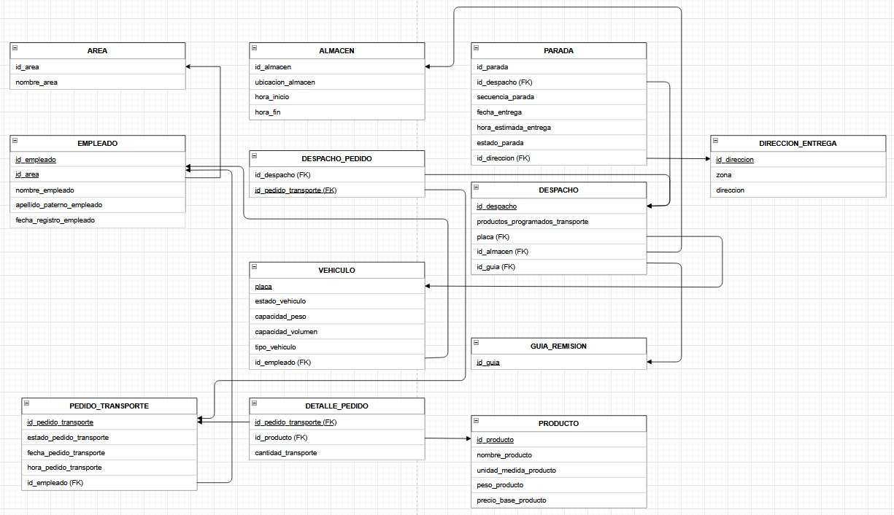

> [5. Diseño Lógico](../5.md) › [5.2. Módulo 2](5.2.md)

# 5.2. Módulo 2

# Modelo Logico

# Diccionario de Datos: Transporte

## AREA

* **Descripción:** Catálogo de áreas internas que originan pedidos (Ventas, Abastecimiento, etc.).
* **Propósito:** Trazar el origen institucional del pedido.
* **Reglas:** El nombre puede repetirse si hubiera sub-áreas (no se fuerza UK).
* **Claves/Restricciones:** `id_area` (PK).
* **Atributos**

| Columna      | Descripción     | Propósito        | Tipo | Obligatoriedad | Único | Restricciones |
| ------------ | --------------- | ---------------- | ---- | -- | ----- | ------------- |
| id\_area     | Código del área | Identificar área | TEXT | ✔  | ✔     | PK            |
| nombre\_area | Nombre del área | Reportes         | TEXT | ✔  |       |               |

---

## PEDIDO

* **Descripción:** Solicitud de productos a entregar al cliente/obra.
* **Propósito:** Origen de la demanda logística.
* **Reglas:** Un pedido pertenece a una única **AREA**.
* **Claves/Restricciones:** `id_pedido` (PK), `id_area` (FK→AREA).
* **Atributos**

| Columna           | Descripción              | Propósito        | Tipo | Obligatoriedad | Único | Restricciones         |
| ----------------- | ------------------------ | ---------------- | ---- | -- | ----- | --------------------- |
| id\_pedido        | Identificador del pedido | Clave            | TEXT | ✔  | ✔     | PK                    |
| fecha\_pedido     | Fecha de creación        | Control temporal | DATE | ✔  |       |                       |
| ubicacion\_pedido | Obra/ubicación asociada  | Enrutamiento     | TEXT |    |       |                       |
| estado\_pedido    | Estado del pedido        | Seguimiento      | TEXT | ✔  |       | CHECK/Lookup sugerido |
| id\_area          | Origen del pedido        | Integridad       | TEXT | ✔  |       | FK→AREA(id\_area)     |

---

## DETALLE

* **Descripción:** Línea del pedido (producto y cantidad).
* **Propósito:** Cálculo de carga y planificación.
* **Reglas:** Cada detalle pertenece a un único **PEDIDO**.
* **Claves/Restricciones:** `id_detalle` (PK), `id_pedido` (FK).
* **Atributos**

| Columna            | Descripción              | Propósito      | Tipo          | Obligatoriedad | Único | Restricciones         |
| ------------------ | ------------------------ | -------------- | ------------- | -- | ----- | --------------------- |
| id\_detalle        | Identificador de línea   | Clave          | TEXT          | ✔  | ✔     | PK                    |
| Cantidad\_producto | Cantidad solicitada      | Carga          | NUMERIC(12,2) | ✔  |       | CHECK ≥ 0             |
| Nombre\_producto   | Descripción del producto | Identificación | TEXT          | ✔  |       |                       |
| Tipo\_detalle      | Unidad/granel/etc.       | Reglas/UM      | TEXT          |    |       | CHECK/Lookup sugerido |
| id\_pedido         | Pedido dueño             | Integridad     | TEXT          | ✔  |       | FK→PEDIDO(id\_pedido) |

---

## ITEMPEDIDO

* **Descripción:** Ítem logístico derivado de un **DETALLE** para fraccionamiento/entrega.
* **Propósito:** Asignar cantidades a paradas.
* **Claves/Restricciones:** `id_item` (PK), `id_detalle` (FK).
* **Atributos**

| Columna        | Descripción           | Propósito  | Tipo          | Obligatoriedad | Único | Restricciones           |
| -------------- | --------------------- | ---------- | ------------- | -- | ----- | ----------------------- |
| id\_item       | Identificador de ítem | Clave      | TEXT          | ✔  | ✔     | PK                      |
| peso\_vol\_est | Peso/volumen estimado | Capacidad  | NUMERIC(12,3) |    |       | CHECK ≥ 0               |
| id\_detalle    | Línea origen          | Integridad | TEXT          | ✔  |       | FK→DETALLE(id\_detalle) |

---

## VEHICULO

* **Descripción:** Unidad propia utilizada para despachos.
* **Propósito:** Asignación y validación de capacidad.
* **Claves/Restricciones:** `placa` (PK).
* **Atributos**

| Columna            | Descripción        | Propósito           | Tipo          | Obligatoriedad | Único | Restricciones         |
| ------------------ | ------------------ | ------------------- | ------------- | -- | ----- | --------------------- |
| placa              | Placa del vehículo | Clave               | TEXT          | ✔  | ✔     | PK                    |
| estado\_vehiculo   | Estado operativo   | Disponibilidad      | TEXT          | ✔  |       | CHECK/Lookup sugerido |
| capacidad\_peso    | Capacidad en kg    | Capacidad           | NUMERIC(12,2) | ✔  |       | CHECK ≥ 0             |
| tipo\_vehiculo     | Tipo de unidad     | Regla de asignación | TEXT          | ✔  |       | CHECK/Lookup sugerido |
| capacidad\_volumen | Capacidad en m³    | Capacidad           | NUMERIC(12,3) | ✔  |       | CHECK ≥ 0             |

---

## OPERADOR

* **Descripción:** Conductor o personal de carga.
* **Propósito:** Asignación de conductor y control de habilitaciones.
* **Claves/Restricciones:** `id_operador` (PK).
* **Atributos**

| Columna            | Descripción            | Propósito      | Tipo | NN | Único | Restricciones         |
| ------------------ | ---------------------- | -------------- | ---- | -- | ----- | --------------------- |
| id\_operador       | Código de operador     | Clave          | TEXT | ✔  | ✔     | PK                    |
| nombre\_operador   | Nombre completo        | Identificación | TEXT | ✔  |       |                       |
| licencia\_operador | Categoría/No. licencia | Habilitación   | TEXT | ✔  |       |                       |
| telefono\_operador | Contacto               | Comunicación   | TEXT | ✔  |       |                       |
| estado\_operador   | Disponibilidad         | Asignación     | TEXT | ✔  |       | CHECK/Lookup sugerido |

---

## TRANSPORTISTATERCERO

* **Descripción:** Proveedor externo de transporte.
* **Propósito:** Registrar tercerización.
* **Claves/Restricciones:** `id_tercero` (PK); se recomienda `UK(razon_social)`.
* **Atributos**

| Columna       | Descripción         | Propósito      | Tipo | Obligatoriedad | Único | Restricciones  |
| ------------- | ------------------- | -------------- | ---- | -- | ----- | -------------- |
| id\_tercero   | Código del tercero  | Clave          | TEXT | ✔  | ✔     | PK             |
| razon\_social | Nombre/Razón Social | Identificación | TEXT | ✔  | ⬜︎    | UK recomendado |

---

## GUIAREMISION

* **Descripción:** Documento legal del traslado.
* **Propósito:** Trazabilidad documental y cumplimiento.
* **Claves/Restricciones:** `id_guia` (PK), `UK(serie_guia, numero_guia)`.
* **Atributos**

| Columna              | Descripción           | Propósito      | Tipo | Obligatoriedad | Único | Restricciones |
| -------------------- | --------------------- | -------------- | ---- | -- | ----- | ------------- |
| id\_guia             | Identificador interno | Clave          | TEXT | ✔  | ✔     | PK            |
| numero\_guia         | Número correlativo    | Identificación | TEXT | ✔  |       | Parte UK      |
| serie\_guia          | Serie                 | Identificación | TEXT | ✔  |       | Parte UK      |
| fecha\_emision\_guia | Fecha de emisión      | Control        | DATE | ✔  |       |               |
| emisor\_guia         | Emisor                | Auditoría      | TEXT | ✔  |       |               |

---

## RESERVABAHIA

* **Descripción:** Reserva de bahía/ventana de carga en almacén.
* **Propósito:** Evitar conflictos de muelle.
* **Claves/Restricciones:** `id_reserva` (PK).
* **Atributos**

| Columna     | Descripción                    | Propósito    | Tipo | Obligatoriedad | Único | Restricciones |
| ----------- | ------------------------------ | ------------ | ---- | -- | ----- | ------------- |
| id\_reserva | Identificador                  | Clave        | TEXT | ✔  | ✔     | PK            |
| bahia       | Identificador de bahía         | Ubicación    | TEXT | ✔  |       |               |
| ventana     | Franja horaria (texto o rango) | Programación | TEXT | ✔  |       | (o `tsrange`) |

---

## DESPACHO

* **Descripción:** Ruta/operación de entrega para una fecha.
* **Propósito:** Planificar, asignar y ejecutar distribución.
* **Reglas clave:**

  * Propio (**placa**, **id\_operador**) **XOR** Tercerizado (**id\_tercero**).
  * 0..1 a **GUIAREMISION** y **RESERVABAHIA** (1:1 con `UNIQUE` del lado de DESPACHO).
* **Claves/Restricciones:** `id_despacho` (PK), FKs opcionales a vehículo/operador/tercero/guía/reserva.
* **Atributos**

| Columna        | Descripción                          | Propósito     | Tipo | Obligatoriedad | Único | Restricciones                        |
| -------------- | ------------------------------------ | ------------- | ---- | -- | ----- | ------------------------------------ |
| id\_despacho   | Identificador                        | Clave         | TEXT | ✔  | ✔     | PK                                   |
| fecha\_prog    | Fecha programada                     | Planificación | DATE | ✔  |       |                                      |
| tipo\_servicio | Propio/Tercerizado/Inbound/Reentrega | Clasificación | TEXT | ✔  |       | CHECK/Lookup sugerido                |
| estado         | Estado operativo                     | Seguimiento   | TEXT | ✔  |       | CHECK/Lookup sugerido                |
| placa          | Vehículo asignado                    | Integridad    | TEXT |    |       | FK→VEHICULO(placa)                   |
| id\_operador   | Conductor                            | Integridad    | TEXT |    |       | FK→OPERADOR(id\_operador)            |
| id\_tercero    | Transporte tercero                   | Integridad    | TEXT |    |       | FK→TRANSPORTISTATERCERO(id\_tercero) |
| id\_guia       | Guía de remisión                     | 1:1           | TEXT |    | ✔     | FK→GUIAREMISION(id\_guia), UK        |
| id\_reserva    | Reserva de bahía                     | 1:1           | TEXT |    | ✔     | FK→RESERVABAHIA(id\_reserva), UK     |

> **CHECK recomendado (diferido a estado “asignado”)**:
> `( (placa IS NOT NULL AND id_tercero IS NULL) OR (placa IS NULL AND id_tercero IS NOT NULL) )`

---

## DIRECCIONENTREGA

* **Descripción:** Punto de destino/obra.
* **Propósito:** Georreferenciar paradas.
* **Claves/Restricciones:** `id_direccion` (PK).
* **Atributos**

| Columna       | Descripción         | Propósito    | Tipo | Obligatoriedad | Único | Restricciones |
| ------------- | ------------------- | ------------ | ---- | -- | ----- | ------------- |
| id\_direccion | Identificador       | Clave        | TEXT | ✔  | ✔     | PK            |
| zona          | Zona o sector       | Agrupación   | TEXT | ✔  |       |               |
| direccion     | Dirección detallada | Enrutamiento | TEXT | ✔  |       |               |

---

## PARADA

* **Descripción:** Entrega/destino dentro de un **DESPACHO**.
* **Propósito:** Control de ejecución, PoD e incidencias.
* **Claves/Restricciones:** `id_parada` (PK), `id_despacho` (FK), `id_direccion` (FK).
* **Atributos**

| Columna        | Descripción          | Propósito    | Tipo    | Obligatoriedad | Único | Restricciones                      |
| -------------- | -------------------- | ------------ | ------- | -- | ----- | ---------------------------------- |
| id\_parada     | Identificador        | Clave        | TEXT    | ✔  | ✔     | PK                                 |
| secuencia      | Orden en la ruta     | Hoja de ruta | INTEGER | ✔  |       | CHECK ≥ 1                          |
| estado\_parada | Estado de la parada  | Seguimiento  | TEXT    | ✔  |       | CHECK/Lookup sugerido              |
| id\_despacho   | Despacho propietario | Integridad   | TEXT    | ✔  |       | FK→DESPACHO(id\_despacho)          |
| id\_direccion  | Dirección servida    | Integridad   | TEXT    | ✔  |       | FK→DIRECCIONENTREGA(id\_direccion) |

---

## POD

* **Descripción:** Prueba de entrega (firma/datos receptor).
* **Propósito:** Evidencia legal/comercial.
* **Reglas:** 0..1 por **PARADA** (forzado con UK sobre `id_parada`).
* **Claves/Restricciones:** `id_pod` (PK), `id_parada` (FK, UK).
* **Atributos**

| Columna          | Descripción     | Propósito | Tipo | Obligatoriedad | Único | Restricciones             |
| ---------------- | --------------- | --------- | ---- | -- | ----- | ------------------------- |
| id\_pod          | Identificador   | Clave     | TEXT | ✔  | ✔     | PK                        |
| receptor\_doc    | Doc. receptor   | Evidencia | TEXT |    |       |                           |
| receptor\_nombre | Nombre receptor | Evidencia | TEXT |    |       |                           |
| id\_parada       | Parada asociada | 1:1       | TEXT | ✔  | ✔     | FK→PARADA(id\_parada), UK |

---

## INCIDENCIA

* **Descripción:** Problema en una **PARADA** (faltante, rechazo, etc.).
* **Propósito:** Gestión de reentregas/posventa.
* **Claves/Restricciones:** `id_incidencia` (PK), `id_parada` (FK).
* **Atributos**

| Columna            | Descripción     | Propósito     | Tipo | Obligatoriedad | Único | Restricciones         |
| ------------------ | --------------- | ------------- | ---- | -- | ----- | --------------------- |
| id\_incidencia     | Identificador   | Clave         | TEXT | ✔  | ✔     | PK                    |
| tipo\_incidencia   | Tipo            | Clasificación | TEXT | ✔  |       | CHECK/Lookup sugerido |
| estado\_incidencia | Estado          | Seguimiento   | TEXT | ✔  |       | CHECK/Lookup sugerido |
| id\_parada         | Parada afectada | Integridad    | TEXT | ✔  |       | FK→PARADA(id\_parada) |

---

## DESPACHOPEDIDO (asociativa N\:M)

* **Descripción:** Relaciona **DESPACHO** ↔ **PEDIDO** (un despacho agrupa varios pedidos y un pedido puede ir en varios despachos).
* **Propósito:** Resolver la N\:M **Planifica**.
* **Claves/Restricciones:** `PK(id_despacho, id_pedido)`, `FK` a **DESPACHO** y **PEDIDO**.
* **Atributos**

| Columna      | Descripción | Propósito  | Tipo | Obligatoriedad | Único | Restricciones                 |
| ------------ | ----------- | ---------- | ---- | -- | ----- | ----------------------------- |
| id\_despacho | Despacho    | Integridad | TEXT | ✔  |       | PK, FK→DESPACHO(id\_despacho) |
| id\_pedido   | Pedido      | Integridad | TEXT | ✔  |       | PK, FK→PEDIDO(id\_pedido)     |

---

## PARADAITEM (asociativa N\:M)

* **Descripción:** Ítems entregados por **PARADA** (un ítem puede repartirse en varias paradas).
* **Propósito:** Resolver la N\:M **Incluye** y controlar cantidades.
* **Claves/Restricciones:** `PK(id_parada, id_item)`, `FK` a **PARADA** y **ITEMPEDIDO**.
* **Atributos**

| Columna           | Descripción                      | Propósito  | Tipo          | Obligatoriedad | Único | Restricciones                              |
| ----------------- | -------------------------------- | ---------- | ------------- | -- | ----- | ------------------------------------------ |
| id\_parada        | Parada                           | Integridad | TEXT          | ✔  |       | PK, FK→PARADA(id\_parada)                  |
| id\_item          | Ítem de pedido                   | Integridad | TEXT          | ✔  |       | PK, FK→ITEMPEDIDO(id\_item)                |
| cant\_a\_entregar | Cantidad planificada             | Control    | NUMERIC(12,2) | ✔  |       | CHECK ≥ 0                                  |
| cant\_entregada   | Cantidad efectivamente entregada | Control    | NUMERIC(12,2) | ✔  |       | DF 0, CHECK ≥ 0, CHECK ≤ cant\_a\_entregar |

[⬅️ Anterior](../5.1/5.1.md) | [🏠 Home](../../README.md) | [Siguiente ➡️](../5.3/5.3.md)
