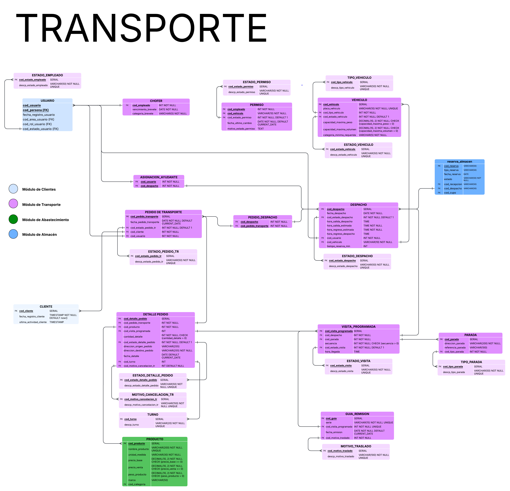

> [5. Diseño Lógico](../5.md) › [5.2. Módulo 2](5.2.md)

# 5.2. Módulo 2

# Modelo Logico

# Diccionario de Datos del Modelo Lógico

## Módulo: Transporte

## 1. Tablas de Catálogo (Lookups)

### 1.1. Ficha de Relación: ESTADO_EMPLEADO

**Nombre de la Relación:** `ESTADO_EMPLEADO`

**Descripción:** Catálogo de los estados laborales de un empleado (ej. Activo, De Vacaciones).

**Propósito:** Normalizar los posibles estados de un empleado en una tabla maestra para consistencia de datos.

**Reglas de negocio relevantes:** Un empleado siempre debe tener un estado.

**Claves y Restricciones:**

- **Clave Primaria (PK):** `cod_estado_empleado`
- **Unicidad (UNIQUE):** `descp_estado_empleado`

**Tabla de Atributos:**
| Nombre de la columna | Descripción | Propósito | Tipo de dato (SGBD) | Obligatorio/Único | Restricciones |
| :--- | :--- | :--- | :--- | :--- | :--- |
| `cod_estado_empleado` | Identificador numérico interno. | Clave Primaria. | `SERIAL` | Oblig.: Sí, Único: Sí | PK |
| `descp_estado_empleado` | Descripción textual del estado. | Mostrar el estado en la interfaz. | `VARCHAR(50)` | Oblig.: Sí, Único: Sí | - |

**Valores Esperados:**

- (1, 'Activo')
- (2, 'De Vacaciones')
- (3, 'Con Licencia')
- (4, 'Inactivo')

### 1.2. Ficha de Relación: TIPO_VEHICULO

**Nombre de la Relación:** `TIPO_VEHICULO`

**Descripción:** Catálogo de los tipos de vehículos (ej. Camión, Furgoneta).

**Propósito:** Normalizar la clasificación de la flota de vehículos (R-201).

**Claves y Restricciones:**

- **Clave Primaria (PK):** `cod_tipo_vehiculo`
- **Unicidad (UNIQUE):** `descp_tipo_vehiculo`

**Tabla de Atributos:**
| Nombre de la columna | Descripción | Propósito | Tipo de dato (SGBD) | Obligatorio/Único | Restricciones |
| :--- | :--- | :--- | :--- | :--- | :--- |
| `cod_tipo_vehiculo` | Identificador numérico interno. | Clave Primaria. | `SERIAL` | Oblig.: Sí, Único: Sí | PK |
| `descp_tipo_vehiculo` | Descripción textual del tipo. | Mostrar el tipo en la interfaz (R-201). | `VARCHAR(50)` | Oblig.: Sí, Único: Sí | - |

**Valores Esperados(Ejemplo):**

- (1, 'Camión')
- (2, 'Furgoneta')
- (3, 'Camioneta')

### 1.3. Ficha de Relación: ESTADO_VEHICULO

**Nombre de la Relación:** `ESTADO_VEHICULO`

**Descripción:** Catálogo de los estados de un vehículo (ej. Operativo, En Mantenimiento).

**Propósito:** Normalizar la disponibilidad de un vehículo (R-202).

**Claves y Restricciones:**

- **Clave Primaria (PK):** `cod_estado_vehiculo`
- **Unicidad (UNIQUE):** `descp_estado_vehiculo`

**Tabla de Atributos:**
| Nombre de la columna | Descripción | Propósito | Tipo de dato (SGBD) | Obligatorio/Único | Restricciones |
| :--- | :--- | :--- | :--- | :--- | :--- |
| `cod_estado_vehiculo` | Identificador numérico interno. | Clave Primaria. | `SERIAL` | Oblig.: Sí, Único: Sí | PK |
| `descp_estado_vehiculo`| Descripción textual del estado. | Controlar disponibilidad (R-202). | `VARCHAR(50)` | Oblig.: Sí, Único: Sí | - |

**Valores Esperados:**

- (1, 'Operativo')
- (2, 'En Mantenimiento')
- (3, 'De Baja')

### 1.4. Ficha de Relación: ESTADO_PEDIDO_TR

**Nombre de la Relación:** `ESTADO_PEDIDO_TR`

**Descripción:** Catálogo de los estados de la cabecera de un Pedido de Transporte.

**Propósito:** Normalizar el estado general del pedido.

**Claves y Restricciones:**

- **Clave Primaria (PK):** `cod_estado_pedido_tr`
- **Unicidad (UNIQUE):** `descp_estado_pedido_tr`

**Tabla de Atributos:**
| Nombre de la columna | Descripción | Propósito | Tipo de dato (SGBD) | Obligatorio/Único | Restricciones |
| :--- | :--- | :--- | :--- | :--- | :--- |
| `cod_estado_pedido_tr` | Identificador numérico interno. | Clave Primaria. | `SERIAL` | Oblig.: Sí, Único: Sí | PK |
| `descp_estado_pedido_tr`| Descripción textual del estado. | Controlar el flujo del pedido. | `VARCHAR(50)` | Oblig.: Sí, Único: Sí | - |

**Valores Esperados:**

- (1, 'Pendiente')
- (2, 'En Proceso')
- (3, 'Completado')
- (4, 'Cancelado')

### 1.5. Ficha de Relación: ESTADO_DESPACHO

**Nombre de la Relación:** `ESTADO_DESPACHO`

**Descripción:** Catálogo de los estados de un Despacho (ruta de entrega).

**Propósito:** Normalizar el estado de la ruta (R-210, R-211, R-212).

**Claves y Restricciones:**

- **Clave Primaria (PK):** `cod_estado_despacho`
- **Unicidad (UNIQUE):** `descp_estado_despacho`

**Tabla de Atributos:**
| Nombre de la columna | Descripción | Propósito | Tipo de dato (SGBD) | Obligatorio/Único | Restricciones |
| :--- | :--- | :--- | :--- | :--- | :--- |
| `cod_estado_despacho` | Identificador numérico interno. | Clave Primaria. | `SERIAL` | Oblig.: Sí, Único: Sí | PK |
| `descp_estado_despacho`| Descripción textual del estado. | Controlar el flujo del despacho (R-210). | `VARCHAR(50)` | Oblig.: Sí, Único: Sí | - |

**Valores Esperados:**

- (1, 'Programado')
- (2, 'En Ruta')
- (3, 'Completado')
- (4, 'Cancelado')

### 1.6. Ficha de Relación: ESTADO_PERMISO

**Nombre de la Relación:** `ESTADO_PERMISO`

**Descripción:** Catálogo de los estados de habilitación de un chofer para un vehículo.

**Propósito:** Normalizar los estados para la gestión de permisos (R-206).

**Claves y Restricciones:**

- **Clave Primaria (PK):** `cod_estado_permiso`
- **Unicidad (UNIQUE):** `descp_estado_permiso`

**Tabla de Atributos:**
| Nombre de la columna | Descripción | Propósito | Tipo de dato (SGBD) | Obligatorio/Único | Restricciones |
| :--- | :--- | :--- | :--- | :--- | :--- |
| `cod_estado_permiso` | Identificador numérico interno. | Clave Primaria. | `SERIAL` | Oblig.: Sí, Único: Sí | PK |
| `descp_estado_permiso`| Descripción textual del estado. | Gestionar permisos (R-206). | `VARCHAR(50)` | Oblig.: Sí, Único: Sí | - |

**Valores Esperados:**

- (1, 'No Habilitado')
- (2, 'Habilitado')
- (3, 'Suspendido')

### 1.7. Ficha de Relación: ESTADO_VISITA

**Nombre de la Relación:** `ESTADO_VISITA`

**Descripción:** Catálogo de los estados de una parada o entrega específica.

**Propósito:** Normalizar el estado del seguimiento de una entrega (R-210).

**Claves y Restricciones:**

- **Clave Primaria (PK):** `cod_estado_visita`
- **Unicidad (UNIQUE):** `descp_estado_visita`

**Tabla de Atributos:**
| Nombre de la columna | Descripción | Propósito | Tipo de dato (SGBD) | Obligatorio/Único | Restricciones |
| :--- | :--- | :--- | :--- | :--- | :--- |
| `cod_estado_visita` | Identificador numérico interno. | Clave Primaria. | `SERIAL` | Oblig.: Sí, Único: Sí | PK |
| `descp_estado_visita`| Descripción textual del estado. | Seguimiento de paradas (R-210). | `VARCHAR(50)` | Oblig.: Sí, Único: Sí | - |

**Valores Esperados:**

- (1, 'Pendiente')
- (2, 'Picking')
- (3, 'En Ruta')
- (4, 'En Camino')
- (5, 'Entregado')

### 1.8. Ficha de Relación: MOTIVO_TRASLADO

**Nombre de la Relación:** `MOTIVO_TRASLADO`

**Descripción:** Catálogo de los motivos legales para una Guía de Remisión.

**Propósito:** Normalizar los motivos de emisión de una `GUIA_REMISION`.

**Claves y Restricciones:**

- **Clave Primaria (PK):** `cod_motivo_traslado`
- **Unicidad (UNIQUE):** `descp_motivo_traslado`

**Tabla de Atributos:**
| Nombre de la columna | Descripción | Propósito | Tipo de dato (SGBD) | Obligatorio/Único | Restricciones |
| :--- | :--- | :--- | :--- | :--- | :--- |
| `cod_motivo_traslado` | Identificador numérico interno. | Clave Primaria. | `SERIAL` | Oblig.: Sí, Único: Sí | PK |
| `descp_motivo_traslado`| Descripción textual del motivo. | Cumplimiento legal de la guía. | `VARCHAR(100)` | Oblig.: Sí, Único: Sí | - |

**Valores Esperados:**

- (1, 'Venta')
- (2, 'Traslado entre almacenes')
- (3, 'Devolución')
- (4, 'Otros')

### 1.9. Ficha de Relación: ESTADO_DETALLE_PEDIDO

**Nombre de la Relación:** `ESTADO_DETALLE_PEDIDO`

**Descripción:** Catálogo de los estados de un artículo (línea) dentro de un Pedido de Transporte.

**Propósito:** Normalizar el estado a nivel de artículo (R-207, R-208).

**Claves y Restricciones:**

- **Clave Primaria (PK):** `cod_estado_detalle_pedido`
- **Unicidad (UNIQUE):** `descp_estado_detalle_pedido`

**Tabla de Atributos:**
| Nombre de la columna | Descripción | Propósito | Tipo de dato (SGBD) | Obligatorio/Único | Restricciones |
| :--- | :--- | :--- | :--- | :--- | :--- |
| `cod_estado_detalle_pedido` | Identificador numérico interno. | Clave Primaria. | `SERIAL` | Oblig.: Sí, Único: Sí | PK |
| `descp_estado_detalle_pedido`| Descripción textual del estado. | Controlar flujo de artículos (R-207). | `VARCHAR(50)` | Oblig.: Sí, Único: Sí | - |

**Valores Esperados:**

- (1, 'Pendiente')
- (2, 'Programado')
- (3, 'Picking')
- (4, 'En Ruta')
- (5, 'En Camino')
- (6, 'Entregado')

### 1.10. Ficha de Relación: TIPO_PARADA

**Nombre de la Relación:** `TIPO_PARADA`

**Descripción:** Catálogo de los tipos de ubicaciones físicas (paradas).

**Propósito:** Clasificar las direcciones guardadas en la tabla `PARADA`.

**Claves y Restricciones:**

- **Clave Primaria (PK):** `cod_tipo_parada`
- **Unicidad (UNIQUE):** `descp_tipo_parada`

**Tabla de Atributos:**
| Nombre de la columna | Descripción | Propósito | Tipo de dato (SGBD) | Obligatorio/Único | Restricciones |
| :--- | :--- | :--- | :--- | :--- | :--- |
| `cod_tipo_parada` | Identificador numérico interno. | Clave Primaria. | `SERIAL` | Oblig.: Sí, Único: Sí | PK |
| `descp_tipo_parada`| Descripción textual del tipo. | Clasificar la entidad `PARADA`. | `VARCHAR(50)` | Oblig.: Sí, Único: Sí | - |

**Valores Esperados:**

- (1, 'Cliente')
- (2, 'Almacen')
- (3, 'Proveedor')

### 1.11. Ficha de Relación: MOTIVO_CANCELACION_TR

**Nombre de la Relación:** `MOTIVO_CANCELACION_TR`

**Descripción:** Catálogo de los motivos por los que se puede cancelar un `DETALLE_PEDIDO_TR`.

**Propósito:** Normalizar el motivo de cancelación (R-207).

**Claves y Restricciones:**

- **Clave Primaria (PK):** `cod_motivo_cancelacion_tr`
- **Unicidad (UNIQUE):** `descp_motivo_cancelacion_tr`

**Tabla de Atributos:**
| Nombre de la columna | Descripción | Propósito | Tipo de dato (SGBD) | Obligatorio/Único | Restricciones |
| :--- | :--- | :--- | :--- | :--- | :--- |
| `cod_motivo_cancelacion_tr` | Identificador numérico interno. | Clave Primaria. | `SERIAL` | Oblig.: Sí, Único: Sí | PK |
| `descp_motivo_cancelacion_tr`| Descripción textual del motivo. | Registrar justificación de R-207. | `VARCHAR(150)` | Oblig.: Sí, Único: Sí | - |

**Valores Esperados:**

- (1, 'Solicitud del cliente')
- (2, 'Error en el pedido')
- (3, 'Falta de stock')
- (4, 'Otro')

### 1.12. Ficha de Relación: TURNO

**Nombre de la Relación:** `TURNO`

**Descripción:** Catálogo de los turnos de entrega (Mañana, Tarde, Noche).

**Propósito:** Normalizar el turno de entrega solicitado en `DETALLE_PEDIDO_TR`.

**Claves y Restricciones:**

- **Clave Primaria (PK):** `cod_turno`
- **Unicidad (UNIQUE):** `descp_turno`

**Tabla de Atributos:**
| Nombre de la columna | Descripción | Propósito | Tipo de dato (SGBD) | Obligatorio/Único | Restricciones |
| :--- | :--- | :--- | :--- | :--- | :--- |
| `cod_turno` | Identificador numérico interno. | Clave Primaria. | `SERIAL` | Oblig.: Sí, Único: Sí | PK |
| `descp_turno`| Descripción textual del turno. | Clasificar el `DETALLE_PEDIDO_TR`. | `VARCHAR(20)` | Oblig.: Sí, Único: Sí | - |

**Valores Esperados:**

- (1, 'Mañana')
- (2, 'Tarde')
- (3, 'Noche')

## 2. Tablas Maestras y de Proceso

### 2.1. Ficha de Relación: VEHICULO

**Nombre de la Relación:** `VEHICULO`

**Descripción:** Tabla maestra que gestiona la flota de vehículos de la ferretería.

**Propósito:** Almacenar los activos de transporte, su disponibilidad, capacidad y requisitos legales, para cumplir con los requerimientos R-201, R-202, R-203, R-206 y R-209.

**Reglas de negocio relevantes:**

- (R-201) Un vehículo se identifica por una `placa_vehiculo` que debe ser única.
- (R-202) El `cod_estado_vehiculo` (ej. 'Operativo') determina si el vehículo puede ser asignado a un despacho.
- (R-206) La `categoria_minima_requerida` se usa para validar si un chofer tiene el permiso adecuado (ver `PERMISO`).
- (R-209) Las capacidades de `peso` y `volumen` son consultadas al planificar un despacho.

**Claves y Restricciones:**

- **Clave Primaria (PK):** `cod_vehiculo`
- **Claves Foráneas (FK):**
    - `cod_tipo_vehiculo` REFERENCES `TIPO_VEHICULO(cod_tipo_vehiculo)`
    - `cod_estado_vehiculo` REFERENCES `ESTADO_VEHICULO(cod_estado_vehiculo)`
- **Unicidad (UNIQUE):** `placa_vehiculo`
- **Obligatoriedad (NOT NULL):** `placa_vehiculo`, `cod_tipo_vehiculo`, `cod_estado_vehiculo`, `capacidad_maxima_peso`, `capacidad_maxima_volumen`, `categoria_minima_requerida`
- **Restricciones de dominio (CHECK):**
    - `capacidad_maxima_peso > 0`
    - `capacidad_maxima_volumen > 0`
- **Valores por Defecto (DEFAULT):** `cod_estado_vehiculo` = 1 ('Operativo')

**Tabla de Atributos:**
| Nombre de la columna | Descripción | Propósito | Tipo de dato (SGBD) | Obligatorio/Único | Restricciones |
| :--- | :--- | :--- | :--- | :--- | :--- |
| `cod_vehiculo` | Identificador numérico interno. | Clave Primaria. | `SERIAL` | Oblig.: Sí, Único: Sí | PK |
| `placa_vehiculo` | Matrícula legal del vehículo. | Clave alterna (R-201). | `VARCHAR(10)` | Oblig.: Sí, Único: Sí | - |
| `cod_tipo_vehiculo` | Tipo de vehículo. | FK a `TIPO_VEHICULO` (R-201). | `INT` | Oblig.: Sí, Único: No | FK |
| `cod_estado_vehiculo`| Estado de disponibilidad. | FK a `ESTADO_VEHICULO` (R-202). | `INT` | Oblig.: Sí, Único: No | FK, DEFAULT 1 |
| `capacidad_maxima_peso` | Peso máximo que soporta. | Límite para R-209. | `DECIMAL(10, 2)` | Oblig.: Sí, Único: No | CHECK > 0 |
| `capacidad_maxima_volumen` | Volumen máximo que soporta. | Límite para R-209. | `DECIMAL(10, 2)` | Oblig.: Sí, Único: No | CHECK > 0 |
| `categoria_minima_requerida` | Licencia mínima requerida (R-201).| Requisito para R-206. | `VARCHAR(5)` | Oblig.: Sí, Único: No | - |

### 2.2. Ficha de Relación: PARADA

**Nombre de la Relación:** `PARADA`

**Descripción:** Tabla maestra de ubicaciones y direcciones físicas.

**Propósito:** Almacenar un directorio de direcciones (Clientes, Almacenes, Proveedores) para evitar redundancia y facilitar la asignación en `VISITA_PROGRAMADA`.

**Reglas de negocio relevantes:**

- (R-209) Las direcciones se seleccionan de esta tabla para crear la secuencia de la ruta.
- (R-213) Permite agrupar entregas por ubicación.

**Claves y Restricciones:**

- **Clave Primaria (PK):** `cod_parada`
- **Claves Foráneas (FK):** `cod_tipo_parada` REFERENCES `TIPO_PARADA(cod_tipo_parada)`
- **Obligatoriedad (NOT NULL):** `direccion_parada`, `cod_tipo_parada`

**Tabla de Atributos:**
| Nombre de la columna | Descripción | Propósito | Tipo de dato (SGBD) | Obligatorio/Único | Restricciones |
| :--- | :--- | :--- | :--- | :--- | :--- |
| `cod_parada` | Identificador numérico interno. | Clave Primaria. | `SERIAL` | Oblig.: Sí, Único: Sí | PK |
| `direccion_parada` | Dirección formal de la ubicación. | Dato principal de la entidad. | `VARCHAR(200)` | Oblig.: Sí, Único: No | - |
| `referencia_parada`| Datos adicionales de ubicación. | Ayuda al conductor (ej. "Portón azul"). | `VARCHAR(100)` | Oblig.: No, Único: No | - |
| `cod_tipo_parada` | Clasificación de la parada. | FK a `TIPO_PARADA`. | `INT` | Oblig.: Sí, Único: No | FK |

### 2.3. Ficha de Relación: CHOFER

**Nombre de la Relación:** `CHOFER`

**Descripción:** Tabla de especialización que identifica a un `USUARIO` como un conductor calificado.

**Propósito:** Almacenar los atributos específicos de un conductor (licencia) y actuar como el "lado 1" en las relaciones de asignación de `DESPACHO` (R-209) y `PERMISO` (R-206).

**Reglas de negocio relevantes:**

- Un `CHOFER` es un `USUARIO`. La relación es 1:1.
- (R-204) Se debe registrar la validez de su licencia (`vencimiento_brevete`) y su `categoria_brevete`.

**Claves y Restricciones:**

- **Clave Primaria (PK):** `cod_usuario`
- **Claves Foráneas (FK):** `cod_usuario` REFERENCES `USUARIO(cod_usuario)` ON DELETE CASCADE
- **Obligatoriedad (NOT NULL):** `vencimiento_brevete`, `categoria_brevete`

**Tabla de Atributos:**
| Nombre de la columna | Descripción | Propósito | Tipo de dato (SGBD) | Obligatorio/Único | Restricciones |
| :--- | :--- | :--- | :--- | :--- | :--- |
| `cod_usuario` | Identificador del usuario. | Clave Primaria y Foránea. | `INT` | Oblig.: Sí, Único: Sí | PK, FK |
| `vencimiento_brevete`| Fecha de expiración de la licencia. | Controlar validez legal (R-204). | `DATE` | Oblig.: Sí, Único: No | - |
| `categoria_brevete` | Categoría de la licencia (ej. "A3C"). | Validar contra `VEHICULO` (R-206). | `VARCHAR(5)` | Oblig.: Sí, Único: No | - |

### 2.4. Ficha de Relación: PEDIDO_TRANSPORTE

**Nombre de la Relación:** `PEDIDO_TRANSPORTE`

**Descripción:** Cabecera de la solicitud de transporte. Agrupa los artículos (`DETALLE_PEDIDO_TR`) que deben ser entregados.

**Propósito:** Iniciar el flujo de transporte. Es la entidad "padre" que se consulta en la "Vista General" (R-213) y de la cual dependen los detalles a cancelar (R-207) o reprogramar (R-208).

**Reglas de negocio relevantes:**

- (Consolidado) Un Pedido de Transporte nace a partir de una `RECEPCION` del módulo de Abastecimiento.
- (Consolidado) Es registrado por un `USUARIO` y es para un `CLIENTE`.

**Claves y Restricciones:**

- **Clave Primaria (PK):** `cod_pedido_transporte`
- **Claves Foráneas (FK):**
    - `cod_estado_pedido_tr` REFERENCES `ESTADO_PEDIDO_TR`
    - `cod_cliente` REFERENCES `CLIENTE(cod_cliente)`
    - `cod_empleado_registro` REFERENCES `USUARIO(cod_usuario)`
    - `cod_recepcion` REFERENCES `RECEPCION(cod_recepcion)`
- **Obligatoriedad (NOT NULL):** `fecha_pedido_transporte`, `cod_estado_pedido_tr`, `cod_cliente`, `cod_empleado_registro`, `cod_recepcion`.
- **Valores por Defecto (DEFAULT):** `fecha_pedido_transporte` = CURRENT_DATE, `cod_estado_pedido_tr` = 1 ('Pendiente')

**Tabla de Atributos:**
| Nombre de la columna | Descripción | Propósito | Tipo de dato (SGBD) | Obligatorio/Único | Restricciones |
| :--- | :--- | :--- | :--- | :--- | :--- |
| `cod_pedido_transporte` | Identificador numérico interno. | Clave Primaria. | `SERIAL` | Oblig.: Sí, Único: Sí | PK |
| `fecha_pedido_transporte` | Fecha de creación de la solicitud. | Auditoría. | `DATE` | Oblig.: Sí, Único: No | DEFAULT CURRENT_DATE |
| `cod_recepcion` | Vínculo con Abastecimiento. | Trazabilidad del origen del pedido. | `INT` | Oblig.: Sí, Único: No | FK |
| `cod_estado_pedido_tr` | Estado general del pedido. | FK a `ESTADO_PEDIDO_TR`. | `INT` | Oblig.: Sí, Único: No | FK, DEFAULT 1 |
| `cod_cliente` | Cliente final del pedido. | FK a `CLIENTE` (R-213). | `INT` | Oblig.: Sí, Único: No | FK |
| `cod_empleado_registro` | Usuario que creó el pedido. | FK a `USUARIO`. Auditoría. | `INT` | Oblig.: Sí, Único: No | FK |

### 2.5. Ficha de Relación: DESPACHO

**Nombre de la Relación:** `DESPACHO`

**Descripción:** Representa la planificación de un viaje (ruta) en una fecha específica, con recursos asignados (Chofer, Vehículo).

**Propósito:** Es la entidad central de la logística (R-209). Permite asignar recursos, planificar horarios (R-209) y registrar el seguimiento real (R-210).

**Reglas de negocio relevantes:**

- (R-209) Un despacho debe tener 1 `CHOFER` y 1 `VEHICULO` asignados.
- (R-210) Se debe poder registrar la diferencia entre horas estimadas y reales.
- (R-211, R-212) Solo los despachos 'Programados' se pueden editar o eliminar.

**Claves y Restricciones:**

- **Clave Primaria (PK):** `cod_despacho`
- **Claves Foráneas (FK):**
    - `cod_estado_despacho` REFERENCES `ESTADO_DESPACHO`
    - `cod_chofer` REFERENCES `CHOFER(cod_usuario)`
    - `cod_vehiculo` REFERENCES `VEHICULO(cod_vehiculo)`
- **Obligatoriedad (NOT NULL):** `fecha_despacho`, `cod_estado_despacho`, `hora_salida_estimada`, `hora_regreso_estimada`, `cod_chofer`, `cod_vehiculo`, `tiempo_reserva_min`.
- **Restricciones de dominio (CHECK):** `hora_regreso_estimada > hora_salida_estimada`
- **Valores por Defecto (DEFAULT):** `cod_estado_despacho` = 1 ('Programado')

**Tabla de Atributos:**
| Nombre de la columna | Descripción | Propósito | Tipo de dato (SGBD) | Obligatorio/Único | Restricciones |
| :--- | :--- | :--- | :--- | :--- | :--- |
| `cod_despacho` | Identificador numérico interno. | Clave Primaria. | `SERIAL` | Oblig.: Sí, Único: Sí | PK |
| `fecha_despacho` | Fecha planificada del viaje. | Define el día de la ruta (R-209). | `DATE` | Oblig.: Sí, Único: No | - |
| `cod_estado_despacho`| Estado actual del viaje. | FK a `ESTADO_DESPACHO` (R-210). | `INT` | Oblig.: Sí, Único: No | FK, DEFAULT 1 |
| `hora_salida_estimada`| Hora planificada de salida. | Planificación (R-209). | `TIME` | Oblig.: Sí, Único: No | - |
| `hora_salida_despacho`| Hora real de salida. | Seguimiento (R-210). | `TIME` | Oblig.: No, Único: No | - |
| `hora_regreso_estimada`| Hora planificada de regreso. | Planificación (R-209). | `TIME` | Oblig.: Sí, Único: No | - |
| `hora_regreso_despacho`| Hora real de regreso. | Seguimiento (R-210). | `TIME` | Oblig.: No, Único: No | - |
| `cod_chofer` | Conductor asignado. | FK a `CHOFER` (R-209). | `INT` | Oblig.: Sí, Único: No | FK |
| `cod_vehiculo` | Vehículo asignado. | FK a `VEHICULO` (R-209). | `INT` | Oblig.: Sí, Único: No | FK |
| `tiempo_reserva_min` | Tiempo (minutos) reservado en almacén. | Coordinación con Almacén. | `INT` | Oblig.: Sí, Único: No | - |

### 2.6. Ficha de Relación: VISITA_PROGRAMADA

**Nombre de la Relación:** `VISITA_PROGRAMADA`

**Descripción:** Representa una parada (entrega) específica dentro de un `DESPACHO`. Es la "instancia" de ir a una `PARADA` en una secuencia.

**Propósito:** Modela la relación M:N entre `DESPACHO` y `PARADA`. Es la entidad clave para la secuencia de ruta (R-209), el seguimiento de entrega (R-210) y la generación de `GUIA_REMISION`.

**Reglas de negocio relevantes:**

- (R-209) Un `DESPACHO` se compone de 1 o N visitas.
- (R-209) La `secuencia` debe ser única para un mismo `DESPACHO`.
- (R-210) `hora_llegada` registra la hora real de la entrega.

**Claves y Restricciones:**

- **Clave Primaria (PK):** `cod_visita`
- **Claves Foráneas (FK):**
    - `cod_despacho` REFERENCES `DESPACHO(cod_despacho)`
    - `cod_parada` REFERENCES `PARADA(cod_parada)`
    - `cod_estado_visita` REFERENCES `ESTADO_VISITA(cod_estado_visita)`
- **Unicidad (UNIQUE):** `(cod_despacho, secuencia)`
- **Obligatoriedad (NOT NULL):** `cod_despacho`, `cod_parada`, `secuencia`, `cod_estado_visita`.
- **Restricciones de dominio (CHECK):** `secuencia > 0`
- **Valores por Defecto (DEFAULT):** `cod_estado_visita` = 1 ('Pendiente')

**Tabla de Atributos:**
| Nombre de la columna | Descripción | Propósito | Tipo de dato (SGBD) | Obligatorio/Único | Restricciones |
| :--- | :--- | :--- | :--- | :--- | :--- |
| `cod_visita` | Identificador numérico interno. | Clave Primaria. | `SERIAL` | Oblig.: Sí, Único: Sí | PK |
| `cod_despacho` | Despacho al que pertenece. | FK a `DESPACHO`. | `INT` | Oblig.: Sí, Único: No (con `secuencia`) | FK, UNIQUE(con `secuencia`) |
| `cod_parada` | Ubicación a visitar. | FK a `PARADA`. | `INT` | Oblig.: Sí, Único: No | FK |
| `secuencia` | Orden de la parada en la ruta. | Define la ruta (R-209). | `INT` | Oblig.: Sí, Único: No (con `cod_despacho`) | CHECK > 0, UNIQUE(con `cod_despacho`) |
| `cod_estado_visita`| Estado de la entrega. | FK a `ESTADO_VISITA` (R-210). | `INT` | Oblig.: Sí, Único: | FK, DEFAULT 1 |
| `hora_llegada` | Hora real de llegada. | Seguimiento (R-210). | `TIME` | No | No | - |

### 2.7. Ficha de Relación: GUIA_REMISION

**Nombre de la Relación:** `GUIA_REMISION`

**Descripción:** Documento legal (Guía de Remisión Transportista) que ampara una entrega.

**Propósito:** Almacenar el número de serie legal de la guía y asociarlo a una `VISITA_PROGRAMADA` específica.

**Reglas de negocio relevantes:**

- La relación entre `VISITA_PROGRAMADA` y `GUIA_REMISION` es 1:1. Una visita genera una guía, y una guía ampara una sola visita.
- El número de `serie` debe ser único.

**Claves y Restricciones:**

- **Clave Primaria (PK):** `cod_guia`
- **Claves Foráneas (FK):**
    - `cod_visita` REFERENCES `VISITA_PROGRAMADA(cod_visita)`
    - `cod_motivo_traslado` REFERENCES `MOTIVO_TRASLADO(cod_motivo_traslado)`
- **Unicidad (UNIQUE):** `serie`, `cod_visita`
- **Obligatoriedad (NOT NULL):** `serie`, `cod_visita`, `fecha_emision`, `cod_motivo_traslado`.
- **Valores por Defecto (DEFAULT):** `fecha_emision` = CURRENT_DATE

**Tabla de Atributos:**
| Nombre de la columna | Descripción | Propósito | Tipo de dato (SGBD) | Obligatorio/Único | Restricciones |
| :--- | :--- | :--- | :--- | :--- | :--- |
| `cod_guia` | Identificador numérico interno. | Clave Primaria. | `SERIAL` | Sí (PK) | Sí (PK) | PK |
| `serie` | Número de serie legal (ej. "T001-00123"). | Clave alterna. | `VARCHAR(15)` | Sí (NOT NULL) | Sí (UNIQUE) | - |
| `cod_visita` | Visita que ampara esta guía. | FK a `VISITA_PROGRAMADA`. | `INT` | Sí (NOT NULL) | Sí (UNIQUE) | FK (Relación 1:1) |
| `fecha_emision` | Fecha de emisión de la guía. | Auditoría. | `DATE` | Sí (NOT NULL) | No | DEFAULT CURRENT_DATE |
| `cod_motivo_traslado`| Motivo legal del traslado. | FK a `MOTIVO_TRASLADO`. | `INT` | Sí (NOT NULL) | No | FK |

### 2.8. Ficha de Relación: DETALLE_PEDIDO_TR

**Nombre de la Relación:** `DETALLE_PEDIDO_TR`

**Descripción:** Representa un artículo (producto y cantidad) dentro de un `PEDIDO_TRANSPORTE`.

**Propósito:** Es la unidad mínima de transporte. Es el "qué" se transporta. Es la tabla central para los requerimientos R-207 (Cancelar), R-208 (Reprogramar) y R-209 (Asignar a visita).

**Reglas de negocio relevantes:**

- Un `PEDIDO_TRANSPORTE` debe tener 1 o N detalles.
- (R-207) Si se cancela, `cod_estado_detalle_pedido` cambia a 'Cancelado' y se debe registrar un `cod_motivo_cancelacion_tr`.
- (R-208) Reprogramar implica cambiar `fecha_detalle` o `direccion_destino_pedido`.
- (R-209) Asignar a un despacho significa rellenar la columna `cod_visita` (que es NULABLE).

**Claves y Restricciones:**

- **Clave Primaria (PK):** `cod_detalle_pedido_tr`
- **Claves Foráneas (FK):**
    - `cod_pedido_transporte` REFERENCES `PEDIDO_TRANSPORTE`
    - `cod_producto` REFERENCES `PRODUCTO`
    - `cod_visita` REFERENCES `VISITA_PROGRAMADA` ON DELETE SET NULL
    - `cod_estado_detalle_pedido` REFERENCES `ESTADO_DETALLE_PEDIDO`
    - `cod_turno` REFERENCES `TURNO`
    - `cod_motivo_cancelacion_tr` REFERENCES `MOTIVO_CANCELACION_TR`
- **Obligatoriedad (NOT NULL):** `cod_pedido_transporte`, `cod_producto`, `cantidad_detalle`, `cod_estado_detalle_pedido`, `direccion_destino_pedido`.
- **Restricciones de dominio (CHECK):** `cantidad_detalle > 0`
- **Valores por Defecto (DEFAULT):** `cod_estado_detalle_pedido` = 1 ('Pendiente'), `fecha_detalle` = CURRENT_DATE, `cod_motivo_cancelacion_tr` = NULL

**Tabla de Atributos:**
| Nombre de la columna | Descripción | Propósito | Tipo de dato (SGBD) | Obligatorio/Único | Restricciones |
| :--- | :--- | :--- | :--- | :--- | :--- |
| `cod_detalle_pedido_tr` | Identificador numérico interno. | Clave Primaria. | `SERIAL` | Sí (PK) | Sí (PK) | PK |
| `cod_pedido_transporte` | Pedido al que pertenece. | FK a `PEDIDO_TRANSPORTE`. | `INT` | Sí (NOT NULL) | No | FK |
| `cod_producto` | Producto a transportar. | FK a `PRODUCTO`. | `INT` | Sí (NOT NULL) | No | FK |
| `cod_visita` | Visita a la que fue asignado. | FK a `VISITA_PROGRAMADA` (R-209). | `INT` | No | No | FK (NULABLE) |
| `cantidad_detalle` | Cantidad de producto. | Define el volumen del detalle. | `INT` | Sí (NOT NULL) | No | CHECK > 0 |
| `cod_estado_detalle_pedido` | Estado del artículo. | FK a `ESTADO_DETALLE_PEDIDO` (R-207). | `INT` | Sí (NOT NULL) | No | FK, DEFAULT 1 |
| `direccion_origen_pedido` | Dirección de origen (Almacén). | Trazabilidad. | `VARCHAR(255)` | No | No | - |
| `direccion_destino_pedido` | Dirección de entrega final. | Define el destino (R-208). | `VARCHAR(255)` | Sí (NOT NULL) | No | - |
| `fecha_detalle` | Fecha de entrega solicitada. | Define la fecha (R-208). | `DATE` | Sí (NOT NULL) | No | DEFAULT CURRENT_DATE |
| `cod_turno` | Turno de entrega solicitado. | FK a `TURNO`. | `INT` | No | No | FK |
| `cod_motivo_cancelacion_tr` | Motivo si se cancela. | FK a `MOTIVO_CANCELACION_TR` (R-207). | `INT` | No | No | FK (NULABLE) |

## 3. Tablas Asociativas (Relaciones M:N)

### 3.1. Ficha de Relación: PERMISO

**Nombre de la Relación:** `PERMISO`

**Descripción:** Tabla asociativa que modela la relación M:N entre `CHOFER` y `VEHICULO`.

**Propósito:** Resuelve la relación M:N y almacena los atributos de la relación (el estado del permiso y el motivo), cumpliendo R-206.

**Reglas de negocio relevantes:**

- (R-206) Un chofer puede tener permiso para N vehículos, y un vehículo puede ser usado por N choferes.
- (R-206) Se debe registrar un `estado_permiso` y `motivo_estado_permiso` para cada combinación.

**Claves y Restricciones:**

- **Clave Primaria (PK):** `(cod_empleado, cod_vehiculo)` (compuesta)
- **Claves Foráneas (FK):**
    - `cod_empleado` REFERENCES `CHOFER(cod_usuario)`
    - `cod_vehiculo` REFERENCES `VEHICULO(cod_vehiculo)`
    - `cod_estado_permiso` REFERENCES `ESTADO_PERMISO`
- **Valores por Defecto (DEFAULT):** `cod_estado_permiso` = 1 ('No Habilitado'), `fecha_ultimo_cambio` = CURRENT_DATE

**Tabla de Atributos:**
| Nombre de la columna | Descripción | Propósito | Tipo de dato (SGBD) | Obligatorio/Único | Restricciones |
| :--- | :--- | :--- | :--- | :--- | :--- |
| `cod_empleado` | Identificador del chofer. | PK Compuesta y FK a `CHOFER`. | `INT` | Sí (PK) | Sí (PK) | PK, FK |
| `cod_vehiculo` | Identificador del vehículo. | PK Compuesta y FK a `VEHICULO`. | `INT` | Sí (PK) | Sí (PK) | PK, FK |
| `cod_estado_permiso`| Estado de la habilitación. | Atributo de la relación (R-206). | `INT` | Sí (NOT NULL) | No | FK, DEFAULT 1 |
| `fecha_ultimo_cambio`| Fecha del último cambio de estado. | Auditoría. | `DATE` | Sí (NOT NULL) | No | DEFAULT CURRENT_DATE |
| `motivo_estado_permiso` | Justificación del cambio (R-206). | Atributo de la relación. | `TEXT` | No | No | - |

### 3.2. Ficha de Relación: ASIGNACION_AYUDANTE

**Nombre de la Relación:** `ASIGNACION_AYUDANTE`

**Descripción:** Tabla asociativa que modela la relación M:N entre `USUARIO` (empleado) y `DESPACHO`.

**Propósito:** Resuelve la relación M:N, permitiendo que un despacho tenga múltiples ayudantes (R-209) y un empleado sea ayudante en múltiples despachos.

**Reglas de negocio relevantes:**

- (R-209) Un despacho puede tener 0 o N ayudantes.
- Un `USUARIO` (que no es el chofer) puede ser ayudante en N despachos.

**Claves y Restricciones:**

- **Clave Primaria (PK):** `(cod_empleado, cod_despacho)` (compuesta). *Nota: El script usa `cod_empleado` pero debería ser `cod_usuario` para ser consistente con `CHOFER`. Asumo que `cod_empleado` en el script se refiere a `cod_usuario`.*
- **Claves Foráneas (FK):**
    - `cod_empleado` REFERENCES `USUARIO(cod_usuario)`
    - `cod_despacho` REFERENCES `DESPACHO(cod_despacho)`

**Tabla de Atributos:**
| Nombre de la columna | Descripción | Propósito | Tipo de dato (SGBD) | Obligatorio/Único | Restricciones |
| :--- | :--- | :--- | :--- | :--- | :--- |
| `cod_empleado` | Identificador del empleado (usuario). | PK Compuesta y FK a `USUARIO`. | `INT` | Sí (PK) | Sí (PK) | PK, FK |
| `cod_despacho` | Identificador del despacho. | PK Compuesta y FK a `DESPACHO`. | `INT` | Sí (PK) | Sí (PK) | PK, FK |

### 3.3. Ficha de Relación: ASIGNACION_PEDIDO_DESPACHO

**Nombre de la Relación:** `ASIGNACION_PEDIDO_DESPACHO`

**Descripción:** Tabla asociativa M:N denormalizada que vincula `PEDIDO_TRANSPORTE` y `DESPACHO`.

**Propósito:** Agilizar las consultas de la "Vista General" (R-213). Permite saber qué despachos atienden un pedido sin tener que consultar `DETALLE_PEDIDO_TR` y `VISITA_PROGRAMADA`.

**Reglas de negocio relevantes:**

- (R-213) Un pedido puede ser atendido por N despachos.
- (R-213) Un despacho puede atender artículos de N pedidos.
- (Lógica) La aplicación debe poblar esta tabla para optimizar lecturas.

**Claves y Restricciones:**

- **Clave Primaria (PK):** `(cod_pedido_transporte, cod_despacho)` (compuesta)
- **Claves Foráneas (FK):**
    - `cod_pedido_transporte` REFERENCES `PEDIDO_TRANSPORTE` ON DELETE CASCADE
    - `cod_despacho` REFERENCES `DESPACHO` ON DELETE CASCADE

**Tabla de Atributos:**
| Nombre de la columna | Descripción | Propósito | Tipo de dato (SGBD) | Obligatorio/Único | Restricciones |
| :--- | :--- | :--- | :--- | :--- | :--- |
| `cod_pedido_transporte` | Identificador del pedido. | PK Compuesta y FK a `PEDIDO_TRANSPORTE`. | `INT` | Sí (PK) | Sí (PK) | PK, FK |
| `cod_despacho` | Identificador del despacho. | PK Compuesta y FK a `DESPACHO`. | `INT` | Sí (PK) | Sí (PK) | PK, FK |

[⬅️ Anterior](../5.1/5.1.md) | [🏠 Home](../../README.md) | [Siguiente ➡️](../5.3/5.3.md)
