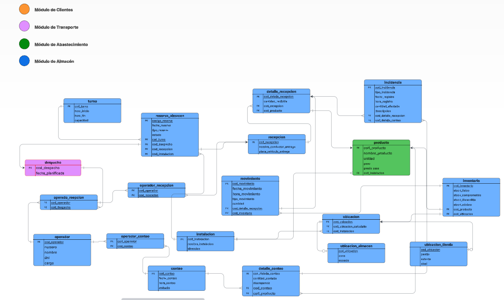

> [5. Diseño Lógico](../5.md) › [5.3. Módulo 3](5.3.md)

# 5.3. Módulo 3

# Modelo Logico

# Diccionario de Tablas del Modelo

---

## 1. Tabla: `almacen.instalacion`

**Descripción:** Almacena las facilidades físicas principales de la empresa (Almacenes y Tienda).  
**Propósito:** Servir como tabla maestra para la jerarquía de ubicaciones y la gestión de reservas.  

**Reglas de negocio relevantes:**
- `cod_instalacion` y `nombre_instalacion` deben ser únicos.

**Claves y restricciones principales:**
- **PK:** `cod_instalacion`  
- **UK:** `nombre_instalacion`

| Nombre de la columna | Descripción | Propósito | Tipo de dato | Obligatorio | Único | Restricciones adicionales |
|----------------------|-------------|------------|---------------|--------------|--------|-----------------------------|
| cod_instalacion | Código único de la instalación | Llave primaria | VARCHAR(10) | Sí | Sí | PK |
| nombre_instalacion | Nombre descriptivo de la facilidad | Identificador de negocio | VARCHAR(100) | Sí | Sí | UK |
| direccion | Dirección física de la instalación | Informativo | TEXT | No | No |  |

---

## 2. Tabla: `almacen.ubicacion` (Padre)

**Descripción:** Tabla maestra que contiene el identificador único para cada posible lugar de almacenamiento.  
**Propósito:** Servir como superclase en la jerarquía de herencia.  

**Reglas de negocio relevantes:**
- Toda ubicación debe pertenecer a una instalación.

**Claves y restricciones principales:**
- **PK:** `cod_ubicacion`  
- **FK:** `cod_instalacion` → `almacen.instalacion`

| Nombre de la columna | Descripción | Propósito | Tipo de dato | Obligatorio | Único | Restricciones adicionales |
|----------------------|-------------|------------|---------------|--------------|--------|-----------------------------|
| cod_ubicacion | Identificador único de la ubicación | Llave primaria | VARCHAR(20) | Sí | Sí | PK |
| cod_ubicacion_calculado | Código descriptivo autogenerado | Identificador de negocio | VARCHAR(100) | No | Sí | UK |
| cod_instalacion | Instalación a la que pertenece | Relación | VARCHAR(10) | Sí | No | FK a instalacion |

---

## 3. Tabla: `almacen.inventario`

**Descripción:** Registro que cuantifica el stock de un producto específico en una ubicación específica.  
**Propósito:** Responder a la pregunta “¿cuánto hay de qué y dónde?”.

**Reglas de negocio relevantes:**
- La combinación de un producto y una ubicación debe ser única.

**Claves y restricciones principales:**
- **PK:** `id_inventario`
- **FK:** `id_producto` → `producto(id_producto)`
- **FK:** `id_ubicacion` → `ubicacion(id_ubicacion)`
- **UK:** (`id_producto`, `id_ubicacion`)

| Nombre de la columna | Descripción | Propósito | Tipo de dato | Obl. | Único | Restricciones |
|----------------------|-------------|------------|---------------|-------|--------|----------------|
| id_inventario | Identificador único | Llave primaria | INT | Sí | Sí | AUTO_INCREMENT |
| id_producto | Producto asociado | Relación | INT | Sí | No | FK a producto |
| id_ubicacion | Ubicación asociada | Relación | INT | Sí | No | FK a ubicacion |
| cantidad | Stock disponible | Cuantificar stock | INT | Sí | No | DEFAULT 0 |

---

## 4. Tabla: `almacen.producto`

**Descripción:** Almacena el catálogo de todos los artículos de la ferretería.  
**Propósito:** Servir como tabla maestra para todos los procesos que involucren un artículo.

**Reglas de negocio relevantes:**
- `cod_producto` debe ser único.
- Cada producto tiene asignada una `cod_instalacion` preferida.

**Claves y restricciones principales:**
- **PK:** `cod_producto`
- **FK:** `cod_instalacion` → `almacen.instalacion`

| Nombre | Descripción | Propósito | Tipo de dato | Oblig. | Único | Restricciones |
|--------|--------------|------------|---------------|--------|--------|----------------|
| cod_producto | Código único del producto (SKU) | Llave primaria | VARCHAR(50) | Sí | Sí | PK |
| nombre_producto | Nombre comercial del producto | Descriptivo | VARCHAR(255) | Sí | No |  |
| unidad | Unidad de medida para stock | Control | VARCHAR(50) | Sí | No |  |
| peso | Peso del producto en Kg | Logística | DECIMAL(10,2) | No | No |  |
| precio_base | Costo base del producto | Comercial | DECIMAL(10,2) | No | No |  |
| cod_instalacion | Instalación preferida | Relación | VARCHAR(10) | Sí | No | FK a instalacion |

---

## 5. Tabla: `almacen.operador`

**Descripción:** Representa a un trabajador del área de almacén.  
**Propósito:** Gestionar el personal y asignar responsables a las tareas.

**Reglas de negocio relevantes:**
- El DNI de cada operador debe ser único.

**Claves y restricciones principales:**
- **PK:** `cod_operador`
- **UK:** `dni`

| Nombre | Descripción | Propósito | Tipo de dato | Oblig. | Único | Restricciones |
|--------|--------------|------------|---------------|--------|--------|----------------|
| cod_operador | Código único del operador | Llave primaria | VARCHAR(20) | Sí | Sí | PK |
| numero | Número de contacto | Comunicación | VARCHAR(20) | No | No |  |
| nombre | Nombre completo | Identificador | VARCHAR(255) | Sí | No |  |
| dni | Documento Nacional de Identidad | Identificador legal | VARCHAR(8) | Sí | Sí | UK |
| cargo | Rol dentro del almacén | Asignación | VARCHAR(50) | No | No |  |

---

## 6. Tabla: `almacen.turno`

**Descripción:** Representa un bloque de tiempo predefinido con una capacidad de atención.  
**Propósito:** Organizar la disponibilidad del almacén en franjas horarias.

**Reglas de negocio relevantes:**
- `cod_turno` es único.
- La capacidad debe ser un número positivo.

**Claves y restricciones principales:**
- **PK:** `cod_turno`

| Nombre | Descripción | Propósito | Tipo de dato | Oblig. | Único | Restricciones |
|--------|--------------|------------|---------------|--------|--------|----------------|
| cod_turno | Código único del bloque horario | Llave primaria | VARCHAR(20) | Sí | Sí | PK |
| hora_inicio | Hora de inicio del turno | Planificación | TIME | Sí | No |  |
| hora_fin | Hora de fin del turno | Planificación | TIME | Sí | No |  |
| capacidad | Nº de operaciones simultáneas | Control de reservas | INT | Sí | No | CHECK (capacidad > 0) |

---

## 7. Tabla: `almacen.ubicacion_almacen` (Hija)

**Descripción:** Especialización de `ubicacion` para lugares dentro de un almacén.  
**Propósito:** Almacenar los atributos específicos de una ubicación de almacén.

**Claves y restricciones principales:**
- **PK:** `cod_ubicacion`
- **FK:** `cod_ubicacion` → `almacen.ubicacion`

| Nombre | Descripción | Propósito | Tipo de dato | Oblig. | Único | Restricciones |
|--------|--------------|------------|---------------|--------|--------|----------------|
| cod_ubicacion | Identificador único | Llave primaria y foránea | VARCHAR(20) | Sí | Sí | FK a ubicacion |
| zona | Área designada | Agrupación | VARCHAR(50) | Sí | No |  |
| espacio | Identificador dentro de la zona | Localización | VARCHAR(50) | Sí | No |  |

---

## 8. Tabla: `almacen.ubicacion_tienda` (Hija)

**Descripción:** Especialización de `ubicacion` para lugares dentro de la tienda.  
**Propósito:** Almacenar los atributos específicos de una ubicación de tienda.

**Claves y restricciones principales:**
- **PK:** `cod_ubicacion`
- **FK:** `cod_ubicacion` → `almacen.ubicacion`

| Nombre | Descripción | Propósito | Tipo de dato | Oblig. | Único | Restricciones |
|--------|--------------|------------|---------------|--------|--------|----------------|
| cod_ubicacion | Identificador único | Llave primaria y foránea | VARCHAR(20) | Sí | Sí | FK a ubicacion |
| pasillo | Pasillo donde se encuentra | Localización | VARCHAR(50) | Sí | No |  |
| estante | Estante dentro del pasillo | Localización | VARCHAR(50) | Sí | No |  |
| nivel | Nivel o repisa en el estante | Localización | VARCHAR(50) | Sí | No |  |

---

## 9. Tabla: `almacen.recepcion`

**Descripción:** Entidad de evento que registra la llegada física de mercancía.  
**Propósito:** Mantener un historial auditable de cada entrega.

**Claves y restricciones principales:**
- **PK:** `cod_recepcion`

| Nombre | Descripción | Propósito | Tipo de dato | Oblig. | Único | Restricciones |
|--------|--------------|------------|---------------|--------|--------|----------------|
| cod_recepcion | Código único del evento | Llave primaria | VARCHAR(50) | Sí | Sí | PK |
| nombre_conductor_entrega | Nombre del conductor | Registro | VARCHAR(255) | No | No |  |
| placa_vehiculo_entrega | Placa del vehículo | Registro | VARCHAR(10) | No | No |  |
| estado | Estado del proceso | Monitoreo | VARCHAR(50) | Sí | No | DEFAULT 'Pendiente' |

---

## 10. Tabla: `almacen.despacho`

**Descripción:** Registra las salidas de productos desde el almacén hacia los clientes o tiendas.  
**Propósito:** Controlar las entregas y el cumplimiento de pedidos.

**Claves y restricciones principales:**
- **PK:** `cod_despacho`

| Nombre | Descripción | Propósito | Tipo de dato | Oblig. | Único | Restricciones |
|--------|--------------|------------|---------------|--------|--------|----------------|
| cod_despacho | Código único del despacho | Llave primaria | VARCHAR(50) | Sí | Sí | PK |
| fecha_despacho | Fecha de salida | Seguimiento | DATE | Sí | No |  |
| estado | Estado del despacho | Control | VARCHAR(50) | Sí | No | DEFAULT 'Pendiente' |
| observaciones | Comentarios adicionales | Auditoría | TEXT | No | No |  |

---

## 11. Tabla: `almacen.tarea_almacen`

**Descripción:** Representa una tarea operativa dentro del almacén (recepción, picking, conteo, despacho, etc.).  
**Propósito:** Centralizar todas las tareas para seguimiento y control.  

**Claves y restricciones principales:**
- **PK:** `cod_tarea`
- **FK:** `cod_operador` → `almacen.operador`
- **FK:** `cod_turno` → `almacen.turno`

| Nombre | Descripción | Propósito | Tipo de dato | Oblig. | Único | Restricciones |
|--------|--------------|------------|---------------|--------|--------|----------------|
| cod_tarea | Código único de tarea | Llave primaria | VARCHAR(20) | Sí | Sí | PK |
| tipo_tarea | Tipo de tarea (Recepción, Picking, etc.) | Clasificación | VARCHAR(50) | Sí | No |  |
| fecha_inicio | Inicio de la tarea | Control | DATETIME | Sí | No |  |
| fecha_fin | Fin de la tarea | Control | DATETIME | No | No |  |
| estado | Estado actual | Seguimiento | VARCHAR(50) | Sí | No | DEFAULT 'Pendiente' |
| cod_operador | Operador asignado | Relación | VARCHAR(20) | Sí | No | FK a operador |
| cod_turno | Turno asignado | Relación | VARCHAR(20) | No | No | FK a turno |

---

## 12. Tabla: `almacen.tarea_recepcion`

**Descripción:** Especialización de `tarea_almacen` enfocada en la recepción de mercadería.  
**Propósito:** Registrar los datos específicos de cada recepción.

**Claves y restricciones principales:**
- **PK y FK:** `cod_tarea` → `almacen.tarea_almacen`
- **FK:** `cod_recepcion` → `almacen.recepcion`

| Nombre | Descripción | Propósito | Tipo de dato | Oblig. | Único | Restricciones |
|--------|--------------|------------|---------------|--------|--------|----------------|
| cod_tarea | Identificador de tarea | Llave primaria y foránea | VARCHAR(20) | Sí | Sí | FK a tarea_almacen |
| cod_recepcion | Recepción asociada | Relación | VARCHAR(50) | Sí | No | FK a recepcion |

---

## 13. Tabla: `almacen.tarea_despacho`

**Descripción:** Especialización de `tarea_almacen` para tareas de despacho.  
**Propósito:** Controlar las operaciones de envío y carga.

**Claves y restricciones principales:**
- **PK y FK:** `cod_tarea` → `almacen.tarea_almacen`
- **FK:** `cod_despacho` → `almacen.despacho`

| Nombre | Descripción | Propósito | Tipo de dato | Oblig. | Único | Restricciones |
|--------|--------------|------------|---------------|--------|--------|----------------|
| cod_tarea | Identificador de tarea | Llave primaria y foránea | VARCHAR(20) | Sí | Sí | FK a tarea_almacen |
| cod_despacho | Despacho asociado | Relación | VARCHAR(50) | Sí | No | FK a despacho |

---

## 14. Tabla: `almacen.tarea_conteo`

**Descripción:** Especialización de `tarea_almacen` para el conteo cíclico o general del inventario.  
**Propósito:** Controlar los procesos de verificación física del stock.  

**Claves y restricciones principales:**
- **PK y FK:** `cod_tarea` → `almacen.tarea_almacen`

| Nombre | Descripción | Propósito | Tipo de dato | Oblig. | Único | Restricciones |
|--------|--------------|------------|---------------|--------|--------|----------------|
| cod_tarea | Identificador de tarea | Llave primaria y foránea | VARCHAR(20) | Sí | Sí | FK a tarea_almacen |
| tipo_conteo | Tipo (Cíclico o General) | Clasificación | VARCHAR(50) | Sí | No |  |
| fecha_programada | Fecha del conteo | Planificación | DATE | Sí | No |  |

---

## 15. Tabla: `almacen.resultado_conteo`

**Descripción:** Registra los resultados del conteo físico.  
**Propósito:** Comparar diferencias entre conteo físico y sistema.

**Claves y restricciones principales:**
- **PK:** `id_resultado`
- **FK:** `cod_tarea` → `almacen.tarea_conteo`

| Nombre | Descripción | Propósito | Tipo de dato | Oblig. | Único | Restricciones |
|--------|--------------|------------|---------------|--------|--------|----------------|
| id_resultado | Identificador único | Llave primaria | INT | Sí | Sí | AUTO_INCREMENT |
| cod_tarea | Tarea de conteo asociada | Relación | VARCHAR(20) | Sí | No | FK a tarea_conteo |
| id_producto | Producto contado | Relación | INT | Sí | No | FK a producto |
| cantidad_sistema | Cantidad registrada en sistema | Comparación | INT | Sí | No | DEFAULT 0 |
| cantidad_fisica | Cantidad encontrada físicamente | Comparación | INT | Sí | No |  |
| diferencia | Diferencia (física - sistema) | Análisis | INT | No | No | Calculado |

---

## 16. Tabla: `almacen.tarea_picking`

**Descripción:** Especialización de `tarea_almacen` para la preparación de pedidos.  
**Propósito:** Registrar el proceso de recolección de productos.  

**Claves y restricciones principales:**
- **PK y FK:** `cod_tarea` → `almacen.tarea_almacen`

| Nombre | Descripción | Propósito | Tipo de dato | Oblig. | Único | Restricciones |
|--------|--------------|------------|---------------|--------|--------|----------------|
| cod_tarea | Identificador de tarea | Llave primaria y foránea | VARCHAR(20) | Sí | Sí | FK a tarea_almacen |
| prioridad | Nivel de prioridad | Planificación | VARCHAR(20) | No | No |  |
| fecha_asignacion | Fecha de asignación | Control | DATETIME | Sí | No |  |

---

## 17. Tabla: `almacen.detalle_picking`

**Descripción:** Registra los productos seleccionados en el proceso de picking.  
**Propósito:** Detallar los artículos y cantidades preparadas para el despacho.

**Claves y restricciones principales:**
- **PK:** `id_detalle`
- **FK:** `cod_tarea` → `almacen.tarea_picking`
- **FK:** `id_producto` → `almacen.producto`

| Nombre | Descripción | Propósito | Tipo de dato | Oblig. | Único | Restricciones |
|--------|--------------|------------|---------------|--------|--------|----------------|
| id_detalle | Identificador del registro | Llave primaria | INT | Sí | Sí | AUTO_INCREMENT |
| cod_tarea | Tarea de picking asociada | Relación | VARCHAR(20) | Sí | No | FK a tarea_picking |
| id_producto | Producto preparado | Relación | INT | Sí | No | FK a producto |
| cantidad | Cantidad tomada | Control | INT | Sí | No | DEFAULT 1 |

---

## 18. Tabla: `almacen.supervisor`

**Descripción:** Representa a los supervisores del área de almacén.  
**Propósito:** Permitir la jerarquía de control y asignación de tareas.  

**Claves y restricciones principales:**
- **PK:** `cod_supervisor`

| Nombre | Descripción | Propósito | Tipo de dato | Oblig. | Único | Restricciones |
|--------|--------------|------------|---------------|--------|--------|----------------|
| cod_supervisor | Código del supervisor | Llave primaria | VARCHAR(20) | Sí | Sí | PK |
| nombre | Nombre completo | Identificación | VARCHAR(255) | Sí | No |  |
| dni | Documento de identidad | Control | VARCHAR(8) | Sí | Sí | UK |
| telefono | Número de contacto | Comunicación | VARCHAR(20) | No | No |  |

---

## 19. Tabla: `almacen.relacion_supervision`

**Descripción:** Representa la relación entre un supervisor y los operadores bajo su cargo.  
**Propósito:** Permitir el control jerárquico y asignación de responsabilidades.

**Claves y restricciones principales:**
- **PK:** (`cod_supervisor`, `cod_operador`)
- **FK:** `cod_supervisor` → `almacen.supervisor`
- **FK:** `cod_operador` → `almacen.operador`

| Nombre | Descripción | Propósito | Tipo de dato | Oblig. | Único | Restricciones |
|--------|--------------|------------|---------------|--------|--------|----------------|
| cod_supervisor | Supervisor responsable | Relación | VARCHAR(20) | Sí | No | FK a supervisor |
| cod_operador | Operador supervisado | Relación | VARCHAR(20) | Sí | No | FK a operador |
| fecha_asignacion | Fecha de inicio de supervisión | Control | DATE | Sí | No |  |

---

[⬅️ Anterior](../5.2/5.2.md) | [🏠 Home](../../README.md) | [Siguiente ➡️](../5.4/5.4.md)
