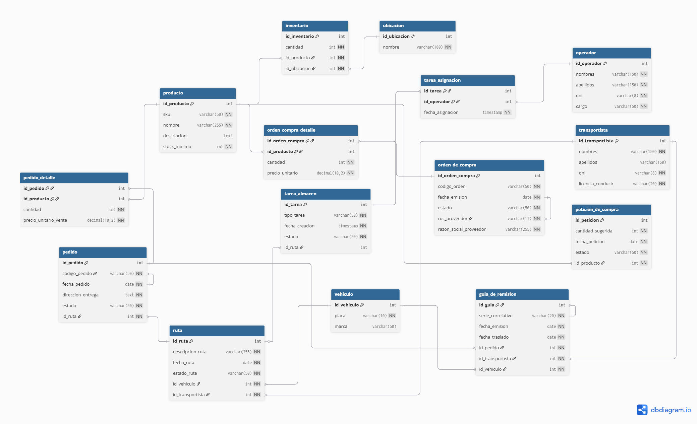

> [5. Diseño Lógico](../5.md) › [5.3. Módulo 3](5.3.md)

# 5.3. Módulo 3

# Modelo Logico

# Diccionario de Tablas del Modelo

---

## 1. Tabla: **producto**
**Descripción:** Representa cada artículo único que la ferretería compra, almacena y vende. Es el catálogo central de mercancías.  
**Propósito:** Permitir la identificación unívoca de los artículos para la gestión de inventario, ventas y compras.  

**Reglas de negocio relevantes:**
- Cada producto debe tener un código `sku` único.
- Debe registrar un `stock_minimo` para habilitar el requerimiento de reposición automática (R-304).  

**Claves y restricciones principales:**  
- **PK:** id_producto  
- **UK:** sku  

**Atributos:**  

| Nombre de la columna | Descripción                      | Propósito                  | Tipo de dato (SGBD) | Obl. | Unicidad | Restricciones Adicionales |
|-----------------------|----------------------------------|----------------------------|---------------------|------|----------|---------------------------|
| id_producto           | Identificador único del sistema | Llave primaria             | INT                 | Sí   | Sí       | AUTO_INCREMENT            |
| sku                   | Código de artículo              | Identificador comercial    | VARCHAR(50)         | Sí   | Sí       |                           |
| nombre                | Nombre comercial del producto   | Descriptivo                | VARCHAR(255)        | Sí   | No       |                           |
| descripcion           | Detalles técnicos o de uso      | Informativo                | TEXT                | No   | No       |                           |
| stock_minimo          | Cantidad mínima para reponer    | Control de inventario      | INT                 | Sí   | No       |                           |

---

## 2. Tabla: **ubicacion**
**Descripción:** Representa una localización física donde se puede almacenar inventario.  
**Propósito:** Diferenciar el stock entre la tienda y los distintos almacenes para una gestión precisa.  

**Reglas de negocio relevantes:**  
- El nombre de cada ubicación debe ser único.  

**Claves y restricciones principales:**  
- **PK:** id_ubicacion  
- **UK:** nombre  

**Atributos:**  

| Nombre de la columna | Descripción                  | Propósito                | Tipo de dato | Obl. | Unicidad | Restricciones |
|-----------------------|------------------------------|--------------------------|--------------|------|----------|---------------|
| id_ubicacion          | Identificador único          | Llave primaria           | INT          | Sí   | Sí       | AUTO_INCREMENT|
| nombre                | Nombre de la ubicación       | Identificador de negocio | VARCHAR(100) | Sí   | Sí       |               |

---

## 3. Tabla: **inventario**
**Descripción:** Registro que cuantifica el stock de un producto específico en una ubicación específica.  
**Propósito:** Responder a la pregunta "¿cuánto hay de qué y dónde?".  

**Reglas de negocio relevantes:**  
- La combinación de un producto y una ubicación debe ser única.  

**Claves y restricciones principales:**  
- **PK:** id_inventario  
- **FK:** id_producto → producto(id_producto)  
- **FK:** id_ubicacion → ubicacion(id_ubicacion)  
- **UK:** (id_producto, id_ubicacion)  

**Atributos:**  

| Nombre de la columna | Descripción                  | Propósito           | Tipo de dato | Obl. | Unicidad | Restricciones |
|-----------------------|------------------------------|---------------------|--------------|------|----------|---------------|
| id_inventario         | Identificador único          | Llave primaria      | INT          | Sí   | Sí       | AUTO_INCREMENT|
| id_producto           | Producto asociado            | Relación            | INT          | Sí   | No       | FK a producto |
| id_ubicacion          | Ubicación asociada           | Relación            | INT          | Sí   | No       | FK a ubicacion|
| cantidad              | Stock disponible             | Cuantificar stock   | INT          | Sí   | No       | DEFAULT 0     |

---

## 4. Tabla: **operador**
**Descripción:** Representa a un trabajador del área de almacén.  
**Propósito:** Gestionar el personal, asignar tareas y registrar responsabilidades (R-301).  

**Reglas de negocio relevantes:**  
- El DNI de cada operador debe ser único.  

**Claves y restricciones principales:**  
- **PK:** id_operador  
- **UK:** dni  

**Atributos:**  

| Nombre de la columna | Descripción                  | Propósito             | Tipo de dato | Obl. | Unicidad | Restricciones |
|-----------------------|------------------------------|-----------------------|--------------|------|----------|---------------|
| id_operador           | Identificador único          | Llave primaria        | INT          | Sí   | Sí       | AUTO_INCREMENT|
| nombres               | Nombres del trabajador       | Identificador         | VARCHAR(150) | Sí   | No       |               |
| apellidos             | Apellidos del trabajador     | Identificador         | VARCHAR(150) | Sí   | No       |               |
| dni                   | Documento de identidad       | Identificador legal   | VARCHAR(8)   | Sí   | Sí       |               |
| cargo                 | Rol dentro del almacén       | Asignación            | VARCHAR(50)  | Sí   | No       | CHECK(...)    |

---

## 5. Tabla: **tarea_almacen**
**Descripción:** Orden de trabajo interna para Picking o Conteo.  
**Propósito:** Organizar, asignar y monitorear el estado de operaciones internas.  

**Reglas de negocio relevantes:**  
- Una tarea de Picking debe estar asociada a una Ruta.  

**Claves y restricciones principales:**  
- **PK:** id_tarea  
- **FK:** id_ruta → ruta(id_ruta)  

**Atributos:**  

| Nombre de la columna | Descripción              | Propósito     | Tipo de dato | Obl. | Unicidad | Restricciones |
|-----------------------|--------------------------|---------------|--------------|------|----------|---------------|
| id_tarea              | Identificador único      | Llave primaria| INT          | Sí   | Sí       | AUTO_INCREMENT|
| tipo_tarea            | Tipo de trabajo          | Clasificación | VARCHAR(50)  | Sí   | No       | CHECK(...)    |
| fecha_creacion        | Fecha de creación        | Auditoría     | TIMESTAMP    | Sí   | No       | DEFAULT CURRENT_TIMESTAMP |
| estado                | Estado actual            | Monitoreo     | VARCHAR(50)  | Sí   | No       |               |
| id_ruta               | Ruta asociada (si aplica)| Relación      | INT          | No   | No       | FK a ruta     |

---

## 6. Tabla: **guia_de_remision**
**Descripción:** Documento tributario que sustenta el traslado de mercancías.  
**Propósito:** Cumplir normativa y formalizar entrega al transportista (R-307).  

**Reglas de negocio relevantes:**  
- Serie y correlativo únicos.  

**Claves y restricciones principales:**  
- **PK:** id_guia  
- **UK:** serie_correlativo  
- **FK:** id_pedido, id_transportista, id_vehiculo  

**Atributos:**  

| Nombre de la columna | Descripción         | Propósito     | Tipo de dato | Obl. | Unicidad | Restricciones |
|-----------------------|---------------------|---------------|--------------|------|----------|---------------|
| id_guia               | Identificador único | Llave primaria| INT          | Sí   | Sí       | AUTO_INCREMENT|
| serie_correlativo     | Número oficial      | Documento legal| VARCHAR(20) | Sí   | Sí       |               |
| fecha_emision         | Fecha de emisión    | Documento legal| DATE        | Sí   | No       |               |
| fecha_traslado        | Fecha de traslado   | Documento legal| DATE        | Sí   | No       |               |
| id_pedido             | Pedido asociado     | Relación      | INT          | Sí   | No       | FK a pedido   |
| id_transportista      | Conductor           | Relación      | INT          | Sí   | No       | FK a transportista|
| id_vehiculo           | Vehículo            | Relación      | INT          | Sí   | No       | FK a vehiculo |

---

## 7. Tabla: **orden_de_compra**
**Descripción:** Documento formal enviado a proveedor.  
**Propósito:** Iniciar proceso de compra (R-302).  

**Claves y restricciones principales:**  
- **PK:** id_orden_compra  
- **UK:** codigo_orden  

**Atributos:**  

| Nombre de la columna | Descripción        | Propósito      | Tipo de dato | Obl. | Unicidad | Restricciones |
|-----------------------|--------------------|----------------|--------------|------|----------|---------------|
| id_orden_compra       | Identificador único| Llave primaria | INT          | Sí   | Sí       | AUTO_INCREMENT|
| codigo_orden          | Código proveedor  | Identificador  | VARCHAR(50)  | Sí   | Sí       |               |
| fecha_emision         | Fecha creación    | Registro       | DATE         | Sí   | No       |               |
| estado                | Estado de recepción| Monitoreo     | VARCHAR(50)  | Sí   | No       |               |
| ruc_proveedor         | RUC del proveedor | Dato proveedor | VARCHAR(11)  | Sí   | No       |               |
| razon_social_proveedor| Nombre proveedor  | Dato proveedor | VARCHAR(255) | Sí   | No       |               |

---

## 8. Tabla: **peticion_de_compra**
**Descripción:** Solicitud automática de reposición.  
**Propósito:** Notificar necesidad de reabastecimiento (R-304).  

**Claves y restricciones principales:**  
- **PK:** id_peticion  
- **FK:** id_producto → producto(id_producto)  

**Atributos:**  

| Nombre de la columna | Descripción              | Propósito     | Tipo de dato | Obl. | Unicidad | Restricciones |
|-----------------------|--------------------------|---------------|--------------|------|----------|---------------|
| id_peticion           | Identificador único      | Llave primaria| INT          | Sí   | Sí       | AUTO_INCREMENT|
| id_producto           | Producto asociado        | Relación      | INT          | Sí   | No       | FK a producto |
| cantidad_sugerida     | Cantidad sugerida        | Informativo   | INT          | Sí   | No       |               |
| fecha_peticion        | Fecha de generación      | Registro      | DATE         | Sí   | No       |               |
| estado                | Estado actual            | Monitoreo     | VARCHAR(50)  | Sí   | No       |               |

---

## 9. Tabla: **pedido**
**Descripción:** Orden de venta generada por cliente.  
**Propósito:** Registrar productos comprados y despacho.  

**Claves y restricciones principales:**  
- **PK:** id_pedido  
- **UK:** codigo_pedido  
- **FK:** id_ruta  

**Atributos:**  

| Nombre de la columna | Descripción        | Propósito     | Tipo de dato | Obl. | Unicidad | Restricciones |
|-----------------------|--------------------|---------------|--------------|------|----------|---------------|
| id_pedido             | Identificador único| Llave primaria| INT          | Sí   | Sí       | AUTO_INCREMENT|
| codigo_pedido         | Código venta       | Identificador | VARCHAR(50)  | Sí   | Sí       |               |
| fecha_pedido          | Fecha venta        | Registro      | DATE         | Sí   | No       |               |
| direccion_entrega     | Dirección entrega  | Logística     | TEXT         | Sí   | No       |               |
| estado                | Estado del pedido  | Monitoreo     | VARCHAR(50)  | Sí   | No       |               |
| id_ruta               | Ruta asignada      | Relación      | INT          | Sí   | No       | FK a ruta     |

---

## 10. Tabla: **ruta**
**Descripción:** Viaje de entrega planificado.  
**Propósito:** Organizar logística de despacho (R-306).  

**Claves y restricciones principales:**  
- **PK:** id_ruta  
- **FK:** id_vehiculo, id_transportista  

**Atributos:**  

| Nombre de la columna | Descripción          | Propósito      | Tipo de dato | Obl. | Unicidad | Restricciones |
|-----------------------|----------------------|----------------|--------------|------|----------|---------------|
| id_ruta               | Identificador único  | Llave primaria | INT          | Sí   | Sí       | AUTO_INCREMENT|
| descripcion_ruta      | Nombre del viaje     | Identificador  | VARCHAR(255) | Sí   | No       |               |
| fecha_ruta            | Fecha planificada    | Planificación  | DATE         | Sí   | No       |               |
| id_vehiculo           | Vehículo asignado    | Relación       | INT          | Sí   | No       | FK a vehiculo |
| id_transportista      | Conductor asignado   | Relación       | INT          | Sí   | No       | FK a transportista|
| estado_ruta           | Estado del viaje     | Monitoreo      | VARCHAR(50)  | Sí   | No       |               |

---

## 11. Tabla: **transportista**
**Descripción:** Persona encargada de conducir y entregar.  
**Propósito:** Registrar responsables de transporte.  

**Claves y restricciones principales:**  
- **PK:** id_transportista  
- **UK:** dni, licencia_conducir  

**Atributos:**  

| Nombre de la columna | Descripción              | Propósito           | Tipo de dato | Obl. | Unicidad | Restricciones |
|-----------------------|--------------------------|---------------------|--------------|------|----------|---------------|
| id_transportista      | Identificador único      | Llave primaria      | INT          | Sí   | Sí       | AUTO_INCREMENT|
| nombres               | Nombres                 | Identificador       | VARCHAR(150) | Sí   | No       |               |
| apellidos             | Apellidos               | Identificador       | VARCHAR(150) | Sí   | No       |               |
| dni                   | Documento identidad     | Identificador legal | VARCHAR(8)   | Sí   | Sí       |               |
| licencia_conducir     | Licencia de conducir    | Identificador legal | VARCHAR(20)  | Sí   | Sí       |               |

---

## 12. Tabla: **vehiculo**
**Descripción:** Unidad de transporte.  
**Propósito:** Registrar flota de vehículos.  

**Reglas de negocio relevantes:**  
- La placa es única.  

**Claves y restricciones principales:**  
- **PK:** id_vehiculo  
- **UK:** placa  

**Atributos:**  

| Nombre de la columna | Descripción        | Propósito          | Tipo de dato | Obl. | Unicidad | Restricciones |
|-----------------------|--------------------|--------------------|--------------|------|----------|---------------|
| id_vehiculo           | Identificador único| Llave primaria     | INT          | Sí   | Sí       | AUTO_INCREMENT|
| placa                 | Placa del vehículo | Identificador legal| VARCHAR(10)  | Sí   | Sí       |               |
| marca                 | Marca del vehículo | Descriptivo        | VARCHAR(50)  | No   | No       |               |

---

# Tablas Asociativas (Relaciones N:M)

---

## 13. Tabla: **orden_compra_detalle**
**Descripción:** Detalla productos y cantidades de una orden de compra.  
**Propósito:** Resolver N:M entre orden_de_compra y producto.  

**Claves y restricciones principales:**  
- **PK:** (id_orden_compra, id_producto)  
- **FK:** id_orden_compra, id_producto  

**Atributos:**  

| Nombre de la columna | Descripción            | Propósito        | Tipo de dato   | Obl. | Unicidad | Restricciones |
|-----------------------|------------------------|------------------|----------------|------|----------|---------------|
| id_orden_compra       | Orden asociada         | Llave compuesta  | INT            | Sí   | No       | FK a orden_de_compra|
| id_producto           | Producto asociado      | Llave compuesta  | INT            | Sí   | No       | FK a producto|
| cantidad              | Cantidad pedida        | Cuantificar compra| INT           | Sí   | No       |               |
| precio_unitario       | Precio unitario compra | Registrar costo  | DECIMAL(10,2) | Sí   | No       |               |

---

## 14. Tabla: **pedido_detalle**
**Descripción:** Detalla productos y cantidades de un pedido.  
**Propósito:** Resolver N:M entre pedido y producto.  

**Claves y restricciones principales:**  
- **PK:** (id_pedido, id_producto)  
- **FK:** id_pedido, id_producto  

**Atributos:**  

| Nombre de la columna | Descripción          | Propósito         | Tipo de dato   | Obl. | Unicidad | Restricciones |
|-----------------------|----------------------|-------------------|----------------|------|----------|---------------|
| id_pedido             | Pedido asociado      | Llave compuesta   | INT            | Sí   | No       | FK a pedido   |
| id_producto           | Producto asociado    | Llave compuesta   | INT            | Sí   | No       | FK a producto |
| cantidad              | Cantidad vendida     | Cuantificar venta | INT            | Sí   | No       |               |
| precio_unitario_venta | Precio unitario venta| Registrar ingreso | DECIMAL(10,2) | Sí   | No       |               |

---

## 15. Tabla: **tarea_asignacion**
**Descripción:** Registra qué operadores son asignados a qué tareas.  
**Propósito:** Resolver N:M entre tarea_almacen y operador.  

**Claves y restricciones principales:**  
- **PK:** (id_tarea, id_operador)  
- **FK:** id_tarea, id_operador  

**Atributos:**  

| Nombre de la columna | Descripción             | Propósito     | Tipo de dato | Obl. | Unicidad | Restricciones |
|-----------------------|-------------------------|---------------|--------------|------|----------|---------------|
| id_tarea              | Tarea asociada         | Llave compuesta| INT         | Sí   | No       | FK a tarea_almacen|
| id_operador           | Operador asignado      | Llave compuesta| INT         | Sí   | No       | FK a operador|
| fecha_asignacion      | Fecha/hora asignación  | Auditoría      | TIMESTAMP    | Sí   | No       | DEFAULT CURRENT_TIMESTAMP |

[⬅️ Anterior](../5.2/5.2.md) | [🏠 Home](../../README.md) | [Siguiente ➡️](../5.4/5.4.md)
