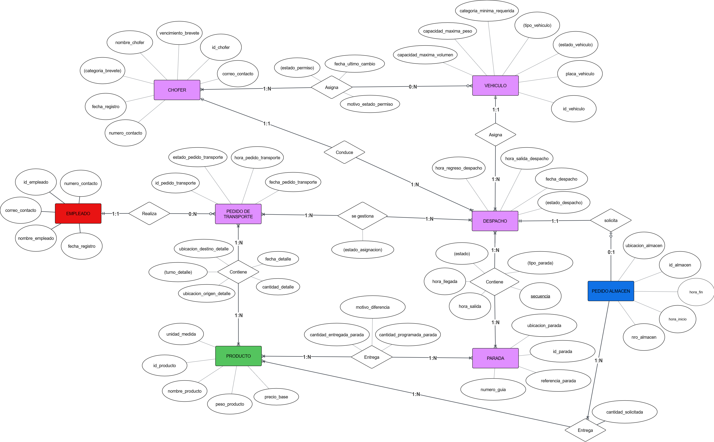
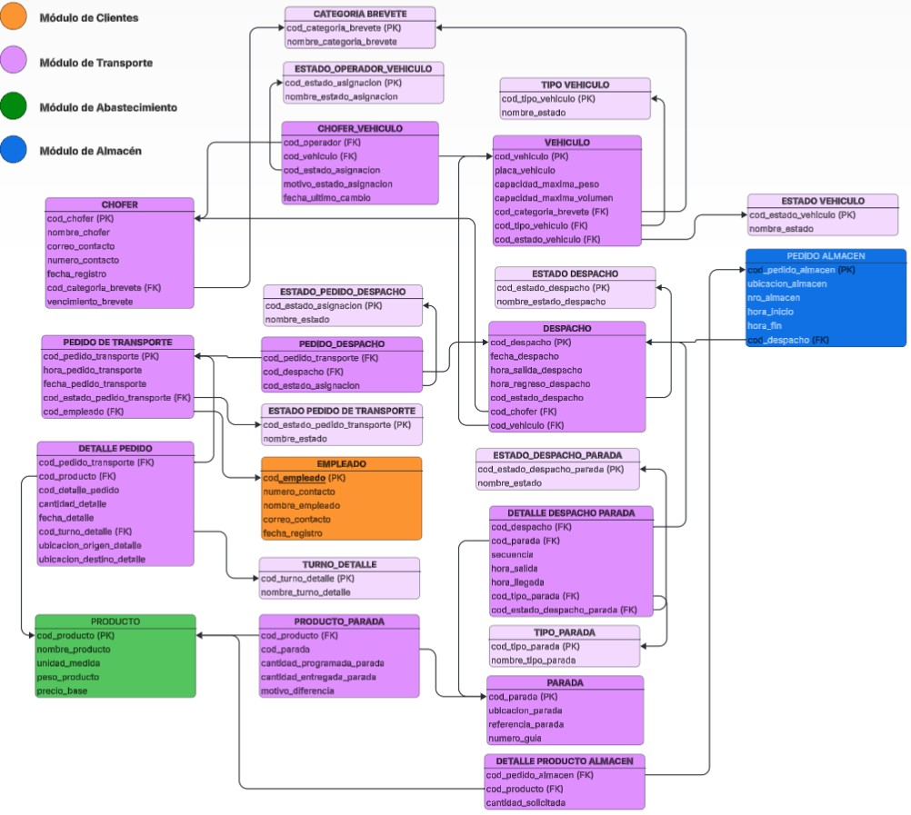

## 🏗️ **Creación de Tablas — Módulo de Transporte**

## 𝄜 **Creación de Tablas**

🧠 **SE CREÓ EL MODELO ENTIDAD–RELACIÓN**
📘 En este punto, se integraron y aplicaron las correcciones y mejoras identificadas en la PC1 para que el **módulo de Transporte/Distribución** refleje con precisión los requisitos del negocio.

### Entidades clave del módulo de Transporte

| Entidad                        | Descripción breve                                                                                                                                                 |
| ------------------------------ | ----------------------------------------------------------------------------------------------------------------------------------------------------------------- |
| **Vehículo**                   | Identifica unidades y sus capacidades (peso/volumen) y estado operativo.                                                                                          |
| **Chofer**                     | Conductores con datos de contacto y categoría de brevete.                                                                                                         |
| **Despacho**                   | Viaje planificado/real ejecutado por un vehículo con chofer asignado.                                                                                             |
| **Parada**                     | Punto de carga/descarga o servicio dentro de un despacho.                                                                                                         |
| **Detalle de Despacho–Parada** | Secuencia y estado de cada parada durante el despacho.                                                                                                            |
| **Operador–Vehículo**          | Asignación (y su estado) entre chofer y vehículo.                                                                                                                 |
| **Catálogos**                  | Estados y tipos: `estado_despacho`, `tipo_parada`, `estado_despacho_parada`, `estado_vehiculo`, `tipo_vehiculo`, `categoria_brevete`, `estado_operador_vehiculo`. |

🔄 **Relaciones modeladas**: programación de despachos, secuenciación de paradas, control de estados por parada, asignación Chofer–Vehículo (histórico), integración con pedidos/almacén (vía FKs existentes en el esquema general).


---



---

✅ **Consideraciones incorporadas**

| Aspecto            | Detalle técnico                                                                      |
| ------------------ | ------------------------------------------------------------------------------------ |
| Códigos PK         | Alfanuméricos hasta **100** caracteres (ej. `cod_*` = `varchar(100)`).               |
| Catálogos          | Tablas de estado/tipo normalizadas y referenciadas por FK.                           |
| Tablas asociativas | Uso de **PK compuesta** donde corresponde (p.ej., `detalle_despacho_parada`).        |
| Estilo             | **Se respeta exactamente** el DDL entregado por el módulo (sin cambios).             |
| Esquemas           | Las tablas se crean dentro de `MODULO_TRANSPORTE` (ver *wrapper* con `search_path`). |

---

📐 **SE CREÓ EL ESQUEMA RELACIONAL**
El MER fue transformado al modelo relacional con PK/FK explícitas y tablas asociativas.

| Tabla puente                | Relación          | Atributos adicionales               |
| --------------------------- | ----------------- | ----------------------------------- |
| **operador_vehiculo**       | Chofer ↔ Vehículo | estado, motivo, fecha_último_cambio |
| **detalle_despacho_parada** | Despacho ↔ Parada | secuencia, horas, tipo, estado      |

🧩 Estas estructuras permiten trazar el ciclo operativo del despacho (planificación → ejecución → control por parada).

---



---


## 🧪 **Forma de generación (cómo se hizo)**

* **Manual a partir del MER**, conservando exactamente los nombres, tipos y restricciones definidos en la PC1.
* **Verificación asistida por IA** para revisar consistencia entre PK/FK y dependencias.

---


### 𝄜 Tabla `despacho`

```ts
CREATE TABLE despacho (
  cod_despacho VARCHAR(100) NOT NULL,
  fecha_despacho DATE NOT NULL DEFAULT NOW(),
  hora_salida_despacho TIME NOT NULL DEFAULT NOW(),
  hora_regreso_despacho TIME NOT NULL DEFAULT NOW(),
  cod_estado_despacho INTEGER NOT NULL,
  cod_chofer VARCHAR(100) NOT NULL,
  cod_vehiculo VARCHAR(100) NOT NULL,
  PRIMARY KEY (cod_despacho),
  FOREIGN KEY (cod_estado_despacho) REFERENCES estado_despacho(cod_estado_despacho),
  FOREIGN KEY (cod_vehiculo) REFERENCES vehiculo(cod_vehiculo),
  FOREIGN KEY (cod_chofer) REFERENCES chofer(cod_chofer)
);
```

### 𝄜 Tabla `detalle_despacho_parada`

```ts
CREATE TABLE detalle_despacho_parada (
  cod_despacho VARCHAR(100) NOT NULL,
  cod_parada VARCHAR(100) NOT NULL,
  secuencia INTEGER NOT NULL,
  hora_salida TIME NOT NULL DEFAULT NOW(),
  hora_llegada TIME NOT NULL DEFAULT NOW(),
  cod_tipo_parada INTEGER NOT NULL,
  cod_estado_despacho_parada INTEGER NOT NULL,
  PRIMARY KEY (cod_despacho, cod_parada, secuencia),
  FOREIGN KEY (cod_estado_despacho_parada) REFERENCES estado_despacho_parada(cod_estado_despacho_parada),
  FOREIGN KEY (cod_tipo_parada) REFERENCES tipo_parada(cod_tipo_parada),
  FOREIGN KEY (cod_despacho) REFERENCES despacho(cod_despacho),
  FOREIGN KEY (cod_parada) REFERENCES parada(cod_parada)
);
```
[SCRIPT SQL AJUSTADO](TRANSPORTE_TABLAS.sql)

---


