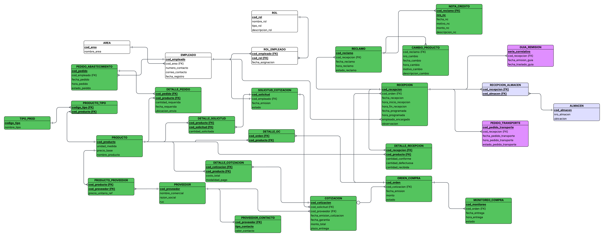

# 🏗️ Creación de Tablas — Módulo de Abastecimiento

## 𝄜 Creación de Tablas

### 🧠 SE CREÓ EL MODELO ENTIDAD–RELACIÓN

📘 **En este punto, se integraron y aplicaron las correcciones y mejoras identificadas en la Práctica Calificada 1 (PC1)**, asegurando que el modelo refleje con precisión los requisitos del negocio.

Se identificaron las **entidades clave** del proceso de abastecimiento:

| Entidad | Descripción breve |
|----------|------------------|
| **Área** | Agrupa al personal y sus funciones dentro del sistema. |
| **Empleado** | Registra los datos del personal vinculado a pedidos y recepciones. |
| **Rol** | Define permisos y responsabilidades dentro del flujo en la ferretería. |
| **Pedido de Abastecimiento** | Inicia el ciclo de compras y abastecimiento. |
| **Producto** | Elementos solicitados, cotizados o comprados. |
| **Proveedor** | Empresas o personas que ofertan los productos. |
| **Cotización** | Resultado de la evaluación de cotizaciones. |
| **Solicitud de Cotización** | Requerimiento formal hacia los proveedores. |
| **Orden de Compra** | Documento de oferta con precios, plazos y condiciones.|
| **Monitoreo de Compra** | Control del estado y seguimiento de órdenes emitidas. |
| **Recepción** | Registro físico de productos entregados. |
| **Guía de Remisión** | Documento que acompaña el traslado o entrega. |
| **Pedido de Transporte** | Coordinación logística para recojo. |
| **Almacén** | Espacio de control y validación del inventario. |
| **Reclamo** | Registro de incidencias en recepción o calidad. |
| **Nota de Crédito** | Ajuste económico por incidencias o devoluciones. |
| **Cambio de Producto** | Sustitución física tras reclamo validado. |

🔄 Se modelaron las **relaciones** y **cardinalidades** que reflejan el flujo operativo: revisión y priorización de pedidos, cotización, generación de órdenes de compra por producto, programación de recepciones, validación de guía, despacho a almacén o transporte, así como gestión de incidencias y reclamos que derivan en **nota de crédito** o **cambio de producto**.

---

### ✅ Consideraciones incorporadas

| Aspecto | Detalle técnico |
|----------|----------------|
| **Códigos PK** | Alfanuméricos ≤ 15 caracteres (`ABC-0001`). |
| **Sensibilidad** | `case-insensitive` para cadenas (usando **citext**). |
| **Longitudes estándar** | Nombres (30), Descripción (50), Unidad de medida (10). |
| **Tablas puente** | Incluyen atributos propios: cantidad, fecha, modalidad_pago, etc. |
| **Estilo** | Nombres de tablas en **MAYÚSCULA**, dentro del esquema `MODULO_ABASTECIMIENTO`. |

---


---
## 📐 SE CREÓ EL ESQUEMA RELACIONAL

El **Modelo Entidad–Relación (MER)** fue transformado al **Modelo Relacional**, incorporando **PK/FK explícitas**, **restricciones de integridad** y **tablas puente** para las relaciones *muchos a muchos*.

| Tabla puente | Relación | Atributos adicionales |
|---------------|-----------|-----------------------|
| **EMPLEADO_ROL** | Empleado ↔ Rol | — |
| **PEDIDO_ABASTECIMIENTO_PRODUCTO** | Pedido ↔ Producto | cantidad, fecha, ubicación |
| **PROVEEDOR_PRODUCTO** | Proveedor ↔ Producto | precio_unitario_ref |
| **SOLICITUD_PRODUCTO** | Solicitud ↔ Producto | cantidad_solicitada |
| **COTIZACION_PRODUCTO** | Cotización ↔ Producto | costo_total, modalidad_pago |
| **ORDEN_COMPRA_PRODUCTO** | Orden de Compra ↔ Producto | — |
| **RECEPCION_PRODUCTO** | Recepción ↔ Producto | cantidad_conforme, defectuosa, recibida |

> 🧩 Estas estructuras garantizan trazabilidad completa desde la **solicitud** inicial hasta la **recepción y control final**, permitiendo consultas analíticas y auditorías de procesos.



---

## SE PASÓ A DBML + IA Y SE GENERÓ EL SCRIPT AUTOMÁTICO 💻
Se utilizó la metodología **DBML + IA** para generar el **código SQL (DDL)** base de manera progresiva y controlada. Este proceso permitió afinar la estructura y las restricciones del modelo relacional, asegurando consistencia con el modelado conceptual previo.<br>

### 📌 Enfoque metodológico
- Partimos del **modelo conceptual** (entidades, atributos y relaciones con cardinalidades).  
- Representamos el modelo en **DBML** con apoyo de **IA**, garantizando que la estructura resultante fuera fiel al modelado conceptual.  
- Iteramos sobre el **DBML** y sus proyecciones a **SQL** para afinar claves y restricciones:
  - Definición de **PK** en todas las tablas.  
  - **FK** con referencias explícitas al esquema `MODULO_ABASTECIMIENTO`.  
  - **UNIQUE** donde existía unicidad de negocio (p. ej., `ruc`, `nro_almacen`, `correo_contacto`).  
  - Tipos y **DEFAULT** cuando correspondía.  
- Resolución de relaciones **N:M** mediante **tablas puente** con **PK compuesta** (manteniendo integridad y unicidad por par).  
- Revisión de relaciones **1:1** (p. ej., `GUIA_DE_REMISION`, `RECEPCION_ALMACEN`, `PEDIDO_DE_TRANSPORTE`) estableciendo **UNIQUE/PK** apropiadas para garantizar la cardinalidad.

[Codigo DBML](Abastecimiento_dbml.md)
---

### 🧩 Script resultante
> Este apartado describe el **script definitivo**, explicando la estructura y organización final de las tablas dentro del esquema `MODULO_ABASTECIMIENTO`.

#### Preparación y esquema
- `DROP SCHEMA IF EXISTS MODULO_ABASTECIMIENTO CASCADE;` → limpia el esquema para reprocesos.  
- `CREATE SCHEMA MODULO_ABASTECIMIENTO;` → crea el ámbito lógico para todas las tablas.  

#### Núcleo organizacional (estructura del área y personas)
- **AREA:** `id_area` (**PK**) y `nombre_area` **UNIQUE** → catálogos de áreas sin duplicados.  
- **EMPLEADO:** PK alfanumérica; **FK → AREA** en `id_area`; `correo_contacto` **UNIQUE**; `fecha_registro` **NOT NULL**.  
- **ROL:** catálogo de roles con `nombre_rol` **UNIQUE** (evita duplicidad).  
- **ROL_EMPLEADO (N:M):** PK compuesta (`id_empleado`, `id_rol`); incluye `fecha_asignacion` **NOT NULL**.  

#### Catálogo de productos y tipologías
- **PRODUCTO:** PK alfanumérica; `unidad_medida` y `precio_base` (`decimal(12,2)`).  
- **TIPO:** catálogo de tipologías de producto.  
- **PRODUCTO_TIPO (N:M):** combina **producto** y **tipo** con **PK compuesta**.  

#### Proveedores y contactos
- **PROVEEDOR:** `ruc` **UNIQUE** (un RUC por proveedor).  
- **PROVEEDOR_CONTACTO:** PK (`id_proveedor`, `tipo_contacto`) → múltiples contactos por proveedor.  

#### Sourcing: solicitudes y cotizaciones
- **SOLICITUD_DE_COTIZACION:** **FK → EMPLEADO** identifica quién genera la solicitud; guarda `fecha_emision_solicitud` y `estado`.  
- **DETALLE_SOLICITUD (N:M solicitud–producto):** PK (`id_solicitud`, `id_producto`) + `cantidad_solicitada`.  
- **COTIZACION:** **FK → SOLICITUD_DE_COTIZACION** y **FK → PROVEEDOR**; incluye `fecha_emision_cotizacion`, `fecha_garantia`, `monto_total`, `plazo_entrega`.  
- **DETALLE_COTIZACION (N:M cotización–producto):** PK (`id_cotizacion`, `id_producto`) + `costo_total` y `modalidad_pago`.  

#### Precios de referencia por proveedor
- **PRODUCTO_PROVEEDOR (N:M):** PK (`id_proveedor`, `id_producto`) + `precio_unitario_ref`.  

#### Compra: OC y su desglose
- **PEDIDO_DE_ABASTECIMIENTO:** generado por un **empleado**, con `fecha_pedido`, `hora_pedido`, `estado_pedido`.  
- **DETALLE_PEDIDO (N:M pedido–producto):** PK (`id_pedido`, `id_producto`) + `cantidad_requerida`, `fecha_requerida`, `ubicacion_envio`.  
- **ORDEN_DE_COMPRA:** **FK → COTIZACION**, con `fecha_emision`, `monto`, `estado`.  
- **DETALLE_OC (N:M OC–producto):** PK (`id_orden`, `id_producto`).  

#### Logística: monitoreo, recepción, guía, almacén y transporte
- **MONITOREO_DE_COMPRA:** por **OC**, con `fecha_entrega`, `hora_entrega` y `estado`.  
- **RECEPCION:** por **OC**, con fechas/horas programadas y reales, `empleado_encargado` y `observacion`.  
- **GUIA_DE_REMISION:** **1:1 con RECEPCION**, `id_recepcion` **UNIQUE**, `serie_correlativo` como **PK**.  
- **ALMACEN:** `nro_almacen` **UNIQUE** y `ubicacion`.  
- **RECEPCION_ALMACEN:** **1:1 por recepción**, **PK** (`id_recepcion`).  
- **PEDIDO_DE_TRANSPORTE:** **1:1 con RECEPCION**, **UNIQUE** (`id_recepcion`), con fecha/hora/estado del pedido logístico.  

#### Calidad e incidencias (entidades débiles)
- **RECLAMO:** nace de una **RECEPCION**; almacena fechas y `estado`.  
- **NOTA_DE_CREDITO:** entidad débil de `RECLAMO`; **PK compuesta** (`id_reclamo`, `nro_nc`).  
- **CAMBIO_DE_PRODUCTO:** entidad débil de `RECLAMO`; **PK** (`id_reclamo`, `nro_cambio`).  

#### Recepción por producto (cantidades)
- **DETALLE_RECEPCION:** (N:M recepción–producto), **PK** (`id_recepcion`, `id_producto`) y cantidades (`conforme`, `defectuosa`, `recibida`).  

---

### 🔒 Decisiones de integridad y reglas de negocio

- **PK** en todas las tablas (alfanuméricas para entidades principales; compuestas para tablas puente o débiles).  
- **FK** totalmente calificadas: `MODULO_ABASTECIMIENTO.<TABLA>(columna)`.  
- **UNIQUE:**
  - `EMPLEADO.correo_contacto` (no se repite).  
  - `PROVEEDOR.ruc` (un RUC por proveedor).  
  - `ALMACEN.nro_almacen` (identificador único).  
  - `GUIA_DE_REMISION.id_recepcion` (1:1).  
  - `PEDIDO_DE_TRANSPORTE.id_recepcion` (1:1).  
- **NOT NULL** en fechas/horas y campos críticos (cantidades, estados, montos).  
- **Tipos monetarios:** `decimal(12,2)` para precios y montos.  
- **Cardinalidades:**
  - **N:M** resueltas con **tablas de detalle** (PK compuesta).  
  - **1:1** aseguradas con **UNIQUE** o **PK** sobre la **FK**.  

---

**EJEMPLO:**
```ts
-- Preparación
DROP SCHEMA IF EXISTS MODULO_ABASTECIMIENTO CASCADE;
CREATE SCHEMA MODULO_ABASTECIMIENTO;

-- =============================================================
-- CREACIÓN DE TABLAS
-- =============================================================

-- AREA
CREATE TABLE MODULO_ABASTECIMIENTO.AREA (
  id_area       varchar PRIMARY KEY,
  nombre_area   varchar NOT NULL UNIQUE
);

-- EMPLEADO
CREATE TABLE MODULO_ABASTECIMIENTO.EMPLEADO (
  id_empleado       varchar PRIMARY KEY,
  id_area           varchar NOT NULL REFERENCES MODULO_ABASTECIMIENTO.AREA(id_area),
  numero_contacto   varchar NOT NULL,
  correo_contacto   varchar NOT NULL UNIQUE,
  fecha_registro    date NOT NULL
);

-- ROL
CREATE TABLE MODULO_ABASTECIMIENTO.ROL (
  id_rol            varchar PRIMARY KEY,
  nombre_rol        varchar NOT NULL UNIQUE,
  tipo_rol          varchar NOT NULL,
  descripcion_rol   varchar NOT NULL
);

-- ROL_EMPLEADO (N:M)
CREATE TABLE MODULO_ABASTECIMIENTO.ROL_EMPLEADO (
  id_empleado       varchar NOT NULL REFERENCES MODULO_ABASTECIMIENTO.EMPLEADO(id_empleado),
  id_rol            varchar NOT NULL REFERENCES MODULO_ABASTECIMIENTO.ROL(id_rol),
  fecha_asignacion  date NOT NULL,
  PRIMARY KEY (id_empleado, id_rol)
);

-- PRODUCTO
CREATE TABLE MODULO_ABASTECIMIENTO.PRODUCTO (
  id_producto      varchar PRIMARY KEY,
  nombre_producto  varchar NOT NULL,
  unidad_medida    varchar NOT NULL,
  precio_base      decimal(12,2) NOT NULL
);

-- TIPO
CREATE TABLE MODULO_ABASTECIMIENTO.TIPO (
  codigo_tipo   varchar PRIMARY KEY,
  nombre_tipo   varchar NOT NULL
);

-- PRODUCTO_TIPO (N:M)
CREATE TABLE MODULO_ABASTECIMIENTO.PRODUCTO_TIPO (
  codigo_tipo   varchar NOT NULL REFERENCES MODULO_ABASTECIMIENTO.TIPO(codigo_tipo),
  id_producto   varchar NOT NULL REFERENCES MODULO_ABASTECIMIENTO.PRODUCTO(id_producto),
  PRIMARY KEY (id_producto, codigo_tipo)
);
```

[SCRIPT SQL AJUSTADO](MABASTECIMIENTO_TABLAS.sql)
---
---
