> [9. Preparación para Implementación](../../9.md) › [9.1. Sentencias SQL por módulo / prototipo](../9.1.md) › [9.1.2. Módulo 2 / Integrante 2](9.1.2.md)

# 9.1.2. Módulo 2 / Integrante 2

# Módulo 2: Transporte

## REQUERIMIENTO R-201: Registrar Vehículo

| **Código Requerimiento** | **R-201** |
| --- | --- |
| Código Interfaz | I-201 |
| Imagen Interfaz |  |

**Eventos:**

- **Carga de la Página:** Se llena la tabla con la flota de vehículos existente. La columna "Marca" visible en la interfaz no existe en la tabla `VEHICULO` del script SQL, por lo que se omite en la consulta.
    
    ```
    SELECT
        v.placa_vehiculo AS "Placa",
        tv.descp_tipo_vehiculo AS "Tipo de Vehículo",
        v.capacidad_maxima_peso AS "Capacidad de Carga",
        v.capacidad_maxima_volumen AS "Volumen de Carga",
        v.categoria_minima_requerida AS "Categoría Licencia",
        ev.descp_estado_vehiculo AS "Estado Físico",
        v.cod_vehiculo -- ID interno para botones "Editar" / "Eliminar"
    FROM
        VEHICULO v
    JOIN
        TIPO_VEHICULO tv ON v.cod_tipo_vehiculo = tv.cod_tipo_vehiculo
    JOIN
        ESTADO_VEHICULO ev ON v.cod_estado_vehiculo = ev.cod_estado_vehiculo
    ORDER BY
        v.placa_vehiculo;
    
    ```
    
- **Botón "+ Añadir Vehículo":** Redirige al usuario (o abre la modal) a la interfaz I-202 para el registro.

| **Código Requerimiento** | **R-201** |
| --- | --- |
| Código Interfaz | I-202 |
| Imagen Interfaz | 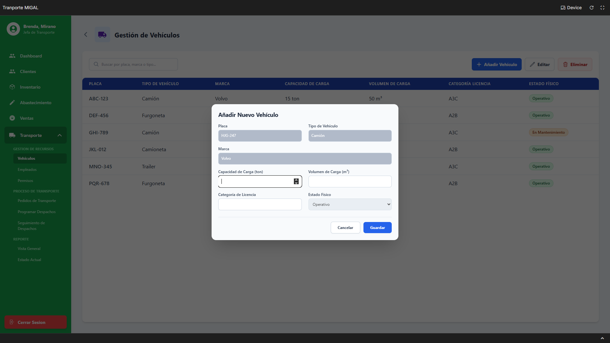 |

**Eventos:**

- **Carga de la Página (Llenar Dropdowns):** Se cargan las opciones para los campos de tipo `SELECT`.
    
    ```
    -- Para el dropdown "Tipo de Vehículo"
    SELECT cod_tipo_vehiculo, descp_tipo_vehiculo FROM TIPO_VEHICULO;
    
    -- Para el dropdown "Estado Físico" (basado en el flujo de R-202)
    SELECT cod_estado_vehiculo, descp_estado_vehiculo FROM ESTADO_VEHICULO;
    
    ```
    
- **Botón "Guardar":** Inserta el nuevo registro en la tabla `VEHICULO`. El campo "Marca" no se inserta al no existir en el script SQL.
    
    ```
    INSERT INTO VEHICULO (
        placa_vehiculo,
        cod_tipo_vehiculo,
        cod_estado_vehiculo,
        capacidad_maxima_peso,
        capacidad_maxima_volumen,
        categoria_minima_requerida
    )
    VALUES (
        <Placa Ingresada>,
        <ID Tipo Vehículo Seleccionado>,
        <ID Estado Físico Seleccionado (ej. 'Operativo')>,
        <Capacidad de Carga Ingresada>,
        <Volumen de Carga Ingresado>,
        <Categoría de Licencia Ingresada>
    );
    
    ```
    

## REQUERIMIENTO R-202: Actualizar Datos del Vehículo

| **Código Requerimiento** | **R-202** |
| --- | --- |
| Código Interfaz | I-201 |
| Imagen Interfaz |  |

**Eventos:**

- **Botón "Editar":** Abre la ventana modal I-203, solicitando la placa del vehículo a editar.

| **Código Requerimiento** | **R-202** |
| --- | --- |
| Código Interfaz | I-203 |
| Imagen Interfaz | 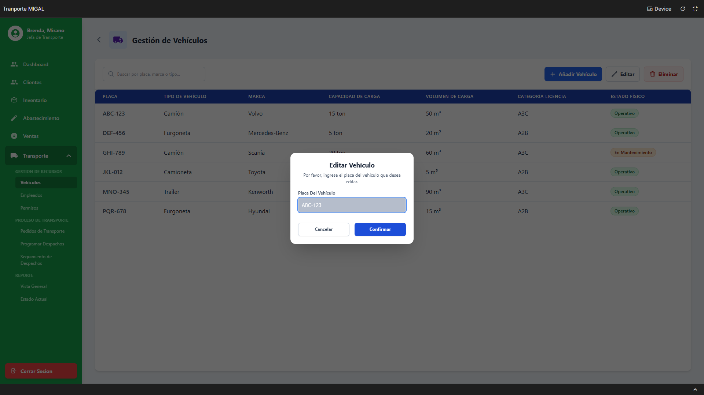 |

**Eventos:**

- **Botón "Confirmar":** Busca el vehículo en la BD para verificar su existencia y, si lo encuentra, usa sus datos para poblar la siguiente modal (I-204).
    
    ```
    SELECT
        cod_vehiculo,
        placa_vehiculo,
        cod_tipo_vehiculo,
        cod_estado_vehiculo,
        capacidad_maxima_peso,
        capacidad_maxima_volumen,
        categoria_minima_requerida
    FROM
        VEHICULO
    WHERE
        placa_vehiculo = <Placa Del Vehículo Ingresada>;
    
    ```
    

| **Código Requerimiento** | **R-202** |
| --- | --- |
| Código Interfaz | I-204 |
| Imagen Interfaz |  |

**Eventos:**

- **Carga de la Página (Llenar Dropdowns y Datos):** El formulario se carga con los datos obtenidos de la consulta en I-203. Se cargan los *dropdowns* para permitir la modificación.
    
    ```
    -- Para el dropdown "Tipo de Vehículo"
    SELECT cod_tipo_vehiculo, descp_tipo_vehiculo FROM TIPO_VEHICULO;
    
    -- Para el dropdown "Estado Físico"
    SELECT cod_estado_vehiculo, descp_estado_vehiculo FROM ESTADO_VEHICULO;
    
    ```
    
- **Botón "Guardar":** Actualiza los datos del vehículo correspondiente a la placa mostrada.
    
    ```
    UPDATE VEHICULO
    SET
        cod_tipo_vehiculo = <ID Tipo Vehículo Seleccionado>,
        cod_estado_vehiculo = <ID Estado Físico Seleccionado>,
        capacidad_maxima_peso = <Capacidad de Carga Modificada>,
        capacidad_maxima_volumen = <Volumen de Carga Modificado>,
        categoria_minima_requerida = <Categoría de Licencia Modificada>
    WHERE
        placa_vehiculo = <Placa del Vehículo (No editable)>;
    
    ```
    

## REQUERIMIENTO R-203: Eliminar Vehículo

| **Código Requerimiento** | **R-203** |
| --- | --- |
| Código Interfaz | I-201 |
| Imagen Interfaz |  |

**Eventos:**

- **Botón "Eliminar":** Abre la ventana modal I-205, solicitando la placa del vehículo a eliminar.

| **Código Requerimiento** | **R-203** |
| --- | --- |
| Código Interfaz | I-205 |
| Imagen Interfaz |  |

**Eventos:**

- **Botón "Confirmar":** Busca el vehículo y verifica que no tenga dependencias activas (como despachos programados) antes de mostrar la confirmación final.
    
    ```
    -- 1. Verificar existencia
    SELECT cod_vehiculo FROM VEHICULO WHERE placa_vehiculo = <Placa Ingresada>;
    
    -- 2. Verificar dependencias (Excepción R-203)
    -- (Se asume que 'Completado' es el estado final de un despacho)
    SELECT cod_despacho
    FROM DESPACHO d
    JOIN ESTADO_DESPACHO ed ON d.cod_estado_despacho = ed.cod_estado_despacho
    WHERE d.cod_vehiculo = (SELECT cod_vehiculo FROM VEHICULO WHERE placa_vehiculo = <Placa Ingresada>)
      AND ed.descp_estado_despacho != 'Completado';
    
    ```
    

| **Código Requerimiento** | **R-203** |
| --- | --- |
| Código Interfaz | I-206 |
| Imagen Interfaz | 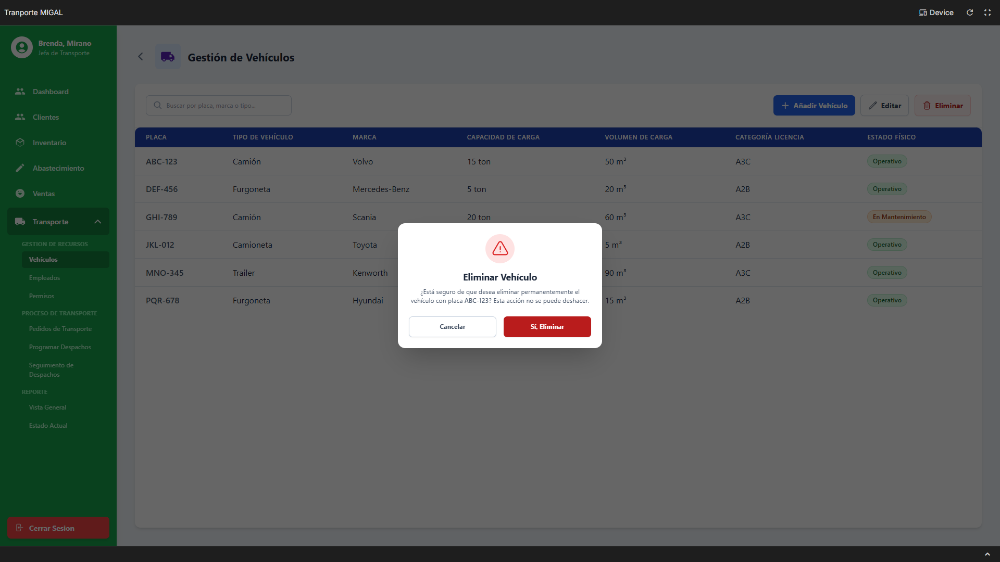 |

**Eventos:**

- **Carga de la Página:** Muestra la advertencia de eliminación permanente.
- **Botón "Sí, Eliminar":** Ejecuta la eliminación permanente del registro.
    
    ```
    DELETE FROM VEHICULO
    WHERE placa_vehiculo = <Placa Ingresada>;
    
    ```
    

## REQUERIMIENTO R-204: Registrar Empleado

| **Código Requerimiento** | **R-204** |
| --- | --- |
| Código Interfaz | I-207 |
| Imagen Interfaz |  |

**Eventos:**

- **Carga de la Página:** Carga la lista de empleados (choferes) del área de transporte. El "Código" (ej. "EMP001") no corresponde directamente a `cod_usuario` (SERIAL), por lo que se asume que es un identificador visual o un campo de `DOCUMENTO_PERSONA`. La consulta prioriza los datos del script SQL.
    
    ```
    SELECT
        u.cod_usuario, -- ID interno para botones
        p.nombre_persona AS "Nombre",
        c.valor_contacto AS "Teléfono",
        ch.categoria_brevete AS "Brevete",
        ch.vencimiento_brevete AS "Fecha de Vencimiento",
        esu.descp_estado_usuario AS "Estado"
    FROM
        USUARIO u
    JOIN
        PERSONA p ON u.cod_persona = p.cod_persona
    JOIN
        CHOFER ch ON u.cod_usuario = ch.cod_usuario
    JOIN
        ESTADO_USUARIO esu ON u.cod_estado_usuario = esu.cod_estado_usuario
    LEFT JOIN
        CONTACTO_PERSONA cp ON p.cod_persona = cp.cod_persona
        AND cp.principal_contacto = (SELECT cod_tipo_contacto FROM TIPO_CONTACTO WHERE valor_tipo_contacto = 'Telefono') -- Asumiendo 'Telefono' como principal
    LEFT JOIN
        CONTACTO c ON cp.cod_contacto = c.cod_contacto
    WHERE
        u.cod_area = (SELECT cod_area FROM AREA WHERE valor_area = 'Transporte'); -- Asumiendo 'Transporte'
    
    ```
    
- **Botón "+ Añadir Empleado":** Abre la ventana modal I-208 para el registro.

| **Código Requerimiento** | **R-204** |
| --- | --- |
| Código Interfaz | I-208 |
| Imagen Interfaz | 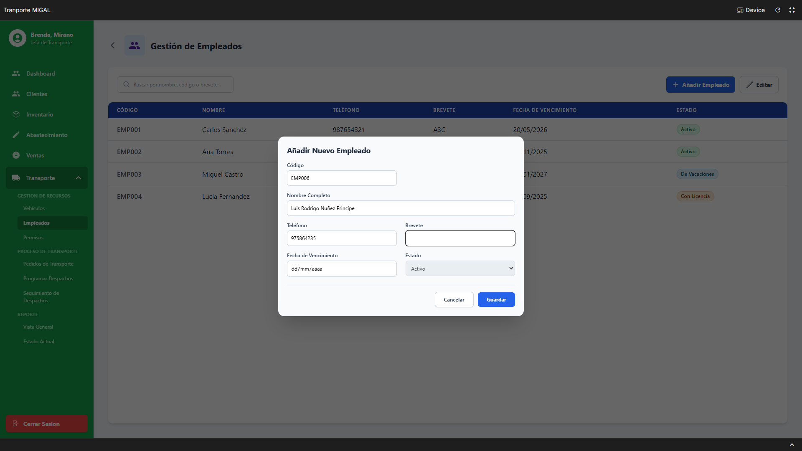 |

**Eventos:**

- **Carga de la Página (Llenar Dropdowns):** Carga los estados de empleado disponibles (ej. Activo, De Vacaciones).
    
    ```
    -- Para el dropdown "Estado"
    SELECT cod_estado_usuario, descp_estado_usuario FROM ESTADO_USUARIO;
    
    ```
    
- **Botón "Guardar":** Registra al nuevo empleado. Esto implica una transacción que afecta a múltiples tablas (`PERSONA`, `CONTACTO`, `USUARIO`, `CHOFER`).
    
    ```
    -- INICIO DE LA TRANSACCIÓN
    
    -- Paso 1: Crear la Persona
    INSERT INTO PERSONA (nombre_persona, cod_tipo_persona)
    VALUES (<Nombres/Apellidos Ingresados>, (SELECT cod_tipo_persona FROM TIPO_PERSONA WHERE valor_tipo_persona = 'Natural'))
    RETURNING cod_persona;
    
    -- (Se almacena el <ID Persona de Paso 1>)
    
    -- Paso 2: Crear el Contacto (Teléfono)
    INSERT INTO CONTACTO (valor_contacto, cod_tipo_contacto)
    VALUES (<Teléfono Ingresado>, (SELECT cod_tipo_contacto FROM TIPO_CONTACTO WHERE valor_tipo_contacto = 'Telefono'))
    RETURNING cod_contacto;
    
    -- (Se almacena el <ID Contacto de Paso 2>)
    
    -- Paso 3: Vincular Contacto a Persona
    INSERT INTO CONTACTO_PERSONA (cod_contacto, cod_persona, principal_contacto)
    VALUES (<ID Contacto de Paso 2>, <ID Persona de Paso 1>, (SELECT cod_tipo_contacto FROM TIPO_CONTACTO WHERE valor_tipo_contacto = 'Telefono'));
    
    -- Paso 4: Crear el Usuario (El "Código" de la UI se omite, se usa SERIAL)
    INSERT INTO USUARIO (cod_rol, cod_area, cod_persona, cod_estado_usuario)
    VALUES (
        (SELECT cod_rol FROM ROL WHERE valor_rol = 'Chofer'),
        (SELECT cod_area FROM AREA WHERE valor_area = 'Transporte'),
        <ID Persona de Paso 1>,
        <ID Estado Seleccionado>
    )
    RETURNING cod_usuario;
    
    -- (Se almacena el <ID Usuario de Paso 4>)
    
    -- Paso 5: Crear el registro de Chofer
    INSERT INTO CHOFER (cod_usuario, vencimiento_brevete, categoria_brevete)
    VALUES (<ID Usuario de Paso 4>, <Fecha de Vencimiento Ingresada>, <Brevete Ingresado>);
    
    -- FIN DE LA TRANSACCIÓN
    
    ```
    

## REQUERIMIENTO R-205: Actualizar Datos del Empleado

| **Código Requerimiento** | **R-205** |
| --- | --- |
| Código Interfaz | I-207 |
| Imagen Interfaz |  |

**Eventos:**

- **Botón "Editar":** Abre la ventana modal I-209, solicitando el código del empleado.

| **Código Requerimiento** | **R-205** |
| --- | --- |
| Código Interfaz | I-209 |
| Imagen Interfaz |  |

**Eventos:**

- **Botón "Confirmar":** Busca los datos del empleado para poblar la modal de edición (I-210). Se asume que el "Código" ingresado es el `cod_usuario` (SERIAL).
    
    ```
    SELECT
        u.cod_usuario,
        p.nombre_persona,
        c.valor_contacto,
        ch.categoria_brevete,
        ch.vencimiento_brevete,
        u.cod_estado_usuario
    FROM
        USUARIO u
    JOIN
        PERSONA p ON u.cod_persona = p.cod_persona
    JOIN
        CHOFER ch ON u.cod_usuario = ch.cod_usuario
    LEFT JOIN
        CONTACTO_PERSONA cp ON p.cod_persona = cp.cod_persona AND cp.principal_contacto = (SELECT cod_tipo_contacto FROM TIPO_CONTACTO WHERE valor_tipo_contacto = 'Telefono')
    LEFT JOIN
        CONTACTO c ON cp.cod_contacto = c.cod_contacto
    WHERE
        u.cod_usuario = <Código Del Empleado Ingresado>;
    
    ```
    

| **Código Requerimiento** | **R-205** |
| --- | --- |
| Código Interfaz | I-210 |
| Imagen Interfaz | 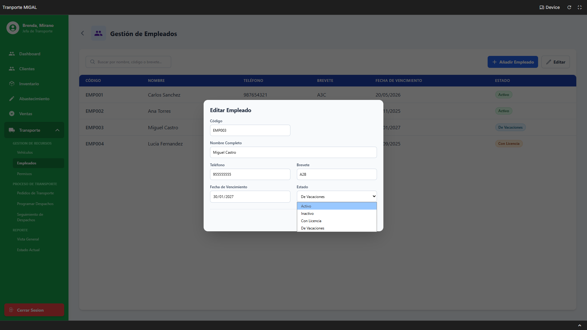 |

**Eventos:**

- **Carga de la Página (Llenar Dropdowns y Datos):** El formulario se carga con los datos obtenidos de la consulta en I-209. Se carga el *dropdown* de estados.
    
    ```
    -- Para el dropdown "Estado"
    SELECT cod_estado_usuario, descp_estado_usuario FROM ESTADO_USUARIO;
    
    ```
    
- **Botón "Guardar":** Actualiza los datos del empleado en las tablas correspondientes (Transacción).
    
    ```
    -- INICIO DE LA TRANSACCIÓN
    
    -- Paso 1: Actualizar PERSONA (Nombre)
    UPDATE PERSONA SET nombre_persona = <Nombres/Apellidos Modificados>
    WHERE cod_persona = (SELECT cod_persona FROM USUARIO WHERE cod_usuario = <ID Empleado>);
    
    -- Paso 2: Actualizar CONTACTO (Teléfono)
    UPDATE CONTACTO SET valor_contacto = <Teléfono Modificado>
    WHERE cod_contacto = (
        SELECT cp.cod_contacto FROM CONTACTO_PERSONA cp
        JOIN USUARIO u ON cp.cod_persona = u.cod_persona
        WHERE u.cod_usuario = <ID Empleado> AND cp.principal_contacto = (SELECT cod_tipo_contacto FROM TIPO_CONTACTO WHERE valor_tipo_contacto = 'Telefono')
        LIMIT 1
    );
    -- (Nota: Esta lógica asume que el contacto telefónico principal ya existe)
    
    -- Paso 3: Actualizar USUARIO (Estado)
    UPDATE USUARIO SET cod_estado_usuario = <ID Estado Modificado>
    WHERE cod_usuario = <ID Empleado>;
    
    -- Paso 4: Actualizar CHOFER (Brevete, Vencimiento)
    UPDATE CHOFER SET categoria_brevete = <Brevete Modificado>, vencimiento_brevete = <Fecha Vencimiento Modificada>
    WHERE cod_usuario = <ID Empleado>;
    
    -- FIN DE LA TRANSACCIÓN
    
    ```
    

## REQUERIMIENTO R-206: Actualizar Estado de Permiso de Conducción

| **Código Requerimiento** | **R-206** |
| --- | --- |
| Código Interfaz | I-211 |
| Imagen Interfaz |  |

**Eventos:**

- **Carga de la Página:** Carga la matriz de permisos que relaciona choferes y vehículos.
    
    ```
    SELECT
        p.cod_usuario, -- ID Chofer (para UPDATE)
        p.cod_vehiculo, -- ID Vehículo (para UPDATE)
        pe.nombre_persona AS "Empleado",
        c.categoria_brevete AS "Brevete",
        c.vencimiento_brevete AS "Vencimiento",
        v.placa_vehiculo AS "Placa",
        tv.descp_tipo_vehiculo AS "Tipo Vehículo",
        p.cod_estado_permiso, -- ID Estado actual
        p.fecha_ultimo_cambio AS "Último Cambio",
        p.motivo_estado_permiso AS "Motivo"
    FROM
        PERMISO p
    JOIN
        USUARIO u ON p.cod_usuario = u.cod_usuario
    JOIN
        PERSONA pe ON u.cod_persona = pe.cod_persona
    JOIN
        CHOFER c ON u.cod_usuario = c.cod_usuario
    JOIN
        VEHICULO v ON p.cod_vehiculo = v.cod_vehiculo
    JOIN
        TIPO_VEHICULO tv ON v.cod_tipo_vehiculo = tv.cod_tipo_vehiculo
    ORDER BY
        pe.nombre_persona, v.placa_vehiculo;
    
    -- También se carga la lista de estados para el dropdown de la tabla
    SELECT cod_estado_permiso, descp_estado_permiso FROM ESTADO_PERMISO;
    
    ```
    
- **Cambiar Dropdown "ESTADO" en una fila:** Al seleccionar un nuevo estado, se abre la modal I-212 para solicitar el motivo.

| **Código Requerimiento** | **R-206** |
| --- | --- |
| Código Interfaz | I-212 |
| Imagen Interfaz | 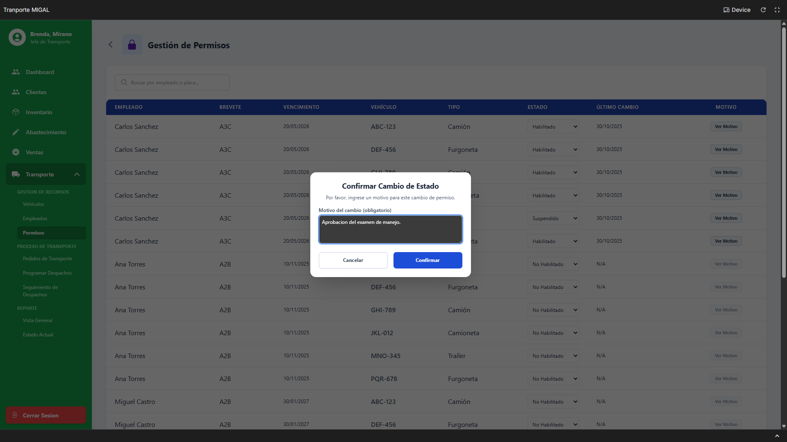 |

**Eventos:**

- **Botón "Confirmar":** Actualiza el permiso específico con el nuevo estado y el motivo obligatorio.
    
    ```
    UPDATE PERMISO
    SET
        cod_estado_permiso = <ID Nuevo Estado Seleccionado>,
        motivo_estado_permiso = <Motivo del cambio (obligatorio)>,
        fecha_ultimo_cambio = CURRENT_DATE
    WHERE
        cod_usuario = <ID Usuario de la fila seleccionada>
      AND
        cod_vehiculo = <ID Vehículo de la fila seleccionada>;
    
    ```
    

## REQUERIMIENTO R-207: Cancelar Artículos de Pedido de Transporte

| **Código Requerimiento** | **R-207** |
| --- | --- |
| Código Interfaz | I-213 |
| Imagen Interfaz |  |

**Eventos:**

- **Carga de la Página:** Carga la lista de pedidos de transporte que están "En Proceso".
    
    ```
    SELECT
        pt.cod_pedido_transporte,
        p.nombre_persona AS "Cliente",
        ept.descp_estado_pedido_tr AS "Estado"
    FROM
        PEDIDO_TRANSPORTE pt
    JOIN
        CLIENTE c ON pt.cod_cliente = c.cod_cliente
    JOIN
        PERSONA p ON c.cod_persona = p.cod_persona
    JOIN
        ESTADO_PEDIDO_TR ept ON pt.cod_estado_pedido_tr = ept.cod_estado_pedido_tr
    WHERE
        ept.descp_estado_pedido_tr = 'En Proceso'; -- O el ID correspondiente
    
    ```
    
- **Botón "VER":** Navega a la interfaz I-214 (Detalle del Pedido).

| **Código Requerimiento** | **R-207** |
| --- | --- |
| Código Interfaz | I-214 |
| Imagen Interfaz |  |

**Eventos:**

- **Carga de la Página (Detalle de Artículos):** Muestra los artículos asociados al pedido seleccionado.
    
    ```
    SELECT
        dt.cod_detalle_pedido_tr,
        pr.nombre_producto AS "Producto",
        dt.cantidad_detalle AS "Cant",
        dt.direccion_destino_pedido AS "Destino",
        dt.fecha_detalle AS "Fecha Entrega",
        edt.descp_estado_detalle_pedido AS "Estado"
    FROM
        DETALLE_PEDIDO_TR dt
    JOIN
        PRODUCTO pr ON dt.cod_producto = pr.cod_producto
    JOIN
        ESTADO_DETALLE_PEDIDO edt ON dt.cod_estado_detalle_pedido = edt.cod_estado_detalle_pedido
    WHERE
        dt.cod_pedido_transporte = <ID Pedido Seleccionado>;
    
    ```
    
- **Botón "Eliminar":** Abre la ventana modal I-215 para la cancelación de artículos.

| **Código Requerimiento** | **R-207** |
| --- | --- |
| Código Interfaz | I-215 |
| Imagen Interfaz |  |

**Eventos:**

- **Carga de la Página:** Lista los artículos del pedido, deshabilitando aquellos que no se pueden cancelar (ej. "En Camino" o "Entregado").
    
    ```
    SELECT
        dt.cod_detalle_pedido_tr,
        pr.nombre_producto,
        dt.fecha_detalle,
        edt.descp_estado_detalle_pedido,
        -- Lógica para deshabilitar el check
        CASE
            WHEN edt.descp_estado_detalle_pedido IN ('En Camino', 'Entregado', 'Recibido') THEN 'deshabilitado'
            ELSE 'habilitado'
        END AS estado_check
    FROM
        DETALLE_PEDIDO_TR dt
    JOIN
        PRODUCTO pr ON dt.cod_producto = pr.cod_producto
    JOIN
        ESTADO_DETALLE_PEDIDO edt ON dt.cod_estado_detalle_pedido = edt.cod_estado_detalle_pedido
    WHERE
        dt.cod_pedido_transporte = <ID Pedido Seleccionado>;
    
    ```
    
- **Botón "Cancelar Items (X)":** Actualiza el estado de los artículos seleccionados a "Cancelado" y registra el motivo.
    
    ```
    -- (Se asume que el motivo se guarda en MOTIVO_CANCELACION_TR)
    -- Esta consulta se ejecuta en bucle por cada <ID Artículo Seleccionado> del check
    
    UPDATE DETALLE_PEDIDO_TR
    SET
        cod_estado_detalle_pedido = (SELECT cod_estado_detalle_pedido FROM ESTADO_DETALLE_PEDIDO WHERE descp_estado_detalle_pedido = 'Cancelado'),
        cod_motivo_cancelacion_tr = (
            -- Inserta el motivo si no existe y devuelve el ID
            INSERT INTO MOTIVO_CANCELACION_TR (descp_motivo_cancelacion_tr)
            VALUES (<Motivo de la cancelación (obligatorio)>)
            ON CONFLICT (descp_motivo_cancelacion_tr) DO UPDATE SET descp_motivo_cancelacion_tr = EXCLUDED.descp_motivo_cancelacion_tr
            RETURNING cod_motivo_cancelacion_tr
        )
    WHERE
        cod_detalle_pedido_tr = <ID Artículo Seleccionado>;
    
    ```
    

## REQUERIMIENTO R-208: Reprogramar Artículos de Pedido de Transporte

| **Código Requerimiento** | **R-208** |
| --- | --- |
| Código Interfaz | I-214 |
| Imagen Interfaz |  |

**Eventos:**

- **Botón "Reprogramar":** Abre la ventana modal I-216 para modificar fechas o direcciones.

| **Código Requerimiento** | **R-208** |
| --- | --- |
| Código Interfaz | I-216 |
| Imagen Interfaz |  |

**Eventos:**

- **Carga de la Página:** Lista los artículos del pedido, advirtiendo sobre los que no se pueden modificar (ej. "En Camino", "Entregados").
    
    ```
    SELECT
        dt.cod_detalle_pedido_tr,
        pr.nombre_producto,
        dt.fecha_detalle,
        edt.descp_estado_detalle_pedido,
        -- Lógica para deshabilitar el check
        CASE
            WHEN edt.descp_estado_detalle_pedido IN ('En Camino', 'Entregado', 'Recibido') THEN 'deshabilitado'
            ELSE 'habilitado'
        END AS estado_check
    FROM
        DETALLE_PEDIDO_TR dt
    JOIN
        PRODUCTO pr ON dt.cod_producto = pr.cod_producto
    JOIN
        ESTADO_DETALLE_PEDIDO edt ON dt.cod_estado_detalle_pedido = edt.cod_estado_detalle_pedido
    WHERE
        dt.cod_pedido_transporte = <ID Pedido Seleccionado>;
    
    ```
    
- **Botón "Confirmar Cambios":** Actualiza la fecha y/o dirección de los artículos seleccionados.
    
    ```
    -- Esta consulta se ejecuta en bucle por cada <ID Artículo Seleccionado> del check
    
    UPDATE DETALLE_PEDIDO_TR
    SET
        fecha_detalle = <Nueva Fecha de Entrega Ingresada>,
        direccion_destino_pedido = <Nueva Dirección de Destino Ingresada>
    WHERE
        cod_detalle_pedido_tr = <ID Artículo Seleccionado>;
    
    ```
    

## REQUERIMIENTO R-209: Programar Nuevo Despacho

| **Código Requerimiento** | **R-209** |
| --- | --- |
| Código Interfaz | I-217 |
| Imagen Interfaz | 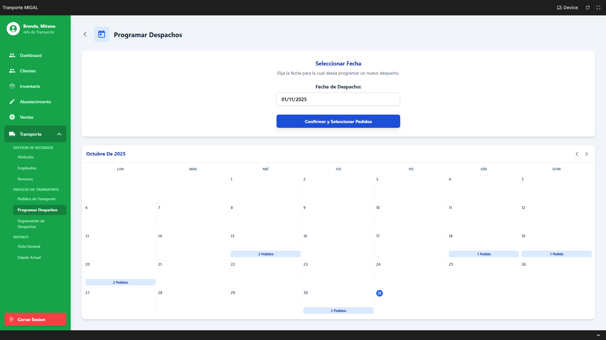 |

**Eventos:**

- **Botón "Confirmar y Seleccionar Pedidos":** Navega a la interfaz I-218, pasando como parámetro la `Fecha de Despacho` seleccionada.

| **Código Requerimiento** | **R-209** |
| --- | --- |
| Código Interfaz | I-218 |
| Imagen Interfaz | 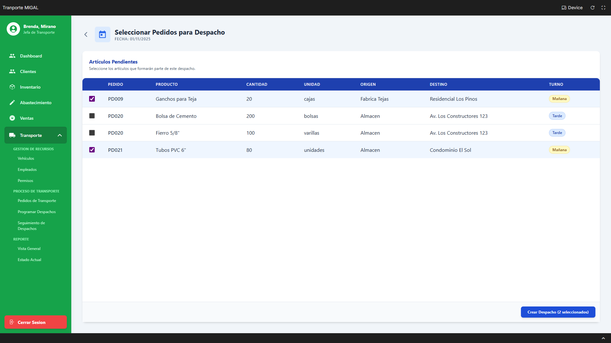 |

**Eventos:**

- **Carga de la Página:** Muestra todos los "Artículos Pendientes" que coinciden con la fecha de despacho seleccionada.
    
    ```
    SELECT
        dt.cod_detalle_pedido_tr,
        pt.cod_pedido_transporte, -- Para la columna "PEDIDO"
        pr.nombre_producto AS "Producto",
        dt.cantidad_detalle AS "Cantidad",
        dt.direccion_origen_pedido AS "Origen",
        dt.direccion_destino_pedido AS "Destino",
        tt.descp_turno AS "Turno"
    FROM
        DETALLE_PEDIDO_TR dt
    JOIN
        PEDIDO_TRANSPORTE pt ON dt.cod_pedido_transporte = pt.cod_pedido_transporte
    JOIN
        PRODUCTO pr ON dt.cod_producto = pr.cod_producto
    LEFT JOIN
        TURNO_TRANSPORTE tt ON dt.cod_turno = tt.cod_turno
    WHERE
        dt.fecha_detalle = <Fecha de Despacho Seleccionada>
      AND
        dt.cod_estado_detalle_pedido = (SELECT cod_estado_detalle_pedido FROM ESTADO_DETALLE_PEDIDO WHERE descp_estado_detalle_pedido = 'Pendiente'); -- O 'Recibido'
    
    ```
    
- **Botón "Crear Despachos (X seleccionados)":** Inicia el asistente (wizard) en la modal I-219, pasando la lista de `cod_detalle_pedido_tr` seleccionados.

| **Código Requerimiento** | **R-209** |
| --- | --- |
| Código Interfaz | I-219 a I-223 (Wizard de Despacho) |
| Imagen Interfaz |  (Paso 1) <br>   (Paso 2)  <br>  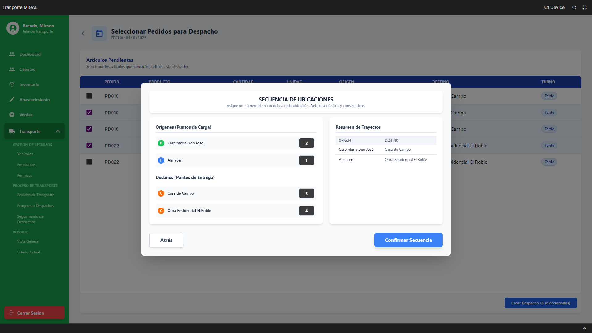 (Paso 3)  <br>   (Paso 4)  <br>  (Paso 5) |

**Eventos:**

- **Carga de Modales (Llenar Dropdowns):** Se ejecutan en el Paso 2 (Recursos) y Paso 5 (Ayudantes).
    
    ```
    -- Carga de "Vehículo" (Paso 2)
    SELECT v.cod_vehiculo, v.placa_vehiculo
    FROM VEHICULO v
    JOIN ESTADO_VEHICULO ev ON v.cod_estado_vehiculo = ev.cod_estado_vehiculo
    WHERE ev.descp_estado_vehiculo = 'Operativo';
    
    -- Carga de "Operador" (Paso 2)
    SELECT u.cod_usuario, p.nombre_persona
    FROM USUARIO u
    JOIN PERSONA p ON u.cod_persona = p.cod_persona
    JOIN CHOFER c ON u.cod_usuario = c.cod_usuario
    JOIN ESTADO_USUARIO esu ON u.cod_estado_usuario = esu.cod_estado_usuario
    WHERE esu.descp_estado_usuario = 'Activo';
    -- (Faltaría lógica de cruce con PERMISO y R-206)
    
    -- Carga de "Ayudantes" (Paso 5)
    SELECT u.cod_usuario, p.nombre_persona
    FROM USUARIO u
    JOIN PERSONA p ON u.cod_persona = p.cod_persona
    JOIN ESTADO_USUARIO esu ON u.cod_estado_usuario = esu.cod_estado_usuario
    WHERE esu.descp_estado_usuario = 'Activo'
      AND u.cod_rol = (SELECT cod_rol FROM ROL WHERE valor_rol = 'Ayudante'); -- Asumiendo Rol
    
    ```
    
- **Botón "Confirmar Despacho" (Paso 5):** Ejecuta la transacción final para crear el despacho y sus paradas.
    
    ```
    -- INICIO DE LA TRANSACCIÓN
    
    -- Paso 1: Crear la cabecera del DESPACHO
    INSERT INTO DESPACHO (
        fecha_despacho,
        cod_estado_despacho,
        hora_salida_estimada,
        hora_regreso_estimada,
        cod_chofer,
        cod_vehiculo,
        tiempo_reserva_min -- Asumiendo cálculo
    )
    VALUES (
        <Fecha Seleccionada>,
        (SELECT cod_estado_despacho FROM ESTADO_DESPACHO WHERE descp_estado_despacho = 'Programado'),
        <Hora Estimada de Salida>,
        <Hora Estimada de Regreso>,
        <ID Operador Seleccionado>,
        <ID Vehículo Seleccionado>,
        <Minutos Calculados>
    )
    RETURNING cod_despacho;
    
    -- (Se almacena el <ID Despacho de Paso 1>)
    
    -- Paso 2: Crear las PARADAS (Bucle para cada destino único)
    -- (Esta lógica asume que las paradas se crean si no existen)
    INSERT INTO PARADA (direccion_parada, cod_tipo_parada)
    VALUES (<Dirección Destino 1>, (SELECT cod_tipo_parada FROM TIPO_PARADA WHERE descp_tipo_parada = 'Entrega'))
    ON CONFLICT DO NOTHING
    RETURNING cod_parada;
    -- (Se almacena el <ID Parada 1>)
    
    -- Paso 3: Crear las VISITAS PROGRAMADAS (Bucle para cada parada)
    INSERT INTO VISITA_PROGRAMADA (cod_despacho, cod_parada, secuencia, cod_estado_visita)
    VALUES (
        <ID Despacho de Paso 1>,
        <ID Parada 1>,
        <Secuencia Ingresada (ej. 1)>,
        (SELECT cod_estado_visita FROM ESTADO_VISITA WHERE descp_estado_visita = 'Pendiente')
    )
    RETURNING cod_visita;
    -- (Se almacena el <ID Visita 1>)
    -- (Repetir Pasos 2 y 3 para Parada 2 / Visita 2...)
    
    -- Paso 4: Vincular Artículos (DETALLE_PEDIDO_TR) a las Visitas (Bucle)
    UPDATE DETALLE_PEDIDO_TR
    SET
        cod_visita = <ID Visita correspondiente a su destino>,
        cod_estado_detalle_pedido = (SELECT cod_estado_detalle_pedido FROM ESTADO_DETALLE_PEDIDO WHERE descp_estado_detalle_pedido = 'Programado')
    WHERE
        cod_detalle_pedido_tr = <ID Artículo 1 Seleccionado>;
    -- (Repetir Paso 4 para Artículo 2...)
    
    -- Paso 5: Asignar Ayudantes (Bucle)
    INSERT INTO ASIGNACION_AYUDANTE (cod_usuario, cod_despacho)
    VALUES (<ID Ayudante 1 Seleccionado>, <ID Despacho de Paso 1>);
    -- (Repetir Paso 5 si hay más ayudantes)
    
    -- FIN DE LA TRANSACCIÓN
    
    ```
    

## REQUERIMIENTO R-210: Gestionar Seguimiento de Despacho

| **Código Requerimiento** | **R-210** |
| --- | --- |
| Código Interfaz | I-224 |
| Imagen Interfaz |  |

**Eventos:**

- **Carga de la Página:** Muestra la lista de todos los despachos programados, en ruta o completados.
    
    ```
    SELECT
        d.cod_despacho,
        d.fecha_despacho,
        p.nombre_persona AS "Operador",
        v.placa_vehiculo AS "Vehículo",
        d.hora_salida_estimada,
        d.hora_regreso_estimada,
        ed.descp_estado_despacho AS "Estado"
    FROM
        DESPACHO d
    JOIN
        USUARIO u ON d.cod_chofer = u.cod_usuario
    JOIN
        PERSONA p ON u.cod_persona = p.cod_persona
    JOIN
        VEHICULO v ON d.cod_vehiculo = v.cod_vehiculo
    JOIN
        ESTADO_DESPACHO ed ON d.cod_estado_despacho = ed.cod_estado_despacho
    ORDER BY
        d.fecha_despacho DESC, d.hora_salida_estimada;
    
    ```
    
- **Botón "VER DETALLE":** Navega a la interfaz I-225 para gestionar el progreso del despacho seleccionado.

| **Código Requerimiento** | **R-210** |
| --- | --- |
| Código Interfaz | I-225 |
| Imagen Interfaz |  (Estado Inicial) |

**Eventos:**

- **Carga de la Página (Detalle y Paradas):** Muestra la información del despacho y la lista de sus paradas (visitas).
    
    ```
    -- 1. Cargar cabecera del despacho
    SELECT
        d.fecha_despacho, p.nombre_persona AS Operador, v.placa_vehiculo,
        d.hora_salida_estimada, d.hora_regreso_estimada,
        d.hora_salida_despacho, d.hora_regreso_despacho
    FROM DESPACHO d
    JOIN USUARIO u ON d.cod_chofer = u.cod_usuario
    JOIN PERSONA p ON u.cod_persona = p.cod_persona
    JOIN VEHICULO v ON d.cod_vehiculo = v.cod_vehiculo
    WHERE d.cod_despacho = <ID Despacho Seleccionado>;
    
    -- 2. Cargar paradas (visitas)
    SELECT
        vp.cod_visita,
        vp.secuencia,
        p.direccion_parada AS "Destino",
        vp.hora_llegada,
        vp.cod_estado_visita,
        ev.descp_estado_visita
    FROM VISITA_PROGRAMADA vp
    JOIN PARADA p ON vp.cod_parada = p.cod_parada
    JOIN ESTADO_VISITA ev ON vp.cod_estado_visita = ev.cod_estado_visita
    WHERE vp.cod_despacho = <ID Despacho Seleccionado>
    ORDER BY vp.secuencia;
    
    -- 3. Cargar lista de estados de visita (para los dropdowns de la tabla)
    SELECT cod_estado_visita, descp_estado_visita FROM ESTADO_VISITA;
    
    ```
    
- **Botón "Iniciar Picking":** Actualiza el estado del despacho y todas sus paradas pendientes a "Picking".
    
    ```
    -- 1. Actualizar las visitas
    UPDATE VISITA_PROGRAMADA
    SET cod_estado_visita = (SELECT cod_estado_visita FROM ESTADO_VISITA WHERE descp_estado_visita = 'Picking')
    WHERE cod_despacho = <ID Despacho>
      AND cod_estado_visita = (SELECT cod_estado_visita FROM ESTADO_VISITA WHERE descp_estado_visita = 'Pendiente');
    
    -- 2. Actualizar el despacho general
    UPDATE DESPACHO
    SET cod_estado_despacho = (SELECT cod_estado_despacho FROM ESTADO_DESPACHO WHERE descp_estado_despacho = 'Picking')
    WHERE cod_despacho = <ID Despacho>;
    
    ```
    
- **Botón "Guardar Tiempos" (Salida):** Registra la hora real de salida y actualiza estados a "En Ruta".
    
    ```
    -- 1. Registrar hora de salida y actualizar estado del despacho
    UPDATE DESPACHO
    SET
        hora_salida_despacho = <Hora Salida (Real) Ingresada>,
        cod_estado_despacho = (SELECT cod_estado_despacho FROM ESTADO_DESPACHO WHERE descp_estado_despacho = 'En Ruta')
    WHERE cod_despacho = <ID Despacho>;
    
    -- 2. Actualizar las visitas que estaban en Picking
    UPDATE VISITA_PROGRAMADA
    SET cod_estado_visita = (SELECT cod_estado_visita FROM ESTADO_VISITA WHERE descp_estado_visita = 'En Ruta')
    WHERE cod_despacho = <ID Despacho>
      AND cod_estado_visita = (SELECT cod_estado_visita FROM ESTADO_VISITA WHERE descp_estado_visita = 'Picking');
    
    ```
    
- **Botón "Guardar Cambios" (Paradas):** Se usa para registrar la `HORA DE LLEGADA` y cambiar el `ESTADO` de una parada individual (ej. a "Entregado").
    
    ```
    -- Se ejecuta por cada fila de parada que se modifica
    UPDATE VISITA_PROGRAMADA
    SET
        hora_llegada = <HORA DE LLEGADA Ingresada>,
        cod_estado_visita = <ID Estado Seleccionado (ej. 'Entregado')>
    WHERE
        cod_visita = <ID Visita de la fila>;
    
    ```
    
- **Botón "Guardar Tiempos" (Regreso):** Registra la hora real de regreso y marca el despacho como "Completado".
    
    ```
    UPDATE DESPACHO
    SET
        hora_regreso_despacho = <Hora Regreso (Real) Ingresada>,
        cod_estado_despacho = (SELECT cod_estado_despacho FROM ESTADO_DESPACHO WHERE descp_estado_despacho = 'Completado')
    WHERE
        cod_despacho = <ID Despacho>;
    
    ```
    

## REQUERIMIENTO R-211: Actualizar Despacho Programado

| **Código Requerimiento** | **R-211** |
| --- | --- |
| Código Interfaz | I-224 |
| Imagen Interfaz |  |

**Eventos:**

- **Botón "Editar":** Abre la modal I-226 **solo si** el estado del despacho es "Programado".

| **Código Requerimiento** | **R-211** |
| --- | --- |
| Código Interfaz | I-226 |
| Imagen Interfaz |  |

**Eventos:**

- **Carga de la Página (Llenar Dropdowns y Datos):** Carga los datos actuales del despacho y las listas de recursos disponibles.
    
    ```
    -- 1. Cargar datos actuales
    SELECT cod_vehiculo, cod_chofer
    FROM DESPACHO
    WHERE cod_despacho = <ID Despacho Seleccionado>;
    
    -- 2. Cargar Vehículos disponibles (Operativos)
    SELECT v.cod_vehiculo, v.placa_vehiculo
    FROM VEHICULO v
    JOIN ESTADO_VEHICULO ev ON v.cod_estado_vehiculo = ev.cod_estado_vehiculo
    WHERE ev.descp_estado_vehiculo = 'Operativo';
    
    -- 3. Cargar Operadores disponibles (Activos)
    SELECT u.cod_usuario, p.nombre_persona
    FROM USUARIO u
    JOIN PERSONA p ON u.cod_persona = p.cod_persona
    JOIN CHOFER c ON u.cod_usuario = c.cod_usuario
    JOIN ESTADO_USUARIO esu ON u.cod_estado_usuario = esu.cod_estado_usuario
    WHERE esu.descp_estado_usuario = 'Activo';
    
    ```
    
- **Botón "Guardar" (Asumido):** Actualiza el vehículo y/o el operador asignado al despacho.
    
    ```
    UPDATE DESPACHO
    SET
        cod_vehiculo = <Nuevo ID Vehículo Seleccionado>,
        cod_chofer = <Nuevo ID Operador Seleccionado>
    WHERE
        cod_despacho = <ID Despacho>;
    
    ```
    

## REQUERIMIENTO R-212: Eliminar Despacho Programado

| **Código Requerimiento** | **R-212** |
| --- | --- |
| Código Interfaz | I-224 |
| Imagen Interfaz | `` |

**Eventos:**

- **Botón "Eliminar":** Abre la modal de confirmación I-227, **solo si** el estado es "Programado".

| **Código Requerimiento** | **R-212** |
| --- | --- |
| Código Interfaz | I-227 |
| Imagen Interfaz |  |

**Eventos:**

- **Carga de la Página:** Muestra la advertencia de anulación.
- **Botón "Sí, Eliminar":** Ejecuta una transacción para eliminar el despacho y liberar los artículos asociados.
    
    ```
    -- INICIO DE LA TRANSACCIÓN
    
    -- Paso 1: Desvincular artículos y devolverlos a "Pendiente"
    UPDATE DETALLE_PEDIDO_TR
    SET
        cod_visita = NULL,
        cod_estado_detalle_pedido = (SELECT cod_estado_detalle_pedido FROM ESTADO_DETALLE_PEDIDO WHERE descp_estado_detalle_pedido = 'Pendiente') -- O 'Recibido'
    WHERE
        cod_visita IN (SELECT cod_visita FROM VISITA_PROGRAMADA WHERE cod_despacho = <ID Despacho a Eliminar>);
    
    -- Paso 2: Eliminar las Visitas (Paradas) asociadas
    DELETE FROM VISITA_PROGRAMADA
    WHERE cod_despacho = <ID Despacho a Eliminar>;
    
    -- Paso 3: Eliminar Asignación de Ayudantes (si aplica)
    DELETE FROM ASIGNACION_AYUDANTE
    WHERE cod_despacho = <ID Despacho a Eliminar>;
    
    -- Paso 4: Eliminar la cabecera del Despacho
    DELETE FROM DESPACHO
    WHERE cod_despacho = <ID Despacho a Eliminar>;
    
    -- FIN DE LA TRANSACCIÓN
    
    ```
    

## REQUERIMIENTO R-213: Consultar Reporte de Vista General

| **Código Requerimiento** | **R-213** |
| --- | --- |
| Código Interfaz | I-228 |
| Imagen Interfaz |  |

**Eventos:**

- Seleccionar Fecha en Calendario:
    
    Dispara múltiples consultas SELECT para poblar el dashboard con los datos de la <Fecha Seleccionada>.
    
    ```
    -- 1. Consulta para Tarjetas de Estado (ej. "Pedidos Programados: 2")
    SELECT
        edp.descp_estado_detalle_pedido,
        COUNT(dt.cod_detalle_pedido_tr) AS Total
    FROM DETALLE_PEDIDO_TR dt
    JOIN ESTADO_DETALLE_PEDIDO edp ON dt.cod_estado_detalle_pedido = edp.cod_estado_detalle_pedido
    WHERE dt.fecha_detalle = <Fecha Seleccionada>
    GROUP BY edp.descp_estado_detalle_pedido;
    
    -- 2. Consulta para "Resumen de Pedidos por Turno"
    SELECT
        tt.descp_turno,
        COUNT(DISTINCT dt.cod_pedido_transporte) AS TotalPedidos
    FROM DETALLE_PEDIDO_TR dt
    JOIN TURNO_TRANSPORTE tt ON dt.cod_turno = tt.cod_turno
    WHERE dt.fecha_detalle = <Fecha Seleccionada>
    GROUP BY tt.descp_turno;
    
    -- 3. Consulta para tabla "Pedidos del Dia"
    SELECT DISTINCT
        pt.cod_pedido_transporte,
        p.nombre_persona AS Cliente,
        ept.descp_estado_pedido_tr AS Estado
    FROM PEDIDO_TRANSPORTE pt
    JOIN DETALLE_PEDIDO_TR dt ON pt.cod_pedido_transporte = dt.cod_pedido_transporte
    JOIN CLIENTE c ON pt.cod_cliente = c.cod_cliente
    JOIN PERSONA p ON c.cod_persona = p.cod_persona
    JOIN ESTADO_PEDIDO_TR ept ON pt.cod_estado_pedido_tr = ept.cod_estado_pedido_tr
    WHERE dt.fecha_detalle = <Fecha Seleccionada>;
    
    -- 4. Consulta para barra lateral "Horario del Dia"
    SELECT
        DATE_TRUNC('hour', hora_salida_estimada) AS franja_horaria,
        COUNT(cod_despacho) AS total_despachos
    FROM DESPACHO
    WHERE fecha_despacho = <Fecha Seleccionada>
    GROUP BY franja_horaria
    ORDER BY franja_horaria;
    
    ```
    
- Flujo Alternativo A1: Clic en "Ver Items" (Modal I-229):
    
    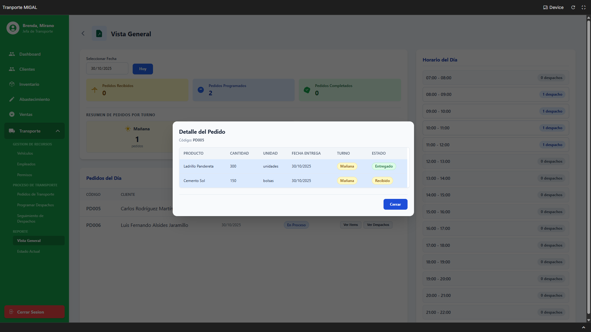
    
    ```
    -- Muestra los productos del pedido
    SELECT
        pr.nombre_producto,
        dt.cantidad_detalle,
        dt.direccion_destino_pedido,
        edt.descp_estado_detalle_pedido
    FROM DETALLE_PEDIDO_TR dt
    JOIN PRODUCTO pr ON dt.cod_producto = pr.cod_producto
    JOIN ESTADO_DETALLE_PEDIDO edt ON dt.cod_estado_detalle_pedido = edt.cod_estado_detalle_pedido
    WHERE dt.cod_pedido_transporte = <ID Pedido de la fila>;
    
    ```
    
- Flujo Alternativo A2: Clic en "Ver Despachos" (Modal I-230):
    
    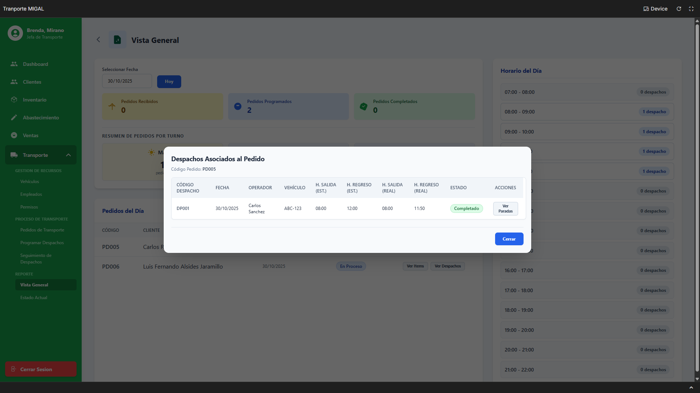
    
    ```
    -- Muestra los despachos asociados a ese pedido
    SELECT DISTINCT
        d.cod_despacho,
        d.fecha_despacho,
        p.nombre_persona AS Operador,
        v.placa_vehiculo,
        ed.descp_estado_despacho
    FROM DESPACHO d
    JOIN VISITA_PROGRAMADA vp ON d.cod_despacho = vp.cod_despacho
    JOIN DETALLE_PEDIDO_TR dt ON vp.cod_visita = dt.cod_visita
    JOIN USUARIO u ON d.cod_chofer = u.cod_usuario
    JOIN PERSONA p ON u.cod_persona = p.cod_persona
    JOIN VEHICULO v ON d.cod_vehiculo = v.cod_vehiculo
    JOIN ESTADO_DESPACHO ed ON d.cod_estado_despacho = ed.cod_estado_despacho
    WHERE dt.cod_pedido_transporte = <ID Pedido de la fila>;
    
    ```
    
- Sub-flujo A2.1: Clic en "Ver Paradas" (Modal I-231):
    
    
    
    ```
    -- Muestra la secuencia de paradas del despacho
    SELECT
        vp.secuencia,
        pa.direccion_parada,
        ev.descp_estado_visita,
        vp.hora_llegada
    FROM VISITA_PROGRAMADA vp
    JOIN PARADA pa ON vp.cod_parada = pa.cod_parada
    JOIN ESTADO_VISITA ev ON vp.cod_estado_visita = ev.cod_estado_visita
    WHERE vp.cod_despacho = <ID Despacho de la fila modal anterior>
    ORDER BY vp.secuencia;
    
    ```
    
- Flujo Alternativo A3: Clic en franja horaria "X Despacho" (Modal I-232):
    
    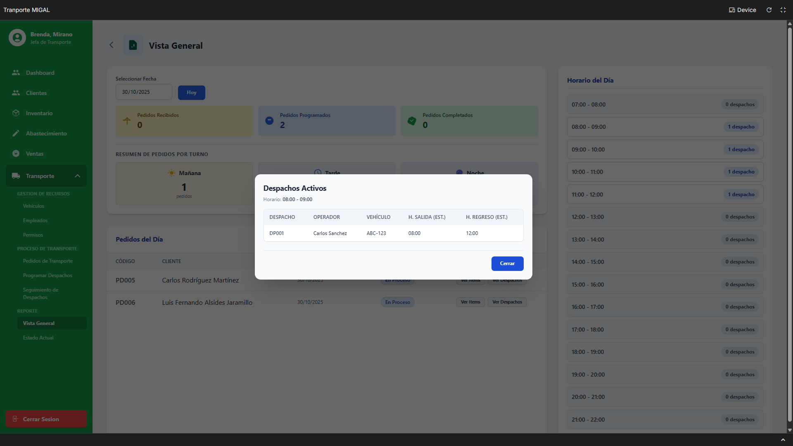
    
    ```
    -- Muestra los despachos de esa franja horaria
    SELECT
        d.cod_despacho,
        p.nombre_persona AS Operador,
        v.placa_vehiculo,
        d.hora_salida_estimada,
        d.hora_regreso_estimada
    FROM DESPACHO d
    JOIN USUARIO u ON d.cod_chofer = u.cod_usuario
    JOIN PERSONA p ON u.cod_persona = p.cod_persona
    JOIN VEHICULO v ON d.cod_vehiculo = v.cod_vehiculo
    WHERE d.fecha_despacho = <Fecha Seleccionada>
      AND d.hora_salida_estimada >= <Hora Inicio Franja>
      AND d.hora_salida_estimada < <Hora Fin Franja>;
    
    ```

[⬅️ Anterior](../9.1.1/9.1.1.md) | [🏠 Home](../../../README.md) | [Siguiente ➡️](../9.1.3/9.1.3.md)
