> [9. Preparación para Implementación](../../9.md) › [9.1. Sentencias SQL por módulo / prototipo](../9.1.md) › [9.1.3. Módulo 3 / Integrante 3](9.1.3.md)

# 9.1.3. Módulo 3 / Integrante 3

# 3.4. Sentencias SQL por módulo / prototipo: Módulo 3 / ALMACÉN

## REQUERIMIENTO R-301: Gestionar Equipo de Almacén (Usuarios)

| Código Requerimiento | R-301 |
| --- | --- |
| Código Interfaz | I-301 |
| Imagen Interfaz |  |

*Eventos:*

- **Clic en "Gestión de Equipo y tareas":**
Redirige al usuario a la interfaz I-302: Gestión de Equipo y Tareas.

| Código Requerimiento | R-301 |
| --- | --- |
| Código Interfaz | I-302 |
| Imagen Interfaz | 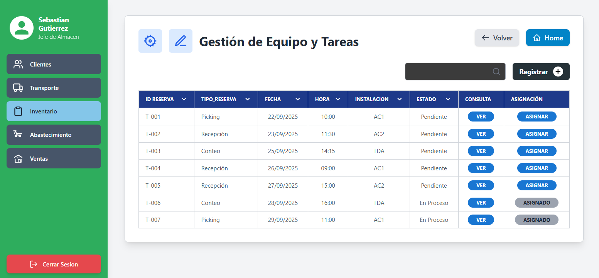 |

*Eventos:*

- **Carga de la Página (Pestaña "Gestionar Reservas"):**
Se llena la tabla con todas las reservas (Recepciones, Conteos, Picking/Despachos) que requieren asignación de personal.
    
    ```
     -- Objetivo: Obtener la lista de reservas y el estado de su asignación
     SELECT
     	r.cod_reserva AS "ID RESERVA",
     	r.tipo_reserva AS "TIPO RESERVA",
     	r.fecha_reserva AS "FECHA",
     	t.hora_inicio AS "HORA",
     	i.cod_instalacion AS "INSTALACION",
     	r.estado AS "ESTADO",
     	-- Subconsulta para contar operadores asignados
     	(SELECT COUNT(*)
     	 FROM "FERRETERIA".operador_reserva_almacen ora
     	 WHERE ora.cod_reserva = r.cod_reserva) AS "OPERADORES"
     FROM
     	"FERRETERIA".reserva_almacen r
     JOIN
     	"FERRETERIA".cupo_disponible c ON r.cod_cupo = c.cod_cupo
     JOIN
     	"FERRETERIA".turno_almacen t ON c.cod_turno = t.cod_turno
     JOIN
     	"FERRETERIA".instalacion i ON c.cod_instalacion = i.cod_instalacion
     ORDER BY
     	r.fecha_reserva DESC, t.hora_inicio ASC;
    
    ```
    
- **Botón [VER] (Consulta):**
Abre el modal I-303 (Detalle de Reserva) para mostrar los productos implicados.
- **Botón [ASIGNAR]:**
Redirige al usuario a la interfaz I-304 (Asignar Equipo), pasando el `cod_reserva` como parámetro.
- **Pestaña "Gestionar Operadores":**
Redirige al usuario a la interfaz I-305 (Gestión de Operadores).

| Código Requerimiento | R-301 |
| --- | --- |
| Código Interfaz | I-303 (Modal) |
| Imagen Interfaz | 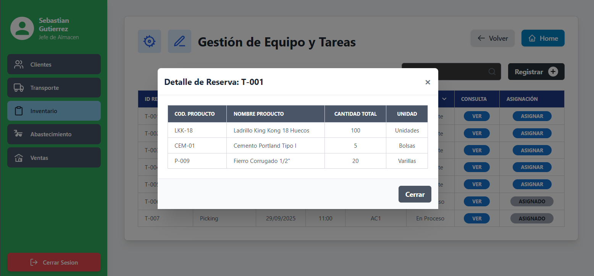 |

*Eventos:*

- **Carga de la Modal (Consulta):**
Se dispara al hacer clic en [VER]. La lógica de la consulta depende del `tipo_reserva`.
    
    ```
     -- CASO 1: Si tipo_reserva = 'Recepcion'
     SELECT
     	p.cod_producto_fmt AS "COD. PRODUCTO",
     	p.nombre_producto AS "NOMBRE PRODUCTO",
     	dr.cantidad_programada AS "CANTIDAD TOTAL",
     	p.unidad_medida AS "UNIDAD"
     FROM "FERRETERIA".detalle_recepcion dr
     JOIN "FERRETERIA".producto p ON dr.cod_producto = p.cod_producto
     WHERE dr.cod_recepcion = (SELECT cod_recepcion FROM "FERRETERIA".reserva_almacen WHERE cod_reserva = <ID de Reserva Seleccionado>);
    
     -- CASO 2: Si tipo_reserva = 'Despacho'
     -- Esta es la consulta compleja de "Picking"
     SELECT
     	p.cod_producto_fmt AS "COD. PRODUCTO",
     	p.nombre_producto AS "NOMBRE PRODUCTO",
     	SUM(dt.cantidad_detalle) AS "CANTIDAD TOTAL",
     	p.unidad_medida AS "UNIDAD"
     FROM "FERRETERIA".reserva_almacen r
     JOIN "FERRETERIA".DESPACHO d ON r.cod_despacho = d.cod_despacho
     JOIN "FERRETERIA".ASIGNACION_PEDIDO_DESPACHO apd ON d.cod_despacho = apd.cod_despacho
     JOIN "FERRETERIA".DETALLE_PEDIDO_TR dt ON apd.cod_pedido_transporte = dt.cod_pedido_transporte
     JOIN "FERRETERIA".producto p ON dt.cod_producto = p.cod_producto
     WHERE r.cod_reserva = <ID de Reserva Seleccionado>
     GROUP BY p.cod_producto_fmt, p.nombre_producto, p.unidad_medida;
    
    ```
    
    *(Nota: El `detalle_conteo` se crea después de la reserva, por lo que su modal de "VER" consultaría `detalle_conteo`)*
    

| Código Requerimiento | R-301 |
| --- | --- |
| Código Interfaz | I-304 (Modal) |
| Imagen Interfaz | 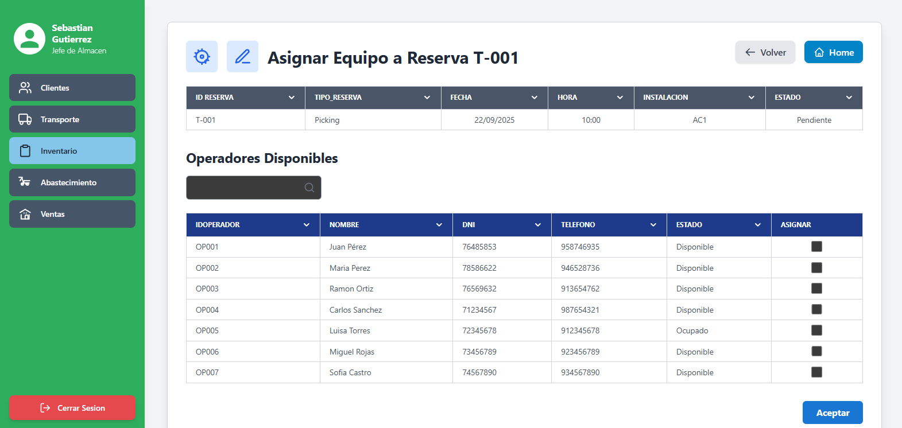 |

*Eventos:*

- **Carga de la Modal (Lista de Operadores):**
Muestra todos los `USUARIO` del área de Almacén que están 'Disponibles'.
    
    ```
     SELECT
     	u.cod_usuario AS "ID OPERADOR",
     	p.nombre_persona AS "NOMBRE",
     	dp.valor_documento AS "DNI",
     	e.descp_estado_usuario AS "ESTADO"
     FROM "FERRETERIA".USUARIO u
     JOIN "FERRETERIA".PERSONA p ON u.cod_persona = p.cod_persona
     JOIN "FERRETERIA".AREA a ON u.cod_area = a.cod_area
     JOIN "FERRETERIA".ESTADO_USUARIO e ON u.cod_estado_usuario = e.cod_estado_usuario
     LEFT JOIN "FERRETERIA".DOCUMENTO_PERSONA dp ON p.cod_persona = dp.cod_persona AND dp.principal_documento = TRUE
     WHERE a.valor_area = 'Almacén';
     -- (La lógica de "Disponible" vs "Ocupado" se manejaría en el software
     --  cruzando con las reservas de ese día y hora)
    
    ```
    
- **Botón [Aceptar] (Asignación):**
Inserta las filas M:N para los operadores seleccionados.
    
    ```
     -- Se ejecuta en bucle por cada operador seleccionado
     INSERT INTO "FERRETERIA".operador_reserva_almacen
     	(cod_usuario, cod_reserva)
     VALUES
     	(<ID Operador Seleccionado>, <ID de Reserva Actual>);
    
    ```
    

| Código Requerimiento | R-301 |
| --- | --- |
| Código Interfaz | I-305 |
| Imagen Interfaz | 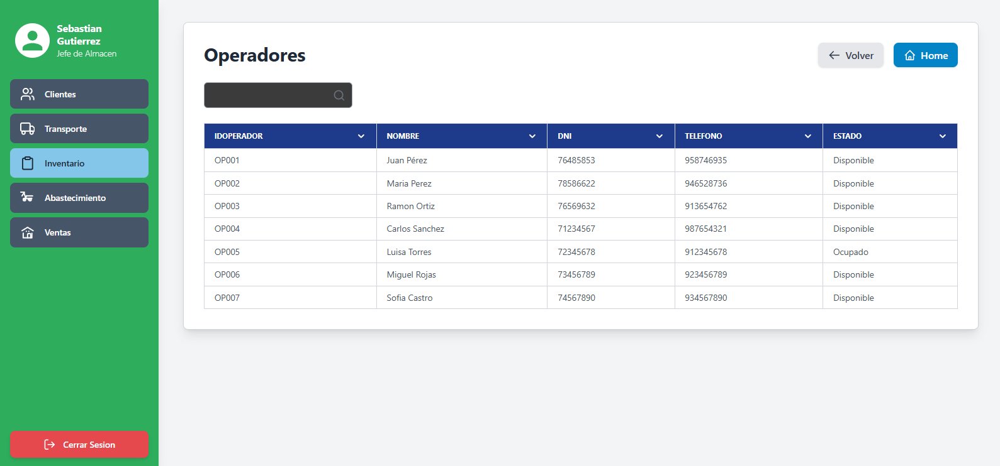 |

*Eventos:*

- **Carga de la Página (Lista de Usuarios):**
Muestra todos los `USUARIO` del área de Almacén.
    
    ```
     SELECT
     	u.cod_usuario AS "ID OPERADOR",
     	p.nombre_persona AS "NOMBRE",
     	dp.valor_documento AS "DNI",
     	r.valor_rol AS "ROL",
     	e.descp_estado_usuario AS "ESTADO"
     FROM "FERRETERIA".USUARIO u
     JOIN "FERRETERIA".PERSONA p ON u.cod_persona = p.cod_persona
     JOIN "FERRETERIA".AREA a ON u.cod_area = a.cod_area
     JOIN "FERRETERIA".ROL r ON u.cod_rol = r.cod_rol
     JOIN "FERRETERIA".ESTADO_USUARIO e ON u.cod_estado_usuario = e.cod_estado_usuario
     LEFT JOIN "FERRETERIA".DOCUMENTO_PERSONA dp ON p.cod_persona = dp.cod_persona AND dp.principal_documento = TRUE
     WHERE a.valor_area = 'Almacén';
    
    ```
    
- **Botón [Registrar] (No visible):**
Abre un formulario para crear un nuevo Usuario (implica `INSERT` en `PERSONA` y `USUARIO`).
- **Botón [Editar] (No visible):**
Abre un modal para modificar el `cod_rol` o `cod_estado_usuario` del `USUARIO` seleccionado.

## REQUERIMIENTO R-302: Recepción y Auditoría de Mercancía

| Código Requerimiento | R-302 |
| --- | --- |
| Código Interfaz | I-306 |
| Imagen Interfaz |  |

*Eventos:*

- **Carga de la Página (Tareas de Recepción):**
Muestra las `reserva_almacen` de tipo 'Recepcion' asignadas al operador logueado.
    
    ```
     SELECT
     	r.cod_reserva AS "ID RESERVA",
     	r.tipo_reserva AS "TIPO RESERVA",
     	rec.fecha_programada AS "FECHA",
     	t.hora_inicio AS "HORA",
     	i.cod_instalacion AS "INSTALACION",
     	r.estado AS "ESTADO",
     	rec.placa_vehiculo_entrega AS "PLACA",
     	rec.nombre_conductor_entrega AS "CONDUCTOR"
     FROM "FERRETERIA".reserva_almacen r
     JOIN "FERRETERIA".operador_reserva_almacen ora ON r.cod_reserva = ora.cod_reserva
     JOIN "FERRETERIA".recepcion rec ON r.cod_recepcion = rec.cod_recepcion
     JOIN "FERRETERIA".cupo_disponible c ON r.cod_cupo = c.cod_cupo
     JOIN "FERRETERIA".turno_almacen t ON c.cod_turno = t.cod_turno
     JOIN "FERRETERIA".instalacion i ON c.cod_instalacion = i.cod_instalacion
     WHERE
     	r.tipo_reserva = 'Recepcion'
     	AND ora.cod_usuario = <ID de Usuario Logueado>
     ORDER BY
     	rec.fecha_programada, t.hora_inicio;
    
    ```
    
- **Botón [Recepcionar]:**
Navega a la interfaz I-307 (Detalle de Recepción), pasando el `cod_recepcion`.

| Código Requerimiento | R-302 |
| --- | --- |
| Código Interfaz | I-307 |
| Imagen Interfaz | 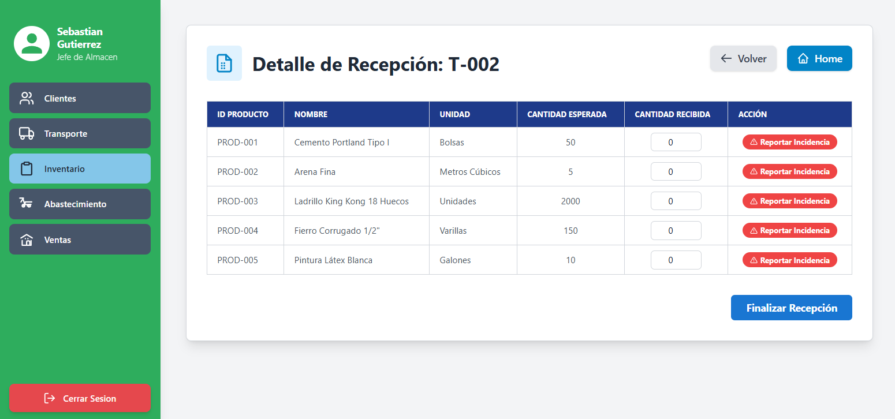 |

*Eventos:*

- **Carga de la Página (Detalle de Productos):**
Muestra los productos esperados para esta recepción.
    
    ```
     SELECT
     	dr.cod_detalle_recepcion,
     	p.cod_producto_fmt AS "ID PRODUCTO",
     	p.nombre_producto AS "NOMBRE",
     	p.unidad_medida AS "UNIDAD",
     	dr.cantidad_programada AS "CANTIDAD ESPERADA",
     	dr.cantidad_conforme, -- (Campo vacío para llenar)
     	dr.cantidad_defectuosa -- (Campo vacío para llenar)
     FROM "FERRETERIA".detalle_recepcion dr
     JOIN "FERRETERIA".producto p ON dr.cod_producto = p.cod_producto
     WHERE dr.cod_recepcion = <ID de Recepción Seleccionado>;
    
    ```
    
- **Botón [Reportar Incidencia]:**
Abre el modal I-308 (Reportar Incidencia) para la línea de producto seleccionada.
- **Botón [Finalizar Recepción] (¡El Proceso Complejo!):**
Dispara la transacción que guarda todo, aplica la lógica del "split" de inventario y la auditoría automática.
    
    **Flujo Transaccional:**
    
    1. **Iterar por cada línea** de producto en la pantalla (cada `detalle_recepcion`).
    2. **Paso 1: Guardar lo contado.**
        
        ```
        -- Actualiza las cantidades contadas por el operador
        UPDATE "FERRETERIA".detalle_recepcion
        SET
        	cantidad_conforme = <Cantidad Conforme Ingresada>, -- (ej: 47)
        	cantidad_defectuosa = <Cantidad Defectuosa Ingresada>, -- (ej: 2)
        	-- (El campo 'cantidad_recibida' del consolidado es el total físico)
        	cantidad_recibida = <Cantidad Conforme Ingresada> + <Cantidad Defectuosa Ingresada> -- (ej: 49)
        WHERE cod_detalle_recepcion = <ID Detalle Recepción>;
        
        ```
        
    3. **Paso 2: (Trigger/Función) Auditoría Automática.***El sistema* (un trigger o una función llamada por el software) hace esto:
        
        ```
        -- Calcular discrepancia de cantidad
        v_discrepancia := <cantidad_programada> - (<cantidad_conforme> + <cantidad_defectuosa>);
        
        -- Si v_discrepancia > 0 (Faltante)
        INSERT INTO "FERRETERIA".incidencia (cod_tipo_incidencia, cantidad_afectada, cod_detalle_recepcion, ...)
        VALUES ((SELECT cod_tipo_incidencia FROM "FERRETERIA".tipo_incidencia_lookup WHERE descripcion = 'Faltante'), v_discrepancia, <ID Detalle Recepción>, ...);
        
        -- Si v_discrepancia < 0 (Sobrante)
        INSERT INTO "FERRETERIA".incidencia (cod_tipo_incidencia, cantidad_afectada, cod_detalle_recepcion, ...)
        VALUES ((SELECT cod_tipo_incidencia FROM "FERRETERIA".tipo_incidencia_lookup WHERE descripcion = 'Sobrante'), abs(v_discrepancia), <ID Detalle Recepción>, ...);
        
        ```
        
    4. **Paso 3: (Trigger/Función) Mover Inventario BUENO.***Se obtiene el `cod_inventario` de VENTA.*
        
        ```
        INSERT INTO "FERRETERIA".movimiento (tipo_movimiento, cantidad, cod_inventario, cod_detalle_recepcion)
        VALUES ('ENTRADA', <Cantidad Conforme>, <ID Inventario Venta>, <ID Detalle Recepción>);
        
        UPDATE "FERRETERIA".inventario
        SET stock_fisico = stock_fisico + <Cantidad Conforme>
        WHERE cod_inventario = <ID Inventario Venta>;
        
        ```
        
    5. **Paso 4: (Trigger/Función) Mover Inventario MALO (si se aceptó).***Se busca si hay una incidencia de calidad (`'Roto'`, `'Humedo'`, etc.) con `accion_tomada = 'Aceptar'`. Si existe:Se obtiene el `cod_inventario` de MERMA.*
        
        ```
        INSERT INTO "FERRETERIA".movimiento (tipo_movimiento, cantidad, cod_inventario, cod_incidencia)
        VALUES ('MERMA_ENTRADA', <Cantidad Defectuosa>, <ID Inventario Merma>, <ID Incidencia>);
        
        UPDATE "FERRETERIA".inventario
        SET stock_fisico = stock_fisico + <Cantidad Defectuosa>
        WHERE cod_inventario = <ID Inventario Merma>;
        
        ```
        
    6. **Paso 5: Actualizar Estados.**
        
        ```
        UPDATE "FERRETERIA".recepcion SET estado_recepcion = 'Finalizada' WHERE cod_recepcion = <ID Recepción>;
        UPDATE "FERRETERIA".reserva_almacen SET estado = 'Completado' WHERE cod_recepcion = <ID Recepción>;
        
        ```
        

| Código Requerimiento | R-302 |
| --- | --- |
| Código Interfaz | I-308 (Modal) |
| Imagen Interfaz |  |

*Eventos:*

- **Carga de Modal (Dropdown "Tipo"):**
Carga los tipos de incidencia de **calidad y logística**, no de cantidad.
    
    ```
     SELECT cod_tipo_incidencia, descripcion
     FROM "FERRETERIA".tipo_incidencia_lookup
     WHERE descripcion NOT IN ('Faltante', 'Sobrante');
     -- (Faltante y Sobrante son automáticos)
    
    ```
    
- **Botón [Guardar Incidencias]:**
Crea el registro de incidencia en la base de datos, que será procesado al "Finalizar Recepción".
    
    ```
     -- Se ejecuta en bucle por cada tipo de incidencia añadida en el modal
     INSERT INTO "FERRETERIA".incidencia
     	(cod_incidencia, cod_tipo_incidencia, cantidad_afectada, descripcion, accion_tomada, cod_detalle_recepcion)
     VALUES
     	(<ID Incidencia Generado>, <ID Tipo Seleccionado>, <Cantidad Ingresada>, <Descripción Opcional>, <'Aceptar' o 'Rechazar'>, <ID Detalle Recepción Actual>);
    
    ```
    

## REQUERIMIENTO R-303: Gestión y Precisión de Inventario (Conteo Cíclico)

| Código Requerimiento | R-303 |
| --- | --- |
| Código Interfaz | I-309 |
| Imagen Interfaz | 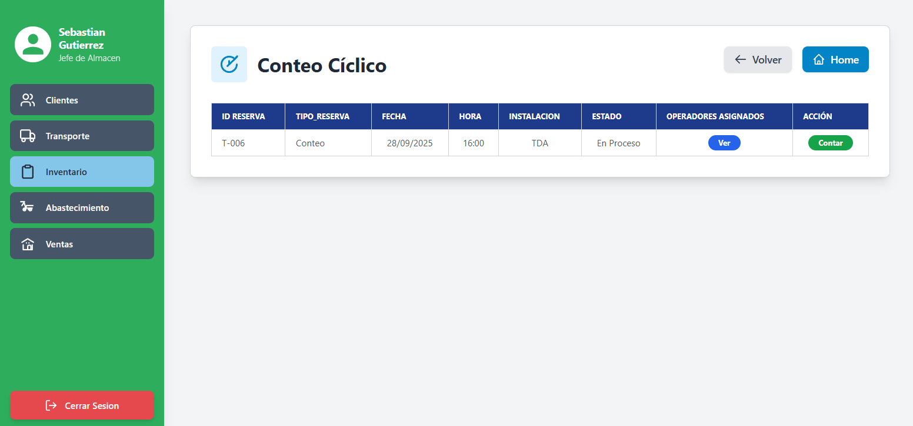 |

*Eventos:*

- **Carga de Página (Tareas de Conteo):**
Muestra las tareas de `conteo` asignadas al operador logueado.
    
    ```
     SELECT
     	c.cod_conteo AS "ID RESERVA", -- (Se reutiliza el layout de reservas)
     	'Conteo' AS "TIPO RESERVA",
     	c.fecha_conteo AS "FECHA",
     	c.hora_conteo AS "HORA",
     	(SELECT i.cod_instalacion FROM "FERRETERIA".ubicacion i LIMIT 1) AS "INSTALACION", -- (Simplificado, se requeriría un JOIN complejo)
     	c.estado AS "ESTADO"
     FROM "FERRETERIA".conteo c
     JOIN "FERRETERIA".operador_conteo oc ON c.cod_conteo = oc.cod_conteo
     WHERE
     	oc.cod_usuario = <ID de Usuario Logueado>
     	AND c.estado = 'Pendiente';
    
    ```
    
- **Botón [Contar]:**
Navega a la interfaz I-311 (Detalle de Conteo), pasando el `cod_conteo`.

| Código Requerimiento | R-303 |
| --- | --- |
| Código Interfaz | I-311 |
| Imagen Interfaz |  |

*Eventos:*

- **Carga de Página (Detalle de Conteo):**
Muestra los productos a contar, crucialmente cargando el "pantallazo" (`cantidad_sistema`).
    
    ```
     SELECT
     	dc.cod_detalle_conteo,
     	p.cod_producto_fmt AS "CÓDIGO",
     	p.nombre_producto AS "NOMBRE",
     	p.unidad_medida AS "UNIDAD",
     	u.cod_ubicacion_calculado AS "UBICACIÓN",
     	dc.cantidad_sistema AS "CANTIDAD EN STOCK", -- El "Pantallazo"
     	dc.cantidad_contada -- (Campo vacío para llenar)
     FROM "FERRETERIA".detalle_conteo dc
     JOIN "FERRETERIA".producto p ON dc.cod_producto = p.cod_producto
     JOIN "FERRETERIA".inventario i ON p.cod_producto = i.cod_producto
     JOIN "FERRETERIA".ubicacion u ON i.cod_ubicacion = u.cod_ubicacion
     WHERE
     	dc.cod_conteo = <ID de Conteo Seleccionado>
     	AND u.tipo_ubicacion = 'VENTA'; -- (Solo contamos stock de venta)
    
    ```
    
- **Botón [Reportar Incidencia]:**
Abre el modal I-312 (Reportar Incidencia de Conteo).
- **Botón [Finalizar Conteo] (¡El Proceso Complejo!):**
Dispara la transacción que aplica la "lógica detective" y ajusta el inventario.
    
    **Flujo Transaccional:**
    
    1. **Iterar por cada línea** de `detalle_conteo` en la pantalla.
    2. **Paso 1: Guardar lo contado.**
        
        ```
        UPDATE "FERRETERIA".detalle_conteo
        SET
        	cantidad_contada = <Cantidad Contada Ingresada>, -- (ej: 497)
        	discrepancia = <Cantidad Contada Ingresada> - cantidad_sistema
        WHERE cod_detalle_conteo = <ID Detalle Conteo>;
        
        ```
        
    3. **Paso 2: (Trigger/Función) Lógica de Reconciliación.***El sistema* (un trigger o función) hace esto:
        
        ```
        -- Calcular discrepancia bruta
        v_discrepancia_bruta := <cantidad_contada> - <cantidad_sistema>; -- (ej: 497 - 500 = -3)
        
        -- Buscar movimientos (hechos)
        SELECT COALESCE(SUM(cantidad * CASE WHEN tipo_movimiento IN ('SALIDA', 'AJUSTE_NEGATIVO') THEN -1 ELSE 1 END), 0)
        INTO v_movimientos
        FROM "FERRETERIA".movimiento
        WHERE cod_inventario = <ID Inventario> AND fecha_movimiento > (SELECT fecha_conteo FROM conteo...); -- (Lógica de tiempo)
        
        -- Buscar compromisos (promesas)
        SELECT stock_comprometido INTO v_comprometido FROM "FERRETERIA".inventario WHERE cod_inventario = <ID Inventario>;
        
        -- Calcular Discrepancia Neta ("Entropía")
        v_discrepancia_neta := v_discrepancia_bruta + v_movimientos + v_comprometido; -- (ej: -3 + 0 (movs) + 0 (comp) = -3)
        
        ```
        
    4. **Paso 3: (Trigger/Función) Ajuste de "Entropía".***Si `v_discrepancia_neta != 0` (en nuestro ej, -3), se ajusta el stock de VENTA.*
        
        ```
        v_tipo_ajuste := (CASE WHEN v_discrepancia_neta > 0 THEN 'AJUSTE_POSITIVO' ELSE 'AJUSTE_NEGATIVO' END);
        
        INSERT INTO "FERRETERIA".movimiento (tipo_movimiento, cantidad, cod_inventario, cod_detalle_conteo)
        VALUES (v_tipo_ajuste, abs(v_discrepancia_neta), <ID Inventario Venta>, <ID Detalle Conteo>);
        
        UPDATE "FERRETERIA".inventario
        SET stock_fisico = stock_fisico + v_discrepancia_neta -- (ej: 500 + (-3) = 497)
        WHERE cod_inventario = <ID Inventario Venta>;
        
        ```
        
    5. **Paso 4: (Trigger/Función) Ajuste de Merma.***Si el operador reportó una `incidencia` (ej. 1 Roto):El sistema resta 1 de VENTA y suma 1 a MERMA.*
        
        ```
        INSERT INTO "FERRETERIA".movimiento (tipo_movimiento, cantidad, cod_inventario, cod_incidencia)
        VALUES ('MERMA_SALIDA', 1, <ID Inventario Venta>, <ID Incidencia>);
        
        INSERT INTO "FERRETERIA".movimiento (tipo_movimiento, cantidad, cod_inventario, cod_incidencia)
        VALUES ('MERMA_ENTRADA', 1, <ID Inventario Merma>, <ID Incidencia>);
        
        UPDATE "FERRETERIA".inventario SET stock_fisico = stock_fisico - 1 WHERE cod_inventario = <ID Inventario Venta>;
        UPDATE "FERRETERIA".inventario SET stock_fisico = stock_fisico + 1 WHERE cod_inventario = <ID Inventario Merma>;
        
        ```
        

| Código Requerimiento | R-303 |
| --- | --- |
| Código Interfaz | I-312 (Modal) |
| Imagen Interfaz | 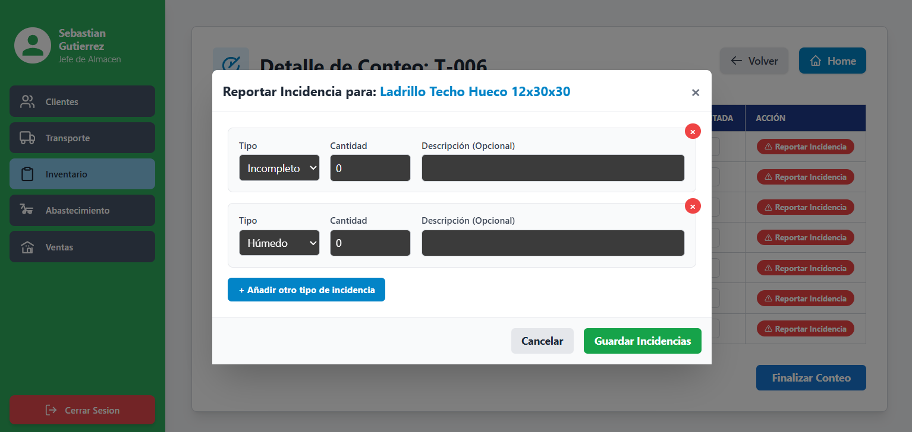 |

*Eventos:*

- **Botón [Guardar Incidencias]:**
Crea el registro de incidencia, que será procesado al "Finalizar Conteo".
    
    ```
     -- Se ejecuta en bucle por cada tipo de incidencia añadida en el modal
     INSERT INTO "FERRETERIA".incidencia
     	(cod_incidencia, cod_tipo_incidencia, cantidad_afectada, descripcion, accion_tomada, cod_detalle_conteo)
     VALUES
     	(<ID Incidencia Generado>, <ID Tipo Seleccionado>, <Cantidad Ingresada>, <Descripción Opcional>, NULL, <ID Detalle Conteo Actual>);
     -- (accion_tomada es NULL porque en conteo siempre se 'Acepta' en merma)
    
    ```
    

## REQUERIMIENTO R-304: Control de Stock y Reposición Automática

| Código Requerimiento | R-304 |
| --- | --- |
| Código Interfaz | I-313 |
| Imagen Interfaz |  |

*Eventos:*

- **Carga de la Página (Lista de Inventario):**
Muestra el estado actual del inventario de VENTA.
    
    ```
     SELECT
     	p.cod_producto_fmt AS "CÓDIGO",
     	p.nombre_producto AS "PRODUCTO",
     	u.cod_ubicacion_calculado AS "UBICACIÓN",
     	p.unidad_medida AS "UNIDAD",
     	(i.stock_fisico - i.stock_comprometido) AS "STOCK DISPONIBLE",
     	i.stock_minimo AS "STOCK MÍNIMO",
     	i.stock_maximo AS "STOCK MÁXIMO",
     	i.cod_inventario -- (ID oculto para el botón Editar)
     FROM "FERRETERIA".inventario i
     JOIN "FERRETERIA".producto p ON i.cod_producto = p.cod_producto
     JOIN "FERRETERIA".ubicacion u ON i.cod_ubicacion = u.cod_ubicacion
     WHERE u.tipo_ubicacion != 'MERMA'; -- (Solo mostramos stock de venta)
    
    ```
    
- **Botón [Editar]:**
Abre el modal I-314 (Editar Límites de Stock).
- **Proceso BATCH (Trigger de Reposición Automática):**
Este requerimiento se implementa como un TRIGGER en la tabla `inventario` (o `movimiento`).
    
    ```
     -- Lógica conceptual del TRIGGER (se ejecutaría después de un UPDATE en inventario)
    
     -- IF (NEW.stock_fisico - NEW.stock_comprometido) < NEW.stock_minimo THEN
     --
     --		-- Verificar si ya existe un pedido pendiente para este producto
     --		SELECT COUNT(*) INTO v_count FROM "FERRETERIA".detalle_pedido dp
     --		JOIN "FERRETERIA".pedido_abastecimiento pa ON dp.cod_pedido = pa.cod_pedido
     --		WHERE dp.cod_producto = NEW.cod_producto AND pa.estado_pedido = 'Pendiente';
     --
     --		-- Si no hay pedido pendiente, crear uno
     --		IF v_count = 0 THEN
     --			INSERT INTO "FERRETERIA".pedido_abastecimiento (cod_usuario, estado_pedido, ...) VALUES (1, 'Pendiente', ...);
     --			-- (Y luego insertar en detalle_pedido...)
     --		END IF;
     -- END IF;
    
    ```
    

| Código Requerimiento | R-304 |
| --- | --- |
| Código Interfaz | I-314 (Modal) |
| Imagen Interfaz |  |

*Eventos:*

- **Carga de la Modal:**
Muestra el producto y sus límites actuales (no requiere SQL, los datos ya se cargaron en la grilla).
- **Botón [Guardar Cambios]:**
Actualiza los límites de stock en la ficha de inventario.
    
    ```
     UPDATE "FERRETERIA".inventario
     SET
     	stock_minimo = <Nuevo Stock Mínimo Ingresado>,
     	stock_maximo = <Nuevo Stock Máximo Ingresado>
     WHERE
     	cod_inventario = <ID de Inventario Seleccionado>;
    
    ```
    

## REQUERIMIENTO R-305: Consulta de Inventario

| Código Requerimiento | R-305 |
| --- | --- |
| Código Interfaz | I-315 |
| Imagen Interfaz |  |

*Eventos:*

- **Carga de la Página (Inventario Completo):**
Muestra todo el inventario (venta y merma) de todas las ubicaciones.
    
    ```
     SELECT
     	p.cod_producto_fmt AS "CÓDIGO",
     	p.nombre_producto AS "PRODUCTO",
     	u.cod_ubicacion_calculado AS "UBICACIÓN",
     	u.tipo_ubicacion AS "TIPO", -- (Para diferenciar VENTA de MERMA)
     	i.stock_fisico AS "STOCK FÍSICO",
     	i.stock_comprometido AS "STOCK COMPROMETIDO",
     	(i.stock_fisico - i.stock_comprometido) AS "STOCK DISPONIBLE",
     	i.stock_minimo AS "STOCK MÍNIMO",
     	i.stock_maximo AS "STOCK MÁXIMO"
     FROM "FERRETERIA".inventario i
     JOIN "FERRETERIA".producto p ON i.cod_producto = p.cod_producto
     JOIN "FERRETERIA".ubicacion u ON i.cod_ubicacion = u.cod_ubicacion
     ORDER BY
     	p.nombre_producto, u.tipo_ubicacion;
    
    ```
    
- **Input [Buscar por Código o Nombre]:**
La consulta anterior se vuelve a ejecutar con una cláusula `WHERE` adicional.
    
    ```
     ...
     WHERE
     	p.nombre_producto ILIKE '%<Término Buscado>%'
     	OR p.cod_producto_fmt ILIKE '%<Término Buscado>%';
    
    ```
    

## REQUERIMIENTO R-306: Preparación de Pedidos (Picking de Despacho)

| Código Requerimiento | R-306 |
| --- | --- |
| Código Interfaz | I-316 |
| Imagen Interfaz | 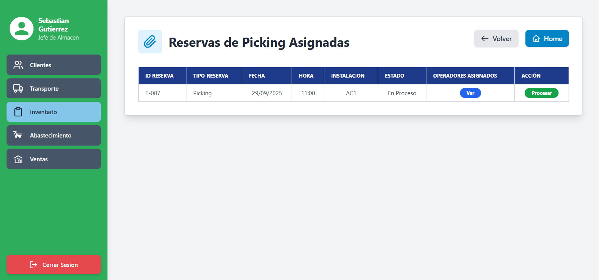 |

*Eventos:*

- **Carga de la Página (Tareas de Picking):**
Muestra las `reserva_almacen` de tipo 'Despacho' asignadas al operador logueado.
    
    ```
     SELECT
     	r.cod_reserva AS "ID RESERVA",
     	r.tipo_reserva AS "TIPO RESERVA",
     	r.fecha_reserva AS "FECHA",
     	t.hora_inicio AS "HORA",
     	i.cod_instalacion AS "INSTALACION",
     	r.estado AS "ESTADO"
     FROM "FERRETERIA".reserva_almacen r
     JOIN "FERRETERIA".operador_reserva_almacen ora ON r.cod_reserva = ora.cod_reserva
     JOIN "FERRETERIA".cupo_disponible c ON r.cod_cupo = c.cod_cupo
     JOIN "FERRETERIA".turno_almacen t ON c.cod_turno = t.cod_turno
     JOIN "FERRETERIA".instalacion i ON c.cod_instalacion = i.cod_instalacion
     WHERE
     	r.tipo_reserva = 'Despacho'
     	AND ora.cod_usuario = <ID de Usuario Logueado>
     	AND r.estado = 'Confirmado';
    
    ```
    
- **Botón [Procesar]:**
Navega a la interfaz I-318 (Procesando Picking), pasando el `cod_reserva`.

| Código Requerimiento | R-306 |
| --- | --- |
| Código Interfaz | I-318 |
| Imagen Interfaz |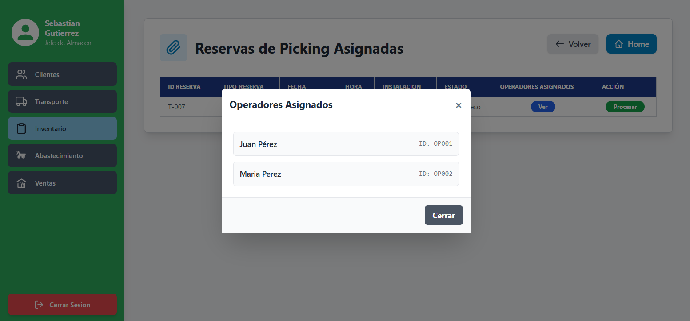  |

*Eventos:*

- **Carga de Página (Listas de Picking):**
Este es un flujo complejo que requiere múltiples consultas para armar la pantalla.
    
    ```
     -- Consulta 1: Obtener el cod_despacho
     SELECT cod_despacho INTO v_cod_despacho FROM "FERRETERIA".reserva_almacen WHERE cod_reserva = <ID Reserva Actual>;
    
     -- Consulta 2: Cargar la "Consolidado de Productos" (Lista de Picking)
     SELECT
     	p.cod_producto_fmt AS "CÓDIGO",
     	p.nombre_producto AS "PRODUCTO",
     	u.cod_ubicacion_calculado AS "UBICACIÓN",
     	SUM(dt.cantidad_detalle) AS "CANTIDAD TOTAL",
     	p.unidad_medida AS "UNIDAD"
     FROM "FERRETERIA".ASIGNACION_PEDIDO_DESPACHO apd
     JOIN "FERRETERIA".DETALLE_PEDIDO_TR dt ON apd.cod_pedido_transporte = dt.cod_pedido_transporte
     JOIN "FERRETERIA".producto p ON dt.cod_producto = p.cod_producto
     JOIN "FERRETERIA".inventario i ON p.cod_producto = i.cod_producto
     JOIN "FERRETERIA".ubicacion u ON i.cod_ubicacion = u.cod_ubicacion
     WHERE
     	apd.cod_despacho = v_cod_despacho
     	AND u.tipo_ubicacion = 'VENTA'
     GROUP BY
     	p.cod_producto_fmt, p.nombre_producto, u.cod_ubicacion_calculado, p.unidad_medida;
    
     -- Consulta 3: Cargar las listas por Pedido (ej. "Pedido: PED-03")
     -- (Se ejecuta en bucle por cada pedido_transporte asociado al despacho)
     SELECT
     	p.cod_producto_fmt AS "CÓDIGO",
     	p.nombre_producto AS "PRODUCTO",
     	u.cod_ubicacion_calculado AS "UBICACIÓN",
     	dt.cantidad_detalle AS "CANTIDAD SOLICITADA"
     FROM "FERRETERIA".DETALLE_PEDIDO_TR dt
     -- (Mismos JOINs que arriba) ...
     WHERE
     	dt.cod_pedido_transporte = <ID Pedido 03>;
    
    ```
    
- **Botón [Finalizar Picking]:**
Dispara la transacción que actualiza el inventario y genera los movimientos de salida.
    
    **Flujo Transaccional:**
    
    1. **Iterar por cada producto** en la lista de picking (la consulta 2).
    2. **Paso 1: Identificar el Inventario.**
        - `SELECT cod_inventario INTO v_cod_inv FROM "FERRETERIA".inventario i JOIN "FERRETERIA".ubicacion u ON i.cod_ubicacion = u.cod_ubicacion WHERE i.cod_producto = <ID Producto> AND u.tipo_ubicacion = 'VENTA';`
    3. **Paso 2: Crear el Movimiento de Salida.**
        - `v_cod_venta := (SELECT v.cod_venta FROM "FERRETERIA".producto_venta pv JOIN "FERRETERIA".DETALLE_PEDIDO_TR dt ON ...);` *(Lógica compleja para encontrar la venta)*
        
        ```
        INSERT INTO "FERRETERIA".movimiento
        	(tipo_movimiento, cantidad, cod_inventario, cod_venta, cod_producto_vta)
        VALUES
        	('SALIDA', <Cantidad Total Recogida>, v_cod_inv, v_cod_venta, <ID Producto>);
        
        ```
        
    4. **Paso 3: Actualizar el Inventario.**
        
        ```
        UPDATE "FERRETERIA".inventario
        SET
        	stock_fisico = stock_fisico - <Cantidad Total Recogida>,
        	stock_comprometido = stock_comprometido - <Cantidad Total Recogida>
        WHERE
        	cod_inventario = v_cod_inv;
        
        ```
        
    5. **Paso 4: Actualizar Estado del Despacho.**
        
        ```
        UPDATE "FERRETERIA".DESPACHO
        SET cod_estado_despacho = (SELECT cod_estado_despacho FROM "FERRETERIA".ESTADO_DESPACHO WHERE descp_estado_despacho = 'Listo para Cargar')
        WHERE cod_despacho = <ID Despacho Actual>;
        
        UPDATE "FERRETERIA".reserva_almacen
        SET estado = 'En Proceso' -- (O 'Completado', según la lógica de negocio)
        WHERE cod_despacho = <ID Despacho Actual>;
        
        ```
        

## REQUERIMIENTO R-307: Gestión de Capacidad y Generación de Cupos BATCH

| Código Requerimiento | R-307 |
| --- | --- |
| Código Interfaz | I-319 |
| Imagen Interfaz | 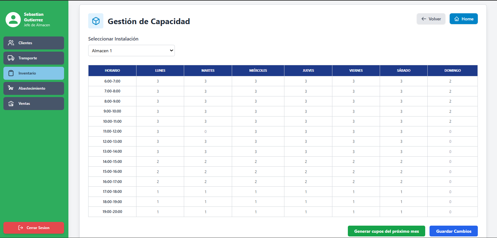 |

*Eventos:*

- **Dropdown [Seleccionar Instalación]:**
Filtra la grilla que se muestra.
    
    ```
     SELECT cod_instalacion, nombre_instalacion FROM "FERRETERIA".instalacion;
    
    ```
    
- **Carga de la Grilla (al seleccionar Instalación):**
Muestra las reglas de capacidad actuales para esa instalación.
    
    ```
     SELECT
     	t.hora_inicio,
     	t.hora_fin,
     	ct.dia_semana,
     	ct.capacidad_total
     FROM "FERRETERIA".capacidad_turno ct
     JOIN "FERRETERIA".turno_almacen t ON ct.cod_turno = t.cod_turno
     WHERE
     	ct.cod_instalacion = <ID Instalación Seleccionada>;
     -- (El software debe "pivotar" estos datos para mostrarlos en la grilla)
    
    ```
    
- **Botón [Guardar Cambios]:**
Actualiza la "plantilla" de reglas en la base de datos.
    
    ```
     -- Se ejecuta en bucle por cada celda modificada
     UPDATE "FERRETERIA".capacidad_turno
     SET
     	capacidad_total = <Nuevo Valor de la Celda>
     WHERE
     	cod_instalacion = <ID Instalación Seleccionada>
     	AND cod_turno = <ID del Turno de la Fila>
     	AND dia_semana = <ID del Día de la Columna>;
    
    ```
    
- **Botón [Generar cupos del próximo mes]:**
Llama a una función BATCH (procedimiento almacenado) que genera el inventario de "tickets".
    
    ```
     -- Lógica conceptual del Proceso BATCH (ej. f_generar_cupos_mes)
     -- 1. Define v_fecha_inicio (primer día del próx mes) y v_fecha_fin (último día).
     -- 2. Inicia un bucle FOR v_dia FROM v_fecha_inicio TO v_fecha_fin.
     -- 3. Dentro del bucle, obtiene v_dia_semana (ej. Lunes=1).
     -- 4. INSERT INTO "FERRETERIA".cupo_disponible (cod_instalacion, cod_turno, fecha_cupo, ...)
     --    SELECT
     --        ct.cod_instalacion,
     --        ct.cod_turno,
     --        v_dia,
     --        'Disponible'
     --    FROM "FERRETERIA".capacidad_turno ct
     --    CROSS JOIN generate_series(1, ct.capacidad_total) -- (Genera N filas por cada regla)
     --    WHERE ct.dia_semana = v_dia_semana;
     -- 5. FIN DEL BUCLE.
    
    ```
    

## REQUERIMIENTO R-308: Trazabilidad de Producto (Reporte Kardex)

| Código Requerimiento | R-308 |
| --- | --- |
| Código Interfaz | I-320 |
| Imagen Interfaz |  |

*Eventos:*

- **Botón [Buscar] (al ingresar un producto):**
Muestra el historial completo (Kardex) de un producto.
    
    ```
     -- Paso 1: Obtener los IDs de inventario para ese producto
     -- (Un producto puede tener varias fichas: una de VENTA y una de MERMA)
     WITH IdsInventario AS (
     	SELECT cod_inventario
     	FROM "FERRETERIA".inventario
     	WHERE cod_producto = (SELECT cod_producto FROM "FERRETERIA".producto WHERE nombre_producto ILIKE '%<Término Buscado>%')
     )
     -- Paso 2: Obtener todos los movimientos de esas fichas
     SELECT
     	m.fecha_movimiento AS "FECHA",
     	m.hora_movimiento AS "HORA",
     	m.tipo_movimiento AS "TIPO DE MOVIMIENTO",
     	m.cantidad AS "CANTIDAD",
     	-- (Esta lógica compleja identifica el origen)
     	CASE
     		WHEN m.cod_detalle_recepcion IS NOT NULL THEN 'Recepción: ' || rec.cod_recepcion
     		WHEN m.cod_venta IS NOT NULL THEN 'Venta: ' || v.cod_venta_fmt
     		WHEN m.cod_detalle_conteo IS NOT NULL THEN 'Conteo: ' || c.cod_conteo
     		WHEN m.cod_incidencia IS NOT NULL THEN 'Incidencia: ' || i.cod_incidencia
     		ELSE 'Ajuste Manual'
     	END AS "ORIGEN DEL MOVIMIENTO"
     FROM "FERRETERIA".movimiento m
     LEFT JOIN "FERRETERIA".detalle_recepcion dr ON m.cod_detalle_recepcion = dr.cod_detalle_recepcion
     LEFT JOIN "FERRETERIA".recepcion rec ON dr.cod_recepcion = rec.cod_recepcion
     LEFT JOIN "FERRETERIA".producto_venta pv ON m.cod_venta = pv.cod_venta AND m.cod_producto_vta = pv.cod_producto
     LEFT JOIN "FERRETERIA".venta v ON pv.cod_venta = v.cod_venta
     LEFT JOIN "FERRETERIA".detalle_conteo dc ON m.cod_detalle_conteo = dc.cod_detalle_conteo
     LEFT JOIN "FERRETERIA".conteo c ON dc.cod_conteo = c.cod_conteo
     LEFT JOIN "FERRETERIA".incidencia i ON m.cod_incidencia = i.cod_incidencia
     WHERE
     	m.cod_inventario IN (SELECT cod_inventario FROM IdsInventario)
     ORDER BY
     	m.fecha_movimiento DESC, m.hora_movimiento DESC;
    
    ```
    

## REQUERIMIENTO R-309: Bandeja de Consulta de Incidencias

| Código Requerimiento | R-309 |
| --- | --- |
| Código Interfaz | I-321 |
| Imagen Interfaz |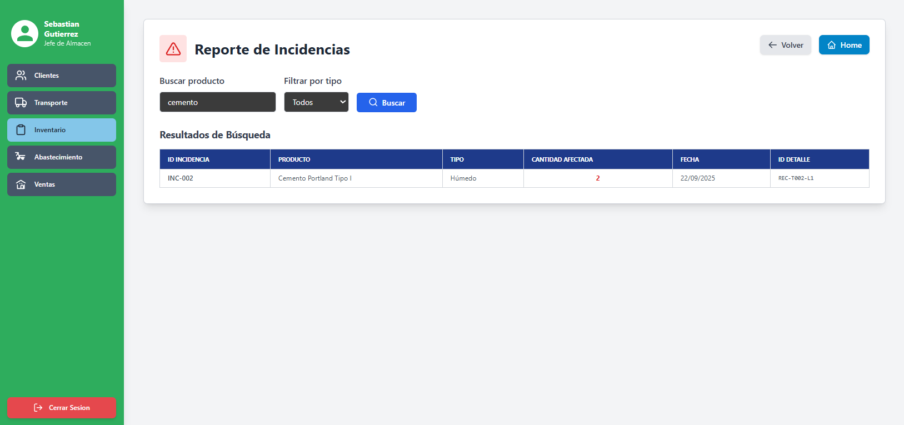  |

*Eventos:*

- **Carga de Página (Dropdown "Filtrar por tipo"):**
Llena el filtro de tipos de incidencia.
    
    ```
     SELECT cod_tipo_incidencia, descripcion
     FROM "FERRETERIA".tipo_incidencia_lookup
     ORDER BY descripcion;
    ```

---

[⬅️ Anterior](../9.1.2/9.1.2.md) | [🏠 Home](../../../README.md) | [Siguiente ➡️](../9.1.4/9.1.4.md)
