> [9. Preparación para Implementación](../../9.md) › [9.1. Sentencias SQL por módulo / prototipo](../9.1.md) › [9.1.4. Módulo 4 / Integrante 4](9.1.4.md)

# 9.1.4. Módulo 4 / Integrante 4

# Sentencias SQL por cada prototipo 𝄜

|Código Requerimiento |R-401|
|---|---|
|Código Interfaz| I-001|
|Imagen Interfaz|  |

**Eventos:**

- Carga de Página:

    Se llenará la lista de proveedores a seleccionar

    ```sql
    SELECT 
        cod_proveedor,
        nombre_comercial,
        razon_social,
        RUC
    FROM 
        MODULO_ABASTECIMIENTO.PROVEEDOR
    --POSIBLES FILTROS:
    --NOMBRE COMERCIAL, RAZON SOCIAL, RUC
    ORDER BY 
        nombre_comercial;
    ```

|Código Requerimiento |R-401|
|---|---|
|Código Interfaz| I-002|
|Imagen Interfaz| 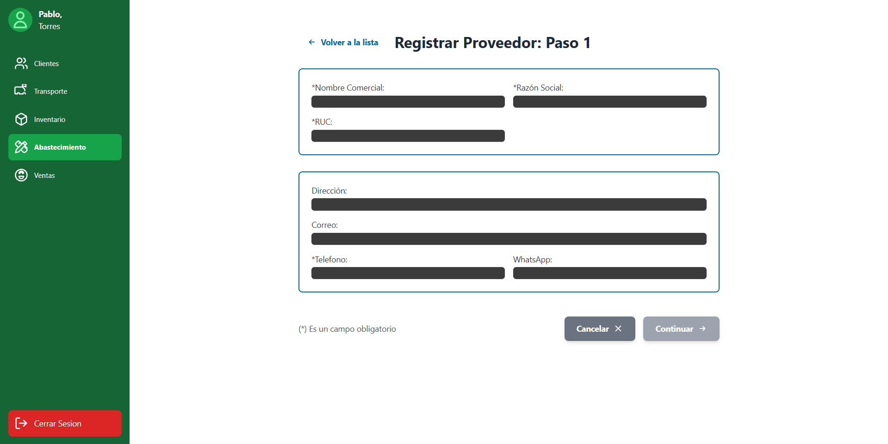 |

**Eventos:**

- Llenar datos:

    Se llenará las listas de información general

    ```sql  
    BEGIN;

    -- =============================================================
    -- $1 = 'Nombre Comercial'
    -- $2 = 'Razón Social'
    -- $3 = 'RUC'
    -- =============================================================
    INSERT INTO MODULO_ABASTECIMIENTO.PROVEEDOR (
        nombre_comercial, 
        razon_social,
        RUC
    )
    VALUES ($1, $2, $3)
    RETURNING cod_proveedor;
    ```

    Se llenará las listas de información de contacto (Tabla PROVEEDOR_CONTACTO)

    ```sql
    -- =============================================================
    -- $4 = 'Dirección'
    -- $5 = 'Correo'
    -- $6 = 'Teléfono'
    -- $7 = 'WhatsApp'
    -- $NUEVO_COD_PROVEEDOR = El ID retornado por el INSERT anterior
    -- =============================================================

    INSERT INTO MODULO_ABASTECIMIENTO.PROVEEDOR_CONTACTO (
        cod_proveedor, 
        cod_tipo_contacto, 
        valor_contacto
    )
    VALUES (
        $NUEVO_COD_PROVEEDOR, 
        (SELECT cod_tipo_contacto FROM MODULO_ABASTECIMIENTO.TIPO_CONTACTO WHERE valor_tipo_contacto = 'Direccion'), 
        $4
    );

    INSERT INTO MODULO_ABASTECIMIENTO.PROVEEDOR_CONTACTO (
        cod_proveedor, 
        cod_tipo_contacto, 
        valor_contacto
    )
    VALUES (
        $NUEVO_COD_PROVEEDOR, 
        (SELECT cod_tipo_contacto FROM MODULO_ABASTECIMIENTO.TIPO_CONTACTO WHERE valor_tipo_contacto = 'Correo'), 
        $5
    );

    INSERT INTO MODULO_ABASTECIMIENTO.PROVEEDOR_CONTACTO (
        cod_proveedor, 
        cod_tipo_contacto, 
        valor_contacto
    )
    VALUES (
        $NUEVO_COD_PROVEEDOR, 
        (SELECT cod_tipo_contacto FROM MODULO_ABASTECIMIENTO.TIPO_CONTACTO WHERE valor_tipo_contacto = 'Telefono'), 
        $6
    );

    INSERT INTO MODULO_ABASTECIMIENTO.PROVEEDOR_CONTACTO (
        cod_proveedor, 
        cod_tipo_contacto, 
        valor_contacto
    )
    VALUES (
        $NUEVO_COD_PROVEEDOR, 
        (SELECT cod_tipo_contacto FROM MODULO_ABASTECIMIENTO.TIPO_CONTACTO WHERE valor_tipo_contacto = 'WhatsApp'), 
        $7
    );

    COMMIT;
    ```

|Código Requerimiento |R-401|
|---|---|
|Código Interfaz| I-003|
|Imagen Interfaz| 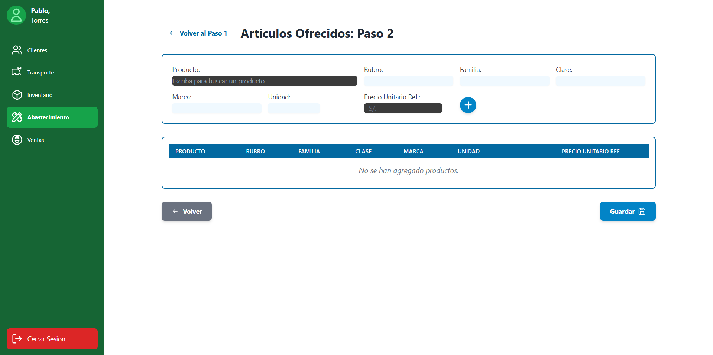 |

**Eventos:**
    
- Insertaran productos que el proveedor ofrece:

    Búsqueda de productos para el dropdown

    ```sql
    -- =============================================================
    -- $palabra es el texto de búsqueda (ej: 'Talad%' o '%')
    -- =============================================================
    SELECT
        cod_producto,    -- ID Oculto (para usarlo en la siguiente query)
        nombre_producto  -- Nombre del producto que ve el usuario
    FROM
        MODULO_ABASTECIMIENTO.PRODUCTO
    WHERE
        nombre_producto ILIKE $palabra
    ORDER BY
        nombre_producto;
    ```

    Autocompletar campos al seleccionar un producto

    ```sql
    -- =============================================================
    -- $1 es el 'cod_producto' que se obtuvo de la Query 1
    -- =============================================================
    SELECT
        C.rubro,
        C.familia,
        C.clase,
        P.marca,
        P.unidad_medida
    FROM
        MODULO_ABASTECIMIENTO.PRODUCTO P
    JOIN
        MODULO_ABASTECIMIENTO.CATEGORIA C ON P.cod_categoria = C.cod_categoria
    WHERE
        P.cod_producto = $1;
    ```

    Insertar Artículos Ofrecidos (Tabla PRODUCTO_PROVEEDOR) 

    ```sql
    BEGIN;
    -- =============================================================
    -- La aplicación debe hacer un BUCLE por cada fila que el usuario agregó a la tabla.
    -- $NUEVO_COD_PROVEEDOR es el ID del proveedor que se está creando.
    -- =============================================================

    -- (Bucle - Iteración 1: ej: "Fierro Corrugado")
    -- $10 = cod_producto_1
    -- $11 = precio_unitario_ref_1
    INSERT INTO MODULO_ABASTECIMIENTO.PRODUCTO_PROVEEDOR (
        cod_proveedor, 
        cod_producto, 
        precio_unitario_ref
    )
    VALUES ($NUEVO_COD_PROVEEDOR, $10, $11);

    -- (Bucle - Iteración 2: ej: "Taladro Percutor")
    -- $12 = cod_producto_2
    -- $13 = precio_unitario_ref_2
    INSERT INTO MODULO_ABASTECIMIENTO.PRODUCTO_PROVEEDOR (
        cod_proveedor, 
        cod_producto, 
        precio_unitario_ref
    )
    VALUES ($NUEVO_COD_PROVEEDOR, $12, $13);

    -- (Y así por cada producto en la lista...)
    COMMIT;
    ```

|Código Requerimiento |R-402|
|---|---|
|Código Interfaz| I-004|
|Imagen Interfaz|  |

**Eventos:**

- Carga de Página:

    Se llenará la lista de proveedores a seleccionar

    ```sql
    SELECT 
        cod_proveedor,
        nombre_comercial,
        razon_social,
        RUC
    FROM 
        MODULO_ABASTECIMIENTO.PROVEEDOR
    --POSIBLES FILTROS:
    --NOMBRE COMERCIAL, RAZON SOCIAL, RUC
    ORDER BY 
        nombre_comercial;
    ```

|Código Requerimiento |R-402|
|---|---|
|Código Interfaz| I-005|
|Imagen Interfaz| 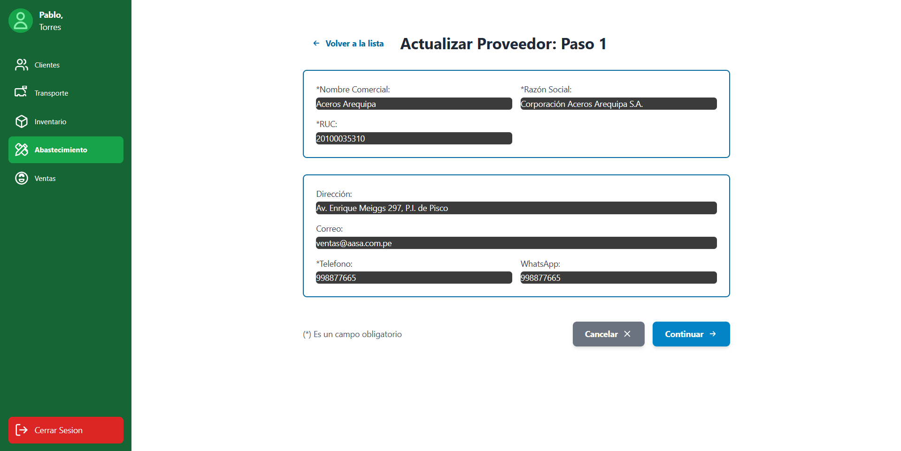 |

**Eventos:**

- Actualizar información general e información de contacto del proveedor:

    Cargar datos principales y contacto del proveedor
    ```sql
    -- =============================================================
    -- $1 es el 'cod_proveedor' que el usuario seleccionó para editar
    -- =============================================================
    -- Query 1: Cargar datos principales
    SELECT
        nombre_comercial,
        razon_social,
        RUC
    FROM
        MODULO_ABASTECIMIENTO.PROVEEDOR
    WHERE
        cod_proveedor = $1;

    -- Query 2: Cargar datos de contacto
    SELECT
        T.valor_tipo_contacto,
        PC.valor_contacto
    FROM
        MODULO_ABASTECIMIENTO.PROVEEDOR_CONTACTO PC
    JOIN
        MODULO_ABASTECIMIENTO.TIPO_CONTACTO T ON PC.cod_tipo_contacto = T.cod_tipo_contacto
    WHERE
        PC.cod_proveedor = $1;
    ```

    Actualizar datos principales e información de contacto
    ```sql
    BEGIN;

    -- Query 1: Actualizar datos principales
    -- =============================================================
    -- $1 = cod_proveedor que el usuario seleccionó para editar
    -- $2 = nuevo nombre_comercial
    -- $3 = nueva razon_social
    -- =============================================================
    UPDATE MODULO_ABASTECIMIENTO.PROVEEDOR
    SET
        nombre_comercial = $2,
        razon_social     = $3
    WHERE cod_proveedor = $1;

    -- Query 2: Actualizar información de contacto
    -- =============================================================
    -- $1 = cod_proveedor que el usuario seleccionó para editar
    -- $2 = nuevo valor 'WhatsApp'
    -- $3 = nuevo valor 'Correo'
    -- $4 = nuevo valor 'Telefono'
    -- $5 = nuevo valor 'Direccion'
    -- =============================================================

    UPDATE MODULO_ABASTECIMIENTO.PROVEEDOR_CONTACTO PC
    SET valor_contacto = CASE T.valor_tipo_contacto
                            WHEN 'WhatsApp'  THEN $2
                            WHEN 'Correo'    THEN $3
                            WHEN 'Telefono'  THEN $4
                            WHEN 'Direccion' THEN $5
                        END
    FROM MODULO_ABASTECIMIENTO.TIPO_CONTACTO T
    WHERE PC.cod_tipo_contacto = T.cod_tipo_contacto
        AND PC.cod_proveedor = $1
        AND T.valor_tipo_contacto IN ('WhatsApp','Correo','Telefono','Direccion');

    COMMIT;
    ```
|Código Requerimiento |R-402|
|---|---|
|Código Interfaz| I-006|
|Imagen Interfaz| 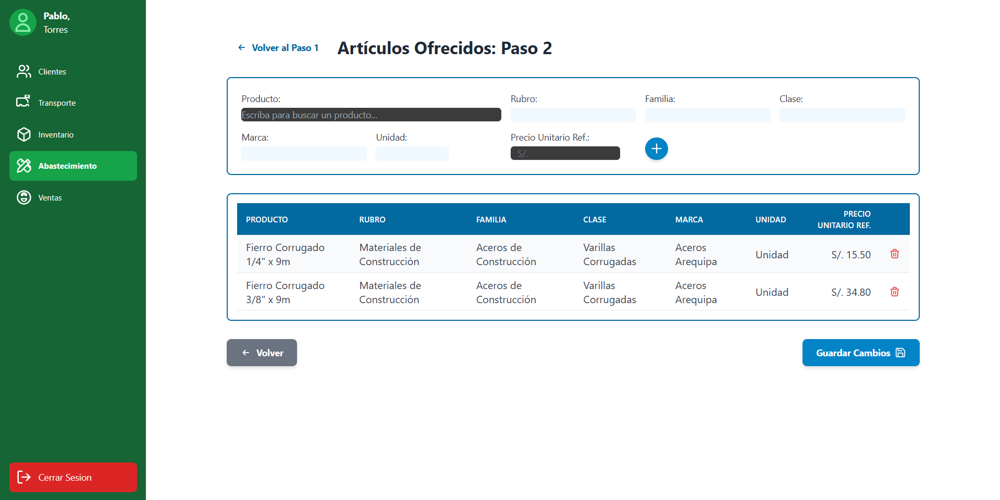 |

**Eventos:**

- Actualizar productos que ofrece el proveedor:
    Cargar los productos que ofrece
    ```sql
    -- =============================================================
    -- $1 es el 'cod_proveedor' que el usuario seleccionó para editar
    -- =============================================================
    SELECT
        pp.cod_producto,
        p.nombre_producto,
        p.marca,
        p.unidad_medida,
        c.rubro,
        c.familia,
        c.clase,
        pp.precio_unitario_ref
    FROM
        MODULO_ABASTECIMIENTO.PRODUCTO_PROVEEDOR pp
    JOIN MODULO_ABASTECIMIENTO.PRODUCTO p
        ON p.cod_producto = pp.cod_producto
    JOIN MODULO_ABASTECIMIENTO.CATEGORIA c
        ON c.cod_categoria = p.cod_categoria
    WHERE
        pp.cod_proveedor = $1
    ORDER BY
        p.nombre_producto;
    ```

    Actualizar los productos ofrecidos:
    ```sql
    BEGIN;
    
    -- =============================================================
    -- $1 es el 'cod_proveedor' que se está editando
    -- =============================================================
    -- QUITAR los artículos que el proveedor ya no ofrezca
    DELETE FROM MODULO_ABASTECIMIENTO.PRODUCTO_PROVEEDOR
    WHERE cod_proveedor = $1;

    -- =============================================================
    -- AGREGAR todos los artículos de la nueva lista (Bucle)
    -- (Bucle - Iteración 1)
    -- $1 = cod_proveedor
    -- $10 = cod_producto_1
    -- $11 = precio_unitario_ref_1
    -- =============================================================
    INSERT INTO MODULO_ABASTECIMIENTO.PRODUCTO_PROVEEDOR (
        cod_proveedor, 
        cod_producto, 
        precio_unitario_ref
    )
    VALUES ($1, $10, $11);

    -- (Bucle - Iteración 2)
    -- $1 = cod_proveedor (el que se edita)
    -- $12 = cod_producto_2
    -- $13 = precio_unitario_ref_2
    -- =============================================================
    INSERT INTO MODULO_ABASTECIMIENTO.PRODUCTO_PROVEEDOR (
        cod_proveedor,
        cod_producto, 
        precio_unitario_ref
    )
    VALUES ($1, $12, $13);

    -- (Y así por cada producto en la lista...)

    COMMIT;
    ```

    Busqueda mediante el dropdown
    
    ```sql
    -- $1 es el texto de búsqueda (ej: 'Talad%' o '%')
    SELECT
        cod_producto,
        nombre_producto
    FROM
        MODULO_ABASTECIMIENTO.PRODUCTO
    WHERE
        nombre_producto ILIKE $1
    ORDER BY
        nombre_producto;
    ```

    Autocompletar campos del producto
    ```sql
    -- $1 es el 'cod_producto' de la Query anterior
    SELECT
        C.rubro, 
        C.familia, 
        C.clase, 
        P.marca,
        P.unidad_medida
    FROM
        MODULO_ABASTECIMIENTO.PRODUCTO P
    JOIN
        MODULO_ABASTECIMIENTO.CATEGORIA C ON P.cod_categoria = C.cod_categoria
    WHERE
        P.cod_producto = $1;
    ´´´

|Código Requerimiento |R-403|
|---|---|
|Código Interfaz| I-007|
|Imagen Interfaz|  |

**Eventos:**

- Carga de Página:

    Se llenará la lista de los productos de la ferretería

    ```sql
    SELECT
        P.cod_producto,
        P.nombre_producto,
        C.rubro,
        C.familia,
        C.clase,
        P.marca,
        P.unidad_medida,
        P.precio_base
    FROM
        MODULO_ABASTECIMIENTO.PRODUCTO P
    JOIN
        MODULO_ABASTECIMIENTO.CATEGORIA C ON P.cod_categoria = C.cod_categoria
    ORDER BY
        P.nombre_producto;
    ```

    Busqueda de productos
    ```sql
    -- $1 es el término de búsqueda (ej: 'Pintura%')
    SELECT
        P.cod_producto,
        P.nombre_producto,
        C.rubro,
        C.familia,
        C.clase,
        P.marca,
        P.unidad_medida,
        P.precio_base
    FROM
        MODULO_ABASTECIMIENTO.PRODUCTO P
    JOIN
        MODULO_ABASTECIMIENTO.CATEGORIA C ON P.cod_categoria = C.cod_categoria
    WHERE
        P.nombre_producto ILIKE $1 OR
        C.rubro ILIKE $1 OR
        C.familia ILIKE $1 OR
        C.clase ILIKE $1 OR
        P.marca_producto ILIKE $1
    ORDER BY
        P.nombre_producto;
    ´´´

|Código Requerimiento |R-403|
|---|---|
|Código Interfaz| I-008|
|Imagen Interfaz|  |

**Eventos:**

- Se insertará por parte del usuario los datos del producto nuevo:

    Asegurar/Crear la Categoría
    ```sql
    BEGIN;

    -- =============================================================
    -- ($1='Rubro', $2='Familia', $3='Clase' del formulario)
    -- =============================================================
    INSERT INTO MODULO_ABASTECIMIENTO.CATEGORIA (rubro, familia, clase)
    VALUES ($1, $2, $3)
    ON CONFLICT (rubro, familia, clase) DO NOTHING;
    ```

    Obtener el id de la categoría y guardar el Producto nuevo
    ```sql
    -- (La aplicación debe ejecutar este SELECT para obtener el ID de categoría)
    SELECT cod_categoria 
    FROM MODULO_ABASTECIMIENTO.CATEGORIA
    WHERE rubro = $1 AND familia = $2 AND clase = $3;
    -- (La aplicación captura el resultado en $NUEVO_COD_CATEGORIA)

    -- =============================================================
    -- $4 = nombre_producto
    -- $5 = marca
    -- $6 = unidad_medida
    -- $7 = precio_base
    -- $NUEVO_COD_CATEGORIA
    -- =============================================================
    INSERT INTO MODULO_ABASTECIMIENTO.PRODUCTO (
        nombre_producto,
        marca,
        unidad_medida,
        precio_base,
        cod_categoria
    )
    VALUES (
        $4,
        $5,
        $6,
        $7,
        $NUEVO_COD_CATEGORIA
    );

    COMMIT;
    ```

|Código Requerimiento |R-404|
|---|---|
|Código Interfaz| I-009|
|Imagen Interfaz| 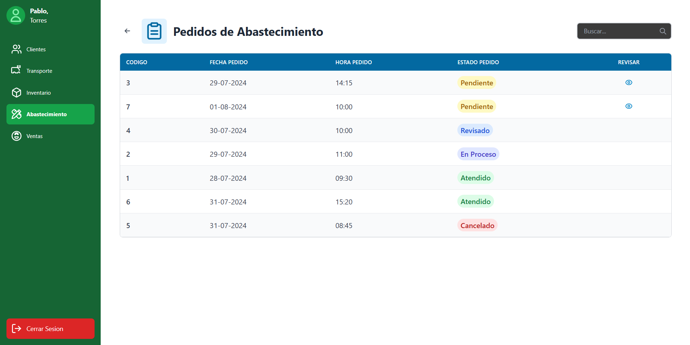 |

**Eventos:**

- Carga de Página:

    Se llenará la lista de los pedidos de abastecimiento de la ferretería
    ```sql
    SELECT
        cod_pedido,
        fecha_pedido,
        hora_pedido,
        estado_pedido
    FROM
        MODULO_ABASTECIMIENTO.PEDIDO_ABASTECIMIENTO
    ORDER BY
        fecha_pedido DESC, hora_pedido DESC;
    ```

|Código Requerimiento |R-404|
|---|---|
|Código Interfaz| I-010 |
|Imagen Interfaz| 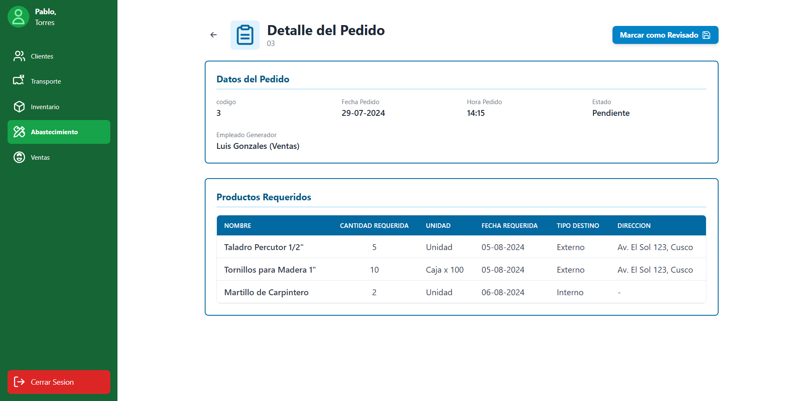 |

**Eventos:**

- Revisar Pedido de Abastecimiento:

    Cargar datos de la cabecera del pedido
    ```sql
    -- $1 es el 'cod_pedido' (ej: 3)
    SELECT
        PA.cod_pedido,
        PA.fecha_pedido,
        PA.hora_pedido,
        PA.estado_pedido,
        -- AJUSTE: Se usa USUARIO y AREA (no hay nombre de empleado)
        ('Usuario ID: ' || U.cod_usuario || ' (' || A.valor_area_usuario || ')') AS usuario_generador
    FROM
        MODULO_ABASTECIMIENTO.PEDIDO_ABASTECIMIENTO PA
    JOIN
        MODULO_ABASTECIMIENTO.USUARIO U ON PA.cod_usuario = U.cod_usuario
    JOIN
        MODULO_ABASTECIMIENTO.AREA A ON U.cod_area_usuario = A.cod_area_usuario
    WHERE
        PA.cod_pedido = $1;
    ```

    Cargar la lista de productos del pedido
    ```sql
    -- $1 es el 'cod_pedido' (ej: 3)
    SELECT
        P.nombre_producto,
        DP.cantidad_requerida,
        P.unidad_medida,
        DP.fecha_requerida,
        DP.tipo_destino,
        DP.direccion_destino_externo AS direccion
    FROM
        MODULO_ABASTECIMIENTO.DETALLE_PEDIDO DP
    JOIN
        MODULO_ABASTECIMIENTO.PRODUCTO P ON DP.cod_producto = P.cod_producto
    WHERE
        DP.cod_pedido = $1
    ORDER BY
        P.nombre_producto;
    ```

    Marcar pedido y sus detalles como 'Revisado'
    ```sql
    -- $1 es el 'cod_pedido'
    BEGIN;

    -- Paso 1: Actualizar el estado del pedido principal
    UPDATE MODULO_ABASTECIMIENTO.PEDIDO_ABASTECIMIENTO
    SET 
        estado_pedido = 'Revisado'
    WHERE 
        cod_pedido = $1 AND estado_pedido = 'Pendiente';

    -- Paso 2: Actualizar el estado de todos los items del pedido
    UPDATE MODULO_ABASTECIMIENTO.DETALLE_PEDIDO
    SET 
        estado = 'Revisado'
    WHERE 
        cod_pedido = $1 AND estado = 'Pendiente';

    COMMIT;
    ```

|Código Requerimiento |R-405|
|---|---|
|Código Interfaz| I-011 |
|Imagen Interfaz|  |

**Eventos:**

- Carga de Página:

    Se llenará la lista de todas las solicitudes de cotizacion
    ```sql
    SELECT
        SC.cod_solicitud,
        SC.fecha_emision,
        SC.estado,
        -- Contamos los productos asociados
        COUNT(DS.cod_producto) AS total_de_items
    FROM
        MODULO_ABASTECIMIENTO.SOLICITUD_COTIZACION SC
    JOIN
        -- Usamos INNER JOIN porque, una solicitud siempre tiene items.
        MODULO_ABASTECIMIENTO.DETALLE_SOLICITUD DS ON SC.cod_solicitud = DS.cod_solicitud
    GROUP BY
        SC.cod_solicitud,
        SC.fecha_emision_solicitud,
        SC.estado
    ORDER BY
        SC.fecha_emision_solicitud DESC, SC.cod_solicitud DESC;
    ```

|Código Requerimiento |R-405|
|---|---|
|Código Interfaz| I-012|
|Imagen Interfaz| 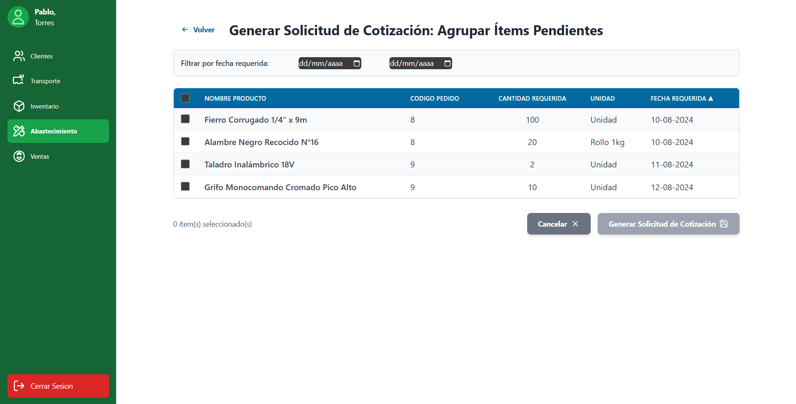 |

**Eventos:**

- Priorizar Pedidos de Abastecimiento:

    Cargar todos los items de pedidos 'Revisado'
    ```sql
    SELECT
        P.nombre_producto,
        DP.cod_pedido,
        DP.cantidad_requerida,
        P.unidad_medida,
        DP.fecha_requerida
    FROM
        MODULO_ABASTECIMIENTO.DETALLE_PEDIDO DP
    JOIN
        MODULO_ABASTECIMIENTO.PRODUCTO P ON DP.cod_producto = P.cod_producto
    WHERE
        DP.estado = 'Revisado'
    ORDER BY
        DP.fecha_requerida ASC;
    ```

    Cargar items 'Revisado' filtrados por fecha
    ```sql
    -- $1 es la fecha de inicio
    -- $2 es la fecha de fin
    SELECT
        DP.cod_pedido,
        DP.cod_producto,
        P.nombre_producto,
        DP.cantidad_requerida,
        P.unidad_medida,
        DP.fecha_requerida
    FROM
        MODULO_ABASTECIMIENTO.DETALLE_PEDIDO DP
    JOIN
        MODULO_ABASTECIMIENTO.PRODUCTO P ON DP.cod_producto = P.cod_producto
    WHERE
        DP.estado = 'Revisado'
        AND DP.fecha_requerida BETWEEN $1 AND $2
    ORDER BY
        DP.fecha_requerida ASC;
    ```

- Generar Solicitud de Cotizacion:

    Boton Generar Solicitud de Cotizacion
    ```sql
    BEGIN;
    -- =============================================================
    -- ($1 = cod_empleado del usuario logueado)
    -- =============================================================
    INSERT INTO MODULO_ABASTECIMIENTO.SOLICITUD_COTIZACION (cod_empleado)
    VALUES ($1)
    RETURNING cod_solicitud;

    -- (La aplicación captura el $NUEVO_COD_SOLICITUD)

    -- =============================================================
    -- 2. Insertar los items AGRUPADOS
    -- =============================================================

    -- (Iteración 1: Fierro)
    INSERT INTO MODULO_ABASTECIMIENTO.DETALLE_SOLICITUD (
        cod_solicitud, 
        cod_producto, 
        cantidad_solicitada
    )
    VALUES ($NUEVO_COD_SOLICITUD, 1, 150);

    -- (Iteración 2: Taladro)
    INSERT INTO MODULO_ABASTECIMIENTO.DETALLE_SOLICITUD (
        cod_solicitud, 
        cod_producto, 
        cantidad_solicitada
    )
    VALUES ($NUEVO_COD_SOLICITUD, 2, 2);
    -- ...etc.

    UPDATE MODULO_ABASTECIMIENTO.DETALLE_PEDIDO
    SET 
        estado = 'En Cotización'
    WHERE 
        estado = 'Revisado' AND
        (cod_pedido, cod_producto) IN (
            (8, 1),   -- Fierro
            (9, 2),   -- Taladro
            (9, 3),   -- Grifo
            (10, 1)   -- Otro Fierro
        );
        
    COMMIT;
    ```

|Código Requerimiento |R-406|
|---|---|
|Código Interfaz| I-013|
|Imagen Interfaz|  |

**Eventos:**

- Carga de Página:

    Se llenará la lista de todas las solicitudes de cotizacion
    ```sql
    SELECT
        SC.cod_solicitud,
        SC.fecha_emision,
        SC.estado,
        -- Contamos los productos asociados
        COUNT(DS.cod_producto) AS total_de_items
    FROM
        MODULO_ABASTECIMIENTO.SOLICITUD_COTIZACION SC
    JOIN
        -- Usamos INNER JOIN porque, una solicitud siempre tiene items.
        MODULO_ABASTECIMIENTO.DETALLE_SOLICITUD DS ON SC.cod_solicitud = DS.cod_solicitud
    GROUP BY
        SC.cod_solicitud,
        SC.fecha_emision_solicitud,
        SC.estado
    ORDER BY
        SC.fecha_emision_solicitud DESC, SC.cod_solicitud DESC;
    ```

|Código Requerimiento |R-406|
|---|---|
|Código Interfaz| I-014|
|Imagen Interfaz|  |

**Eventos:**

- Registrar Cotizaciones Recibida:
    Búsqueda de proveedores (para el dropdown)

    ```sql
    SELECT
        cod_proveedor,
        nombre_comercial
    FROM
        MODULO_ABASTECIMIENTO.PROVEEDOR
    WHERE
        nombre_comercial ILIKE $1
    ORDER BY
        nombre_comercial;
    ```

    Cargar items de la Solicitud de Cotización
    ```sql
    -- $1 es el 'cod_solicitud'
    SELECT
        P.cod_producto,
        P.nombre_producto,
        DS.cantidad_solicitada,
        P.unidad_medida
    FROM
        MODULO_ABASTECIMIENTO.DETALLE_SOLICITUD DS
    JOIN
        MODULO_ABASTECIMIENTO.PRODUCTO P ON DS.cod_producto = P.cod_producto
    WHERE
        DS.cod_solicitud = $1
    ORDER BY
        P.nombre_producto;
    ```

    Botón Gurdar Cotización
    ```sql
    -- $1 = cod_solicitud (ej: 2)
    -- $2 = cod_proveedor
    -- $3 = fecha_emision_cotizacion
    -- $4 = fecha_garantia
    -- $5 = plazo_entrega
    -- $6 = monto_total

    BEGIN;

    -- =============================================================
    -- Insertar la cabecera de la Cotización
    -- =============================================================
    INSERT INTO MODULO_ABASTECIMIENTO.COTIZACION (
        cod_proveedor,
        fecha_emision_cotizacion,
        fecha_garantia,
        plazo_entrega,
        monto_total,
        cod_solicitud 
    )
    VALUES ($2, $3, $4, $5, $6, $1)
    RETURNING cod_cotizacion;

    -- (La aplicación captura el $NUEVO_COD_COTIZACION)

    -- =============================================================
    -- Insertar los items del detalle (Bucle)
    -- =============================================================

    -- (Iteración 1: Martillo)
    -- $10 = cod_producto_1
    -- $11 = monto_total_producto_1
    -- $12 = modalidad_pago_1 (del dropdown)
    INSERT INTO MODULO_ABASTECIMIENTO.DETALLE_COTIZACION (
        cod_cotizacion,
        cod_producto,
        costo_total,
        modalidad_pago
    )
    VALUES ($NUEVO_COD_COTIZACION, $10, $11, $12);

    -- (Iteración 2: Taladro)
    -- $13 = cod_producto_2
    -- $14 = monto_total_producto_2
    -- $15 = modalidad_pago_2
    INSERT INTO MODULO_ABASTECIMIENTO.DETALLE_COTIZACION (
        cod_cotizacion,
        cod_producto,
        costo_total,
        modalidad_pago
    )
    VALUES ($NUEVO_COD_COTIZACION, $13, $14, $15);
    -- ...etc.

    -- =============================================================
    -- Actualizar el estado de la Solicitud
    -- =============================================================
    UPDATE MODULO_ABASTECIMIENTO.SOLICITUD_COTIZACION
    SET 
        estado = 'Cotizada'
    WHERE 
        cod_solicitud = $1;

    COMMIT;
    ```

|Código Requerimiento |R-407|
|---|---|
|Código Interfaz| I-015|
|Imagen Interfaz|  |

**Eventos:**

- Carga de Página:

    Se llenará la lista de todas las solicitudes de cotizacion
    ```sql
    SELECT
        SC.cod_solicitud,
        SC.fecha_emision,
        SC.estado,
        -- Contamos los productos asociados
        COUNT(DS.cod_producto) AS total_de_items
    FROM
        MODULO_ABASTECIMIENTO.SOLICITUD_COTIZACION SC
    JOIN
        -- Usamos INNER JOIN porque, una solicitud siempre tiene items.
        MODULO_ABASTECIMIENTO.DETALLE_SOLICITUD DS ON SC.cod_solicitud = DS.cod_solicitud
    GROUP BY
        SC.cod_solicitud,
        SC.fecha_emision_solicitud,
        SC.estado
    ORDER BY
        SC.fecha_emision_solicitud DESC, SC.cod_solicitud DESC;
    ```

|Código Requerimiento |R-407|
|---|---|
|Código Interfaz| I-016|
|Imagen Interfaz| 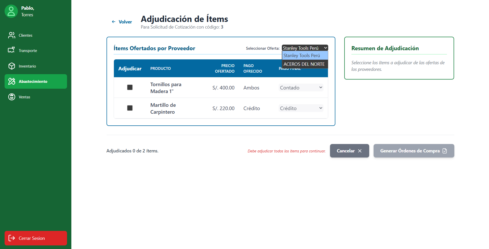 |
|Imagen Interfaz|  |

**Eventos:**

- Evaluar Cotizaciones y Generar Órdenes de Compra:

    Cargar el detalle de la oferta de UN proveedor
    ```sql
    -- $1 es el 'cod_solicitud'
    -- $2 es el 'cod_proveedor'
    SELECT
        -- IDs Ocultos (cruciales para generar la OC)
        P.cod_producto,
        C.cod_cotizacion,
        DS.cantidad_solicitada,

        -- Columnas Visibles
        P.nombre_producto,
        DC.costo_total AS precio_ofertado,
        DC.modalidad_pago AS pago_ofrecido
    FROM
        MODULO_ABASTECIMIENTO.DETALLE_COTIZACION DC
    JOIN
        MODULO_ABASTECIMIENTO.COTIZACION C ON DC.cod_cotizacion = C.cod_cotizacion
    JOIN
        MODULO_ABASTECIMIENTO.PRODUCTO P ON DC.cod_producto = P.cod_producto
    JOIN
        MODULO_ABASTECIMIENTO.DETALLE_SOLICITUD DS ON C.cod_solicitud = DS.cod_solicitud AND P.cod_producto = DS.cod_producto
    WHERE
        C.cod_solicitud = $1 AND C.cod_proveedor = $2
    ORDER BY
        P.nombre_producto;
    ```

    Generarción de OCs Necesarias
    ```sql
    -- $1 = cod_solicitud
    BEGIN;

    -- =============================================================
    -- BUCLE EN LA APLICACIÓN
    -- =============================================================

    -- (Iteración 1: OC para Stanley, Contado)
    INSERT INTO MODULO_ABASTECIMIENTO.ORDEN_COMPRA (
        monto, 
        modalidad_pago, 
        cod_cotizacion
    )
    VALUES ($MONTO_TOTAL_OC_1, 'Contado', $COD_COTIZACION_1)
    RETURNING cod_orden;

    -- (App captura $NUEVO_COD_ORDEN_1)
    INSERT INTO MODULO_ABASTECIMIENTO.DETALLE_OC (
        cod_orden, 
        cod_producto, 
        cantidad_comprada, 
        costo_total
    )
    VALUES ($NUEVO_COD_ORDEN_1, $COD_PROD_A, $CANT_A, $COSTO_A);

    -- (Iteración 2: OC para Stanley, Crédito)
    INSERT INTO MODULO_ABASTECIMIENTO.ORDEN_COMPRA (
        monto, 
        modalidad_pago, 
        cod_cotizacion
    )
    VALUES ($MONTO_TOTAL_OC_2, 'Crédito', $COD_COTIZACION_1)
    RETURNING cod_orden;

    -- (App captura $NUEVO_COD_ORDEN_2)
    INSERT INTO MODULO_ABASTECIMIENTO.DETALLE_OC (
        cod_orden, 
        cod_producto, 
        cantidad_comprada, 
        costo_total
    )
    VALUES ($NUEVO_COD_ORDEN_2, $COD_PROD_B, $CANT_B, $COSTO_B);
    -- (Fin Bucle de items de OC 2)

    -- (Iteración 3: OC para Aceros, Contado) ... y así sucesivamente ...
    ```
    
    Actualizar el estado de la Solicitud y pedidos internos
    ```sql
    UPDATE MODULO_ABASTECIMIENTO.SOLICITUD_COTIZACION
    SET 
        estado = 'Adjudicada'
    WHERE 
        cod_solicitud = $1;
 
    UPDATE MODULO_ABASTECIMIENTO.DETALLE_PEDIDO
    SET 
        estado = 'Adjudicado'
    WHERE 
        (cod_pedido, cod_producto) IN (
            (8, 1), (9, 2), (10, 1), ... 
        );

    COMMIT;
    ```

|Código Requerimiento |R-408|
|---|---|
|Código Interfaz| I-018|
|Imagen Interfaz|  |
- Carga de Página:

    Se llenará la lista de todas las ordenes de compra

    ```sql
    SELECT
        OC.cod_orden,
        P.nombre_comercial AS proveedor,
        OC.fecha_emision,
        OC.monto,
        OC.estado,
        MC.estado AS estado_monitoreo
    FROM
        MODULO_ABASTECIMIENTO.ORDEN_COMPRA OC
    JOIN
        MODULO_ABASTECIMIENTO.COTIZACION COT ON OC.cod_cotizacion = COT.cod_cotizacion
    JOIN
        MODULO_ABASTECIMIENTO.PROVEEDOR P ON COT.cod_proveedor = P.cod_proveedor
    LEFT JOIN
        MODULO_ABASTECIMIENTO.MONITOREO_COMPRA MC ON OC.cod_orden = MC.cod_orden
    ORDER BY
        OC.fecha_emision DESC, OC.cod_orden DESC;
    ```

|Código Requerimiento |R-408|
|---|---|
|Código Interfaz| I-019|
|Imagen Interfaz| 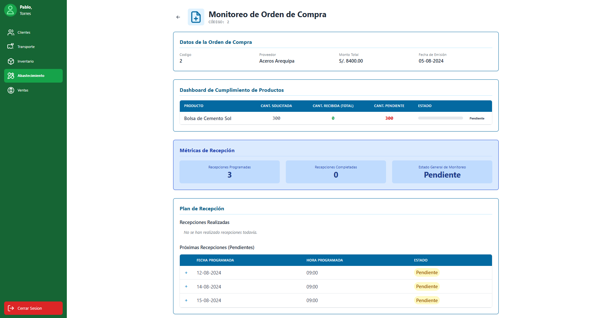 |

**Eventos:**

- Monitorear una orden de Compra:

    Cargar datos de la cabecera de la OC
    ```sql
    -- $1 es el 'cod_orden' (ej: 1)
    SELECT
        OC.cod_orden,
        P.nombre_comercial AS proveedor,
        OC.monto,
        OC.fecha_emision
    FROM
        MODULO_ABASTECIMIENTO.ORDEN_COMPRA OC
    JOIN
        MODULO_ABASTECIMIENTO.COTIZACION COT ON OC.cod_cotizacion = COT.cod_cotizacion
    JOIN
        MODULO_ABASTECIMIENTO.PROVEEDOR P ON COT.cod_proveedor = P.cod_proveedor
    WHERE
        OC.cod_orden = $1;
    ```


    Calcular el cumplimiento de productos
    ```sql
    -- $1 es el 'cod_orden'
    SELECT
        P.nombre_producto,
        DOC.cantidad_comprada AS cant_solicitada,
        
        -- Suma la 'cantidad_conforme' de todas las recepciones finalizadas
        COALESCE(SUM(DR.cantidad_conforme), 0) AS cant_recibida_total,
        
        -- Calcula lo pendiente
        (DOC.cantidad_comprada - COALESCE(SUM(DR.cantidad_conforme), 0)) AS cant_pendiente,
        
        -- Calcula el estado del item
        CASE
            WHEN COALESCE(SUM(DR.cantidad_conforme), 0) = 0 THEN 'Pendiente'
            WHEN COALESCE(SUM(DR.cantidad_conforme), 0) < DOC.cantidad_comprada THEN 'Recepción Parcial'
            WHEN COALESCE(SUM(DR.cantidad_conforme), 0) >= DOC.cantidad_comprada THEN 'Completado'
        END AS estado
    FROM
        MODULO_ABASTECIMIENTO.DETALLE_OC DOC
    JOIN
        MODULO_ABASTECIMIENTO.PRODUCTO P ON DOC.cod_producto = P.cod_producto
    LEFT JOIN
        -- Une con las recepciones de ESTA orden
        MODULO_ABASTECIMIENTO.RECEPCION R ON DOC.cod_orden = R.cod_orden
            -- Solo contamos recepciones que ya terminaron
            AND R.estado_recepcion = 'Finalizada' 
    LEFT JOIN
        -- Une con el detalle de recepción para el producto correcto
        MODULO_ABASTECIMIENTO.DETALLE_RECEPCION DR ON R.cod_recepcion = DR.cod_recepcion
            AND DOC.cod_producto = DR.cod_producto
    WHERE
        DOC.cod_orden = $1
    GROUP BY
        P.nombre_producto, DOC.cantidad_comprada;
    ```
    
    Cargar recepciones 'Realizadas'
    ```sql
    -- $1 es el 'cod_orden'
    SELECT
        fecha_programada,
        hora_programada,
        estado_recepcion
    FROM
        MODULO_ABASTECIMIENTO.RECEPCION
    WHERE
        cod_orden = $1
        AND estado_recepcion IN ('Finalizada', 'Con Reclamo')
    ORDER BY
        fecha_programada;
    ```

    Cargar auditoría de una recepción FINALIZADA
    ```sql
    -- $1 es el 'cod_recepcion' de la fila clickeada
    SELECT
        P.nombre_producto,
        DR.cantidad_programada,
        DR.cantidad_recibida,
        -- Calculamos el estado de calidad
        CASE
            WHEN DR.cantidad_defectuosa = 0 THEN 'Conforme'
            ELSE 'No Conforme'
        END AS estado_calidad
    FROM
        MODULO_ABASTECIMIENTO.DETALLE_RECEPCION DR
    JOIN
        MODULO_ABASTECIMIENTO.PRODUCTO P ON DR.cod_producto = P.cod_producto
    WHERE
        DR.cod_recepcion = $1
    ORDER BY
        P.nombre_producto;
    ```

    Cargar recepciones 'Pendientes'
    ```sql
    -- $1 es el 'cod_orden'
    SELECT
        fecha_programada,
        hora_programada,
        estado_recepcion
    FROM
        MODULO_ABASTECIMIENTO.RECEPCION
    WHERE
        cod_orden = $1
        AND estado_recepcion IN ('Programada', 'En Curso')
    ORDER BY
        fecha_programada;
    ```

    Cargar detalle de una recepción PROGRAMADA
    ```sql
    -- $1 es el 'cod_recepcion' de la fila clickeada
    SELECT
        P.nombre_producto,
        DR.cantidad_programada,
        P.unidad_medida
    FROM
        MODULO_ABASTECIMIENTO.DETALLE_RECEPCION DR
    JOIN
        MODULO_ABASTECIMIENTO.PRODUCTO P ON DR.cod_producto = P.cod_producto
    WHERE
        DR.cod_recepcion = $1
    ORDER BY
        P.nombre_producto;
    ```

|Código Requerimiento |R-410|
|---|---|
|Código Interfaz| I-019|
|Imagen Interfaz| 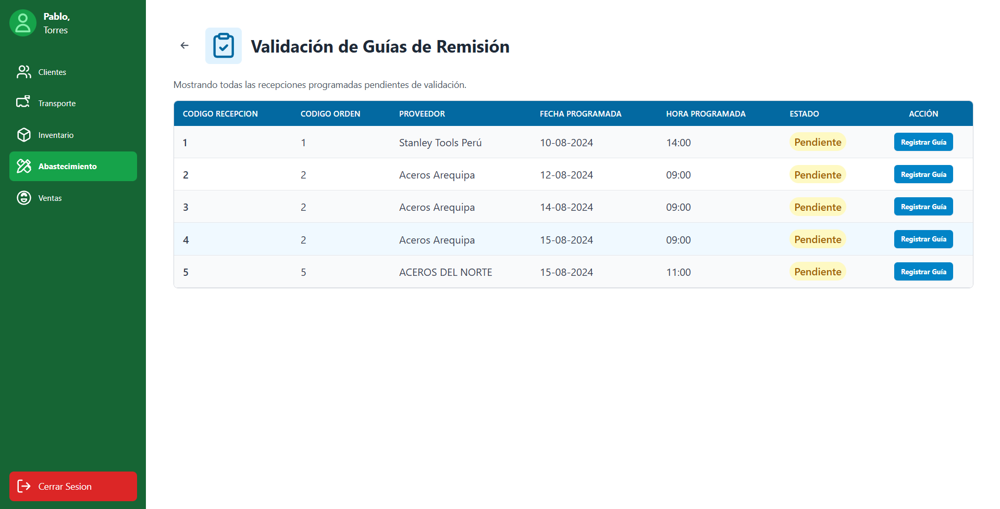 |

**Eventos:**

- Carga de Página:

    Listar todas las recepciones pendientes de validación
    ```sql
    SELECT
        R.cod_recepcion,
        R.cod_orden,
        P.nombre_comercial AS proveedor,
        R.fecha_programada,
        R.hora_programada,
        R.estado_recepcion AS estado
    FROM
        MODULO_ABASTECIMIENTO.RECEPCION R
    JOIN
        MODULO_ABASTECIMIENTO.ORDEN_COMPRA OC ON R.cod_orden = OC.cod_orden
    JOIN
        MODULO_ABASTECIMIENTO.COTIZACION COT ON OC.cod_cotizacion = COT.cod_cotizacion
    JOIN
        MODULO_ABASTECIMIENTO.PROVEEDOR P ON COT.cod_proveedor = P.cod_proveedor
    WHERE
        R.estado_recepcion = 'Programada'
    ORDER BY
        R.fecha_programada ASC, R.hora_programada ASC;
    ```

|Código Requerimiento |R-410|
|---|---|
|Código Interfaz| I-020|
|Imagen Interfaz| 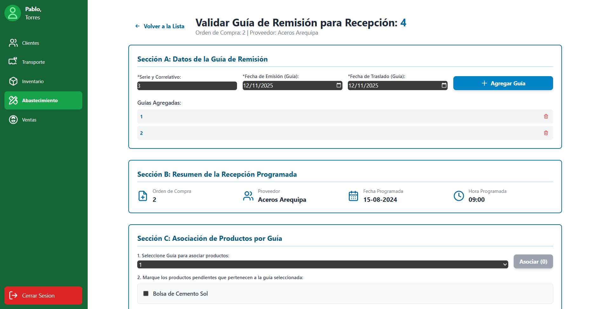 |
|Imagen Interfaz| 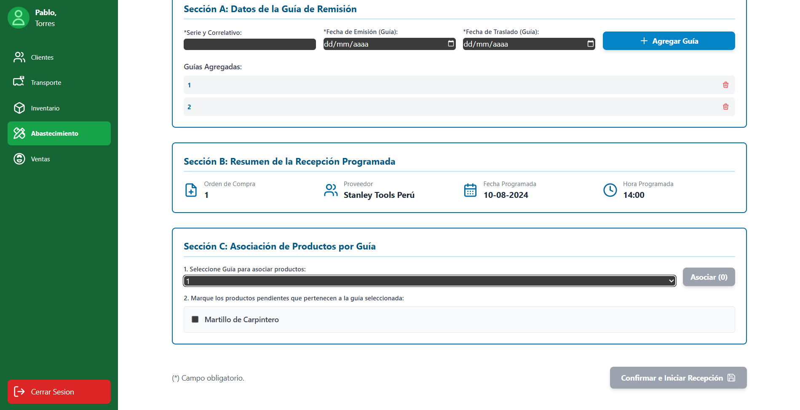 |

**Eventos:**

- Validar Guía de Remisión:

    Cargar resumen de la recepción
    ```sql
    -- $1 es el 'cod_recepcion' actual (ej: 4)
    SELECT
        R.cod_orden,
        P.nombre_comercial AS proveedor,
        R.fecha_programada,
        R.hora_programada
    FROM
        MODULO_ABASTECIMIENTO.RECEPCION R
    JOIN
        MODULO_ABASTECIMIENTO.ORDEN_COMPRA OC ON R.cod_orden = OC.cod_orden
    JOIN
        MODULO_ABASTECIMIENTO.COTIZACION COT ON OC.cod_cotizacion = COT.cod_cotizacion
    JOIN
        MODULO_ABASTECIMIENTO.PROVEEDOR P ON COT.cod_proveedor = P.cod_proveedor
    WHERE
        R.cod_recepcion = $1;
    ```

    Cargar "master list" de productos programados
    ```sql
    -- $1 es el 'cod_recepcion' actual (4)
    SELECT
        -- ID Clave para vincular incidencias
        DR.cod_detalle_recepcion, 
        
        P.cod_producto,
        P.nombre_producto,
        P.unidad_medida,
        DR.cantidad_programada
    FROM
        MODULO_ABASTECIMIENTO.DETALLE_RECEPCION DR
    JOIN
        MODULO_ABASTECIMIENTO.PRODUCTO P ON DR.cod_producto = P.cod_producto
    WHERE
        DR.cod_recepcion = $1;
    ```

    Registrar una nueva Guía de Remisión
    ```sql
    -- $1 = 'Serie y Correlativo' (ej: 'F001-8')
    -- $2 = 'Fecha de Emisión'
    -- $3 = 'Fecha de Traslado'
    -- $4 = $COD_RECEPCION_ACTUAL
    INSERT INTO MODULO_ABASTECIMIENTO.GUIA_REMISION (
        serie_correlativo,
        fecha_emision_guia,
        fecha_traslado_guia,
        cod_recepcion
    )
    VALUES ($1, $2, $3, $4);
    ```

    Transacción Final de Validación de Guías
    ```sql
    BEGIN;

    -- =============================================================
    -- Poner la Recepción "En Curso"
    -- ($1 = $COD_RECEPCION_ACTUAL)
    -- =============================================================
    UPDATE MODULO_ABASTECIMIENTO.RECEPCION
    SET 
        estado_recepcion = 'En Curso',
        Registrar cuándo se inició esta validación
        hora_inicio_recepcion = CURRENT_TIME 
    WHERE 
        cod_recepcion = $1;

    -- =============================================================
    -- 2. Guardar Detalles de Guía e Incidencias
    -- (La app hace un bucle por CADA producto en CADA guía en la Sección D)
    -- =============================================================

    -- (Iteración 1: Tornillos, Guía 1)
    -- $10 = 'F001-8' (Serie de la Guía 1)
    -- $11 = 50 (cod_producto de Tornillos)
    -- $12 = 39 (cantidad_guia ingresada)
    INSERT INTO MODULO_ABASTECIMIENTO.DETALLE_GUIA 
        (serie_correlativo, cod_producto, cantidad_guia)
    VALUES ($10, $11, $12);

    -- (Condicional en la App: Se reportó incidencia para Tornillos)
    -- $13 = 'CANTIDAD_GUIA'
    -- $14 = 1 (La diferencia entre 40 y 39)
    -- $15 = 'La guía reporta 39, pero se programaron 40'
    -- $16 = 101 (el cod_detalle_recepcion de Tornillos, de la Query 2)
    INSERT INTO MODULO_ABASTECIMIENTO.INCIDENCIA (
        tipo_incidencia, 
        cantidad_incidencia, 
        descripcion_incidencia, 
        cod_detalle_recepcion
    )
    VALUES ($13, $14, $15, $16);
    -- (Fin Iteración 1)


    -- (Iteración 2: Martillo, Guía 1)
    -- $17 = 'F001-8' (Serie de la Guía 1)
    -- $18 = 51 (cod_producto de Martillo)
    -- $19 = 10 (cantidad_guia ingresada)
    INSERT INTO MODULO_ABASTECIMIENTO.DETALLE_GUIA 
        (serie_correlativo, cod_producto, cantidad_guia)
    VALUES ($17, $18, $19);
    -- (No hay incidencia para este)
    -- (Fin Iteración 2)


    -- (Iteración 3: Taladro, Guía 2) ... y así sucesivamente ...

    COMMIT;
    ```

|Código Requerimiento |R-411|
|---|---|
|Código Interfaz| I-021|
|Imagen Interfaz| 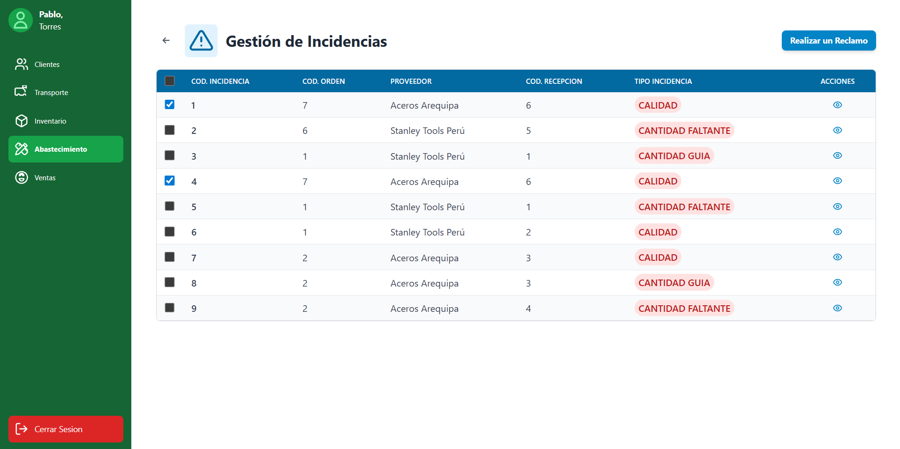 |

**Eventos:**

- Carga de Página:

    Listar todas las incidencias pendientes de reclamo asociadas a una recepción
    ```sql
    SELECT
        I.cod_incidencia,
        R.cod_orden,
        P.nombre_comercial AS proveedor,
        R.cod_recepcion,
        I.tipo_incidencia
    FROM
        MODULO_ABASTECIMIENTO.INCIDENCIA AS I
    JOIN
        MODULO_ABASTECIMIENTO.DETALLE_RECEPCION AS DR 
        ON I.cod_detalle_recepcion = DR.cod_detalle_recepcion
    JOIN
        MODULO_ABASTECIMIENTO.RECEPCION AS R 
        ON DR.cod_recepcion = R.cod_recepcion
    JOIN
        MODULO_ABASTECIMIENTO.ORDEN_COMPRA AS OC 
        ON R.cod_orden = OC.cod_orden
    JOIN
        MODULO_ABASTECIMIENTO.COTIZACION AS COT 
        ON OC.cod_cotizacion = COT.cod_cotizacion
    JOIN
        MODULO_ABASTECIMIENTO.PROVEEDOR AS P 
        ON COT.cod_proveedor = P.cod_proveedor
    WHERE
        I.estado_incidencia = 'Pendiente'
    ORDER BY
        I.cod_incidencia ASC;
    ```

|Código Requerimiento |R-411|
|---|---|
|Código Interfaz| I-022|
|Imagen Interfaz| 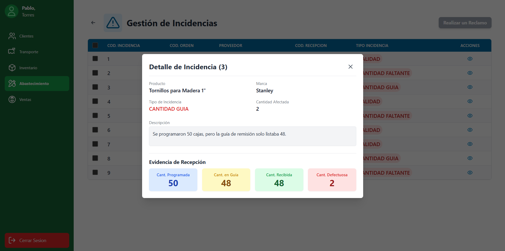 |

**Eventos:**

- Carga el detalle completo de UNA incidencia:

    ```sql
    -- $1 es el 'cod_incidencia' de la fila (ej: 3)
    SELECT
        -- Bloque 1: Datos del Producto
        P.nombre_producto,
        P.marca,
        
        -- Bloque 2: Datos de la Incidencia
        I.tipo_incidencia,
        I.cantidad_incidencia AS cantidad_afectada,
        
        -- Bloque 3: Descripción
        I.descripcion_incidencia,
        
        -- Bloque 4: "Evidencia de Recepción"
        DR.cantidad_programada,
        COALESCE(SUM(DG.cantidad_guia), 0) AS cantidad_en_guia,
        DR.cantidad_recibida,
        DR.cantidad_defectuosa
    FROM
        MODULO_ABASTECIMIENTO.INCIDENCIA I
    JOIN
        MODULO_ABASTECIMIENTO.DETALLE_RECEPCION DR 
            ON I.cod_detalle_recepcion = DR.cod_detalle_recepcion
    JOIN
        MODULO_ABASTECIMIENTO.PRODUCTO P 
            ON DR.cod_producto = P.cod_producto
    JOIN
        MODULO_ABASTECIMIENTO.RECEPCION R 
            ON DR.cod_recepcion = R.cod_recepcion
    LEFT JOIN
        MODULO_ABASTECIMIENTO.GUIA_REMISION GR 
            ON R.cod_recepcion = GR.cod_recepcion
    LEFT JOIN
        MODULO_ABASTECIMIENTO.DETALLE_GUIA DG 
            ON GR.serie_correlativo = DG.serie_correlativo 
            AND P.cod_producto = DG.cod_producto
    WHERE
        I.cod_incidencia = $1
    GROUP BY
        P.nombre_producto,
        P.marca,
        I.tipo_incidencia,
        I.cantidad_incidencia,
        I.descripcion_incidencia,
        DR.cantidad_programada,
        DR.cantidad_recibida,
        DR.cantidad_defectuosa;
    ```

|Código Requerimiento |R-411|
|---|---|
|Código Interfaz| I-023|
|Imagen Interfaz| 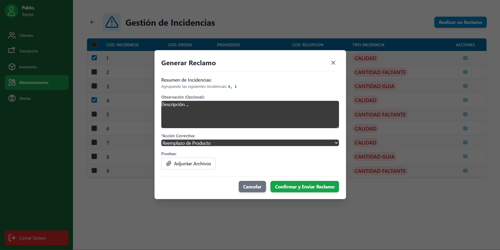 |

**Eventos:**

- Generar un Reclamo agrupado

    ```sql
    -- $1 = 'Observacion (Opcional)'
    -- $2 = 'Acción Correctiva' (ej: 'Reemplazo de Producto')

    BEGIN;

    INSERT INTO MODULO_ABASTECIMIENTO.RECLAMO (
        observacion_reclamo,
        accion_correctiva
    )
    VALUES ($1, $2)
    RETURNING cod_reclamo;

    -- (La aplicación captura el $NUEVO_COD_RECLAMO)

    UPDATE MODULO_ABASTECIMIENTO.INCIDENCIA
    SET 
        estado_incidencia = 'En Reclamo',
        cod_reclamo = $NUEVO_COD_RECLAMO
    WHERE 
        -- La app pone aquí los IDs seleccionados de los productos(ej: [1, 4])
        cod_incidencia IN (1, 4); 

    COMMIT;
    ```

---

[⬅️ Anterior](../9.1.3/9.1.3.md) | [🏠 Home](../../../README.md) | [Siguiente ➡️](../9.1.5/9.1.5.md)
