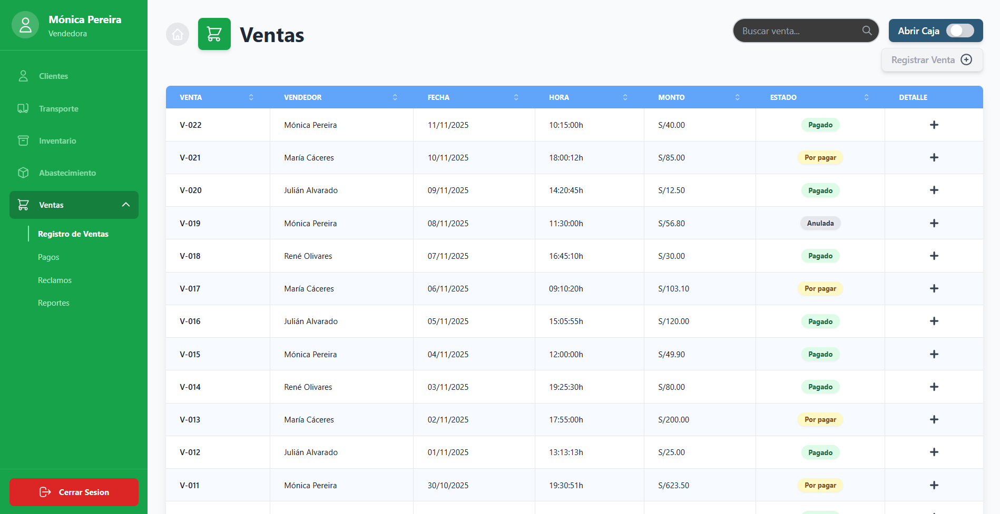
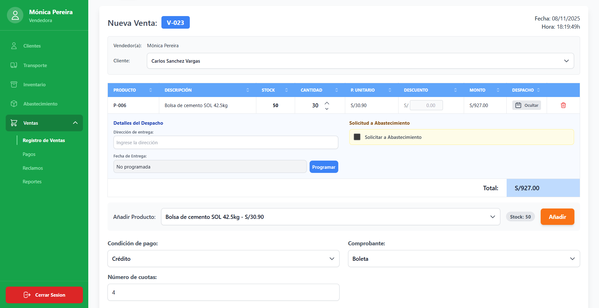
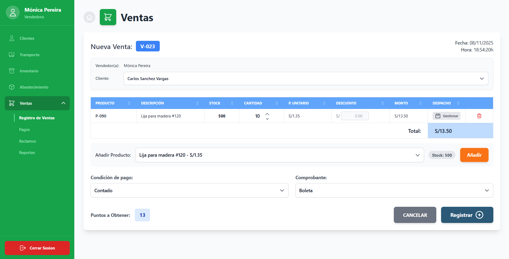
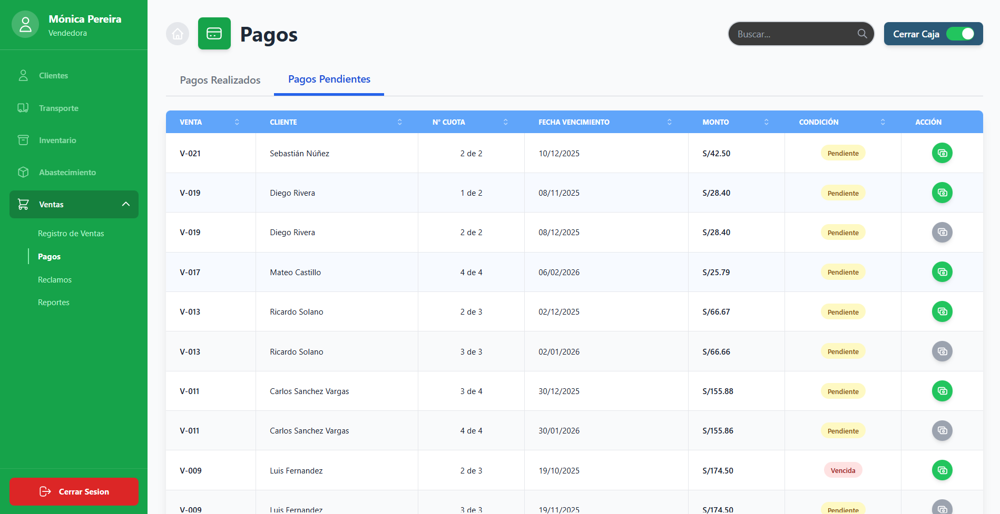
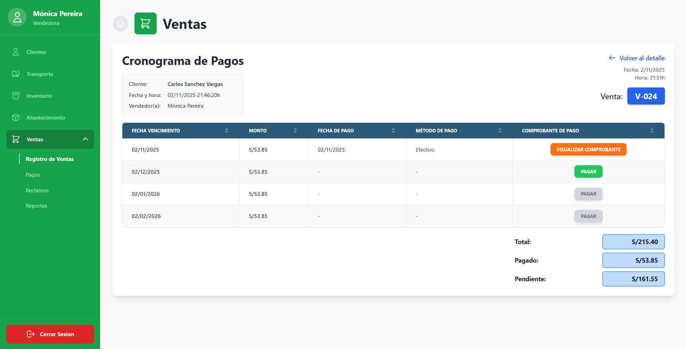
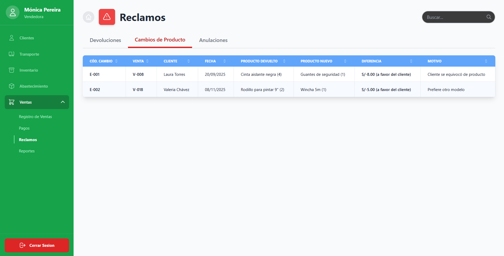
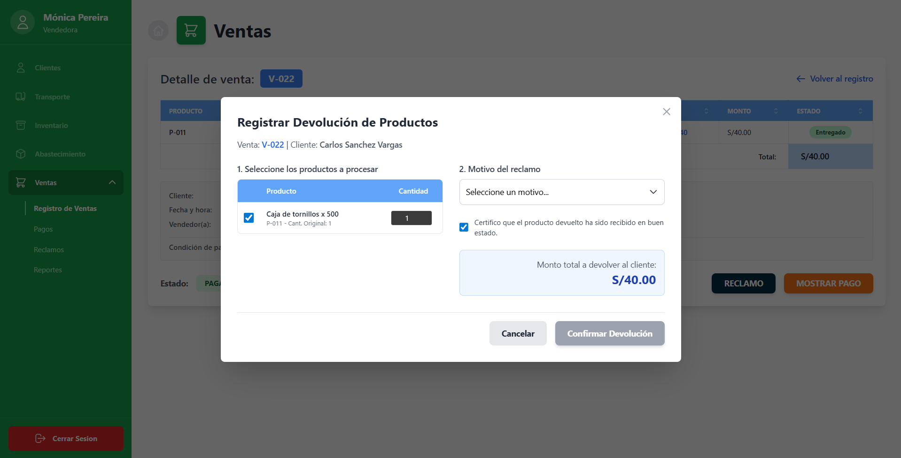
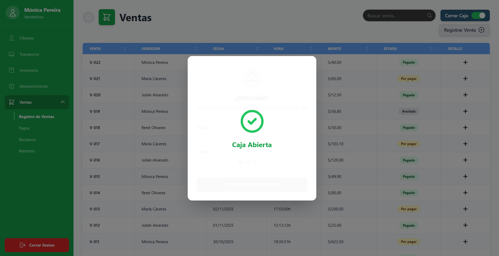
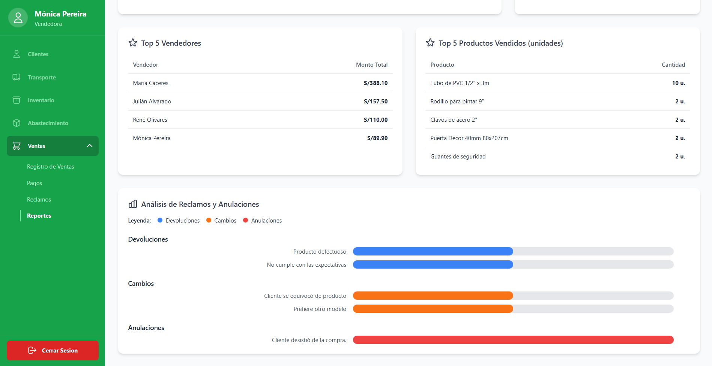

> [9. Preparación para Implementación](../../9.md) › [9.1. Sentencias SQL por módulo / prototipo](../9.1.md) › [9.1.5. Módulo 5 / Integrante 5](9.1.5.md)

# 9.1.1. Módulo 5: Ventas


## Sentencias SQL por cada prototipo 𝄜

|Código Requerimiento |R-501|
|---|---|
|Código Interfaz| I-060|
|Imagen Interfaz|  |

- Registro de Ventas
``` sql
SELECT v.cod_venta_fmt venta, p.nombre_persona vendedor, date(v.fecha_hora_venta) fecha, 
to_char(v.fecha_hora_venta, 'HH24:MI:SS') hora,
'S/ ' || TO_CHAR(v.monto_venta, 'FM999,999,999,999.00') monto, ev.descp_estado_venta estado
FROM venta v
INNER JOIN vendedor ve
ON v.cod_vendedor = ve.cod_vendedor
JOIN usuario u
ON u.cod_usuario = ve.cod_usuario
JOIN persona p
ON p.cod_persona = u.cod_persona
INNER JOIN estado_venta ev 
ON ev.cod_estado_venta = v.cod_estado_venta;
```

---

|Código Requerimiento |R-502, R-503|
|---|---|
|Código Interfaz| I-061|
|Imagen Interfaz|  |

- Desplegable de Clientes
``` sql
SELECT p.nombre_persona from clientes c
LEFT JOIN persona p
ON p.cod_persona = c.cod_persona
```
- Desplegable de Productos
``` sql
SELECT nombre_producto from producto
```
- Desplegable de Condición de Pago
``` sql
select descp_cond_pago from condicion_pago
```
- Desplegable de Comprobante
``` sql
SELECT descp_tipo_comprobante from tipo_comprobante
```

- Registro de Venta a Crédito o al Contado
``` sql
--Funcion: Obtener ultima venta
CREATE OR REPLACE FUNCTION ultima_venta() 
RETURNS INTEGER
LANGUAGE SQL
AS 
$$
SELECT max(cod_venta) FROM venta;
$$;

--Funcion: Obtener precio_venta
CREATE OR REPLACE FUNCTION precio_unitario(p_cod_producto integer) 
RETURNS numeric(12,2)
LANGUAGE SQL
AS 
$$
SELECT precio_venta FROM producto WHERE cod_producto = p_cod_producto;
$$;

--Funcion: Obtener puntos_producto
CREATE OR REPLACE FUNCTION puntos_producto(p_cod_producto integer) 
RETURNS numeric(12,2)
LANGUAGE SQL
AS 
$$
SELECT puntos_producto FROM producto WHERE cod_producto = p_cod_producto;
$$;

--Funcion: Obtener monto total de venta
CREATE OR REPLACE FUNCTION calcular_monto_venta(p_cod_venta integer) 
RETURNS numeric(12,2)
LANGUAGE SQL
AS 
$$
SELECT 
SUM(monto_unitario)
FROM producto_venta pv
GROUP BY pv.cod_venta
HAVING pv.cod_venta=p_cod_venta;
$$;

--Funcion: Obtener puntos totales de venta
CREATE OR REPLACE FUNCTION calcular_puntos_venta(p_cod_venta integer) 
RETURNS numeric(12,2)
LANGUAGE SQL
AS 
$$
SELECT 
SUM(puntos_unitario)
FROM producto_venta pv
GROUP BY pv.cod_venta
HAVING pv.cod_venta=p_cod_venta;
$$;

--Funcion: Obtener descuento total venta
CREATE OR REPLACE FUNCTION calcular_dscto_venta(p_cod_venta integer) 
RETURNS numeric(12,2)
LANGUAGE SQL
AS 
$$
SELECT 
SUM(descuento_unitario)
FROM producto_venta pv
GROUP BY pv.cod_venta
HAVING pv.cod_venta=p_cod_venta;
$$;

--Funcion: Obtener igv total venta
CREATE OR REPLACE FUNCTION calcular_igv_venta(p_cod_venta integer) 
RETURNS numeric(12,2)
LANGUAGE SQL
AS 
$$
SELECT 
SUM(monto_unitario)*0.18
FROM producto_venta pv
GROUP BY pv.cod_venta
HAVING pv.cod_venta=p_cod_venta;
$$;

--Crear venta
INSERT INTO venta (monto_venta,igv, descuento, puntos_venta, 
cod_estado_venta, cod_cond_pago, nro_cuotas, cod_cliente, cod_vendedor) VALUES
(0,0,0,0,2,2,4,1,1);

--Crear ítems de venta
INSERT INTO producto_venta (cod_venta, cod_producto, cantidad_producto, precio_unitario,
descuento_unitario, monto_unitario, puntos_unitario, cod_estado_prodv, direccion_entrega, fecha_entrega)
VALUES 
(ultima_venta(), 1, 20, precio_unitario(1), 0, precio_unitario(1)*20, puntos_producto(1)*20, 
1, 'Av. La Marina 2345 - San Miguel', '2025-11-12'),
(ultima_venta(), 5, 40, precio_unitario(5), 0, precio_unitario(5)*40, puntos_producto(5)*40, 
1, 'Av. La Marina 2345 - San Miguel', '2025-11-12'),
(ultima_venta(), 6, 30, precio_unitario(6), 0, precio_unitario(6)*30, puntos_producto(6)*30, 
1, 'Jr. Murillo 234 - Surco', '2025-11-12'),
(ultima_venta(), 2, 10, precio_unitario(2), 0, precio_unitario(2)*10, puntos_producto(2)*10, 
1, 'Calle Los Jazmínes 923 - Miraflores', '2025-11-14'),
(ultima_venta(), 12, 15, precio_unitario(12), 0, precio_unitario(12)*15, puntos_producto(12)*15, 
1, 'Calle Los Jazmínes 923 - Miraflores', '2025-11-14');

--Actualizar totales venta
UPDATE venta SET monto_venta = calcular_monto_venta(ultima_venta()),
igv = calcular_igv_venta(ultima_venta()),
descuento = calcular_dscto_venta(ultima_venta()),
puntos_venta = calcular_puntos_venta(ultima_venta())
WHERE cod_venta = ultima_venta();

--Actualizar ventas por vendedor
UPDATE vendedor SET total_ventas_vendedor =+ 1 WHERE cod_vendedor = 1;

--Funcion: Obtener primer pago
CREATE OR REPLACE FUNCTION primer_pago(p_cod_venta integer)
RETURNS numeric(12,2)
LANGUAGE plpgsql
AS $$
DECLARE
  v_pago    numeric(12,2);
  v_total   numeric(12,2); 
  v_ncuotas int;
BEGIN
  SELECT ROUND(p.monto_pago, 2)
  INTO   v_pago
  FROM pago p
  JOIN estado_pago ep ON ep.cod_estado_pago = p.cod_estado_pago
  WHERE p.cod_venta = p_cod_venta
    AND p.nro_cuota = 1
    AND lower(ep.nombre_estado_pago) = 'pagado'
  ORDER BY p.fecha_pago DESC NULLS LAST
  LIMIT 1;
  IF v_pago IS NOT NULL THEN
    RETURN v_pago;
  END IF;
  SELECT ROUND(monto_venta, 2), nro_cuotas
  INTO   v_total, v_ncuotas
  FROM venta
  WHERE cod_venta = p_cod_venta;

  IF v_total IS NULL THEN
    RAISE EXCEPTION 'Venta % no encontrada', p_cod_venta;
  END IF;

  IF v_ncuotas IS NULL OR v_ncuotas <= 0 THEN
    RAISE EXCEPTION 'Venta % con nro_cuotas inválido: %', p_cod_venta, v_ncuotas;
  END IF;

  RETURN ROUND( v_total / NULLIF(v_ncuotas, 0), 2 );
END
$$;

--Ingresar comprobante
INSERT INTO comprobante (cod_tipo_comprobante, nro_comprobante, fecha_emision)
VALUES (1,'BOL-00001293',now());

--Funcion: Obtener ultimo comprobante
CREATE OR REPLACE FUNCTION ultimo_comprobante() 
RETURNS integer
LANGUAGE SQL
AS 
$$
SELECT max(cod_comprobante) from comprobante;
$$;

--Ingresar primer pago (pago único si es a contado)
INSERT INTO pago (cod_venta, nro_cuota, monto_pago, fecha_vencimiento_pago, 
fecha_pago, nombre_pagador, nro_telf_pagador, cod_caja, cod_comprobante, cod_estado_pago,
cod_metodo_pago)
VALUES (ultima_venta(), 1, primer_pago(ultima_venta()), current_date, current_date, NULL, NULL, 
ultima_caja(),ultimo_comprobante(), 2, 1);


--Función: Obtener cuotas para compras a crédito
CREATE OR REPLACE FUNCTION generar_pagos_restantes(p_cod_venta integer)
RETURNS void
LANGUAGE plpgsql
AS $$
DECLARE
  v_fecha           timestamp;
  v_nro_cuotas      int;
  v_total           numeric(12,2);  
  v_pagado_cuota1   numeric(12,2);  
  v_restante        numeric(12,2);  
  v_base            numeric(12,2);  
  v_remanente       numeric(12,2);  
  v_cent            int;            
  v_i               int;
  v_monto_i         numeric(12,2);
  ep_pendiente      int;
BEGIN
  SELECT v.fecha_hora_venta,
         v.nro_cuotas,
         ROUND(v.monto_venta, 2)
  INTO   v_fecha, v_nro_cuotas, v_total
  FROM venta v
  WHERE v.cod_venta = p_cod_venta;
  IF v_fecha IS NULL THEN
    RAISE EXCEPTION 'Venta % no encontrada', p_cod_venta;
  END IF;
  IF v_nro_cuotas IS NULL OR v_nro_cuotas <= 1 THEN
    RETURN;
  END IF;
  SELECT COALESCE(primer_pago(p_cod_venta), 0)
  INTO   v_pagado_cuota1;
  v_restante := ROUND(v_total - v_pagado_cuota1, 2);
  IF v_restante < 0 THEN
    RAISE EXCEPTION 'Venta %: la 1ª cuota (%s) excede el total pactado (%s).',
      p_cod_venta, v_pagado_cuota1, v_total;
  END IF;
  SELECT min(cod_estado_pago) INTO ep_pendiente
  FROM estado_pago
  WHERE lower(nombre_estado_pago) = 'pendiente';

  v_base := TRUNC(v_restante / (v_nro_cuotas - 1), 2);
  v_remanente := ROUND(v_restante - v_base * (v_nro_cuotas - 1), 2);
  v_cent      := ROUND(v_remanente * 100)::int;

  FOR v_i IN 2..v_nro_cuotas LOOP
    IF v_cent > 0 THEN
      v_monto_i := v_base + 0.01; v_cent := v_cent - 1;
    ELSIF v_cent < 0 THEN
      v_monto_i := v_base - 0.01; v_cent := v_cent + 1;
    ELSE
      v_monto_i := v_base;
    END IF;
    v_monto_i := ROUND(v_monto_i, 2);
    INSERT INTO pago (
      cod_venta, nro_cuota, monto_pago,
      fecha_vencimiento_pago, fecha_pago,
      cod_estado_pago, cod_caja
    )
    SELECT p_cod_venta, v_i, v_monto_i,
           (v_fecha::date + (v_i-1) * interval '1 month')::date,
           NULL,
           ep_pendiente, NULL
    WHERE NOT EXISTS (
      SELECT 1 FROM pago WHERE cod_venta = p_cod_venta AND nro_cuota = v_i
    );
  END LOOP;
  IF v_cent <> 0 THEN
    UPDATE pago
    SET monto_pago = ROUND(monto_pago + (v_cent::numeric / 100.0), 2)
    WHERE cod_venta = p_cod_venta
      AND nro_cuota = v_nro_cuotas;
  END IF;
END
$$;
SELECT generar_pagos_restantes(ultima_venta());
```
---

|Código Requerimiento |R-504|
|---|---|
|Código Interfaz| I-062|
|Imagen Interfaz| |

- Ver pagos realizados
``` sql
SELECT v.cod_venta_fmt venta, p.nro_cuota || ' de ' || v.nro_cuotas cuota,
date(p.fecha_pago) fecha, 'S/. ' || p.monto_pago monto FROM pago p
LEFT JOIN venta v 
ON v.cod_venta = p.cod_venta
WHERE fecha_pago IS NOT NULL
ORDER BY p.cod_pago;
```

---

|Código Requerimiento |R-504|
|---|---|
|Código Interfaz| I-063|
|Imagen Interfaz| |

- Ver pagos pendientes
``` sql
SELECT p.cod_pago_fmt pago, p2.nombre_persona , p.nro_cuota || ' de ' || v.nro_cuotas cuotas,
p.fecha_vencimiento_pago fecha_vencimiento, 'S/. ' || p.monto_pago monto, ep.nombre_estado_pago condicion FROM pago p
LEFT JOIN venta v 
ON v.cod_venta = p.cod_venta
LEFT JOIN estado_pago ep 
ON ep.cod_estado_pago = p.cod_estado_pago
LEFT JOIN cliente c 
ON c.cod_cliente = v.cod_cliente
LEFT JOIN persona p2 
ON p2.cod_persona = c.cod_persona 
WHERE fecha_pago IS NULL
ORDER BY p.cod_pago;
```
---

|Código Requerimiento |R-505|
|---|---|
|Código Interfaz| I-064|
|Imagen Interfaz| |

- Detalle de Venta (Productos)
``` sql
SELECT p.cod_producto_fmt producto, p.nombre_producto descripcion, pv.cantidad_producto cantidad,
p.precio_venta precio, pv.descuento_unitario descuento, p.puntos_producto*pv.cantidad_producto puntos, 
pv.monto_unitario monto, epv.descp_estado_prodv estado, pv.direccion_entrega, pv.fecha_entrega 
FROM producto_venta pv
LEFT JOIN producto p
ON p.cod_producto = pv.cod_producto
LEFT JOIN estado_producto_venta epv 
ON epv.cod_estado_prodv = pv.cod_estado_prodv
WHERE pv.cod_venta = <1>;
```
- Detalle de Venta (Cliente y Vendedor)
```sql
SELECT pc.nombre_persona cliente, v.fecha_hora_venta fecha_hora,
pv.nombre_persona vendedor, cp.descp_cond_pago condicion_pago
FROM venta v
LEFT JOIN condicion_pago cp
ON cp.cod_cond_pago = v.cod_cond_pago
LEFT JOIN vendedor ven 
ON ven.cod_vendedor = v.cod_vendedor
LEFT JOIN usuario u
ON u.cod_usuario = ven.cod_usuario
LEFT JOIN persona pv
ON pv.cod_persona = u.cod_persona
LEFT JOIN cliente c
ON c.cod_cliente = v.cod_cliente
LEFT JOIN persona pc
ON pc.cod_persona = c.cod_persona
WHERE v.cod_venta = <1>;
```
---

|Código Requerimiento |R-505|
|---|---|
|Código Interfaz| I-065|
|Imagen Interfaz| |

- Cronograma de Pagos
```sql
SELECT p.fecha_vencimiento_pago fecha_vencimiento, p.monto_pago monto_pago, date(p.fecha_pago) fecha_pago,
mp.descp_metodo_pago metodo_pago, c.nro_comprobante num_comprobante, 
tc.descp_tipo_comprobante tipo_comprobante  FROM pago p
LEFT JOIN metodo_pago mp 
ON mp.cod_metodo_pago = p.cod_metodo_pago 
LEFT JOIN comprobante c
ON c.cod_comprobante = p.cod_comprobante
LEFT JOIN tipo_comprobante tc 
ON tc.cod_tipo_comprobante = c.cod_tipo_comprobante
WHERE p.cod_venta = <1>;
```
---

|Código Requerimiento |R-506|
|---|---|
|Código Interfaz| I-066|
|Imagen Interfaz| |

- Visualizar anulaciones

```sql
SELECT a.cod_anulacion_fmt, pc.nombre_persona cliente, pv.nombre_persona vendedor, 
date(a.fecha_hora_anulacion) fecha, v.monto_venta monto, 
ma.descp_motivo_anulacion motivo FROM anulacion a
LEFT JOIN reclamo r
ON r.cod_reclamo = a.cod_reclamo
LEFT JOIN venta v
ON v.cod_venta = r.cod_venta
LEFT JOIN vendedor ven 
ON ven.cod_vendedor = v.cod_vendedor
LEFT JOIN usuario u
ON u.cod_usuario = ven.cod_usuario
LEFT JOIN persona pv
ON pv.cod_persona = u.cod_persona
LEFT JOIN cliente c
ON c.cod_cliente = v.cod_cliente
LEFT JOIN persona pc
ON pc.cod_persona = c.cod_persona
LEFT JOIN motivo_anulacion ma 
ON ma.cod_motivo_anulacion = a.cod_motivo_anulacion
```

---

|Código Requerimiento |R-506|
|---|---|
|Código Interfaz| I-067|
|Imagen Interfaz| |

- Visualizar cambios de producto

```sql
SELECT cp.cod_cp_fmt cambio_prod, v.cod_venta_fmt venta, p3.nombre_persona cliente, 
p1.nombre_producto producto_devuelto, p2.nombre_producto producto_nuevo, 
cp.diferencia_cambio diferencia, date(cp.fecha_hora_cp) fecha
FROM cambio_producto cp
LEFT JOIN reclamo r 
ON r.cod_reclamo = cp.cod_reclamo
LEFT JOIN venta v
ON v.cod_venta = r.cod_venta
LEFT JOIN producto p1
ON p1.cod_producto = cp.producto_retorna 
LEFT JOIN producto p2
ON p2.cod_producto = cp.producto_entrega
LEFT JOIN cliente c 
ON c.cod_cliente = v.cod_cliente
LEFT JOIN persona p3 
ON p3.cod_persona = c.cod_persona
```

---

|Código Requerimiento |R-506|
|---|---|
|Código Interfaz| I-068|
|Imagen Interfaz| |

- Visualizar devoluciones

```sql
SELECT d.cod_devolucion_fmt devolucion, v.cod_venta_fmt venta, 
p.nombre_producto, d.monto_devolucion monto_devuelto, 
md.descp_motivo_devolucion motivo_devolucion FROM devolucion d
LEFT JOIN reclamo r
ON r.cod_reclamo = d.cod_reclamo
LEFT JOIN venta v
ON v.cod_venta = r.cod_venta
LEFT JOIN motivo_devolucion md 
ON md.cod_motivo_devolucion = d.cod_motivo_devolucion
LEFT JOIN producto p 
ON p.cod_producto = d.producto_devuelto
```

---

|Código Requerimiento |R-507|
|---|---|
|Código Interfaz| I-069|
|Imagen Interfaz| |

- Desplegable de motivo de devolución
```sql
SELECT descp_motivo_devolucion from motivo_devolucion
```

- Listado de productos de la venta
```sql
SELECT p.nombre_producto producto, pv.cantidad_producto cantidad
FROM producto_venta pv
LEFT JOIN producto p
ON p.cod_producto = pv.cod_producto
```
- Registro de devolución
```sql
--Funcion: Obtener ultimo reclamo
CREATE OR REPLACE FUNCTION ultimo_reclamo() 
RETURNS INTEGER
LANGUAGE SQL
AS 
$$
SELECT max(cod_reclamo) FROM reclamo;
$$;

--Funcion: Obtener monto producto devolucion
CREATE OR REPLACE FUNCTION monto_devol(pr_cod_venta integer, pr_cod_prod integer) 
RETURNS INTEGER
LANGUAGE SQL
AS 
$$
SELECT monto_unitario FROM producto_venta 
WHERE cod_venta = pr_cod_venta AND cod_producto = pr_cod_prod;
$$;

INSERT INTO reclamo (cod_venta, cod_cliente)
VALUES (<1>,<2>);

INSERT INTO devolucion (cod_reclamo, fecha_hora_devolucion, monto_devolucion, cod_motivo_devolucion, 
cod_caja, producto_devuelto, descp_devolucion) VALUES
(ultimo_reclamo(), now(), monto_devol(<1>,<3>), 1, ultima_caja(), 1, NULL);

UPDATE producto_venta SET cod_estado_prodv = 3 WHERE cod_venta = <1> AND cod_prod = prod_cambio();
```

---

|Código Requerimiento |R-508|
|---|---|
|Código Interfaz| I-070|
|Imagen Interfaz| |

- Desplegable de motivo de cambio
```sql
SELECT descp_motivo_cambio_prod from motivo_cambio_prod
```

- Listado de productos de la venta
```sql
SELECT p.nombre_producto producto, pv.cantidad_producto cantidad
FROM producto_venta pv
LEFT JOIN producto p
ON p.cod_producto = pv.cod_producto
```
- Registro de cambio de producto
```sql
INSERT INTO reclamo (cod_venta, cod_cliente)
VALUES (1,1);

--Funcion: Obtener producto cambio
CREATE OR REPLACE FUNCTION prod_cambio(pr_cod_venta integer, pr_cod_prod integer) 
RETURNS INTEGER
LANGUAGE SQL
AS 
$$
SELECT cod_producto FROM producto_venta 
WHERE cod_venta = pr_cod_venta AND cod_producto = pr_cod_prod;
$$;

--Funcion: Calcular diferencia
CREATE OR REPLACE FUNCTION dif_cambio(pr_cod_prod1 integer, pr_cod_prod2 integer) 
RETURNS numeric(12,2)
LANGUAGE SQL
AS 
$$
SELECT precio_venta - (
	SELECT precio_venta from producto where cod_producto = pr_cod_prod2
) 
FROM producto where cod_producto = pr_cod_prod1;
$$;

INSERT INTO cambio_producto (cod_reclamo, fecha_hora_cp, producto_retorna, producto_entrega, 
diferencia_cambio, cod_motivo_cambio_prod, cod_caja, descp_cambio) VALUES
(ultimo_reclamo(), now(), prod_cambio(), <1>, dif_cambio(prod_cambio(),1), 1, ultima_caja(), NULL)

UPDATE producto_venta SET cod_estado_prodv = 4 WHERE cod_venta = 1 AND cod_prod = prod_cambio();
```

---

|Código Requerimiento |R-509|
|---|---|
|Código Interfaz| I-071|
|Imagen Interfaz| |

- Desplegable de motivo de anulación
```sql
SELECT descp_motivo_anulacion from motivo_anulacion
```

- Registro de anulación
```sql
INSERT INTO reclamo (cod_venta, cod_cliente)
VALUES (1,1);

INSERT INTO anulacion(cod_reclamo, fecha_hora_anulacion, cod_motivo_anulacion, 
descp_anulacion) VALUES
(ultimo_reclamo(), now(), 1, NULL)

UPDATE venta SET cod_estado_venta = 3

-- Función: Anular pagos asociados a venta
CREATE OR REPLACE FUNCTION anular_pagos_por_venta(p_cod_venta integer)
RETURNS integer
LANGUAGE plpgsql
AS $$
DECLARE
  v_es_anulada boolean;
  v_afectados  integer := 0;
  v_cod_estado_pago_anulado constant integer := 4;  -- según tu regla
BEGIN
  -- 1) ¿La venta está anulada?
  SELECT EXISTS (
           SELECT 1
           FROM venta v
           JOIN estado_venta ev
             ON ev.cod_estado_venta = v.cod_estado_venta
           WHERE v.cod_venta = p_cod_venta
             AND lower(ev.descp_estado_venta) = 'anulada'
         )
  INTO v_es_anulada;

  IF NOT v_es_anulada THEN
    -- No hace nada si la venta no está anulada
    RETURN 0;
  END IF;

  -- 2) Anular pagos asociados (evita tocar los ya anulados)
  UPDATE pago
     SET cod_estado_pago = v_cod_estado_pago_anulado,
         fecha_pago      = NULL,     -- opcional: limpiar registro de cobro
         cod_caja        = NULL      -- opcional: dejar sin caja asociada
   WHERE cod_venta = p_cod_venta
     AND cod_estado_pago <> v_cod_estado_pago_anulado;

  GET DIAGNOSTICS v_afectados = ROW_COUNT;
  RETURN v_afectados;
END
$$;

SELECT anular_pagos_por_venta(1);
```

---

|Código Requerimiento |R-510|
|---|---|
|Código Interfaz| I-072|
|Imagen Interfaz| |

- Aperturar Caja
```sql
--Función: Obtener caja anterior
CREATE OR REPLACE FUNCTION ultima_caja() 
RETURNS INTEGER
LANGUAGE SQL
AS 
$$
SELECT max(cod_caja) FROM caja;
$$;

--Función: Obtener monto cierre de caja anterior
CREATE OR REPLACE FUNCTION monto_ultima_caja() 
RETURNS numeric(12,2)
LANGUAGE SQL
AS 
$$
SELECT monto_cierre FROM caja where cod_caja = ultima_caja();
$$;

--Apertura de Caja
INSERT INTO caja (fecha_hora_apertura, vendedor_apertura, monto_apertura) 
VALUES (now(), 1, monto_ultima_caja())
```
---

|Código Requerimiento |R-510|
|---|---|
|Código Interfaz| I-073|
|Imagen Interfaz|  |

- Cerrar caja
```sql
--Función: Obtener ingresos netos de un día
CREATE OR REPLACE FUNCTION ingresos_netos_dia(p_dia date)
RETURNS numeric(14,2)
LANGUAGE plpgsql
AS $$
DECLARE
  v_ingresos      numeric(14,2);
  v_devoluciones  numeric(14,2);
  v_cambios_pos   numeric(14,2);
  v_cambios_neg   numeric(14,2);
  v_neto          numeric(14,2);
BEGIN
  -- Pagos pagados asociados a la caja del día
  SELECT COALESCE(SUM(pa.monto_pago), 0)
  INTO v_ingresos
  FROM pago pa
  JOIN estado_pago ep ON ep.cod_estado_pago = pa.cod_estado_pago
  JOIN caja c         ON c.cod_caja = pa.cod_caja
  WHERE lower(ep.nombre_estado_pago) = 'pagado'
    AND c.fecha_hora_apertura::date = p_dia;

  -- Devoluciones(egresos) del día
  SELECT COALESCE(SUM(d.monto_devolucion), 0)
  INTO   v_devoluciones
  FROM devolucion d
  JOIN caja c ON c.cod_caja = d.cod_caja
  WHERE c.fecha_hora_apertura::date = p_dia;

  -- Cambios de producto (positivos = ingreso / negativos = egreso)
  SELECT
    COALESCE(SUM(CASE WHEN cp.diferencia_cambio > 0 THEN cp.diferencia_cambio END), 0) AS pos,
    COALESCE(SUM(CASE WHEN cp.diferencia_cambio < 0 THEN -cp.diferencia_cambio END), 0) AS neg
  INTO v_cambios_pos, v_cambios_neg
  FROM cambio_producto cp
  JOIN caja c ON c.cod_caja = cp.cod_caja
  WHERE c.fecha_hora_apertura::date = p_dia;

  v_neto := v_ingresos - v_devoluciones + v_cambios_pos - v_cambios_neg;

  RETURN round(v_neto, 2);
END
$$;

--Función: Obtener ingresos del día
CREATE OR REPLACE FUNCTION ingresos_netos_hoy()
RETURNS numeric(14,2)
LANGUAGE sql
AS $$
  SELECT ingresos_netos_dia(current_date);
$$;

--Cierre de caja
UPDATE caja c
SET
  fecha_hora_cierre     = now(),
  vendedor_cierre       = 1,
  monto_total_ingresos  = ingresos_netos_hoy(),
  monto_cierre          = ingresos_netos_hoy() + c.monto_apertura 
WHERE c.cod_caja = ultima_caja();
```

---

|Código Requerimiento |R-511|
|---|---|
|Código Interfaz| I-074|
|Imagen Interfaz|  |

```sql
--Ventas totales
SELECT sum(monto_venta) FROM venta WHERE date(fecha_hora_venta) BETWEEN '' AND '';
--Ventas contado
SELECT sum(monto_venta) FROM venta WHERE date(fecha_hora_venta) BETWEEN '' AND '' AND cod_cond_pago = 1;
--Ventas crédito
SELECT sum(monto_venta) FROM venta WHERE date(fecha_hora_venta) BETWEEN '' AND '' AND cod_cond_pago = 2;
--Cantidad ventas
SELECT count(*) FROM venta WHERE date(fecha_hora_venta) BETWEEN '' AND '';
--Grafico tendencia ventas
SELECT sum(monto_venta) FROM venta WHERE fecha_hora_venta BETWEEN '' AND ''
GROUP BY date(fecha_hora_venta);
```

---

|Código Requerimiento |R-511|
|---|---|
|Código Interfaz| I-074|
|Imagen Interfaz|  |

```sql
--Top 5 vendedores

SELECT p.nombre_persona, v.total_ventas_vendedor FROM vendedor v
LEFT JOIN usuario u
ON u.cod_usuario = v.cod_usuario
LEFT JOIN persona p
ON p.cod_persona = u.cod_persona
ORDER BY total_ventas_vendedor
LIMIT 5;

--Top 5 productos más vendidos

SELECT
  p.nombre_producto AS producto,
  SUM(pv.cantidad_producto) AS cantidad
FROM producto_venta pv
JOIN producto p 
ON p.cod_producto = pv.cod_producto
JOIN venta v 
ON v.cod_venta = pv.cod_venta
JOIN estado_venta ev 
ON ev.cod_estado_venta = v.cod_estado_venta
WHERE lower(ev.descp_estado_venta) <> 'anulada' 
GROUP BY p.nombre_producto
ORDER BY cantidad DESC
LIMIT 5;

--Motivos reclamos
SELECT cod_motivo_devolucion, count(*) from devolucion
group by cod_motivo_devolucion;

SELECT cod_motivo_cambio_prod, count(*) from cambio_producto
group by cod_motivo_cambio_prod;

SELECT cod_motivo_anulacion, count(*) from anulacion
group by cod_motivo_anulacion;

```

---


[⬅️ Anterior](../9.1.4/9.1.4.md) | [🏠 Home](../../../README.md)
