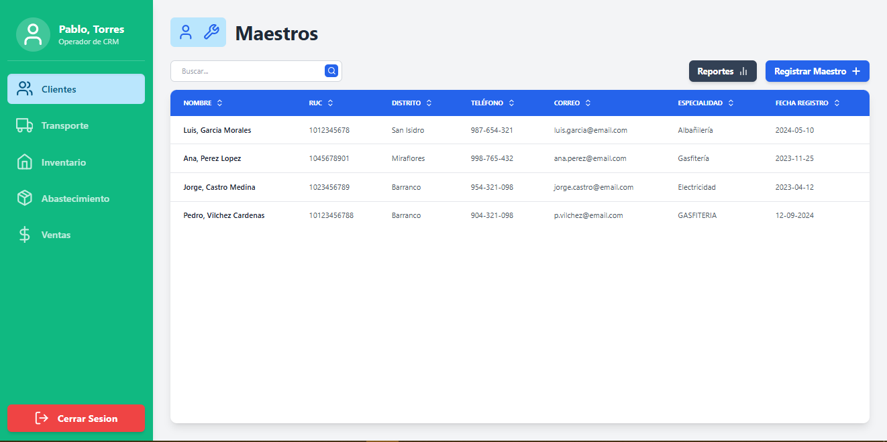
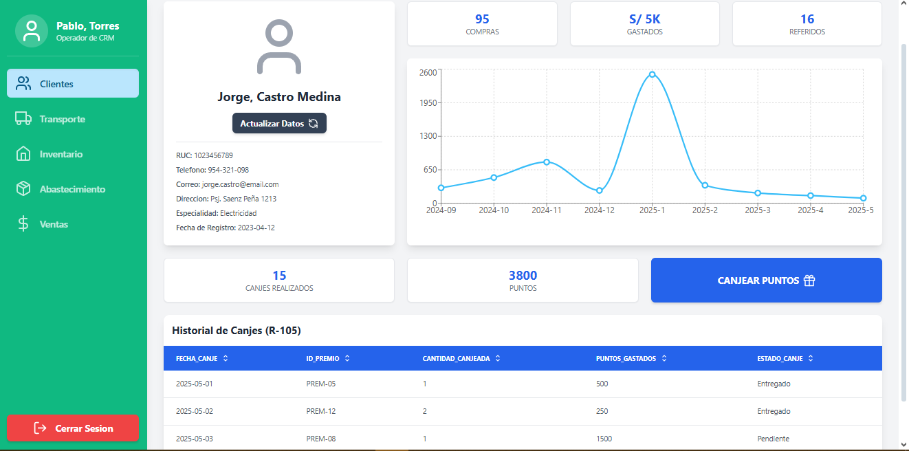
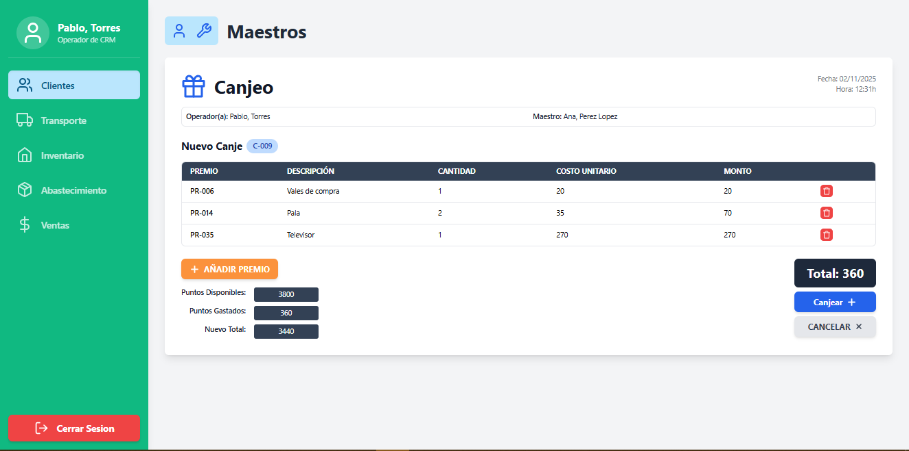
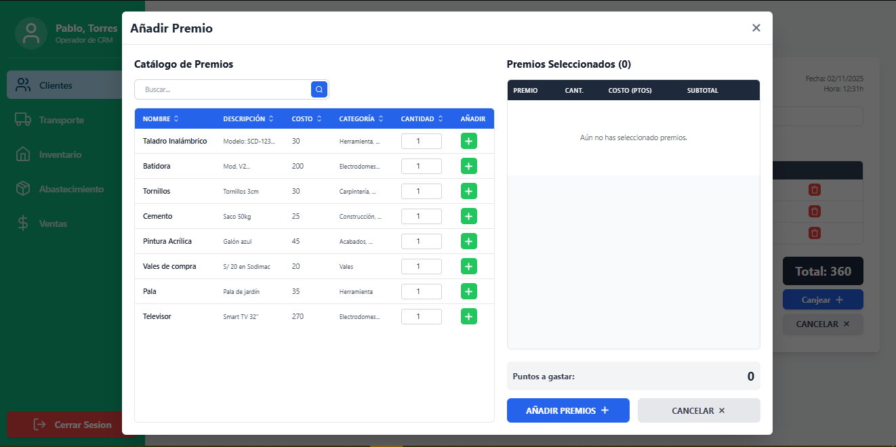
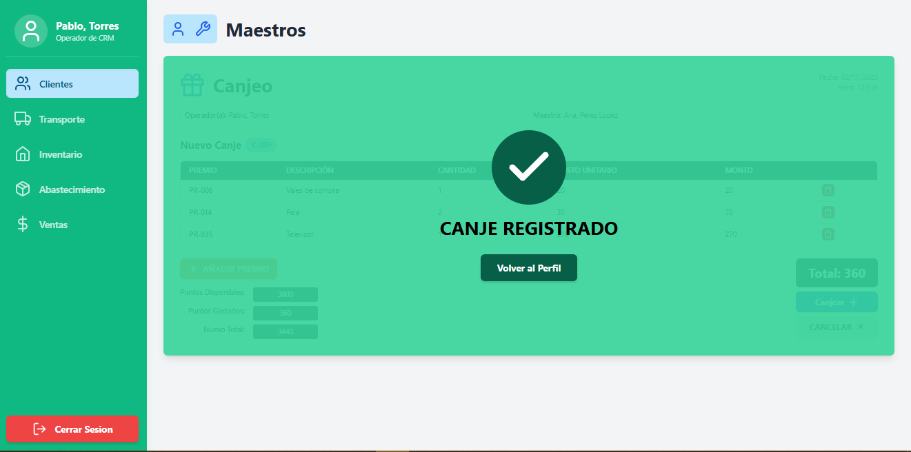
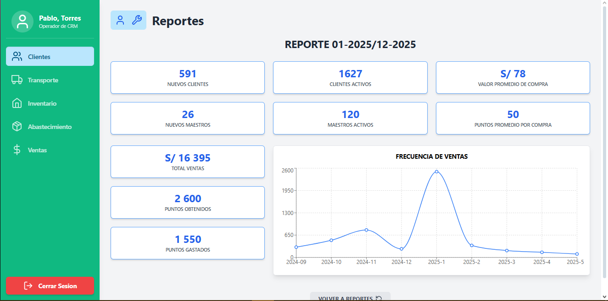

> [9. Preparación para Implementación](../../9.md) › [9.2. Alcance del Piloto (Funcionalidad primaria)](../9.2.md) › [9.2.1. Módulo 1 / Integrante 1](9.2.1.md)

# 9.2.1. Módulo 1 / Integrante 1

# Funcionalidad Primaria 🔨

## FLUJO 💻

### Desde la vista de maestros se selecciona a uno, se hace uso de filtros de ser necesario.

### Una vez en el perfil del maestro se selecciona la opción "canjear puntos".

### Se da clic en "añadir premio"

### Se seleccionan los productos a canjear y se "añaden al carrito"

### Se procede a finalizar el canje con el botón "canjear"



## REFLEJA 📊

### Los canjes se reflejan en el reporte (proceso Batch)


## CONSULTAS E INSERTS POR PANTALLA 📝

|Código Requerimiento |R-103|
|---|---|
|Código Interfaz| I-003|
|Imagen Interfaz|  |

**Eventos:**

- Carga de Página:

    Se llenará la lista de maestros a seleccionar

    ```sql
  SELECT * FROM "FERRETERIA".VISTA_MAESTROS_COMPLETA V

  --POSIBLES FILTROS:
  --CORREO DISTRITO ESPECIALIDAD FECHA_REGISTRO NOMBRE RUC TELEFONO

  ORDER BY V.FECHA_REGISTRO DESC;
    ```


|Código Requerimiento |R-104|
|---|---|
|Código Interfaz| I-007|
|Imagen Interfaz|  |

**Eventos:**

- Carga de Página:

    Se obtendra la informacion del maestro e historial de canjes

    ```sql
  --DATOS DE PERFIL MAESTRO
  SELECT 
    TD.valor_tipo_documento,
    DP.valor_documento
  FROM "FERRETERIA".MAESTRO M 
  JOIN "FERRETERIA".PERSONA P ON M.COD_PERSONA = P.COD_PERSONA 
  JOIN "FERRETERIA".DOCUMENTO_PERSONA DP ON P.COD_PERSONA = DP.COD_PERSONA 
  JOIN "FERRETERIA".TIPO_DOCUMENTO TD ON TD.COD_TIPO_DOCUMENTO = DP.COD_TIPO_DOCUMENTO 
  WHERE P.COD_PERSONA = ? AND TD.VALOR_TIPO_DOCUMENTO = 'RUC';
 
  --OBTENER SUS CONTACTOS
  SELECT 
    TC.VALOR_TIPO_CONTACTO,
    C.VALOR_CONTACTO 
  FROM "FERRETERIA".MAESTRO M 
  JOIN "FERRETERIA".PERSONA P ON M.COD_PERSONA = P.COD_PERSONA 
  JOIN "FERRETERIA".CONTACTO_PERSONA COP ON COP.COD_PERSONA = P.COD_PERSONA  
  JOIN "FERRETERIA".CONTACTO C ON C.COD_CONTACTO = COP.COD_CONTACTO 
  JOIN "FERRETERIA".TIPO_CONTACTO TC ON C.COD_TIPO_CONTACTO = TC.COD_TIPO_CONTACTO 
  WHERE P.COD_PERSONA = ? AND COP.PRINCIPAL_CONTACTO IS NOT NULL;
 
  --OBTENER SUS DATOS DE REGISTRO
    SELECT 
    D.DISTRITO ||', '|| D.CIUDAD ||', '|| D.VIA ||' '|| D.NUMERO AS DIRECCION
  FROM "FERRETERIA".PERSONA P
  JOIN "FERRETERIA".MAESTRO M ON P.COD_PERSONA = M.COD_PERSONA 
  JOIN "FERRETERIA".DIRECCION_PERSONA DP ON DP.COD_PERSONA = P.COD_PERSONA  
  JOIN "FERRETERIA".DIRECCION D  ON D.COD_DIRECCION = DP.COD_DIRECCION 
  WHERE P.COD_PERSONA = ? AND DP.PRINCIPAL_DIRECCION IS NOT NULL;
  
  --OBTENER DATOS DE REGISTRO
  SELECT
	P.NOMBRE_PERSONA,
	M.FECHA_REGISTRO_MAESTRO  
  FROM "FERRETERIA".PERSONA P
  JOIN "FERRETERIA".MAESTRO M ON P.COD_PERSONA = M.COD_PERSONA 
  WHERE P.COD_PERSONA = ?;

  --OBTENER SU ESPECIALIDAD
  SELECT 
  E.VALOR_ESPECIALIDAD 
  FROM "FERRETERIA".MAESTRO M 
  JOIN "FERRETERIA".ESPECIALIDADES E ON E.COD_ESPECIALIDAD = M.COD_ESPECIALIDAD 
  WHERE M.COD_PERSONA = ?;

  --DATOS DE CANJES POR MES
  SELECT
    EXTRACT(YEAR FROM CA.FECHA_HORA_CANJE) || '-' || EXTRACT(MONTH FROM CA.FECHA_HORA_CANJE) AS MES,
    COUNT(*) AS "NUMERO DE COMPRAS"
  FROM "FERRETERIA".MAESTRO M
  JOIN "FERRETERIA".PERSONA P ON M.COD_PERSONA = P.COD_PERSONA
  JOIN "FERRETERIA".CANJE CA ON M.COD_MAESTRO = CA.COD_MAESTRO 
  WHERE P.COD_PERSONA = ?
  GROUP BY
    EXTRACT(YEAR FROM CA.FECHA_HORA_CANJE),
      EXTRACT(MONTH FROM CA.FECHA_HORA_CANJE)
  ORDER BY MES;

  --REGISTRO DE CANJES
  SELECT
    CA.FECHA_HORA_CANJE AS FECHA,
    P.NOMBRE_PREMIO AS PREMIO,
    DC.CANTIDAD_PREMIO AS CANTIDAD,
    (DC.CANTIDAD_PREMIO * P.PUNTOS_PREMIO) AS MONTO,
    EC.VALOR_ESTADO_CANJE AS ESTADO
  FROM "FERRETERIA".MAESTRO M 
  JOIN "FERRETERIA".PERSONA PE ON PE.COD_PERSONA = M.COD_PERSONA 
  JOIN "FERRETERIA".CANJE CA ON M.COD_MAESTRO = CA.COD_MAESTRO
  JOIN "FERRETERIA".DETALLE_CANJE DC ON DC.COD_CANJE = CA.COD_CANJE 
  JOIN "FERRETERIA".PREMIOS P ON DC.COD_PREMIO = P.COD_PREMIO
  JOIN "FERRETERIA".ESTADO_CANJE EC ON EC.COD_ESTADO_CANJE = CA.COD_ESTADO_CANJE 
  WHERE P.COD_PERSONA = ?;
  --LIMIT N

  --PUNTOS DEL MAESTRO 
  SELECT M.PUNTOS_MAESTRO 
  FROM "FERRETERIA".MAESTRO M 
  JOIN "FERRETERIA".PERSONA P ON M.COD_PERSONA = P.COD_PERSONA 
  WHERE P.COD_PERSONA = ?;

  --HISTORICO DE CANJES
  SELECT * FROM contar_canjes_por_maestro(?);

  --HISTORICO DE REFERIDOS
  SELECT * FROM contar_referidos_por_maestro(?);
    ```


|Código Requerimiento |R-105|
|---|---|
|Código Interfaz| I-014|
|Imagen Interfaz|  |

**Eventos:**

- Carga de Página:

    Se obtendra la informacion del operador y maestro

    ```sql
  --INFORMACION DE OPERADOR
  SELECT 
  P.NOMBRE_PERSONA,
  A.VALOR_AREA,
  R.VALOR_ROL 
  FROM "FERRETERIA".USUARIO U 
  JOIN "FERRETERIA".AREA A ON U.COD_AREA = A.COD_AREA 
  JOIN "FERRETERIA".ROL R ON R.COD_ROL = U.COD_ROL 
  JOIN "FERRETERIA".PERSONA P ON P.COD_PERSONA = U.COD_PERSONA 
  WHERE U.COD_USUARIO = ?;
  --INFORMACION DEL MAESTRO 
  SELECT
  M.PUNTOS_MAESTRO,
  P.NOMBRE_PERSONA 
  FROM "FERRETERIA".MAESTRO M 
  JOIN "FERRETERIA".PERSONA P ON M.COD_PERSONA = P.COD_PERSONA 
  WHERE P.COD_PERSONA = ?;
    ```
- Boton canjear:

    Se registran los datos

    ```sql
  --INSERTAR EL CANJE
  INSERT INTO "FERRETERIA".CANJE (COD_ESTADO_CANJE,COD_MAESTRO,COD_USUARIO,MONTO_CANJE)
  VALUES (?,?,?,?)
  RETURNING COD_CANJE;

  --INSERTAR EL DETALLE
  INSERT INTO "FERRETERIA".DETALLE_CANJE (CANTIDAD_PREMIO,COD_CANJE,COD_PREMIO)
  VALUES (?,?,?);
    ```

|Código Requerimiento |R-105|
|---|---|
|Código Interfaz| I-015|
|Imagen Interfaz|  |

**Eventos:**

- Carga de Página:

    Se obtendra la informacion de premios

    ```sql
  --LISTA DE PREMIOS
  SELECT * FROM "FERRETERIA".VISTA_CATALOGO_PREMIOS;
    ```


|Código Requerimiento |R-106|
|---|---|
|Código Interfaz| I-017|
|Imagen Interfaz|  |

**Eventos:**

- Carga de Página:

    Se obtendra la lista de reportes

    ```sql
  --EJEMPLO DE REPORTE
	WITH ReporteDatos AS (
	    SELECT 
	        cod_reporte,
	        fecha_fin_periodo AS fecha_fin,
	        (fecha_fin_periodo - periodo_reporte) AS fecha_inicio
	    FROM "FERRETERIA".REPORTE
	    WHERE cod_reporte = ? -- <---ID DE REPORTE
	),
	
	NuevosClientes AS (
	    SELECT COUNT(*) AS total 
	    FROM "FERRETERIA".CLIENTE C, ReporteDatos R
	    WHERE C.FECHA_REGISTRO_CLIENTE BETWEEN R.fecha_inicio AND R.fecha_fin
	),
	NuevosMaestros AS (
	    SELECT COUNT(*) AS total 
	    FROM "FERRETERIA".MAESTRO M, ReporteDatos R
	    WHERE M.FECHA_REGISTRO_MAESTRO BETWEEN R.fecha_inicio AND R.fecha_fin
	),
	
	ActivosClientes AS (
	    SELECT COUNT(*) AS total 
	    FROM "FERRETERIA".CLIENTE_CONSULTADO CC, ReporteDatos R
	    WHERE CC.cod_reporte = R.cod_reporte
	),
	ActivosMaestros AS (
	    SELECT COUNT(*) AS total 
	    FROM "FERRETERIA".MAESTRO_CONSULTADO MC, ReporteDatos R
	    WHERE MC.cod_reporte = R.cod_reporte
	),
	
	VentasReporte AS (
	    SELECT 
	        AVG(V.MONTO_VENTA) AS avg_venta,
	        SUM(V.MONTO_VENTA) AS sum_venta
	    FROM "FERRETERIA".VENTA V, ReporteDatos R
	    WHERE V.FECHA_HORA_VENTA BETWEEN R.fecha_inicio AND R.fecha_fin
	),
	PuntosReporte AS (
	    SELECT 
	        AVG(V.PUNTOS_VENTA) AS avg_puntos,
	        SUM(V.PUNTOS_VENTA) AS sum_puntos
	    FROM "FERRETERIA".VENTA V, ReporteDatos R
	    WHERE V.FECHA_HORA_VENTA BETWEEN R.fecha_inicio AND R.fecha_fin 
	      AND V.COD_MAESTRO IS NOT NULL
	),
	
	CanjesReporte AS (
	    SELECT SUM(C.MONTO_CANJE) AS total_gastado
	    FROM "FERRETERIA".CANJE C
	    JOIN "FERRETERIA".CANJE_CONSULTADO CC ON C.cod_canje = CC.cod_canje
	    JOIN ReporteDatos R ON CC.cod_reporte = R.cod_reporte
	)
	
	SELECT 
	    (SELECT total FROM NuevosClientes) AS "NUEVOS CLIENTES",
	    (SELECT total FROM NuevosMaestros) AS "NUEVOS MAESTROS",
	    (SELECT total FROM ActivosClientes) AS "CLIENTES ACTIVOS",
	    (SELECT total FROM ActivosMaestros) AS "MAESTROS ACTIVOS",
	    (SELECT avg_venta FROM VentasReporte) AS "VALOR PROMEDIO DE COMPRA",
	    (SELECT sum_venta FROM VentasReporte) AS "TOTAL VENTAS",
	    (SELECT avg_puntos FROM PuntosReporte) AS "VALOR PROMEDIO DE PUNTOS",
	    (SELECT sum_puntos FROM PuntosReporte) AS "PUNTOS OBTENIDOS",
	    (SELECT total_gastado FROM CanjesReporte) AS "PUNTOS GASTADOS";
    ```
[🏠 Home](../../../README.md) | [Siguiente ➡️](../9.2.2/9.2.2.md)
