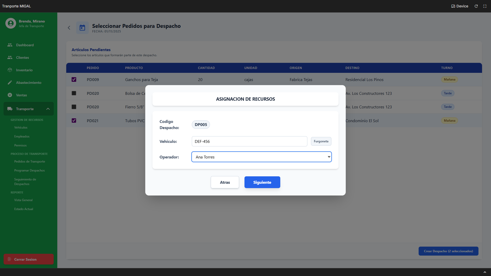
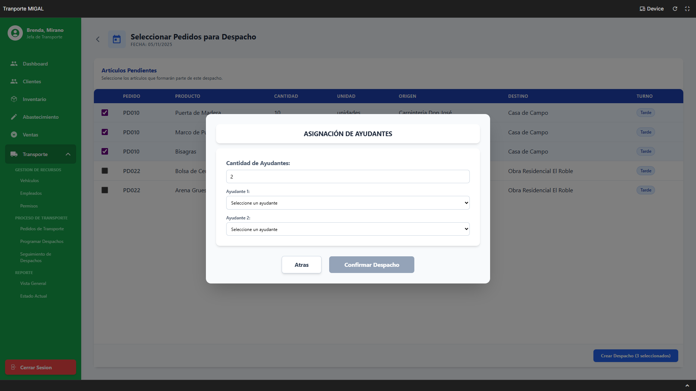
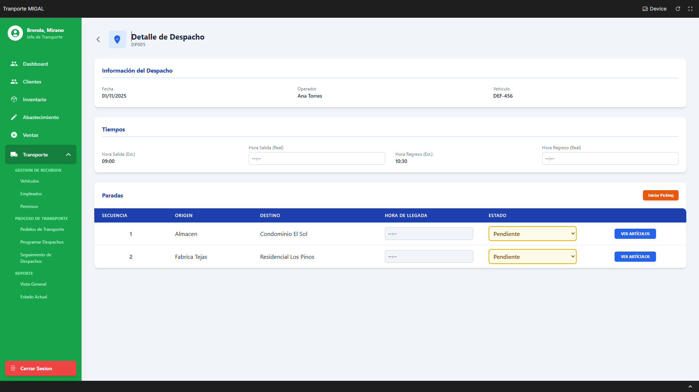
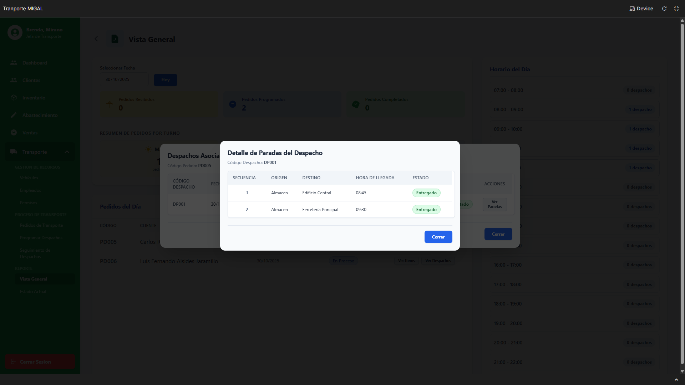

> [9. Preparación para Implementación](../../9.md) › [9.2. Alcance del Piloto (Funcionalidad primaria)](../9.2.md) › [9.2.2. Módulo 2 / Integrante 2](9.2.2.md)

# 9.2.2. Módulo 2 / Integrante 2

# Funcionalidad Primaria 

## Flujo Principal Elegido: 
Proceso Logístico de Despacho (Programación, Seguimiento y Reporte)

El flujo primario seleccionado para el Módulo de Transporte es el proceso de punta a punta que va desde la **programación de un nuevo despacho** hasta su **seguimiento en tiempo real** y la **consulta final en reportes**.

Este flujo representa la operación diaria y el núcleo funcional del módulo:

1. **Programar Nuevo Despacho (R-209):** El Jefe de Transporte inicia seleccionando los artículos pendientes que deben ser entregados en una fecha específica. A través de un asistente, agrupa estos artículos, les asigna un vehículo disponible y un operador (chofer) calificado.
2. **Gestionar Seguimiento de Despacho (R-210):** Una vez que el despacho está programado, pasa a la pantalla de seguimiento. Aquí, el Jefe de Transporte actualiza el estado del despacho en tiempo real, registrando eventos clave como "Iniciar Picking", la hora real de salida, la hora de llegada a cada parada (visita) y, finalmente, la hora real de regreso.
3. **Consultar Reporte de Vista General (R-213):** Al final del día o en cualquier momento, el Jefe de Transporte puede consultar la "Vista General". Este dashboard le permite seleccionar una fecha y ver un resumen completo de la operación: cuántos pedidos se programaron, cuántos se completaron, un resumen por turno y un listado detallado de los pedidos y despachos de ese día.

## Justificación de la Elección

Se eligió este flujo (R-209 → R-210 → R-213) como funcionalidad primaria por las siguientes razones:

1. **Representa el Valor Central:** Este flujo es la razón de ser del Módulo de Transporte. Su objetivo principal es organizar, ejecutar y monitorear la entrega física de productos.
2. **Conecta Múltiples Tablas:** Este proceso es el que más tablas clave del módulo interconecta. Involucra `DESPACHO`, `VISITA_PROGRAMADA`, `DETALLE_PEDIDO_TR`, `PARADA`, `VEHICULO`, `CHOFER`, `USUARIO`, `ASIGNACION_AYUDANTE` y las tablas de *lookups* de estados.
3. **Cubre un Proceso Completo:** El flujo seleccionado tiene un inicio (artículos pendientes), un proceso (asignación y monitoreo en ruta) y un fin (reporte de operaciones completadas), demostrando un ciclo funcional completo.
4. **Incluye Consultas y Reportes:** El flujo culmina naturalmente en el R-213, una pantalla de consulta tipo reporte que utiliza la información poblada por los pasos anteriores (R-209 y R-210) para mostrar información agregada y detallada, cumpliendo con el requisito de incluir opciones de consulta o reportes.

## Mapeo de Requisitos e Interfaces del Flujo

- **R-209: Programar Nuevo Despacho**
    - I-217: Programar Despachos (Calendario)
    - I-218: Seleccionar Pedidos para Despacho
    - I-219 a I-223: Wizard de 5 pasos (Resumen, Recursos, Secuencia, Horarios, Ayudantes)
- **R-210: Gestionar Seguimiento de Despacho**
    - I-224: Seguimiento de Despachos (Listado)
    - I-225: Detalle de Despacho (Gestión en tiempo real)
- **R-213: Consultar Reporte de Vista General**
    - I-228: Vista General (Dashboard de Reporte)
    - I-229 a I-232: Modales de consulta (Ver Items, Ver Despachos, Ver Paradas, Ver Despachos por Hora)

## Detalle del Flujo (Pantallas y SQL)

A continuación, se presentan las pantallas, interfaces y sentencias SQL específicas involucradas *exclusivamente* en este flujo primario.

## REQUERIMIENTO R-209: Programar Nuevo Despacho

| **Código Requerimiento** | **R-209** |
| --- | --- |
| Código Interfaz | I-217 |
| Imagen Interfaz |  |

**Eventos:**

- Botón "Confirmar y Seleccionar Pedidos":
    
    Navega a la interfaz I-218, pasando como parámetro la Fecha de Despacho seleccionada.
    

| **Código Requerimiento** | **R-209** |
| --- | --- |
| Código Interfaz | I-218 |
| Imagen Interfaz | `` |

**Eventos:**

- Carga de la Página:
    
    Muestra todos los "Artículos Pendientes" que coinciden con la fecha de despacho seleccionada.
    
    ```
    SELECT
        dt.cod_detalle_pedido_tr,
        pt.cod_pedido_transporte, -- Para la columna "PEDIDO"
        pr.nombre_producto AS "Producto",
        dt.cantidad_detalle AS "Cantidad",
        dt.direccion_origen_pedido AS "Origen",
        dt.direccion_destino_pedido AS "Destino",
        tt.descp_turno AS "Turno"
    FROM
        DETALLE_PEDIDO_TR dt
    JOIN
        PEDIDO_TRANSPORTE pt ON dt.cod_pedido_transporte = pt.cod_pedido_transporte
    JOIN
        PRODUCTO pr ON dt.cod_producto = pr.cod_producto
    LEFT JOIN
        TURNO_TRANSPORTE tt ON dt.cod_turno = tt.cod_turno
    WHERE
        dt.fecha_detalle = <Fecha de Despacho Seleccionada>
      AND
        dt.cod_estado_detalle_pedido = (SELECT cod_estado_detalle_pedido FROM ESTADO_DETALLE_PEDIDO WHERE descp_estado_detalle_pedido = 'Pendiente'); -- O 'Recibido'
    
    ```
    
- Botón "Crear Despachos (X seleccionados)":
    
    Inicia el asistente (wizard) en la modal I-219, pasando la lista de cod_detalle_pedido_tr seleccionados.
    

| **Código Requerimiento** | **R-209** |
| --- | --- |
| Código Interfaz | I-219 a I-223 (Wizard de Despacho) |
| Imagen Interfaz |  (Paso 1)  <br>  (Paso 2)  <br>  (Paso 3)  <br>  (Paso 4)  <br>  (Paso 5) |

**Eventos:**

- Carga de Modales (Llenar Dropdowns):
    
    Se ejecutan en el Paso 2 (Recursos) y Paso 5 (Ayudantes).
    
    ```
    -- Carga de "Vehículo" (Paso 2)
    SELECT v.cod_vehiculo, v.placa_vehiculo
    FROM VEHICULO v
    JOIN ESTADO_VEHICULO ev ON v.cod_estado_vehiculo = ev.cod_estado_vehiculo
    WHERE ev.descp_estado_vehiculo = 'Operativo';
    
    -- Carga de "Operador" (Paso 2)
    SELECT u.cod_usuario, p.nombre_persona
    FROM USUARIO u
    JOIN PERSONA p ON u.cod_persona = p.cod_persona
    JOIN CHOFER c ON u.cod_usuario = c.cod_usuario
    JOIN ESTADO_USUARIO esu ON u.cod_estado_usuario = esu.cod_estado_usuario
    WHERE esu.descp_estado_usuario = 'Activo';
    -- (Faltaría lógica de cruce con PERMISO y R-206)
    
    -- Carga de "Ayudantes" (Paso 5)
    SELECT u.cod_usuario, p.nombre_persona
    FROM USUARIO u
    JOIN PERSONA p ON u.cod_persona = p.cod_persona
    JOIN ESTADO_USUARIO esu ON u.cod_estado_usuario = esu.cod_estado_usuario
    WHERE esu.descp_estado_usuario = 'Activo'
      AND u.cod_rol = (SELECT cod_rol FROM ROL WHERE valor_rol = 'Ayudante'); -- Asumiendo Rol
    
    ```
    
- Botón "Confirmar Despacho" (Paso 5):
    
    Ejecuta la transacción final para crear el despacho y sus paradas.
    
    ```
    -- INICIO DE LA TRANSACCIÓN
    
    -- Paso 1: Crear la cabecera del DESPACHO
    INSERT INTO DESPACHO (
        fecha_despacho,
        cod_estado_despacho,
        hora_salida_estimada,
        hora_regreso_estimada,
        cod_chofer,
        cod_vehiculo,
        tiempo_reserva_min -- Asumiendo cálculo
    )
    VALUES (
        <Fecha Seleccionada>,
        (SELECT cod_estado_despacho FROM ESTADO_DESPACHO WHERE descp_estado_despacho = 'Programado'),
        <Hora Estimada de Salida>,
        <Hora Estimada de Regreso>,
        <ID Operador Seleccionado>,
        <ID Vehículo Seleccionado>,
        <Minutos Calculados>
    )
    RETURNING cod_despacho;
    
    -- (Se almacena el <ID Despacho de Paso 1>)
    
    -- Paso 2: Crear las PARADAS (Bucle para cada destino único)
    -- (Esta lógica asume que las paradas se crean si no existen)
    INSERT INTO PARADA (direccion_parada, cod_tipo_parada)
    VALUES (<Dirección Destino 1>, (SELECT cod_tipo_parada FROM TIPO_PARADA WHERE descp_tipo_parada = 'Entrega'))
    ON CONFLICT DO NOTHING
    RETURNING cod_parada;
    -- (Se almacena el <ID Parada 1>)
    
    -- Paso 3: Crear las VISITAS PROGRAMADAS (Bucle para cada parada)
    INSERT INTO VISITA_PROGRAMADA (cod_despacho, cod_parada, secuencia, cod_estado_visita)
    VALUES (
        <ID Despacho de Paso 1>,
        <ID Parada 1>,
        <Secuencia Ingresada (ej. 1)>,
        (SELECT cod_estado_visita FROM ESTADO_VISITA WHERE descp_estado_visita = 'Pendiente')
    )
    RETURNING cod_visita;
    -- (Se almacena el <ID Visita 1>)
    -- (Repetir Pasos 2 y 3 para Parada 2 / Visita 2...)
    
    -- Paso 4: Vincular Artículos (DETALLE_PEDIDO_TR) a las Visitas (Bucle)
    UPDATE DETALLE_PEDIDO_TR
    SET
        cod_visita = <ID Visita correspondiente a su destino>,
        cod_estado_detalle_pedido = (SELECT cod_estado_detalle_pedido FROM ESTADO_DETALLE_PEDIDO WHERE descp_estado_detalle_pedido = 'Programado')
    WHERE
        cod_detalle_pedido_tr = <ID Artículo 1 Seleccionado>;
    -- (Repetir Paso 4 para Artículo 2...)
    
    -- Paso 5: Asignar Ayudantes (Bucle)
    INSERT INTO ASIGNACION_AYUDANTE (cod_usuario, cod_despacho)
    VALUES (<ID Ayudante 1 Seleccionado>, <ID Despacho de Paso 1>);
    -- (Repetir Paso 5 si hay más ayudantes)
    
    -- FIN DE LA TRANSACCIÓN
    
    ```
    

## REQUERIMIENTO R-210: Gestionar Seguimiento de Despacho

| **Código Requerimiento** | **R-210** |
| --- | --- |
| Código Interfaz | I-224 |
| Imagen Interfaz |  |

**Eventos:**

- Carga de la Página:
    
    Muestra la lista de todos los despachos programados, en ruta o completados.
    
    ```
    SELECT
        d.cod_despacho,
        d.fecha_despacho,
        p.nombre_persona AS "Operador",
        v.placa_vehiculo AS "Vehículo",
        d.hora_salida_estimada,
        d.hora_regreso_estimada,
        ed.descp_estado_despacho AS "Estado"
    FROM
        DESPACHO d
    JOIN
        USUARIO u ON d.cod_chofer = u.cod_usuario
    JOIN
        PERSONA p ON u.cod_persona = p.cod_persona
    JOIN
        VEHICULO v ON d.cod_vehiculo = v.cod_vehiculo
    JOIN
        ESTADO_DESPACHO ed ON d.cod_estado_despacho = ed.cod_estado_despacho
    ORDER BY
        d.fecha_despacho DESC, d.hora_salida_estimada;
    
    ```
    
- Botón "VER DETALLE":
    
    Navega a la interfaz I-225 para gestionar el progreso del despacho seleccionado.
    

| **Código Requerimiento** | **R-210** |
| --- | --- |
| Código Interfaz | I-225 |
| Imagen Interfaz |  (Estado Inicial) |

**Eventos:**

- Carga de la Página (Detalle y Paradas):
    
    Muestra la información del despacho y la lista de sus paradas (visitas).
    
    ```
    -- 1. Cargar cabecera del despacho
    SELECT
        d.fecha_despacho, p.nombre_persona AS Operador, v.placa_vehiculo,
        d.hora_salida_estimada, d.hora_regreso_estimada,
        d.hora_salida_despacho, d.hora_regreso_despacho
    FROM DESPACHO d
    JOIN USUARIO u ON d.cod_chofer = u.cod_usuario
    JOIN PERSONA p ON u.cod_persona = p.cod_persona
    JOIN VEHICULO v ON d.cod_vehiculo = v.cod_vehiculo
    WHERE d.cod_despacho = <ID Despacho Seleccionado>;
    
    -- 2. Cargar paradas (visitas)
    SELECT
        vp.cod_visita,
        vp.secuencia,
        p.direccion_parada AS "Destino",
        vp.hora_llegada,
        vp.cod_estado_visita,
        ev.descp_estado_visita
    FROM VISITA_PROGRAMADA vp
    JOIN PARADA p ON vp.cod_parada = p.cod_parada
    JOIN ESTADO_VISITA ev ON vp.cod_estado_visita = ev.cod_estado_visita
    WHERE vp.cod_despacho = <ID Despacho Seleccionado>
    ORDER BY vp.secuencia;
    
    -- 3. Cargar lista de estados de visita (para los dropdowns de la tabla)
    SELECT cod_estado_visita, descp_estado_visita FROM ESTADO_VISITA;
    
    ```
    
- Botón "Iniciar Picking":
    
    Actualiza el estado del despacho y todas sus paradas pendientes a "Picking".
    
    ```
    -- 1. Actualizar las visitas
    UPDATE VISITA_PROGRAMADA
    SET cod_estado_visita = (SELECT cod_estado_visita FROM ESTADO_VISITA WHERE descp_estado_visita = 'Picking')
    WHERE cod_despacho = <ID Despacho>
      AND cod_estado_visita = (SELECT cod_estado_visita FROM ESTADO_VISITA WHERE descp_estado_visita = 'Pendiente');
    
    -- 2. Actualizar el despacho general
    UPDATE DESPACHO
    SET cod_estado_despacho = (SELECT cod_estado_despacho FROM ESTADO_DESPACHO WHERE descp_estado_despacho = 'Picking')
    WHERE cod_despacho = <ID Despacho>;
    
    ```
    
- Botón "Guardar Tiempos" (Salida):
    
    Registra la hora real de salida y actualiza estados a "En Ruta".
    
    ```
    -- 1. Registrar hora de salida y actualizar estado del despacho
    UPDATE DESPACHO
    SET
        hora_salida_despacho = <Hora Salida (Real) Ingresada>,
        cod_estado_despacho = (SELECT cod_estado_despacho FROM ESTADO_DESPACHO WHERE descp_estado_despacho = 'En Ruta')
    WHERE cod_despacho = <ID Despacho>;
    
    -- 2. Actualizar las visitas que estaban en Picking
    UPDATE VISITA_PROGRAMADA
    SET cod_estado_visita = (SELECT cod_estado_visita FROM ESTADO_VISITA WHERE descp_estado_visita = 'En Ruta')
    WHERE cod_despacho = <ID Despacho>
      AND cod_estado_visita = (SELECT cod_estado_visita FROM ESTADO_VISITA WHERE descp_estado_visita = 'Picking');
    
    ```
    
- Botón "Guardar Cambios" (Paradas):
    
    Se usa para registrar la HORA DE LLEGADA y cambiar el ESTADO de una parada individual (ej. a "Entregado").
    
    ```
    -- Se ejecuta por cada fila de parada que se modifica
    UPDATE VISITA_PROGRAMADA
    SET
        hora_llegada = <HORA DE LLEGADA Ingresada>,
        cod_estado_visita = <ID Estado Seleccionado (ej. 'Entregado')>
    WHERE
        cod_visita = <ID Visita de la fila>;
    
    ```
    
- Botón "Guardar Tiempos" (Regreso):
    
    Registra la hora real de regreso y marca el despacho como "Completado".
    
    ```
    UPDATE DESPACHO
    SET
        hora_regreso_despacho = <Hora Regreso (Real) Ingresada>,
        cod_estado_despacho = (SELECT cod_estado_despacho FROM ESTADO_DESPACHO WHERE descp_estado_despacho = 'Completado')
    WHERE
        cod_despacho = <ID Despacho>;
    
    ```
    

## REQUERIMIENTO R-213: Consultar Reporte de Vista General

| **Código Requerimiento** | **R-213** |
| --- | --- |
| Código Interfaz | I-228 |
| Imagen Interfaz |  |

**Eventos:**

- Seleccionar Fecha en Calendario:
    
    Dispara múltiples consultas SELECT para poblar el dashboard con los datos de la <Fecha Seleccionada>.
    
    ```
    -- 1. Consulta para Tarjetas de Estado (ej. "Pedidos Programados: 2")
    SELECT
        edp.descp_estado_detalle_pedido,
        COUNT(dt.cod_detalle_pedido_tr) AS Total
    FROM DETALLE_PEDIDO_TR dt
    JOIN ESTADO_DETALLE_PEDIDO edp ON dt.cod_estado_detalle_pedido = edp.cod_estado_detalle_pedido
    WHERE dt.fecha_detalle = <Fecha Seleccionada>
    GROUP BY edp.descp_estado_detalle_pedido;
    
    -- 2. Consulta para "Resumen de Pedidos por Turno"
    SELECT
        tt.descp_turno,
        COUNT(DISTINCT dt.cod_pedido_transporte) AS TotalPedidos
    FROM DETALLE_PEDIDO_TR dt
    JOIN TURNO_TRANSPORTE tt ON dt.cod_turno = tt.cod_turno
    WHERE dt.fecha_detalle = <Fecha Seleccionada>
    GROUP BY tt.descp_turno;
    
    -- 3. Consulta para tabla "Pedidos del Dia"
    SELECT DISTINCT
        pt.cod_pedido_transporte,
        p.nombre_persona AS Cliente,
        ept.descp_estado_pedido_tr AS Estado
    FROM PEDIDO_TRANSPORTE pt
    JOIN DETALLE_PEDIDO_TR dt ON pt.cod_pedido_transporte = dt.cod_pedido_transporte
    JOIN CLIENTE c ON pt.cod_cliente = c.cod_cliente
    JOIN PERSONA p ON c.cod_persona = p.cod_persona
    JOIN ESTADO_PEDIDO_TR ept ON pt.cod_estado_pedido_tr = ept.cod_estado_pedido_tr
    WHERE dt.fecha_detalle = <Fecha Seleccionada>;
    
    -- 4. Consulta para barra lateral "Horario del Dia"
    SELECT
        DATE_TRUNC('hour', hora_salida_estimada) AS franja_horaria,
        COUNT(cod_despacho) AS total_despachos
    FROM DESPACHO
    WHERE fecha_despacho = <Fecha Seleccionada>
    GROUP BY franja_horaria
    ORDER BY franja_horaria;
    
    ```
    
- Flujo Alternativo A1: Clic en "Ver Items" (Modal I-229):
    
    
    
    ```
    -- Muestra los productos del pedido
    SELECT
        pr.nombre_producto,
        dt.cantidad_detalle,
        dt.direccion_destino_pedido,
        edt.descp_estado_detalle_pedido
    FROM DETALLE_PEDIDO_TR dt
    JOIN PRODUCTO pr ON dt.cod_producto = pr.cod_producto
    JOIN ESTADO_DETALLE_PEDIDO edt ON dt.cod_estado_detalle_pedido = edt.cod_estado_detalle_pedido
    WHERE dt.cod_pedido_transporte = <ID Pedido de la fila>;
    
    ```
    
- Flujo Alternativo A2: Clic en "Ver Despachos" (Modal I-230):
    
    
    
    ```
    -- Muestra los despachos asociados a ese pedido
    SELECT DISTINCT
        d.cod_despacho,
        d.fecha_despacho,
        p.nombre_persona AS Operador,
        v.placa_vehiculo,
        ed.descp_estado_despacho
    FROM DESPACHO d
    JOIN VISITA_PROGRAMADA vp ON d.cod_despacho = vp.cod_despacho
    JOIN DETALLE_PEDIDO_TR dt ON vp.cod_visita = dt.cod_visita
    JOIN USUARIO u ON d.cod_chofer = u.cod_usuario
    JOIN PERSONA p ON u.cod_persona = p.cod_persona
    JOIN VEHICULO v ON d.cod_vehiculo = v.cod_vehiculo
    JOIN ESTADO_DESPACHO ed ON d.cod_estado_despacho = ed.cod_estado_despacho
    WHERE dt.cod_pedido_transporte = <ID Pedido de la fila>;
    
    ```
    
- Sub-flujo A2.1: Clic en "Ver Paradas" (Modal I-231):
    
    
    
    ```
    -- Muestra la secuencia de paradas del despacho
    SELECT
        vp.secuencia,
        pa.direccion_parada,
        ev.descp_estado_visita,
        vp.hora_llegada
    FROM VISITA_PROGRAMADA vp
    JOIN PARADA pa ON vp.cod_parada = pa.cod_parada
    JOIN ESTADO_VISITA ev ON vp.cod_estado_visita = ev.cod_estado_visita
    WHERE vp.cod_despacho = <ID Despacho de la fila modal anterior>
    ORDER BY vp.secuencia;
    
    ```
    
- Flujo Alternativo A3: Clic en franja horaria "X Despacho" (Modal I-232):
    
    
    
    ```
    -- Muestra los despachos de esa franja horaria
    SELECT
        d.cod_despacho,
        p.nombre_persona AS Operador,
        v.placa_vehiculo,
        d.hora_salida_estimada,
        d.hora_regreso_estimada
    FROM DESPACHO d
    JOIN USUARIO u ON d.cod_chofer = u.cod_usuario
    JOIN PERSONA p ON u.cod_persona = p.cod_persona
    JOIN VEHICULO v ON d.cod_vehiculo = v.cod_vehiculo
    WHERE d.fecha_despacho = <Fecha Seleccionada>
      AND d.hora_salida_estimada >= <Hora Inicio Franja>
      AND d.hora_salida_estimada < <Hora Fin Franja>;
    
    ```

[⬅️ Anterior](../9.2.1/9.2.1.md) | [🏠 Home](../../../README.md) | [Siguiente ➡️](../9.2.3/9.2.3.md)
