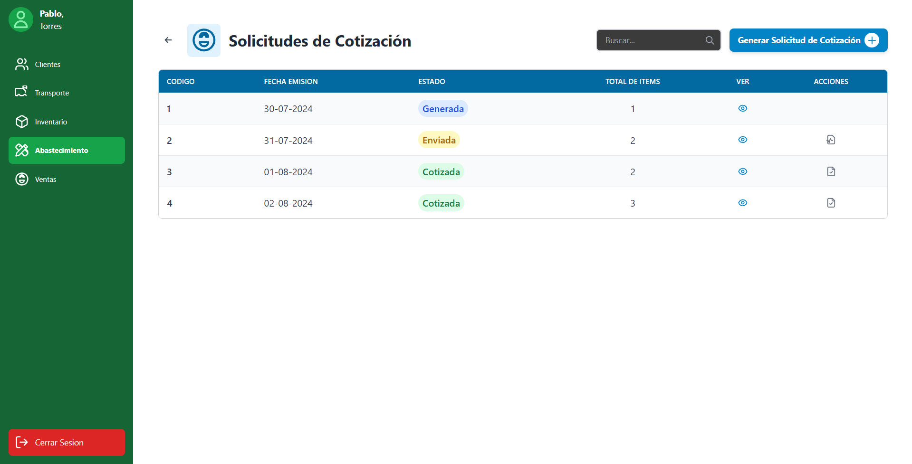
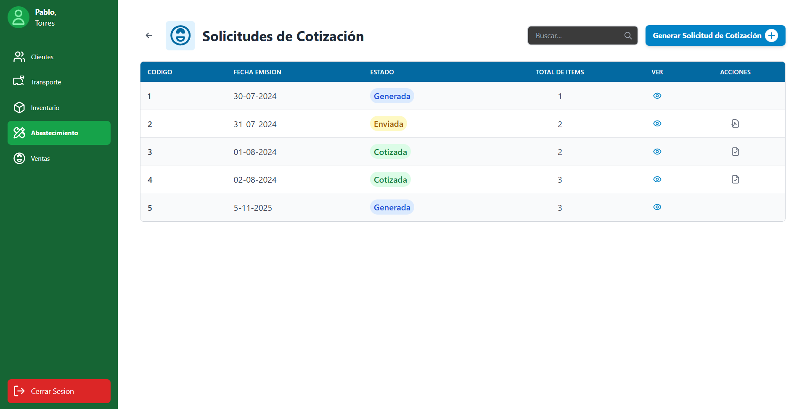
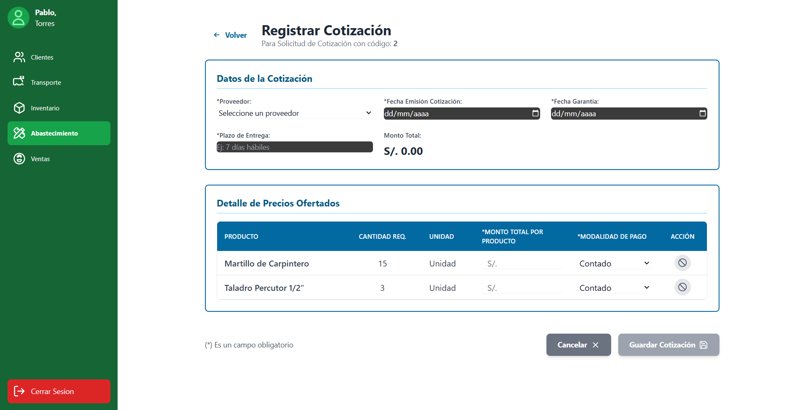
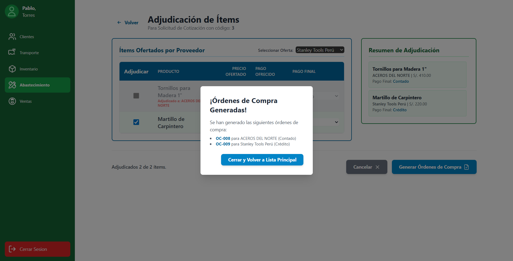
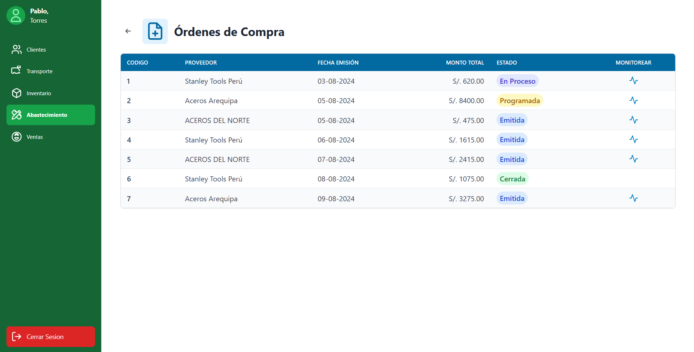

> [9. Preparación para Implementación](../../9.md) › [9.2. Alcance del Piloto (Funcionalidad primaria)](../9.2.md) › [9.2.4. Módulo 4 / Integrante 4](9.2.4.md)

# 9.2.4. Módulo 4 / Integrante 4

# Funcionalidad Primaria

Se ha seleccionado el flujo principal de **"Gestión de Compras"** como la funcionalidad primaria del módulo. Esta elección se justifica porque representa el *core* del proceso de abastecimiento, conectando una necesidad interna (**Pedido de Abastecimiento**) con una acción externa (**Orden de Compra**).

Este flujo abarca los requerimientos **R-404, R-405, R-406, y R-407**, demostrando un proceso transaccional completo que involucra la consolidación de datos, la evaluación de múltiples proveedores y la generación de un compromiso financiero.

## FLUJO 💻

### 1. (R-404) El flujo inicia al Revisar un Pedido de Abastecimiento pendiente.
El Jefe de Abastecimiento filtra los pedidos "Pendientes" y los marca como "Revisados" para que puedan ser cotizados.


### 2. (R-405) Los items revisados se Priorizan y se Genera una Solicitud de Cotización.
Se agrupan los productos de uno o varios pedidos revisados en una única Solicitud de Cotización para posteriormente enviarla.



### 3. (R-406) Se Registran las Cotizaciones recibidas de los proveedores para esa solicitud.
Para una solicitud "Pendiente", se registran las diferentes ofertas (cotizaciones) enviadas por los proveedores.




### 4. (R-407) Finalmente, se Evalúan las ofertas y se Genera la Orden de Compra.
El sistema muestra una comparativa de precios por producto, permitiendo al Jefe adjudicar cada ítem al mejor postor y generar las Órdenes de Compra.


## REFLEJA 📊

### La Orden de Compra generada (R-407) se refleja inmediatamente en el "Monitoreo de Compra" (R-408), lista para su seguimiento.



## CONSULTAS E INSERTS POR PANTALLA 📝
|Código Requerimiento |R-404|
|---|---|
|Código Interfaz| I-009|
|Imagen Interfaz|  |

**Eventos:**

- Carga de Página:

    Se llenará la lista de los pedidos de abastecimiento de la ferretería
    ```sql
    SELECT
        cod_pedido,
        fecha_pedido,
        hora_pedido,
        estado_pedido
    FROM
        MODULO_ABASTECIMIENTO.PEDIDO_ABASTECIMIENTO
    ORDER BY
        fecha_pedido DESC, hora_pedido DESC;
    ```

|Código Requerimiento |R-404|
|---|---|
|Código Interfaz| I-010 |
|Imagen Interfaz|  |

**Eventos:**

- Revisar Pedido de Abastecimiento:

    Cargar datos de la cabecera del pedido
    ```sql
    -- $1 es el 'cod_pedido' (ej: 3)
    SELECT
        PA.cod_pedido,
        PA.fecha_pedido,
        PA.hora_pedido,
        PA.estado_pedido,
        -- AJUSTE: Se usa USUARIO y AREA (no hay nombre de empleado)
        ('Usuario ID: ' || U.cod_usuario || ' (' || A.valor_area_usuario || ')') AS usuario_generador
    FROM
        MODULO_ABASTECIMIENTO.PEDIDO_ABASTECIMIENTO PA
    JOIN
        MODULO_ABASTECIMIENTO.USUARIO U ON PA.cod_usuario = U.cod_usuario
    JOIN
        MODULO_ABASTECIMIENTO.AREA A ON U.cod_area_usuario = A.cod_area_usuario
    WHERE
        PA.cod_pedido = $1;
    ```

    Cargar la lista de productos del pedido
    ```sql
    -- $1 es el 'cod_pedido' (ej: 3)
    SELECT
        P.nombre_producto,
        DP.cantidad_requerida,
        P.unidad_medida,
        DP.fecha_requerida,
        DP.tipo_destino,
        DP.direccion_destino_externo AS direccion
    FROM
        MODULO_ABASTECIMIENTO.DETALLE_PEDIDO DP
    JOIN
        MODULO_ABASTECIMIENTO.PRODUCTO P ON DP.cod_producto = P.cod_producto
    WHERE
        DP.cod_pedido = $1
    ORDER BY
        P.nombre_producto;
    ```

    Marcar pedido y sus detalles como 'Revisado'
    ```sql
    -- $1 es el 'cod_pedido'
    BEGIN;

    -- Paso 1: Actualizar el estado del pedido principal
    UPDATE MODULO_ABASTECIMIENTO.PEDIDO_ABASTECIMIENTO
    SET 
        estado_pedido = 'Revisado'
    WHERE 
        cod_pedido = $1 AND estado_pedido = 'Pendiente';

    -- Paso 2: Actualizar el estado de todos los items del pedido
    UPDATE MODULO_ABASTECIMIENTO.DETALLE_PEDIDO
    SET 
        estado = 'Revisado'
    WHERE 
        cod_pedido = $1 AND estado = 'Pendiente';

    COMMIT;
    ```

|Código Requerimiento |R-405|
|---|---|
|Código Interfaz| I-011 |
|Imagen Interfaz|  |

**Eventos:**

- Carga de Página:

    Se llenará la lista de todas las solicitudes de cotizacion
    ```sql
    SELECT
        SC.cod_solicitud,
        SC.fecha_emision,
        SC.estado,
        -- Contamos los productos asociados
        COUNT(DS.cod_producto) AS total_de_items
    FROM
        MODULO_ABASTECIMIENTO.SOLICITUD_COTIZACION SC
    JOIN
        -- Usamos INNER JOIN porque, una solicitud siempre tiene items.
        MODULO_ABASTECIMIENTO.DETALLE_SOLICITUD DS ON SC.cod_solicitud = DS.cod_solicitud
    GROUP BY
        SC.cod_solicitud,
        SC.fecha_emision_solicitud,
        SC.estado
    ORDER BY
        SC.fecha_emision_solicitud DESC, SC.cod_solicitud DESC;
    ```

|Código Requerimiento |R-405|
|---|---|
|Código Interfaz| I-012|
|Imagen Interfaz|  |

**Eventos:**

- Priorizar Pedidos de Abastecimiento:

    Cargar todos los items de pedidos 'Revisado'
    ```sql
    SELECT
        P.nombre_producto,
        DP.cod_pedido,
        DP.cantidad_requerida,
        P.unidad_medida,
        DP.fecha_requerida
    FROM
        MODULO_ABASTECIMIENTO.DETALLE_PEDIDO DP
    JOIN
        MODULO_ABASTECIMIENTO.PRODUCTO P ON DP.cod_producto = P.cod_producto
    WHERE
        DP.estado = 'Revisado'
    ORDER BY
        DP.fecha_requerida ASC;
    ```

    Cargar items 'Revisado' filtrados por fecha
    ```sql
    -- $1 es la fecha de inicio
    -- $2 es la fecha de fin
    SELECT
        DP.cod_pedido,
        DP.cod_producto,
        P.nombre_producto,
        DP.cantidad_requerida,
        P.unidad_medida,
        DP.fecha_requerida
    FROM
        MODULO_ABASTECIMIENTO.DETALLE_PEDIDO DP
    JOIN
        MODULO_ABASTECIMIENTO.PRODUCTO P ON DP.cod_producto = P.cod_producto
    WHERE
        DP.estado = 'Revisado'
        AND DP.fecha_requerida BETWEEN $1 AND $2
    ORDER BY
        DP.fecha_requerida ASC;
    ```

- Generar Solicitud de Cotizacion:

    Boton Generar Solicitud de Cotizacion
    ```sql
    BEGIN;
    -- =============================================================
    -- ($1 = cod_empleado del usuario logueado)
    -- =============================================================
    INSERT INTO MODULO_ABASTECIMIENTO.SOLICITUD_COTIZACION (cod_empleado)
    VALUES ($1)
    RETURNING cod_solicitud;

    -- (La aplicación captura el $NUEVO_COD_SOLICITUD)

    -- =============================================================
    -- 2. Insertar los items AGRUPADOS
    -- =============================================================

    -- (Iteración 1: Fierro)
    INSERT INTO MODULO_ABASTECIMIENTO.DETALLE_SOLICITUD (
        cod_solicitud, 
        cod_producto, 
        cantidad_solicitada
    )
    VALUES ($NUEVO_COD_SOLICITUD, 1, 150);

    -- (Iteración 2: Taladro)
    INSERT INTO MODULO_ABASTECIMIENTO.DETALLE_SOLICITUD (
        cod_solicitud, 
        cod_producto, 
        cantidad_solicitada
    )
    VALUES ($NUEVO_COD_SOLICITUD, 2, 2);
    -- ...etc.

    UPDATE MODULO_ABASTECIMIENTO.DETALLE_PEDIDO
    SET 
        estado = 'En Cotización'
    WHERE 
        estado = 'Revisado' AND
        (cod_pedido, cod_producto) IN (
            (8, 1),   -- Fierro
            (9, 2),   -- Taladro
            (9, 3),   -- Grifo
            (10, 1)   -- Otro Fierro
        );
        
    COMMIT;
    ```

|Código Requerimiento |R-406|
|---|---|
|Código Interfaz| I-013|
|Imagen Interfaz|  |

**Eventos:**

- Carga de Página:

    Se llenará la lista de todas las solicitudes de cotizacion
    ```sql
    SELECT
        SC.cod_solicitud,
        SC.fecha_emision,
        SC.estado,
        -- Contamos los productos asociados
        COUNT(DS.cod_producto) AS total_de_items
    FROM
        MODULO_ABASTECIMIENTO.SOLICITUD_COTIZACION SC
    JOIN
        -- Usamos INNER JOIN porque, una solicitud siempre tiene items.
        MODULO_ABASTECIMIENTO.DETALLE_SOLICITUD DS ON SC.cod_solicitud = DS.cod_solicitud
    GROUP BY
        SC.cod_solicitud,
        SC.fecha_emision_solicitud,
        SC.estado
    ORDER BY
        SC.fecha_emision_solicitud DESC, SC.cod_solicitud DESC;
    ```

|Código Requerimiento |R-406|
|---|---|
|Código Interfaz| I-014|
|Imagen Interfaz|  |

**Eventos:**

- Registrar Cotizaciones Recibida:
    Búsqueda de proveedores (para el dropdown)

    ```sql
    SELECT
        cod_proveedor,
        nombre_comercial
    FROM
        MODULO_ABASTECIMIENTO.PROVEEDOR
    WHERE
        nombre_comercial ILIKE $1
    ORDER BY
        nombre_comercial;
    ```

    Cargar items de la Solicitud de Cotización
    ```sql
    -- $1 es el 'cod_solicitud'
    SELECT
        P.cod_producto,
        P.nombre_producto,
        DS.cantidad_solicitada,
        P.unidad_medida
    FROM
        MODULO_ABASTECIMIENTO.DETALLE_SOLICITUD DS
    JOIN
        MODULO_ABASTECIMIENTO.PRODUCTO P ON DS.cod_producto = P.cod_producto
    WHERE
        DS.cod_solicitud = $1
    ORDER BY
        P.nombre_producto;
    ```

    Botón Gurdar Cotización
    ```sql
    -- $1 = cod_solicitud (ej: 2)
    -- $2 = cod_proveedor
    -- $3 = fecha_emision_cotizacion
    -- $4 = fecha_garantia
    -- $5 = plazo_entrega
    -- $6 = monto_total

    BEGIN;

    -- =============================================================
    -- Insertar la cabecera de la Cotización
    -- =============================================================
    INSERT INTO MODULO_ABASTECIMIENTO.COTIZACION (
        cod_proveedor,
        fecha_emision_cotizacion,
        fecha_garantia,
        plazo_entrega,
        monto_total,
        cod_solicitud 
    )
    VALUES ($2, $3, $4, $5, $6, $1)
    RETURNING cod_cotizacion;

    -- (La aplicación captura el $NUEVO_COD_COTIZACION)

    -- =============================================================
    -- Insertar los items del detalle (Bucle)
    -- =============================================================

    -- (Iteración 1: Martillo)
    -- $10 = cod_producto_1
    -- $11 = monto_total_producto_1
    -- $12 = modalidad_pago_1 (del dropdown)
    INSERT INTO MODULO_ABASTECIMIENTO.DETALLE_COTIZACION (
        cod_cotizacion,
        cod_producto,
        costo_total,
        modalidad_pago
    )
    VALUES ($NUEVO_COD_COTIZACION, $10, $11, $12);

    -- (Iteración 2: Taladro)
    -- $13 = cod_producto_2
    -- $14 = monto_total_producto_2
    -- $15 = modalidad_pago_2
    INSERT INTO MODULO_ABASTECIMIENTO.DETALLE_COTIZACION (
        cod_cotizacion,
        cod_producto,
        costo_total,
        modalidad_pago
    )
    VALUES ($NUEVO_COD_COTIZACION, $13, $14, $15);
    -- ...etc.

    -- =============================================================
    -- Actualizar el estado de la Solicitud
    -- =============================================================
    UPDATE MODULO_ABASTECIMIENTO.SOLICITUD_COTIZACION
    SET 
        estado = 'Cotizada'
    WHERE 
        cod_solicitud = $1;

    COMMIT;
    ```

|Código Requerimiento |R-407|
|---|---|
|Código Interfaz| I-015|
|Imagen Interfaz|  |

**Eventos:**

- Carga de Página:

    Se llenará la lista de todas las solicitudes de cotizacion
    ```sql
    SELECT
        SC.cod_solicitud,
        SC.fecha_emision,
        SC.estado,
        -- Contamos los productos asociados
        COUNT(DS.cod_producto) AS total_de_items
    FROM
        MODULO_ABASTECIMIENTO.SOLICITUD_COTIZACION SC
    JOIN
        -- Usamos INNER JOIN porque, una solicitud siempre tiene items.
        MODULO_ABASTECIMIENTO.DETALLE_SOLICITUD DS ON SC.cod_solicitud = DS.cod_solicitud
    GROUP BY
        SC.cod_solicitud,
        SC.fecha_emision_solicitud,
        SC.estado
    ORDER BY
        SC.fecha_emision_solicitud DESC, SC.cod_solicitud DESC;
    ```

|Código Requerimiento |R-407|
|---|---|
|Código Interfaz| I-016|
|Imagen Interfaz|  |
|Imagen Interfaz|  |

**Eventos:**

- Evaluar Cotizaciones y Generar Órdenes de Compra:

    Cargar el detalle de la oferta de UN proveedor
    ```sql
    -- $1 es el 'cod_solicitud'
    -- $2 es el 'cod_proveedor'
    SELECT
        -- IDs Ocultos (cruciales para generar la OC)
        P.cod_producto,
        C.cod_cotizacion,
        DS.cantidad_solicitada,

        -- Columnas Visibles
        P.nombre_producto,
        DC.costo_total AS precio_ofertado,
        DC.modalidad_pago AS pago_ofrecido
    FROM
        MODULO_ABASTECIMIENTO.DETALLE_COTIZACION DC
    JOIN
        MODULO_ABASTECIMIENTO.COTIZACION C ON DC.cod_cotizacion = C.cod_cotizacion
    JOIN
        MODULO_ABASTECIMIENTO.PRODUCTO P ON DC.cod_producto = P.cod_producto
    JOIN
        MODULO_ABASTECIMIENTO.DETALLE_SOLICITUD DS ON C.cod_solicitud = DS.cod_solicitud AND P.cod_producto = DS.cod_producto
    WHERE
        C.cod_solicitud = $1 AND C.cod_proveedor = $2
    ORDER BY
        P.nombre_producto;
    ```

    Generarción de OCs Necesarias
    ```sql
    -- $1 = cod_solicitud
    BEGIN;

    -- =============================================================
    -- BUCLE EN LA APLICACIÓN
    -- =============================================================

    -- (Iteración 1: OC para Stanley, Contado)
    INSERT INTO MODULO_ABASTECIMIENTO.ORDEN_COMPRA (
        monto, 
        modalidad_pago, 
        cod_cotizacion
    )
    VALUES ($MONTO_TOTAL_OC_1, 'Contado', $COD_COTIZACION_1)
    RETURNING cod_orden;

    -- (App captura $NUEVO_COD_ORDEN_1)
    INSERT INTO MODULO_ABASTECIMIENTO.DETALLE_OC (
        cod_orden, 
        cod_producto, 
        cantidad_comprada, 
        costo_total
    )
    VALUES ($NUEVO_COD_ORDEN_1, $COD_PROD_A, $CANT_A, $COSTO_A);

    -- (Iteración 2: OC para Stanley, Crédito)
    INSERT INTO MODULO_ABASTECIMIENTO.ORDEN_COMPRA (
        monto, 
        modalidad_pago, 
        cod_cotizacion
    )
    VALUES ($MONTO_TOTAL_OC_2, 'Crédito', $COD_COTIZACION_1)
    RETURNING cod_orden;

    -- (App captura $NUEVO_COD_ORDEN_2)
    INSERT INTO MODULO_ABASTECIMIENTO.DETALLE_OC (
        cod_orden, 
        cod_producto, 
        cantidad_comprada, 
        costo_total
    )
    VALUES ($NUEVO_COD_ORDEN_2, $COD_PROD_B, $CANT_B, $COSTO_B);
    -- (Fin Bucle de items de OC 2)

    -- (Iteración 3: OC para Aceros, Contado) ... y así sucesivamente ...
    ```
    
    Actualizar el estado de la Solicitud y pedidos internos
    ```sql
    UPDATE MODULO_ABASTECIMIENTO.SOLICITUD_COTIZACION
    SET 
        estado = 'Adjudicada'
    WHERE 
        cod_solicitud = $1;
 
    UPDATE MODULO_ABASTECIMIENTO.DETALLE_PEDIDO
    SET 
        estado = 'Adjudicado'
    WHERE 
        (cod_pedido, cod_producto) IN (
            (8, 1), (9, 2), (10, 1), ... 
        );

    COMMIT;
    ```

---

[⬅️ Anterior](../9.2.3/9.2.3.md) | [🏠 Home](../../../README.md) | [Siguiente ➡️](../9.2.5/9.2.5.md)
