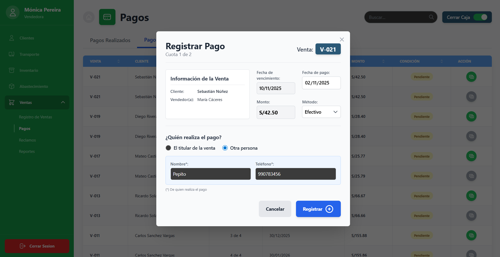
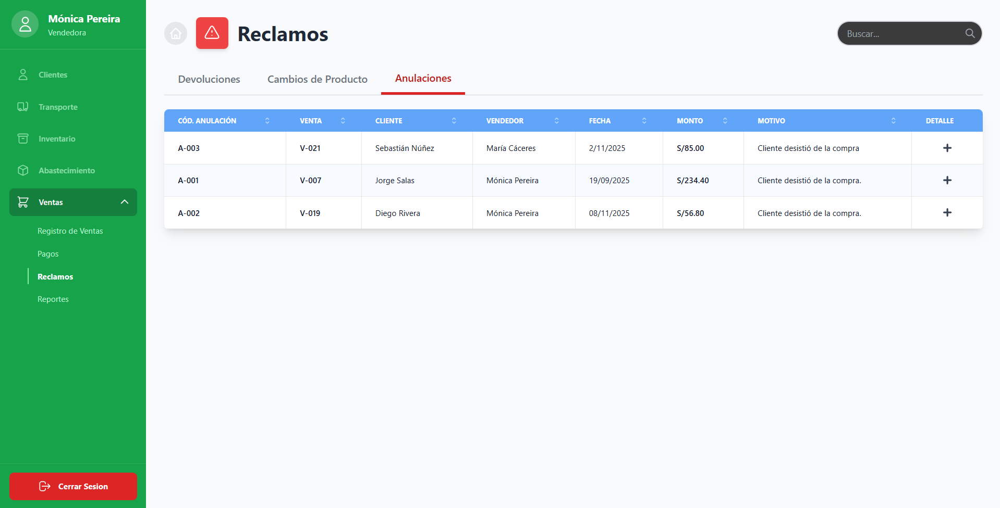
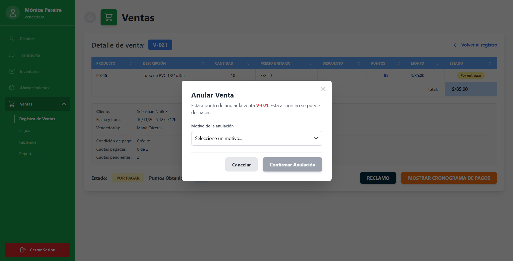

> [9. Preparación para Implementación](../../9.md) › [9.2. Alcance del Piloto (Funcionalidad primaria)](../9.2.md) › [9.2.5. Módulo 5 / Integrante 5](9.2.5.md)

# 9.2.5. Módulo 5: Ventas

## Funcionalidad Primaria: Ciclo de Venta
---

En el presente módulo, la principal funcionalidad es la del ciclo de venta, que se da desde el registro del acuerdo de venta con el cliente, el monitoreo del cumplimiento de pagos acordados y la gestión y resolución de incidencias que puedan surgir, más conocidos como reclamos, hasta que el cliente salda su deuda con la empresa

---

## Flujo

### Evento 1: Registro de Venta

|Código Requerimiento |R-502, R-503|
|---|---|
|Código Interfaz| I-061|
|Imagen Interfaz|  |

- Desplegable de Clientes
``` sql
SELECT p.nombre_persona from clientes c
LEFT JOIN persona p
ON p.cod_persona = c.cod_persona
```
- Desplegable de Productos
``` sql
SELECT nombre_producto from producto
```
- Desplegable de Condición de Pago
``` sql
select descp_cond_pago from condicion_pago
```
- Desplegable de Comprobante
``` sql
SELECT descp_tipo_comprobante from tipo_comprobante
```

- Registro de Venta a Crédito o al Contado
``` sql
--Funcion: Obtener ultima venta
CREATE OR REPLACE FUNCTION ultima_venta() 
RETURNS INTEGER
LANGUAGE SQL
AS 
$$
SELECT max(cod_venta) FROM venta;
$$;

--Funcion: Obtener precio_venta
CREATE OR REPLACE FUNCTION precio_unitario(p_cod_producto integer) 
RETURNS numeric(12,2)
LANGUAGE SQL
AS 
$$
SELECT precio_venta FROM producto WHERE cod_producto = p_cod_producto;
$$;

--Funcion: Obtener puntos_producto
CREATE OR REPLACE FUNCTION puntos_producto(p_cod_producto integer) 
RETURNS numeric(12,2)
LANGUAGE SQL
AS 
$$
SELECT puntos_producto FROM producto WHERE cod_producto = p_cod_producto;
$$;

--Funcion: Obtener monto total de venta
CREATE OR REPLACE FUNCTION calcular_monto_venta(p_cod_venta integer) 
RETURNS numeric(12,2)
LANGUAGE SQL
AS 
$$
SELECT 
SUM(monto_unitario)
FROM producto_venta pv
GROUP BY pv.cod_venta
HAVING pv.cod_venta=p_cod_venta;
$$;

--Funcion: Obtener puntos totales de venta
CREATE OR REPLACE FUNCTION calcular_puntos_venta(p_cod_venta integer) 
RETURNS numeric(12,2)
LANGUAGE SQL
AS 
$$
SELECT 
SUM(puntos_unitario)
FROM producto_venta pv
GROUP BY pv.cod_venta
HAVING pv.cod_venta=p_cod_venta;
$$;

--Funcion: Obtener descuento total venta
CREATE OR REPLACE FUNCTION calcular_dscto_venta(p_cod_venta integer) 
RETURNS numeric(12,2)
LANGUAGE SQL
AS 
$$
SELECT 
SUM(descuento_unitario)
FROM producto_venta pv
GROUP BY pv.cod_venta
HAVING pv.cod_venta=p_cod_venta;
$$;

--Funcion: Obtener igv total venta
CREATE OR REPLACE FUNCTION calcular_igv_venta(p_cod_venta integer) 
RETURNS numeric(12,2)
LANGUAGE SQL
AS 
$$
SELECT 
SUM(monto_unitario)*0.18
FROM producto_venta pv
GROUP BY pv.cod_venta
HAVING pv.cod_venta=p_cod_venta;
$$;

--Crear venta
INSERT INTO venta (monto_venta,igv, descuento, puntos_venta, 
cod_estado_venta, cod_cond_pago, nro_cuotas, cod_cliente, cod_vendedor) VALUES
(0,0,0,0,2,2,4,1,1);

--Crear ítems de venta
INSERT INTO producto_venta (cod_venta, cod_producto, cantidad_producto, precio_unitario,
descuento_unitario, monto_unitario, puntos_unitario, cod_estado_prodv, direccion_entrega, fecha_entrega)
VALUES 
(ultima_venta(), 1, 20, precio_unitario(1), 0, precio_unitario(1)*20, puntos_producto(1)*20, 
1, 'Av. La Marina 2345 - San Miguel', '2025-11-12'),
(ultima_venta(), 5, 40, precio_unitario(5), 0, precio_unitario(5)*40, puntos_producto(5)*40, 
1, 'Av. La Marina 2345 - San Miguel', '2025-11-12'),
(ultima_venta(), 6, 30, precio_unitario(6), 0, precio_unitario(6)*30, puntos_producto(6)*30, 
1, 'Jr. Murillo 234 - Surco', '2025-11-12'),
(ultima_venta(), 2, 10, precio_unitario(2), 0, precio_unitario(2)*10, puntos_producto(2)*10, 
1, 'Calle Los Jazmínes 923 - Miraflores', '2025-11-14'),
(ultima_venta(), 12, 15, precio_unitario(12), 0, precio_unitario(12)*15, puntos_producto(12)*15, 
1, 'Calle Los Jazmínes 923 - Miraflores', '2025-11-14');

--Actualizar totales venta
UPDATE venta SET monto_venta = calcular_monto_venta(ultima_venta()),
igv = calcular_igv_venta(ultima_venta()),
descuento = calcular_dscto_venta(ultima_venta()),
puntos_venta = calcular_puntos_venta(ultima_venta())
WHERE cod_venta = ultima_venta();

--Actualizar ventas por vendedor
UPDATE vendedor SET total_ventas_vendedor =+ 1 WHERE cod_vendedor = 1;

--Funcion: Obtener primer pago
CREATE OR REPLACE FUNCTION primer_pago(p_cod_venta integer)
RETURNS numeric(12,2)
LANGUAGE plpgsql
AS $$
DECLARE
  v_pago    numeric(12,2);
  v_total   numeric(12,2); 
  v_ncuotas int;
BEGIN
  SELECT ROUND(p.monto_pago, 2)
  INTO   v_pago
  FROM pago p
  JOIN estado_pago ep ON ep.cod_estado_pago = p.cod_estado_pago
  WHERE p.cod_venta = p_cod_venta
    AND p.nro_cuota = 1
    AND lower(ep.nombre_estado_pago) = 'pagado'
  ORDER BY p.fecha_pago DESC NULLS LAST
  LIMIT 1;
  IF v_pago IS NOT NULL THEN
    RETURN v_pago;
  END IF;
  SELECT ROUND(monto_venta, 2), nro_cuotas
  INTO   v_total, v_ncuotas
  FROM venta
  WHERE cod_venta = p_cod_venta;

  IF v_total IS NULL THEN
    RAISE EXCEPTION 'Venta % no encontrada', p_cod_venta;
  END IF;

  IF v_ncuotas IS NULL OR v_ncuotas <= 0 THEN
    RAISE EXCEPTION 'Venta % con nro_cuotas inválido: %', p_cod_venta, v_ncuotas;
  END IF;

  RETURN ROUND( v_total / NULLIF(v_ncuotas, 0), 2 );
END
$$;

--Ingresar comprobante
INSERT INTO comprobante (cod_tipo_comprobante, nro_comprobante, fecha_emision)
VALUES (1,'BOL-00001293',now());

--Funcion: Obtener ultimo comprobante
CREATE OR REPLACE FUNCTION ultimo_comprobante() 
RETURNS integer
LANGUAGE SQL
AS 
$$
SELECT max(cod_comprobante) from comprobante;
$$;

--Ingresar primer pago (pago único si es a contado)
INSERT INTO pago (cod_venta, nro_cuota, monto_pago, fecha_vencimiento_pago, 
fecha_pago, nombre_pagador, nro_telf_pagador, cod_caja, cod_comprobante, cod_estado_pago,
cod_metodo_pago)
VALUES (ultima_venta(), 1, primer_pago(ultima_venta()), current_date, current_date, NULL, NULL, 
ultima_caja(),ultimo_comprobante(), 2, 1);


--Función: Obtener cuotas para compras a crédito
CREATE OR REPLACE FUNCTION generar_pagos_restantes(p_cod_venta integer)
RETURNS void
LANGUAGE plpgsql
AS $$
DECLARE
  v_fecha           timestamp;
  v_nro_cuotas      int;
  v_total           numeric(12,2);  
  v_pagado_cuota1   numeric(12,2);  
  v_restante        numeric(12,2);  
  v_base            numeric(12,2);  
  v_remanente       numeric(12,2);  
  v_cent            int;            
  v_i               int;
  v_monto_i         numeric(12,2);
  ep_pendiente      int;
BEGIN
  SELECT v.fecha_hora_venta,
         v.nro_cuotas,
         ROUND(v.monto_venta, 2)
  INTO   v_fecha, v_nro_cuotas, v_total
  FROM venta v
  WHERE v.cod_venta = p_cod_venta;
  IF v_fecha IS NULL THEN
    RAISE EXCEPTION 'Venta % no encontrada', p_cod_venta;
  END IF;
  IF v_nro_cuotas IS NULL OR v_nro_cuotas <= 1 THEN
    RETURN;
  END IF;
  SELECT COALESCE(primer_pago(p_cod_venta), 0)
  INTO   v_pagado_cuota1;
  v_restante := ROUND(v_total - v_pagado_cuota1, 2);
  IF v_restante < 0 THEN
    RAISE EXCEPTION 'Venta %: la 1ª cuota (%s) excede el total pactado (%s).',
      p_cod_venta, v_pagado_cuota1, v_total;
  END IF;
  SELECT min(cod_estado_pago) INTO ep_pendiente
  FROM estado_pago
  WHERE lower(nombre_estado_pago) = 'pendiente';

  v_base := TRUNC(v_restante / (v_nro_cuotas - 1), 2);
  v_remanente := ROUND(v_restante - v_base * (v_nro_cuotas - 1), 2);
  v_cent      := ROUND(v_remanente * 100)::int;

  FOR v_i IN 2..v_nro_cuotas LOOP
    IF v_cent > 0 THEN
      v_monto_i := v_base + 0.01; v_cent := v_cent - 1;
    ELSIF v_cent < 0 THEN
      v_monto_i := v_base - 0.01; v_cent := v_cent + 1;
    ELSE
      v_monto_i := v_base;
    END IF;
    v_monto_i := ROUND(v_monto_i, 2);
    INSERT INTO pago (
      cod_venta, nro_cuota, monto_pago,
      fecha_vencimiento_pago, fecha_pago,
      cod_estado_pago, cod_caja
    )
    SELECT p_cod_venta, v_i, v_monto_i,
           (v_fecha::date + (v_i-1) * interval '1 month')::date,
           NULL,
           ep_pendiente, NULL
    WHERE NOT EXISTS (
      SELECT 1 FROM pago WHERE cod_venta = p_cod_venta AND nro_cuota = v_i
    );
  END LOOP;
  IF v_cent <> 0 THEN
    UPDATE pago
    SET monto_pago = ROUND(monto_pago + (v_cent::numeric / 100.0), 2)
    WHERE cod_venta = p_cod_venta
      AND nro_cuota = v_nro_cuotas;
  END IF;
END
$$;
SELECT generar_pagos_restantes(ultima_venta());
```

---

### Evento 2: Visualización de Pagos

**Nota:** En el evento anterior, al momento de registrar la venta, se crearon los pagos respectivos de acuerdo a las condiciones de pago (contado o crédito) y el número de cuotas

|Código Requerimiento |R-504|
|---|---|
|Código Interfaz| I-063|
|Imagen Interfaz| |

- Ver pagos pendientes
``` sql
SELECT p.cod_pago_fmt pago, p2.nombre_persona , p.nro_cuota || ' de ' || v.nro_cuotas cuotas,
p.fecha_vencimiento_pago fecha_vencimiento, 'S/. ' || p.monto_pago monto, ep.nombre_estado_pago condicion FROM pago p
LEFT JOIN venta v 
ON v.cod_venta = p.cod_venta
LEFT JOIN estado_pago ep 
ON ep.cod_estado_pago = p.cod_estado_pago
LEFT JOIN cliente c 
ON c.cod_cliente = v.cod_cliente
LEFT JOIN persona p2 
ON p2.cod_persona = c.cod_persona 
WHERE fecha_pago IS NULL
ORDER BY p.cod_pago;
```
---

### Evento 3: Registro de Pagos

|Código Requerimiento |R-504|
|---|---|
|Código Interfaz| I-062|
|Imagen Interfaz| |

- Información de la venta
```sql
-- Cliente y vendedor
SELECT pc.nombre_persona cliente,
pv.nombre_persona vendedor
FROM venta v
LEFT JOIN vendedor ven 
ON ven.cod_vendedor = v.cod_vendedor
LEFT JOIN usuario u
ON u.cod_usuario = ven.cod_usuario
LEFT JOIN persona pv
ON pv.cod_persona = u.cod_persona
LEFT JOIN cliente c
ON c.cod_cliente = v.cod_cliente
LEFT JOIN persona pc
ON pc.cod_persona = c.cod_persona
WHERE v.cod_venta = <1>;

--Fecha de vencimiento
SELECT p.fecha_vencimiento_pago from pago p
WHERE cod_venta = <1> AND nro_cuota = <2>
--Monto a pagar
SELECT p.monto_pago from pago p
WHERE cod_venta = <1> AND nro_cuota = <2>
```

- Ingreso de pagos
```sql
UPDATE pago SET fecha_pago = now(), cod_metodo_pago = <1>,
--Pagador externo si es que hay
nombre_pagador = <2>, nro_telf_pagador = <3>
WHERE cod_pago = <4>;
```

---

### Evento 4: Gestión de Reclamos - Atención Post-Venta (Devoluciones, Cambios de Producto o Anulaciones)

|Código Requerimiento |R-506|
|---|---|
|Código Interfaz| I-066|
|Imagen Interfaz| |

- Visualizar anulaciones

```sql
SELECT a.cod_anulacion_fmt, pc.nombre_persona cliente, pv.nombre_persona vendedor, 
date(a.fecha_hora_anulacion) fecha, v.monto_venta monto, 
ma.descp_motivo_anulacion motivo FROM anulacion a
LEFT JOIN reclamo r
ON r.cod_reclamo = a.cod_reclamo
LEFT JOIN venta v
ON v.cod_venta = r.cod_venta
LEFT JOIN vendedor ven 
ON ven.cod_vendedor = v.cod_vendedor
LEFT JOIN usuario u
ON u.cod_usuario = ven.cod_usuario
LEFT JOIN persona pv
ON pv.cod_persona = u.cod_persona
LEFT JOIN cliente c
ON c.cod_cliente = v.cod_cliente
LEFT JOIN persona pc
ON pc.cod_persona = c.cod_persona
LEFT JOIN motivo_anulacion ma 
ON ma.cod_motivo_anulacion = a.cod_motivo_anulacion
```

---

|Código Requerimiento |R-506|
|---|---|
|Código Interfaz| I-067|
|Imagen Interfaz| |

- Visualizar cambios de producto

```sql
SELECT cp.cod_cp_fmt cambio_prod, v.cod_venta_fmt venta, p3.nombre_persona cliente, 
p1.nombre_producto producto_devuelto, p2.nombre_producto producto_nuevo, 
cp.diferencia_cambio diferencia, date(cp.fecha_hora_cp) fecha
FROM cambio_producto cp
LEFT JOIN reclamo r 
ON r.cod_reclamo = cp.cod_reclamo
LEFT JOIN venta v
ON v.cod_venta = r.cod_venta
LEFT JOIN producto p1
ON p1.cod_producto = cp.producto_retorna 
LEFT JOIN producto p2
ON p2.cod_producto = cp.producto_entrega
LEFT JOIN cliente c 
ON c.cod_cliente = v.cod_cliente
LEFT JOIN persona p3 
ON p3.cod_persona = c.cod_persona
```

---

|Código Requerimiento |R-506|
|---|---|
|Código Interfaz| I-068|
|Imagen Interfaz| |

- Visualizar devoluciones

```sql
SELECT d.cod_devolucion_fmt devolucion, v.cod_venta_fmt venta, 
p.nombre_producto, d.monto_devolucion monto_devuelto, 
md.descp_motivo_devolucion motivo_devolucion FROM devolucion d
LEFT JOIN reclamo r
ON r.cod_reclamo = d.cod_reclamo
LEFT JOIN venta v
ON v.cod_venta = r.cod_venta
LEFT JOIN motivo_devolucion md 
ON md.cod_motivo_devolucion = d.cod_motivo_devolucion
LEFT JOIN producto p 
ON p.cod_producto = d.producto_devuelto
```

---

|Código Requerimiento |R-507|
|---|---|
|Código Interfaz| I-069|
|Imagen Interfaz| |

- Desplegable de motivo de devolución
```sql
SELECT descp_motivo_devolucion from motivo_devolucion
```

- Listado de productos de la venta
```sql
SELECT p.nombre_producto producto, pv.cantidad_producto cantidad
FROM producto_venta pv
LEFT JOIN producto p
ON p.cod_producto = pv.cod_producto
```
- Registro de devolución
```sql
--Funcion: Obtener ultimo reclamo
CREATE OR REPLACE FUNCTION ultimo_reclamo() 
RETURNS INTEGER
LANGUAGE SQL
AS 
$$
SELECT max(cod_reclamo) FROM reclamo;
$$;

--Funcion: Obtener monto producto devolucion
CREATE OR REPLACE FUNCTION monto_devol(pr_cod_venta integer, pr_cod_prod integer) 
RETURNS INTEGER
LANGUAGE SQL
AS 
$$
SELECT monto_unitario FROM producto_venta 
WHERE cod_venta = pr_cod_venta AND cod_producto = pr_cod_prod;
$$;

INSERT INTO reclamo (cod_venta, cod_cliente)
VALUES (<1>,<2>);

INSERT INTO devolucion (cod_reclamo, fecha_hora_devolucion, monto_devolucion, cod_motivo_devolucion, 
cod_caja, producto_devuelto, descp_devolucion) VALUES
(ultimo_reclamo(), now(), monto_devol(<1>,<3>), 1, ultima_caja(), 1, NULL);

UPDATE producto_venta SET cod_estado_prodv = 3 WHERE cod_venta = <1> AND cod_prod = prod_cambio();
```

---

|Código Requerimiento |R-508|
|---|---|
|Código Interfaz| I-070|
|Imagen Interfaz| |

- Desplegable de motivo de cambio
```sql
SELECT descp_motivo_cambio_prod from motivo_cambio_prod
```

- Listado de productos de la venta
```sql
SELECT p.nombre_producto producto, pv.cantidad_producto cantidad
FROM producto_venta pv
LEFT JOIN producto p
ON p.cod_producto = pv.cod_producto
```
- Registro de cambio de producto
```sql
INSERT INTO reclamo (cod_venta, cod_cliente)
VALUES (1,1);

--Funcion: Obtener producto cambio
CREATE OR REPLACE FUNCTION prod_cambio(pr_cod_venta integer, pr_cod_prod integer) 
RETURNS INTEGER
LANGUAGE SQL
AS 
$$
SELECT cod_producto FROM producto_venta 
WHERE cod_venta = pr_cod_venta AND cod_producto = pr_cod_prod;
$$;

--Funcion: Calcular diferencia
CREATE OR REPLACE FUNCTION dif_cambio(pr_cod_prod1 integer, pr_cod_prod2 integer) 
RETURNS numeric(12,2)
LANGUAGE SQL
AS 
$$
SELECT precio_venta - (
    SELECT precio_venta from producto where cod_producto = pr_cod_prod2
) 
FROM producto where cod_producto = pr_cod_prod1;
$$;

INSERT INTO cambio_producto (cod_reclamo, fecha_hora_cp, producto_retorna, producto_entrega, 
diferencia_cambio, cod_motivo_cambio_prod, cod_caja, descp_cambio) VALUES
(ultimo_reclamo(), now(), prod_cambio(), <1>, dif_cambio(prod_cambio(),1), 1, ultima_caja(), NULL)

UPDATE producto_venta SET cod_estado_prodv = 4 WHERE cod_venta = 1 AND cod_prod = prod_cambio();
```

---

|Código Requerimiento |R-509|
|---|---|
|Código Interfaz| I-071|
|Imagen Interfaz| |

- Desplegable de motivo de anulación
```sql
SELECT descp_motivo_anulacion from motivo_anulacion
```

- Registro de anulación
```sql
INSERT INTO reclamo (cod_venta, cod_cliente)
VALUES (1,1);

INSERT INTO anulacion(cod_reclamo, fecha_hora_anulacion, cod_motivo_anulacion, 
descp_anulacion) VALUES
(ultimo_reclamo(), now(), 1, NULL)

UPDATE venta SET cod_estado_venta = 3
```

[⬅️ Anterior](../9.2.4/9.2.4.md) | [🏠 Home](../../../README.md)