<hr>
<div align="center">
 [**📜 Índice**](../../README.md)
</div>
<hr>

# Sentencias SQL por cada prototipo 𝄜

|Código Requerimiento |R-103|
|---|---|
|Código Interfaz| I-001|
|Imagen Interfaz| 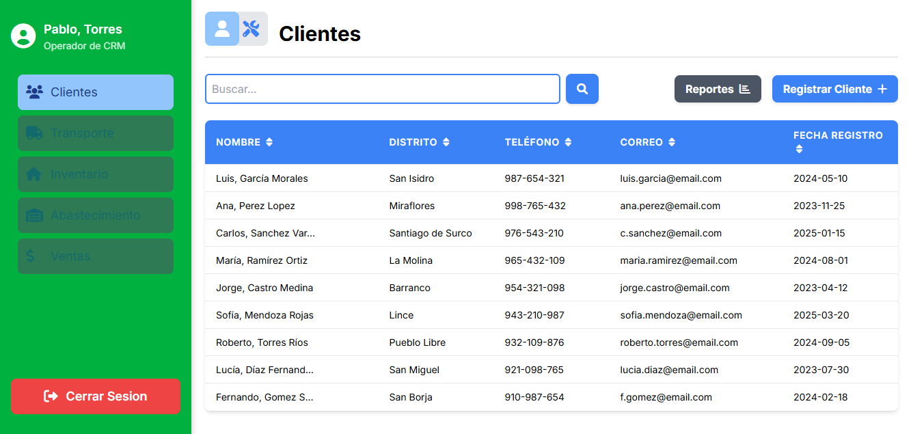 |

**Eventos:**

- Carga de Página:

    Se llenará la lista de clientes a seleccionar

    ```sql
    SELECT
    P.nombre_persona AS Nombre,
    D_LAT.distrito AS Distrito,
    T_LAT.valor_contacto AS Telefono,
    E_LAT.valor_contacto AS Correo,
    TO_CHAR(C.fecha_registro_cliente, 'YYYY-MM-DD') AS Fecha_Registro,
    P.COD_PERSONA 
  FROM
      MODULO_CLIENTES.CLIENTE C
  JOIN
      MODULO_CLIENTES.PERSONA P ON C.cod_persona = P.cod_persona

  LEFT JOIN LATERAL (
      SELECT D.distrito
      FROM MODULO_CLIENTES.DIRECCION_PERSONA DP
      JOIN MODULO_CLIENTES.DIRECCION D ON DP.cod_direccion = D.cod_direccion
      WHERE DP.cod_persona = P.cod_persona AND DP.PRINCIPAL_DIRECCION = TRUE
  ) AS D_LAT ON TRUE

  LEFT JOIN LATERAL (
      SELECT CO.valor_contacto
      FROM MODULO_CLIENTES.CONTACTO_PERSONA COP
      JOIN MODULO_CLIENTES.CONTACTO CO ON COP.cod_contacto = CO.cod_contacto
      JOIN MODULO_CLIENTES.TIPO_CONTACTO TC ON CO.cod_tipo_contacto = TC.cod_tipo_contacto
      WHERE COP.cod_persona = P.cod_persona
        AND TC.valor_tipo_contacto = 'TELEFONO CELULAR'
        AND COP.PRINCIPAL_CONTACTO = (SELECT COD_TIPO_CONTACTO FROM MODULO_CLIENTES.TIPO_CONTACTO WHERE valor_tipo_contacto = 'TELEFONO CELULAR')
  ) AS T_LAT ON TRUE

  LEFT JOIN LATERAL (
      SELECT CO.valor_contacto
      FROM MODULO_CLIENTES.CONTACTO_PERSONA COP
      JOIN MODULO_CLIENTES.CONTACTO CO ON COP.cod_contacto = CO.cod_contacto
      JOIN MODULO_CLIENTES.TIPO_CONTACTO TC ON CO.cod_tipo_contacto = TC.cod_tipo_contacto
      WHERE COP.cod_persona = P.cod_persona
        AND TC.valor_tipo_contacto = 'CORREO'
        AND COP.PRINCIPAL_CONTACTO = (SELECT COD_TIPO_CONTACTO FROM MODULO_CLIENTES.TIPO_CONTACTO WHERE valor_tipo_contacto = 'CORREO')
  ) AS E_LAT ON TRUE

  --POSIBLES FILTROS:
  --WHERE nombre_persona LIKE 'Pedro%'
  --WHERE distrito LIKE 'Cast%'
  --WHERE T_LAT.valor_contacto LIKE '90%'
  --WHERE E_LAT.valor_contacto LIKE 'da%'
  --WHERE TO_CHAR(M.FECHA_REGISTRO_MAESTRO , 'YYYY-MM-DD') LIKE '2025%'

  ORDER BY
      C.fecha_registro_cliente DESC;  
    ```

|Código Requerimiento |R-101|
|---|---|
|Código Interfaz| I-002|
|Imagen Interfaz| 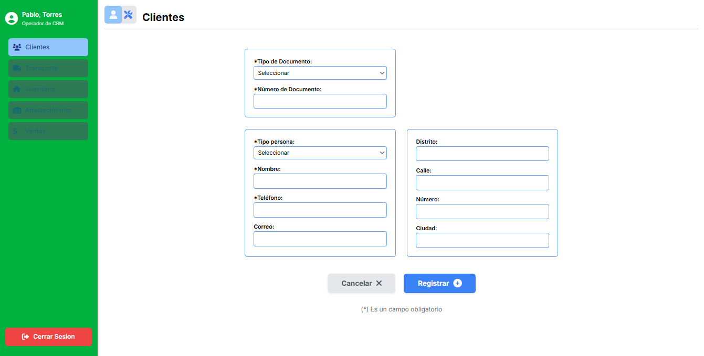 |

**Eventos:**

- Carga de Página:

    Se llenará las listas de tipos

    ```sql
  --LISTA DE TIPOS DE DOCUMENTO
  SELECT 
  TD.COD_TIPO_DOCUMENTO,
  TD.VALOR_TIPO_DOCUMENTO 
  FROM MODULO_CLIENTES.TIPO_DOCUMENTO TD;
  --LISTA DE TIPOS DE PERSONA
  SELECT 
  TP.COD_TIPO_PERSONA,
  TP.VALOR_TIPO_PERSONA 
  FROM MODULO_CLIENTES.TIPO_PERSONA TP;
  --LISTA DE TIPOS DE CONTACTO
  SELECT
  TC.COD_TIPO_CONTACTO,
  TC.VALOR_TIPO_CONTACTO 
  FROM MODULO_CLIENTES.TIPO_CONTACTO TC;
    ```
- Boton "Registrar":

    Se insertaran los datos en la DB

    ```sql
  --INSERTAN DATOS DE ENTIDAD PERSONA
  INSERT INTO MODULO_CLIENTES.PERSONA (COD_TIPO_PERSONA,NOMBRE_PERSONA)
  VALUES (?,?);
  --INSERTAN DATOS DE DOCUMENTO DE LA PERSONA
  INSERT INTO MODULO_CLIENTES.DOCUMENTO_PERSONA (COD_TIPO_DOCUMENTO,COD_PERSONA,VALOR_DOCUMENTO)
  VALUES(?,?,?);
  --INSERTAN DATOS DE CONTACTO DE LA PERSONA
  INSERT INTO MODULO_CLIENTES.CONTACTO (COD_TIPO_CONTACTO,VALOR_CONTACTO)
  VALUES (?,?),
  (?,?);
  --INSERTAN RELACION CONTACTO-PERSONA
  INSERT INTO MODULO_CLIENTES.CONTACTO_PERSONA (COD_CONTACTO,COD_PERSONA,PRINCIPAL_CONTACTO)
  VALUES (?,?,?),
  (?,?,?);
  --INSERTAN DATOS DE DIRECCION DE LA PERSONA
  INSERT INTO MODULO_CLIENTES.DIRECCION (CIUDAD,DISTRITO,VIA,NUMERO)
  VALUES(?,?,?,?);
  --INSERTAN RELACION DIRECCION-PERSONA
  INSERT INTO MODULO_CLIENTES.DIRECCION_PERSONA (COD_DIRECCION,COD_PERSONA,PRINCIPAL_DIRECCION)
  VALUES (?,?,?);
    ```

|Código Requerimiento |R-103|
|---|---|
|Código Interfaz| I-003|
|Imagen Interfaz| 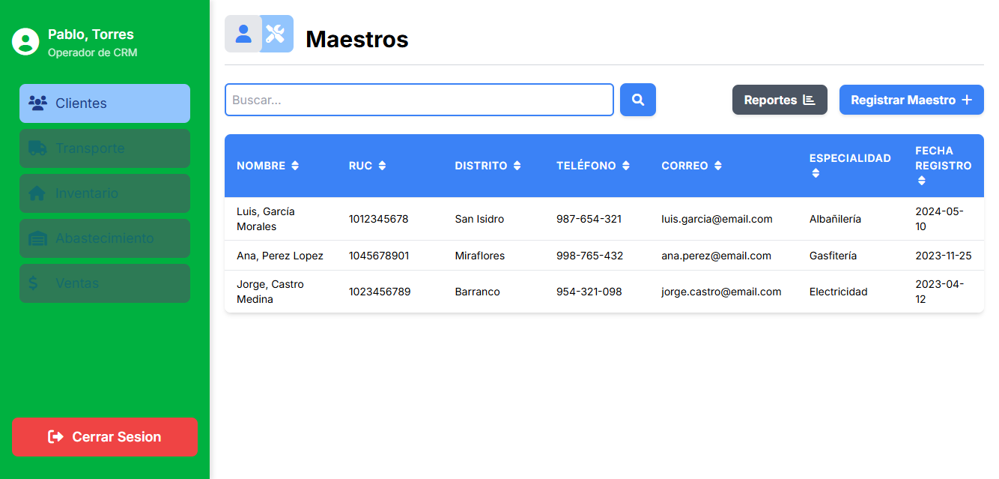 |

**Eventos:**

- Carga de Página:

    Se llenará la lista de maestros a seleccionar

    ```sql
  SELECT
      P.nombre_persona AS Nombre,
      M.ruc AS RUC,
      D_LAT.distrito AS Distrito,
      T_LAT.valor_contacto AS Telefono,
      E_LAT.valor_contacto AS Correo,
      ES_LAT.valor_especialidad AS Especialidad,
      TO_CHAR(M.FECHA_REGISTRO_MAESTRO , 'YYYY-MM-DD') AS Fecha_Registro,
      P.COD_PERSONA 
  FROM
      MODULO_CLIENTES.MAESTRO M
  JOIN
      MODULO_CLIENTES.PERSONA P ON M.cod_persona = P.cod_persona


  LEFT JOIN LATERAL (
      SELECT D.distrito
      FROM MODULO_CLIENTES.DIRECCION_PERSONA DP
      JOIN MODULO_CLIENTES.DIRECCION D ON DP.cod_direccion = D.cod_direccion
      WHERE DP.cod_persona = P.cod_persona AND DP.PRINCIPAL_DIRECCION = TRUE
  ) AS D_LAT ON TRUE

  LEFT JOIN LATERAL (
      SELECT CO.valor_contacto
      FROM MODULO_CLIENTES.CONTACTO_PERSONA COP
      JOIN MODULO_CLIENTES.CONTACTO CO ON COP.cod_contacto = CO.cod_contacto
      JOIN MODULO_CLIENTES.TIPO_CONTACTO TC ON CO.cod_tipo_contacto = TC.cod_tipo_contacto
      WHERE COP.cod_persona = P.cod_persona
        AND TC.valor_tipo_contacto = 'TELEFONO CELULAR'
        AND COP.PRINCIPAL_CONTACTO = (SELECT COD_TIPO_CONTACTO FROM MODULO_CLIENTES.TIPO_CONTACTO WHERE valor_tipo_contacto = 'TELEFONO CELULAR')
  ) AS T_LAT ON TRUE

  LEFT JOIN LATERAL (
      SELECT CO.valor_contacto
      FROM MODULO_CLIENTES.CONTACTO_PERSONA COP
      JOIN MODULO_CLIENTES.CONTACTO CO ON COP.cod_contacto = CO.cod_contacto
      JOIN MODULO_CLIENTES.TIPO_CONTACTO TC ON CO.cod_tipo_contacto = TC.cod_tipo_contacto
      WHERE COP.cod_persona = P.cod_persona
        AND TC.valor_tipo_contacto = 'CORREO'
        AND COP.PRINCIPAL_CONTACTO = (SELECT COD_TIPO_CONTACTO FROM MODULO_CLIENTES.TIPO_CONTACTO WHERE valor_tipo_contacto = 'CORREO')
  ) AS E_LAT ON TRUE

  LEFT JOIN LATERAL (
      SELECT ES.valor_especialidad
      FROM MODULO_CLIENTES.ESPECIALIDADES ES
      WHERE M.cod_especialidad = ES.cod_especialidad
  ) AS ES_LAT ON TRUE


  --POSIBLES FILTROS:
  --WHERE nombre_persona LIKE 'Pedro%'
  --WHERE ruc LIKE '10%'
  --WHERE distrito LIKE 'Cast%'
  --WHERE T_LAT.valor_contacto LIKE '90%'
  --WHERE E_LAT.valor_contacto LIKE 'da%'
  --WHERE valor_especialidad LIKE 'Ci%'
  --WHERE TO_CHAR(M.FECHA_REGISTRO_MAESTRO , 'YYYY-MM-DD') LIKE '2025%'

  ORDER BY
      M.FECHA_REGISTRO_MAESTRO DESC;
    ```


|Código Requerimiento |R-102|
|---|---|
|Código Interfaz| I-004|
|Imagen Interfaz| 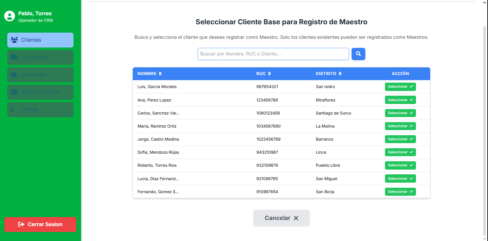 |

**Eventos:**

- Carga de Página:

    Se llenará la lista de clientes a seleccionar

    ```sql
    SELECT
    P.nombre_persona AS Nombre,
    D_LAT.distrito AS Distrito,
    T_LAT.valor_contacto AS Telefono,
    E_LAT.valor_contacto AS Correo,
    TO_CHAR(C.fecha_registro_cliente, 'YYYY-MM-DD') AS Fecha_Registro,
    P.COD_PERSONA 
  FROM
      MODULO_CLIENTES.CLIENTE C
  JOIN
      MODULO_CLIENTES.PERSONA P ON C.cod_persona = P.cod_persona

  LEFT JOIN LATERAL (
      SELECT D.distrito
      FROM MODULO_CLIENTES.DIRECCION_PERSONA DP
      JOIN MODULO_CLIENTES.DIRECCION D ON DP.cod_direccion = D.cod_direccion
      WHERE DP.cod_persona = P.cod_persona AND DP.PRINCIPAL_DIRECCION = TRUE
  ) AS D_LAT ON TRUE

  LEFT JOIN LATERAL (
      SELECT CO.valor_contacto
      FROM MODULO_CLIENTES.CONTACTO_PERSONA COP
      JOIN MODULO_CLIENTES.CONTACTO CO ON COP.cod_contacto = CO.cod_contacto
      JOIN MODULO_CLIENTES.TIPO_CONTACTO TC ON CO.cod_tipo_contacto = TC.cod_tipo_contacto
      WHERE COP.cod_persona = P.cod_persona
        AND TC.valor_tipo_contacto = 'TELEFONO CELULAR'
        AND COP.PRINCIPAL_CONTACTO = (SELECT COD_TIPO_CONTACTO FROM MODULO_CLIENTES.TIPO_CONTACTO WHERE valor_tipo_contacto = 'TELEFONO CELULAR')
  ) AS T_LAT ON TRUE

  LEFT JOIN LATERAL (
      SELECT CO.valor_contacto
      FROM MODULO_CLIENTES.CONTACTO_PERSONA COP
      JOIN MODULO_CLIENTES.CONTACTO CO ON COP.cod_contacto = CO.cod_contacto
      JOIN MODULO_CLIENTES.TIPO_CONTACTO TC ON CO.cod_tipo_contacto = TC.cod_tipo_contacto
      WHERE COP.cod_persona = P.cod_persona
        AND TC.valor_tipo_contacto = 'CORREO'
        AND COP.PRINCIPAL_CONTACTO = (SELECT COD_TIPO_CONTACTO FROM MODULO_CLIENTES.TIPO_CONTACTO WHERE valor_tipo_contacto = 'CORREO')
  ) AS E_LAT ON TRUE

  --POSIBLES FILTROS:
  --WHERE nombre_persona LIKE 'Pedro%'
  --WHERE distrito LIKE 'Cast%'
  --WHERE T_LAT.valor_contacto LIKE '90%'
  --WHERE E_LAT.valor_contacto LIKE 'da%'
  --WHERE TO_CHAR(M.FECHA_REGISTRO_MAESTRO , 'YYYY-MM-DD') LIKE '2025%'

  ORDER BY
      C.fecha_registro_cliente DESC;  
    ```


|Código Requerimiento |R-102|
|---|---|
|Código Interfaz| I-005|
|Imagen Interfaz| 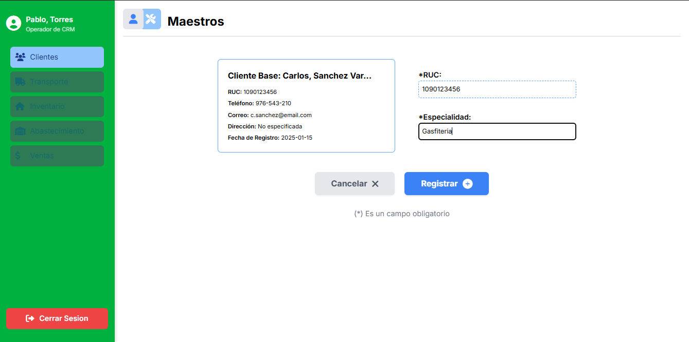 |

**Eventos:**

- Carga de Página:

    Se obtendra la informacion del cliente, ID de RUC y especialidades

    ```sql
  --OBTENER SUS DOCUMENTOS
  SELECT 
    TD.valor_tipo_documento,
    DP.valor_documento
  FROM MODULO_CLIENTES.PERSONA P 
  JOIN MODULO_CLIENTES.DOCUMENTO_PERSONA DP ON P.COD_PERSONA = DP.COD_PERSONA 
  JOIN MODULO_CLIENTES.TIPO_DOCUMENTO TD ON TD.COD_TIPO_DOCUMENTO = DP.COD_TIPO_DOCUMENTO 
  WHERE P.COD_PERSONA = ?;
  --OBTENER SUS CONTACTOS
  SELECT 
    TC.VALOR_TIPO_CONTACTO,
    C.VALOR_CONTACTO 
  FROM MODULO_CLIENTES.PERSONA P 
  JOIN MODULO_CLIENTES.CONTACTO_PERSONA COP ON COP.COD_PERSONA = P.COD_PERSONA  
  JOIN MODULO_CLIENTES.CONTACTO C ON C.COD_CONTACTO = COP.COD_CONTACTO 
  JOIN MODULO_CLIENTES.TIPO_CONTACTO TC ON C.COD_TIPO_CONTACTO = TC.COD_TIPO_CONTACTO 
  WHERE P.COD_PERSONA = ? AND COP.PRINCIPAL_CONTACTO IS NOT NULL;
  --OBTENER SUS DIRECCIONES
  SELECT 
    D.DISTRITO ||', '|| D.CIUDAD ||', '|| D.VIA ||' '|| D.NUMERO AS DIRECCION
  FROM MODULO_CLIENTES.PERSONA P 
  JOIN MODULO_CLIENTES.DIRECCION_PERSONA DP ON DP.COD_PERSONA = P.COD_PERSONA  
  JOIN MODULO_CLIENTES.DIRECCION D  ON D.COD_DIRECCION = DP.COD_DIRECCION 
  WHERE P.COD_PERSONA = ? AND DP.PRINCIPAL_DIRECCION IS NOT NULL;
  --OBTENER SUS DATOS DE REGISTRO
  SELECT
    P.NOMBRE_PERSONA,
    C.FECHA_REGISTRO_CLIENTE,
    C.ULTIMA_ACTIVIDAD_CLIENTE,
    C.COD_CLIENTE 
  FROM MODULO_CLIENTES.PERSONA P
  JOIN MODULO_CLIENTES.CLIENTE C ON C.COD_PERSONA = P.COD_PERSONA
  WHERE P.COD_PERSONA = ?;


    --OBTENER ID DE RUC
  SELECT
  TD.COD_TIPO_DOCUMENTO 
  FROM  MODULO_CLIENTES.TIPO_DOCUMENTO TD 
  WHERE TD.VALOR_TIPO_DOCUMENTO = 'RUC';
  --OBTENER ESPECIALIDADES
  SELECT 
  E.COD_ESPECIALIDAD,
  E.VALOR_ESPECIALIDAD 
  FROM MODULO_CLIENTES.ESPECIALIDADES E;

    ```
- Boton "Registrar":

    Se insertaran los datos en la DB

    ```sql
  --INSERTAR RUC (SI ES NECESARIO)
  INSERT INTO MODULO_CLIENTES.DOCUMENTO_PERSONA (COD_PERSONA,COD_TIPO_DOCUMENTO,PRINCIPAL_DOCUMENTO,VALOR_DOCUMENTO)
  VALUES (?,?,?,?);
  --REGISTRAR COMO MAESTRO
  INSERT INTO MODULO_CLIENTES.MAESTRO (COD_CLIENTE,COD_ESPECIALIDAD,COD_PERSONA,RUC)
  VALUES (?,?,?,?);

    ```


|Código Requerimiento |R-104|
|---|---|
|Código Interfaz| I-006|
|Imagen Interfaz| 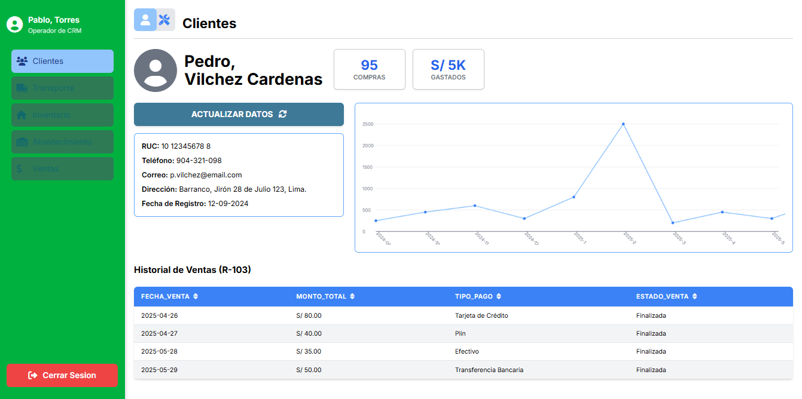 |

**Eventos:**

- Carga de Página:

    Se obtendra la informacion del cliente e historial de compras

    ```sql
  --OBTENER SUS DOCUMENTOS
  SELECT 
    TD.valor_tipo_documento,
    DP.valor_documento
  FROM MODULO_CLIENTES.PERSONA P 
  JOIN MODULO_CLIENTES.DOCUMENTO_PERSONA DP ON P.COD_PERSONA = DP.COD_PERSONA 
  JOIN MODULO_CLIENTES.TIPO_DOCUMENTO TD ON TD.COD_TIPO_DOCUMENTO = DP.COD_TIPO_DOCUMENTO 
  WHERE P.COD_PERSONA = ?;
  --OBTENER SUS CONTACTOS
  SELECT 
    TC.VALOR_TIPO_CONTACTO,
    C.VALOR_CONTACTO 
  FROM MODULO_CLIENTES.PERSONA P 
  JOIN MODULO_CLIENTES.CONTACTO_PERSONA COP ON COP.COD_PERSONA = P.COD_PERSONA  
  JOIN MODULO_CLIENTES.CONTACTO C ON C.COD_CONTACTO = COP.COD_CONTACTO 
  JOIN MODULO_CLIENTES.TIPO_CONTACTO TC ON C.COD_TIPO_CONTACTO = TC.COD_TIPO_CONTACTO 
  WHERE P.COD_PERSONA = ? AND COP.PRINCIPAL_CONTACTO IS NOT NULL;
  --OBTENER SUS DIRECCIONES
  SELECT 
    D.DISTRITO ||', '|| D.CIUDAD ||', '|| D.VIA ||' '|| D.NUMERO AS DIRECCION
  FROM MODULO_CLIENTES.PERSONA P 
  JOIN MODULO_CLIENTES.DIRECCION_PERSONA DP ON DP.COD_PERSONA = P.COD_PERSONA  
  JOIN MODULO_CLIENTES.DIRECCION D  ON D.COD_DIRECCION = DP.COD_DIRECCION 
  WHERE P.COD_PERSONA = ? AND DP.PRINCIPAL_DIRECCION IS NOT NULL;
  --OBTENER SUS DATOS DE REGISTRO
  SELECT
    P.NOMBRE_PERSONA,
    C.FECHA_REGISTRO_CLIENTE,
    C.ULTIMA_ACTIVIDAD_CLIENTE,
    C.COD_CLIENTE 
  FROM MODULO_CLIENTES.PERSONA P
  JOIN MODULO_CLIENTES.CLIENTE C ON C.COD_PERSONA = P.COD_PERSONA
  WHERE P.COD_PERSONA = ?;


  --DATOS DE COMPRAS POR MES
  SELECT
    EXTRACT(YEAR FROM V.FECHA_HORA_VENTA) || '-' || EXTRACT(MONTH FROM V.FECHA_HORA_VENTA) AS MES,
    COUNT(*) AS "NUMERO DE COMPRAS"
  FROM MODULO_CLIENTES.PERSONA P 
  JOIN MODULO_CLIENTES.CLIENTE C ON P.COD_PERSONA =C.COD_PERSONA 
  JOIN MODULO_CLIENTES.VENTA V ON C.COD_CLIENTE = V.COD_CLIENTE 
  WHERE P.COD_PERSONA = ?
  GROUP BY
    EXTRACT(YEAR FROM V.FECHA_HORA_VENTA),
      EXTRACT(MONTH FROM V.FECHA_HORA_VENTA)
  ORDER BY MES


  --REGISTRO DE COMPRAS
  SELECT
    V.FECHA_HORA_VENTA AS FECHA,
    V.MONTO_VENTA AS MONTO,
    V.TIPO_VENTA AS TIPO
  FROM MODULO_CLIENTES.PERSONA P 
  JOIN MODULO_CLIENTES.CLIENTE C ON P.COD_PERSONA =C.COD_PERSONA 
  JOIN MODULO_CLIENTES.VENTA V ON C.COD_CLIENTE = V.COD_CLIENTE 
  WHERE P.COD_PERSONA = ?
  --LIMIT N


  --HISTORICO DE GASTOS
  SELECT 
  COUNT(V.COD_VENTA) AS COMPRAS,
  SUM(V.MONTO_VENTA) AS GASTADO
  FROM MODULO_CLIENTES.CLIENTE C 
  JOIN MODULO_CLIENTES.VENTA V ON C.COD_CLIENTE = V.COD_CLIENTE 
  JOIN MODULO_CLIENTES.PERSONA P ON C.COD_PERSONA = P.COD_PERSONA 
  GROUP BY P.NOMBRE_PERSONA 
  HAVING P.COD_PERSONA = ?

    ```


|Código Requerimiento |R-104|
|---|---|
|Código Interfaz| I-007|
|Imagen Interfaz| 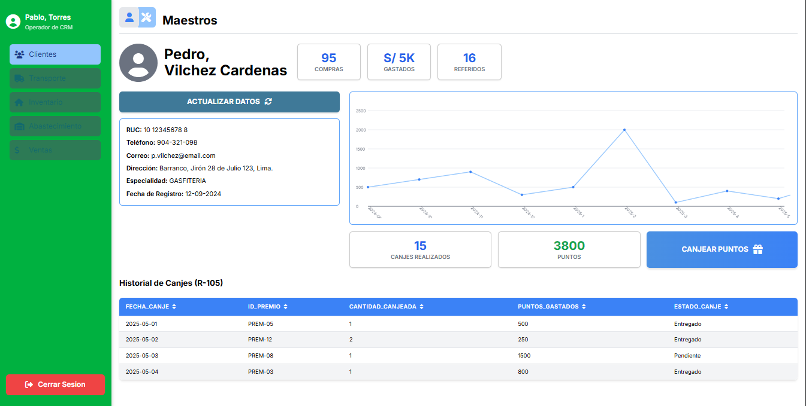 |

**Eventos:**

- Carga de Página:

    Se obtendra la informacion del maestro e historial de canjes

    ```sql
  --DATOS DE PERFIL MAESTRO
  SELECT 
    TD.valor_tipo_documento,
    DP.valor_documento
  FROM MODULO_CLIENTES.MAESTRO M 
  JOIN MODULO_CLIENTES.PERSONA P ON M.COD_PERSONA = P.COD_PERSONA 
  JOIN MODULO_CLIENTES.DOCUMENTO_PERSONA DP ON P.COD_PERSONA = DP.COD_PERSONA 
  JOIN MODULO_CLIENTES.TIPO_DOCUMENTO TD ON TD.COD_TIPO_DOCUMENTO = DP.COD_TIPO_DOCUMENTO 
  WHERE P.COD_PERSONA = ? AND TD.VALOR_TIPO_DOCUMENTO = 'RUC';
 
  --OBTENER SUS CONTACTOS
  SELECT 
    TC.VALOR_TIPO_CONTACTO,
    C.VALOR_CONTACTO 
  FROM MODULO_CLIENTES.MAESTRO M 
  JOIN MODULO_CLIENTES.PERSONA P ON M.COD_PERSONA = P.COD_PERSONA 
  JOIN MODULO_CLIENTES.CONTACTO_PERSONA COP ON COP.COD_PERSONA = P.COD_PERSONA  
  JOIN MODULO_CLIENTES.CONTACTO C ON C.COD_CONTACTO = COP.COD_CONTACTO 
  JOIN MODULO_CLIENTES.TIPO_CONTACTO TC ON C.COD_TIPO_CONTACTO = TC.COD_TIPO_CONTACTO 
  WHERE P.COD_PERSONA = ? AND COP.PRINCIPAL_CONTACTO IS NOT NULL;
 
  --OBTENER SUS DATOS DE REGISTRO
    SELECT 
    D.DISTRITO ||', '|| D.CIUDAD ||', '|| D.VIA ||' '|| D.NUMERO AS DIRECCION
  FROM MODULO_CLIENTES.PERSONA P
  JOIN MODULO_CLIENTES.MAESTRO M ON P.COD_PERSONA = M.COD_PERSONA 
  JOIN MODULO_CLIENTES.DIRECCION_PERSONA DP ON DP.COD_PERSONA = P.COD_PERSONA  
  JOIN MODULO_CLIENTES.DIRECCION D  ON D.COD_DIRECCION = DP.COD_DIRECCION 
  WHERE P.COD_PERSONA = ? AND DP.PRINCIPAL_DIRECCION IS NOT NULL;
  
  --OBTENER DATOS DE REGISTRO
  SELECT
	P.NOMBRE_PERSONA,
	M.FECHA_REGISTRO_MAESTRO  
  FROM MODULO_CLIENTES.PERSONA P
  JOIN MODULO_CLIENTES.MAESTRO M ON P.COD_PERSONA = M.COD_PERSONA 
  WHERE P.COD_PERSONA = ?;

  --OBTENER SU ESPECIALIDAD
  SELECT 
  E.VALOR_ESPECIALIDAD 
  FROM MODULO_CLIENTES.MAESTRO M 
  JOIN MODULO_CLIENTES.ESPECIALIDADES E ON E.COD_ESPECIALIDAD = M.COD_ESPECIALIDAD 
  WHERE M.COD_PERSONA = ?;

  --DATOS DE CANJES POR MES
  SELECT
    EXTRACT(YEAR FROM CA.FECHA_HORA_CANJE) || '-' || EXTRACT(MONTH FROM CA.FECHA_HORA_CANJE) AS MES,
    COUNT(*) AS "NUMERO DE COMPRAS"
  FROM MODULO_CLIENTES.MAESTRO M
  JOIN MODULO_CLIENTES.PERSONA P ON M.COD_PERSONA = P.COD_PERSONA
  JOIN MODULO_CLIENTES.CANJE CA ON M.COD_MAESTRO = CA.COD_MAESTRO 
  WHERE P.COD_PERSONA = ?
  GROUP BY
    EXTRACT(YEAR FROM CA.FECHA_HORA_CANJE),
      EXTRACT(MONTH FROM CA.FECHA_HORA_CANJE)
  ORDER BY MES;

  --REGISTRO DE CANJES
  SELECT
    CA.FECHA_HORA_CANJE AS FECHA,
    P.NOMBRE_PREMIO AS PREMIO,
    DC.CANTIDAD_PREMIO AS CANTIDAD,
    (DC.CANTIDAD_PREMIO * P.PUNTOS_PREMIO) AS MONTO,
    EC.VALOR_ESTADO_CANJE AS ESTADO
  FROM MODULO_CLIENTES.MAESTRO M 
  JOIN MODULO_CLIENTES.PERSONA PE ON PE.COD_PERSONA = M.COD_PERSONA 
  JOIN MODULO_CLIENTES.CANJE CA ON M.COD_MAESTRO = CA.COD_MAESTRO
  JOIN MODULO_CLIENTES.DETALLE_CANJE DC ON DC.COD_CANJE = CA.COD_CANJE 
  JOIN MODULO_CLIENTES.PREMIOS P ON DC.COD_PREMIO = P.COD_PREMIO
  JOIN MODULO_CLIENTES.ESTADO_CANJE EC ON EC.COD_ESTADO_CANJE = CA.COD_ESTADO_CANJE 
  WHERE P.COD_PERSONA = ?;
  --LIMIT N

  --PUNTOS DEL MAESTRO 
  SELECT M.PUNTOS_MAESTRO 
  FROM MODULO_CLIENTES.MAESTRO M 
  JOIN MODULO_CLIENTES.PERSONA P ON M.COD_PERSONA = P.COD_PERSONA 
  WHERE P.COD_PERSONA = ?;

  --HISTORICO DE CANJES
  SELECT 
  COUNT(C.*) AS REFERIDOS
  FROM MODULO_CLIENTES.MAESTRO M 
  JOIN MODULO_CLIENTES.PERSONA P ON M.COD_PERSONA  = P.COD_PERSONA 
  JOIN MODULO_CLIENTES.CANJE C ON C.COD_MAESTRO = M.COD_MAESTRO 
  GROUP BY P.NOMBRE_PERSONA 
  HAVING P.COD_PERSONA = ?;

  --HISTORICO DE REFERIDOS
  SELECT
  COUNT(V.*) AS REFERIDOS
  FROM MODULO_CLIENTES.MAESTRO M 
  JOIN MODULO_CLIENTES.PERSONA P ON M.COD_PERSONA  = P.COD_PERSONA 
  JOIN MODULO_CLIENTES.VENTA V ON V.COD_MAESTRO = M.COD_MAESTRO 
  GROUP BY P.NOMBRE_PERSONA 
  HAVING P.COD_PERSONA = ?;

    ```


|Código Requerimiento |R-104|
|---|---|
|Código Interfaz| I-008|
|Imagen Interfaz| 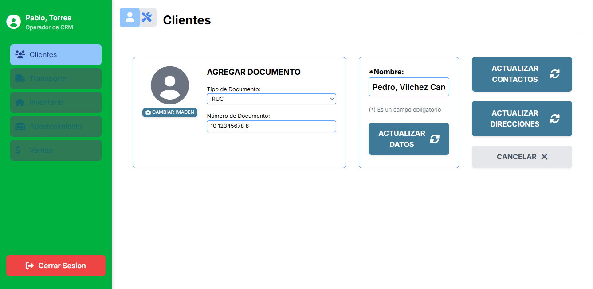 |

**Eventos:**

- Carga de Página:

    Se obtendra la informacion de tipo de documento y de nombre

    ```sql
  --LISTA DE TIPOS DE DOCUMENTO
  SELECT 
  TD.COD_TIPO_DOCUMENTO,
  TD.VALOR_TIPO_DOCUMENTO 
  FROM MODULO_CLIENTES.TIPO_DOCUMENTO TD;
  --OBTENER NOMBRE ACTUAL
  SELECT
    P.NOMBRE_PERSONA
  FROM MODULO_CLIENTES.PERSONA P
  WHERE P.COD_PERSONA = ?;
    ```
- Boton actualizar datos:

    Se actualizaran los datos

    ```sql
  --ACTUALIZAR NOMBRE
  UPDATE MODULO_CLIENTES.PERSONA P 
  SET NOMBRE_PERSONA = ?
  WHERE P.COD_PERSONA = ?;
  --INSERTAN DATOS DE DOCUMENTO DE LA PERSONA
  INSERT INTO MODULO_CLIENTES.DOCUMENTO_PERSONA (COD_TIPO_DOCUMENTO,COD_PERSONA,VALOR_DOCUMENTO)
  VALUES(?,?,?);
    ```

|Código Requerimiento |R-104|
|---|---|
|Código Interfaz| I-009|
|Imagen Interfaz| 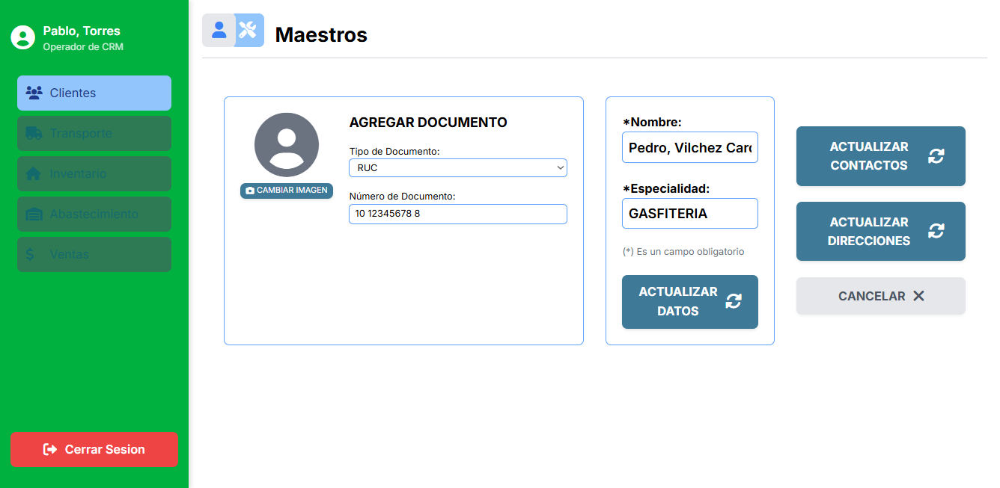 |

**Eventos:**

- Carga de Página:

    Se obtendra la informacion de tipo de documento, nombre y especialidad

    ```sql
  --LISTA DE TIPOS DE DOCUMENTO
  SELECT 
  TD.COD_TIPO_DOCUMENTO,
  TD.VALOR_TIPO_DOCUMENTO 
  FROM MODULO_CLIENTES.TIPO_DOCUMENTO TD;
  --OBTENER NOMBRE ACTUAL
  SELECT
    P.NOMBRE_PERSONA
  FROM MODULO_CLIENTES.PERSONA P
  WHERE P.COD_PERSONA = ?;
  --OBTENER SU ESPECIALIDAD
  SELECT 
  E.VALOR_ESPECIALIDAD 
  FROM MODULO_CLIENTES.MAESTRO M 
  JOIN MODULO_CLIENTES.ESPECIALIDADES E ON E.COD_ESPECIALIDAD = M.COD_ESPECIALIDAD 
  WHERE M.COD_PERSONA = ?;

    ```
- Boton actualizar datos:

    Se actualizaran los datos

    ```sql
  --ACTUALIZAR NOMBRE
  UPDATE MODULO_CLIENTES.PERSONA P 
  SET NOMBRE_PERSONA = ?
  WHERE P.COD_PERSONA = ?;
  --INSERTAN DATOS DE DOCUMENTO DE LA PERSONA
  INSERT INTO MODULO_CLIENTES.DOCUMENTO_PERSONA (COD_TIPO_DOCUMENTO,COD_PERSONA,VALOR_DOCUMENTO)
  VALUES(?,?,?);
  --ACTUALIZAR ESPECIALIDAD
  UPDATE MODULO_CLIENTES.MAESTRO M  
  SET COD_ESPECIALIDAD = ?
  WHERE M.COD_PERSONA = ?;
    ```


|Código Requerimiento |R-104|
|---|---|
|Código Interfaz| I-010|
|Imagen Interfaz| 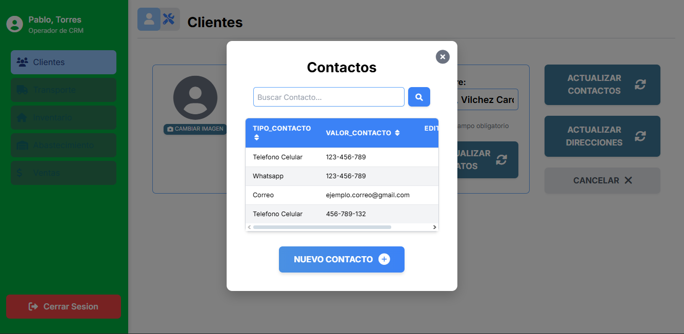 |

**Eventos:**

- Carga de Página:

    Se obtendra la lista de contactos de la persona

    ```sql
  --CONTACTOS POR PERSONA
  SELECT 
  TC.VALOR_TIPO_CONTACTO AS TIPO_CONTACTO,
  C.VALOR_CONTACTO
  FROM MODULO_CLIENTES.PERSONA P 
  JOIN MODULO_CLIENTES.CONTACTO_PERSONA COP ON COP.COD_PERSONA =P.COD_PERSONA 
  JOIN MODULO_CLIENTES.CONTACTO C ON C.COD_CONTACTO =COP.COD_CONTACTO 
  JOIN MODULO_CLIENTES.TIPO_CONTACTO TC ON TC.COD_TIPO_CONTACTO = C.COD_TIPO_CONTACTO 
  WHERE P.COD_PERSONA = ?;
    ```


|Código Requerimiento |R-104|
|---|---|
|Código Interfaz| I-011|
|Imagen Interfaz| 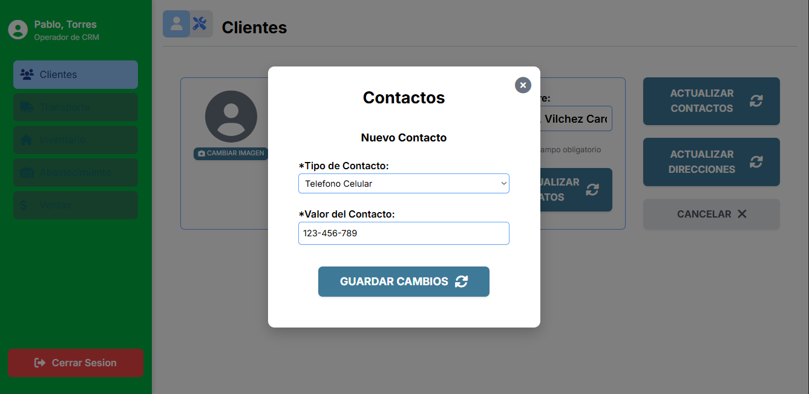 |

**Eventos:**

- Carga de Página:

    Se obtendra la lista de tipos de contacto

    ```sql
  --TIPOS DE CONTACTO
  SELECT 
  TC.COD_TIPO_CONTACTO,
  TC.VALOR_TIPO_CONTACTO 
  FROM MODULO_CLIENTES.TIPO_CONTACTO TC 
    ```
- Boton guardar cambios:

    Se registrara el contacto

    ```sql
  --INSERTAR EL CONTACTO
  INSERT INTO MODULO_CLIENTES.CONTACTO (COD_TIPO_CONTACTO,VALOR_CONTACTO)
  VALUES (?,?);
  --INSERTAR LA RELACION CONTACTO_PERSONA
  INSERT INTO MODULO_CLIENTES.CONTACTO_PERSONA (COD_CONTACTO,COD_CONTACTO,PRINCIPAL_CONTACTO)
  VALUES (?,?,?);
    ```


|Código Requerimiento |R-104|
|---|---|
|Código Interfaz| I-012|
|Imagen Interfaz| 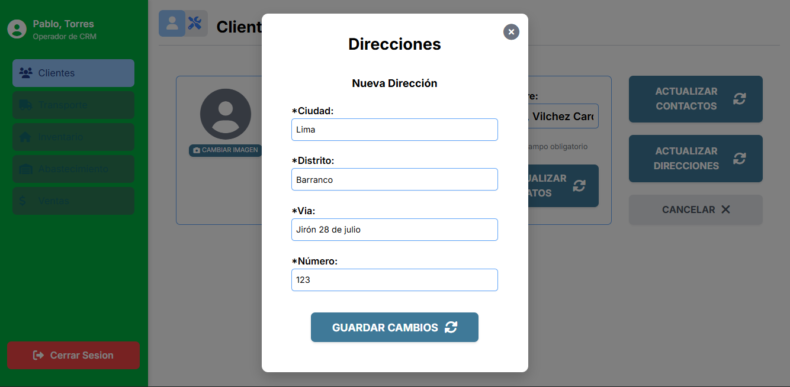 |

**Eventos:**

- Boton guardar cambios:

    Se registrara el contacto

    ```sql
  --INSERTAR LA DIRECCION
  INSERT INTO MODULO_CLIENTES.DIRECCION (CIUDAD,DISTRITO,VIA,NUMERO)
  VALUES (?,?,?,?);
  --INSERTAR LA RELACION DIRECCION_PERSONA
  INSERT INTO MODULO_CLIENTES.DIRECCION_PERSONA (COD_DIRECCION,COD_PERSONA,PRINCIPAL_DIRECCION)
  VALUES(?,?,?);
    ```


|Código Requerimiento |R-104|
|---|---|
|Código Interfaz| I-013|
|Imagen Interfaz| 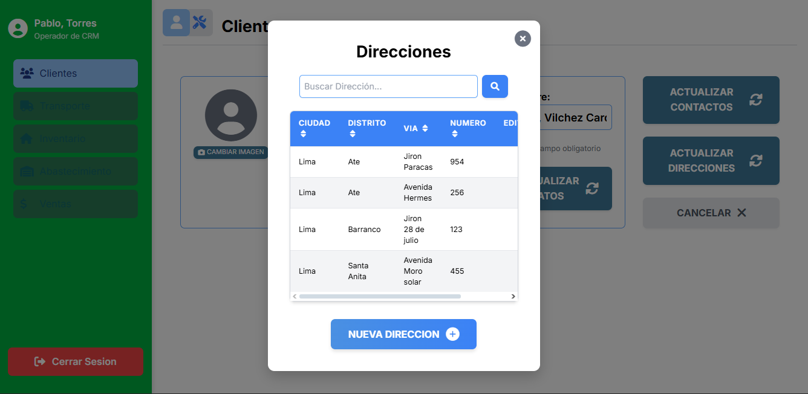 |

**Eventos:**

- Carga de Página:

    Se obtendra la lista de direcciones de la persona

    ```sql
  --DIRECCIONES POR PERSONA
  SELECT
  D.DISTRITO,
  D.CIUDAD,
  D.NUMERO,
  D.VIA 
  FROM MODULO_CLIENTES.PERSONA P 
  JOIN MODULO_CLIENTES.DIRECCION_PERSONA DP ON DP.COD_PERSONA = P.COD_PERSONA 
  JOIN MODULO_CLIENTES.DIRECCION D ON D.COD_DIRECCION = DP.COD_DIRECCION 
  WHERE P.COD_PERSONA = ?;
    ```


|Código Requerimiento |R-105|
|---|---|
|Código Interfaz| I-014|
|Imagen Interfaz| 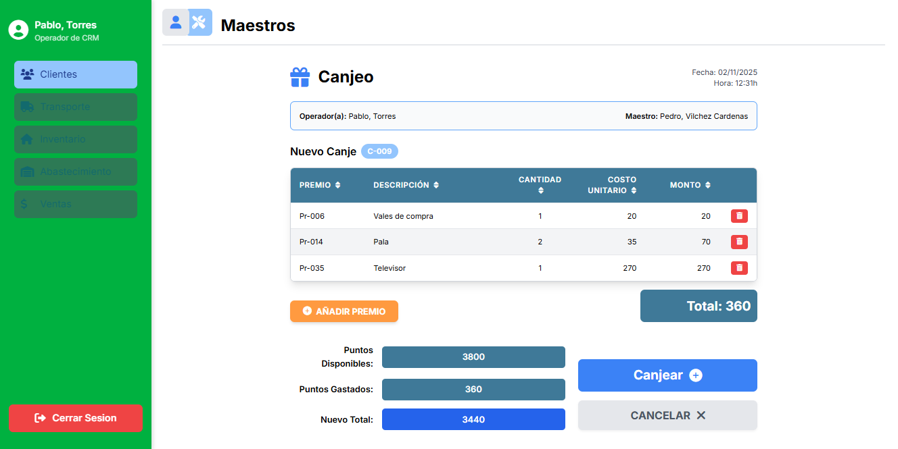 |

**Eventos:**

- Carga de Página:

    Se obtendra la informacion del operador y maestro

    ```sql
  --INFORMACION DE OPERADOR
  SELECT 
  P.NOMBRE_PERSONA,
  A.VALOR_AREA,
  R.VALOR_ROL 
  FROM MODULO_CLIENTES.USUARIO U 
  JOIN MODULO_CLIENTES.AREA A ON U.COD_AREA = A.COD_AREA 
  JOIN MODULO_CLIENTES.ROL R ON R.COD_ROL = U.COD_ROL 
  JOIN MODULO_CLIENTES.PERSONA P ON P.COD_PERSONA = U.COD_PERSONA 
  WHERE U.COD_USUARIO = ?;
  --INFORMACION DEL MAESTRO 
  SELECT
  M.PUNTOS_MAESTRO,
  P.NOMBRE_PERSONA 
  FROM MODULO_CLIENTES.MAESTRO M 
  JOIN MODULO_CLIENTES.PERSONA P ON M.COD_PERSONA = P.COD_PERSONA 
  WHERE P.COD_PERSONA = ?;
    ```
- Boton canjear:

    Se registran los datos

    ```sql
  --INSERTAR EL CANJE
  INSERT INTO MODULO_CLIENTES.CANJE (COD_ESTADO_CANJE,COD_MAESTRO,COD_USUARIO,MONTO_CANJE)
  VALUES (?,?,?,?)
  RETURNING COD_CANJE;

  --INSERTAR EL DETALLE
  INSERT INTO MODULO_CLIENTES.DETALLE_CANJE (CANTIDAD_PREMIO,COD_CANJE,COD_PREMIO)
  VALUES (?,?,?);
    ```

|Código Requerimiento |R-105|
|---|---|
|Código Interfaz| I-015|
|Imagen Interfaz| 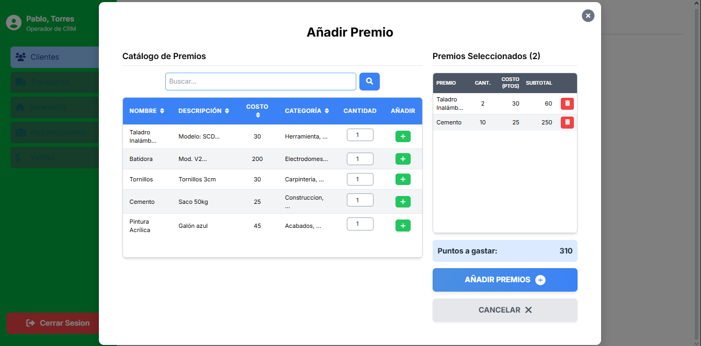 |

**Eventos:**

- Carga de Página:

    Se obtendra la informacion de premios

    ```sql
  --LISTA DE PREMIOS
  SELECT 
  P.NOMBRE_PREMIO AS NOMBRE,
  P.DESCP_PREMIO AS DESCRIPCION,
  P.PUNTOS_PREMIO AS COSTO,
  STRING_AGG(C.VALOR_CATEGORIA, ', ') AS CATEGORIAS
  FROM MODULO_CLIENTES.PREMIOS P 
  JOIN MODULO_CLIENTES.CATEGORIAS_PREMIO CAP ON CAP.COD_PREMIO = P.COD_PREMIO 
  JOIN MODULO_CLIENTES.CATEGORIA C ON CAP.COD_CATEGORIA = C.COD_CATEGORIA 
  GROUP BY P.COD_PREMIO 
    ```


|Código Requerimiento |R-106|
|---|---|
|Código Interfaz| I-016|
|Imagen Interfaz| 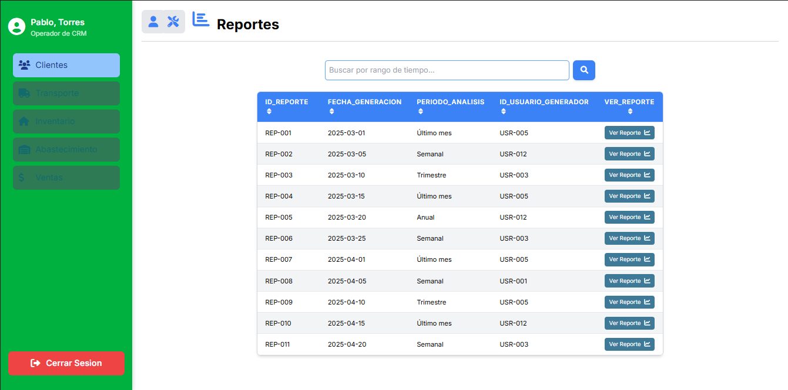 |

**Eventos:**

- Carga de Página:

    Se obtendra la lista de reportes

    ```sql
  --LISTA DE REPORTES
  SELECT
  R.COD_REPORTE AS ID_REPORTE,
  R.FECHA_CREACION_REPORTE AS FECHA_CREACION,
  R.PERIODO_REPORTE AS PERIODIO_REPORTE
  FROM MODULO_CLIENTES.REPORTE R
    ```

|Código Requerimiento |R-106|
|---|---|
|Código Interfaz| I-017|
|Imagen Interfaz| 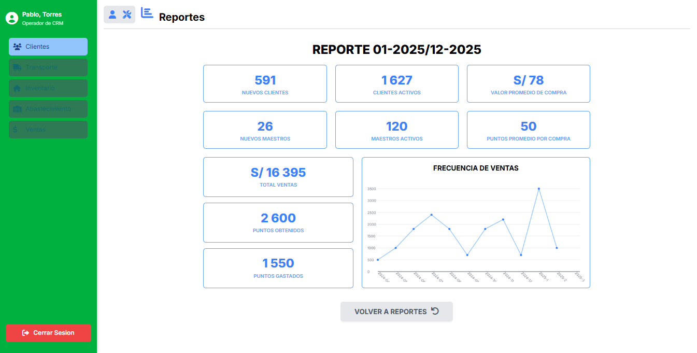 |

**Eventos:**

- Carga de Página:

    Se obtendra la lista de reportes

    ```sql
  --EJEMPLO DE REPORTE
  --NUEVOS CLIENTES
  SELECT 
  COUNT(C.*) AS "NUEVOS CLIENTES"
  FROM MODULO_CLIENTES.CLIENTE C
  WHERE C.FECHA_REGISTRO_CLIENTE BETWEEN '2025-08-08' AND '2025-11-12';
  --NUEVOS MAESTROS
  SELECT 
  COUNT(M.*) AS "NUEVOS MAESTROS"
  FROM MODULO_CLIENTES.MAESTRO M 
  WHERE M.FECHA_REGISTRO_MAESTRO  BETWEEN '2025-08-08' AND '2025-11-12';
  --CLIENTES ACTIVOS
  SELECT
  COUNT(C.*) AS "CLIENTES ACTIVOS"
  FROM MODULO_CLIENTES.CLIENTE C
  WHERE C.ULTIMA_ACTIVIDAD_CLIENTE BETWEEN '2025-08-08' AND '2025-11-12';
  --MAESTROS ACTIVOS
  SELECT 
  COUNT(M.*) AS "MAESTROS ACTIVOS"
  FROM MODULO_CLIENTES.MAESTRO M 
  WHERE M.ULTIMA_ACTIVIDAD_MAESTRO BETWEEN '2025-08-08' AND '2025-11-12';
  --VALOR COMPRA
  SELECT 
  AVG(V.MONTO_VENTA) AS "VALOR PROMEDIO DE COMPRA",
  SUM(V.MONTO_VENTA) AS "TOTAL VENTAS"
  FROM MODULO_CLIENTES.VENTA V 
  WHERE V.FECHA_HORA_VENTA BETWEEN '2025-08-08' AND '2025-11-12';
  --PUNTOS COMPRA
  SELECT 
  AVG(V.PUNTOS_VENTA) AS "VALOR PROMEDIO DE COMPRA",
  SUM(V.PUNTOS_VENTA) AS "PUNTOS OBTENIDOS"
  FROM MODULO_CLIENTES.VENTA V 
  WHERE V.FECHA_HORA_VENTA BETWEEN '2025-08-08' AND '2025-11-12' AND V.COD_MAESTRO IS NOT NULL;
  --PUNTOS GASTADOS
  SELECT
  SUM(C.MONTO_CANJE) AS "PUNTOS GASTADOS"
  FROM MODULO_CLIENTES.CANJE C 
  WHERE C.FECHA_HORA_CANJE BETWEEN '2025-08-08' AND '2025-11-12'
    ```


<hr>
<div align="center">
 [**📜 Índice**](../../README.md)
</div>
<hr>

